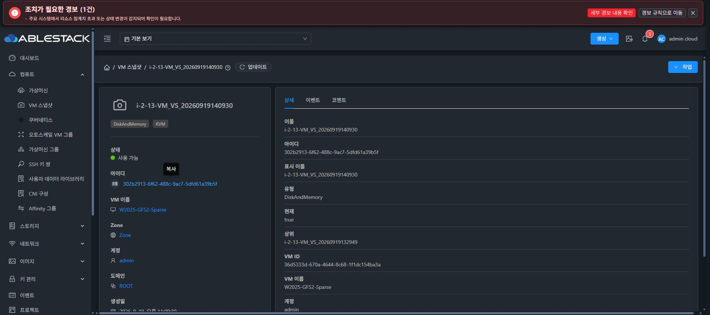
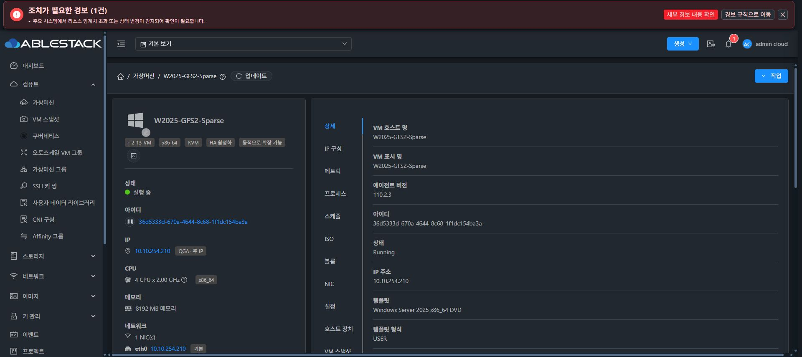
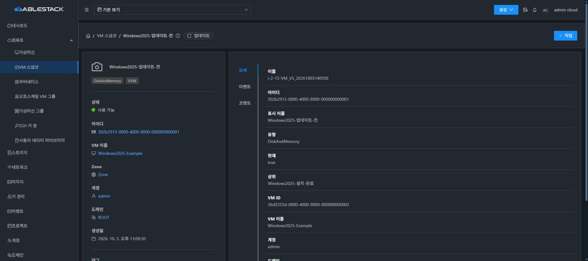
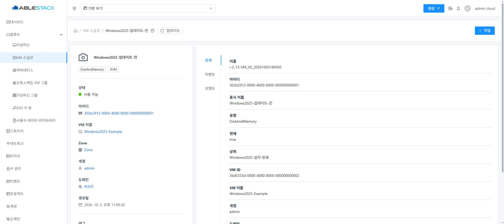
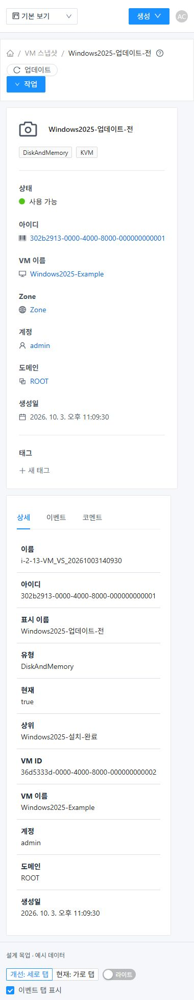

<!--
Licensed to the Apache Software Foundation (ASF) under one
or more contributor license agreements.  See the NOTICE file
distributed with this work for additional information
regarding copyright ownership.  The ASF licenses this file
to you under the Apache License, Version 2.0 (the
"License"); you may not use this file except in compliance
with the License.  You may obtain a copy of the License at

  http://www.apache.org/licenses/LICENSE-2.0

Unless required by applicable law or agreed to in writing,
software distributed under the License is distributed on an
"AS IS" BASIS, WITHOUT WARRANTIES OR CONDITIONS OF ANY
KIND, either express or implied.  See the License for the
specific language governing permissions and limitations
under the License.
-->

# VM 스냅샷 상세 화면 세로 탭 설계

Epic #1216의 추가 설계 작업이다. 2026-10-04 31번 클러스터에서 VM 스냅샷 상세와 가상머신 상세를 직접 비교했다. 화면의 **상세·이벤트·코멘트 탭 탐색 방향**을 가상머신 상세의 표준에 맞춘다.

## 확인한 차이

- VM 스냅샷: `compute.js`가 공통 `ResourceView.vue`에 상세·이벤트·코멘트를 전달한다. 공통 `a-tabs`에 tabPosition이 없어 데스크톱에서도 `ant-tabs-top`으로 표시된다. 실제 첫 세 탭의 y 좌표가 모두 261px였다.
- 가상머신: `InstanceTab.vue`는 `device === 'mobile' ? 'top' : 'left'`를 사용한다. 실제 `ant-tabs-left`의 첫 세 탭 y 좌표는 291·345·399px이며 공통 vars.less의 `padding: 8px 24px 8px 8px`를 사용한다.
- 두 화면 모두 기존 ResourceLayout의 좌측 요약 카드/우측 내용 카드를 사용한다. 탭 방향·여백을 같은 표준으로 맞추고 이 구조를 유지한다.

## 개선 방향

데스크톱·태블릿에서는 우측 내용 카드 안의 왼쪽에 상세 / 이벤트 / 코멘트를 세로로 나열하고 선택 탭 오른쪽에 기존 선택선을 표시한다. 본문은 탭 오른쪽의 기존 내용 영역을 사용한다. 좌측 요약 카드와 브레드크럼·업데이트·작업 메뉴·상세 필드·탭 이름 및 순서를 유지한다.

모바일(device=mobile, 기존 기준 max-width 765px)은 가상머신과 동일하게 상단 가로 탭으로 전환한다. 상세 필드의 긴 값은 줄바꿈하고 이벤트 표는 기존 표 내부 스크롤을 사용한다. 본문과 코멘트 입력은 화면 폭을 따른다. 다크/라이트 선택·비선택 텍스트, 경계선과 포커스는 공통 테마 토큰을 사용한다.

## 구현 계획

1. 공통 ResourceView에 명시적 탭 배치 옵션을 추가한다. 기본값은 기존 top이고, vertical 옵션의 device=mobile은 top / 나머지는 left로 해석한다.
2. AutogenView가 route meta의 상세 탭 배치 설정을 공통 ResourceView로 전달하고 `compute.js`의 vmsnapshot만 vertical로 지정한다. 새 전용 상세 페이지나 탭 컴포넌트를 복제하지 않는다.
3. 기존 공통 AntD 탭과 vars.less/theme 규칙을 재사용한다. 수평 전용 margin-top=-12px는 top에 적용하고 left는 가상머신과 같은 공통 카드 여백을 사용한다. 필요한 보완도 공통 배치 규칙으로 표현한다.
4. 기존 onTabChange/setActiveTab, ?tab=details/events/comments, 뒤로/앞으로·새로고침, showTab/권한 및 자원별·탭별 KeepAlive 키를 유지한다. 다른 자원으로 이동할 때 이전 스냅샷 내용을 재사용하지 않도록 회귀한다.
5. 공통 기본 배치와 opt-in/모바일, 조회/권한·탭 선택·캐시를 자동 검증하고 31번 실화면에서 탭 전환·조회/코멘트·브라우저 탐색·다크/라이트·390/1366/1920 폭을 검증한다. 구현 요청 시 UI 빌드·정적 자산 배포·WEB-INF/config 보존·served hash 검증을 기존 Epic 절차로 수행한다.

이 자료는 **이슈 설계와 목업**이다. 제품 ResourceView/AutogenView/compute.js의 코드는 변경하거나 31번에 배포하지 않았다. 추가 하위 작업을 구현·검증하기 전에는 Epic을 최종 완료로 종료하지 않는다.

## Vue 3 목업 실행

[mockup.zip](mockup.zip)을 풀고 mockup.html을 브라우저에서 연다. HTML은 Vue 앱 마운트 진입점이다. Vue 3.2.37와 현재 Ant Design Vue 3.2.20을 로컬 번들로 포함하며 외부 CDN이나 Cloud API 호출이 없다. 모든 이름·UUID·이벤트·코멘트는 예시 값이다. 작업 메뉴는 시연 안내만 보여 주며 코멘트 추가는 메모리 내 예시 목록만 갱신한다.

하단 ‘목업 시연 도구’에서 현재 가로 / 개선 세로, 다크/라이트, 이벤트 가시성을 비교한다. 이 도구는 제품 화면에 추가할 요소가 아니다. 링크의 theme/layout/tab/events 값으로 상태를 다시 열 수 있다. 모바일에서는 두 모드 모두 표준 상단 탭을 사용한다.

- [Vue SFC](src/App.vue) · [진입점](src/main.js) · [빌드 스크립트](build.cjs) · [실제 빌드 버전/공유 파일](assets/build-info.json).
- 현재 소스의 `ResourceLayout.vue`, `Status.vue`, `style/vars.less`, `style/dark-mode.less`, `style/theme/*.less`를 직접 사용한다. 예시 카드와 필드·이벤트·코멘트는 기존 AntD Card/List/Table/Form 컴포넌트로 구성한다. 제품 구현에서는 기존 DetailsTab/EventsTab/AnnotationsTab을 그대로 연결한다.
- WSL ext4 clone의 설치된 UI 의존성으로 `node docs/design/vm-snapshot-detail-tabs-20261004/build.cjs`를 실행했다. 이 명령은 설계 앱만 번들링한다.
- [목업 화면/동작 검증](verification.ko.md).

