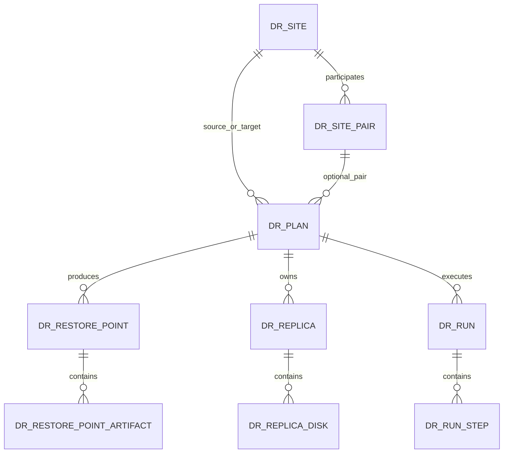

# Cross Hypervisor DR Domain And Schema Design

작성일: 2026-06-30

대상 브랜치: `feature/ftctl-cloud-integration`

상위 문서: [500-cross-hypervisor-dr-architecture-plan-20260630.md](500-cross-hypervisor-dr-architecture-plan-20260630.md)

Credential 보강 문서: [527-cross-hypervisor-dr-site-credential-management-design-20260702.md](527-cross-hypervisor-dr-site-credential-management-design-20260702.md)

Site health/delete 정합성 보강 문서: [528-cross-hypervisor-dr-site-health-check-and-delete-consistency-design-20260702.md](528-cross-hypervisor-dr-site-health-check-and-delete-consistency-design-20260702.md)

Site inventory/상세 UX 보강 문서: [530-cross-hypervisor-dr-site-inventory-and-detail-ux-design-20260703.md](530-cross-hypervisor-dr-site-inventory-and-detail-ux-design-20260703.md)

## 1. 목적

이 문서는 `Cross Hypervisor DR`의 공통 도메인 모델과 논리 DB schema를 구체화한다.

범위는 설계까지다. 이 문서는 migration SQL, DAO, Java entity 구현을 만들지 않는다. 구현 시에는 이 문서의 테이블/상태/관계 정의를 기준으로 별도 upgrade path와 DAO를 작성한다.

## 2. 설계 원칙

- VM 보호 정책은 VM 단위 `DrPlan`이 소유한다.
- site/pairing은 `DrSite`, `DrSitePair`가 소유하고, 기존 `DisasterRecoveryCluster`는 호환 계층으로 연결한다.
- 복구 가능 시점은 `DrRestorePoint`로 관리한다.
- target site에 실제로 준비된 VM과 디스크는 `DrReplica`와 하위 disk/artifact 모델로 관리한다.
- 실행 이력과 현재 진행 중인 작업은 `DrRun`, `DrRunStep`으로 추적한다.
- UI/API response에는 secret을 직접 저장하거나 반환하지 않는다. UI는 Mold/vCenter 인증정보를 write-only로 입력받고, backend는 `dr_site_credential.secret_payload`를 암호화 저장한 뒤 `dr_site.credential_id`로 현재 credential을 참조한다.
- 기존 FTCTL/V2K/VMware 기능은 각 엔진 binding으로 연결하고, 기존 성공 로직은 도메인 모델 아래로 흡수한다.

## 3. 도메인 관계

## 4. 공통 enum

`DrSiteType`

- `MOLD_KVM`
- `MOLD_VMWARE`
- `VMWARE_DIRECT`

`DrHypervisorType`

- `KVM`
- `VMWARE`

`DrPlanDirection`

- `KVM_TO_KVM`
- `KVM_TO_VMWARE`
- `VMWARE_TO_VMWARE`
- `VMWARE_TO_KVM`

`DrPlanState`

- `CREATED`
- `ENABLED`
- `SYNCING`
- `READY`
- `TESTING`
- `FAILED_OVER`
- `FAILBACK_READY`
- `REPROTECTING`
- `PAUSED`
- `ERROR`
- `REMOVED`

`DrRestorePointState`

- `CREATING`
- `SOURCE_READY`
- `MATERIALIZING`
- `TARGET_READY`
- `FAILED`
- `EXPIRED`
- `REMOVED`

`DrReplicaState`

- `NONE`
- `SKELETON_CREATING`
- `SKELETON_READY`
- `DISK_MATERIALIZING`
- `TARGET_READY`
- `TEST_RUNNING`
- `FAILED_OVER`
- `STALE`
- `ERROR`
- `REMOVED`

`DrRunType`

- `SYNC`
- `TEST_FAILOVER`
- `FAILOVER`
- `FAILBACK`
- `REPROTECT`
- `PAUSE`
- `RESUME`
- `DELETE`
- `ADOPT`

`DrRunState`

- `QUEUED`
- `RUNNING`
- `WAITING_MANUAL_CONFIRM`
- `SUCCEEDED`
- `FAILED`
- `CANCELLED`
- `ROLLBACK_REQUIRED`
- `ROLLED_BACK`

`DrSiteHealthState`

- `CONNECTED`
- `DEGRADED`
- `DISCONNECTED`
- `UNKNOWN`

`UNKNOWN`은 아직 점검하지 않았거나 지원되지 않는 조합처럼 판정할 수 없는 상태에만 사용한다. credential 누락, 인증 실패, 네트워크 실패는 `DISCONNECTED`와 reason code로 표현한다.

## 5. Table: `dr_site`

`dr_site`는 Mold 또는 VMware endpoint를 나타낸다.

| column | type | nullable | 설명 |
| --- | --- | --- | --- |
| `id` | bigint | no | internal id |
| `uuid` | varchar(40) | no | API id |
| `name` | varchar(255) | no | 표시 이름 |
| `site_type` | varchar(32) | no | `DrSiteType` |
| `hypervisor_type` | varchar(32) | no | site 기본 hypervisor |
| `endpoint` | varchar(1024) | yes | Mold API URL 또는 vCenter URL |
| `credential_id` | bigint | yes | 현재 active `dr_site_credential.id` |
| `credential_ref` | varchar(255) | yes | legacy 호환 필드. 신규 UI/API 입력으로 사용하지 않음 |
| `zone_id` | bigint | yes | local Cloud internal Zone id. 원격 inventory UUID 저장용이 아님 |
| `zone_external_id` | varchar(255) | yes | 원격 Mold/vCenter Zone id 또는 uuid |
| `zone_name` | varchar(255) | yes | 원격 Zone 표시 이름 |
| `vmware_dc_id` / `vmware_datacenter_id` | bigint | yes | local VMware datacenter mapping id. 원격 inventory UUID/MoRef 저장용이 아님 |
| `vmware_datacenter_external_id` | varchar(255) | yes | 원격 VMware datacenter id, uuid 또는 MoRef |
| `vmware_datacenter_name` | varchar(255) | yes | 원격 VMware datacenter 표시 이름 |
| `capabilities_json` | text | yes | datastore/network/fencing capability snapshot |
| `state` | varchar(32) | no | 구현 기준 `ENABLED`, `DISABLED`. 기존 논리 문서의 `status`에 해당 |
| `health_state` | varchar(32) | yes | 최근 site health 결과. `CONNECTED`, `DEGRADED`, `DISCONNECTED`, `UNKNOWN` |
| `last_checked` | datetime | yes | 최근 check 시각 |
| `created` | datetime | no | 생성 시각 |
| `removed` | datetime | yes | 삭제 시각 |

구현 시점의 schema는 `state`, `health_state`, `last_checked`, `capabilities_json`을 사용한다. health reason/message는 우선 `capabilities_json.healthCheck`에 저장한다. 별도 `last_check_reason_code`, `last_check_message` 컬럼은 [528 문서](528-cross-hypervisor-dr-site-health-check-and-delete-consistency-design-20260702.md)의 hardening 후보로 관리한다.

권장 index:

- unique: `uuid`
- unique active: `name`, `removed`
- lookup: `site_type`, `hypervisor_type`, `state`
- lookup: `zone_id`, `vmware_dc_id` 또는 `vmware_datacenter_id`
- lookup: `zone_external_id`, `vmware_datacenter_external_id`
- lookup: `credential_id`

### 5.1 Table: `dr_site_credential`

`dr_site_credential`는 DR site 접속에 필요한 Mold/vCenter 인증정보를 암호화 저장한다. 사용자는 credential reference를 입력하지 않는다.

| column | type | nullable | 설명 |
| --- | --- | --- | --- |
| `id` | bigint | no | internal id |
| `uuid` | varchar(40) | no | API id |
| `site_id` | bigint | no | parent `dr_site.id` |
| `credential_type` | varchar(32) | no | `MOLD_API`, `VCENTER` |
| `endpoint` | varchar(1024) | yes | 연결 대상 URL |
| `principal` | varchar(255) | yes | 표시 가능한 계정명. API key 원문은 저장하지 않음 |
| `secret_payload` | text | no | `@Encrypt` 또는 `DBEncryptionUtil`로 암호화한 credential JSON |
| `secret_fingerprint` | varchar(128) | yes | rotation/audit용 hash |
| `state` | varchar(32) | no | 구현 기준 `CONFIGURED`, `CLEARED`. 확장 후보 `INVALID`, `LEGACY_REF`, `REMOVED` |
| `last_validated` | datetime | yes | 마지막 연결 검증 시각 |
| `last_validation_result` | varchar(32) | yes | `CONNECTED`, `DEGRADED`, `DISCONNECTED`, `UNKNOWN` |
| `last_validation_message` | text | yes | 마지막 검증 메시지 |
| `created` | datetime | no | 생성 시각 |
| `updated` | datetime | yes | 갱신 시각 |
| `removed` | datetime | yes | 삭제 시각 |

권장 index:

- unique: `uuid`
- lookup: `site_id`, `removed`
- lookup: `credential_type`, `state`

Usable credential 조회는 `site_id`, `state=CONFIGURED`, `removed IS NULL`을 모두 만족해야 한다. `dr_site.credential_id`가 있으면 해당 id와 site id가 일치하는 configured row를 우선 사용한다. `CLEARED` row는 active credential이 아니며 `credentialconfigured=true`로 응답하면 안 된다.

## 6. Table: `dr_site_pair`

`dr_site_pair`는 기존 `DisasterRecoveryCluster`와 가장 가까운 site pairing 모델이다.

| column | type | nullable | 설명 |
| --- | --- | --- | --- |
| `id` | bigint | no | internal id |
| `uuid` | varchar(40) | no | API id |
| `name` | varchar(255) | no | 표시 이름 |
| `source_site_id` | bigint | no | source `dr_site.id` |
| `target_site_id` | bigint | no | target `dr_site.id` |
| `direction` | varchar(32) | no | 기본 방향 |
| `legacy_dr_cluster_id` | bigint | yes | 기존 `disaster_recovery_cluster.id` 연결 |
| `status` | varchar(32) | no | `ENABLED`, `DISABLED`, `ERROR`, `REMOVED` |
| `created` | datetime | no | 생성 시각 |
| `removed` | datetime | yes | 삭제 시각 |

호환 규칙:

- 기존 `createDisasterRecoveryCluster` 결과는 신규 구현에서 `dr_site_pair`로 투영 가능해야 한다.
- 기존 DR cluster를 삭제하지 않고, 신규 `DrPlan`은 `legacy_dr_cluster_id`를 통해 역참조할 수 있어야 한다.

## 7. Table: `dr_plan`

`dr_plan`은 사용자에게 보이는 VM 단위 보호 정책이다.

| column | type | nullable | 설명 |
| --- | --- | --- | --- |
| `id` | bigint | no | internal id |
| `uuid` | varchar(40) | no | API id |
| `name` | varchar(255) | no | 표시 이름 |
| `account_id` | bigint | no | 소유 계정 |
| `domain_id` | bigint | no | 소유 도메인 |
| `source_site_id` | bigint | no | source site |
| `target_site_id` | bigint | no | target site |
| `site_pair_id` | bigint | yes | 선택적 site pair |
| `source_vm_id` | bigint | yes | Mold managed VM이면 `vm_instance.id` |
| `source_external_ref` | varchar(1024) | yes | VMware MoRef 등 외부 source id |
| `source_hypervisor_type` | varchar(32) | no | source hypervisor |
| `target_hypervisor_type` | varchar(32) | no | target hypervisor |
| `direction` | varchar(32) | no | `DrPlanDirection` |
| `state` | varchar(32) | no | `DrPlanState` |
| `rpo_policy_seconds` | bigint | yes | 목표 source RPO |
| `target_ready_rpo_policy_seconds` | bigint | yes | 목표 target-ready RPO |
| `rto_policy_seconds` | bigint | yes | 목표 RTO |
| `schedule_json` | text | yes | backend-generated sync schedule canonical JSON |
| `mapping_json` | text | yes | backend-generated VM/disk/storage/compute/network mapping canonical JSON |
| `policy_json` | text | yes | backend-generated failover/test/retry/transport policy canonical JSON |
| `quiesce_policy_json` | text | yes | backend-generated QGA/VMware Tools/application consistency policy canonical JSON |
| `compatibility_json` | text | yes | driver, controller, guest OS check 결과 |
| `engine_binding_type` | varchar(64) | yes | `FTCTL_DR`, `FTCTL`, `V2K`, `VMWARE_NATIVE`, `KVM_SNAPSHOT` |
| `engine_binding_id` | bigint | yes | `ftctl_protection.id` 등 |
| `last_restore_point_id` | bigint | yes | 최근 source-ready restore point |
| `last_target_ready_restore_point_id` | bigint | yes | 최근 target-ready restore point |
| `last_run_id` | bigint | yes | 최근 run |
| `last_error` | text | yes | 최근 오류 |
| `created` | datetime | no | 생성 시각 |
| `removed` | datetime | yes | 삭제 시각 |

2026-07-05 구현 기준 보정:

- 초기 논리 모델은 storage/network/compute/fencing mapping을 분리해서 설명했지만, 현재 Cloud 구현과 guided spec 설계는 위 consolidated column을 기준으로 한다.
- `mapping_json`에는 target VM, disk, storage, compute, network mapping을 `schemaVersion`과 함께 저장한다.
- `policy_json`에는 failover/test/retry/transport policy를 저장한다.
- 사용자가 raw JSON을 직접 입력하는 것이 아니라 backend `DrPlanSpecBuilder`가 canonical JSON을 생성한다.
- 상세 구현 기준은 [531-cross-hypervisor-dr-plan-guided-spec-design-20260705.md](531-cross-hypervisor-dr-plan-guided-spec-design-20260705.md)를 따른다.

권장 index:

- unique: `uuid`
- lookup: `account_id`, `domain_id`, `removed`
- lookup: `source_vm_id`, `removed`
- lookup: `source_site_id`, `target_site_id`, `state`
- lookup: `direction`, `state`
- lookup: `engine_binding_type`, `engine_binding_id`

## 8. Table: `dr_restore_point`

`dr_restore_point`는 VM-consistent 복구 단위다. 다중 volume snapshot은 하나의 restore point에 묶는다.

| column | type | nullable | 설명 |
| --- | --- | --- | --- |
| `id` | bigint | no | internal id |
| `uuid` | varchar(40) | no | API id |
| `plan_id` | bigint | no | `dr_plan.id` |
| `sequence_no` | bigint | no | plan 내 증가 번호 |
| `state` | varchar(32) | no | `DrRestorePointState` |
| `source_captured_at` | datetime | yes | source snapshot/checkpoint 완료 시각 |
| `target_ready_at` | datetime | yes | target materialization 완료 시각 |
| `source_rpo_seconds` | bigint | yes | 현재 시점 기준 source RPO |
| `target_ready_rpo_seconds` | bigint | yes | 현재 시점 기준 target-ready RPO |
| `consistency_type` | varchar(32) | yes | `CRASH`, `FILESYSTEM`, `APPLICATION` |
| `quiesce_result` | varchar(32) | yes | `OK`, `SKIPPED`, `FAILED`, `WARN` |
| `source_snapshot_ref` | varchar(1024) | yes | source snapshot/checkpoint id |
| `metadata_json` | text | yes | guest, disk, controller, generation metadata |
| `error_message` | text | yes | 실패 원인 |
| `created` | datetime | no | 생성 시각 |
| `removed` | datetime | yes | 삭제 시각 |

권장 index:

- unique: `plan_id`, `sequence_no`
- lookup: `plan_id`, `state`, `removed`
- lookup: `plan_id`, `target_ready_at`

## 9. Table: `dr_restore_point_artifact`

`dr_restore_point_artifact`는 restore point를 구성하는 volume/disk 단위 artifact다.

| column | type | nullable | 설명 |
| --- | --- | --- | --- |
| `id` | bigint | no | internal id |
| `uuid` | varchar(40) | no | API id |
| `restore_point_id` | bigint | no | `dr_restore_point.id` |
| `source_volume_id` | bigint | yes | Mold volume id |
| `source_disk_ref` | varchar(1024) | yes | VMware disk key, datastore path 등 |
| `disk_label` | varchar(128) | yes | `ROOT`, `DATA-1`, target device label |
| `source_format` | varchar(32) | yes | `rbd`, `qcow2`, `raw`, `vmdk` |
| `artifact_format` | varchar(32) | yes | artifact format |
| `artifact_uri` | varchar(2048) | yes | secondary/object/datastore URI |
| `parent_artifact_id` | bigint | yes | incremental chain parent |
| `size_bytes` | bigint | yes | 논리 크기 |
| `changed_bytes` | bigint | yes | incremental changed bytes |
| `checksum` | varchar(255) | yes | 선택적 checksum |
| `state` | varchar(32) | no | `CREATING`, `READY`, `FAILED`, `EXPIRED` |
| `metadata_json` | text | yes | engine별 metadata |
| `created` | datetime | no | 생성 시각 |
| `removed` | datetime | yes | 삭제 시각 |

## 10. Table: `dr_replica`

`dr_replica`는 target site에서 준비된 대기 VM과 target readiness를 나타낸다.

| column | type | nullable | 설명 |
| --- | --- | --- | --- |
| `id` | bigint | no | internal id |
| `uuid` | varchar(40) | no | API id |
| `plan_id` | bigint | no | `dr_plan.id` |
| `target_site_id` | bigint | no | target site |
| `state` | varchar(32) | no | `DrReplicaState` |
| `target_vm_id` | bigint | yes | KVM target이면 `vm_instance.id` |
| `target_external_ref` | varchar(1024) | yes | VMware MoRef 등 |
| `target_name` | varchar(255) | yes | target VM name |
| `target_power_state` | varchar(32) | yes | `POWERED_OFF`, `POWERED_ON`, `UNKNOWN` |
| `latest_restore_point_id` | bigint | yes | 연결된 최신 restore point |
| `latest_target_ready_at` | datetime | yes | 최신 target ready 시각 |
| `test_boot_status` | varchar(32) | yes | `NEVER`, `OK`, `WARN`, `FAILED` |
| `test_boot_at` | datetime | yes | 최근 test boot 시각 |
| `runtime_state_json` | text | yes | FTCTL/QMP/VMware runtime projection |
| `error_message` | text | yes | 최근 오류 |
| `created` | datetime | no | 생성 시각 |
| `removed` | datetime | yes | 삭제 시각 |

권장 index:

- unique active: `plan_id`, `removed`
- lookup: `target_vm_id`, `removed`
- lookup: `target_external_ref`, `removed`
- lookup: `state`, `latest_target_ready_at`

## 11. Table: `dr_replica_disk`

`dr_replica_disk`는 target VM의 disk materialization 상태다.

| column | type | nullable | 설명 |
| --- | --- | --- | --- |
| `id` | bigint | no | internal id |
| `uuid` | varchar(40) | no | API id |
| `replica_id` | bigint | no | `dr_replica.id` |
| `restore_point_artifact_id` | bigint | yes | source artifact |
| `target_volume_id` | bigint | yes | KVM target volume id |
| `target_disk_ref` | varchar(2048) | yes | VMware VMDK path 등 |
| `target_format` | varchar(32) | yes | `qcow2`, `raw`, `vmdk`, `rbd` |
| `controller_type` | varchar(64) | yes | `SCSI`, `IDE`, `NVME`, `VIRTIO` 등 |
| `controller_key` | varchar(128) | yes | VMware controller key 등 |
| `unit_number` | int | yes | target bus unit |
| `state` | varchar(32) | no | `MISSING`, `MATERIALIZING`, `READY`, `STALE`, `FAILED` |
| `materialized_at` | datetime | yes | 준비 완료 시각 |
| `metadata_json` | text | yes | disk별 metadata |
| `created` | datetime | no | 생성 시각 |
| `removed` | datetime | yes | 삭제 시각 |

## 12. Table: `dr_run`

`dr_run`은 sync/test/failover/failback/reprotect 실행 단위다.

| column | type | nullable | 설명 |
| --- | --- | --- | --- |
| `id` | bigint | no | internal id |
| `uuid` | varchar(40) | no | API id |
| `plan_id` | bigint | no | `dr_plan.id` |
| `run_type` | varchar(32) | no | `DrRunType` |
| `state` | varchar(32) | no | `DrRunState` |
| `requested_by` | varchar(255) | yes | user/account/system |
| `restore_point_id` | bigint | yes | 대상 restore point |
| `replica_id` | bigint | yes | 대상 replica |
| `idempotency_key` | varchar(255) | yes | API retry 방지 |
| `started` | datetime | yes | 시작 시각 |
| `finished` | datetime | yes | 종료 시각 |
| `progress_percent` | int | yes | UI 표시용 |
| `current_step` | varchar(128) | yes | 현재 step |
| `rollback_context_json` | text | yes | rollback/adopt/failback 근거 |
| `error_code` | varchar(128) | yes | 표준 오류 코드 |
| `error_message` | text | yes | 오류 상세 |
| `created` | datetime | no | 생성 시각 |
| `removed` | datetime | yes | 삭제 시각 |

권장 index:

- unique nullable: `plan_id`, `idempotency_key`
- lookup: `plan_id`, `run_type`, `state`
- lookup: `state`, `created`

## 13. Table: `dr_run_step`

`dr_run_step`은 사람이 추적 가능한 실행 세부 단계다.

| column | type | nullable | 설명 |
| --- | --- | --- | --- |
| `id` | bigint | no | internal id |
| `run_id` | bigint | no | `dr_run.id` |
| `step_order` | int | no | 순서 |
| `step_name` | varchar(128) | no | 단계 이름 |
| `state` | varchar(32) | no | `QUEUED`, `RUNNING`, `SUCCEEDED`, `FAILED`, `SKIPPED` |
| `started` | datetime | yes | 시작 시각 |
| `finished` | datetime | yes | 종료 시각 |
| `progress_percent` | int | yes | 단계 진행률 |
| `external_job_ref` | varchar(255) | yes | Cloud async job, task id 등 |
| `summary` | text | yes | UI 표시 요약 |
| `details_json` | text | yes | adapter별 상세 |
| `error_code` | varchar(128) | yes | 표준 오류 코드 |
| `error_message` | text | yes | 오류 상세 |

## 14. Table: `dr_event`

`dr_event`는 runtime event relay와 audit 보조 용도다. 장기 저장은 retention 정책을 적용한다.

| column | type | nullable | 설명 |
| --- | --- | --- | --- |
| `id` | bigint | no | internal id |
| `plan_id` | bigint | yes | 연관 plan |
| `run_id` | bigint | yes | 연관 run |
| `event_type` | varchar(128) | no | `sync.progress`, `fence.required` 등 |
| `severity` | varchar(32) | no | `INFO`, `WARN`, `ERROR` |
| `source` | varchar(64) | no | `ORCH`, `FTCTL`, `VMWARE`, `V2K` |
| `message` | text | yes | 사람이 읽을 메시지 |
| `details_json` | text | yes | structured event |
| `created` | datetime | no | 생성 시각 |

## 15. 기존 모델과의 연결

| 기존 모델 | 신규 연결 | 원칙 |
| --- | --- | --- |
| `disaster_recovery_cluster` | `dr_site_pair.legacy_dr_cluster_id` | 기존 site/pairing API 호환 |
| `ftctl_protection` | `dr_plan.engine_binding_type=FTCTL`, `engine_binding_id` | FTCTL 성공 로직 보존 |
| `vm_instance_details ftctl.*` | `dr_replica.runtime_state_json` 또는 projection | runtime state는 중복 저장 최소화 |
| VMware datacenter mapping | `dr_site.vmware_dc_id` | VMware site capability로 사용 |
| Mold/vCenter credential | `dr_site.credential_id`, `dr_site_credential` | UI write-only credential을 backend가 암호화 저장 |
| V2K import task | `dr_run.external_job_ref`, `engine_binding_type=V2K` | 사용자가 V2K 세부 단계를 직접 다루지 않게 감쌈 |

## 16. Retention 정책

- `dr_restore_point`: plan별 최소 보존 개수와 시간 기반 retention을 함께 둔다.
- `dr_restore_point_artifact`: parent chain이 있는 경우 child가 남아 있으면 parent를 삭제하지 않는다.
- `dr_run`: 운영 감사 용도로 최근 N일 또는 최근 N개를 보존한다.
- `dr_event`: UI 실시간 표시용과 장기 audit용을 분리할 수 있다.

## 17. 구현 전 확인 과제

1. `uuid` 생성과 API id 노출 방식은 기존 CloudStack entity pattern을 따른다.
2. JSON column은 초기 구현 속도를 위해 text로 시작하되, 자주 조회하는 값은 별도 column으로 승격한다.
3. credential 저장소는 `dr_site_credential`를 기준으로 구현하고, secret field에는 Cloud DB 암호화 패턴인 `@Encrypt` 또는 `DBEncryptionUtil`를 적용한다.
4. `target_ready_rpo_seconds` 계산은 `target_ready_at`과 현재 시각 기준으로 표준화한다.
5. 기존 `DisasterRecoveryCluster` API wrapper가 신규 테이블을 언제 생성할지 결정해야 한다.
6. FTCTL projection은 중복 저장으로 인해 source of truth가 흔들리지 않도록 읽기 우선 정책을 명확히 해야 한다.

## 18. AS-IS / TO-BE 요약

| 구분 | AS-IS | TO-BE |
| --- | --- | --- |
| 보호 단위 | FTCTL protection, DR cluster 등 기능별 모델 | `DrPlan` 중심의 공통 보호 단위 |
| 사이트 모델 | 기존 DR cluster가 site/pairing 의미를 함께 가짐 | `DrSite`와 `DrSitePair`로 site와 pairing 분리 |
| 복제 결과 | 기능별 detail/protection/runtime 값에 분산 | `DrReplica`, `DrReplicaDisk`, `DrRestorePoint`로 표준화 |
| 실행 이력 | Cloud async job 또는 외부 엔진 로그에 의존 | `DrRun`, `DrRunStep`, `DrEvent`로 장기 추적 |
| 확장성 | FTCTL/VMware/V2K마다 별도 상태 표현 | source/target hypervisor와 engine binding을 공통 schema에서 표현 |

## 19. 2026-07-03 Remote Site Inventory Identity 보정

상세 설계는 [530-cross-hypervisor-dr-site-inventory-and-detail-ux-design-20260703.md](530-cross-hypervisor-dr-site-inventory-and-detail-ux-design-20260703.md)의
`Remote Inventory ID 모델 보정` 절을 따른다.

도메인 원칙:

- `dr_site.zone_id`와 `dr_site.vmware_datacenter_id`는 로컬 Cloud DB 내부 `bigint` 참조다.
- 원격 Mold/vCenter에서 조회한 Zone/Datacenter는 로컬 내부 id가 아니므로 별도 external identity로 저장한다.
- 신규 DR Site inventory UI/API는 external identity를 기본 선택값으로 사용한다.
- UUID 형태의 원격 Zone id는 정상적인 식별자이며, 선택 불가 상태로 취급하면 안 된다.

`dr_site` 논리 schema 보강:

| column | type | nullable | 설명 |
| --- | --- | --- | --- |
| `zone_external_id` | varchar(255) | yes | 원격 Mold/vCenter Zone id 또는 uuid |
| `zone_name` | varchar(255) | yes | 원격 Zone 표시 이름 |
| `vmware_datacenter_external_id` | varchar(255) | yes | 원격 VMware DC id, uuid 또는 MoRef |
| `vmware_datacenter_name` | varchar(255) | yes | 원격 VMware DC 표시 이름 |

조회/표시 우선순위:

1. UI 표시명은 `zone_name`, `vmware_datacenter_name`을 우선 사용한다.
2. backend/adapter가 원격 API를 호출할 때는 `zone_external_id`, `vmware_datacenter_external_id`를 우선 사용한다.
3. local Cloud DAO/FK 조회가 필요한 경우에만 `zone_id`, `vmware_datacenter_id`를 사용한다.
## 2026-07-10 Normative Checkpoint Terminology

Cross Hypervisor DR does not provide point-in-time recovery. Existing
`DrRestorePoint` entity and `dr_restore_point` table names are persistence
compatibility names only. Product, UI, and new API contracts use
`Synchronization Checkpoint`. Historical checkpoint rows are synchronization
evidence and are not user-selectable rollback targets.

The normative schema correction, deduplication key, run/sequence fields, and
compatibility rules are defined in
`549-cross-hypervisor-dr-checkpoint-history-event-rpo-design-20260710.md`.

## 2026-07-10 Normative Protection View Cache Entity

Add `DrPlanViewCache` / `dr_plan_view_cache` as a read-model entity separate
from authoritative Plan, Run, Replica, and synchronization checkpoint rows.
It stores one schema-versioned, redacted JSON snapshot per Plan, a payload
hash/revision, projection timestamps, expiry, and the next background refresh
time. It never stores credentials or complete raw FTCTL status.

`DrRestorePoint` remains the compatibility entity name, but a row is
user-visible only when it represents a latest-completed FTCTL checkpoint.
Current transfer sequence and latest completed sequence are different domain
values and must not be collapsed.

Detailed schema and lifecycle rules:
`550-cross-hypervisor-dr-protection-view-cache-and-completed-checkpoint-design-20260710.md`.

## 2026-07-14 Normative Cutover Session Entities

Add `DrCutoverSession` and `DrCutoverDisk` as authoritative operational
entities. A session binds one Test Failover or real Failover Run to a sealed
checkpoint, guest preparation state, transient domain or target VM, boot
validation, and cleanup requirement. Disk rows bind each checkpoint disk to
its writable or rollback artifact.

These entities are soft-deleted after complete cleanup. `DrRun.detailsJson`,
FTCTL status, and `dr_plan_view_cache` are projections and cannot replace the
artifact authority required for crash recovery. Detailed columns and indexes:

- `554-cross-hypervisor-dr-vmware-to-kvm-cutover-and-virtio-bootstrap-design-20260714.md`

### 2026-07-14 VMware CBT Cycle Schema Addendum

The older restore-point artifact model does not replace cycle-level replication
evidence. VMware CBT baselines use typed `dr_replica_disk` generation/changeId
columns plus `dr_sync_cycle` and `dr_sync_cycle_disk` history as defined in
`555-cross-hypervisor-dr-vmware-cbt-incremental-and-transfer-metrics-design-20260714.md`.

### 2026-07-16 Cycle Commit Evidence Addendum

Cycle history distinguishes `DATA_COPIED` from a committed checkpoint.
`dr_sync_cycle` and `dr_sync_cycle_disk` retain typed commit state, copied-byte
metrics, source checkpoint/change identity, and normalized failure evidence.
The complete FTCTL status remains a bounded read projection and is not copied
into Plan or Run error text.

The corrective release does not require a new table. Existing cycle, step,
event, replica-disk, and status JSON fields carry the first implementation;
schema expansion is considered only if query or retention measurements show a
separate journal projection is required.

Detailed persistence contract:
`557-cross-hypervisor-dr-cycle-commit-and-api-json-recovery-design-20260716.md`.

### 2026-07-17 Cycle Decision Persistence Addendum

`dr_sync_cycle` stores the requested mode separately from effective mode and
adds typed automatic-reseed, decision-code, and invalid-baseline-disk counts.
`dr_plan_runtime` stores latest completed incremental proof and the consecutive
automatic-reseed count used by readiness. Per-disk decision detail remains in
the FTCTL journal rather than an opaque Cloud JSON column. Forward-only schema,
backfill, and ownership rules are defined in
`559-cross-hypervisor-dr-incremental-mode-decision-and-cycle-projection-design-20260717.md`.

## 2026-07-19 Test Session Domain Addendum

Test Failover uses authoritative `dr_test_session` and `dr_test_disk` entities.
A Run records the start/cleanup action; the session records the active temporary
Cloud VM, selected network, checkpoint, engine session, validation state, and
cleanup residuals. Test entities must not be folded into
`dr_cutover_session`, because Test Failover is reversible and temporary while
real Failover changes active-side authority.

Column-level design and ownership rules are normative in
`561-cross-hypervisor-dr-cloud-managed-test-failover-lifecycle-design-20260719.md`.
