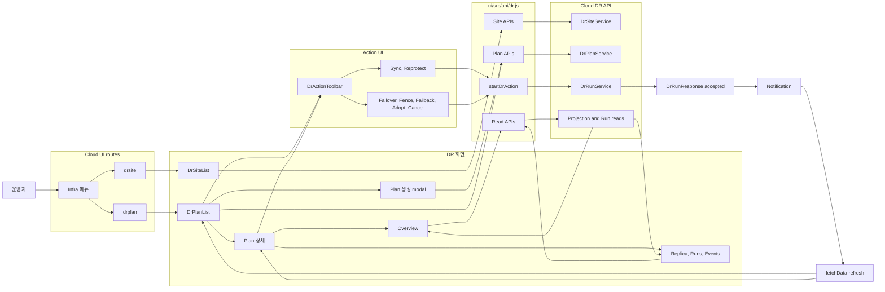
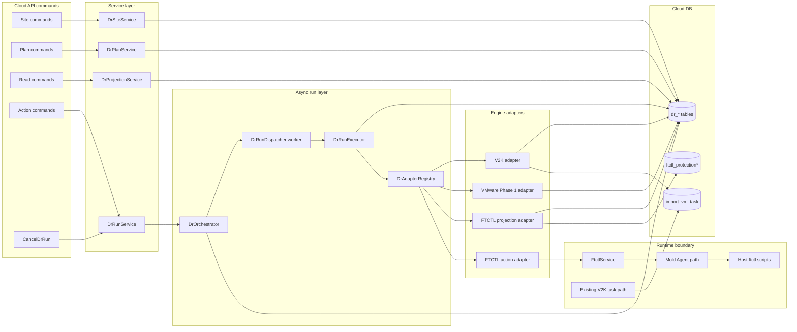
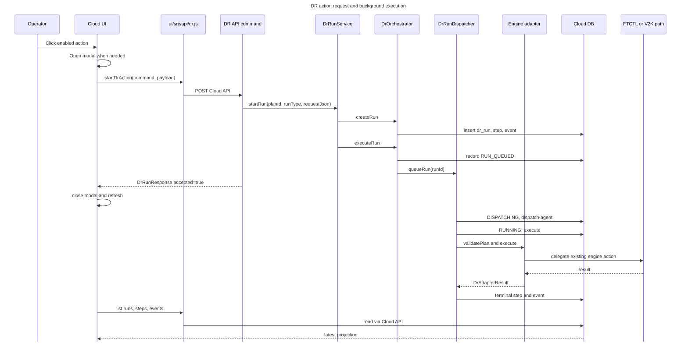
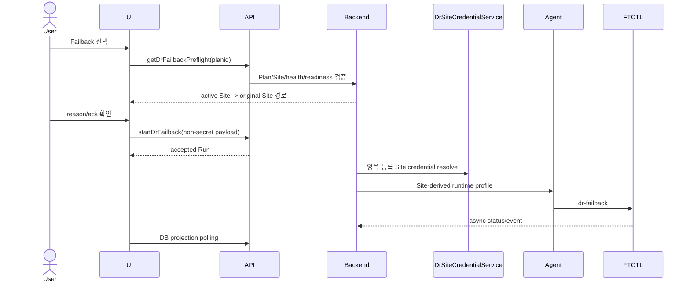
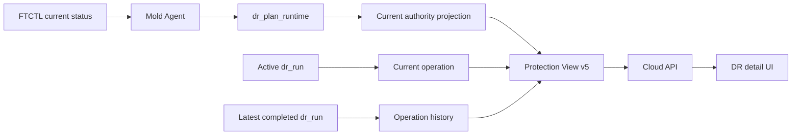
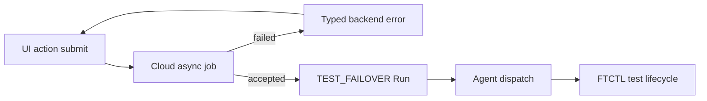

# Cross Hypervisor DR UI And Backend Flow Diagrams

> 2026-07-31 latest correction: the user selects Failback or Reprotect and
> source isolation is an internal preflight. See document 587.

## Direction-Specific Split Documents

이 통합 문서는 전체 흐름 참고용이다. 방향별 리뷰와 구현 판단은 다음 분리 문서를 기준으로 한다.

실제 구현 목표와 작업 순서는 [520-cross-hypervisor-dr-full-implementation-work-plan-20260701.md](520-cross-hypervisor-dr-full-implementation-work-plan-20260701.md)를 기준으로 한다. 이 문서는 `VMWARE_PHASE1`/`V2K` 수준의 skeleton/tracking 구현을 최종 목표로 보지 않고, 4개 방향 모두 `FTCTL_DR` 기반 지속 복제 engine으로 맞추는 계획이다.

| 방향 | 문서 | 현재 판단 |
|---|---|---|
| ABLESTACK 운영 -> VMware DR | [516-cross-hypervisor-dr-ablestack-to-vmware-flow-20260701.md](516-cross-hypervisor-dr-ablestack-to-vmware-flow-20260701.md) | `VMWARE_PHASE1` skeleton까지만 구현. 실제 target-ready materialization 필요 |
| VMware 운영 -> VMware DR | [517-cross-hypervisor-dr-vmware-to-vmware-flow-20260701.md](517-cross-hypervisor-dr-vmware-to-vmware-flow-20260701.md) | direction은 있으나 전용 adapter 미구현. VMware-native 복제 engine 필요 |
| ABLESTACK 운영 -> ABLESTACK DR | [518-cross-hypervisor-dr-ablestack-to-ablestack-flow-20260701.md](518-cross-hypervisor-dr-ablestack-to-ablestack-flow-20260701.md) | `FTCTL` 기반 현재 검증 가능한 주 경로 |
| VMware 운영 -> ABLESTACK DR | [519-cross-hypervisor-dr-vmware-to-ablestack-flow-and-v2k-analysis-20260701.md](519-cross-hypervisor-dr-vmware-to-ablestack-flow-and-v2k-analysis-20260701.md) | `V2K`는 현재 지속 복제 engine이 아니라 기존 import task tracking wrapper |

작성일: 2026-07-01

최종 업데이트: 2026-07-01

대상 브랜치: `feature/ftctl-cloud-integration`

상위 문서:

- [500-cross-hypervisor-dr-architecture-plan-20260630.md](500-cross-hypervisor-dr-architecture-plan-20260630.md)
- [506-cross-hypervisor-dr-cloud-ui-design-20260630.md](506-cross-hypervisor-dr-cloud-ui-design-20260630.md)
- [507-cross-hypervisor-dr-cloud-api-command-design-20260630.md](507-cross-hypervisor-dr-cloud-api-command-design-20260630.md)
- [508-cross-hypervisor-dr-cloud-backend-wiring-design-20260630.md](508-cross-hypervisor-dr-cloud-backend-wiring-design-20260630.md)
- [511-cross-hypervisor-dr-implementation-progress-20260630.md](511-cross-hypervisor-dr-implementation-progress-20260630.md)
- [515-cross-hypervisor-dr-async-action-remediation-plan-20260701.md](515-cross-hypervisor-dr-async-action-remediation-plan-20260701.md)

## 1. 목적

이 문서는 현재 구현된 Cross Hypervisor DR 흐름을 UI 관점과 backend 관점에서 한 번에 리뷰하기 위한 통합 문서다.

문서를 갱신하면서 다음 기준으로 흐름 단절 여부를 다시 확인했다.

- UI는 Cloud API만 호출하고 host, qemu, FTCTL runtime을 직접 호출하지 않는다.
- action API는 요청을 `dr_run`, `dr_run_step`, `dr_event`에 기록하고 dispatcher에 넘긴 뒤 빠르게 응답한다.
- dispatcher는 별도 worker에서 adapter와 기존 engine 경로를 호출한다.
- 사용자가 누를 수 있는 버튼은 API, backend run type, adapter 처리 경로까지 이어진다.
- backend에 API가 있더라도 현재 engine이 처리하지 못하는 action은 eligibility map에서 제외되어 UI에 노출되지 않고, 직접 API 호출도 run 생성 전에 거절된다.
- remote Mold credential은 action request JSON의 one-time payload로만 전달된다.

다이어그램은 A4 가로 출력 기준으로 작성했다.

- UI 흐름 다이어그램: A4 가로 1장
- Backend 흐름 다이어그램: A4 가로 1장
- Action 실행 시퀀스: A4 가로 1장

Markdown 렌더러에서 PDF로 출력할 때는 `A4`, `Landscape`, margin `10-12mm`를 기준으로 한다. GitHub Markdown처럼 print CSS가 무시되는 렌더러에서는 Mermaid 다이어그램을 한 장씩 별도 출력한다.

## 2. 흐름 단절 재검토 결과

| 검토 항목 | 현재 상태 | 판단 |
| --- | --- | --- |
| UI action button to API | `DrActionToolbar.vue`의 모든 command가 `ui/src/api/dr.js` object response map에 있음 | 연결됨 |
| API command registration | 신규 DR command가 `DisasterRecoveryClusterServiceImpl.getCommands()`에 등록됨 | 연결됨 |
| API to durable run | action command가 `DrRunService.startRun`을 호출하고 `requestJson`을 저장함 | 연결됨 |
| API thread blocking | `DrOrchestrator.executeRun`은 `DrRunExecutor.queueRun`에 넘기고, `DrRunExecutorImpl`은 `DrRunDispatcher` worker에서 실행함 | 비동기화됨 |
| Run progress visibility | `dr_run_step`, `dr_event`, `DrRunResponse.progressPercent`, Runs/Events tab으로 조회 가능 | 연결됨 |
| FTCTL action | `FtctlDrActionAdapter`가 기존 `FtctlService` 경로로 위임함 | 연결됨 |
| Fence clear | UI modal one-time credential -> `ConfirmDrFenceClearCmd` -> `FtctlService.confirmFtctlFence` | 연결됨 |
| Failback | UI modal one-time credential -> `StartDrFailbackCmd` -> `FtctlService.failbackFtctlProtection` | 연결됨 |
| Adopt replica | UI replica selector -> `AdoptDrReplicaCmd` -> `FtctlService.adoptFtctlDrReplica` | 연결됨 |
| Cancel run | Detail 화면의 active run -> `CancelDrRunCmd` -> `CANCEL_REQUESTED` 또는 `CANCELED` | 연결됨 |
| Test failover | API skeleton은 있으나 FTCTL engine action contract 없음. eligibility map에서 제외되어 UI 버튼 미노출, 직접 API 호출도 run 생성 전 거절 | 명시적 미지원 |
| Stop test failover | API skeleton은 있으나 FTCTL cleanup action contract 없음. eligibility map에서 제외되어 UI 버튼 미노출, 직접 API 호출도 run 생성 전 거절 | 명시적 미지원 |
| Agent operation id report | Cloud dispatcher가 기존 FTCTL service/agent 경로를 background에서 호출함. host-agent operation id 기반 report/cancel hook은 다음 qemu/agent contract 단계 | 남은 보강 |

결론: 현재 구현 범위에서 사용자가 누를 수 있는 UI 흐름은 Cloud API와 backend action 경로까지 끊기지 않는다. 단, `testFailover`, `stopTestFailover`는 API skeleton만 존재하고 현재 engine capability가 없으므로 UI에는 노출하지 않으며, 직접 API 호출도 `dr_run` 생성 전에 거절한다. 완전한 host-agent operation id 기반 진행 보고는 현재 문서의 다음 단계로 남긴다.

## 3. UI 관점 흐름

### 3.1 UI 흐름 설명

1. 운영자는 Infra 메뉴에서 `drsite` 또는 `drplan` section으로 진입한다.
2. `DrSiteList.vue`는 `listDrSites`, `createDrSite`, `checkDrSite`만 호출한다.
3. `DrPlanList.vue`는 plan 목록, 상세, 생성, action modal, action 실행을 담당한다.
4. `DrActionToolbar.vue`는 backend가 내려준 `actioneligibility`를 `normalizeActionEligibility`로 정규화해 버튼을 활성화한다.
5. `sync`, `reprotect`는 추가 입력 없이 `startDrAction`으로 바로 Cloud API를 호출한다.
6. `failover`, `confirmFenceClear`, `failback`, `adoptReplica`, `cancelRun`은 action modal을 거친다.
7. failback/fence clear modal의 Mold credential은 Cloud API payload로만 전달된다.
8. cancel은 목록 row가 아니라 상세 화면의 `currentRun`이 있을 때만 active run id를 전달한다.
9. action API 응답 후 UI는 notification을 표시하고 `fetchData`로 plan/run 상태를 다시 읽는다.
10. 진행 상황은 `DrRunProgress`, Runs tab, Events tab이 Cloud DB projection API를 통해 표시한다.

### 3.2 UI action 매핑

| Button key | Command | Modal | Payload | Backend 상태 |
| --- | --- | --- | --- | --- |
| `sync` | `startDrSync` | 없음 | `planid` | 연결됨 |
| `testfailover` | `startDrTestFailover` | 없음 | `planid` | engine 지원 전까지 미노출/API 사전 거절 |
| `stoptestfailover` | `stopDrTestFailover` | 있음 | `planid`, reason, acknowledgement | engine 지원 전까지 미노출/API 사전 거절 |
| `failover` | `startDrFailover` | 있음 | `force`, `disaster`, `skipsourcefencerequest`, reason | 연결됨 |
| `confirmfenceclear` | `confirmDrFenceClear` | 있음 | remote Mold one-time credential, acknowledgement | 연결됨 |
| `failback` | `startDrFailback` | 있음 | failback target Mold type, remote/target Mold one-time credential, reason | 연결됨 |
| `reprotect` | `startDrReprotect` | 없음 | `planid` | 연결됨 |
| `adoptreplica` | `adoptDrReplica` | 있음 | `replicaid`, `cleanuptransport`, acknowledgement | 연결됨 |
| `cancelrun` | `cancelDrRun` | 있음 | active run `id`, acknowledgement | 상세 화면에서 연결됨 |

## 4. Backend 관점 흐름

### 4.1 Backend 흐름 설명

1. `DisasterRecoveryClusterServiceImpl.getCommands()`가 신규 DR API command를 등록한다.
2. action command는 `AbstractDrPlanActionCmd` 또는 `CancelDrRunCmd`를 통해 `DrRunService`로 들어온다.
3. `AbstractDrPlanActionCmd`는 공통 payload와 action별 one-time payload를 JSON으로 만들어 `dr_run.request_json`에 저장한다.
4. `DrRunServiceImpl.startRun`은 `DrOrchestratorImpl.createRun`으로 `QUEUED` run, 초기 step, event를 만든다.
5. `DrOrchestratorImpl.executeRun`은 `RUN_QUEUED` event를 기록하고 `DrRunExecutor.queueRun`에 넘긴다.
6. `DrRunExecutorImpl.queueRun`은 운영 시 `DrRunDispatcher` worker에 제출한다.
7. worker는 run을 `DISPATCHING`, `RUNNING`으로 전환하고 `dispatch-agent`, `execute` step을 남긴다.
8. `DrAdapterRegistry`가 `engineType`과 `engineBindingType`으로 adapter를 선택한다.
9. adapter 성공 시 `SUCCEEDED` step/event와 projection refresh를 기록한다.
10. adapter 실패 시 `FAILED` step/event와 error code/message를 기록한다.
11. cancel은 `QUEUED`이면 `CANCELED`, 실행 중이면 `CANCEL_REQUESTED`로 기록된다.
12. UI는 action 응답 이후 `getDrPlan`, `listDrRuns`, `listDrRunSteps`, `listDrEvents`로 상태를 읽는다.

### 4.2 Engine별 backend 책임

| Engine | Direction | Adapter | 지원 action | 현재 경계 |
| --- | --- | --- | --- | --- |
| FTCTL | `KVM_TO_KVM` | `FtctlDrActionAdapter` | sync, failover, fence clear, failback, reprotect, adopt | 기존 `FtctlService`와 Mold Agent 경로로 위임 |
| FTCTL projection | `KVM_TO_KVM` | `FtctlDrProjectionAdapter` | read/projection | `ftctl_protection*`을 `dr_*` 모델로 투영 |
| VMware Phase 1 | `KVM_TO_VMWARE` | `VmwarePhase1TargetAdapter` | sync skeleton record | 실제 vCenter materialization/cutover는 아직 제외 |
| V2K | `VMWARE_TO_KVM` | `V2kDrMigrationAdapter` | sync phase1 tracking, failover phase2 tracking | phase2 시작은 기존 V2K import task action 소유 |

## 5. Action 실행 시퀀스

### 5.1 시퀀스 설명

1. 버튼은 backend eligibility와 API availability가 모두 만족될 때만 enabled된다.
2. 위험 action은 modal에서 operator input을 받고, UI는 Cloud API 외부의 runtime을 직접 호출하지 않는다.
3. API command는 action request를 `requestJson`에 담아 durable run으로 저장한다.
4. API response의 `accepted=true`는 engine 완료가 아니라 run 접수와 dispatch 수락을 의미한다.
5. 실제 engine 호출은 `DrRunDispatcher` worker에서 진행된다.
6. adapter는 기존 성공 경로를 재작성하지 않고 `FtctlService`, 기존 V2K task tracking 등 기존 backend boundary로 위임한다.
7. UI는 polling/read API를 통해 run/step/event/projection을 다시 읽는다.

## 6. 현재 구현 기준 흐름 매트릭스

| 사용자 흐름 | UI | API | Backend | Engine 처리 | 상태 |
| --- | --- | --- | --- | --- | --- |
| Site 목록/생성/점검 | `DrSiteList` | `list/create/checkDrSite` | `DrSiteService` | 없음 | 연결됨 |
| Plan 목록/생성/상세 | `DrPlanList` | `list/get/createDrPlan` | `DrPlanService` | 없음 | 연결됨 |
| Sync | toolbar direct | `startDrSync` | `SYNC` run | FTCTL protect, VMware skeleton, V2K phase1 track | 연결됨 |
| Test failover | engine 지원 전까지 toolbar 미노출 | `startDrTestFailover` | run 생성 전 거절 | unsupported | 명시적 미지원 |
| Test cleanup | engine 지원 전까지 toolbar 미노출 | `stopDrTestFailover` | run 생성 전 거절 | unsupported | 명시적 미지원 |
| Failover | action modal | `startDrFailover` | `FAILOVER` run | FTCTL failover, V2K phase2 track | 연결됨 |
| Fence clear | action modal | `confirmDrFenceClear` | `FENCE_CONFIRM` run | FTCTL fence confirm | 연결됨 |
| Failback | action modal | `startDrFailback` | `FAILBACK` run | FTCTL failback | 연결됨 |
| Reprotect | toolbar direct | `startDrReprotect` | `REPROTECT` run | FTCTL reprotect | 연결됨 |
| Adopt replica | action modal | `adoptDrReplica` | `ADOPT` run | FTCTL adopt | 연결됨 |
| Cancel active run | detail action modal | `cancelDrRun` | cancel state update | agent cancel hook은 후속 계약 | 부분 연결 |

## 7. 잔여 보강 항목

현재 흐름은 UI/API/backend/adapter까지 이어진다. 다만 아래 항목은 구현 범위상 후속 단계로 남아 있다.

| 항목 | 현재 상태 | 후속 작업 |
| --- | --- | --- |
| Host-agent operation id | Cloud dispatcher가 기존 FTCTL service/agent 호출을 background에서 수행 | Mold Agent와 ftctl runtime이 operation id를 반환하도록 contract 추가 |
| Agent progress report | Cloud DB step/event는 adapter 실행 전후 중심 | host-side monitor가 progress/event를 Cloud에 보고하도록 API 또는 polling bridge 추가 |
| Agent cancel hook | Cloud는 `CANCEL_REQUESTED`를 기록 | host operation id 기반 safe cancel/abort 구현 |
| Test failover/cleanup | API skeleton은 있으나 eligibility map에서 제외되어 UI 미노출, 직접 호출도 run 생성 전 거절 | engine action contract가 생기면 eligibility entry와 adapter 구현 연결 |
| VMware materialization | Phase 1 skeleton record까지만 구현 | vCenter VM 생성, storage/network mapping materialization 구현 |

## 8. 검증 근거

이번 문서 갱신 시 다음 구현 지점을 기준으로 흐름을 확인했다.

| 영역 | 확인 파일 |
| --- | --- |
| UI action button | `ui/src/components/dr/DrActionToolbar.vue` |
| UI modal/payload | `ui/src/views/infra/dr/DrPlanList.vue` |
| UI API wrapper | `ui/src/api/dr.js` |
| API command registration | `DisasterRecoveryClusterServiceImpl.java` |
| Action command 공통 처리 | `AbstractDrPlanActionCmd.java` |
| Cancel command | `CancelDrRunCmd.java` |
| Run service/orchestrator | `DrRunServiceImpl.java`, `DrOrchestratorImpl.java` |
| Background dispatcher | `DrRunExecutorImpl.java` |
| Eligibility and topology validation | `DrPlanServiceImpl.java` |
| FTCTL action adapter | `FtctlDrActionAdapter.java` |
| VMware/V2K adapters | `VmwarePhase1TargetAdapter.java`, `V2kDrMigrationAdapter.java` |
| Spring wiring | `spring-disaster-recovery-context.xml` |

빌드/테스트 근거는 [515-cross-hypervisor-dr-async-action-remediation-plan-20260701.md](515-cross-hypervisor-dr-async-action-remediation-plan-20260701.md)의 `14.4 검증 결과`에 반영되어 있다.

## 9. 2026-07-25 Failback 흐름 보정

이 문서의 기존 Failback 표에서 one-time remote/target Mold credential modal을
연결된 정상 흐름으로 표시한 부분은 최신 Site credential 계약으로 대체한다.

UI/API는 credential을 수신하거나 표시하지 않는다. 신규/교체 Site 복구는
일반 Failback과 분리된 replica-controller workflow다. 상세 설계는
[571-cross-hypervisor-dr-site-derived-failback-contract-design-20260725.md](571-cross-hypervisor-dr-site-derived-failback-contract-design-20260725.md)를
따른다.

## 10. 2026-07-27 Failback Late ACK 수렴 흐름

Failback 명령 응답 timeout과 실제 실패를 동일하게 처리하지 않는다. Backend
reconciler가 FTCTL operation commit journal, Plan authority, 실제 양쪽 VM power
상태 및 post-failback checkpoint를 다시 모은 뒤 DB terminal transaction을
수행한다. UI는 이 DB projection만 비동기로 조회한다.

상세 sequence와 계층별 입력/출력은
[576-cross-hypervisor-dr-failback-late-ack-and-projection-convergence-design-20260727.md](576-cross-hypervisor-dr-failback-late-ack-and-projection-convergence-design-20260727.md)를
따른다.

## 11. 2026-07-30 Current 상태와 이력 분리 흐름

UI 상단 상태와 경고는 Authority와 active Run만 사용한다. latest completed
Run은 이력에만 표시한다. Agent/FTCTL은 현재 상태 증거를 제공하며 화면의
current/history 분리는 Cloud backend와 UI가 소유한다. 상세 계약은
[580-cross-hypervisor-dr-current-runtime-history-and-darkmode-warning-design-20260730.md](580-cross-hypervisor-dr-current-runtime-history-and-darkmode-warning-design-20260730.md)를
따른다.

## 2026-07-31 Test Failover Acceptance Flow

실패 async job에는 Run과 Agent dispatch가 없으며 UI가 `listDrRuns` timeout으로
오류를 대체하지 않는다. 과거 Test Session의 blocking 여부는 공통 Cloud
lifecycle policy가 계산한다. 상세 설계는 문서 586을 따른다.
