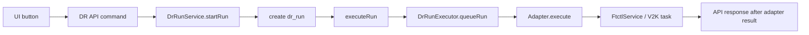

# Cross Hypervisor DR Async Action Remediation Plan

> 2026-08-06 forward Failover completion correction: document
> [599](599-cross-hypervisor-dr-forward-cutover-commit-contract-and-authority-convergence-design-20260806.md)
> keeps the UI/API request start-only while the backend recovers a lost engine
> ACK through a durable attempt and status query.

> 2026-08-05 Failback terminal-convergence correction: document
> [595](595-cross-hypervisor-dr-failback-route-contract-and-terminal-convergence-design-20260805.md)
> keeps lifecycle gate failure asynchronous and converges engine abort,
> Session, Run, Plan, authority, cache, and retry availability.

> 2026-08-05 live-worker correction: document
> [594](594-cross-hypervisor-dr-live-worker-and-terminal-reconciliation-design-20260805.md)
> keeps accepted work asynchronous and prevents provisional observations from
> closing the Run or admitting a duplicate mutation.

> 2026-08-04 Failback preflight refresh update:
> [592-cross-hypervisor-dr-failback-live-runtime-preflight-and-ux-convergence-design-20260804.md](592-cross-hypervisor-dr-failback-live-runtime-preflight-and-ux-convergence-design-20260804.md)
> keeps destructive Failback start-only and adds an asynchronous live
> preflight refresh plus immediate cached read so the modal never owns a
> long-running vCenter/VDDK request.
>
> 2026-08-03 normative plan-mutation update:
> [590-cross-hypervisor-dr-plan-async-mutation-and-target-resource-ownership-design-20260803.md](590-cross-hypervisor-dr-plan-async-mutation-and-target-resource-ownership-design-20260803.md)
> separates UI/API admission acceptance from terminal mutation results and
> removes nested read projections from async create/update responses.

> 2026-07-31 latest correction: source-isolation lookup is read-only;
> Failback/Reprotect remain asynchronous Runs. See document 587.

작성일: 2026-07-01

대상 브랜치: `feature/ftctl-cloud-integration`

상위 문서:

- [511-cross-hypervisor-dr-implementation-progress-20260630.md](511-cross-hypervisor-dr-implementation-progress-20260630.md)
- [514-cross-hypervisor-dr-ui-backend-flow-diagrams-20260701.md](514-cross-hypervisor-dr-ui-backend-flow-diagrams-20260701.md)

## 1. 목적

이 문서는 배포 전 리뷰에서 확인된 Cross Hypervisor DR action 흐름의 단절과 미완성 지점을 보강하기 위한 작업 계획이다.

핵심 목표는 모든 운영 action을 다음 비동기 원칙으로 통일하는 것이다.

1. UI는 Cloud API만 호출한다.
2. API는 필요한 정보를 DB에 기록하고, backend dispatcher와 agent를 통해 각 host action을 비동기 전달한다.
3. Agent는 FTCTL 등 실제 engine에 명령을 전달하고, 백그라운드로 상태를 모니터링하며 Cloud에 보고한다.
4. UI/API request thread는 FTCTL, qemu, host script, 장시간 block job, remote Mold 작업 완료를 기다리지 않는다.

2026-07-14 보강: UI가 Cloud async job을 Promise polling으로 추적하는 것은
서버 request thread의 동기 대기가 아니다. 생성/수정 화면은 job의 resource
transaction 완료를 확인한 뒤 목록을 갱신해야 하며, full seed 또는 FTCTL 장기
작업 완료는 기다리지 않는다. 보호 상세의 주기 조회는 DB cache 전용
`getDrProtectionView`만 사용한다. 상세 설계는
`552-cross-hypervisor-dr-async-read-consistency-and-live-cache-ui-design-20260714.md`를 따른다.

## 2. 필수 원칙

| 원칙 | 설명 | 금지 사항 |
| --- | --- | --- |
| UI -> API only | UI는 `ui/src/api/dr.js`를 통해 Cloud API만 호출한다. | UI에서 host, libvirt, qemu, FTCTL runtime 직접 호출 금지 |
| API quick accept | API는 validation, request 기록, run 생성, enqueue까지만 수행하고 빠르게 응답한다. | API thread에서 agent/engine 완료 대기 금지 |
| Durable run state | `dr_run`, `dr_run_step`, `dr_event`에 action 요청, dispatch, progress, 완료/실패를 남긴다. | 메모리 상태만으로 장시간 작업 추적 금지 |
| Async dispatch | backend worker가 Mold Agent 또는 host agent로 명령을 보낸다. | `DrRunService.startRun`에서 즉시 engine 실행 금지 |
| Agent-owned engine call | agent가 host-local FTCTL/qemu engine 명령을 실행한다. | Cloud management가 host script를 직접 실행하거나 완료까지 block 금지 |
| Background monitoring | agent가 operation id 기준으로 상태를 모니터링하고 Cloud에 progress/event를 보고한다. | UI polling이 engine 상태의 유일한 갱신 원천이 되는 구조 금지 |
| Secret hygiene | remote Mold API key/secret은 one-time payload로만 다루고 profile/log/DB 영구 저장을 피한다. | credential을 `dr_plan`, VM detail, host profile에 평문 장기 저장 금지 |

## 3. 현재 AS-IS 흐름과 문제점



### 3.1 구조적 문제

- `DrRunServiceImpl.startRun`이 `DrOrchestrator.executeRun`을 바로 호출한다.
- `DrOrchestrator.executeRun`이 같은 흐름 안에서 `DrRunExecutor.queueRun`을 바로 호출한다.
- 따라서 action API가 사실상 adapter 실행 결과를 기다리는 동기식 흐름이 될 수 있다.
- 장시간 FTCTL, remote Mold, qemu block job, failback, reprotect 작업이 API request thread를 오래 점유할 위험이 있다.
- 사용자는 작업 완료 전까지 UI에서 다른 작업을 이어가기 어렵고, browser/API timeout에도 취약하다.

### 3.2 기능 단절/미완성 지점

| 항목 | 현재 상태 | 영향 |
| --- | --- | --- |
| `startDrTestFailover` | API skeleton은 있으나 FTCTL adapter 처리 없음 | eligibility map에서 제외하여 UI 미노출, 직접 API 호출은 run 생성 전 거절 |
| `stopDrTestFailover` | API skeleton은 있으나 FTCTL cleanup action 없음 | eligibility map에서 제외하여 UI 미노출, 직접 API 호출은 run 생성 전 거절 |
| `confirmDrFenceClear` | API wrapper와 backend command는 있으나 UI 버튼 없음 | manual-block fence clear를 UI에서 시작 불가 |
| `cancelDrRun` | API wrapper와 backend command는 있으나 UI 버튼 없음 | active run 중단 요청을 UI에서 시작 불가 |
| `startDrFailback` | UI가 `planid`만 전달 | remote Mold/failback target 입력이 필요한 경로 불완전 |
| `adoptDrReplica` | UI가 `replicaid`, `cleanupTransport`를 전달하지 않음 | 대상 replica 선택과 transport cleanup 제어 불완전 |
| Plan 생성 | direction/engine/site 조합 검증이 약함 | 저장 후 action 시점에 실패할 수 있음 |
| `checkDrSite` | UI는 `persiststatus` 전달, backend는 항상 저장 | API 계약 의미가 불명확 |

## 4. TO-BE 비동기 흐름

```mermaid
flowchart LR
    ui["Cloud UI"] --> api["Cloud DR API"]
    api --> validate["Validate request"]
    validate --> persist["Persist dr_run / request_json / steps"]
    persist --> enqueue["Enqueue dispatch"]
    enqueue --> accepted["Return run id / job id"]
    accepted --> uiPoll["UI polls run/progress APIs"]

    enqueue -.-> dispatcher["DR action dispatcher"]
    dispatcher -.-> agentCmd["Mold Agent command"]
    agentCmd -.-> hostAgent["Host agent"]
    hostAgent -.-> engineStart["Start FTCTL/qemu operation"]
    engineStart -.-> opId["Return operation id"]
    opId -.-> monitor["Agent background monitor"]
    monitor -.-> report["Progress/event report"]
    report -.-> db["Update dr_run / dr_run_step / dr_event"]
    db --> uiPoll
```



### 4.1 요청 단계

1. UI는 action modal에서 필요한 값만 입력받아 Cloud API를 호출한다.
2. API command는 action payload를 검증하고 `dr_run.request_json` 또는 별도 action payload record에 저장한다.
3. API는 `dr_run.state=QUEUED`, 초기 `dr_run_step=QUEUED`, `dr_event=RUN_CREATED`를 기록한다.
4. API는 dispatcher queue에 run id를 넣고 즉시 `DrRunResponse` 또는 Cloud async job id를 반환한다.
5. UI는 버튼 loading을 짧게 끝내고, run detail/progress polling으로 전환한다.

### 4.2 Dispatch 단계

1. backend dispatcher가 `QUEUED` run을 가져와 `DISPATCHING`으로 전환한다.
2. adapter registry는 engine key로 action adapter를 선택하되, adapter는 engine을 직접 완료까지 실행하지 않는다.
3. adapter는 host, VM, protection, target replica, remote Mold one-time credential 등 dispatch payload를 만든다.
4. backend는 Mold Agent command로 host agent에 action을 전달한다.
5. host agent가 요청을 접수하면 `operationId`를 반환하고 Cloud는 `dr_run.state=RUNNING` 또는 `ACCEPTED`로 전환한다.

### 4.3 Agent/Engine 단계

1. agent는 FTCTL/qemu command를 background process 또는 systemd transient unit으로 시작한다.
2. agent는 operation state file을 남긴다.
3. agent monitor는 operation id 기준으로 FTCTL state, qemu block job, events.log, exit code를 수집한다.
4. agent는 Cloud에 progress/event를 주기적으로 보고하거나, Cloud poll 요청에 응답한다.
5. Cloud는 agent report를 `dr_run_step`, `dr_event`, `dr_replica`, `dr_plan` projection으로 반영한다.
6. 작업 완료 시 Cloud는 `SUCCEEDED/FAILED/CANCELED`를 기록하고 UI는 polling 결과로 최종 상태를 표시한다.

## 5. Action별 보강 계획

| UI action | API | Backend 계획 | Agent/engine 계획 | UI 보강 |
| --- | --- | --- | --- | --- |
| Sync | `startDrSync` | run 생성 후 async dispatch로 변경 | `PROTECT_START`를 background 실행, progress 보고 | 현재 버튼 유지, progress polling |
| Test Failover 시작 | `startDrTestFailover` | 지원 engine이 없으면 eligibility map에서 제외하고 run 생성 전 거절, 지원 시 async action 추가 | FTCTL/qemu test failover engine command 정의 필요 | 버튼은 지원 가능 상태일 때만 노출 |
| Test Failover 종료 | `stopDrTestFailover` | 지원 engine이 없으면 eligibility map에서 제외하고 run 생성 전 거절, 지원 시 `TEST_CLEANUP` run type 연결 | test resource cleanup background 실행 | cleanup 버튼은 지원 가능 상태일 때만 노출 |
| Failover | `startDrFailover` | `disaster`, `skipSourceFenceRequest`, `force`, `reason` payload 저장 후 async dispatch | `FAILOVER` 및 필요 시 prepare/fence 흐름 background 실행 | 위험 action modal에서 확인/사유 입력 |
| Fence Clear | `confirmDrFenceClear` | `FENCE_CONFIRM` eligibility 추가, one-time remote Mold credential payload 지원 | remote Mold lifecycle/fence clear 후 FTCTL fence confirm 보고 | manual-block 상태에서 버튼/모달 추가 |
| Failback | `startDrFailback` | failback target Mold type과 one-time credential payload를 DR API에 추가 | reverse sync/failback 단계별 monitor/report | failback target 선택 modal 추가 |
| Reprotect | `startDrReprotect` | async dispatch로 전환 | `FAILBACK_REPROTECT` background 실행 | 현재 버튼 유지, progress polling |
| Adopt Replica | `adoptDrReplica` | `replicaid`, `cleanupTransport`, acknowledgement payload 지원 | target replica adopt/transport cleanup 실행 | replica 선택/확인 modal 추가 |
| Cancel Run | `cancelDrRun` | `CANCEL_REQUESTED` 상태와 agent cancel signal 지원 | operation id 기준 cancel/abort 시도 후 report | active run 화면에 cancel 버튼 추가 |

## 6. Backend 보강 작업

### 6.1 Run lifecycle

신규 또는 확장 상태:

- `QUEUED`: API가 요청을 접수하고 DB에 기록함
- `DISPATCHING`: dispatcher가 agent 전달을 준비함
- `ACCEPTED`: agent가 operation id를 반환함
- `RUNNING`: agent monitor가 실제 engine 실행을 확인함
- `CANCEL_REQUESTED`: 사용자가 cancel을 요청함
- `CANCELED`: engine/agent cancel이 완료되거나 실행 전 취소됨
- `SUCCEEDED`: 작업 성공
- `FAILED`: 작업 실패

필수 step:

- `validate-request`
- `persist-run`
- `dispatch-agent`
- `agent-accepted`
- `engine-running`
- `monitor-progress`
- `projection-refresh`
- `completed` 또는 `failed`

### 6.2 API command

- 모든 action command는 DB 기록과 enqueue 이후 즉시 반환한다.
- `StartDrFailbackCmd`에 다음 one-time payload를 추가한다.
  - `failbacktargetmoldtype`
  - `remotemoldapiurl`
  - `remotemoldapikey`
  - `remotemoldsecretkey`
  - `targetmoldapiurl`
  - `targetmoldapikey`
  - `targetmoldsecretkey`
- `ConfirmDrFenceClearCmd`에 remote Mold one-time payload를 추가한다.
- `AdoptDrReplicaCmd`에 `cleanuptransport`를 추가한다.
- `CancelDrRunCmd`는 active operation id가 있으면 agent cancel 요청까지 연결한다.
- API response는 `accepted=true`, `runid`, `state`, `currentstep`, `progress`를 포함한다.

### 6.3 Dispatcher

- `DrRunExecutorImpl.queueRun`의 즉시 adapter 실행 구조를 dispatcher enqueue 구조로 변경한다.
- dispatcher는 별도 worker 또는 Cloud async job executor에서 실행한다.
- dispatcher는 run idempotency key를 기준으로 중복 dispatch를 막는다.
- dispatcher는 agent command send 실패 시 retry/backoff 후 `FAILED`로 기록한다.
- adapter는 host operation payload 생성과 engine capability validation을 담당한다.

### 6.4 Projection/report

- agent report가 들어오면 `dr_event`에 원천을 `AGENT` 또는 `FTCTL`로 기록한다.
- progress는 `dr_run_step.progress`와 `dr_run.progressPercent`에 반영한다.
- FTCTL projection adapter는 기존 `ftctl_protection*` 상태를 읽어 `dr_plan`, `dr_replica`, `dr_replica_disk`를 갱신한다.
- UI polling API는 engine을 직접 조회하지 않고 Cloud DB/projection 상태만 반환한다.

## 7. Agent/FTCTL 보강 작업

### 7.1 Agent command contract

Cloud -> agent command payload:

```json
{
  "runId": 0,
  "planId": 0,
  "action": "FAILOVER",
  "engine": "FTCTL",
  "primaryVmId": 0,
  "targetVmId": 0,
  "force": true,
  "request": {},
  "callback": {
    "managementServerId": 0,
    "correlationId": "dr-run-0"
  }
}
```

Agent -> Cloud accepted response:

```json
{
  "accepted": true,
  "operationId": "ftctl-dr-0",
  "state": "ACCEPTED",
  "message": "operation queued"
}
```

Agent -> Cloud progress report:

```json
{
  "operationId": "ftctl-dr-0",
  "runId": 0,
  "state": "RUNNING",
  "step": "blockcopy",
  "progress": 45,
  "message": "reverse sync in progress",
  "details": {}
}
```

### 7.2 Agent runtime

- agent는 operation state를 `/run` 또는 `/var/lib`의 FTCTL operation state path에 기록한다.
- 장시간 command는 background process/systemd unit으로 분리한다.
- agent는 FTCTL lock/profile/state file을 operation id와 연결해 보고한다.
- agent monitor는 실패 시 exit code, stderr tail, FTCTL event tail, qemu block job 상태를 수집한다.
- cancel 요청 시 agent는 operation type별 safe cancel handler를 호출한다.

## 8. UI 보강 작업

### 8.1 Action toolbar

- backend `actioneligibility` key를 다음으로 확장한다. 단, engine이 아직 지원하지 않는 action은 key를 내려주지 않는다.
  - `sync`
  - `testFailover`
  - `stopTestFailover`
  - `failover`
  - `confirmFenceClear`
  - `failback`
  - `reprotect`
  - `adoptReplica`
  - `cancelRun`
- UI는 eligibility key가 없으면 버튼을 숨기고, key가 있으나 값이 false이면 disabled reason을 표시한다.
- 위험 action은 modal을 통해 acknowledgement와 reason을 받는다.

### 8.2 Action modal

필수 modal:

- Failover modal: `force`, `disaster`, `skipSourceFenceRequest`, `reason`
- Fence clear modal: remote Mold one-time credential, acknowledgement
- Failback modal: failback target Mold type, remote/target Mold one-time credential, reason
- Adopt modal: replica 선택, cleanup transport 여부, acknowledgement
- Cancel modal: active run cancel confirmation
- Test cleanup modal: cleanup target 확인. 단, 현재 FTCTL engine에서는 test cleanup action contract가 없어 노출하지 않는다.

### 8.3 Progress UX

- action API 응답 직후 UI loading을 종료한다.
- `DrRunProgress`는 `listDrRuns`, `getDrRun`, `listDrRunSteps`, `listDrEvents` polling으로 갱신한다.
- 화면 전체를 block하지 않고 action toolbar와 run panel만 pending 상태로 표시한다.
- 사용자는 다른 tab, VM 화면, DR Sites/Plans 목록으로 이동할 수 있어야 한다.

## 9. 코드 기준 보강 대상

| 영역 | 대상 | 보강 내용 |
| --- | --- | --- |
| UI API wrapper | `ui/src/api/dr.js` | action별 API wrapper는 Cloud API만 호출한다. 누락된 request payload는 여기에서 명시적으로 전달한다. |
| UI action toolbar | `ui/src/components/dr/DrActionToolbar.vue` | `confirmFenceClear`, `cancelRun` 버튼을 eligibility 기반으로 추가하고, `stopTestFailover`는 지원 engine이 eligibility key를 제공할 때만 노출한다. |
| UI plan list/action modal | `ui/src/views/infra/dr/DrPlanList.vue` | failover/failback/fence/adopt/cancel/test-cleanup modal을 추가하고, action별 payload를 API wrapper로 전달한다. |
| DR action eligibility | `plugins/integrations/disaster-recovery/.../DrPlanServiceImpl.java` | backend가 지원하는 action과 UI 버튼 노출 조건을 일치시킨다. 지원하지 않는 engine action은 eligibility map에서 제외하고 직접 API 호출은 run 생성 전에 거절한다. |
| DR run start | `plugins/integrations/disaster-recovery/.../DrRunServiceImpl.java` | `startRun`은 request validation, DB 기록, enqueue까지만 수행하고 즉시 반환하도록 변경한다. |
| DR orchestrator/executor | `DrOrchestratorImpl.java`, `DrRunExecutorImpl.java` | synchronous adapter 실행 대신 dispatcher worker가 run id 기준으로 agent command를 전달하게 한다. |
| FTCTL adapter | `FtctlDrActionAdapter.java` | `TEST_FAILOVER`, `TEST_CLEANUP`, `FENCE_CONFIRM`, `CANCEL`을 capability 기반으로 정리하고, 장시간 engine 완료 대기 대신 operation dispatch/report 구조로 전환한다. |
| FTCTL 기존 API parameter | `FailbackFtctlProtectionCmd.java`, `ConfirmFtctlFenceCmd.java` | 기존 FTCTL 성공 경로의 remote Mold one-time parameter 의미를 DR action API payload에 맞춰 재사용한다. |
| Agent bridge | `mold-agent` command handler | Cloud dispatcher가 보낸 operation payload를 host-local FTCTL/qemu engine에 전달하고 operation id를 반환한다. |
| FTCTL runtime | `ablestack-qemu-exec-tools` FTCTL scripts | 기존 성공 로직을 유지하고, background 실행, state file, monitor/report, cancel hook만 보강한다. |
| Projection API | DR run/step/event list/get APIs | UI polling이 Cloud DB/projection만 읽도록 하고 host runtime 직접 조회를 제거한다. |

## 10. Plan validation 보강

Plan 생성/수정 시 검증:

- source/target site hypervisor type과 direction 일치
- direction과 engine type/binding type 일치
- FTCTL plan은 active FTCTL protection 또는 source VM binding 확인
- VMware Phase 1 plan은 mapping JSON 필수값 확인
- V2K plan은 source VMware, target KVM, import task binding 확인
- 검증 실패 시 저장 전 `InvalidParameterValueException`으로 차단

## 11. 구현 순서

| 단계 | 작업 | 완료 기준 |
| --- | --- | --- |
| 1 | Async run lifecycle 설계 반영 | API가 run 생성/enqueue 후 즉시 반환 |
| 2 | Backend dispatcher 추가 | dispatcher가 run id 기준 agent command 전송 |
| 3 | Agent command/report contract 추가 | operation id와 progress report 수신 가능 |
| 4 | FTCTL adapter async dispatch 전환 | adapter가 완료 대기 대신 operation 생성/추적 |
| 5 | 누락 action API payload 보강 | failback/fence/adopt/cancel payload 완성 |
| 6 | UI action modal/button 보강 | 모든 eligibility action이 UI에서 시작 가능 |
| 7 | Plan validation 보강 | 잘못된 direction/engine/site 조합 저장 차단 |
| 8 | 테스트/문서 갱신 | unit/API/UI smoke와 문서 업데이트 |

## 12. 수용 기준

- action API는 장시간 engine 작업을 기다리지 않고 짧은 시간 안에 `DrRunResponse`를 반환한다.
- UI action 실행 후 browser는 다른 화면/작업으로 이동 가능하다.
- 모든 UI 버튼은 backend API, run type, dispatcher, agent/engine action으로 이어진다.
- backend에 있는 action API 중 UI에서 시작해야 하는 action은 빠짐없이 버튼 또는 modal이 있다.
- UI에 있는 버튼 중 backend/adapter/agent가 처리하지 못하는 action은 표시되지 않는다.
- failback/fence clear remote Mold credential은 one-time payload로만 처리되고 영구 저장되지 않는다.
- agent operation이 진행 중이면 `dr_run_step`, `dr_event`, progress가 주기적으로 갱신된다.
- agent/host 재시작 후에도 operation state를 복구하거나 실패 상태를 명확히 보고한다.
- 기존 FTCTL KVM-to-KVM 성공 경로는 동작 의미를 유지하되 호출 방식만 비동기 dispatch/report 구조로 감싼다.
- 기존 qemu/ftctl 성공 로직을 불필요하게 재작성하지 않는다.

## 13. AS-IS / TO-BE 요약

| 항목 | AS-IS | TO-BE |
| --- | --- | --- |
| UI action | 일부 버튼만 있음 | 모든 supported action 버튼/modal 제공 |
| API response | adapter 실행 결과를 기다릴 수 있음 | run 접수/enqueue 후 즉시 반환 |
| Backend execution | `startRun -> executeRun -> queueRun -> adapter` 직접 호출 | `startRun -> persist -> enqueue -> dispatcher -> agent` |
| Agent 역할 | Cloud service가 FTCTL service를 직접 호출하는 경로 중심 | agent가 host-local engine 실행/monitor/report 소유 |
| Progress | run/step/event 기록은 있으나 실시간 agent report 구조 부족 | agent report 기반 progress/event 갱신 |
| Test failover | API skeleton과 adapter 처리 불일치 | 지원 가능 시 완성, 그 전까지 eligibility map 제외와 API 사전 거절 |
| Fence clear | API는 있으나 UI 없음 | manual-block 상태에서 UI modal 제공 |
| Failback | remote Mold 파라미터 UI/API 미완 | one-time credential modal/API/dispatch 완성 |
| Cancel | API는 있으나 UI/agent cancel 미연결 | UI cancel -> backend cancel request -> agent cancel |
| Plan validation | 저장 후 실행 시 실패 가능 | 저장 전 direction/engine/site 검증 |

## 14. 구현 결과 - 2026-07-01

이번 구현은 이 문서의 보강 원칙 중 Cloud API request thread가 장시간 FTCTL/qemu/host 작업을 기다리지 않도록 하는 부분과, UI action이 Cloud API와 durable run state만 바라보도록 하는 부분을 우선 반영했다. qemu/ftctl runtime의 기존 RBD/QCOW2 성공 경로는 변경하지 않았고, Cloud DR plugin의 run lifecycle, action payload, eligibility, UI modal/button 흐름을 보강했다.

### 14.1 Backend 구현

- `DrConstants`에 KVM-to-KVM, VMware-to-VMware direction과 `DISPATCHING`, `ACCEPTED`, `CANCEL_REQUESTED` run state, `AGENT` event source를 추가했다.
- `DrRunServiceImpl.cancelRun`은 완료 run을 보존하고, `QUEUED` run은 즉시 `CANCELED`, 실행 중 run은 `CANCEL_REQUESTED`로 기록하도록 변경했다.
- `DrOrchestratorImpl.executeRun`은 `QUEUED` run만 dispatcher에 enqueue하고, 이미 접수/실행 중인 run에는 중복 dispatch를 하지 않도록 idempotent하게 동작한다.
- `DrRunExecutorImpl`에 `DrRunDispatcher` background executor를 추가했다. API 호출 흐름에서는 run을 생성/enqueue하고 빠르게 반환하며, 실제 adapter 실행은 별도 worker에서 `DISPATCHING -> RUNNING -> terminal state` 흐름으로 처리한다.
- dispatcher 단계 추적을 위해 `dispatch-agent` step을 추가하고, cancel 요청이 들어온 run은 terminal success로 덮어쓰지 않도록 했다.
- `StartDrFailbackCmd`에 failback target Mold type과 remote/target Mold one-time credential payload를 추가했다.
- `ConfirmDrFenceClearCmd`에 remote Mold one-time credential payload를 추가했다.
- `AdoptDrReplicaCmd`에 `cleanuptransport` payload를 추가했다.
- `FtctlDrActionAdapter`는 현재 FTCTL host engine action이 없는 `TEST_FAILOVER`, `TEST_CLEANUP`을 명시적으로 unsupported 처리하고, fence clear는 DR action payload의 remote Mold one-time credential을 기존 FTCTL service 호출로 전달한다.
- `DrPlanServiceImpl`은 plan create/update 시 source/target site, direction, hypervisor, engine 조합을 검증하고, action eligibility에 `confirmFenceClear`, `cancelRun`을 반영한다. unsupported test action은 eligibility map에서 제외해 UI에 노출하지 않는다.
- `AbstractDrPlanActionCmd`는 action eligibility를 확인한 뒤에만 `DrRun`을 생성한다. 지원하지 않는 action이나 현재 상태에서 허용되지 않는 action은 `dr_run` 생성 전에 `PARAM_ERROR`로 거절한다.

### 14.2 UI 구현

- `DrActionToolbar.vue`에 `stoptestfailover`, `confirmfenceclear`, `cancelrun` action을 추가하고, active run이 있을 때만 cancel button이 활성화되도록 했다.
- danger action 중 modal이 필요한 action은 `Popconfirm` 대신 action modal로 진입하도록 분기했다.
- `DrPlanList.vue`에 failover, failback, fence clear, adopt replica, cancel, test cleanup 공통 action modal을 추가했다.
- action modal은 요청 접수 후 backend run/progress polling으로 이어진다는 안내를 표시하고, API 호출 완료 후 화면 전체를 동기식으로 붙잡지 않도록 했다.
- failover는 `force`, `disaster`, `skipSourceFenceRequest`, `reason`을 전달한다.
- failback은 failback target Mold type과 remote/target Mold one-time credential을 one-time payload로 전달한다.
- fence clear는 remote Mold one-time credential과 acknowledgement를 전달한다.
- adopt는 replica selector와 cleanup transport flag를 전달한다.
- cancel은 현재 active run id를 `cancelDrRun` API에 전달한다.
- 영문/국문 locale에 신규 action/modal label과 async accepted 안내 문구를 추가했다.

### 14.3 Agent/FTCTL 범위

- 이번 구현에서는 기존 qemu/ftctl script와 성공 검증된 RBD/QCOW2 runtime 경로를 변경하지 않았다.
- Cloud backend는 기존 FTCTL service/agent 연동 경로를 background dispatcher에서 호출하도록 감싸 API/UI 동기 blocking을 줄였다.
- 완전한 host-agent operation id 기반 progress report/cancel hook은 별도 qemu/agent contract 구현 단계로 남긴다. 단, Cloud run/step/event 모델과 UI polling 흐름은 해당 contract가 붙을 수 있는 형태로 열어 두었다.

### 14.4 검증 결과

- WSL ext4 빌드 클론: `/home/ablecloud/work/dhslove/ablestack-cloud-build-async-20260701122007`
- Maven 변경 모듈 package:
  - 명령: `mvn -pl plugins/integrations/disaster-recovery -am -DskipTests -DskipITs -Dcheckstyle.skip=true -Drat.skip=true package`
  - 결과: `BUILD SUCCESS`
  - 완료: `2026-07-01T12:32:34+09:00`
- Maven DR plugin 단위 테스트:
  - 명령: `mvn -pl plugins/integrations/disaster-recovery -am -Dtest=DrPlanServiceImplTest,DrRunExecutorImplTest,V2kDrMigrationAdapterTest,FtctlDrActionAdapterTest,VmwarePhase1TargetAdapterTest -DfailIfNoTests=false -DskipITs -Dcheckstyle.skip=true -Drat.skip=true test`
  - 결과: `BUILD SUCCESS`, `Tests run: 25, Failures: 0, Errors: 0, Skipped: 0`
  - 완료: `2026-07-01T12:34:39+09:00`
- 전체 `-am test` 시도:
  - 명령: `mvn -pl plugins/integrations/disaster-recovery -am test -DskipITs -Dcheckstyle.skip=true`
  - 결과: `cloud-server` 기존 `HighAvailabilityManagerImplTest.setup:160`의 `_instanceDetailsDao` `NoSuchFieldException` 22건으로 DR plugin 도달 전 실패
  - 판단: 이번 DR 변경 모듈 package와 DR plugin 단위 테스트는 별도 성공했으므로, 전체 reactor test 실패는 이번 변경 모듈의 컴파일/단위 테스트 실패로 보지 않는다.
- UI dependency install:
  - 명령: `npm ci`
  - 결과: 성공. 기존 lock 기준 `EBADENGINE`, deprecation, audit vulnerability warning은 표시됨.
- UI production build:
  - 명령: `NODE_OPTIONS=--openssl-legacy-provider npm run build`
  - 결과: `DONE Build complete. The dist directory is ready to be deployed.`
  - 경고: 기존 asset/entrypoint size warning 및 Browserslist outdated warning 표시
- UI dist marker:
  - `confirmfenceclear`, `stoptestfailover`, `label.dr.action.cancel.run`, `message.dr.async.accepted`가 dist bundle/locales에 포함됨을 확인했다.
- whitespace check:
  - 명령: `git diff --check` 대상 변경 파일
  - 결과: 통과

### 14.5 Test failover 미지원 action gating 보강

- `DrPlanServiceImpl`은 현재 engine action contract가 없는 `TEST_FAILOVER`, `TEST_CLEANUP`을 action eligibility map에서 제외한다.
- `DrActionToolbar.vue`는 action eligibility key가 없는 action을 toolbar에 노출하지 않는다. 따라서 현재 FTCTL plan에서는 test failover/test cleanup 버튼이 보이지 않는다.
- `AbstractDrPlanActionCmd`는 action eligibility를 확인한 뒤 `DrRun`을 생성한다. 지원하지 않는 action이나 현재 상태에서 허용되지 않는 action은 `PARAM_ERROR`로 거절하며, 실패한 `dr_run`을 만들지 않는다.
- `DrPlanServiceImplTest`는 unsupported action을 `false` 값이 아니라 key 없음으로 검증하도록 갱신했다.

검증 결과:

- WSL ext4 빌드 클론: `/home/ablecloud/work/dhslove/ablestack-cloud-build-async-20260701122007`
- Maven DR plugin 단위 테스트:
  - 명령: `mvn -pl plugins/integrations/disaster-recovery -am -Dtest=DrPlanServiceImplTest,DrRunExecutorImplTest,V2kDrMigrationAdapterTest,FtctlDrActionAdapterTest,VmwarePhase1TargetAdapterTest -DfailIfNoTests=false -DskipITs -Dcheckstyle.skip=true -Drat.skip=true test`
  - 결과: `BUILD SUCCESS`, `Tests run: 25, Failures: 0, Errors: 0, Skipped: 0`
  - 완료: `2026-07-01T13:11:04+09:00`
- UI production build:
  - 명령: `NODE_OPTIONS=--openssl-legacy-provider npm run build`
  - 결과: `DONE Build complete. The dist directory is ready to be deployed.`
  - 경고: 기존 Browserslist outdated 및 asset/entrypoint size warning 표시

## 15. 2026-07-06 추가 보강 계획: retryable lock과 non-blocking projection

상세 설계는 [533-cross-hypervisor-dr-dispatch-projection-recovery-design-20260706.md](533-cross-hypervisor-dr-dispatch-projection-recovery-design-20260706.md)를 따른다.

이번 보강은 2026-07-01 비동기 action 골격 위에 다음 구조를 추가한다.

### 15.1 원칙

- UI/API read path는 DB snapshot만 읽는다.
- Agent/ftctl status refresh는 list/get API의 inline dependency가 아니다.
- `dr-sync-start`가 `dr-sync-pause` lock에 막힌 경우는 retryable engine busy다.
- retryable lock은 `DR_ENGINE_BUSY_RETRYABLE`과 retry metadata로 저장한다.
- `dr-status` timeout은 runtime terminal failure가 아니라 projection stale로 저장한다.

### 15.2 보강 작업

| 레이어 | 작업 |
| --- | --- |
| UI | initial detail loading과 projection refresh loading 분리, retryable lock 사용자 메시지 추가 |
| API | read/action/projection API 분리, action response에 run/job/retry metadata 제공 |
| Backend | plan active run 직렬화, retryable lock retry/backoff, terminal step closure |
| Agent | `FtctlDrStatusCommand` hard timeout, process tree kill, single-flight status |
| ftctl | `dr-status` lock-free bounded read, lock conflict JSON metadata 유지 |
| DB | retry metadata와 projection stale 저장, step upsert/중복 정리 기준 확정 |

### 15.3 검증

- `dr-sync-pause` lock 보유 중 `dr-sync-start` 실행 시 `RETRYING` 또는 `FAILED_RETRYABLE`로 표시되고 plan은 `SYNCING`에 남지 않는다.
- `dr-status`가 timeout되어도 DR Plan 상세 화면은 기본 정보를 렌더링한다.
- host에 orphan `ablestack_vm_ftctl dr-status` process가 남지 않는다.
- terminal run에는 open step이 남지 않는다.

## 16. 2026-07-14 보정: Continuous Scheduler self-lock 제거

15장의 generic retry/backoff만으로는 continuous `dr-sync-start` self-lock을
해결할 수 없다. Background worker가 global lock을 잡은 채 Scheduler loop를
계속 실행하므로 정상 보호가 유지되는 동안 retry가 성공할 수 없기 때문이다.

후속 구현은 retry 횟수를 늘리지 않고 Scheduler 수명주기 global lock을
제거한다. 복제 cycle은 Plan cycle lock으로 직렬화하고, Test Failover와
pause/release/cancel은 generation 기반 control channel로 안전 지점 전이를
요청한다. UI/API는 이를 기다리지 않고 queued Run을 반환한다.

이 보정의 상세 설계와 수용 기준:
`553-cross-hypervisor-dr-continuous-sync-control-and-quiesce-lock-design-20260714.md`.

## 17. 2026-07-25 보정: Failback action credential 제거

이 문서의 2026-07-01 구현 기록 중 failback target Mold selector와
`remotemold*`/`targetmold*` one-time credential을 UI/API action payload에
추가한 부분은 최신 DR Site credential 모델로 대체한다.

최신 계약:

1. `startDrFailback`은 non-secret operator intent만 durable Run request로
   저장한다.
2. active/destination Site는 `DrPlanVO.targetSiteId/sourceSiteId`로 결정한다.
3. backend가 `DrSiteCredentialService`로 양쪽 credential을 resolve한다.
4. secret key가 포함된 action request는 저장 전에 거부한다.
5. UI는 Site route/readiness를 표시하고 credential을 입력받지 않는다.
6. 신규 Site 복구는 별도 replica-controller recovery workflow다.

기존 비동기 원칙은 유지한다. API는 Run을 enqueue하고 즉시 반환하며
Agent/ftctl 완료를 동기식으로 기다리지 않는다.

상세 설계와 migration 기준:
`571-cross-hypervisor-dr-site-derived-failback-contract-design-20260725.md`.

## 18. 2026-07-27 보정: Failback Late ACK 비동기 수렴

Failback API가 Run을 즉시 반환하는 원칙은 유지한다. 다만 최초 Agent timeout
뒤 lifecycle 진행이 UI polling이나 projection refresh 호출에 의존해서는 안
된다.

- FTCTL은 late ACK를 durable commit journal로 멱등 승격한다.
- Agent는 `OPERATION`과 `PLAN_AUTHORITY` scope를 구분해 전달한다.
- Backend scheduled reconciler는 전환 session을 독립적으로 probe한다.
- DB terminal transaction 완료 후에만 API action eligibility를 다시 연다.
- UI는 polling consumer이며 lifecycle worker가 아니다.

상세 async retry/backoff, terminal 판정과 AS-IS/TO-BE는
[576-cross-hypervisor-dr-failback-late-ack-and-projection-convergence-design-20260727.md](576-cross-hypervisor-dr-failback-late-ack-and-projection-convergence-design-20260727.md)를
따른다.

## 2026-08-06 Data Evidence Publication Grace Addendum

Failback evidence publication uses scheduled reconciliation rather than sleep or
request-thread polling. `FAILBACK_DATA_READY` with incomplete typed evidence is
an intermediate state, not terminal failure and not authority-transition
permission. Five probes or 15 seconds form the bounded grace period. The UI
continues polling Cloud projection and never contacts Agent or FTCTL directly.
Document 596 defines the full sequence.

## 2026-07-31 Async Acceptance Ordering Addendum

DR action UI는 `POST -> jobid -> queryAsyncJobResult -> accepted Run` 순서를
지킨다. async job 실패에는 Run이 없으므로 idempotency Run recovery를
수행하지 않는다. recovery는 job 성공 후 response object가 비어 있는
read-after-write 예외 경로다.

이 규칙은 UI를 장시간 동기 실행으로 바꾸지 않는다. Run 접수까지만 확인하고
Agent/FTCTL 작업은 기존 worker와 polling 경로에서 계속 비동기로 수행한다.
Test Session blocker 사례의 구체 설계는
[586-cross-hypervisor-dr-test-session-blocker-and-async-acceptance-design-20260731.md](586-cross-hypervisor-dr-test-session-blocker-and-async-acceptance-design-20260731.md)를
따른다.
