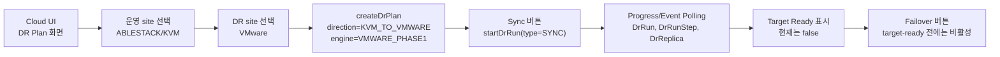
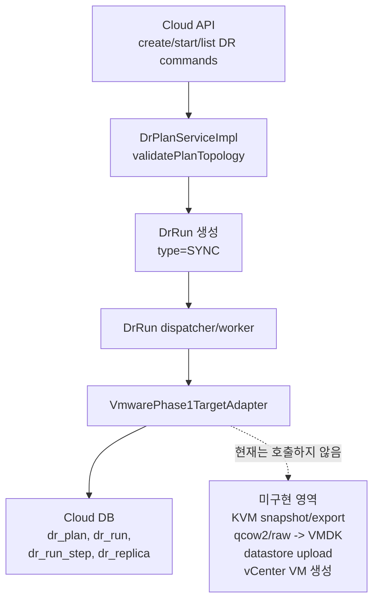
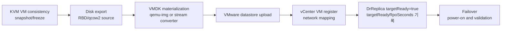

# ABLESTACK Operation To VMware DR Flow

작성일: 2026-07-01

대상 방향: ABLESTACK 운영 -> VMware DR

DR direction: `KVM_TO_VMWARE`

현재 engine: `VMWARE_PHASE1`

관련 문서:

- [500-cross-hypervisor-dr-architecture-plan-20260630.md](500-cross-hypervisor-dr-architecture-plan-20260630.md)
- [504-cross-hypervisor-dr-phase1-vmware-target-scope-design-20260630.md](504-cross-hypervisor-dr-phase1-vmware-target-scope-design-20260630.md)
- [514-cross-hypervisor-dr-ui-backend-flow-diagrams-20260701.md](514-cross-hypervisor-dr-ui-backend-flow-diagrams-20260701.md)

## 1. 결론

이 방향은 ABLESTACK/KVM에서 운영 중인 VM을 VMware DR 사이트로 복구하는 흐름이다.

현재 코드 기준으로는 실제 DR 복제 경로가 완성된 상태가 아니다. `VmwarePhase1TargetAdapter`는 `KVM_TO_VMWARE` 계획의 topology를 검증하고 VMware target skeleton `DrReplica`를 생성하지만, KVM 디스크를 VMware에서 부팅 가능한 VMDK/VM으로 지속 materialization하지 않는다.

따라서 현재 상태에서 이 방향의 UI는 "계획 생성과 skeleton readiness 확인"까지로 보는 것이 맞다. 실제 failover, RPO, RTO를 운영 수준으로 주장하려면 target-ready restore point를 만드는 materializer가 추가되어야 한다.

## 2. 현재 구현 범위

| 항목 | 현재 상태 |
|---|---|
| 방향 상수 | `KVM_TO_VMWARE` |
| engine | `VMWARE_PHASE1` |
| adapter | `com.cloud.dr.adapter.vmware.VmwarePhase1TargetAdapter` |
| UI/API 계획 생성 | 가능 |
| topology 검증 | 가능, source KVM / target VMware |
| sync 실행 | skeleton `DrReplica` 생성 또는 갱신 |
| target-ready restore point | 미구현 |
| VMDK 변환/업로드 | 미구현 |
| vCenter VM 생성/전원 제어 | 미구현 |
| failover | adapter가 `TARGET_READY` 필요 메시지로 차단 |
| failback/reprotect/adopt | 미지원 |

## 3. UI 흐름

UI 관점에서의 원칙은 다음과 같다.

- UI는 Cloud API만 호출한다.
- UI는 host, qemu, vCenter, FTCTL runtime을 직접 호출하지 않는다.
- `SYNC`는 비동기 run으로 생성되고, UI는 polling으로 `DrRun`/`DrRunStep`/`DrReplica` 상태를 읽는다.
- 현재 `VMWARE_PHASE1`은 target-ready를 만들지 못하므로 failover 버튼은 비활성 또는 사유 표시 상태여야 한다.

## 4. Backend 흐름

현재 adapter의 핵심 동작은 다음과 같다.

- `validatePlan()`에서 source site가 KVM인지 확인한다.
- target site가 VMware인지 확인한다.
- `SYNC` 실행 시 `ensureSkeletonRecord()`로 `DrReplica` skeleton을 생성한다.
- `targetReady=false`, `targetReadyAt=null`, `targetReadyRpoSeconds=null` 상태를 유지한다.
- `TEST_FAILOVER` 또는 `FAILOVER`는 target-ready restore point가 없으면 실패 응답을 낸다.

## 5. RPO 분석

| 관점 | 현재 구현 | 목표 구현 |
|---|---|---|
| source RPO | 측정 불가. source에서 capture한 restore point가 없다. | snapshot 또는 block change capture 시각 기준으로 계산 |
| target-ready RPO | `targetReadyRpoSeconds=null`. VMware에서 부팅 가능한 restore point가 없다. | VMDK materialization 완료 시각 기준으로 계산 |
| 사용자에게 표시할 값 | "Not ready" 또는 "N/A"가 맞다. | 최신 restore point 시간, target materialized 시간, lag seconds |

현재 구현에서 RPO를 숫자로 표시하면 오해가 생긴다. skeleton replica는 복구 가능한 데이터가 아니므로 RPO 산정 대상이 아니다.

목표 구현에서 RPO는 최소 두 단계로 나누어야 한다.

- source capture RPO: ABLESTACK 운영 VM에서 일관된 snapshot 또는 changed block을 확보한 시점
- target-ready RPO: VMware datastore에 VMDK가 반영되고 VM inventory가 복구 가능한 상태가 된 시점

두 값이 다르면 사용자는 target-ready RPO를 DR 의사결정 기준으로 봐야 한다.

## 6. RTO 분석

| 관점 | 현재 구현 | 목표 구현 |
|---|---|---|
| failover 시작 가능 여부 | target-ready가 없어 시작 불가 | target-ready restore point가 있을 때 가능 |
| 예상 RTO | 운영 수치로 주장 불가. 수동 변환/업로드가 필요하다. | target VM skeleton 및 VMDK 준비 상태면 수십 분 이내 목표 가능 |
| RTO 지배 요소 | 미구현 materialization 전체 | final validation, vCenter register, network mapping, power-on, guest validation |

현재 단계에서 RTO는 Cloud DR 버튼으로 달성되는 시간이 아니다. 목표 구현에서는 이미 VMware 쪽에 부팅 가능한 VM이 준비되어 있어야 RTO가 의미를 갖는다.

## 7. 필요한 보강 작업

구현이 필요한 backend 구성은 다음과 같다.

| 구성 | 역할 |
|---|---|
| `KvmSnapshotCaptureService` | ABLESTACK 운영 VM의 일관된 source restore point 확보 |
| `VmwareDiskMaterializer` | source disk를 VMware bootable VMDK로 변환 |
| `VmwareTargetProvisioner` | datastore, folder, network, resource pool에 VM skeleton 생성 |
| `DrRestorePointService` | source capture와 target-ready restore point를 분리 저장 |
| `VmwareFailoverAdapter` | target-ready restore point를 기준으로 전원/네트워크 전환 |

## 8. 기술 판단

`VMWARE_PHASE1`을 실제 ABLESTACK -> VMware DR 지원으로 표현하면 기술적으로 잘못된 판단이다. 현재는 skeleton과 readiness gate만 구현되어 있다.

정확한 표현은 다음과 같다.

| 구분 | 표현 |
|---|---|
| 현재 AS-IS | ABLESTACK -> VMware 계획과 target skeleton을 관리하는 Phase1 preview |
| 운영 가능 TO-BE | 지속 또는 주기적 disk materialization을 통해 VMware target-ready restore point를 만드는 DR engine |

이 방향은 설계 대상이 맞지만, 배포/운영 안내에서는 "실제 failover 검증 전" 또는 "target materialization 미구현" 상태로 표시해야 한다.
