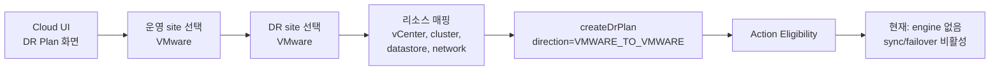
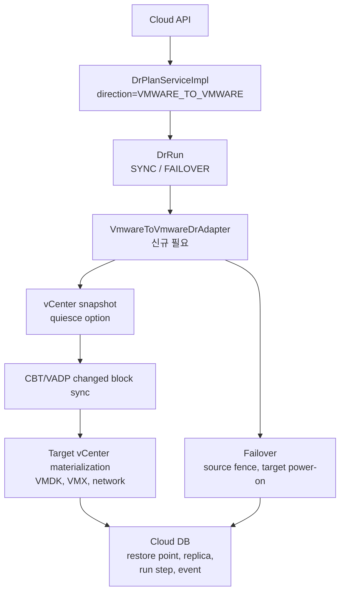
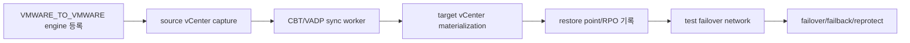

# VMware Operation To VMware DR Flow

작성일: 2026-07-01

대상 방향: VMware 운영 -> VMware DR

DR direction: `VMWARE_TO_VMWARE`

현재 engine: 전용 adapter 미구현

관련 문서:

- [500-cross-hypervisor-dr-architecture-plan-20260630.md](500-cross-hypervisor-dr-architecture-plan-20260630.md)
- [514-cross-hypervisor-dr-ui-backend-flow-diagrams-20260701.md](514-cross-hypervisor-dr-ui-backend-flow-diagrams-20260701.md)

## 1. 결론

이 방향은 운영 VMware site의 VM을 다른 VMware DR site로 보호하는 흐름이다.

현재 코드에는 `VMWARE_TO_VMWARE` direction 상수와 topology 검증 허용만 존재한다. 이 방향을 실제로 수행하는 dedicated engine adapter는 아직 없다. 따라서 현재 구현 기준으로는 VMware -> VMware DR을 "지원 완료"로 볼 수 없다.

이 방향은 V2K로 처리하면 안 된다. source와 target이 모두 VMware이므로 VMware snapshot, CBT, VADP, datastore copy, vCenter inventory 제어 같은 VMware-native 경로가 기술적으로 맞다.

## 2. 현재 구현 범위

| 항목 | 현재 상태 |
|---|---|
| 방향 상수 | `VMWARE_TO_VMWARE` |
| plan topology 허용 | 가능 |
| dedicated engine | 없음 |
| VMware source capture | 미구현 |
| CBT/VADP incremental sync | 미구현 |
| target vCenter VM materialization | 미구현 |
| sync/test/failover adapter | 미구현 |
| failback/reprotect | 미구현 |

현재 `DrPlanServiceImpl`은 direction 값 자체는 허용하지만, `FTCTL`, `VMWARE_PHASE1`, `V2K` engine 중 어느 것도 `VMWARE_TO_VMWARE` 전용 실행 경로가 아니다.

## 3. UI 흐름

목표 UI는 다음 항목을 받아야 한다.

| UI 영역 | 필요 입력 |
|---|---|
| source mapping | source vCenter, datacenter, cluster, VM, disk, network |
| target mapping | target vCenter, folder, resource pool, datastore, network |
| RPO policy | sync 주기, snapshot retention, quiesce 여부 |
| RTO policy | target VM pre-create 여부, boot validation 여부 |
| run 상태 | latest restore point, target-ready time, failover readiness |

현재는 dedicated engine이 없으므로 UI가 action을 열어두면 사용자가 끊어진 흐름을 만나게 된다. action eligibility는 engine 존재 여부와 target-ready 여부를 기준으로 비활성화해야 한다.

## 4. Backend 목표 흐름

목표 backend adapter는 다음 책임을 가져야 한다.

| 구성 | 역할 |
|---|---|
| `VmwareSourceCaptureService` | VMware snapshot/quiesce/CBT 세션 관리 |
| `VmwareReplicationService` | changed block copy, checksum, retry |
| `VmwareTargetMaterializer` | target datastore에 VMDK 반영, VM inventory 구성 |
| `VmwareFenceService` | failover 시 source VM stop, network isolation 또는 operator-confirmed fence |
| `VmwareFailoverService` | target VM power-on, network remap, guest readiness check |

## 5. RPO 분석

| 관점 | 현재 구현 | 목표 구현 |
|---|---|---|
| source RPO | 측정 불가 | VMware snapshot 또는 CBT checkpoint 시각 기준 |
| target-ready RPO | 측정 불가 | target datastore에 반영된 latest recoverable VMDK 기준 |
| 가능한 목표 | 없음 | CBT 기반이면 수 분 단위 목표 가능 |

VMware -> VMware는 네 방향 중 낮은 RPO를 달성하기 가장 좋은 후보이다. VMware CBT를 사용하면 full copy 이후 changed block만 전송할 수 있기 때문이다.

다만 CBT를 사용하지 않고 단순 export/import를 반복하면 RPO는 복제 주기와 전체 전송 시간에 묶인다. 그 경우 운영 DR보다 백업 복구에 가깝다.

## 6. RTO 분석

| target 준비 수준 | RTO 영향 |
|---|---|
| datastore disk만 존재 | VM register, network mapping, boot validation 시간이 추가된다. |
| powered-off standby VM 존재 | 전원 인가와 guest validation 중심으로 줄어든다. |
| isolated test network 검증 완료 | 실제 failover 전 검증 비용이 줄어든다. |

목표 RTO는 target VM을 얼마나 미리 만들어 두는지에 따라 달라진다. VMware -> VMware에서는 powered-off standby VM을 유지하면 수 분에서 수십 분 범위의 RTO를 목표로 할 수 있다.

현재 코드에는 이 경로가 없으므로 운영 RTO를 산정하면 안 된다.

## 7. 필요한 보강 작업

구체 작업은 다음 순서가 적절하다.

1. `VMWARE_TO_VMWARE` engine type과 adapter contract 추가
2. vCenter credential과 site binding model 확정
3. source snapshot/CBT checkpoint 생성
4. changed block transfer worker와 retry/lock 구현
5. target-ready restore point 기록
6. failover source fencing과 target power-on 구현
7. failback/reprotect는 phase2 이후 분리 설계

## 8. 기술 판단

현재 문서나 UI에서 VMware -> VMware를 이미 구현된 흐름처럼 표현하면 잘못이다.

정확한 표현은 다음과 같다.

| 구분 | 표현 |
|---|---|
| 현재 AS-IS | direction은 정의되어 있지만 실행 adapter가 없는 설계 후보 |
| 운영 가능 TO-BE | VMware-native snapshot/CBT/VADP 기반의 전용 replication adapter |

V2K는 VMware -> ABLESTACK 전환 도구에 가깝다. VMware -> VMware DR에는 V2K가 아니라 VMware-native 복제 경로가 필요하다.
