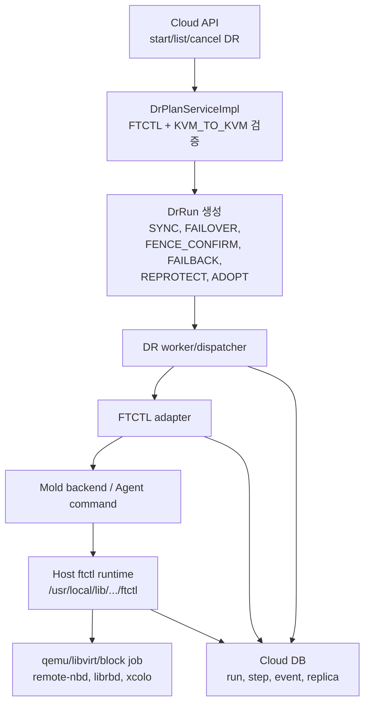
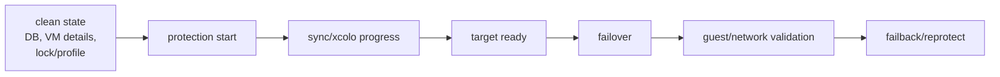

# ABLESTACK Operation To ABLESTACK DR Flow

작성일: 2026-07-01

대상 방향: ABLESTACK 운영 -> ABLESTACK DR

DR direction: `KVM_TO_KVM`

현재 engine: `FTCTL`

관련 문서:

- [500-cross-hypervisor-dr-architecture-plan-20260630.md](500-cross-hypervisor-dr-architecture-plan-20260630.md)
- [505-cross-hypervisor-dr-ftctl-v2k-integration-design-20260630.md](505-cross-hypervisor-dr-ftctl-v2k-integration-design-20260630.md)
- [512-cross-hypervisor-dr-kvm-to-kvm-vertical-slice-smoke-20260630.md](512-cross-hypervisor-dr-kvm-to-kvm-vertical-slice-smoke-20260630.md)
- [514-cross-hypervisor-dr-ui-backend-flow-diagrams-20260701.md](514-cross-hypervisor-dr-ui-backend-flow-diagrams-20260701.md)

## 1. 결론

이 방향은 현재 코드와 기존 FTCTL 성공 경로를 기준으로 가장 현실적인 DR 경로이다. ABLESTACK/KVM 운영 VM을 ABLESTACK/KVM DR site로 보호하며, 실제 disk/VM runtime 작업은 Cloud가 직접 수행하지 않고 FTCTL engine과 host agent 경로에 위임한다.

기존에 검증된 RBD -> RBD, RBD -> QCOW2, QCOW2 -> RBD, QCOW2 -> QCOW2 성공 로직은 이 경로의 핵심 자산이다. Cloud DR 계층은 이 로직을 재구현하지 않고, 비동기 action orchestration, 상태 표시, event/progress relay, DB 상태 관리를 맡아야 한다.

## 2. 현재 구현 범위

| 항목 | 현재 상태 |
|---|---|
| 방향 상수 | `KVM_TO_KVM` |
| engine | `FTCTL` |
| source/target hypervisor | ABLESTACK/KVM |
| 실제 복제 엔진 | qemu/FTCTL host runtime |
| Cloud 역할 | API, run 생성, adapter 호출, DB/event 상태 표시 |
| Mold/Agent 역할 | host action 전달 |
| ftctl 역할 | block copy, xcolo, remote-nbd/librbd, 상태 모니터링 |
| failover | FTCTL 경로에 위임 |
| fence confirm | FTCTL manual-block 정책과 연동 |
| failback/reprotect/adopt | FTCTL adapter 경로로 관리 |

## 3. UI 흐름

```mermaid
flowchart LR
  UI["Cloud UI<br/>Fault Protection / DR"]
  PLAN["DR Plan<br/>source ABLESTACK<br/>target ABLESTACK"]
  SYNC["Protect / Sync<br/>startDrRun(SYNC)"]
  PROGRESS["Progress polling<br/>DrRunStep + FTCTL event"]
  READY["Protected / Target Ready"]
  FAILOVER["Failover"]
  FENCE["Confirm Fence Clear<br/>manual-block only"]
  FAILBACK["Failback"]
  REPROTECT["Reprotect"]
  ADOPT["Adopt Replica"]

  UI --> PLAN --> SYNC --> PROGRESS --> READY --> FAILOVER --> FENCE --> FAILBACK --> REPROTECT --> ADOPT
```

UI 원칙은 다음과 같다.

- 모든 버튼은 Cloud API를 호출한다.
- UI는 FTCTL script, qemu, libvirt, host SSH를 직접 호출하지 않는다.
- 버튼 노출은 `getActionEligibility` 결과를 기준으로 한다.
- 긴 작업은 비동기 `DrRun`으로 생성하고, UI는 polling으로 상태를 갱신한다.
- `testFailover`, `stopTestFailover`처럼 현재 adapter에서 닫아둔 action은 미지원 사유와 함께 숨기거나 비활성화한다.

## 4. Backend 흐름

backend 책임 분리는 다음과 같다.

| 계층 | 책임 |
|---|---|
| UI | action 요청, 상태 표시 |
| Cloud API | request validation, async job/run 생성 |
| Cloud backend | DB 상태, action eligibility, worker dispatch |
| Mold/Agent | 대상 host로 action 전달 |
| FTCTL | VM/디스크 보호 실행, 상태 모니터링, event/progress 생성 |

Cloud backend는 FTCTL 내부의 성공 로직을 바꾸지 않아야 한다. 특히 storage type별 성공 경로인 RBD/RBD, RBD/QCOW2, QCOW2/RBD, QCOW2/QCOW2 handling은 ftctl runtime의 책임으로 남긴다.

## 5. RPO 분석

| 관점 | 현재 의미 |
|---|---|
| source RPO | source VM의 마지막 consistent block-copy/xcolo 기준 시점 |
| target-ready RPO | DR host 또는 target storage에서 실제 failover 가능한 최신 반영 시점 |
| 표시 방식 | FTCTL event/progress와 Cloud `DrReplica`/`DrRestorePoint`의 latest timestamp를 조합 |

이 경로는 네 방향 중 현재 RPO를 실제 runtime evidence로 계산할 수 있는 유일한 경로이다. 다만 RPO를 고정 숫자로 선언하면 안 된다. storage backend, 네트워크 대역폭, VM write rate, remote-nbd/librbd 경로, xcolo 상태에 따라 달라진다.

운영 UI에는 다음 값을 분리해서 보여주는 것이 좋다.

| 표시값 | 의미 |
|---|---|
| latest sync event time | FTCTL이 마지막으로 정상 progress를 보고한 시각 |
| replication lag | 현재 시각과 latest recoverable point의 차이 |
| target readiness | failover 가능 여부 |
| blocking reason | lock, stale state, storage mismatch, fence required 등 |

## 6. RTO 분석

| 상태 | RTO 영향 |
|---|---|
| standby VM이 준비됨 | failover와 guest readiness 중심으로 단축 |
| manual-block fencing | 운영자 확인 시간이 RTO에 포함 |
| stale blockjob/lock 존재 | cleanup 또는 forced release 시간이 추가 |
| target storage type mismatch | failover 전 검증 실패 가능 |

현재 목표 RTO는 분 단위에서 수십 분 범위로 보는 것이 현실적이다. 실제 RTO는 자동 failover만의 시간이 아니라 fence 확인, target VM 기동, guest/network validation까지 포함해야 한다.

## 7. 운영 체크포인트

운영 검증 시 확인해야 할 항목은 다음과 같다.

| 영역 | 확인 |
|---|---|
| Cloud DB | `dr_plan`, `dr_run`, `dr_run_step`, `dr_replica`, 기존 FTCTL protection row |
| VM details | stale `ftctl.*` detail 유무 |
| Host runtime | `/run/ablestack-vm-ftctl`, `/etc/ablestack/ftctl.d` state/profile |
| qemu/libvirt | blockjob, QMP 상태, xcolo 상태 |
| Service | `ablestack-vm-ftctl.timer`, `ablestack-vm-hangctl.timer`, Mold Agent |

## 8. 기술 판단

이 방향은 "현재 구현으로 운영 검증 가능한 기본 경로"로 분류할 수 있다. 다만 Cloud는 FTCTL을 대체하는 것이 아니라 FTCTL을 orchestration하는 위치에 있어야 한다.

| 구분 | 표현 |
|---|---|
| 현재 AS-IS | FTCTL 성공 경로를 Cloud DR action으로 감싸는 KVM-to-KVM 경로 |
| 운영 TO-BE | RPO/RTO 지표, event relay, cleanup/release UX를 강화한 ABLESTACK-to-ABLESTACK DR |

기존 FTCTL success path를 손대지 않는 것이 이 방향의 안정성 기준이다.
