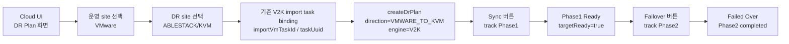
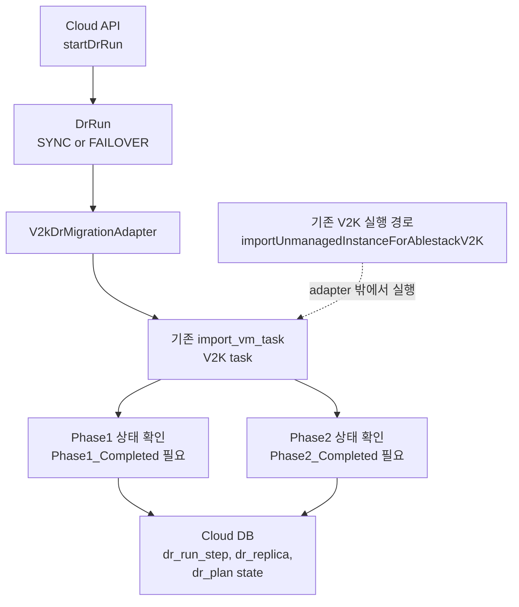
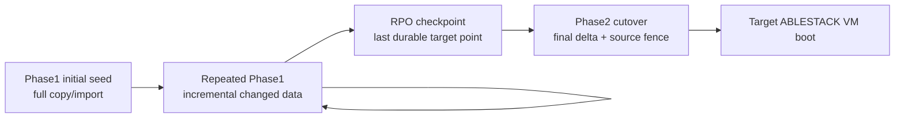
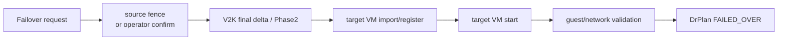
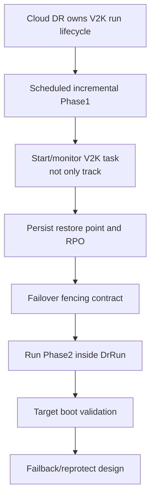

# VMware Operation To ABLESTACK DR Flow And V2K Analysis

> Normative Test Failover update (2026-07-19):
> [562-cross-hypervisor-dr-test-artifact-contract-and-projection-isolation-design-20260719.md](562-cross-hypervisor-dr-test-artifact-contract-and-projection-isolation-design-20260719.md)
> governs Cloud-owned temporary VM resources, Agent-validated canonical
> storage locators, FTCTL artifact-only execution, and projection isolation.
> V2K remains a migration workflow and is not the Test Failover controller.

작성일: 2026-07-01

대상 방향: VMware 운영 -> ABLESTACK DR

DR direction: `VMWARE_TO_KVM`

현재 engine: `V2K`

관련 문서:

- [500-cross-hypervisor-dr-architecture-plan-20260630.md](500-cross-hypervisor-dr-architecture-plan-20260630.md)
- [505-cross-hypervisor-dr-ftctl-v2k-integration-design-20260630.md](505-cross-hypervisor-dr-ftctl-v2k-integration-design-20260630.md)
- [514-cross-hypervisor-dr-ui-backend-flow-diagrams-20260701.md](514-cross-hypervisor-dr-ui-backend-flow-diagrams-20260701.md)

## 1. 결론

이 방향은 VMware 운영 VM을 ABLESTACK/KVM DR site로 복구하는 흐름이다.

현재 구현의 `V2kDrMigrationAdapter`는 V2K를 직접 실행하는 지속 복제 엔진이 아니다. 기존 `import_vm_task`를 찾아서 V2K Phase1/Phase2 상태를 `DrRunStep`, `DrReplica`, `DrPlan`에 반영하는 tracking wrapper에 가깝다.

따라서 "V2K를 사용하므로 지속적으로 변경 데이터가 DR 쪽에 전송된다"라고 판단하면 기술적으로 잘못이다. 현재 Cloud DR adapter는 지속 변경 데이터 전송을 scheduling하거나 시작하지 않는다. 기존 V2K task가 외부 경로에서 Phase1/Phase2를 수행했는지 확인할 뿐이다.

## 2. 현재 구현 범위

| 항목 | 현재 상태 |
|---|---|
| 방향 상수 | `VMWARE_TO_KVM` |
| engine | `V2K` |
| adapter | `com.cloud.dr.adapter.v2k.V2kDrMigrationAdapter` |
| source 검증 | VMware provider/task 필요 |
| target 검증 | KVM 또는 Cloud target task 필요 |
| task binding | 기존 `import_vm_task` 필요 |
| `SYNC` 처리 | 기존 task의 Phase1 완료 여부 추적 |
| `FAILOVER` 처리 | 기존 task의 Phase2 완료 여부 추적 |
| Phase1 실행 | adapter가 직접 시작하지 않음 |
| Phase2 실행 | adapter가 직접 시작하지 않음. 기존 V2K action 경로 필요 |
| 반복 sync scheduling | 미구현 |
| RPO 산정 | 미구현, `targetReadyRpoSeconds=null` |
| failback/reprotect/adopt | 미지원 |

## 3. UI 흐름

현재 UI에서 사용자가 기대할 수 있는 것은 "V2K task 상태를 DR 계획 안에서 확인하는 것"이다.

현재 UI가 제공하면 안 되는 인상은 다음과 같다.

- Cloud DR이 V2K Phase1을 자동으로 주기 실행한다.
- Cloud DR이 VMware changed block을 지속 전송한다.
- Cloud DR failover 버튼이 Phase2를 직접 수행한다.
- Cloud DR이 RPO를 보장한다.

이 네 가지는 현재 코드로 보장되지 않는다.

## 4. Backend 흐름

adapter의 현재 실행 의미는 다음과 같다.

| DrRun type | 현재 adapter 동작 | 완료 조건 |
|---|---|---|
| `SYNC` | 기존 V2K task를 조회하고 Phase1 완료 여부 확인 | `Phase1_Completed` 또는 동등 상태 |
| `FAILOVER` | 기존 V2K task를 조회하고 Phase2 완료 여부 확인 | `Phase2_Completed` 또는 `Completed` |
| `TEST_FAILOVER` | 미지원 | 없음 |
| `FAILBACK` | 미지원 | 없음 |
| `REPROTECT` | 미지원 | 없음 |
| `ADOPT` | 미지원 | 없음 |

Phase2가 완료되지 않은 경우 adapter는 사용자가 기존 V2K action 경로를 통해 Phase2를 실행해야 한다는 정보를 반환한다.

## 5. V2K Phase1/Phase2를 DR에 쓰려면 필요한 조건

DR은 migration과 다르다. Migration은 한 번 이동하면 끝날 수 있지만, DR은 장애 전까지 변경 데이터를 계속 DR 쪽에 반영해야 한다.

V2K Phase1/Phase2를 DR engine으로 사용하려면 최소한 다음 조건이 필요하다.

| 조건 | 설명 | 현재 Cloud DR adapter 상태 |
|---|---|---|
| initial seed | 첫 full copy/import | 외부 V2K task에 의존 |
| incremental sync | 변경 block만 반복 전송 | 미구현, 반복 실행/스케줄 없음 |
| checkpoint | 마지막 recoverable point 기록 | 일부 state만 기록, RPO seconds 없음 |
| cutover | source fence 후 final delta와 target 전환 | Phase2 완료 여부만 추적 |
| failure handling | 중단/재시도/부분 완료 정리 | DR adapter 수준에서는 제한적 |
| reverse path | failback/reprotect | 미지원 |

즉, V2K Phase1이 "반복 가능한 incremental sync"라면 DR engine으로 확장할 수 있다. 하지만 현재 Cloud DR adapter는 그 반복 실행을 소유하지 않는다. V2K Phase1이 반복 incremental을 지원하지 않는다면 이 경로는 DR이 아니라 migration/import 경로로 보는 것이 맞다.

## 6. RPO 분석

| 관점 | 현재 구현 | 목표 구현 |
|---|---|---|
| source RPO | adapter가 계산하지 않음 | VMware changed block checkpoint 기준 |
| target-ready RPO | `targetReadyRpoSeconds=null` | 마지막 성공 incremental Phase1 완료 시각 기준 |
| 단일 Phase1만 수행한 경우 | Phase1 완료 이후 경과 시간이 그대로 잠재 데이터 손실 | 허용 불가 또는 명확한 경고 필요 |
| 반복 Phase1이 가능한 경우 | Cloud가 반복 실행하지 않으므로 외부 운영에 의존 | N분 주기 sync라면 RPO는 N + 전송/검증 시간 |

현재 상태에서 RPO는 "알 수 없음" 또는 "마지막 외부 V2K Phase1 완료 이후 경과 시간"으로 표시해야 한다. Cloud DR이 변경 데이터 전송을 직접 수행하지 않으므로 RPO SLA를 표시하면 안 된다.

목표 구현에서는 다음 값을 저장해야 한다.

| 필드 | 의미 |
|---|---|
| `lastSourceCheckpointAt` | VMware source에서 변경 데이터 기준점을 잡은 시각 |
| `lastTargetMaterializedAt` | ABLESTACK target에 실제 반영 완료된 시각 |
| `targetReadyRpoSeconds` | 현재 시각 또는 failover 요청 시각과 target materialized point의 차이 |
| `lastIncrementalTaskId` | 어떤 V2K sync task가 해당 restore point를 만들었는지 |

## 7. RTO 분석

| 상태 | RTO 영향 |
|---|---|
| Phase1 미완료 | failover 불가 또는 매우 긴 복구 시간 |
| Phase1 완료, Phase2 미완료 | 기존 V2K Phase2 실행 시간이 RTO 대부분을 차지 |
| Phase2 자동 실행 미구현 | 운영자가 별도 V2K action을 실행해야 하므로 RTO가 늘어난다. |
| target VM boot 검증 미구현 | Phase2 완료 후에도 service recovery time을 별도 확인해야 한다. |

현재 구현의 `FAILOVER`는 Phase2를 직접 수행하지 않고 완료 여부를 확인한다. 따라서 "Cloud DR failover 버튼을 누른 시점부터 복구 완료까지"의 RTO는 현재 Cloud DR 단독으로 산정할 수 없다.

목표 구현에서는 failover run 안에서 다음 단계를 포함해야 한다.

## 8. 기술적으로 잘못 판단할 수 있는 부분

| 판단 | 평가 | 이유 |
|---|---|---|
| V2K를 쓰면 VMware -> ABLESTACK DR 변경 데이터가 지속 전송된다. | 잘못 또는 미확인 | 현재 adapter는 기존 task 상태를 추적할 뿐 반복 sync를 실행하지 않는다. |
| Phase1/Phase2만 있으면 DR이 된다. | 불충분 | DR에는 장애 전까지 반복 RPO checkpoint가 필요하다. |
| `SYNC`가 V2K Phase1을 시작한다. | 현재 코드 기준 잘못 | `SYNC`는 기존 task의 Phase1 완료 여부를 확인한다. |
| `FAILOVER`가 V2K Phase2를 실행한다. | 현재 코드 기준 잘못 | `FAILOVER`는 Phase2 완료 여부를 확인하고 미완료면 기존 V2K action 경로를 안내한다. |
| VMware -> ABLESTACK은 운영 가능 DR로 표시해도 된다. | 현재는 주의 필요 | migration-backed preview 또는 V2K task tracking 상태가 정확하다. |

## 9. 필요한 보강 작업

구체 보강 항목은 다음과 같다.

| 영역 | 보강 내용 |
|---|---|
| API | V2K import task binding뿐 아니라 Phase1 실행/반복 정책 입력 |
| DB | restore point, last checkpoint, target materialized timestamp, RPO seconds 저장 |
| worker | 반복 Phase1 scheduler, 중복 실행 lock, retry/backoff |
| adapter | 기존 task 추적에서 V2K command dispatch까지 확장 |
| failover | source fence, final delta, Phase2 실행, target VM start를 하나의 비동기 run으로 관리 |
| UI | "external task tracking"과 "Cloud-managed replication" capability를 구분 표시 |
| 운영 | Phase1 반복 가능 여부, CBT/changed block 지원 여부, 실패 시 재개 가능성 실측 |

## 10. 권장 표현

현재 구현을 제품/운영 문서에 표현할 때는 다음 표현이 안전하다.

| 구분 | 표현 |
|---|---|
| 현재 AS-IS | V2K import task 기반 VMware -> ABLESTACK DR tracking preview |
| 금지 표현 | V2K 기반 지속 DR 복제 지원 완료 |
| 목표 TO-BE | Cloud-managed V2K incremental sync + failover orchestration |

V2K는 재사용 가능한 중요한 자산이지만, 현재 형태만으로는 DR의 지속 변경 데이터 전송 요구를 충족한다고 보기 어렵다. 먼저 V2K Phase1이 반복 incremental sync로 동작하는지 실측하고, 가능하다면 Cloud worker가 그 반복 실행을 소유하도록 확장해야 한다.
## 2026-07-07 Update: FTCTL_DR VMware To ABLESTACK Readiness Gate

The current VMware to ABLESTACK direction is no longer treated as a V2K task
tracking path for DR validation. It is implemented through `FTCTL_DR` with a
VMware CBT/VDDK source driver and an ABLESTACK target driver. The validation for
plan `05527cbe-974e-4ca8-b65e-f844cb3420e7` found a concrete readiness gap:
the VMware source disk `2000` was selected, but its disk size was unresolved and
reached FTCTL as `sizeBytes=0`. FTCTL correctly failed the run with
`DR_TARGET_DISK_SIZE_UNRESOLVED`.

For this direction, the flow is updated as follows:

1. UI selects source VMware VM and target ABLESTACK resources.
2. `discoverDrPlanInventory` must return source disk metadata with positive
   `sizeBytes`/`capacityBytes`.
3. `previewDrPlanSpec` must block execution when any source disk size is
   missing or zero.
4. `createDrPlan(startsync=true)` must call the same validator and must not
   dispatch to Agent/FTCTL until the disk map is execution-ready.
5. FTCTL remains the final guard and returns terminal JSON if Cloud missed an
   invalid source/target disk contract.
6. Cloud projection must turn terminal FTCTL status into `ERROR` in API/UI.

Detailed code-level design is maintained in
`538-cross-hypervisor-dr-vmware-to-kvm-disk-size-and-projection-hardening-design-20260707.md`.

## 2026-07-10 Update: Reuse V2K Inventory Semantics, Not The V2K Engine

The source VM boot regression confirms the required boundary:

- FTCTL_DR remains the replication/DR engine.
- The v2k Phase1/Phase2 migration lifecycle is not invoked by DR.
- VMware source inventory reuses the proven v2k field semantics:
  `config.firmware`, `config.bootOptions.efiSecureBootEnabled`, `guestId`, CPU,
  memory, and disk controller data.
- The connection is vCenter-based. No ESXi host account is required or passed.
- Cloud persists the normalized source hardware contract and resolves the
  ABLESTACK target boot contract before Agent/FTCTL dispatch.
- FTCTL receives and echoes only the non-secret normalized hardware contract
  and fingerprint; Cloud remains responsible for target VM creation.

The detailed implementation and live preflight evidence are maintained in
section 16 of
`548-cross-hypervisor-dr-agent-action-compatibility-and-state-convergence-design-20260709.md`.

## 2026-07-14 Update: Guest Preparation Reuse Boundary

하드웨어 contract 복사와 guest OS의 KVM 부팅 준비는 서로 다른 단계다.
현재 FTCTL test path는 체크포인트와 qcow2 overlay를 만들지만 V2K의 Linux
VirtIO/initramfs 및 Windows WinPE driver preparation을 호출하지 않는다.

보강 시에도 `ablestack_v2k run`, Phase1, Phase2를 DR에서 호출하지 않는다.
대신 V2K에서 검증된 guest preparation 함수만 namespaced shared library로
분리하고, 기존 V2K public function은 compatibility wrapper로 유지한다.

- Linux: `virtio_pci`, `virtio_scsi`, `virtio_blk`, initramfs rebuild/verify
- Windows: WinPE + `virtio-win.iso`, Secure Boot temporary disable/restore
- Test Failover: checkpoint-derived writable layer에만 적용
- Real Failover: final sync와 replication stop 이후 recovery disk에 적용

규범 설계와 32.x preflight 결과:
`554-cross-hypervisor-dr-vmware-to-kvm-cutover-and-virtio-bootstrap-design-20260714.md`.
