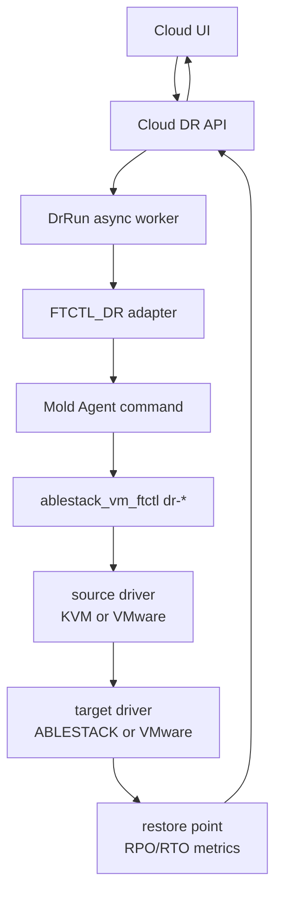

# Cross Hypervisor DR Full Implementation Work Plan

> 2026-08-10 implementation addendum: complete the powered-on VMware CBT
> activation state machine before further failover/failback validation. Required
> order is FTCTL disk-evidence authority, snapshot cleanup/retry, Agent field
> preservation, Backend/API asynchronous projection, UI state mapping, builds,
> deployment, failed-run cleanup, full seed, and one verified incremental cycle.
> Detailed design:
> `600-cross-hypervisor-dr-vmware-cbt-activation-convergence-design-20260810.md`.

> 2026-08-05 current P0 correction: implement document
> [595](595-cross-hypervisor-dr-failback-route-contract-and-terminal-convergence-design-20260805.md)
> and FTCTL companion 452 before the next Failback retest. Route v2, the
> production-tuple gate test, and atomic failure convergence precede cleanup.

> 2026-08-05 priority update: implement document
> [594](594-cross-hypervisor-dr-live-worker-and-terminal-reconciliation-design-20260805.md)
> P0 items before the next destructive Failback retest.

> 2026-08-04 P0 live-runtime gate correction:
> [592-cross-hypervisor-dr-failback-live-runtime-preflight-and-ux-convergence-design-20260804.md](592-cross-hypervisor-dr-failback-live-runtime-preflight-and-ux-convergence-design-20260804.md)
> must be implemented before another live Failback retry. The target Agent
> domain gate, vCenter source observation, stage API, action-time revalidation,
> FTCTL projection boundary, and UI stage rendering precede paired retest.
>
> 2026-08-04 P0 Failback correction:
> [591-cross-hypervisor-dr-failback-initial-reverse-seed-and-early-failure-convergence-design-20260804.md](591-cross-hypervisor-dr-failback-initial-reverse-seed-and-early-failure-convergence-design-20260804.md)
> revision 2 must be completed before another live Failback retry. The order is
> FTCTL mode selector/preflight, Agent contract, Cloud session/lifecycle/DB,
> UI readiness, paired deployment, initial full reverse seed, then a measured
> second incremental cycle.
>
> 2026-08-03 implementation priority update:
> [590-cross-hypervisor-dr-plan-async-mutation-and-target-resource-ownership-design-20260803.md](590-cross-hypervisor-dr-plan-async-mutation-and-target-resource-ownership-design-20260803.md)
> is the normative P0-P8 plan for async plan mutation safety and target VM,
> volume, and artifact ownership integrity.

작성일: 2026-07-01

대상 브랜치: `feature/ftctl-cloud-integration`

목표: 4개 DR 방향을 모두 skeleton/정의 수준이 아닌 실제 지속 복제 기반 DR 작업 수준으로 구현한다.

## 1. 정정된 원칙

앞선 방향별 문서는 현재 구현 수준을 기준으로 판단했기 때문에 `VMWARE_PHASE1`, `V2K` 같은 skeleton/tracking 상태를 그대로 드러냈다. 구현 목표는 그 수준이 아니다.

이번 작업의 원칙은 다음과 같이 고정한다.

1. 4개 방향 모두 같은 수준으로 구현한다.
2. 모든 방향은 지속적 또는 반복 incremental 데이터 전송으로 RPO를 산정하고 만족 여부를 판단한다.
3. 모든 방향은 target-ready restore point, test failover, failover, failback/reprotect까지 같은 action model을 가진다.
4. `V2K`는 이관용 도구로 유지하고 DR engine으로 사용하지 않는다.
5. VMware 연동에는 VDDK/CBT 등 DR에 맞는 데이터 접근 기술을 사용할 수 있지만, V2K workflow는 건드리지 않는다.
6. 실제 데이터 이동 engine은 `ablestack-qemu-exec-tools`의 FTCTL 영역에 포함한다.

## 2. 구현 목표 상태

| 방향 | source driver | target driver | 지속 데이터 전송 | failover 수준 |
|---|---|---|---|---|
| ABLESTACK 운영 -> VMware DR | KVM/QEMU dirty bitmap + source export | VMware VDDK/VMDK writer | full seed + dirty extent loop | VMware target VM power-on |
| VMware 운영 -> VMware DR | VMware CBT + VDDK reader | VMware VDDK/VMDK writer | full seed + CBT incremental loop | VMware target VM power-on |
| ABLESTACK 운영 -> ABLESTACK DR | 기존 FTCTL/xcolo 또는 KVM dirty bitmap source | ABLESTACK RBD/QCOW2 target writer | 기존 성공 경로 보존 + checkpoint/RPO 표준화 | ABLESTACK standby VM promote |
| VMware 운영 -> ABLESTACK DR | VMware CBT + VDDK reader | ABLESTACK RBD/QCOW2 target writer | full seed + CBT incremental loop | ABLESTACK target VM power-on |

`ABLESTACK -> ABLESTACK`은 기존 FTCTL 성공 경로를 버리지 않는다. 대신 새 공통 DR engine 계약 안으로 projection/reporting/RPO metric을 맞춘다.

## 3. V2K 제외 판단

`V2K`는 VM 이관/import workflow이다. 현재 Cloud adapter도 기존 `import_vm_task`의 Phase1/Phase2 상태를 추적할 뿐, 장애 전까지 변경 데이터를 계속 전송하는 DR loop를 소유하지 않는다.

따라서 아래 판단을 구현 기준으로 삼는다.

| 항목 | 결정 |
|---|---|
| V2K DR engine 사용 | 금지 |
| V2K 코드 변경 | 하지 않음 |
| V2K UI/adapter | migration/import 기능으로만 유지 |
| VMware -> ABLESTACK DR | 새 FTCTL DR engine의 VMware CBT source + ABLESTACK target writer로 구현 |
| VDDK 사용 | 가능. 단 V2K workflow가 아니라 새 DR source/target driver에서 사용 |

## 4. 새 engine: `FTCTL_DR`

Cloud에는 `ENGINE_TYPE_FTCTL_DR`을 추가하고, host runtime은 기존 `ablestack_vm_ftctl` 패키지 안에 DR subcommand와 library를 추가한다.

기존 `FTCTL` engine은 KVM-to-KVM 호환 경로로 유지하되, 최종적으로 4개 방향은 모두 `FTCTL_DR` engine 계약으로 동작하게 한다.



## 5. FTCTL runtime 작업 계획

대상 repository: `C:\Users\ablecloud\Documents\GitHub\dhslove\ablestack-qemu-exec-tools`

### 5.1 CLI/subcommand

기존 `bin/ablestack_vm_ftctl.sh`에 DR subcommand를 추가한다.

| command | 역할 |
|---|---|
| `dr-plan-apply` | Cloud에서 내려준 DR profile 검증/저장 |
| `dr-sync-start` | full seed 또는 incremental sync loop 시작 |
| `dr-sync-stop` | sync loop 중지 |
| `dr-status` | session/checkpoint/RPO 상태 출력 |
| `dr-test-failover` | target snapshot/clone 또는 isolated boot 검증 |
| `dr-test-cleanup` | test failover 자원 정리 |
| `dr-failover` | disaster/planned failover 수행 |
| `dr-failback` | reverse replication 준비 및 복귀 |
| `dr-reprotect` | failover 후 반대 방향 보호 재구성 |

### 5.2 신규 library 구조

```text
lib/ftctl/dr/
  common.sh
  profile.sh
  session.sh
  checkpoint.sh
  metrics.sh
  source_kvm_qmp.sh
  source_vmware_cbt.sh
  target_ablestack.sh
  target_vmware_vddk.sh
  failover.sh
  test_failover.sh
  cleanup.sh
  reporter.sh
  mover.py
```

`mover.py`는 extent 단위 read/write, checksum, sparse handling, retry, throughput 제한을 담당한다. Shell은 orchestration과 system integration을 담당한다.

### 5.3 상태/프로파일 경로

| 경로 | 용도 |
|---|---|
| `/etc/ablestack/ftctl.d/dr/<plan_uuid>.conf` | Cloud가 내려준 DR profile |
| `/run/ablestack-vm-ftctl/dr/<plan_uuid>/session.state` | 현재 sync/failover session 상태 |
| `/var/lib/ablestack-vm-ftctl/dr/<plan_uuid>/checkpoints/` | durable checkpoint metadata |
| `/var/log/ablestack-vm-ftctl/dr/<plan_uuid>/events.log` | Cloud relay용 event |

### 5.4 KVM source driver

KVM/ABLESTACK source는 실행 중인 QEMU에 대해 QMP dirty bitmap 기반으로 변경 영역을 추적한다.

구현 방식:

1. full seed 전에 disk별 tracking bitmap을 만든다.
2. full seed 중 발생한 write는 active bitmap에 남긴다.
3. full seed 완료 후 dirty extent를 target에 반복 전송한다.
4. target flush와 checksum 검증이 끝난 뒤 checkpoint를 생성한다.
5. checkpoint가 durable 상태가 된 뒤에만 bitmap generation을 advance한다.
6. engine 재시작으로 bitmap continuity가 깨지면 해당 disk는 `FULL_RESYNC_REQUIRED`로 표시한다.

대상 backend:

| source disk | 접근 방식 |
|---|---|
| qcow2/file | QMP block export 또는 qemu-nbd export |
| RBD | QEMU block node export 또는 librbd-capable qemu path |
| raw/block | QMP block export 또는 block device read |

### 5.5 VMware source driver

VMware source는 VDDK와 vSphere CBT를 사용한다. V2K는 사용하지 않는다.

구현 방식:

1. vCenter credential은 UI에서 URL, username, password로 입력받고 Cloud가 `dr_site_credential`에 암호화 저장한다. Host에는 `/run`의 root-only credential file로만 materialize하고 profile에는 credential file path만 남긴다.
2. CBT enabled 여부를 확인하고 필요 시 enable 요청을 별도 action으로 분리한다.
3. disk별 `changeId`를 저장한다.
4. `QueryChangedDiskAreas` 결과로 changed extents를 얻는다.
5. VDDK 또는 `nbdkit-vddk` backend로 VMDK extents를 읽는다.
6. target flush 후 `changeId`, target checkpoint, RPO lag를 함께 저장한다.

VDDK 라이브러리는 패키지에 포함하지 않는다. 설치 여부를 preflight에서 검사하고, 미설치 시 `MISSING_VDDK`로 fail-fast 처리한다.

### 5.6 ABLESTACK target driver

ABLESTACK target은 RBD/QCOW2를 모두 지원한다.

| target storage | writer |
|---|---|
| RBD | qemu/librbd-capable writer 우선, 필요 시 krbd는 fallback |
| QCOW2/file | sparse pwrite + qemu-img/qemu-io validation |
| raw/block | block pwrite + flush |

target VM은 powered-off standby로 유지한다. test failover는 RBD snapshot/clone 또는 qcow2 overlay를 사용해 운영 checkpoint를 오염시키지 않는다.

### 5.7 VMware target driver

VMware target은 vCenter API와 VDDK/VMDK writer를 사용한다.

구현 방식:

1. target folder/resource pool/datastore/network mapping 검증
2. powered-off standby VM 생성 또는 갱신
3. disk별 VMDK 생성
4. VDDK writer로 full seed/incremental extent 반영
5. target flush 후 checksum/size validation
6. target-ready checkpoint 기록
7. test failover는 isolated portgroup 또는 별도 test network에서 수행

## 6. Cloud 작업 계획

대상 repository: `C:\Users\ablecloud\Documents\GitHub\dhslove\ablestack-cloud`

### 6.1 Engine model

| 현재 | 변경 |
|---|---|
| `FTCTL`은 KVM-to-KVM만 처리 | legacy 호환으로 유지 |
| `VMWARE_PHASE1`은 skeleton replica 생성 | DR UI에서 제거 또는 preview로 격하 |
| `V2K`는 VMware-to-KVM DR처럼 노출 | DR engine에서 제외, migration/import로만 유지 |
| 방향별 구현 수준이 다름 | `FTCTL_DR`이 4개 방향 모두 처리 |

변경 파일 후보:

- `DrConstants.java`
- `DrPlanServiceImpl.java`
- `DrAdapterRegistryImpl.java`
- `FtctlDrActionAdapter.java` 또는 신규 `FtctlDrUnifiedActionAdapter.java`
- `DrRunExecutorImpl.java`
- DR API command/response classes
- UI `dr` components

### 6.2 DB/model

기존 `dr_restore_point`, `dr_replica`, `dr_replica_disk`, `dr_run_step`을 최대한 재사용하되, checkpoint/RPO 산정에 부족하면 upgrade path를 추가한다.

필수 필드:

| 필드 | 용도 |
|---|---|
| `rpo_target_seconds` | plan의 RPO 목표 |
| `rto_target_seconds` | plan의 RTO 목표 |
| `last_source_checkpoint_at` | source에서 변경 기준점을 확정한 시간 |
| `last_target_durable_at` | target에 checkpoint가 durable하게 반영된 시간 |
| `target_ready_rpo_seconds` | 현재 또는 failover 요청 시점 기준 RPO lag |
| `checkpoint_sequence` | disk별 checkpoint ordering |
| `checkpoint_token` | QMP bitmap generation 또는 VMware CBT changeId |
| `consistency_state` | crash-consistent, app-consistent, unknown |

### 6.3 API/action

4개 방향 모두 같은 action set을 가져야 한다.

| action | 4개 방향 지원 목표 |
|---|---|
| `startSync` | 지원 |
| `pauseSync` / `resumeSync` | 지원 |
| `testFailover` | 지원 |
| `stopTestFailover` | 지원 |
| `failover` | 지원 |
| `failback` | 지원 |
| `reprotect` | 지원 |
| `cancelRun` | 지원 |
| `releaseProtection` | 지원 |

API는 항상 비동기 run을 만들고 즉시 반환한다. 장시간 작업은 host engine이 수행하고 Cloud는 event/progress를 polling 또는 agent report로 반영한다.

### 6.4 UI

UI는 engine capability가 아니라 4개 방향 공통 contract를 기준으로 구성한다.

필수 표시:

- direction
- source/target provider
- RPO target
- current RPO lag
- RTO target
- latest target-ready checkpoint
- sync state
- test failover state
- active side
- failover readiness
- blocking reason

UI에서 `V2K`를 DR engine으로 선택하는 흐름은 제거한다. V2K는 migration/import 화면에 남긴다.

## 7. RPO/RTO 만족 방식

### 7.1 RPO

RPO는 아래 공식으로 판단한다.

```text
rpo_lag_seconds = now - last_target_durable_at
RPO satisfied = rpo_lag_seconds <= rpo_target_seconds
```

checkpoint는 다음 조건을 모두 만족해야 durable로 인정한다.

1. source changed extents가 모두 target에 쓰였다.
2. target flush/fsync가 완료됐다.
3. disk size/manifest/checksum validation이 통과했다.
4. checkpoint metadata가 host state와 Cloud DB에 모두 기록됐다.
5. target VM이 해당 checkpoint로 boot 가능한 형태를 유지한다.

### 7.2 RTO

RTO는 failover 요청부터 target service usable까지의 시간으로 본다.

RTO를 줄이기 위한 필수 구현:

- target powered-off standby VM 사전 생성
- network mapping 사전 검증
- storage attach 사전 검증
- test failover를 통한 boot 가능성 검증
- planned failover 시 final delta sync
- disaster failover 시 latest durable checkpoint로 즉시 promote

## 8. 4개 방향별 완료 기준

| 완료 기준 | ABLESTACK->VMware | VMware->VMware | ABLESTACK->ABLESTACK | VMware->ABLESTACK |
|---|---|---|---|---|
| full seed | KVM export -> VMDK | VDDK read -> VMDK | 기존 FTCTL/KVM seed | VDDK read -> RBD/QCOW2 |
| incremental sync | QMP dirty bitmap | VMware CBT | FTCTL/xcolo or dirty bitmap | VMware CBT |
| target-ready checkpoint | VMware VM | VMware VM | ABLESTACK standby VM | ABLESTACK VM |
| RPO lag 표시 | 지원 | 지원 | 지원 | 지원 |
| test failover | isolated VMware VM | isolated VMware VM | isolated ABLESTACK VM | isolated ABLESTACK VM |
| planned failover | final delta + VMware power-on | final delta + VMware power-on | existing FTCTL promote | final delta + ABLESTACK power-on |
| disaster failover | latest durable checkpoint | latest durable checkpoint | latest durable checkpoint | latest durable checkpoint |
| failback/reprotect | reverse direction profile | reverse direction profile | existing FTCTL failback | reverse direction profile |

## 9. 구현 순서

### Phase 0. DR engine 정리

1. `VMWARE_PHASE1`과 `V2K`를 production DR engine에서 제외하는 문서/코드 gate 정리
2. `FTCTL_DR` engine constant와 plan validation 추가
3. 4개 direction 모두 `FTCTL_DR`로 생성 가능하게 변경
4. UI engine 선택에서 V2K 제거

완료 기준:

- skeleton/tracking engine이 DR action eligibility에 나타나지 않는다.
- 4개 direction plan은 모두 `FTCTL_DR`로 생성된다.

### Phase 1. FTCTL_DR profile/state/event contract

1. host profile schema 작성
2. session/checkpoint/event 상태 파일 구현
3. Cloud agent command payload 정의
4. status JSON schema 정의
5. selftest fixture 작성

완료 기준:

- 실제 데이터 전송 전에도 profile validation, status reporting, event relay가 동작한다.
- Cloud에서 run/progress/RPO 필드가 동일하게 표시된다.

### Phase 2. KVM source + ABLESTACK target

1. KVM QMP dirty bitmap source driver 구현
2. ABLESTACK RBD/QCOW2 target writer 구현
3. 기존 FTCTL KVM-to-KVM 성공 경로와 연결
4. RBD/QCOW2 4개 조합 regression test

완료 기준:

- ABLESTACK -> ABLESTACK이 새 `FTCTL_DR` contract로 full seed/incremental/failover/test failover를 통과한다.
- 기존 rbd-rbd, rbd-qcow2, qcow2-rbd, qcow2-qcow2 성공 경로가 깨지지 않는다.

### Phase 3. VMware source driver

1. VDDK/nbdkit-vddk preflight 구현
2. vCenter inventory lookup 구현
3. CBT enable/check 구현
4. changed extent enumeration 구현
5. VDDK reader -> common mover 연결

완료 기준:

- VMware source VM에서 full seed와 CBT incremental extent 추출이 가능하다.
- V2K를 호출하지 않는다.

### Phase 4. VMware target driver

1. vCenter powered-off target VM inventory와 VMDK 생성
2. VMDK writer 구현
3. network/datastore/resource pool mapping 검증
4. isolated test failover 구현
5. target-ready checkpoint 기록

완료 기준:

- ABLESTACK -> VMware와 VMware -> VMware가 target VMDK/VM을 실제로 materialize한다.
- failover button이 skeleton이 아니라 실제 target-ready checkpoint 기준으로 열린다.

### Phase 5. 방향 조합 완성

1. ABLESTACK -> VMware: KVM source + VMware target
2. VMware -> VMware: VMware source + VMware target
3. ABLESTACK -> ABLESTACK: KVM source + ABLESTACK target
4. VMware -> ABLESTACK: VMware source + ABLESTACK target

완료 기준:

- 4개 direction 모두 동일 action set과 동일 RPO/RTO 표시를 가진다.
- 한 방향이라도 skeleton/tracking-only이면 phase 완료로 보지 않는다.

### Phase 6. Cloud UI/API 완성

1. plan wizard의 source/target mapping 보강
2. RPO/RTO policy 입력 추가
3. restore point timeline 추가
4. test failover/failover/failback/reprotect 버튼 모두 실제 backend action 연결
5. dark mode 포함 상태/위험/경고 스타일 정리

완료 기준:

- UI의 모든 버튼이 API/backend/agent/engine 동작까지 이어진다.
- 비동기 run 중에도 사용자가 다른 작업을 계속할 수 있다.

### Phase 7. 검증/빌드/배포

1. qemu repo selftest 추가 및 GitHub Actions build
2. Cloud changed Maven module build
3. UI build
4. 테스트 클러스터 배포
5. 4개 direction별 smoke
6. 4개 direction별 RPO/RTO evidence 수집

완료 기준:

- 각 direction마다 full seed, incremental sync, test failover, failover, cleanup/reprotect evidence가 남는다.
- RPO lag와 RTO 측정값이 문서화된다.

## 10. 위험과 사전 확인 항목

| 위험 | 사전 확인 |
|---|---|
| VDDK 라이선스/배포 제약 | VDDK binary는 패키지에 포함하지 않고 host preflight로 설치 여부만 확인 |
| VMware CBT 비활성 또는 snapshot 정책 충돌 | CBT enable workflow와 snapshot cleanup policy를 명확히 분리 |
| KVM dirty bitmap continuity 손실 | continuity 깨지면 incremental을 믿지 않고 full resync로 전환 |
| RBD writer 경로 안정성 | librbd-capable qemu writer를 우선하고 krbd는 fallback으로만 사용 |
| test failover가 운영 checkpoint 오염 | snapshot/clone/overlay 기반으로 isolated boot |
| Cloud API 동기 대기 회귀 | 모든 action은 run 접수 후 즉시 반환하고 worker/agent report로 진행 |

## 11. AS-IS / TO-BE

| 영역 | AS-IS | TO-BE |
|---|---|---|
| ABLESTACK -> VMware | `VMWARE_PHASE1` skeleton | KVM dirty bitmap -> VMware VDDK writer 지속 복제 |
| VMware -> VMware | direction만 존재 | VMware CBT -> VMware VDDK writer 지속 복제 |
| ABLESTACK -> ABLESTACK | 기존 FTCTL 성공 경로 중심 | 기존 성공 경로 보존 + `FTCTL_DR` checkpoint/RPO/RTO 표준화 |
| VMware -> ABLESTACK | V2K import task tracking | VMware CBT -> ABLESTACK RBD/QCOW2 writer 지속 복제 |
| RPO | 일부 방향 null 또는 산정 불가 | 모든 방향 `last_target_durable_at` 기준 산정 |
| RTO | target readiness 불균일 | 모든 방향 warm standby + test failover + failover action 완성 |
| engine | 방향별 수준 차이 | `FTCTL_DR` 단일 contract |
| V2K | DR처럼 보일 수 있음 | migration/import 전용으로 분리 |

## 12. 다음 작업

다음 구현 착수 시 첫 단계는 Phase 0과 Phase 1이다. 먼저 Cloud에서 skeleton/tracking engine이 DR로 노출되지 않게 정리하고, qemu repo에 `FTCTL_DR` profile/state/event contract를 만든다. 그 다음 KVM source + ABLESTACK target부터 연결해 기존 성공 경로를 깨지 않는지 확인한 뒤 VMware source/target driver를 붙인다.

## 13. 부속 상세 구현 설계 문서

| 문서 | 범위 |
|---|---|
| [521-cross-hypervisor-dr-full-stack-implementation-design-20260701.md](521-cross-hypervisor-dr-full-stack-implementation-design-20260701.md) | UI/API/Backend/Agent/FTCTL 전 계층 공통 구현 계약 |
| [522-cross-hypervisor-dr-protection-failover-failback-sequence-design-20260701.md](522-cross-hypervisor-dr-protection-failover-failback-sequence-design-20260701.md) | DR 보호 설정, test failover, planned/disaster failover, failback, reprotect 시퀀스 |
| [523-cross-hypervisor-dr-ftctl-engine-driver-design-20260701.md](523-cross-hypervisor-dr-ftctl-engine-driver-design-20260701.md) | `FTCTL_DR` runtime, KVM/VMware source driver, ABLESTACK/VMware target driver 구현 설계 |
| [524-cross-hypervisor-dr-implementation-smoke-build-plan-20260701.md](524-cross-hypervisor-dr-implementation-smoke-build-plan-20260701.md) | 구현, 스모크 검증, Maven/UI/GitHub Actions 빌드 완료까지의 단계별 실행 계획 |
| [534-cross-hypervisor-dr-sync-readiness-and-materialization-contract-design-20260706.md](534-cross-hypervisor-dr-sync-readiness-and-materialization-contract-design-20260706.md) | sync accepted, target materialization, restore point, RPO 기반 READY 판정 계약 |
| [554-cross-hypervisor-dr-vmware-to-kvm-cutover-and-virtio-bootstrap-design-20260714.md](554-cross-hypervisor-dr-vmware-to-kvm-cutover-and-virtio-bootstrap-design-20260714.md) | VMware to KVM guest preparation, VirtIO, transient test VM, 실제 Failover boot gate |
| [590-cross-hypervisor-dr-plan-async-mutation-and-target-resource-ownership-design-20260803.md](590-cross-hypervisor-dr-plan-async-mutation-and-target-resource-ownership-design-20260803.md) | plan create/update 비동기 응답 분리, target VM/volume/artifact claim, Agent 실측, FTCTL manifest v2 계약 |
| [591-cross-hypervisor-dr-failback-initial-reverse-seed-and-early-failure-convergence-design-20260804.md](591-cross-hypervisor-dr-failback-initial-reverse-seed-and-early-failure-convergence-design-20260804.md) | 최초 역방향 전체 시드 선택, Failback 데이터 Preflight, typed terminal error 및 TARGET authority 보존 계약 |

## 14. 2026-07-14 추가 구현 단계

Continuous sync와 target materialization 이후 아래 cutover 단계가 남아 있다.

1. V2K 호환성을 유지하는 shared guest-preparation library
2. qcow2/RBD writable-layer driver
3. Linux VirtIO/initramfs와 Windows WinPE/Secure Boot preparation
4. isolated transient Test Failover domain과 boot validation
5. real Failover `CUTOVER_READY`와 Cloud target VM start gate
6. Agent/API/UI typed projection 및 cutover DB entity

이 단계가 완료되기 전에는 VMware to ABLESTACK Test Failover 또는 real
Failover를 완전 구현으로 판정하지 않는다.

### 2026-07-14 VMware Incremental Acceptance Addendum

The work-plan statements for VMware CBT are target requirements, not evidence
that the deployed mover is incremental. Acceptance now requires a real
`QueryChangedDiskAreas` call, extent-only apply, committed per-disk changeId,
and measured changed/read/written bytes according to
`555-cross-hypervisor-dr-vmware-cbt-incremental-and-transfer-metrics-design-20260714.md`.
