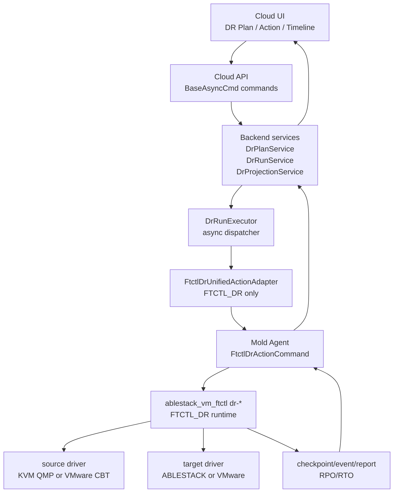
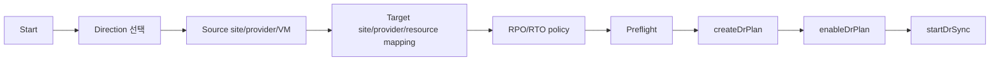
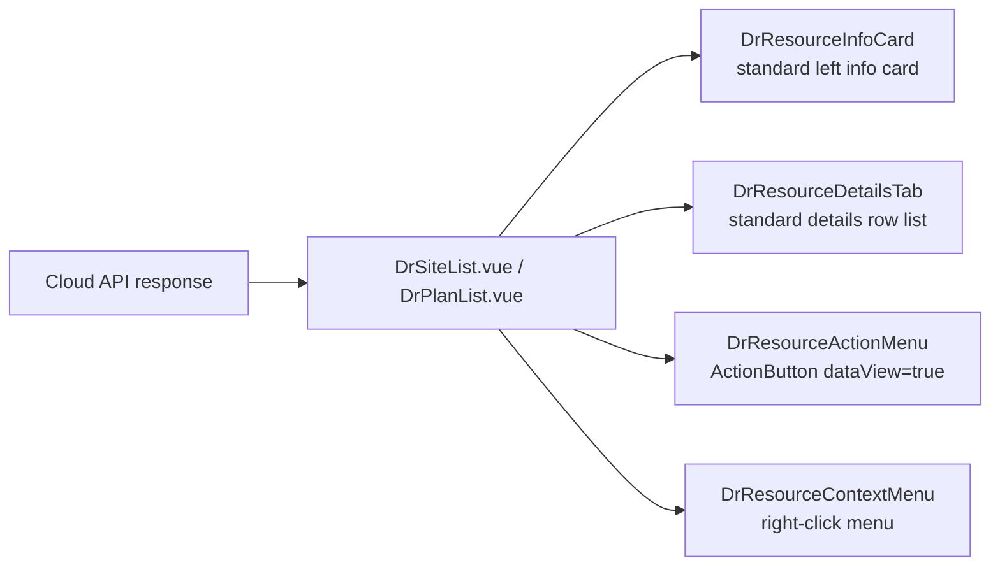

# Cross Hypervisor DR Full Stack Implementation Design

> 2026-08-10 full-stack addendum: VMware CBT activation for a powered-on source
> is an asynchronous configure -> run-snapshot activation -> per-disk evidence
> flow. Cloud UI/API must not block, Agent remains transport-only, FTCTL owns
> activation evidence, and existing Run/Step/Runtime DB rows carry projection.
> See
> `600-cross-hypervisor-dr-vmware-cbt-activation-convergence-design-20260810.md`.

> 2026-08-06 normative forward cutover contract: document
> [599](599-cross-hypervisor-dr-forward-cutover-commit-contract-and-authority-convergence-design-20260806.md)
> is authoritative for UI/API/backend/Agent/FTCTL/DB ordering between target
> power-on, engine authority ACK, and terminal TARGET promotion.

> 2026-08-05 current route and terminal contract: document
> [595](595-cross-hypervisor-dr-failback-route-contract-and-terminal-convergence-design-20260805.md)
> is normative for Failback route typing, legacy normalization, Cloud-owned
> lifecycle failure convergence, and the paired FTCTL v2 envelope.

> 2026-08-05 live-worker correction: document
> [594](594-cross-hypervisor-dr-live-worker-and-terminal-reconciliation-design-20260805.md)
> is the current UI/API/backend/Agent/FTCTL/DB contract for post-dispatch
> liveness, terminal reconciliation, and retry gating.

> Normative live-runtime Failback preflight update (2026-08-04):
> [592-cross-hypervisor-dr-failback-live-runtime-preflight-and-ux-convergence-design-20260804.md](592-cross-hypervisor-dr-failback-live-runtime-preflight-and-ux-convergence-design-20260804.md)
> requires stage-separated Cloud/Agent/FTCTL/reverse-data readiness, treats
> FTCTL power as projection-only, and forbids `force` from bypassing a missing
> serving TARGET domain.
>
> Normative initial reverse Failback update (2026-08-04):
> [591-cross-hypervisor-dr-failback-initial-reverse-seed-and-early-failure-convergence-design-20260804.md](591-cross-hypervisor-dr-failback-initial-reverse-seed-and-early-failure-convergence-design-20260804.md)
> revision 2 governs operation-intent/data-mode separation, read-only reverse
> preflight, first-error-wins convergence, and generation-1 reverse baseline
> creation before any KVM-to-VMware authority transition.
>
> Normative target ownership and plan mutation update (2026-08-03):
> [590-cross-hypervisor-dr-plan-async-mutation-and-target-resource-ownership-design-20260803.md](590-cross-hypervisor-dr-plan-async-mutation-and-target-resource-ownership-design-20260803.md)
> governs primitive-only async mutation responses, UI accepted/terminal
> lifecycle separation, transactional target resource claims, Agent live
> observation, and FTCTL materialization manifest v2. Name/path-only reuse and
> optimistic target power-state projection are superseded.

> 2026-07-31 latest correction: FTCTL_DR standalone fence clear is removed.
> Full-stack source-isolation preflight responsibilities are in document 587.

> Normative Test Failover update (2026-07-19):
> [562-cross-hypervisor-dr-test-artifact-contract-and-projection-isolation-design-20260719.md](562-cross-hypervisor-dr-test-artifact-contract-and-projection-isolation-design-20260719.md)
> governs Cloud/Agent/FTCTL ownership, typed storage locators, failure cleanup,
> and projection isolation. Any earlier text that lets FTCTL own the customer
> test VM or infer backing storage from a display reference is superseded.
>
> Normative Test Failover terminal update (2026-07-20):
> [563-cross-hypervisor-dr-test-failover-terminal-convergence-design-20260720.md](563-cross-hypervisor-dr-test-failover-terminal-convergence-design-20260720.md)
> governs monotonic Cloud Test Session transitions, finite Run completion,
> validation-policy persistence, and the independent `TEST_ACTIVE` UI overlay.
>
> Normative Real Failover update (2026-07-22):
> [567-cross-hypervisor-dr-real-failover-cutover-manifest-and-rollback-design-20260722.md](567-cross-hypervisor-dr-real-failover-cutover-manifest-and-rollback-design-20260722.md)
> governs the typed cutover manifest, checkpoint and target-disk authority,
> source isolation, Cloud-owned target start, promotion, and rollback. Earlier
> real Failover text that infers guest/storage fields or promotes the target
> before Cloud boot validation is superseded.
>
> Normative Reprotect authority update (2026-07-23):
> [570-cross-hypervisor-dr-reprotect-canonical-authority-preservation-design-20260723.md](570-cross-hypervisor-dr-reprotect-canonical-authority-preservation-design-20260723.md)
> governs committed TARGET authority, actual target-runtime preflight,
> immutable Cloud-to-FTCTL authority transport, reverse-provider readiness,
> and operation-only failure projection.

작성일: 2026-07-01

상위 계획: [520-cross-hypervisor-dr-full-implementation-work-plan-20260701.md](520-cross-hypervisor-dr-full-implementation-work-plan-20260701.md)

범위: UI, API, Backend, Agent, FTCTL 전 계층의 실제 DR 구현 설계

## 1. 목표

이 문서는 4개 DR 방향을 모두 동일한 구현 수준으로 완성하기 위한 full stack 설계이다.

완료 기준은 skeleton, 정의, task tracking이 아니다. 모든 방향은 다음 기능을 실제로 수행해야 한다.

- DR 보호 설정
- full seed
- 지속 또는 반복 incremental 데이터 전송
- target-ready restore point 생성
- RPO/RTO 산정
- test failover
- planned failover
- disaster failover
- failback
- reprotect
- release/cleanup

## 2. 구현 방향 고정

| 항목 | 결정 |
|---|---|
| 공통 production engine | `FTCTL_DR` |
| 기존 `FTCTL` | KVM-to-KVM legacy 호환과 기존 성공 경로 보존 |
| `VMWARE_PHASE1` | production DR engine에서 제외. preview/skeleton로만 남기거나 제거 |
| `V2K` | DR engine으로 사용 금지. migration/import 전용으로 유지 |
| VMware 데이터 접근 | VDDK/CBT 기반 source/target driver |
| KVM 데이터 접근 | QEMU/QMP dirty bitmap, 기존 FTCTL/xcolo 성공 경로 |

VDDK는 DR engine의 VMware disk access library로만 사용한다. V2K workflow를 DR에 재사용하지 않는다.

## 3. 방향별 동일 구현 수준

| 방향 | source driver | target driver | engine |
|---|---|---|---|
| ABLESTACK -> VMware | `KvmQmpSourceDriver` | `VmwareVddkTargetDriver` | `FTCTL_DR` |
| VMware -> VMware | `VmwareCbtSourceDriver` | `VmwareVddkTargetDriver` | `FTCTL_DR` |
| ABLESTACK -> ABLESTACK | `KvmQmpSourceDriver` 또는 기존 FTCTL/xcolo projection | `AblestackTargetDriver` | `FTCTL_DR` |
| VMware -> ABLESTACK | `VmwareCbtSourceDriver` | `AblestackTargetDriver` | `FTCTL_DR` |

동일 구현 수준이란 UI action, API command, backend run state, agent command, ftctl status, restore point, RPO/RTO field가 네 방향 모두 동일하게 존재한다는 뜻이다.

## 4. 전체 구조



## 5. UI 설계

### 5.1 수정/추가 대상

| 파일 | 역할 |
|---|---|
| `ui/src/api/dr.js` | DR API wrapper 유지, 신규 pause/resume/release/status API 추가 |
| `ui/src/views/infra/dr/DrSiteList.vue` | DR Site 목록/추가/상세, site type별 credential 입력, VMware Direct 기본 필드 축소, 표준 상세 row 렌더링 |
| `ui/src/views/infra/dr/DrPlanList.vue` | plan 목록/상세, RPO/RTO KPI, action 진입, 표준 상세 좌측 카드와 탭 구성 |
| `ui/src/views/infra/dr/DrPlanOverview.vue` | 단일 plan 상세/overview 보조 섹션, active side, readiness. `a-descriptions bordered`는 사용하지 않음 |
| `ui/src/views/infra/dr/DrRestorePointsTab.vue` | restore point timeline과 target-ready 표시 |
| `ui/src/views/infra/dr/DrRunsTab.vue` | run history |
| `ui/src/views/infra/dr/DrEventsTab.vue` | ftctl event relay |
| `ui/src/components/dr/DrActionToolbar.vue` | actionEligibility 기반 공통 버튼 |
| `ui/src/components/dr/DrFormModal.vue` | DR Site/Plan/Action 공통 modal, header/footer 고정과 content-only scroll |
| `ui/src/components/dr/DrResourceInfoCard.vue` | 볼륨 상세 `InfoCard` class 계약을 따르는 DR Site/Plan 좌측 정보 카드 |
| `ui/src/components/dr/DrResourceDetailsTab.vue` | 볼륨 상세 `DetailsTab` 계열 row 목록을 따르는 DR Site/Plan `상세` 탭 |
| `ui/src/components/dr/DrRunProgress.vue` | async run step polling |
| `ui/src/components/dr/DrRpoKpi.vue` | RPO target/current lag 표시 |
| `ui/src/style/cross-dr.less` | light/dark mode 상태 색상 |

### 5.2 보호 설정 wizard



wizard step은 direction이 달라도 같은 구조를 사용한다.

| step | 공통 입력 | 방향별 차이 |
|---|---|---|
| Direction | source provider, target provider | 4개 방향 중 하나 |
| Source | VM, disk, consistency policy | KVM은 Cloud VM, VMware는 vCenter VM |
| Target | site, datastore/storage, network | ABLESTACK은 storage pool/network, VMware는 datastore/folder/network |
| Policy | RPO target, RTO target, retention, test network | 동일 |
| Preflight | backend-managed site credential, driver, target capacity, worker host | provider별 check |

DR Site/Plan 생성 대화상자는 공통 modal shell을 사용한다. header는 제목, footer는 취소/확인 버튼으로 고정하고, 입력 항목만 내부 스크롤한다. VMware Direct site 등록은 vCenter URL/username/password/TLS만 기본 입력으로 받고, endpoint와 hypervisor type은 UI/API payload 생성 과정에서 자동 결정한다. Zone과 VMware datacenter id는 기본 입력이 아니라 고급 설정으로만 노출한다.

DR Plan 생성 대화상자의 고급 엔진 설정은 2026-07-05 이후 raw JSON 입력 방식으로 취급하지 않는다. 사용자는 target storage/compute/network, schedule, consistency, failover/test policy를 선택형 field로 지정하고, backend `DrPlanSpecBuilder`가 canonical `mapping_json`, `schedule_json`, `policy_json`, `quiesce_policy_json`을 생성한다. raw JSON은 expert preview/override로만 남긴다. 상세 설계는 [531-cross-hypervisor-dr-plan-guided-spec-design-20260705.md](531-cross-hypervisor-dr-plan-guided-spec-design-20260705.md)를 따른다.

### 5.3 action toolbar

모든 버튼은 backend `actionEligibility`를 기준으로 표시한다. UI가 자체 추론으로 버튼을 열면 안 된다.

| 버튼 | API | 필요 조건 |
|---|---|---|
| Sync | `startDrSync` | plan enabled, no active run |
| Pause | `pauseDrSync` | sync loop running |
| Resume | `resumeDrSync` | sync loop paused |
| Test Failover | `startDrTestFailover` | target-ready restore point 존재 |
| Stop Test | `stopDrTestFailover` | test VM running |
| Failover | `startDrFailover` | target-ready, acknowledgement if disaster |
| Failback | `startDrFailback` | active side target, reverse path ready |
| Reprotect | `startDrReprotect` | failed-over or failback complete |
| Release | `releaseDrProtection` | stable or forced acknowledgement |

### 5.4 UI polling

UI는 작업 완료를 동기식으로 기다리지 않는다.

| polling 대상 | API |
|---|---|
| plan summary | `getDrPlan` |
| runs | `listDrRuns` |
| run steps | `listDrRunSteps` |
| events | `listDrEvents` |
| replicas | `listDrReplicas` |
| restore points | `listDrRestorePoints` |

polling은 active run이 있을 때 짧은 주기, stable state일 때 긴 주기를 사용한다. 화면 전체 loading으로 막지 않고, 변경된 panel만 갱신한다.

### 5.5 상세 화면 표준화

DR Site/Plan 상세 화면은 볼륨 상세 화면을 UI 표준으로 삼는다. 이 변경은 Cloud API, backend state machine, Agent, ftctl runtime 계약을 바꾸지 않는다. API 응답으로 받은 `DrSiteResponse`, `DrPlanResponse`, `DrRun`, `DrReplica`, `DrRestorePoint` projection을 표준 상세 컴포넌트 구조로 렌더링하는 UI 구조 개선이다.

표준 구조:



코드 기준:

| 영역 | 기준 |
|---|---|
| 좌측 카드 구조 | `cross-dr-info-card` 단독 구조를 제거하고 `vm-info-card`, `resource-details`, `resource-detail-item` class 계약을 사용한다. |
| 좌측 카드 헤더 | 볼륨 상세 `InfoCard.vue`처럼 36px 아이콘과 이름을 가로 정렬하고, tag는 `.name` 내부가 아니라 `.tags` 영역에 표시한다. |
| 좌측 카드 field renderer | `summaryFields`가 `icon`, `copy`, `copyResource`, `copyLabel`, `route`, `iconComponent`, `align` metadata를 지원한다. |
| 우측 상세 | `a-descriptions bordered`를 제거하고 `a-list` 기반 label/value row 목록을 사용한다. |
| 탭 key | 기본 탭은 `details`이며 label은 `label.details`를 사용한다. 기존 `overview` URL state가 들어오면 `details`로 normalize한다. |
| DR Site fields | id, name, description, type, hypervisor, endpoint, zone, VMware datacenter, credential summary, created |
| DR Plan fields | id, name, description, direction, active side, source/target site, source VM, worker host, RPO/RTO, checkpoint, created |
| 작업 | 상세 우측 상단 `작업` 드롭다운과 목록/상세 우클릭 메뉴를 유지한다. 별도 단독 action button을 추가하지 않는다. |
| 다크모드 | `a-descriptions-bordered`에 의존하지 않고 표준 row/list style과 `.cross-dr-standard-page .dr-standard-info-card` / `body.dark-mode .cross-dr-page` fallback token으로 대비를 보장한다. |
| 민감 정보 | credential secret, password, token, API secret 원문은 field metadata에 포함하지 않는다. |

완료 기준:

1. `DrSiteList.vue`와 `DrPlanOverview.vue`의 기본 상세 영역에 `a-descriptions bordered`가 남아 있지 않다.
2. DR Site/Plan 상세 첫 탭은 `상세`이고 볼륨 상세와 같은 row 간격, border, label/value 흐름을 가진다.
3. 라이트/다크모드에서 DR Site/Plan 상세의 label/value 대비가 볼륨 상세와 같은 수준이다.
4. UI 구조 변경 후에도 async action API 호출, run polling, projection refresh, Agent/ftctl dispatch 흐름은 그대로 유지된다.

## 6. API 설계

### 6.1 기존 API 유지

현재 존재하는 command surface는 유지한다.

| API | 유지/변경 |
|---|---|
| `createDrPlan` | `FTCTL_DR` profile 필드 추가 |
| `updateDrPlan` | RPO/RTO policy, mapping 갱신 |
| `enableDrPlan` | preflight 후 enabled |
| `disableDrPlan` | sync loop 정지 후 disabled |
| `startDrSync` | full seed 또는 incremental loop 시작 |
| `startDrTestFailover` | 실제 isolated target boot 수행 |
| `stopDrTestFailover` | test 자원 정리 |
| `startDrFailover` | planned/disaster failover |
| `startDrFailback` | reverse sync + original site promote |
| `startDrReprotect` | active side 기준 새 보호 방향 구성 |
| `cancelDrRun` | cancellable run 중지 요청 |
| `listDrRestorePoints` | target-ready checkpoint 목록 |

### 6.2 신규 API

| API | 목적 |
|---|---|
| `pauseDrSync` | sync loop 일시정지 |
| `resumeDrSync` | sync loop 재개 |
| `releaseDrProtection` | profile/state/target cleanup |
| `getDrRuntimeStatus` | host runtime 상태 직접 조회 |
| `checkDrPlanPreflight` | plan 생성 전 driver/stored credential/capacity 검증 |
| `listDrWorkerHosts` | site별 FTCTL_DR worker 후보 조회 |

### 6.3 action command request

`AbstractDrPlanActionCmd`의 공통 필드는 유지하고, request JSON에는 action별 option만 넣는다.

```json
{
  "restorePointId": 123,
  "replicaId": 456,
  "dryRun": false,
  "force": false,
  "acknowledgement": "I understand source may be unavailable",
  "reason": "planned maintenance",
  "mode": "planned",
  "finalSync": true,
  "testNetworkId": "uuid",
  "rpoOverrideSeconds": 300
}
```

### 6.4 API 응답

action API는 run 접수 결과만 반환한다.

```json
{
  "id": "run-uuid",
  "planid": "plan-uuid",
  "runtype": "FAILOVER",
  "state": "QUEUED",
  "currentstepname": "queued",
  "accepted": true
}
```

실제 진행률과 결과는 `listDrRunSteps`, `listDrEvents`, `getDrPlan`에서 확인한다.

## 7. Backend 설계

### 7.1 수정/추가 클래스

| 파일/클래스 | 변경 |
|---|---|
| `DrConstants.java` | `ENGINE_TYPE_FTCTL_DR`, run/action/state/error 추가 |
| `DrPlanServiceImpl.java` | 4개 방향 모두 `FTCTL_DR` 허용, skeleton engine DR 노출 차단 |
| `DrRunServiceImpl.java` | idempotency, active run lock 강화 |
| `DrRunExecutorImpl.java` | run 접수와 worker dispatch 분리 유지, retry/cancel 보강 |
| `DrAdapterRegistryImpl.java` | `FTCTL_DR` adapter 등록 |
| `FtctlDrUnifiedActionAdapter.java` | 모든 direction의 action payload 생성 |
| `FtctlDrProjectionAdapter.java` | FTCTL_DR status/report를 plan/replica/restore point로 반영 |
| `DrRestorePointService.java` | target-ready checkpoint upsert와 RPO 계산 |
| `DrRuntimeReportService.java` | agent/ftctl status report 수신/반영 |
| `DrPreflightService.java` | source/target/worker/driver/capacity 검증 |

### 7.2 state model

| object | 주요 state |
|---|---|
| `DrPlan` | `NEW`, `ENABLED`, `SYNCING`, `READY`, `TESTING`, `FAILING_OVER`, `FAILED_OVER`, `FAILING_BACK`, `REPROTECTING`, `ERROR`, `DISABLED` |
| `DrRun` | `QUEUED`, `DISPATCHING`, `RUNNING`, `CANCELLING`, `SUCCEEDED`, `FAILED`, `CANCELLED` |
| `DrReplica` | `SEEDING`, `SYNCING`, `TARGET_READY`, `TEST_RUNNING`, `PROMOTED`, `FAILED_OVER`, `REVERSE_SYNCING`, `ERROR` |
| `DrRestorePoint` | `CAPTURING`, `TRANSFERRING`, `VALIDATING`, `TARGET_READY`, `EXPIRED`, `FAILED` |

### 7.3 action eligibility

`getActionEligibility`는 engine-specific exception을 제거하고 `FTCTL_DR` capability와 current state를 기준으로 계산한다.

| key | true 조건 |
|---|---|
| `sync` | enabled, no active run, not failed-over unless reprotecting |
| `pauseSync` | sync loop running |
| `resumeSync` | sync loop paused |
| `testFailover` | latest target-ready restore point exists, no active test |
| `stopTestFailover` | test replica exists |
| `failover` | target-ready restore point exists, no active run |
| `failback` | active side target, reverse path preflight passed |
| `reprotect` | failed-over or failback complete |
| `releaseProtection` | release readiness exists: runtime profile, replica/resource ownership, or forced acknowledgement for a protected/partially protected plan |
| `cancelRun` | active run cancellable |

2026-07-05 추가 기준: `getActionEligibility`는 Plan이 저장되었다는 사실만으로 실행 가능하다고 판단하지 않는다. `sync`는 `DrPlanReadinessValidator.validateForExecution(plan)`이 worker binding과 `mapping.disks[]`를 모두 확인한 경우에만 활성화한다. `releaseProtection`은 `DrPlanReadinessValidator.validateForRelease(plan)`이 runtime profile, `dr_replica`, `dr_replica_disk`, accepted sync run, 또는 보호 자원 흔적을 확인한 경우에만 활성화한다. `NEW` 상태의 draft Plan은 수정/삭제는 가능하지만 sync/failover/release는 닫힌 상태로 유지한다. 세부 guided spec 계약은 [531-cross-hypervisor-dr-plan-guided-spec-design-20260705.md](531-cross-hypervisor-dr-plan-guided-spec-design-20260705.md)의 2026-07-05 실행 준비성 보강 설계를 따른다.

### 7.4 worker host 선택

FTCTL_DR은 hypervisor host와 별개로 worker host 개념을 가진다.

| site type | worker host |
|---|---|
| ABLESTACK/KVM site | Mold Agent가 있는 compute host |
| VMware-only site | FTCTL_DR worker appliance 또는 관리 대상 Linux worker |
| mixed site | source/target proximity와 VDDK 설치 여부 기준 선택 |

Cloud DB에는 plan별 worker binding을 저장한다.

| field | 의미 |
|---|---|
| `source_worker_host_id` | source reader를 실행할 host |
| `target_worker_host_id` | target writer/provisioner를 실행할 host |
| `coordinator_worker_host_id` | session lock과 run orchestration owner |

worker host는 사용자가 숫자/UUID를 직접 입력하지 않는다. `discoverDrPlanInventory`가 `sourceworkerhosts`, `targetworkerhosts`, `coordinatorworkerhosts`를 반환하고, 단일 후보이거나 source VM current host처럼 결정 가능한 경우 backend가 자동 선택한다. 선택값은 `previewDrPlanSpec`에서 다시 검증한 뒤 `DrPlanVO` worker binding field에 저장한다.

## 8. Agent 설계

### 8.1 신규 command

| command | 역할 |
|---|---|
| `FtctlDrActionCommand` | `dr-*` action 접수 |
| `FtctlDrStatusCommand` | plan/run 상태 조회 |
| `FtctlDrCancelCommand` | 실행 중 run cancel 요청 |
| `FtctlDrPreflightCommand` | worker driver/capacity/stored credential preflight |

### 8.2 command payload

```json
{
  "engine": "FTCTL_DR",
  "planUuid": "plan-uuid",
  "runUuid": "run-uuid",
  "action": "SYNC",
  "direction": "VMWARE_TO_KVM",
  "role": "coordinator",
  "sourceWorker": "host-uuid",
  "targetWorker": "host-uuid",
  "profile": {
    "source": {},
    "target": {},
    "policy": {},
    "credentialFile": "/run/ablestack-vm-ftctl/credentials/<planUuid>.json"
  },
  "wait": false
}
```

Agent는 장시간 작업 완료를 기다리지 않는다. command는 profile 저장과 run 시작 접수까지만 수행하고 accepted answer를 반환한다.

### 8.3 status report

status report는 polling과 push 모두 허용한다. 첫 구현은 polling으로 충분하다.

```json
{
  "planUuid": "plan-uuid",
  "runUuid": "run-uuid",
  "state": "RUNNING",
  "step": "incremental-transfer",
  "progress": 72,
  "lastTargetDurableAt": "2026-07-01T12:00:00Z",
  "targetReadyRpoSeconds": 43,
  "eventsOffset": 12033,
  "errorCode": null,
  "errorMessage": null
}
```

## 9. FTCTL 설계

FTCTL runtime 상세는 [523-cross-hypervisor-dr-ftctl-engine-driver-design-20260701.md](523-cross-hypervisor-dr-ftctl-engine-driver-design-20260701.md)에 둔다.

여기서는 Cloud/Agent와 맞춰야 할 external contract만 고정한다.

| ftctl command | backend action |
|---|---|
| `ablestack_vm_ftctl dr-plan-apply` | profile apply/preflight |
| `ablestack_vm_ftctl dr-sync-start` | `SYNC` |
| `ablestack_vm_ftctl dr-sync-stop` | pause/disable/release |
| `ablestack_vm_ftctl dr-test-failover` | `TEST_FAILOVER` |
| `ablestack_vm_ftctl dr-test-cleanup` | `TEST_CLEANUP` |
| `ablestack_vm_ftctl dr-failover` | `FAILOVER` |
| `ablestack_vm_ftctl dr-failback` | `FAILBACK` |
| `ablestack_vm_ftctl dr-reprotect` | `REPROTECT` |
| `ablestack_vm_ftctl dr-status --json` | projection/status |

## 10. DB 설계

기존 테이블을 최대한 재사용하고, 부족한 필드는 upgrade script로 추가한다.

### 10.1 `dr_plan`

추가/보강 필드:

| field | type | 설명 |
|---|---|---|
| `rpo_target_seconds` | int | 목표 RPO |
| `rto_target_seconds` | int | 목표 RTO |
| `active_side` | varchar | `SOURCE` 또는 `TARGET` |
| `source_worker_host_id` | bigint | source worker |
| `target_worker_host_id` | bigint | target worker |
| `coordinator_worker_host_id` | bigint | coordinator worker |
| `last_source_checkpoint_at` | datetime | source checkpoint |
| `last_target_durable_at` | datetime | target durable checkpoint |
| `target_ready_rpo_seconds` | int | 현재 RPO lag |

### 10.2 `dr_restore_point`

필수 필드:

| field | 설명 |
|---|---|
| `checkpoint_sequence` | plan 내 순번 |
| `checkpoint_token` | QMP bitmap generation 또는 VMware CBT changeId |
| `source_checkpoint_at` | source 기준 시각 |
| `target_durable_at` | target durable 시각 |
| `target_ready_rpo_seconds` | target-ready 기준 RPO |
| `consistency_state` | crash/app/unknown |
| `validation_state` | checksum/boot/test result |

### 10.3 `dr_replica_disk`

필수 필드:

| field | 설명 |
|---|---|
| `source_disk_ref` | source disk identifier |
| `target_disk_ref` | target disk identifier |
| `source_driver` | `KVM_QMP`, `VMWARE_CBT` |
| `target_driver` | `ABLESTACK_RBD`, `ABLESTACK_QCOW2`, `VMWARE_VDDK` |
| `last_extent_manifest_ref` | 마지막 전송 manifest |
| `bytes_total` | disk size |
| `bytes_transferred` | latest transfer |

## 11. 보안/자격증명

| 원칙 | 설계 |
|---|---|
| credential 저장 | Cloud DB에는 `dr_site_credential.secret_payload`를 암호화 저장하고 response에는 상태만 노출 |
| host 전달 | action/scheduler 실행 시 `/run`의 root-only credential file로 materialize하고 profile에는 path만 전달 |
| 로그 | password/token/API secret redaction |
| VDDK | 라이브러리 포함 배포 금지, worker preflight로 설치 확인 |
| VMware session | run 종료 시 session close, lease cleanup |

## 12. 구현 순서

1. Cloud `FTCTL_DR` engine constant, plan validation, action eligibility 정리
2. API 신규 command 보강: pause/resume/release/preflight/runtimeStatus
3. Agent command/answer class 추가
4. FTCTL_DR profile/status JSON contract 구현
5. KVM source + ABLESTACK target로 ABLESTACK->ABLESTACK 먼저 완성
6. VMware source driver 추가
7. VMware target driver 추가
8. 4개 방향 통합 action sequence 완성
9. UI wizard/action/timeline 보강
10. 4개 방향 smoke와 RPO/RTO evidence 작성

## 13. 외부 기술 참고

- [Broadcom VDDK latest overview](https://developer.broadcom.com/sdks/vmware-virtual-disk-development-kit-vddk/latest)
- [Broadcom VDDK programming guide - changed block tracking](https://techdocs.broadcom.com/us/en/vmware-cis/vsphere/vsphere-sdks-tools/8-0/virtual-disk-development-kit-programming-guide/backing-up-virtual-disks-in-vsphere/low-level-backup-procedures/changed-block-tracking-on-virtual-disks.html)

## 14. 2026-07-02 구현 반영: DR 상세 화면 표준화

이번 구현은 full-stack DR 동작 계약을 바꾸지 않는 UI 표준화 변경이다. Cloud API가 반환하는 기존 `DrSiteResponse`, `DrPlanResponse`, `DrRun`, `DrReplica`, `DrRestorePoint` projection을 볼륨 상세 화면과 같은 left info card + right details row 구조로 렌더링한다.

구현 파일:

| 파일 | 반영 내용 |
|---|---|
| `ui/src/components/dr/DrResourceInfoCard.vue` | DR Site/Plan 좌측 정보 카드. `vm-info-card`, `resource-details`, `resource-detail-item` class 계약 사용 |
| `ui/src/components/dr/DrResourceDetailsTab.vue` | DR Site/Plan 상세 row 목록. `a-list` 기반 label/value 렌더링 |
| `ui/src/views/infra/dr/DrSiteList.vue` | detail branch를 표준 카드/상세 row로 교체, `overview` 탭 호환 normalize |
| `ui/src/views/infra/dr/DrPlanList.vue` | detail branch를 표준 카드로 교체, 첫 탭을 `details`로 변경, 기존 action/context menu 유지 |
| `ui/src/views/infra/dr/DrPlanOverview.vue` | `a-descriptions bordered` 제거, `DrResourceDetailsTab` + KPI/topology/progress 조합으로 변경 |
| `ui/src/style/cross-dr.less` | DR 표준 상세 카드/row의 줄바꿈, 링크 색상, 다크모드 대비 보강 |

계층별 결론:

| 계층 | 결론 |
|---|---|
| UI | 변경 완료 |
| API | 변경 없음. 기존 응답 필드로 충분 |
| Backend | 변경 없음. action executor/state machine 영향 없음 |
| Agent | 변경 없음. host command 전달 계약 영향 없음 |
| ftctl | 변경 없음. profile/status/event JSON 영향 없음 |
| DB | 변경 없음. 신규 migration 불필요 |

### 14.1 2026-07-02 추가 보강 설계: DR 상세 좌측 패널

이미지와 코드 재검토 결과, DR 상세 좌측 패널은 볼륨 상세 표준과 아직 동일하지 않다. 원인은 `DrResourceInfoCard.vue`가 표준 class 이름을 일부 사용하지만 `InfoCard.vue`의 scoped style과 동일한 DOM/상호작용 계약을 갖지 못한 것이다. 따라서 다음 구현은 UI 표준화 보강으로 분류하며, full-stack 실행 계약은 변경하지 않는다.

구현 대상:

| 파일 | 보강 내용 |
|---|---|
| `ui/src/components/dr/DrResourceInfoCard.vue` | header DOM을 `avatar + h4.name + .tags` 구조로 변경. `summaryFields` metadata 기반 icon/copy/link 렌더러 추가 |
| `ui/src/views/infra/dr/DrSiteList.vue` | `siteSummaryFields`에 ID/endpoint 복사, credential/last checked 아이콘 metadata 추가 |
| `ui/src/views/infra/dr/DrPlanList.vue` | `planSummaryFields`에 ID 복사, source/target site 아이콘, source VM link/copy metadata 추가 |
| `ui/src/style/cross-dr.less` | `InfoCard.vue`의 핵심 치수인 `card-content padding: 30px`, `avatar min-width: 50px`, `icon 36px`, `resource-detail-item margin-bottom: 20px`, `.tags` margin 규칙을 DR scope에 명시 |

비변경 대상:

| 계층 | 사유 |
|---|---|
| API | 기존 `DrSiteResponse`, `DrPlanResponse` 필드로 좌측 패널 표시 가능 |
| Backend | 상태/액션/state machine 계약 변경 없음 |
| Agent | host command dispatch 변경 없음 |
| ftctl | runtime profile/status/event JSON 변경 없음 |
| DB | 신규 저장 항목 없음 |

완료 기준:

1. DR Site/Plan 좌측 패널 헤더가 볼륨 상세처럼 아이콘과 이름을 가로 정렬한다.
2. 태그가 이름 블록 안에 붙지 않고 표준 `.tags` 영역에 표시된다.
3. ID/endpoint/source VM 등 주요 값은 아이콘, 복사 버튼, copy-label, router-link를 field metadata에 따라 표시한다.
4. 라이트/다크모드에서 패널 제목, 라벨, 값, 아이콘 대비가 볼륨 상세와 같은 수준이다.

따라서 이 항목의 검증은 UI build, 활성 webapp asset 반영, `/client/` 응답, active bundle marker 확인으로 충분하다. DR 보호/Failover/Failback 런타임 재테스트는 별도 기능 변경이 있을 때 수행한다.
## 15. 2026-07-02 추가 설계: DR 상세 좌측 패널 여백 정합성 보강

### 15.1 변경 분류

이번 보강은 full-stack DR 실행 계약 변경이 아니라 UI 표준 정합성 보강이다. DR Site/Plan 상세 좌측 패널이 볼륨 상세 표준보다 더 안쪽에서 시작하는 문제가 확인되었고, 원인은 Cloud API/Backend/Agent/ftctl/DB가 아니라 UI card padding 계층에 있다.

| 계층 | 변경 여부 | 판단 |
|---|---|---|
| UI | 변경 | `DrResourceInfoCard.vue`, `cross-dr.less`, Site/Plan summary metadata 보강 |
| API | 변경 없음 | 기존 `DrSiteResponse`, `DrPlanResponse` projection으로 표시 가능 |
| Backend | 변경 없음 | 상태 전이, action, async job 계약과 무관 |
| Agent | 변경 없음 | host action dispatch와 무관 |
| ftctl | 변경 없음 | runtime profile, status, event JSON과 무관 |
| DB | 변경 없음 | 신규 컬럼/마이그레이션 불필요 |

### 15.2 원인과 수정 지점

볼륨 상세 표준인 `ui/src/components/view/InfoCard.vue`는 `:deep(.ant-card-body) { padding: 0; }`로 Ant Card 기본 padding을 제거한다. 반면 DR wrapper인 `ui/src/components/dr/DrResourceInfoCard.vue`는 `ui/src/style/cross-dr.less`에서 `.card-content { padding: 30px; }`만 재현하고 card body padding 제거를 누락했다.

따라서 현재 DR 좌측 패널의 실제 좌측 여백은 다음처럼 계산된다.

```text
AS-IS: ant-card-body 24px + card-content 30px = 약 54px
TO-BE: ant-card-body 0px  + card-content 30px = 약 30px
```

수정은 `cross-dr.less`에 DR scope selector를 추가하는 방식으로 한다.

```less
.cross-dr-standard-page .dr-standard-info-card > .ant-card-body {
  padding: 0;
}
```

공통 `InfoCard.vue`는 수정하지 않는다. 다른 상세 화면이 이미 정상 동작하고 있으므로, DR 전용 wrapper의 표준 정합성만 보정한다.

### 15.3 값 렌더링 보강

ID/endpoint/source VM 등 긴 값은 복사 기능이 필요하지만, 버튼과 value가 폭을 과도하게 소비하면 UUID 마지막 글자가 단독 줄로 떨어질 수 있다. 따라서 `DrResourceInfoCard.vue`는 field metadata 기반 renderer를 유지하되 copy value wrapper를 명시한다.

```vue
<tooltip-button
  v-if="field.copy"
  :tooltip="field.copyTooltip || $t('label.copy')"
  :icon="field.icon || 'copy-outlined'"
  type="dashed"
  size="small"
  :copyResource="copyValue(field)" />

<span
  v-if="field.copy && field.copyLabel"
  class="dr-standard-info-card__copy-value">
  <copy-label
    :label="valueLabel(field)"
    :copyValue="copyValue(field)" />
</span>
```

CSS는 볼륨 표준의 간격을 따른다.

```less
.cross-dr-standard-page .dr-standard-info-card .dr-standard-info-card__copy-value {
  margin-left: 10px;
  min-width: 0;
  overflow-wrap: break-word;
}
```

`resource-detail-item__details`에 적용된 `overflow-wrap: anywhere`는 제거하거나 완화한다. 줄바꿈은 item 수준의 `word-break: break-all`과 value wrapper의 `overflow-wrap: break-word`로 제어한다.

### 15.4 구현 순서

1. `cross-dr.less`에 `.dr-standard-info-card > .ant-card-body { padding: 0; }`를 추가한다.
2. `resource-detail-item__details`와 `dr-standard-info-card__value`의 과도한 `overflow-wrap: anywhere`를 완화한다.
3. `DrResourceInfoCard.vue`의 `field.copy` branch에 `dr-standard-info-card__copy-value` wrapper를 적용한다.
4. `DrSiteList.vue`, `DrPlanList.vue`의 ID/endpoint metadata에 `copyTooltip`, `copyResource`, `copyLabel`을 명시해 의도를 고정한다.
5. UI build 후 active bundle marker와 `/client/` HTTP 200을 확인한다.

### 15.5 완료 기준

| 항목 | 기준 |
|---|---|
| 좌측 패널 시작점 | DR Site/Plan 좌측 패널 아이콘과 라벨 시작 위치가 볼륨 상세와 같은 수준 |
| Card body | `.dr-standard-info-card > .ant-card-body` computed padding `0px` |
| Content | `.dr-standard-info-card .card-content` padding `30px` 유지 |
| 긴 값 | UUID/endpoint가 불필요하게 1글자 단독 줄로 분리되지 않음 |
| Dark mode | label/value/icon/copy link가 볼륨 상세 수준의 대비 유지 |
| Full-stack | API/Backend/Agent/ftctl/DB 계약 변경 없음 |

## 16. 2026-07-06 추가 보강: DR action dispatch/projection recovery 우선 구현 기준

상세 설계는 [533-cross-hypervisor-dr-dispatch-projection-recovery-design-20260706.md](533-cross-hypervisor-dr-dispatch-projection-recovery-design-20260706.md)를 따른다.

이번 보강은 UI 표준화와 별개로 full-stack action 상태 정합성을 수정한다. 확인된 장애는 `dr-sync-start`가 `dr-sync-pause` lock에 막힌 retryable 상태였으나 plan은 `SYNCING`으로 남고, `dr-status` process hang 때문에 상세 화면이 skeleton 상태에 묶인 흐름이다.

구현 우선순위:

1. Backend `DrRunExecutorImpl`에서 plan 단위 active run 직렬화와 retryable lock handling을 적용한다.
2. `DrRunStepDao`/recordStep 경로를 `(run_id, step_order)` upsert로 바꾸고 terminal failure 시 open step을 닫는다.
3. `DrPlanServiceImpl`과 response generator가 latest run과 retry metadata를 UI에 반환한다.
4. `list/get` API는 DB snapshot만 반환하고, projection refresh는 별도 async command 또는 scheduler로 분리한다.
5. `LibvirtFtctlDrStatusCommandWrapper`는 `dr-status` hard timeout과 orphan process 방지를 적용한다.
6. ftctl `dr-status`는 lock-free, bounded event tail, file-read-only contract로 보강한다.
7. UI는 DB snapshot을 먼저 렌더링하고 projection refresh 실패를 panel warning으로만 표시한다.
8. DB migration은 retry metadata와 projection stale 상태 저장이 필요한 경우 `509` 문서 기준으로 반영한다.

완료 기준:

- retryable lock은 `DR_ENGINE_BUSY_RETRYABLE`로 표시되고 plan이 `SYNCING`에 남지 않는다.
- status timeout은 `DR_STATUS_TIMEOUT`/`DR_PROJECTION_STALE`로 표시되고 plan terminal failure로 오판하지 않는다.
- DR Plan 상세 화면은 status/projection 호출이 실패해도 기본 정보를 렌더링한다.
- terminal run에는 `QUEUED`/`RUNNING` step이 남지 않는다.
- host에 orphan `ablestack_vm_ftctl dr-status` process가 남지 않는다.

## 17. 2026-07-06 추가 보강: SYNC readiness와 target materialization 우선 구현 기준

상세 설계는 [534-cross-hypervisor-dr-sync-readiness-and-materialization-contract-design-20260706.md](534-cross-hypervisor-dr-sync-readiness-and-materialization-contract-design-20260706.md)를 따른다.

이 보강은 accepted action과 실제 DR target 준비 완료를 분리한다. 구현 우선순위는 다음과 같다.

1. API response에 `readinessstate`, `targetmaterialized`, `restorepointcount`, `lasttargetdurableat`를 추가한다.
2. Backend에 `DrPlanReadinessEvaluator`와 `DrTargetInventoryVerifier`를 추가한다.
3. `FtctlDrRuntimeProjectionAdapter.isRunSatisfiedByRuntime()`에서 SYNC success 조건을 `isSyncTargetReady()`로 교체한다.
4. ABLESTACK target verifier는 `dr_replica.target_vm_id`, `vm_instance`, `volumes`, `nics`, restore point를 확인한다.
5. VMware target verifier는 vCenter moRef, disk backing, checkpoint metadata를 확인한다.
6. Agent/ftctl status contract에 target readiness 필드를 추가한다.
7. ftctl worker는 parent global lock release 이후 plan/run lock으로 실행되도록 보강한다.
8. UI는 accepted/progress와 target readiness를 분리 표시하고 target readiness 전에는 Failover를 비활성화한다.

완료 기준:

- source VM이 정상이어도 target VM/restore point가 없으면 Plan은 READY가 아니다.
- `progress=100`만으로 `SUCCEEDED` 또는 Failover 가능 상태가 되지 않는다.
- target readiness가 확인된 후 Plan READY, Failover 가능, RPO 표시가 동시에 일관되게 갱신된다.

2026-07-06 구현 정렬:

- `DrPlanResponse`는 DR 목록/상세 UI에서 사용하는 target readiness 필드를 노출한다.
- `DrPlanReadinessValidator`는 실행 준비성(`executionReady`)과 대상 materialization 준비성(`targetMaterialized`)을 분리한다.
- `DrPlanServiceImpl.getActionEligibility()`는 `target_ready_at` 단독 기준이 아니라 target materialization 계산 결과로 failover/test failover를 gate한다.
- `FtctlDrRuntimeProjectionAdapter`는 대상 식별자, durable checkpoint, restore point가 모두 확인될 때까지 accepted/running SYNC run을 성공 종료하지 않는다.
- `FtctlDrRuntimeProjectionAdapter`는 ftctl `READY`가 Cloud-visible target materialization 증거 없이 들어오면 false `target_ready_at` projection을 제거한다.
- `FtctlDrStatusAnswer`와 `LibvirtFtctlDrStatusCommandWrapper`는 ftctl target readiness hint를 전달하되 Agent를 최종 판정 주체로 만들지 않는다.
- `dr_runtime.sh`는 `target_materialized`, `target_vm_present`, `target_storage_present`, `target_network_present`, `restore_point_present`를 `dr-status` JSON으로 반환한다.

## 2026-07-07 Update: Full-Stack Hardening For VMware To ABLESTACK Sync

The full-stack implementation plan now includes a mandatory hardening step for
`VMWARE_TO_KVM` disk readiness and terminal projection.

Implementation scope by layer:

- UI: block submit/start sync when VMware source disk size is unresolved, and
  display row-level guidance.
- API: return structured `executionready=false` and reject immediate sync for
  invalid maps.
- Backend: share one readiness validator across preview, create/update, worker
  dispatch, and projection reconciliation.
- Agent: return async accepted separately from runtime terminal worker status.
- FTCTL: keep final disk-map guards and expose terminal JSON for status probes.
- DB: store terminal projection consistently and do not leave replicas in
  `SKELETON_READY` after target-map failure.

This update is implemented from the code-level design in
`538-cross-hypervisor-dr-vmware-to-kvm-disk-size-and-projection-hardening-design-20260707.md`.

## 2026-07-09 Update: Restore Point To Target VM Materialization

The full-stack implementation scope now includes a mandatory post-restore-point
materialization worker for ABLESTACK targets.

The live plan `dd895181-7fff-43cc-bae6-24a5ab529db8` proved that:

- source preflight can pass;
- full seed can complete;
- restore points can be written and projected;
- target storage can be present;
- but failover readiness still remains false while
  `dr_replica.target_vm_id` and `dr_replica_disk.target_volume_id` are empty.

Implementation scope by layer:

- UI: render target materialization as a separate phase instead of generic
  `40%` transfer progress.
- API: expose target materialization state, target refs, and async retry
  eligibility.
- Backend: enqueue an idempotent materialization worker when a durable
  synchronization checkpoint exists but no target VM reference exists.
- Cloud resource layer: import/adopt seeded target disks as managed volumes and
  deploy a stopped target VM from the imported root volume.
- Agent: relay the Cloud-created target references to FTCTL without waiting for
  future copy cycles.
- FTCTL: add a target-reference update command and return
  `target_materialized=true` only after target VM, network, storage, and a
  durable synchronization checkpoint are all present.
- DB: persist materialization progress in `dr_run_step`, `dr_replica`, and
  `dr_replica_disk` using existing columns for the first pass.

Detailed design:

- `547-cross-hypervisor-dr-target-vm-materialization-contract-design-20260709.md`

## 2026-07-10 Normative History, Event, And RPO Update

The full-stack implementation uses no point-in-time recovery concept. The
latest durable synchronization checkpoint is selected internally for test
failover and failover. UI information architecture, API compatibility,
checkpoint deduplication, event suppression, topology separation, and
deadline-based RPO scheduling are defined in
`549-cross-hypervisor-dr-checkpoint-history-event-rpo-design-20260710.md`.

## 2026-07-14 Normative Continuous Sync Transition Update

The full-stack design separates the long-lived replication Scheduler from
foreground DR transitions. The Scheduler holds a Plan cycle lock only while a
replication cycle is transferring and committing data. Test Failover,
failover, failback, reprotect, and release use a Plan transition lock plus an
atomic control request/acknowledgment protocol.

The latest completed synchronization checkpoint is leased only after the
Scheduler reaches a safe quiesced state. Cloud UI/API remains asynchronous and
observes the resulting Run through cached projection. Detailed design:

- `553-cross-hypervisor-dr-continuous-sync-control-and-quiesce-lock-design-20260714.md`

## 2026-07-14 Normative Cutover Preparation Update

VMware to KVM action path에는 `DrCutoverPreparationService` 경계를 추가한다.
UI/API는 guest preparation policy, isolated test network, boot validation policy,
timeout을 typed field로 제공한다. Backend는 Run을 비동기로 접수하고 Agent에
cutover spec을 전달하며, Agent/FTCTL status를 DB와 read cache에 투영한다.

Test Failover는 FTCTL 소유 transient domain을 사용한다. 실제 Failover는
FTCTL이 `CUTOVER_READY`까지 준비하고 Cloud backend가 기존 target VM을
기동한다. 두 경로 모두 boot validation 전에는 성공 또는 target active로
표시하지 않는다.

새로운 authoritative DB model은 `dr_cutover_session`과 `dr_cutover_disk`이며,
Run/cache JSON은 표시용 projection이다. 상세 설계:

- `554-cross-hypervisor-dr-vmware-to-kvm-cutover-and-virtio-bootstrap-design-20260714.md`

### 2026-07-14 VMware Cycle Commit Addendum

The full-stack flow adds an asynchronous two-phase cycle boundary: FTCTL first
makes the target durable, Cloud atomically commits cycle/disk metrics and new
baseline generations, and Agent then acknowledges the commit. Detailed
ownership and retry semantics are in
`555-cross-hypervisor-dr-vmware-cbt-incremental-and-transfer-metrics-design-20260714.md`.

### 2026-07-17 Full-Stack Incremental Proof Addendum

The full-stack contract now carries both requested and effective cycle modes.
FTCTL preserves durable per-disk baseline metadata, Agent transports typed
mode-decision fields, Backend projects current and latest-completed sequences
independently, DB stores the decision aggregate, API exposes blocking reason
codes, and UI distinguishes requested incremental from actual full reseed.

Normal cutover readiness is false until Cloud has a locally durable completed
checkpoint with `incrementalVerified=true`. A verified CBT no-change cycle is
valid proof; target materialization and RPO freshness alone are insufficient.
Emergency forced Failover remains a separate audited path.

Detailed code-level design:
`559-cross-hypervisor-dr-incremental-mode-decision-and-cycle-projection-design-20260717.md`.

## 2026-07-19 Cloud/FTCTL Test Failover Responsibility Update

The full-stack implementation must preserve a single VM authority: Cloud owns
both permanent and temporary customer VMs and their registered volumes and
networks. FTCTL owns only replication checkpoints and test artifacts. Agent
transports artifact commands and validates the Cloud-managed VM. Mixed v1/v2
stacks fail eligibility and never fall back to an unmanaged domain.

Implementation classes, schema, rollout order, and acceptance tests are defined
in `561-cross-hypervisor-dr-cloud-managed-test-failover-lifecycle-design-20260719.md`.

## 2026-07-20 Plan Scheduler Authority Boundary

`DrRun` is an asynchronous operation record and must not be the identity of the
long-lived replication scheduler. Each Plan owns one scheduler session and at
most one live FTCTL worker. Pause, resume, test cleanup, and reconciliation
operate on that session without creating competing run-owned workers.

Cloud persists and compares scheduler lease epoch and authority sequence,
while FTCTL owns the Plan singleton lease and Plan-wide cycle sequence. READY,
replication activity, and scheduler health are independent state axes. The
normative full-stack contract, schema, API, UI, and acceptance gates are in
`564-cross-hypervisor-dr-plan-scheduler-singleton-authority-design-20260720.md`.

## 2026-07-21 Post-Test Cleanup Projection Convergence Boundary

Test Cleanup has four independently verified outcomes: resource cleanup,
scheduler RUNNING acknowledgment, a newer durable checkpoint, and Cloud
DB/API/UI projection. A successful cleanup Run proves only the first outcome.
Cloud must resolve the finite operation Run and the long-lived protection
producer Run independently; the latest terminal Run is never the producer
fallback.

The full-stack code contract, typed API/DB fields, UI resume-confirmation
overlay, Agent status envelope, FTCTL producer attribution, and acceptance
sequence are normative in
`565-cross-hypervisor-dr-post-test-cleanup-protection-projection-convergence-design-20260721.md`.
Its section 19 supersedes the minimum producer-only compatibility result: Plan
authority and finite operation status require separate query/projector scopes,
and Test Failover eligibility requires current live scheduler authority rather
than a cached READY Plan row.

## 2026-07-21 Current Protection Activity And Operation History Boundary

The protection UI and cache must not use the latest completed operation as the
current activity. Plan authority, active Run, replication Cycle, and completed
operation history are independent projections. A completed TEST_CLEANUP is
shown in history while the protection tab shows the resumed scheduler and the
current Cycle or idle state.

Cloud cache/API/UI changes, Agent/FTCTL scope boundaries, DB reuse, rollout
order, and acceptance criteria are normative in
`566-cross-hypervisor-dr-current-protection-activity-and-operation-history-projection-design-20260721.md`.

## 2026-07-22 Scheduler Service Ownership And Recovery Boundary

지속 복제 Scheduler는 Mold Agent가 소유하는 background process가 아니다. Cloud는
Plan authority와 desired state를 기록하고 비동기 recovery Run을 조정하며, Agent는
명령을 짧게 전달한다. FTCTL Scheduler의 실제 수명은 Plan별 systemd template unit이
소유한다.

Agent 재시작, host reboot, 실제 worker 사망 시의 상세 UI/API/backend/Agent/FTCTL/DB
계약과 배포 순서는
`568-cross-hypervisor-dr-scheduler-service-and-automatic-recovery-design-20260722.md`를
규범 문서로 사용한다. SOURCE/RUNNING Plan만 복구 대상이며 TARGET/FAILED_OVER,
PAUSED, transition-active Plan은 forward recovery에서 제외한다.

## 2026-07-27 Failback Commit Convergence Boundary

Failback lifecycle의 Agent 응답 오류는 explicit reject와 outcome unknown으로
구분한다. unknown result는 status probe로 확인하고, rollback은 scheduler fence
이후에만 VM lifecycle을 되돌린다. Plan/Replica/Run/Session/API/UI는 versioned
snapshot으로 함께 수렴하며 `READY/TARGET`은 허용하지 않는다.

계층별 코드 위치, DB CAS 필드, 실제 worker test, 구현 및 배포 순서는
`575-cross-hypervisor-dr-failback-commit-convergence-and-rollback-fencing-design-20260727.md`를
규범으로 사용한다.

## 2026-07-27 Failback Late ACK Full-Stack Boundary

Failback operation 요청과 재개된 보호 scheduler는 수명과 Run UUID가 다르다.
Cloud는 operation Run을 Plan authority로 복사하지 않고, Agent를 통해 두
scope를 각각 조회한 뒤 Backend reconciler에서 결합한다.

| Layer | 책임 |
| --- | --- |
| UI | lifecycle/protection/serving/cache freshness 분리 표시 |
| API | canonical lifecycle와 authority snapshot을 함께 반환 |
| Backend | late ACK probe와 terminal transaction 조정 |
| Agent | `OPERATION`/`PLAN_AUTHORITY` status scope 전달 |
| FTCTL | generation/owner 재검증 및 checkpoint 단일 스냅샷 |
| DB | Plan/Run/Session/Replica 원자 수렴과 probe lease |

구체 클래스, method, transaction 경계와 권장 구현 순서는 문서 576을 따른다.

## 2026-07-30 Context Action Availability Full-Stack Boundary

DR Plan 작업 메뉴는 current authority와 runtime 상태를 다시 추론하지 않고
Cloud backend의 typed action availability를 표시한다.

| Layer | 책임 |
| --- | --- |
| UI | 단일 action catalog, applicable filtering, disabled reason, light/dark menu |
| API | boolean compatibility와 typed availability 동시 제공 |
| Backend | 단일 evaluator로 applicability/enabled/reason 계산 |
| Agent | 기존 action 전달과 status 증거 제공, 변경 없음 |
| FTCTL | 기존 data-plane action/status 계약 유지, 변경 없음 |
| DB | schema 변경 없이 Protection View cache version 7 |

상태 반대편 작업은 숨기고 현재 단계의 선행 조건 부족만 비활성 사유로
표시한다. UI/API/backend가 서로 다른 eligibility 조건식을 갖지 않는다.
상세 코드 위치, 상태 matrix, 스타일 token, 구현 순서 및 AS-IS/TO-BE는
[584-cross-hypervisor-dr-context-action-availability-and-darkmode-design-20260730.md](584-cross-hypervisor-dr-context-action-availability-and-darkmode-design-20260730.md)를
따른다.

## 2026-08-01 Bidirectional Incremental Implementation Addendum

The full-stack implementation must treat forward and reverse replication as
two typed provider pipelines with one authority state machine. UI and API
expose Reprotect as the mandatory transition after Failover. Backend and DB
persist directional baseline lineage. Agent transports immutable operation
specifications. FTCTL owns changed-extent extraction, target writes, reverse
guest preparation, and typed transfer evidence.

The implementation baseline is
[588-cross-hypervisor-dr-bidirectional-incremental-replication-and-failback-data-contract-design-20260801.md](588-cross-hypervisor-dr-bidirectional-incremental-replication-and-failback-data-contract-design-20260801.md).

## 2026-08-06 Failback Evidence Boundary Addendum

The full-stack Failback path now includes an explicit evidence-publication
boundary between reverse transfer and Cloud lifecycle commit. FTCTL publishes
one Run/checkpoint evidence tuple, Agent maps it as typed data, Cloud persists it
atomically, and only then may the lifecycle executor stop the KVM target. UI/API
preflight also verifies that the installed runtime supports the required status
contract. Document 596 is normative.

## 2026-07-31 Test Session And Async Acceptance Addendum

Test Failover의 UI/API/backend/DB 계약은 문서 586으로 보강한다.
UI는 async job 접수 결과를 먼저 확인하고, backend는 Test Session
blocking 판정을 단일 lifecycle service로 통합한다. `FAILED` 이력과 cleanup
obligation을 분리하고 terminal proof가 있는 세션은 soft-close한다.

Agent/FTCTL에는 신규 action이 없으며 기존 typed terminal proof를 Cloud
reconcile 증거로 사용한다. Protection View cache는 blocking reason을 포함하는
version 8을 사용한다.

## 2026-08-06 Failback Commit Envelope And Pre-Power Gate Addendum

The full-stack Failback path requires a complete, persisted
`FailbackCommitEnvelopeV1` before Cloud changes either VM power state.
Reverse checkpoint/baseline generation is owned by FTCTL, while authority
generation is read from the active committed Cloud cutover session; these
values must never be substituted for one another.

Cloud document 597 and qemu document 453 are normative for typed Agent fields,
DB dispatch state, deterministic versus ambiguous error handling, FTCTL
write-ahead journal, UI authority-consistency projection, and forward recovery
of an already transferred Failback Run.
