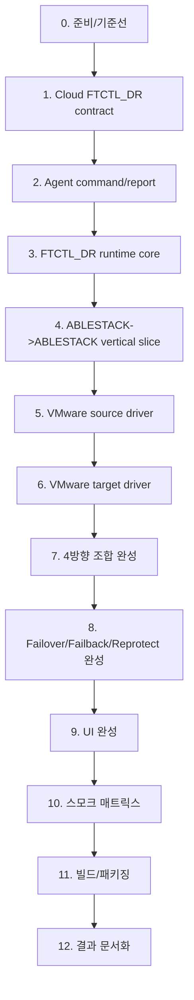

# Cross Hypervisor DR Implementation, Smoke, Build Execution Plan

작성일: 2026-07-01

상위 계획:

- [520-cross-hypervisor-dr-full-implementation-work-plan-20260701.md](520-cross-hypervisor-dr-full-implementation-work-plan-20260701.md)
- [521-cross-hypervisor-dr-full-stack-implementation-design-20260701.md](521-cross-hypervisor-dr-full-stack-implementation-design-20260701.md)
- [522-cross-hypervisor-dr-protection-failover-failback-sequence-design-20260701.md](522-cross-hypervisor-dr-protection-failover-failback-sequence-design-20260701.md)
- [523-cross-hypervisor-dr-ftctl-engine-driver-design-20260701.md](523-cross-hypervisor-dr-ftctl-engine-driver-design-20260701.md)

목표: 4개 DR 방향의 완전 구현, 스모크 검증, 빌드 완료까지의 단계별 실행 계획을 확정한다.

## 1. 완료 원칙

아래 원칙을 만족하지 않으면 단계 완료로 보지 않는다.

1. 4개 방향 모두 `FTCTL_DR` production engine 계약을 따른다.
2. `VMWARE_PHASE1` skeleton과 `V2K` task tracking은 production DR 완료 기준에서 제외한다.
3. UI 버튼은 API, Backend, Agent, FTCTL runtime까지 실제 흐름이 이어져야 한다.
4. DR 보호 설정, test failover, planned/disaster failover, failback, reprotect가 모두 구현 대상이다.
5. RPO는 latest target durable checkpoint 기준으로 산정한다.
6. RTO는 failover run 생성부터 target service usable까지의 실제 timestamp로 산정한다.
7. 각 단계는 구현, 스모크, 빌드 또는 최소 컴파일 게이트를 통과해야 한다.

## 2. Repository 및 빌드 원칙

| 영역 | repository | 빌드/검증 원칙 |
|---|---|---|
| Cloud backend/API/UI | `C:\Users\ablecloud\Documents\GitHub\dhslove\ablestack-cloud` | Cloud source 변경은 WSL ext4 clone에서 변경 Maven 모듈만 빌드 |
| ftctl runtime/package | `C:\Users\ablecloud\Documents\GitHub\dhslove\ablestack-qemu-exec-tools` | ftctl artifacts는 GitHub Actions로 빌드 |
| UI build | Cloud WSL ext4 clone | `NODE_OPTIONS=--openssl-legacy-provider npm run build` |
| GitHub Actions/artifact | WSL | `gh`, `curl --progress-bar` 사용 |
| Windows working tree file-heavy ops | Windows local | `/mnt/c` WSL repo build/test 금지 |

Cloud 전체 빌드는 이 계획의 기본 범위가 아니다. 전체 Cloud build는 별도 명시 요청이 있을 때만 GitHub Actions로 진행한다.

## 3. 단계 의존성



## 4. 단계별 계획

### 0. 준비/기준선 고정

목표: 구현 전 기준선을 안전하게 잡는다.

구현/작업:

- cloud/ftctl branch 상태 확인
- 기존 문서 `520-523`과 구현 범위 재확인
- Cloud 변경 예상 모듈 목록 산정
- ftctl GitHub Actions workflow 확인
- WSL ext4 clone 존재/동기화 상태 확인
- VDDK/CBT는 외부 dependency로만 취급하고 V2K workflow를 건드리지 않는 기준 재확인

스모크:

- 현재 `listDrPlans`, `startDr*` API surface 확인
- 현재 ftctl selftest baseline 확인
- 현재 UI DR route/component import 확인

빌드 게이트:

- 없음. 기준선 단계에서는 빌드하지 않는다.

산출물:

- 단계별 체크리스트
- 영향 모듈 목록

### 1. Cloud `FTCTL_DR` contract 구현

목표: 4개 방향 plan이 모두 `FTCTL_DR` production engine으로 생성/검증된다.

구현 범위:

| 파일/영역 | 작업 |
|---|---|
| `DrConstants.java` | `ENGINE_TYPE_FTCTL_DR`, binding, error/action/state 추가 |
| `DrPlanServiceImpl.java` | 4개 direction 모두 `FTCTL_DR` 허용 |
| `DrPlanServiceImpl.java` | `VMWARE_PHASE1`, `V2K`를 production DR action eligibility에서 제외 |
| `DrPlanVO`, response | RPO/RTO/worker/checkpoint field 보강 |
| DB upgrade | 필요한 column 추가 |
| API command | pause/resume/release/preflight/runtimeStatus 추가 설계 반영 |

스모크:

- 4개 direction plan create validation test
- `V2K`를 DR engine으로 선택할 경우 거절 또는 migration-only 표시 확인
- `VMWARE_PHASE1` action eligibility가 production path에 나오지 않는지 확인
- action API가 run 접수 후 즉시 반환하는지 확인

빌드 게이트:

- WSL ext4 Cloud clone에서 변경 Maven 모듈 빌드
- 기본 후보:

```bash
mvn -pl :cloud-plugin-integrations-disaster-recovery -am -DskipTests install
```

변경이 `agent`, `core`, `engine/schema`, `server`로 확장되면 해당 artifact를 `-pl`에 추가한다.

산출물:

- Cloud backend contract commit 후보
- DB upgrade script
- API smoke 결과

### 2. Cloud Agent command/report 경로 구현

목표: Backend가 FTCTL_DR action을 Agent로 비동기 전달하고 status를 받을 수 있다.

구현 범위:

| 영역 | 작업 |
|---|---|
| Agent API classes | `FtctlDrActionCommand`, `FtctlDrStatusCommand`, `FtctlDrCancelCommand`, `FtctlDrPreflightCommand` |
| Answer classes | accepted/status/error payload |
| Agent handler | `ablestack_vm_ftctl dr-*` 호출 wrapper |
| Backend adapter | `FtctlDrUnifiedActionAdapter` 추가 |
| Projection | `DrRuntimeReportService`, `FtctlDrProjectionAdapter` 확장 |
| 보안 | credential redaction, temporary secret file policy |

스모크:

- preflight command dry-run accepted
- action command가 wait=false로 즉시 accepted answer 반환
- status command JSON parse
- redaction test: password/API secret 로그 미노출
- cancel command가 session cancel marker를 남기는지 확인

빌드 게이트:

- 변경 Maven 모듈 빌드
- agent/core/server가 변경되면 후보:

```bash
mvn -pl :cloud-agent,:cloud-core,:cloud-server,:cloud-plugin-integrations-disaster-recovery -am -DskipTests install
```

산출물:

- Agent command bridge
- status/report smoke 결과

### 3. FTCTL_DR runtime core 구현

목표: 실제 데이터 전송 driver 전에도 profile/session/checkpoint/event/status가 동작한다.

구현 범위:

| 파일 | 작업 |
|---|---|
| `bin/ablestack_vm_ftctl.sh` | `dr-*` subcommand 추가 |
| `lib/ftctl/dr/profile.sh` | profile parse/validate/apply |
| `lib/ftctl/dr/session.sh` | lock, run state, pause/cancel |
| `lib/ftctl/dr/checkpoint.sh` | checkpoint read/write |
| `lib/ftctl/dr/events.sh` 또는 `reporter.sh` | event/status JSON |
| `lib/ftctl/dr/mover.py` | manifest 기반 mover core |
| `bin/ablestack_vm_ftctl_selftest.sh` | DR runtime core selftest 추가 |
| `rpm/ablestack_vm_ftctl.spec` | 신규 `lib/ftctl/dr/*` 설치 포함 |
| completions | `dr-*` command completion 추가 |

스모크:

- `ablestack_vm_ftctl dr-plan-apply --dry-run`
- `ablestack_vm_ftctl dr-status --json`
- checkpoint write/read selftest
- mover manifest selftest
- shell syntax/lint

빌드 게이트:

- WSL ext4 ftctl clone에서 selftest
- GitHub Actions `ci.yml` 또는 ftctl 포함 workflow 실행
- RPM artifact가 신규 `lib/ftctl/dr/*` 파일을 포함하는지 확인

산출물:

- FTCTL_DR runtime core
- ftctl selftest 결과
- GitHub Actions run id

### 4. ABLESTACK -> ABLESTACK vertical slice 완성

목표: 기존 KVM-to-KVM 성공 경로를 깨지 않고 `FTCTL_DR` 계약으로 실제 보호/복제/failover가 된다.

구현 범위:

- `source_kvm_qmp.sh` 기본 구현
- `target_ablestack.sh` RBD/QCOW2 writer 기본 구현
- 기존 `blockcopy.sh`, `xcolo.sh`, `failover.sh` success path 연결
- checkpoint/RPO projection
- test failover clone/overlay
- failover/failback/reprotect 최소 완성

스모크:

| 조합 | smoke |
|---|---|
| RBD -> RBD | full seed, incremental, test failover, failover dry/promote path |
| RBD -> QCOW2 | full seed, incremental checkpoint |
| QCOW2 -> RBD | full seed, incremental checkpoint |
| QCOW2 -> QCOW2 | full seed, incremental checkpoint |

빌드 게이트:

- ftctl selftest 전체
- qemu/ftctl GitHub Actions package build
- Cloud 변경 모듈 빌드

산출물:

- ABLESTACK -> ABLESTACK first real vertical slice
- 기존 4개 storage 조합 regression evidence

### 5. VMware source driver 구현

목표: VMware VM에서 VDDK/CBT 기반 full seed와 incremental extent를 추출한다.

구현 범위:

- `source_vmware_cbt.py`
- VDDK/nbdkit-vddk preflight
- vCenter inventory lookup
- CBT enabled check
- snapshot lifecycle
- `changeId` checkpoint 저장
- invalid changeId 시 full resync 전환
- mock CBT selftest

스모크:

- VDDK 미설치 시 `DR_MISSING_VDDK`
- CBT 비활성 시 `DR_CBT_DISABLED`
- mock changed extents manifest 생성
- snapshot cleanup path 검증
- credential redaction 확인

빌드 게이트:

- ftctl selftest + VMware CBT mock test
- qemu/ftctl GitHub Actions build

산출물:

- VMware source driver
- VDDK/CBT preflight smoke 결과

### 6. VMware target driver 구현

목표: VMware DR target에 powered-off target VM과 VMDK를 실제 materialize한다.

구현 범위:

- `target_vmware_vddk.py`
- vCenter target mapping validation
- datastore capacity check
- VMDK create/open/write/flush
- powered-off target VM inventory create/update
- isolated test failover linked clone 또는 snapshot path
- target-ready checkpoint projection

스모크:

- target mapping dry-run
- VMDK writer mock
- target-ready checkpoint 생성
- test failover create/cleanup mock
- VDDK writer missing/failure error code

빌드 게이트:

- ftctl selftest + VMware target mock test
- qemu/ftctl GitHub Actions build

산출물:

- VMware target driver
- ABLESTACK -> VMware, VMware -> VMware를 열 수 있는 target path

### 7. 4개 방향 조합 완성

목표: 네 방향 모두 full seed, incremental, target-ready checkpoint를 동일 contract로 수행한다.

구현 범위:

| 방향 | 구현 결합 |
|---|---|
| ABLESTACK -> VMware | KVM source + VMware target |
| VMware -> VMware | VMware source + VMware target |
| ABLESTACK -> ABLESTACK | KVM source + ABLESTACK target |
| VMware -> ABLESTACK | VMware source + ABLESTACK target |

스모크:

- 각 방향 `checkDrPlanPreflight`
- 각 방향 `startDrSync`
- 각 방향 checkpoint 2개 이상 생성
- 각 방향 RPO lag 계산
- 각 방향 `listDrRestorePoints`와 UI 표시

빌드 게이트:

- Cloud 변경 모듈 빌드
- ftctl GitHub Actions build
- UI build는 이 단계에서 아직 선택적. API/UI binding 변경 시 수행

산출물:

- 4방향 sync smoke matrix

### 8. Failover, Failback, Reprotect 완성

목표: 보호 설정만이 아니라 실제 DR 운영 action을 완성한다.

구현 범위:

- `dr-test-failover`
- `dr-test-cleanup`
- `dr-failover --mode planned`
- `dr-failover --mode disaster`
- `dr-failback`
- `dr-reprotect`
- `dr-release`
- Cloud action eligibility와 run state 전환
- RTO timestamp 기록

스모크:

| action | 4개 방향 smoke |
|---|---|
| test failover | isolated boot/create/cleanup |
| planned failover | final delta + target promote |
| disaster failover | latest durable checkpoint promote |
| failback | reverse sync + original promote |
| reprotect | active side 기준 reverse protection |
| release | profile/session/temp cleanup |

빌드 게이트:

- Cloud 변경 모듈 빌드
- ftctl GitHub Actions build
- selftest에 action state machine case 추가

산출물:

- 4방향 action smoke matrix
- RTO timestamp evidence

### 9. UI 완성

목표: UI 모든 버튼이 API/Backend/Agent/FTCTL까지 이어지고, RPO/RTO가 보인다.

구현 범위:

- DR plan wizard 보강
- direction별 source/target mapping UI
- RPO/RTO policy 입력
- RPO KPI와 restore point timeline
- action toolbar 전체 버튼 연결
- run progress/event polling
- dark mode status style
- V2K DR engine 선택 제거

스모크:

- 4개 direction plan wizard submit
- action toolbar 버튼 노출/비활성 사유 확인
- active run 중 화면 block 없이 polling
- dark mode에서 상태/경고/오류 색상 확인
- 긴 문구 overflow 없음

빌드 게이트:

WSL ext4 Cloud UI clone:

```bash
NODE_OPTIONS=--openssl-legacy-provider npm run build
```

산출물:

- UI build artifact
- UI smoke checklist

### 10. 통합 스모크 매트릭스

목표: build 전 마지막 기능 smoke를 완료한다.

스모크 매트릭스:

| 방향 | 보호 설정 | incremental | RPO | test FO | planned FO | disaster FO | failback | reprotect |
|---|---|---|---|---|---|---|---|---|
| ABLESTACK -> VMware | PASS 필요 | PASS 필요 | PASS 필요 | PASS 필요 | PASS 필요 | PASS 필요 | PASS 필요 | PASS 필요 |
| VMware -> VMware | PASS 필요 | PASS 필요 | PASS 필요 | PASS 필요 | PASS 필요 | PASS 필요 | PASS 필요 | PASS 필요 |
| ABLESTACK -> ABLESTACK | PASS 필요 | PASS 필요 | PASS 필요 | PASS 필요 | PASS 필요 | PASS 필요 | PASS 필요 | PASS 필요 |
| VMware -> ABLESTACK | PASS 필요 | PASS 필요 | PASS 필요 | PASS 필요 | PASS 필요 | PASS 필요 | PASS 필요 | PASS 필요 |

실환경 VMware/VDDK가 준비되지 않은 단계에서는 mock smoke와 preflight smoke를 구분 기록한다. 단 최종 완료 판정은 실제 VMware source/target smoke가 필요하다.

빌드 게이트:

- Cloud backend module build 완료
- ftctl GitHub Actions build 완료
- UI build 완료

산출물:

- smoke evidence 문서
- 미충족 항목 목록

### 11. 빌드/패키징 완료

목표: 구현 결과를 배포 가능한 artifact 수준으로 만든다.

Cloud backend:

- 원칙: 변경 Maven 모듈만 WSL ext4 clone에서 빌드
- 후보:

```bash
mvn -pl :cloud-plugin-integrations-disaster-recovery -am -DskipTests install
```

- agent/core/server/schema 변경 시 해당 모듈을 추가한다.
- Cloud full build는 별도 명시 요청이 있을 때만 GitHub Actions로 진행한다.

Cloud UI:

```bash
cd /home/ablecloud/work/dhslove/ablestack-cloud/ui
NODE_OPTIONS=--openssl-legacy-provider npm run build
```

ftctl/qemu:

- WSL에서 GitHub Actions workflow trigger
- 기본 후보: `ci.yml`로 빠른 검증, `build.yml`로 RPM artifact 생성
- artifact download는 `curl --progress-bar`
- RPM 내부 파일 확인:

```bash
aspkg -qpl ablestack_vm_ftctl-*.rpm | grep '/usr/local/lib/ablestack-qemu-exec-tools/ftctl/dr/'
```

산출물:

- Cloud changed module JAR
- UI dist
- ftctl RPM artifact
- build log/run id

### 12. 결과 문서화 및 다음 단계 판단

목표: 구현/검증/빌드 결과를 다음 배포 또는 재테스트로 넘길 수 있게 정리한다.

문서화 항목:

- 구현 완료 단계
- 변경 파일 목록
- 스모크 결과
- 빌드 명령과 결과
- GitHub Actions run id
- artifact 경로와 checksum
- 4개 방향 PASS/FAIL 표
- 남은 blocker와 재시도 계획

완료 보고 형식:

```text
완료 단계: N / 12
이번 단계 구현: ...
스모크 결과: ...
빌드 결과: ...
다음 단계: ...
남은 단계: ...
차단 사항: ...
```

## 5. 단계별 빌드 게이트 요약

| 단계 | Cloud Maven | UI build | ftctl selftest | GitHub Actions |
|---|---|---|---|---|
| 0 | 없음 | 없음 | baseline만 | 없음 |
| 1 | 필요 | 필요 시 | 없음 | 없음 |
| 2 | 필요 | 없음 | 없음 | 없음 |
| 3 | 없음 | 없음 | 필요 | 필요 |
| 4 | 필요 | 없음 | 필요 | 필요 |
| 5 | 없음 | 없음 | 필요 | 필요 |
| 6 | 없음 | 없음 | 필요 | 필요 |
| 7 | 필요 | 필요 시 | 필요 | 필요 |
| 8 | 필요 | 필요 시 | 필요 | 필요 |
| 9 | 필요 시 | 필요 | 필요 시 | 필요 시 |
| 10 | 필요 | 필요 | 필요 | 필요 |
| 11 | 최종 변경 모듈 | 최종 UI | 최종 selftest | 최종 artifact |
| 12 | 없음 | 없음 | 없음 | 없음 |

## 6. 위험 관리

| 위험 | 대응 |
|---|---|
| 4개 방향 중 일부만 먼저 완성되고 나머지가 다시 skeleton으로 남는 위험 | 단계 7과 10에서 4방향 매트릭스 PASS 전 완료 금지 |
| V2K가 다시 DR path에 섞이는 위험 | Cloud UI/eligibility/API에서 V2K를 DR production engine에서 제외 |
| Cloud API가 동기 대기하는 회귀 | action API는 run accepted만 반환하고 status는 polling/report로 반영 |
| 기존 KVM-to-KVM 성공 경로 훼손 | 단계 4에서 기존 RBD/QCOW2 4조합 regression을 gate로 둠 |
| VDDK 설치/라이선스 문제 | 패키지 포함 금지, worker preflight와 operator 설치 전제 |
| `/mnt/c` WSL build/test 성능/일관성 문제 | WSL ext4 clone에서 Maven/UI/ftctl selftest와 artifact handling 수행 |

## 7. 구현 착수 순서

가장 먼저 착수할 순서는 다음과 같다.

1. 0단계 준비/기준선
2. 1단계 Cloud `FTCTL_DR` contract
3. 3단계 FTCTL_DR runtime core
4. 2단계 Agent command/report
5. 4단계 ABLESTACK -> ABLESTACK vertical slice

2단계와 3단계는 일부 병렬 가능하지만, 실제 smoke는 FTCTL runtime core가 먼저 있어야 닫힌다. 따라서 문서/코드 진행은 1 -> 3 -> 2 -> 4 순서가 가장 안전하다.

### 2026-07-14 VMware CBT Smoke Addendum

Mock full/incremental labels are insufficient. The VMware smoke gate must
compare effective mode, CBT query evidence, baseline generation, transfer-byte
metrics, and target content across full seed, incremental, no-change, invalid
baseline, and explicit reseed cases. The current gate is defined in
`555-cross-hypervisor-dr-vmware-cbt-incremental-and-transfer-metrics-design-20260714.md`.
