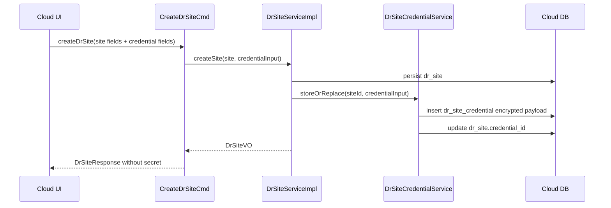
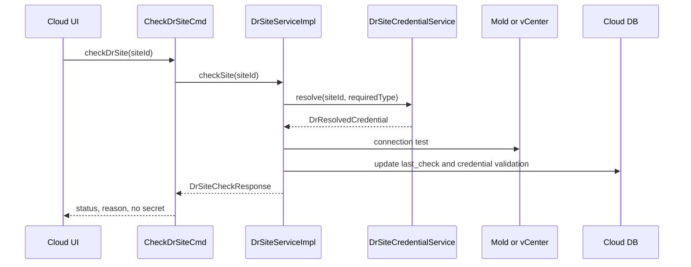

# Cross Hypervisor DR Site Credential Management Design

작성일: 2026-07-02

상위 문서:

- [500-cross-hypervisor-dr-architecture-plan-20260630.md](500-cross-hypervisor-dr-architecture-plan-20260630.md)
- [501-cross-hypervisor-dr-domain-schema-design-20260630.md](501-cross-hypervisor-dr-domain-schema-design-20260630.md)
- [506-cross-hypervisor-dr-cloud-ui-design-20260630.md](506-cross-hypervisor-dr-cloud-ui-design-20260630.md)
- [507-cross-hypervisor-dr-cloud-api-command-design-20260630.md](507-cross-hypervisor-dr-cloud-api-command-design-20260630.md)
- [508-cross-hypervisor-dr-cloud-backend-wiring-design-20260630.md](508-cross-hypervisor-dr-cloud-backend-wiring-design-20260630.md)
- [509-cross-hypervisor-dr-db-upgrade-and-entity-design-20260630.md](509-cross-hypervisor-dr-db-upgrade-and-entity-design-20260630.md)
- [521-cross-hypervisor-dr-full-stack-implementation-design-20260701.md](521-cross-hypervisor-dr-full-stack-implementation-design-20260701.md)

## 1. 결론

DR Site UI에서 `credentialRef` 또는 "인증정보 참조"를 사용자 입력값으로 받는 구조는 폐기한다. 사용자는 사이트 접속에 필요한 인증정보를 입력하고, 백엔드는 이를 암호화 저장한 뒤 내부 식별자만 관리한다.

신규 원칙:

1. UI는 사이트 유형에 맞는 실제 접속 정보와 인증정보를 입력받는다.
2. API는 인증정보를 write-only 파라미터로 수신한다.
3. 백엔드는 인증정보를 `dr_site_credential`에 암호화 저장하고 `dr_site.credential_id`로 현재 인증정보를 가리킨다.
4. 응답과 UI 상세 화면에는 원문 secret, API key, password를 절대 반환하지 않는다.
5. Adapter와 ftctl은 사용자 입력 참조값을 보지 않고 `DrSiteCredentialService`를 통해 검증된 인증정보만 사용한다.
6. ftctl host에는 실행에 필요한 동안만 `/run`의 root-only 임시 credential file로 전달한다.

## 2. AS-IS 문제

현재 구현과 설계에는 다음 불일치가 있다.

| 계층 | AS-IS | 문제 |
| --- | --- | --- |
| UI | `credentialref` 단일 문자열 입력 | 사용자가 어떤 값을 넣어야 하는지 알 수 없다. |
| API | `createDrSite credentialref` 수신 | public API가 내부 참조값을 요구한다. |
| DB | `dr_site.credential_ref` 문자열 저장 | 실제 인증정보 저장, 회전, 검증 책임이 불명확하다. |
| Backend | `credentialRef` 존재 여부 위주 검증 | vCenter/Mold 연결 가능성을 확인하지 못한다. |
| Adapter | `targetSite.getCredentialRef()` 빈 값 검사 | 실제 인증정보 resolve 흐름이 없다. |
| UX | "인증정보 참조" 표시 | 고객/운영자 관점에서 직관적이지 않다. |

## 3. TO-BE 사용자 경험

### 3.1 DR Site 추가

DR Site 추가 대화상자는 다음 구조를 사용한다.

```text
기본 정보
- 이름
- 설명
- 사이트 유형
- 하이퍼바이저는 사이트 유형에서 자동 결정하며 기본 입력 필드로 노출하지 않음

접속 정보
- ABLESTACK/Mold: Mold API URL, API Key, Secret Key
- VMware: vCenter URL, 사용자명, 비밀번호
- TLS 검증 정책. 라벨은 선택된 접속 정보에 맞춰 Mold API 인증서 검증 또는 vCenter 인증서 검증으로 표시

고급 설정
- ABLESTACK/Mold: Zone
- Cloud에 이미 등록된 VMware datacenter mapping이 필요한 경우: VMware 데이터센터
- VMware Direct 기본 등록에서는 endpoint, Zone, VMware 데이터센터를 기본 입력으로 노출하지 않음

작업
- 연결 테스트
- 확인
- 취소
```

`인증정보 참조` 필드는 제거한다. `endpoint`도 사용자 입력 필드로 노출하지 않는다. UI는 Mold API URL 또는 vCenter URL을 받고, backend 호환을 위해 필요한 경우 payload 생성 시 동일 값을 `endpoint`에 자동 설정한다.

대화상자 레이아웃은 DR 공통 form modal을 사용한다.

- Header: `DR 사이트 추가` 제목과 닫기 버튼 고정
- Body: 입력 항목 전용 스크롤 영역
- Footer: 취소/확인 버튼 고정
- 다크모드: divider, label, input, select, password icon, placeholder 대비를 `.cross-dr-modal` scope에서 보정

### 3.2 DR Site 상세

상세 화면은 인증정보 원문 대신 상태만 표시한다. 화면 구조는 볼륨 상세를 표준으로 삼는 DR 상세 표준화 설계를 따른다. 즉, 좌측 정보 카드는 `DrResourceInfoCard`, 우측 `상세` 탭은 `DrResourceDetailsTab`의 row 목록으로 표시하고, `a-descriptions bordered` 표는 사용하지 않는다. 좌측 정보 카드의 credential field는 `iconComponent: SafetyCertificateOutlined`와 상태 텍스트만 사용하며, password, secret, token, API secret 원문은 `summaryFields`와 `detailFields` 어느 쪽에도 넣지 않는다.

```text
인증정보: 등록됨
유형: vCenter
대상: https://vcenter.example.local/sdk
계정: administrator@vsphere.local
마지막 갱신: 2026-07-02 10:15:00
마지막 검증: 정상
```

API key, secret key, password, token은 표시하지 않는다.

표준 상세 row에 포함하는 인증정보 필드는 다음으로 제한한다.

| 필드 | 표시 값 |
| --- | --- |
| 인증정보 상태 | `credentialstate` 또는 `credentialconfigured` 기반 등록/미등록 |
| 인증정보 유형 | `credentialtype` (`VCENTER`, `MOLD_API`) |
| 인증 엔드포인트 | `credentialendpoint` |
| 인증 계정 | `credentialprincipal` |
| 마지막 검증 | `credentiallastvalidated`, `credentialvalidationresult` |

secret 원문, API key, password, token은 field metadata에 포함하지 않는다.

### 3.3 인증정보 갱신

사이트 수정 화면에는 별도 `인증정보 갱신` 섹션을 둔다.

- 기존 인증정보는 다시 보여주지 않는다.
- 새 값을 입력하면 백엔드가 새 credential row를 생성하고 `dr_site.credential_id`를 교체한다.
- 이전 credential row는 `removed`를 채워 soft delete한다.
- 연결 테스트는 새 입력값 또는 저장된 현재 credential로 수행할 수 있다.

### 3.4 DR Site 작업 메뉴와 수정 모드

DR Site 수정/삭제/점검은 목록 row의 오른쪽 `작업` 컬럼이 아니라 표준 작업 메뉴로 제공한다.

- 목록 row 우클릭: `사이트 점검`, `수정`, `삭제`
- 상세 상단 `작업` 드롭다운: `사이트 점검`, `수정`, `삭제`
- 상세 panel 우클릭: 현재 site 기준 동일 메뉴

`수정`은 `DrFormModal`을 `mode='edit'`로 열고, 기존 site metadata를 채운다. 인증정보 원문은 절대 다시 표시하지 않는다.

Edit form 규칙:

```js
openEditSiteModal (site) {
  this.siteFormMode = 'edit'
  this.siteForm = {
    id: site.id,
    name: site.name,
    description: site.description,
    sitetype: site.sitetype,
    hypervisortype: site.hypervisortype,
    endpoint: site.endpoint,
    zoneid: site.zoneid,
    vmwaredcid: site.vmwaredcid,
    moldapiurl: site.credentialtype === 'MOLD_API' ? site.credentialendpoint : '',
    moldapikey: '',
    moldsecretkey: '',
    vcenterurl: site.credentialtype === 'VCENTER' ? site.credentialendpoint : '',
    vcenterusername: site.credentialtype === 'VCENTER' ? site.credentialprincipal : '',
    vcenterpassword: '',
    tlsverify: site.tlsverify !== false
  }
}
```

Payload 생성 규칙:

- secret 입력이 비어 있으면 credential 관련 필드는 보내지 않는다.
- Mold credential 갱신은 `moldapiurl`, `moldapikey`, `moldsecretkey`가 모두 입력된 경우에만 보낸다.
- vCenter credential 갱신은 `vcenterurl`, `vcenterusername`, `vcenterpassword`가 모두 입력된 경우에만 보낸다.
- 일부 credential 필드만 입력된 경우 UI validation으로 막는다.
- `clearcredential=true`는 별도 위험 확인 UI를 통과한 경우에만 보낸다.

`삭제`는 site를 참조하는 active plan이 있으면 수행할 수 없다. UI는 `activeplancount`가 있으면 사전 비활성화하고, backend는 항상 `deleteDrSite`에서 다시 검증한다.

## 4. 데이터 모델

### 4.1 `dr_site`

`dr_site.credential_ref`는 legacy 호환 필드로만 남긴다. 신규 흐름은 `credential_id`를 사용한다.

추가 컬럼:

```sql
ALTER TABLE `cloud`.`dr_site`
  ADD COLUMN `credential_id` bigint unsigned DEFAULT NULL AFTER `endpoint`,
  ADD KEY `i_dr_site__credential_id` (`credential_id`);
```

### 4.2 `dr_site_credential`

```sql
CREATE TABLE `cloud`.`dr_site_credential` (
  `id` bigint unsigned NOT NULL auto_increment,
  `uuid` varchar(40) NOT NULL,
  `site_id` bigint unsigned NOT NULL,
  `credential_type` varchar(32) NOT NULL,
  `endpoint` varchar(1024) DEFAULT NULL,
  `principal` varchar(255) DEFAULT NULL,
  `secret_payload` text NOT NULL,
  `secret_fingerprint` varchar(128) DEFAULT NULL,
  `state` varchar(32) NOT NULL DEFAULT 'STORED',
  `last_validated` datetime DEFAULT NULL,
  `last_validation_result` varchar(32) DEFAULT NULL,
  `last_validation_message` text DEFAULT NULL,
  `created` datetime NOT NULL,
  `updated` datetime DEFAULT NULL,
  `removed` datetime DEFAULT NULL,
  PRIMARY KEY (`id`),
  UNIQUE KEY `uk_dr_site_credential__uuid` (`uuid`),
  KEY `i_dr_site_credential__site_removed` (`site_id`, `removed`),
  KEY `i_dr_site_credential__type_state` (`credential_type`, `state`),
  CONSTRAINT `fk_dr_site_credential__site_id`
    FOREIGN KEY (`site_id`) REFERENCES `dr_site` (`id`) ON DELETE CASCADE
);
```

`secret_payload`는 `@Encrypt` 또는 `DBEncryptionUtil` 기반 암호화 저장 대상이다. `principal`은 vCenter username처럼 UI 표시가 허용되는 계정명만 저장한다. Mold API key는 secret으로 보고 `secret_payload` 안에 저장한다.

### 4.3 Secret payload 구조

DB에는 암호화된 JSON 문자열로 저장한다.

Mold:

```json
{
  "kind": "MOLD_API",
  "apiUrl": "https://mold.example.local/client/api",
  "apiKey": "...",
  "secretKey": "...",
  "tlsVerify": true
}
```

VMware:

```json
{
  "kind": "VCENTER",
  "vcenterUrl": "https://vcenter.example.local/sdk",
  "username": "administrator@vsphere.local",
  "password": "...",
  "tlsVerify": true
}
```

## 5. Java 객체 설계

### 5.1 VO

경로:

`plugins/integrations/disaster-recovery/src/main/java/com/cloud/dr/`

```java
@Entity
@Table(name = "dr_site_credential")
public class DrSiteCredentialVO implements InternalIdentity {
    @Id
    @GeneratedValue(strategy = GenerationType.IDENTITY)
    private long id;

    @Column(name = "uuid")
    private String uuid;

    @Column(name = "site_id")
    private long siteId;

    @Column(name = "credential_type")
    private String credentialType;

    @Column(name = "endpoint")
    private String endpoint;

    @Column(name = "principal")
    private String principal;

    @Encrypt
    @Column(name = "secret_payload")
    private String secretPayload;

    @Column(name = "secret_fingerprint")
    private String secretFingerprint;

    @Column(name = "state")
    private String state;

    @Column(name = "last_validated")
    private Date lastValidated;

    @Column(name = "last_validation_result")
    private String lastValidationResult;

    @Column(name = "last_validation_message")
    private String lastValidationMessage;

    @Column(name = "created")
    private Date created;

    @Column(name = "updated")
    private Date updated;

    @Column(name = "removed")
    private Date removed;
}
```

`DrSiteVO`에는 다음 필드를 추가한다.

```java
@Column(name = "credential_id")
private Long credentialId;
```

기존 `credentialRef` getter/setter는 legacy API 호환과 migration 보조용으로만 유지한다.

### 5.2 DAO

경로:

`plugins/integrations/disaster-recovery/src/main/java/com/cloud/dr/dao/`

```java
public interface DrSiteCredentialDao extends GenericDao<DrSiteCredentialVO, Long> {
    DrSiteCredentialVO findActiveBySiteId(long siteId);
    List<DrSiteCredentialVO> listBySiteId(long siteId);
}
```

```java
public class DrSiteCredentialDaoImpl
        extends GenericDaoBase<DrSiteCredentialVO, Long>
        implements DrSiteCredentialDao {
    private final SearchBuilder<DrSiteCredentialVO> activeBySiteSearch;

    public DrSiteCredentialDaoImpl() {
        activeBySiteSearch = createSearchBuilder();
        activeBySiteSearch.and("siteId", activeBySiteSearch.entity().getSiteId(), SearchCriteria.Op.EQ);
        activeBySiteSearch.and("removed", activeBySiteSearch.entity().getRemoved(), SearchCriteria.Op.NULL);
        activeBySiteSearch.done();
    }
}
```

## 6. Service 설계

### 6.1 입력 DTO

```java
public class DrSiteCredentialInput {
    private String credentialType;
    private String endpoint;
    private String principal;
    private Map<String, String> secrets;
    private Boolean tlsVerify;
}
```

`secrets`에는 credential type별 값을 넣는다.

- `MOLD_API`: `apiKey`, `secretKey`
- `VCENTER`: `username`, `password`

### 6.2 응답 DTO

```java
public class DrSiteCredentialSummary {
    private String state;
    private String credentialType;
    private String endpoint;
    private String principal;
    private Date lastUpdated;
    private Date lastValidated;
    private String lastValidationResult;
    private String lastValidationMessage;
}
```

### 6.3 내부 resolved credential

```java
public final class DrResolvedCredential implements AutoCloseable {
    private final String credentialType;
    private final String endpoint;
    private final String principal;
    private final Map<String, String> secrets;

    @Override
    public void close() {
        secrets.clear();
    }
}
```

### 6.4 Service interface

```java
public interface DrSiteCredentialService {
    DrSiteCredentialVO storeOrReplace(long siteId, DrSiteCredentialInput input);
    DrSiteCredentialSummary summarize(long siteId);
    DrResolvedCredential resolve(long siteId, String requiredType);
    DrSiteCredentialSummary validate(long siteId);
    boolean clear(long siteId);
    boolean hasUsableCredential(long siteId, String requiredType);
}
```

### 6.5 Service 구현 규칙

`DrSiteCredentialServiceImpl`은 다음을 책임진다.

- 입력값 검증
- secret payload JSON 생성
- `secret_payload` 암호화 저장
- 기존 active credential soft delete. `removed`는 일반 update로 저장되지 않으므로 `state=CLEARED` update 후 `drSiteCredentialDao.remove(id)`를 호출한다.
- `dr_site.credential_id` 갱신
- credential fingerprint 생성
- 응답 summary 생성
- validation 결과 기록

`secret_fingerprint`는 원문 표시용이 아니라 변경 감지와 감사용이다. `SHA-256(credentialType + endpoint + principal + normalized secret keys)`처럼 secret 원문을 직접 복원할 수 없는 값으로 저장한다.

## 7. API 설계

### 7.1 `createDrSite`

사용자 입력 파라미터에서 `credentialref`를 제거한다.

공통:

| Parameter | Required | 설명 |
| --- | --- | --- |
| `name` | yes | Site 이름 |
| `description` | no | 설명 |
| `sitetype` | yes | `MOLD_KVM`, `MOLD_VMWARE`, `VMWARE_DIRECT` |
| `hypervisortype` | yes | UI가 site type에서 자동 결정. `MOLD_KVM=KVM`, `MOLD_VMWARE/VMWARE_DIRECT=VMWARE` |
| `endpoint` | compatibility | 사용자 입력 필드가 아니다. UI 또는 backend가 Mold API URL/vCenter URL에서 자동 설정 |
| `zoneid` | advanced | ABLESTACK/Mold Zone. VMware Direct 기본 등록에는 불필요 |
| `vmwaredcid` | advanced | Cloud 등록 VMware datacenter mapping. VMware Direct 기본 등록에는 불필요 |
| `tlsverify` | no | TLS 검증 여부 |

Mold credential:

| Parameter | Required | 설명 |
| --- | --- | --- |
| `moldapiurl` | yes for Mold direct | Mold API URL |
| `moldapikey` | yes for Mold direct | Mold API Key |
| `moldsecretkey` | yes for Mold direct | Mold Secret Key |

VMware credential:

| Parameter | Required | 설명 |
| --- | --- | --- |
| `vcenterurl` | yes for VMware direct | vCenter URL |
| `vcenterusername` | yes for VMware direct | vCenter username |
| `vcenterpassword` | yes for VMware direct | vCenter password |

`endpoint`는 하위 호환을 위해 남긴다. UI는 화면에 endpoint를 표시하지 않고 site type에 맞춰 `moldapiurl` 또는 `vcenterurl`을 보낸다. 백엔드는 `endpoint`와 전용 URL 파라미터가 모두 있으면 전용 파라미터를 우선하며, `endpoint`가 비어 있으면 전용 URL 값으로 site endpoint를 채운다.

### 7.2 `updateDrSite`

사이트 메타데이터 수정과 인증정보 갱신을 분리한다.

- `updateDrSite`: 이름, 설명, endpoint, mapping, 상태 갱신
- `updateDrSiteCredential`: 인증정보 갱신 전용
- `clearDrSiteCredential`: 저장된 인증정보 삭제

### 7.3 `checkDrSite`

`checkDrSite`는 저장된 credential을 사용한다. 요청에 secret을 넣지 않는다.

```text
UI -> checkDrSite(siteId)
API -> DrSiteCredentialService.resolve(siteId, requiredType)
Backend -> Mold/vCenter client connection test
Backend -> last_validation_result, last_check_* 갱신
API -> DrSiteCheckResponse 반환
```

### 7.4 Response

`DrSiteResponse`에서 `credentialref`는 legacy-only로 deprecated 처리한다. 신규 필드는 다음을 사용한다.

```java
@SerializedName("credentialstate")
private String credentialState;

@SerializedName("credentialtype")
private String credentialType;

@SerializedName("credentialendpoint")
private String credentialEndpoint;

@SerializedName("credentialprincipal")
private String credentialPrincipal;

@SerializedName("credentiallastupdated")
private Date credentialLastUpdated;

@SerializedName("credentiallastvalidated")
private Date credentialLastValidated;
```

## 8. UI 설계

### 8.1 파일 단위 변경

| 파일 | 변경 |
| --- | --- |
| `ui/src/views/infra/dr/DrSiteList.vue` | `credentialref` 입력 제거, site type별 credential form state와 payload 생성 규칙 추가, create/edit mode 통합 |
| `ui/src/utils/dr/resourceActions.js` | DR Site 점검/수정/삭제 action 정의 |
| `ui/src/components/dr/DrResourceActionMenu.vue` | 상세 상단 표준 `작업` 드롭다운 |
| `ui/src/components/dr/DrResourceContextMenu.vue` | 목록 row/detail panel 우클릭 메뉴 |
| `ui/src/components/dr/DrFormModal.vue` | 신규, DR Site/Plan/Action 공통 header/footer 고정 및 content-only scroll 제공 |
| `ui/src/components/dr/DrResourceInfoCard.vue` | DR Site 상세 좌측 카드. 볼륨 상세 좌측 패널과 같은 header/avatar/tags/detail-item 구조를 사용하고 credential summary만 표시하며 secret 원문은 표시하지 않음 |
| `ui/src/components/dr/DrResourceDetailsTab.vue` | DR Site 우측 `상세` 탭 row 목록. credential summary field를 표준 row로 표시 |
| `ui/src/components/dr/DrSiteCredentialFields.vue` | 신규 또는 분리 후보, site type별 credential 입력 컴포넌트 |
| `ui/src/components/dr/DrSiteCredentialSummary.vue` | 신규, 등록/검증 상태 표시 |
| `ui/src/api/dr.js` | `updateDrSite`, `deleteDrSite`, `updateDrSiteCredential`, `clearDrSiteCredential` wrapper 추가 |
| `ui/src/style/cross-dr.less` | `.cross-dr-modal` light/dark style, divider/input/select/password 대비, 내부 스크롤 규칙 추가 |
| `ui/public/locales/ko_KR.json` | `label.dr.credential.*`, validation message 추가 |
| `ui/public/locales/en.json` | 동일 |

### 8.2 `DrSiteList.vue` form state

```js
defaultCreateForm () {
  return {
    name: '',
    description: '',
    sitetype: 'MOLD_KVM',
    hypervisortype: 'KVM',
    endpoint: '',
    moldapiurl: '',
    moldapikey: '',
    moldsecretkey: '',
    vcenterurl: '',
    vcenterusername: '',
    vcenterpassword: '',
    zoneid: undefined,
    vmwaredcid: undefined,
    tlsverify: true
  }
}
```

표시 규칙:

- `MOLD_KVM`, `MOLD_VMWARE`: Mold API URL/API Key/Secret Key와 Mold API 인증서 검증을 표시한다.
- `VMWARE_DIRECT`: vCenter URL/username/password와 vCenter 인증서 검증을 표시한다.
- `hypervisortype`, `endpoint`, `zoneid`, `vmwaredcid`는 기본 입력으로 노출하지 않는다. 필요 시 `zoneid`, `vmwaredcid`만 고급 설정으로 이동한다.

### 8.3 payload 생성

```js
buildCreateSitePayload () {
  const isMoldSite = String(this.createForm.sitetype || '').startsWith('MOLD_')
  const isVmwareDirect = this.createForm.sitetype === 'VMWARE_DIRECT'
  const endpoint = isVmwareDirect ? this.createForm.vcenterurl : this.createForm.moldapiurl

  const payload = {
    name: this.createForm.name,
    description: this.createForm.description || undefined,
    sitetype: this.createForm.sitetype,
    hypervisortype: this.createForm.sitetype === 'MOLD_KVM' ? 'KVM' : 'VMWARE',
    endpoint: endpoint || undefined,
    tlsverify: this.createForm.tlsverify
  }

  if (isMoldSite) {
    payload.credentialtype = 'MOLD_API'
    payload.moldapiurl = this.createForm.moldapiurl
    payload.moldapikey = this.createForm.moldapikey
    payload.moldsecretkey = this.createForm.moldsecretkey
    payload.zoneid = this.createForm.zoneid || undefined
  }

  if (isVmwareDirect) {
    payload.credentialtype = 'VCENTER'
    payload.vcenterurl = this.createForm.vcenterurl
    payload.vcenterusername = this.createForm.vcenterusername
    payload.vcenterpassword = this.createForm.vcenterpassword
    payload.vmwaredcid = this.createForm.vmwaredcid || undefined
  }

  return payload
}
```

### 8.4 UI validation

```js
validateCreateSite () {
  if (!this.createForm.name || !this.createForm.sitetype) {
    return this.$t('message.dr.site.required')
  }
  if (this.usesMoldCredential && (!this.createForm.moldapiurl || !this.createForm.moldapikey || !this.createForm.moldsecretkey)) {
    return this.$t('message.dr.credential.mold.required')
  }
  if (this.usesVCenterCredential && (!this.createForm.vcenterurl || !this.createForm.vcenterusername || !this.createForm.vcenterpassword)) {
    return this.$t('message.dr.credential.vcenter.required')
  }
  return null
}
```

## 9. Backend flow

### 9.1 Site 생성



### 9.2 Site check



## 10. Adapter와 ftctl 연동

### 10.1 Cloud adapter

`VmwarePhase1TargetAdapter`의 기존 검증:

```java
if (targetSite.getVmwareDatacenterId() == null
        && StringUtils.isNotBlank(targetSite.getEndpoint())
        && !drSiteCredentialService.hasUsableCredential(targetSite)) {
    return failure(ERROR_CREDENTIAL_INVALID, "VMware target site endpoint requires configured credential");
}
```

TO-BE:

```java
if (targetSite.getVmwareDatacenterId() == null && StringUtils.isBlank(targetSite.getEndpoint())) {
    return failure(ERROR_TARGET_UNAVAILABLE, "VMware target site requires vCenter endpoint or vmwareDatacenterId");
}

if (targetSite.getVmwareDatacenterId() == null
        && !drSiteCredentialService.hasUsableCredential(targetSite.getId(), DrCredentialTypes.VCENTER)) {
    return failure(ERROR_CREDENTIAL_INVALID, "VMware target site requires registered vCenter credentials");
}
```

Agent command 생성 시에는 다음처럼 resolved credential을 runtime context에 넣는다.

```java
try (DrResolvedCredential credential = drSiteCredentialService.resolve(siteId, requiredType)) {
    context.put("credentialType", credential.getCredentialType());
    context.put("credentialEndpoint", credential.getEndpoint());
    context.put("credentialPrincipal", credential.getPrincipal());
    context.putSensitive("credentialPayload", credential.toSecretJson());
}
```

`putSensitive`는 로그와 event 저장 시 항상 `REDACTED`로 바뀌어야 한다.

### 10.2 Agent to ftctl

Agent는 secret을 command-line argument로 넘기지 않는다.

```text
1. Agent receives FtctlDrActionCommand with sensitive credential payload.
2. Agent writes /run/ablestack-vm-ftctl/credentials/<planUuid>.json.
3. File mode is 0600, owner root.
4. Agent starts ftctl with FTCTL_DR_CREDENTIAL_FILE pointing to the file.
5. ftctl scheduler reads credential file for each replication cycle.
6. stop/release/failover cleanup removes the file.
7. host reboot clears /run; Cloud projection detects missing credential file and rehydrates on resume.
```

ftctl profile에는 credential file path만 저장한다.

```bash
FTCTL_DR_CREDENTIAL_FILE=/run/ablestack-vm-ftctl/credentials/<planUuid>.json
```

## 11. 보안 규칙

| 항목 | 규칙 |
| --- | --- |
| UI | secret 입력은 password input 사용, 상세 화면에는 상태만 표시 |
| API | secret 파라미터는 response에 포함하지 않음 |
| DB | `secret_payload` 암호화 저장 |
| Logs | `password`, `secret`, `apiKey`, `token`, `credentialPayload` redaction |
| Agent | secret은 `/run` root-only 파일로만 materialize |
| ftctl | command-line argument와 event log에 secret 금지 |
| Cleanup | stop/release/failover 완료 시 credential file 삭제 |
| Rotation | 새 row 생성 후 `dr_site.credential_id` 교체, 이전 row soft delete |

## 12. 기존 문서와의 정합성 규칙

기존 문서에서 `credential reference`는 다음 의미로만 사용한다.

- legacy DB/API 호환 필드: `dr_site.credential_ref`
- 백엔드 내부 식별자: `dr_site.credential_id`, `dr_site_credential.uuid`

다음 표현은 더 이상 사용하지 않는다.

- "UI에서 credential reference 입력"
- "`createDrSite`에서 `credentialRef`를 사용자에게 요구"
- "credential reference만 저장"

대체 표현:

- "UI는 사이트 유형별 인증정보를 write-only로 입력받는다."
- "Cloud는 인증정보를 암호화 저장하고 response에는 상태만 반환한다."
- "Adapter는 `DrSiteCredentialService`로 인증정보를 resolve한다."

## 13. 구현 순서

1. DB upgrade: `dr_site_credential` 생성, `dr_site.credential_id` 추가.
2. VO/DAO: `DrSiteCredentialVO`, `DrSiteCredentialDao`, `DrSiteCredentialDaoImpl` 추가.
3. Service: `DrSiteCredentialService`와 구현체 추가.
4. API: `createDrSite`, `updateDrSiteCredential`, `clearDrSiteCredential`, `checkDrSite` 파라미터/응답 정리.
5. Backend: `DrSiteServiceImpl`, `DrResponseGenerator`, adapter credential 검증 교체.
6. Agent/ftctl: sensitive credential file materialization과 cleanup 계약 추가.
7. UI: `credentialref` 제거, 사이트 유형별 credential form과 summary 표시 추가.
8. UI action: DR Site 목록/상세에서 표준 `작업` 드롭다운과 우클릭 메뉴로 점검/수정/삭제 노출.
9. UI modal: `DrFormModal`로 DR Site/Plan/Action 대화상자의 header/footer 고정, content-only scroll, dark-mode style 적용.
10. i18n: 한글/영문 label, placeholder, validation message, site type/direction/engine label 추가.
11. 테스트: unit, API smoke, UI smoke, redaction 검증.

## 14. 테스트 기준

| 테스트 | 기대 결과 |
| --- | --- |
| DR Site 추가 Mold | API URL, API Key, Secret Key 입력으로 site와 encrypted credential 생성 |
| DR Site 추가 VMware Direct | vCenter URL, username, password 입력으로 site와 encrypted credential 생성. 하이퍼바이저, endpoint, Zone, VMware 데이터센터는 기본 입력으로 노출되지 않음 |
| DR Site modal layout | header/footer는 고정되고 입력 항목 영역만 스크롤됨 |
| DR Site dark mode | divider, label, input, select, password icon, placeholder가 모두 읽힘 |
| DR Site 목록 action | row 오른쪽 `작업` 컬럼 없이 우클릭으로 점검/수정/삭제 메뉴 표시 |
| DR Site 상세 action | 상단 `작업` 드롭다운과 상세 panel 우클릭에서 점검/수정/삭제 메뉴 표시 |
| DR Site 수정 | 기존 secret 원문 미표시, secret 비입력 시 credential 유지, 새 secret 전체 입력 시 credential 교체 |
| DR Site 삭제 | active plan 참조가 있으면 UI/backend 모두 삭제 차단 |
| list/get site | secret 원문 미노출, credential 상태만 표시 |
| check site | 저장된 credential로 Mold/vCenter 연결 검증 |
| plan preflight | credential 누락 시 명확한 오류 표시 |
| adapter dispatch | Agent command context와 event log에서 secret redaction |
| ftctl host | `/run/.../credentials/<plan>.json` 생성, cleanup 시 삭제 |
| legacy row | 기존 `credential_ref`만 있는 site는 `LEGACY_REF` 또는 `MISSING` 상태로 표시 |

## 15. AS-IS / TO-BE 요약

| 구분 | AS-IS | TO-BE |
| --- | --- | --- |
| UI 입력 | `인증정보 참조` 문자열 입력 | Mold/vCenter 인증정보 직접 입력 |
| Site 작업 | 목록 action 컬럼 또는 점검 단독 버튼 | 표준 `작업` 드롭다운과 우클릭 메뉴에서 점검/수정/삭제 제공 |
| Site 수정 | 인증정보 참조/secret 처리 기준 불명확 | edit mode에서 secret 원문 미표시, 비입력 시 유지, 전체 입력 시 교체 |
| Site 삭제 | 참조 plan 검증이 UI에만 머물 수 있음 | backend가 active plan 참조를 최종 검증하고 삭제 차단 |
| VMware Direct 입력 | endpoint, hypervisor, Zone, VMware 데이터센터가 기본 입력으로 섞임 | vCenter URL/username/password/TLS만 기본 노출, 나머지는 자동값 또는 고급 설정 |
| 대화상자 레이아웃 | form 내부 버튼과 전체 화면 스크롤 | 공통 modal header/footer 고정, content-only scroll |
| 사용자 라벨 | 내부 enum 값이 화면에 그대로 보일 수 있음 | site type/direction/engine은 i18n label 표시, payload만 enum value 사용 |
| API 계약 | `credentialref` public parameter | write-only credential parameters |
| DB 저장 | `dr_site.credential_ref` 문자열 | `dr_site_credential.secret_payload` 암호화 저장 |
| 응답 | masked credential ref | credential state/summary only |
| 검증 | 값 존재 여부 위주 | 저장 credential로 실제 연결 검증 |
| Adapter | `getCredentialRef()` 검사 | `DrSiteCredentialService.resolve()` 사용 |
| ftctl 전달 | 정의 불명확 | `/run` root-only credential file |
| 보안 | 참조/secret 책임 혼재 | UI/API/DB/log/agent/ftctl redaction 경계 명확 |

## 16. 2026-07-02 구현 반영: Site 수정 모드와 action 노출

이번 구현에서 `DrSiteList.vue`의 create modal은 `siteFormMode='create'|'edit'`로 재사용한다.

- create mode: Mold/vCenter 인증정보 필드는 필수이며, payload에 write-only credential parameter를 포함한다.
- edit mode: 기존 secret/API key/password 원문은 표시하지 않는다.
- edit mode에서 credential 필드를 모두 비워 두면 저장된 credential을 유지한다.
- edit mode에서 Mold는 `moldapiurl`, `moldapikey`, `moldsecretkey`를 모두 입력한 경우에만 credential을 교체한다.
- edit mode에서 VMware Direct는 `vcenterurl`, `vcenterusername`, `vcenterpassword`를 모두 입력한 경우에만 credential을 교체한다.
- site 삭제는 `activeplancount`로 UI에서 사전 비활성화하고, `DrSiteServiceImpl.deleteSite`가 active plan 참조를 다시 검증한다.

이번 수정은 Cloud UI/API/backend/DB projection 범위의 작업이다. Agent/ftctl runtime credential 전달 계약은 기존 설계(`DrSiteCredentialService` resolve 후 action runtime context로 전달, host `/run` credential file 생성 및 cleanup)를 유지하며, site/plan metadata 수정과 단순 soft delete guard에는 ftctl host script 변경이 필요하지 않다.
## 11. 2026-07-02 UI 표준 보강과 인증정보 표시 원칙

DR Site 상세 좌측 패널은 볼륨 상세 `InfoCard.vue` 표준과 같은 여백/필드 구조를 따라야 한다. 이를 위해 `DrResourceInfoCard.vue`와 `cross-dr.less`에서 Ant Card body padding 제거, copy value wrapper, 긴 문자열 줄바꿈 보정을 적용한다.

인증정보 관련 field는 이 표준 보강의 영향을 받아도 원문 secret을 표시하지 않는다.

| 필드 | 표시 방식 | 비고 |
|---|---|---|
| 인증 정보 상태 | `credentialstate` summary text + `SafetyCertificateOutlined` | 원문 secret 없음 |
| 인증 엔드포인트 | endpoint 또는 credential endpoint summary | 필요 시 복사 가능하지만 password/API secret/token은 제외 |
| 인증 계정 | masked 또는 non-secret account identifier만 표시 | password, secret key, token 표시 금지 |
| 인증 secret | UI 상세/좌측 카드/우측 상세 탭 모두 표시 금지 | API 응답에도 포함하지 않음 |

따라서 좌측 패널 표준 보강 구현 시 `summaryFields`와 `detailFields`에 들어갈 수 있는 인증정보 값은 상태, endpoint, account identifier, TLS 검증 여부 같은 비밀이 아닌 값으로 제한한다. `copyLabel`, `copyResource`를 적용하는 경우에도 secret, password, token, API secret 값은 절대 전달하지 않는다.

## 17. 2026-07-02 Site health check와 credential active 기준 보강

Site health check와 삭제 정합성의 상세 설계는 [528-cross-hypervisor-dr-site-health-check-and-delete-consistency-design-20260702.md](528-cross-hypervisor-dr-site-health-check-and-delete-consistency-design-20260702.md)를 따른다.

Site inventory 조회와 DR Site 대화상자 UX의 상세 설계는 [530-cross-hypervisor-dr-site-inventory-and-detail-ux-design-20260703.md](530-cross-hypervisor-dr-site-inventory-and-detail-ux-design-20260703.md)를 따른다.

인증정보 관리 설계의 최신 기준은 다음과 같다.

1. `credentialconfigured=true`는 `state=CONFIGURED`, `removed IS NULL`, `dr_site.credential_id` 정합성을 만족하는 credential이 있을 때만 반환한다.
2. `CLEARED` row는 active credential이 아니며, UI에는 `해제됨` 또는 `미설정`으로 표시한다.
3. legacy `credential_ref`는 사용자가 입력하는 값이 아니며, health check에는 사용할 수 없다. 필요한 경우 `LEGACY_REF` 상태로 표시하고 재등록을 요구한다.
4. `checkDrSite`는 저장 credential을 복호화해 Mold/vCenter endpoint를 실제로 검증한다.
5. 인증 실패는 credential row를 자동으로 `CLEARED` 처리하지 않는다. 운영자가 수정/재등록할 수 있도록 `CONFIGURED`는 유지하고 health result를 `DISCONNECTED`로 기록한다.
6. site 삭제와 credential clear는 하나의 DB transaction에서 수행한다. 삭제 실패 시 credential만 해제된 상태가 남으면 안 된다.
7. credential clear/delete는 `credential.markRemoved(); update()`를 사용하지 않는다. `state=CLEARED` 저장 후 `drSiteCredentialDao.remove(id)`를 호출하고 `findByIdIncludingRemoved(id).removed != null`을 검증한다.
8. `MOLD_API` credential 검증은 CloudStack API signed request를 사용하며, 서명 알고리즘은 backend 고정값 `HmacSHA256`이다. UI/API는 서명 알고리즘을 입력받지 않고, history에는 secret 없이 `authAlgorithm=HmacSHA256` 같은 non-secret 진단값만 기록한다.
9. `discoverDrSiteInventory`가 생성 전 Mold inventory를 조회할 때 받는 `moldsecretkey`는 write-only transient input이다. 이 값은 `dr_site_credential`에 저장하지 않고, response/log/history에도 남기지 않는다.

## 18. 2026-07-25 Failback credential 적용

Site credential 관리 원칙은 Site 생성/수정과 health check뿐 아니라
Failback action에도 동일하게 적용한다.

1. UI는 Failback 시 Mold/vCenter credential을 다시 입력받지 않는다.
2. Backend는 `plan.target_site_id`를 active Site,
   `plan.source_site_id`를 normal destination Site로 해석한다.
3. 양쪽 credential은 `DrSiteCredentialService.resolveCredential()`로
   실행 시점에 resolve한다.
4. action request와 `dr_run.request_json`에는 secret/API key/password를
   저장하지 않는다.
5. Agent/ftctl은 Cloud가 만든 runtime credential만 root-only
   `credentials.json`으로 사용하고 durable profile/log/status는 redaction한다.
6. credential이 없거나 stale/disconnected면 DR Site 수정/검증을 요구한다.
7. 신규 Site는 먼저 등록하고 health/credential/inventory/mapping을 검증한
   후 별도 replica-controller recovery workflow에서 사용한다.

상세 코드 수준 계약과 기존 Run 보정 SQL은
`571-cross-hypervisor-dr-site-derived-failback-contract-design-20260725.md`를
따른다.
