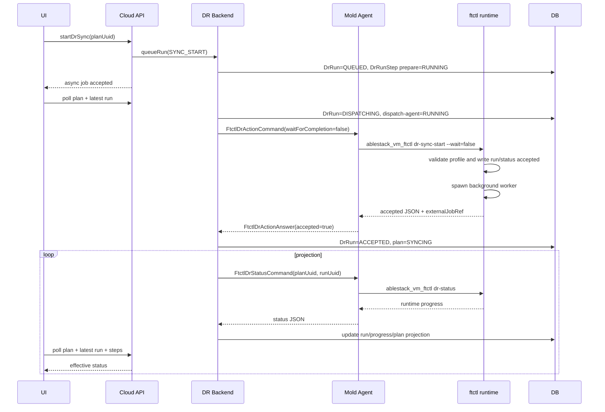

# Cross Hypervisor DR Dispatch And Projection Recovery Design

작성일: 2026-07-06

대상: Cloud UI, Cloud API, Cloud DR backend, Mold Agent/KVM wrapper, ftctl DR runtime, Cloud DB

## 1. 목적

DR Plan 동기화 시작 후 UI에서는 실패로 보이지만 plan 상태가 `SYNCING`으로 남고, FTCTL 런타임은 실제로 생성되지 않는 흐름을 구조적으로 제거한다.

이번 설계는 단순 타임아웃 증가가 아니라 다음 계약을 명확히 하는 것을 목표로 한다.

1. UI/API는 비동기 요청만 시작하고, 장기 작업 완료를 기다리지 않는다.
2. Cloud `DrRun`은 사용자 액션 수명주기의 기준이다.
3. FTCTL runtime status는 엔진 진행률의 기준이다.
4. Agent 호출은 "명령 수락"까지만 책임진다.
5. 수락 전 실패와 수락 후 런타임 실패를 서로 다른 오류로 기록한다.
6. 실패 시 `DrPlan`, `DrRun`, `DrRunStep`, UI 표시 상태가 서로 어긋나지 않는다.
7. site credential, profile JSON, request context의 secret은 management/agent 로그에 노출하지 않는다.

## 2. 확인된 현상

대상 plan:

- plan UUID: `d762a132-ec8a-443f-a962-06e9ef50627f`
- run UUID: `aa7c41b8-f6a3-4d43-8399-f7e2cca68007`

관찰된 상태:

- API latest plan state: `SYNCING`
- latest run state: `FAILED`
- run error code: `DR_ENGINE_UNAVAILABLE`
- run error message: `Unable to dispatch FTCTL_DR run to Agent: Commands ... to Host 1 timed out after 120 secs`
- run step 상태:
  - `prepare`: `QUEUED`
  - `dispatch-agent`: `RUNNING`
  - `execute`: `RUNNING`
  - `execute`: `FAILED`
  - `runtime-projection`: `FAILED`, `not_found`
- host runtime 확인:
  - plan UUID 기준 state/profile 파일 미발견
  - `ablestack_vm_ftctl` runtime process 미발견
  - FTCTL runtime status가 실제로 시작되지 않은 상태

핵심 문제:

1. Cloud backend가 Agent/FTCTL 수락 전에 plan을 `SYNCING`으로 변경한다.
2. Agent wrapper는 `wait=false`로 ftctl을 호출하지만, ftctl CLI 내부가 sync driver/scheduler 작업을 동기 실행할 수 있다.
3. `dr-status not_found`가 "아직 런타임이 만들어지지 않음"인지 "엔진 실패"인지 구분되지 않는다.
4. projection adapter가 pre-accept 상태의 `not_found`를 곧바로 run failure로 기록한다.
5. failure path가 plan state와 step state를 일관되게 닫지 않는다.
6. command 객체 로깅에 profile JSON 또는 credential이 포함될 수 있다.

## 3. 상태 소유권 원칙

| 상태 | 소유 레이어 | 설명 |
| --- | --- | --- |
| 사용자 액션 요청됨 | Cloud API/Backend | API command가 들어오고 `DrRun`이 생성된 상태 |
| Agent dispatch 중 | Cloud Backend/Agent | command를 대상 host agent에 전달 중인 상태 |
| Engine accepted | Agent/FTCTL | ftctl이 profile/run state를 기록하고 외부 job reference를 반환한 상태 |
| Engine running/progress | FTCTL runtime | runtime state/event/progress 파일 기준 진행 상태 |
| UI 표시 상태 | UI/API response | plan, latest run, runtime projection을 조합한 표시 상태 |

중요한 경계:

- `plan.state=SYNCING`은 FTCTL 엔진이 수락했거나 runtime status가 sync 진행을 확인한 이후에만 설정한다.
- Agent timeout은 "엔진이 실패했다"가 아니라 "엔진 수락 여부를 확인하지 못했다"로 처리한다.
- `dr-status not_found`는 pre-accept 또는 startup grace 구간에서는 terminal failure가 아니다.

## 4. 전체 흐름 TO-BE



## 5. UI 설계

### 5.1 변경 대상

- `ui/src/components/dr/DrActionToolbar.vue`
- `ui/src/components/dr/DrRunProgress.vue`
- `ui/src/views/infra/dr/DrPlanList.vue`
- `ui/src/views/infra/dr/DrPlanOverview.vue`
- `ui/src/views/infra/dr/DrRunsTab.vue`
- `ui/src/api/dr.js`
- `ui/src/utils/dr/*`

### 5.2 상태 표시 규칙

UI는 plan state만 보지 않고 latest run과 runtime projection을 함께 본다.

```js
function getEffectiveDrPlanStatus(plan) {
  const run = plan?.lastrun
  if (!run) return plan.state

  if (run.state === 'FAILED') {
    return {
      state: 'ERROR',
      reason: run.errorcode || plan.lasterrorcode,
      message: run.errormessage || plan.lasterrormessage
    }
  }

  if (['QUEUED', 'PREPARING', 'DISPATCHING', 'ACCEPTED', 'RUNNING'].includes(run.state)) {
    return {
      state: run.state,
      reason: run.currentstepname,
      message: run.stepmessage
    }
  }

  return {
    state: plan.state,
    reason: plan.runtimeprojectionstate,
    message: plan.runtimeprojectionmessage
  }
}
```

### 5.3 Action gating

다음 상태에서는 보호 시작, 동기화 시작, failover/failback, release 같은 중복 액션을 막는다.

- `QUEUED`
- `PREPARING`
- `DISPATCHING`
- `ACCEPTED`
- `RUNNING`
- `CANCEL_REQUESTED`

버튼 disabled 사유는 `actioneligibility.reasons[]`와 latest run state를 함께 표시한다.

### 5.4 Progress 표시

`DrRunProgress.vue`는 backend가 정규화한 step만 표시한다.

표시 순서:

1. prepare
2. dispatch-agent
3. agent-accept
4. runtime-projection
5. final

stale `RUNNING` step이 backend에서 닫히지 않은 경우 UI에서 임의로 숨기지 않는다. 대신 backend가 `iscurrent=false`, `state=SKIPPED` 또는 `state=FAILED`로 정규화해서 내려준다.

### 5.5 사용자 메시지

`not_found` raw 메시지는 그대로 노출하지 않는다.

| Backend error | UI message |
| --- | --- |
| `DR_AGENT_DISPATCH_TIMEOUT` | 대상 호스트 에이전트가 제한 시간 안에 명령 수락을 확인하지 못했습니다. |
| `DR_RUNTIME_NOT_CREATED` | DR 엔진 런타임이 생성되지 않았습니다. 대상 호스트의 ftctl 상태를 확인해야 합니다. |
| `DR_RUNTIME_STARTING` | DR 엔진 시작을 확인하는 중입니다. |
| `DR_ENGINE_REPORTED_ERROR` | DR 엔진이 오류를 보고했습니다. |

## 6. API 설계

### 6.1 `DrPlanResponse` 확장

`org.apache.cloudstack.api.response.dr.DrPlanResponse`

```java
@SerializedName("lastrun")
@Param(description = "Latest DR run summary")
private DrRunResponse lastRun;

@SerializedName("runtimeprojectionstate")
@Param(description = "Latest runtime projection state")
private String runtimeProjectionState;

@SerializedName("runtimeprojectionmessage")
@Param(description = "Latest runtime projection message")
private String runtimeProjectionMessage;
```

`lastRun`에는 최소 다음 필드를 포함한다.

```java
uuid
runtype
state
accepted
currentstepname
progresspercent
errorcode
errormessage
externaljobref
started
completed
```

### 6.2 `DrRunResponse` 의미 정리

`accepted=true`는 Cloud API가 요청을 받았다는 의미가 아니다. FTCTL 엔진이 profile/run state를 기록하고 agent가 acceptance answer를 반환한 상태만 의미한다.

권장 필드:

```java
@SerializedName("engineaccepted")
private Boolean engineAccepted;

@SerializedName("acceptedat")
private Date acceptedAt;

@SerializedName("dispatchstarted")
private Date dispatchStarted;

@SerializedName("dispatchcompleted")
private Date dispatchCompleted;

@SerializedName("projectionstate")
private String projectionState;
```

### 6.3 Error code 표준화

| Code | 의미 | Terminal |
| --- | --- | --- |
| `DR_AGENT_DISPATCH_TIMEOUT` | Cloud to Agent command 수락 확인 실패 | Yes |
| `DR_AGENT_UNAVAILABLE` | 대상 host agent 연결 불가 | Yes |
| `DR_RUNTIME_STARTING` | runtime 생성 대기 중 | No |
| `DR_RUNTIME_NOT_CREATED` | grace 이후에도 runtime 미생성 | Yes |
| `DR_ENGINE_REPORTED_ERROR` | ftctl status가 오류를 보고 | Yes |
| `DR_PROJECTION_UNAVAILABLE` | status query 자체 실패 | No, retry 가능 |

### 6.4 API polling contract

UI는 action API 성공을 최종 성공으로 보지 않는다.

1. action API response는 async job id 또는 run id를 반환한다.
2. UI는 `getDrPlan`으로 `plan + lastrun + eligibility`를 조회한다.
3. 상세 화면은 `listDrRunSteps`로 step 상세를 조회한다.
4. `lastrun.state`가 terminal이거나 plan readiness가 안정화될 때까지 polling한다.

## 7. Backend 설계

### 7.1 `DrProtectionOrchestratorImpl`

현재 문제:

- `prepareSyncRun()`에서 Agent acceptance 전 plan을 `SYNCING`으로 변경한다.

TO-BE:

- prepare 단계에서는 plan을 `STARTING` 또는 기존 stable state로 둔다.
- `plan.state=SYNCING`은 `DrRunExecutorImpl.acceptRun()` 또는 projection에서 runtime `SYNCING` 확인 후 설정한다.

권장 코드 구조:

```java
public DrRunVO prepareSyncRun(DrPlanVO plan, DrRunType runType) {
    DrRunVO run = createRun(plan, runType);
    markRunQueued(run);
    recordStep(run, "prepare", RUNNING);

    DrPreparedResources prepared = materializeResources(plan, run);
    persistPreparedResources(plan, run, prepared);

    recordStep(run, "prepare", SUCCEEDED);
    return run;
}
```

### 7.2 `DrRunExecutorImpl`

현재 문제:

- dispatch 전 `markRunRunning()`이 호출되어 pre-accept 상태와 runtime running 상태가 섞인다.
- failure path가 plan state와 이전 step을 닫지 않는다.
- `dispatch-agent`와 `execute` step이 중복/잔류한다.

TO-BE run state:

```text
QUEUED -> PREPARING -> DISPATCHING -> ACCEPTED -> RUNNING -> SUCCEEDED
                                           |          |
                                           |          +-> FAILED
                                           +-> FAILED
```

step order:

| Order | Step | 의미 |
| --- | --- | --- |
| 0 | `prepare` | resource/materialized spec 준비 |
| 10 | `dispatch-agent` | Agent command 전송 |
| 20 | `agent-accept` | FTCTL acceptance 확인 |
| 30 | `runtime-projection` | FTCTL status/progress projection |
| 90 | `final` | terminal close |

권장 코드 구조:

```java
private void executeRunInternal(long runId) {
    DrRunVO run = drRunDao.findById(runId);
    DrPlanVO plan = drPlanDao.findById(run.getPlanId());

    try {
        transitionRun(run, PREPARING);
        upsertStep(run, 0, "prepare", RUNNING, null);
        DrActionContext context = prepareProtectionResources(plan, run);
        finishStep(run, 0, SUCCEEDED, null);

        transitionRun(run, DISPATCHING);
        upsertStep(run, 10, "dispatch-agent", RUNNING, null);
        DrActionResult result = executeAdapter(plan, run, context);

        if (!result.isAccepted()) {
            failBeforeAccept(plan, run, result);
            return;
        }

        finishStep(run, 10, SUCCEEDED, result.getExternalJobRef());
        upsertStep(run, 20, "agent-accept", SUCCEEDED, result.getExternalJobRef());
        acceptRun(plan, run, result);
        refreshProjection(plan.getId());
    } catch (Exception e) {
        failBeforeAccept(plan, run, DrActionResult.dispatchError(e));
    }
}
```

`failBeforeAccept`는 반드시 다음을 수행한다.

```java
closeOpenSteps(run, FAILED, errorCode, message);
transitionRun(run, FAILED);
run.setErrorCode(errorCode);
run.setErrorMessage(message);
run.setCompleted(new Date());

DrPlanVO plan = drPlanDao.findById(run.getPlanId());
plan.setState(ERROR);
plan.setLastErrorCode(errorCode);
plan.setLastErrorMessage(message);
plan.setLastUpdated(new Date());
drPlanDao.update(plan.getId(), plan);
```

### 7.3 `FtctlDrUnifiedActionAdapter`

현재 문제:

- `agentManager.send()` timeout이 engine unavailable로만 매핑된다.
- acceptance timeout과 engine runtime timeout이 분리되어 있지 않다.
- command 객체의 profile JSON이 로그에 노출될 수 있다.

TO-BE:

```java
private static final int DEFAULT_AGENT_ACCEPT_TIMEOUT_SECONDS = 30;
private static final int DEFAULT_PROJECTION_GRACE_SECONDS = 90;
```

`execute()` 흐름:

```java
try {
    FtctlDrActionAnswer answer = (FtctlDrActionAnswer) agentManager.send(hostId, command);
    if (answer != null && answer.isAccepted()) {
        return DrActionResult.accepted(answer);
    }
    return DrActionResult.rejected(answer);
} catch (OperationTimedoutException e) {
    FtctlDrStatusAnswer status = probeStatusOnce(plan, run);
    if (status != null && status.isAccepted()) {
        return DrActionResult.accepted(status);
    }
    return DrActionResult.failed("DR_AGENT_DISPATCH_TIMEOUT", e.getMessage());
} catch (AgentUnavailableException e) {
    return DrActionResult.failed("DR_AGENT_UNAVAILABLE", e.getMessage());
}
```

### 7.4 `FtctlDrRuntimeProjectionAdapter`

현재 문제:

- `not_found`를 pre-accept 구간에서도 terminal failure로 처리한다.
- projection failure가 plan state를 업데이트하지 않거나, 반대로 최신 failed run을 덮어쓸 수 있다.

TO-BE decision:

```java
enum ProjectionDecision {
    PENDING_RUNTIME_CREATION,
    ACCEPTED_RUNTIME_ACTIVE,
    RUNTIME_TERMINAL_FAILURE,
    RUNTIME_TERMINAL_SUCCESS,
    PROJECTION_RETRY
}
```

판단 규칙:

```java
if (status.errorCode == "not_found") {
    if (!run.isEngineAccepted() && run.ageSeconds() < projectionGraceSeconds) {
        return PENDING_RUNTIME_CREATION;
    }
    if (run.isEngineAccepted() && run.acceptedAgeSeconds() < projectionGraceSeconds) {
        return PENDING_RUNTIME_CREATION;
    }
    return RUNTIME_TERMINAL_FAILURE;
}
```

`PENDING_RUNTIME_CREATION`은 run/plan을 실패로 바꾸지 않는다. event만 기록하고 다음 scheduler/poll에서 재시도한다.

`RUNTIME_TERMINAL_FAILURE`는 반드시 run과 plan을 함께 갱신한다.

```java
failRunFromProjection(run, status);
transitionPlanToError(plan, status.getErrorCode(), status.getMessage());
closeOpenSteps(run, FAILED, status.getErrorCode(), status.getMessage());
```

### 7.5 `DrResponseGenerator`

`DrPlanResponse` 생성 시 latest run과 projection state를 포함한다.

```java
DrRunVO latestRun = drRunDao.findLatestByPlanId(plan.getId());
if (latestRun != null) {
    response.setLastRun(createDrRunResponse(latestRun));
    response.setRuntimeProjectionState(latestRun.getProjectionState());
    response.setRuntimeProjectionMessage(latestRun.getErrorMessage());
}
```

## 8. Agent 설계

### 8.1 `FtctlDrActionCommand`

대상:

- `core/src/main/java/com/cloud/agent/api/FtctlDrActionCommand.java`

secret 포함 가능 필드는 로그에서 제외한다.

```java
@LogLevel(LogLevel.Log4jLevel.Off)
private final String profileJson;

@LogLevel(LogLevel.Log4jLevel.Off)
private final String requestJson;

@LogLevel(LogLevel.Log4jLevel.Off)
private final Map<String, String> context;
```

필요하면 다음처럼 redacted summary만 별도 제공한다.

```java
public String getLogSummary() {
    return String.format("action=%s, plan=%s, run=%s, mode=%s, waitForCompletion=%s",
        action, planUuid, runUuid, mode, waitForCompletion);
}
```

### 8.2 `LibvirtFtctlDrActionCommandWrapper`

현재 문제:

- `wait=false`여도 ftctl CLI가 내부적으로 오래 걸리면 wrapper가 timeout된다.

TO-BE:

1. temp profile 파일 생성
2. `ablestack_vm_ftctl <action> --wait=false --json` 호출
3. timeout/no-output 발생 시 `dr-status --plan --run --json` 1회 probe
4. status가 accepted이면 accepted answer 반환
5. status도 없으면 `DR_AGENT_ACCEPT_TIMEOUT` 반환

권장 코드:

```java
String output = runFtctlAction(command, profileFile, timeoutSeconds);
if (StringUtils.isBlank(output)) {
    FtctlDrStatus status = probeStatus(command.getPlanUuid(), command.getRunUuid());
    if (status != null && status.isAccepted()) {
        return answerFromStatus(command, status);
    }
    return timeoutAnswer(command, "DR_AGENT_ACCEPT_TIMEOUT");
}
return parseActionAnswer(command, output);
```

wrapper timeout은 engine completion timeout이 아니라 acceptance timeout이다.

## 9. FTCTL Runtime 설계

대상:

- `ablestack-qemu-exec-tools/lib/ftctl/dr_runtime.sh`

### 9.1 핵심 변경

현재 `ftctl_dr_runtime_action()`은 accepted state를 쓴 뒤에도 driver/scheduler 작업을 같은 CLI 프로세스에서 수행할 수 있다.

TO-BE:

1. validate plan/run/profile
2. profile 저장
3. run/status state를 accepted로 기록
4. background worker spawn
5. CLI는 즉시 accepted JSON 반환
6. worker가 실제 sync/failover/failback/release 작업과 progress update 수행

### 9.2 함수 분리

```bash
ftctl_dr_runtime_action() {
  ftctl_dr_runtime_accept_action "$@"
  if [[ "${wait_for_completion}" == "true" ]]; then
    ftctl_dr_runtime_worker_main "$plan_uuid" "$run_uuid" "$action"
  else
    ftctl_dr_runtime_start_background_worker "$plan_uuid" "$run_uuid" "$action"
  fi
  ftctl_dr_runtime_print_accepted_json "$plan_uuid" "$run_uuid"
}

ftctl_dr_runtime_accept_action() {
  ftctl_dr_runtime_validate_action "$@"
  ftctl_dr_runtime_save_profile "$profile_file"
  ftctl_dr_runtime_write_state "$run_state" "$state" "$step" "1" "true" "$external_job_ref"
  cp -f "$run_state" "$status_state"
}

ftctl_dr_runtime_start_background_worker() {
  nohup ablestack_vm_ftctl dr-worker \
    --plan "$plan_uuid" \
    --run "$run_uuid" \
    --action "$action" \
    --json >>"$run_log" 2>&1 &
}
```

### 9.3 worker locking

plan/run 중복 실행을 막는다.

```bash
lock_path="${plan_dir}/runs/${run_uuid}.lock"
exec 9>"${lock_path}"
flock -n 9 || ftctl_dr_runtime_fail_action "DR_RUN_ALREADY_ACTIVE"
```

### 9.4 `dr-status` output 보강

```json
{
  "command": "dr-status",
  "result": "success",
  "plan_uuid": "...",
  "run_uuid": "...",
  "state": "SYNCING",
  "step": "sync-transfer",
  "progress": 42,
  "accepted": true,
  "runtime_exists": true,
  "profile_exists": true,
  "run_exists": true,
  "external_job_ref": "..."
}
```

profile/status가 아직 없을 때의 `not_found`는 유지하되, Cloud projection adapter가 run state와 age를 기준으로 terminal 여부를 판단한다.

## 10. DB 설계

### 10.1 신규/보강 컬럼

`dr_run`에 engine acceptance와 projection 상태를 명시적으로 저장한다.

```sql
ALTER TABLE dr_run ADD COLUMN engine_accepted tinyint(1) NOT NULL DEFAULT 0;
ALTER TABLE dr_run ADD COLUMN accepted_at datetime DEFAULT NULL;
ALTER TABLE dr_run ADD COLUMN dispatch_started datetime DEFAULT NULL;
ALTER TABLE dr_run ADD COLUMN dispatch_completed datetime DEFAULT NULL;
ALTER TABLE dr_run ADD COLUMN projection_state varchar(64) DEFAULT NULL;
ALTER TABLE dr_run ADD COLUMN projection_checked datetime DEFAULT NULL;
```

조회 성능 보강:

```sql
CREATE INDEX i_dr_run__plan_created ON dr_run(plan_id, created);
CREATE INDEX i_dr_run__plan_state_completed ON dr_run(plan_id, state, completed);
CREATE INDEX i_dr_run_step__run_order ON dr_run_step(run_id, step_order);
```

### 10.2 step upsert

중복 step row를 방지한다.

DAO 수준:

```java
DrRunStepVO findByRunIdAndStepOrder(long runId, int stepOrder);
DrRunStepVO upsertStep(long runId, int stepOrder, String name, String state, String message);
List<DrRunStepVO> listByRunIdOrderByStepOrder(long runId);
```

기존 데이터에 중복이 있을 수 있으므로 unique key는 2단계로 적용한다.

1. 코드에서 upsert 사용
2. 운영 데이터 중복 정리
3. `UNIQUE KEY uk_dr_run_step__run_order(run_id, step_order)` 적용

### 10.3 upgrade script 위치

Cloud DB script 반영 위치:

- `setup/db/create-schema.sql`
- `engine/schema/src/main/resources/META-INF/db/schema-42200to42210.sql`
- `engine/schema/src/main/resources/META-INF/db/schema-42210to42300.sql`
- 필요 시 branch 기준 최신 upgrade script

## 11. 레이어별 AS-IS / TO-BE

| 레이어 | AS-IS | TO-BE |
| --- | --- | --- |
| UI | plan state 중심 표시. latest failed run과 plan SYNCING 불일치가 그대로 보임 | plan + latest run + projection을 조합해 effective status 표시 |
| UI action | API 호출 성공을 시작 성공처럼 표시 | API 성공은 request accepted로만 표시하고 run polling으로 실제 상태 표시 |
| API | plan response에 latest run 요약이 부족함 | `DrPlanResponse.lastrun`, projection state/message 제공 |
| Backend plan | Agent 수락 전 plan을 `SYNCING`으로 변경 | engine accepted 이후에만 `SYNCING` 전환 |
| Backend run | pre-accept, dispatch, runtime running 상태가 섞임 | `QUEUED/PREPARING/DISPATCHING/ACCEPTED/RUNNING` 분리 |
| Backend step | 실패 시 이전 RUNNING step이 남음 | terminal failure 때 open step을 실패/스킵으로 닫음 |
| Projection | `not_found`를 즉시 failure로 처리 | grace와 engineAccepted 기준으로 pending/failure 구분 |
| Agent | ftctl CLI가 오래 걸리면 command timeout | acceptance timeout만 기다리고 status probe로 보정 |
| Agent logging | profile/request/context secret 노출 위험 | `@LogLevel(Off)`와 redacted summary 적용 |
| ftctl | `--wait=false`여도 일부 작업이 같은 CLI에서 오래 실행 | accepted state 기록 후 background worker로 장기 작업 분리 |
| DB | engine accepted/projection 상태가 run state에 암묵적으로 섞임 | `engine_accepted`, `accepted_at`, `projection_state` 등 명시 |

## 12. 구현 순서

1. Agent command secret log masking 적용
2. Backend run state/step 정규화 및 plan failure rollback 적용
3. Projection `not_found` grace 처리 적용
4. API response에 latest run/projection summary 추가
5. UI effective status 및 action gating 보강
6. FTCTL runtime action acceptance/background worker 분리
7. Agent wrapper timeout/status probe 보강
8. DB migration과 DAO upsert 보강
9. sync 시작 재테스트

## 13. 검증 기준

### 13.1 Dispatch timeout 검증

Agent timeout을 강제로 재현했을 때:

- `DrRun.state=FAILED`
- `DrRun.error_code=DR_AGENT_DISPATCH_TIMEOUT`
- `DrPlan.state=ERROR` 또는 이전 stable state + last error 유지
- `DrPlan.state`가 `SYNCING`으로 남지 않음
- 모든 open step이 `FAILED` 또는 `SKIPPED`로 닫힘
- UI 목록/상세가 "동기화 중"이 아니라 실패 상태를 표시

### 13.2 Runtime startup 검증

FTCTL accepted 후 worker startup이 늦을 때:

- grace 이내 `dr-status not_found`는 terminal failure가 아님
- UI는 "엔진 시작 확인 중"으로 표시
- grace 초과 후에도 runtime이 없으면 `DR_RUNTIME_NOT_CREATED`

### 13.3 정상 sync 검증

정상 경로:

- action API는 즉시 반환
- run은 `ACCEPTED` 이후 `RUNNING/SUCCEEDED`로 진행
- plan은 accepted 이후 `SYNCING`
- runtime status/progress가 UI에 반영
- management/agent 로그에 secret 미노출

## 14. 기존 설계 문서와의 관계

이 문서는 다음 기존 문서의 action dispatch, projection, run/plan consistency 규칙을 보강한다.

- `506-cross-hypervisor-dr-cloud-ui-design-20260630.md`
- `507-cross-hypervisor-dr-cloud-api-command-design-20260630.md`
- `508-cross-hypervisor-dr-cloud-backend-wiring-design-20260630.md`
- `509-cross-hypervisor-dr-db-upgrade-and-entity-design-20260630.md`
- `510-cross-hypervisor-dr-ftctl-runtime-contract-design-20260630.md`
- `531-cross-hypervisor-dr-plan-guided-spec-design-20260705.md`

구현 시 위 문서의 기존 UI/입력/인벤토리 설계는 유지하되, DR action 실행과 상태 projection은 본 문서의 계약을 우선한다.

## 15. 2026-07-06 추가 확인: retryable lock과 status hang 통합 설계

### 15.1 추가 확인된 장애 상태

동일 plan `d762a132-ec8a-443f-a962-06e9ef50627f`에서 재동기화 실행 후 다음 상태가 확인되었다.

```json
{
  "command": "dr-sync-start",
  "result": "locked",
  "lock_file": "/run/ablestack-vm-ftctl/lock",
  "vm": "",
  "holder_pid": "3981802",
  "holder_command": "dr-sync-pause",
  "holder_age_sec": "14",
  "exit_code": 20,
  "retryable": true,
  "retry_after_sec": 2
}
```

해석:

- `dr-sync-start`가 실제 동기화 작업을 시작한 것이 아니라 `dr-sync-pause`가 보유한 FTCTL lock 때문에 거절되었다.
- `retryable=true`와 `retry_after_sec=2`는 terminal engine failure가 아니라 짧은 backoff 후 재시도 가능한 engine busy 상태다.
- Cloud는 이를 단순 `DR_ENGINE_ACTION_FAILED`로 실패 처리했고, plan 상태는 `SYNCING`으로 남았다.
- `dr_run_step`에는 terminal failure step 외에 이전 `prepare`, `dispatch-agent`, `execute` step이 `QUEUED`/`RUNNING`으로 남아 UI가 최종 상태를 안정적으로 표시할 수 없었다.
- 동시에 target host에는 `ablestack_vm_ftctl dr-status --plan ... --json` 프로세스가 2개 이상 CPU 99%로 남아, 상세 화면이 skeleton loading 상태에서 풀리지 않았다.

따라서 이번 개선은 두 경로를 동시에 막아야 한다.

1. action dispatch 경로: retryable lock을 plan 단위 작업 직렬화와 재시도 상태로 처리한다.
2. status/projection 경로: UI 조회와 `dr-status` 호출을 분리하고, Agent/ftctl status 호출은 반드시 bounded read-only로 만든다.

### 15.2 레이어별 구조 목표

| 레이어 | 구조 목표 |
| --- | --- |
| UI | 목록/상세는 DB snapshot을 즉시 렌더링하고 projection refresh를 기다리지 않는다. `locked` raw JSON은 사용자 메시지와 상세 원문으로 분리한다. |
| API | action API는 run/job 접수만 반환한다. list/get API는 기본적으로 Agent/ftctl을 호출하지 않는 pure DB read다. |
| Backend | plan 단위 active run mutex를 적용하고, retryable lock은 `RETRYING` 또는 `FAILED_RETRYABLE`로 정규화한다. terminal failure는 plan/run/step을 함께 닫는다. |
| Agent | `FtctlDrStatusCommand`는 hard timeout과 process-tree kill을 가진다. 동일 plan status는 single-flight로 합친다. |
| ftctl | `dr-status`는 lock-free, file-read-only, bounded event tail 방식으로 즉시 반환한다. action lock conflict는 retryable metadata를 유지한다. |
| DB | run acceptance, retry metadata, projection cache, open step closure 결과를 명시적으로 저장한다. |

## 16. UI 코드 수준 설계

대상:

- `ui/src/views/infra/dr/DrPlanList.vue`
- `ui/src/views/infra/dr/DrPlanOverview.vue`
- `ui/src/components/dr/DrRunProgress.vue`
- `ui/src/utils/dr/status.js` 또는 기존 `ui/src/utils/dr/*`
- `ui/src/api/dr.js`

### 16.1 detail/list initial load 분리

AS-IS 문제:

- 상세 화면이 plan 조회와 projection/status refresh를 같은 loading 상태로 묶으면, backend status 호출이 hang일 때 전체 화면이 skeleton 상태로 남는다.

TO-BE:

```js
async function fetchPlanDetail() {
  this.loading = true
  try {
    this.plan = await getDrPlan({ id: this.id, refreshprojection: false })
    this.runs = await listDrRuns({ planid: this.id, pagesize: 20 })
    this.steps = await listDrRunStepsForLatestRun(this.runs)
  } finally {
    this.loading = false
  }
  this.refreshProjectionAsync()
}

async function refreshProjectionAsync() {
  this.projectionRefreshing = true
  try {
    await refreshDrPlanProjection({ id: this.id })
  } catch (e) {
    this.projectionWarning = normalizeProjectionError(e)
  } finally {
    this.projectionRefreshing = false
  }
}
```

원칙:

- `loading`은 DB snapshot fetch에만 사용한다.
- `projectionRefreshing`은 별도 badge/spinner로 표시한다.
- projection 실패는 전체 화면 skeleton이나 `No Data`로 바꾸지 않는다.

### 16.2 effective status 정규화

```js
export function normalizeDrPlanEffectiveStatus(plan) {
  const run = plan?.lastrun
  if (run?.state === 'FAILED' || run?.state === 'FAILED_RETRYABLE') {
    return {
      state: run.state,
      severity: run.retryable ? 'warning' : 'error',
      code: run.errorcode || plan.lasterrorcode,
      message: humanizeDrRunError(run)
    }
  }
  if (['QUEUED', 'PREPARING', 'DISPATCHING', 'RETRYING', 'ACCEPTED', 'RUNNING', 'CANCEL_REQUESTED'].includes(run?.state)) {
    return {
      state: run.state,
      severity: 'processing',
      code: run.currentstepname,
      message: run.stepmessage || run.errormessage
    }
  }
  return {
    state: plan?.state,
    severity: severityFromPlanState(plan?.state),
    code: plan?.runtimeprojectionstate,
    message: plan?.runtimeprojectionmessage || plan?.lasterrormessage
  }
}
```

`locked` 메시지 변환:

| Raw condition | UI message |
| --- | --- |
| `result=locked`, `holder_command=dr-sync-pause`, `retryable=true` | 이전 일시정지 작업이 정리되는 중이라 재동기화를 잠시 대기합니다. |
| retry window exceeded | FTCTL 엔진 lock이 해제되지 않아 작업을 시작하지 못했습니다. |
| `DR_STATUS_TIMEOUT` | 대상 호스트의 DR 상태 조회가 제한 시간 안에 응답하지 않았습니다. 최근 DB 상태를 표시합니다. |

raw JSON은 `DrRunProgress`의 상세 펼침 또는 event detail에서만 표시한다.

### 16.3 action gating

UI는 backend eligibility를 우선 사용하되, latest run을 이용해 즉시 중복 클릭을 막는다.

```js
export function hasActivePlanRun(plan) {
  return ['QUEUED', 'PREPARING', 'DISPATCHING', 'RETRYING', 'ACCEPTED', 'RUNNING', 'CANCEL_REQUESTED'].includes(plan?.lastrun?.state)
}
```

active run이 있으면 sync/failover/failback/reprotect/release action을 disable하고, `lastrun`과 retry ETA를 표시한다.

## 17. API 코드 수준 설계

대상:

- `org.apache.cloudstack.api.command.admin.dr.*`
- `org.apache.cloudstack.api.response.dr.DrPlanResponse`
- `org.apache.cloudstack.api.response.dr.DrRunResponse`
- `ui/src/api/dr.js`

### 17.1 조회 API와 갱신 API 분리

`listDrPlans`, `getDrPlan`, `listDrRuns`, `listDrRunSteps`는 기본적으로 DB snapshot만 반환한다.

금지:

```java
// list/get command 처리 중 projection refresh 직접 호출 금지
drProjectionService.refreshPlanProjection(plan);
```

권장:

```java
@APICommand(name = "refreshDrPlanProjection", responseObject = DrRunResponse.class)
public class RefreshDrPlanProjectionCmd extends BaseAsyncCmd {
    @Parameter(name = ApiConstants.ID, type = CommandType.UUID, entityType = DrPlanResponse.class, required = true)
    private Long id;

    @Override
    public void execute() {
        DrRunResponse response = drPlanService.queueProjectionRefresh(id);
        response.setResponseName(getCommandName());
        setResponseObject(response);
    }
}
```

projection refresh도 Agent/ftctl status 완료를 API thread에서 기다리지 않고 `PROJECTION_REFRESH` run 또는 lightweight async job으로 기록한다.

### 17.2 action API response

action API는 다음을 즉시 반환한다.

```java
@SerializedName("runid")
private String runId;

@SerializedName("jobid")
private String jobId;

@SerializedName("state")
private String state; // QUEUED or RETRYING

@SerializedName("accepted")
private Boolean accepted; // API accepted, not engine accepted
```

`engineaccepted`는 `DrRunResponse`에서 별도 필드로 유지한다.

### 17.3 표준 error code

| Code | 조건 | Retryable |
| --- | --- | --- |
| `DR_ENGINE_BUSY_RETRYABLE` | ftctl JSON `result=locked`, `retryable=true` | true |
| `DR_ENGINE_BUSY_TIMEOUT` | retry window 초과 | false |
| `DR_STATUS_TIMEOUT` | Agent status wrapper hard timeout | true |
| `DR_PROJECTION_STALE` | cached projection만 제공 중 | true |
| `DR_AGENT_DISPATCH_TIMEOUT` | action acceptance 확인 실패 | 판단 필요 |
| `DR_RUNTIME_NOT_CREATED` | grace 초과 후 status/profile/run 없음 | false |

## 18. Backend 코드 수준 설계

대상:

- `com.cloud.dr.orchestrator.DrRunExecutorImpl`
- `com.cloud.dr.adapter.ftctl.FtctlDrUnifiedActionAdapter`
- `com.cloud.dr.adapter.ftctl.FtctlDrRuntimeProjectionAdapter`
- `com.cloud.dr.dao.DrRunDaoImpl`
- `com.cloud.dr.dao.DrRunStepDaoImpl`
- `com.cloud.dr.DrPlanServiceImpl`

### 18.1 plan 단위 active run mutex

`DrRunExecutorImpl.queueRun()` 또는 run 생성 서비스에서 같은 plan의 active run을 검사한다.

```java
private boolean isActiveRun(DrRunVO run) {
    return StringUtils.equalsAny(run.getState(),
            RUN_STATE_QUEUED,
            RUN_STATE_PREPARING,
            RUN_STATE_DISPATCHING,
            RUN_STATE_RETRYING,
            RUN_STATE_ACCEPTED,
            RUN_STATE_RUNNING,
            RUN_STATE_CANCEL_REQUESTED);
}

private void assertNoConflictingRun(DrRunVO requested) {
    DrRunVO active = drRunDao.findLatestActiveByPlanId(requested.getPlanId());
    if (active != null && !Objects.equals(active.getId(), requested.getId())) {
        throw new CloudRuntimeException("DR plan already has active run " + active.getUuid());
    }
}
```

`PAUSE_SYNC` 직후 `SYNC`가 들어오면 다음 중 하나를 선택한다.

1. queue 정책: `SYNC` run을 `QUEUED`로 남기고 이전 run terminal 이후 dispatcher가 처리
2. reject 정책: API에서 `DR_PLAN_RUN_ACTIVE`로 거부

운영 UX 관점에서는 queue 정책을 권장한다. 단, destructive action 간 순서가 위험하면 failover/failback/release는 reject 정책을 유지한다.

### 18.2 retryable lock handling

`FtctlDrUnifiedActionAdapter`는 action answer JSON을 파싱해 retryable lock을 별도 결과로 반환한다.

```java
if (isLockedRetryable(answer)) {
    return DrAdapterResult.retryable(
            DrConstants.ERROR_ENGINE_BUSY_RETRYABLE,
            buildLockedMessage(answer),
            answer.getDetailsJson(),
            retryAfterSeconds(answer));
}
```

`DrRunExecutorImpl`은 retryable result를 terminal failure로 닫지 않고 retry schedule을 기록한다.

```java
private void handleRetryableRun(DrRunVO run, DrAdapterResult result) {
    closeCurrentAttemptSteps(run, DrConstants.STEP_STATE_RETRYING, result.getErrorCode(), result.getMessage());
    run.setState(DrConstants.RUN_STATE_RETRYING);
    run.setErrorCode(result.getErrorCode());
    run.setErrorMessage(result.getMessage());
    run.setNextRetryAt(DateUtils.addSeconds(new Date(), result.getRetryAfterSeconds()));
    run.setRetryCount(run.getRetryCount() + 1);
    drRunDao.update(run.getId(), run);
    markPlanBusy(run.getPlanId(), result);
    dispatcher.schedule(run.getId(), result.getRetryAfterSeconds());
}
```

retry limit 초과 시에만 `FAILED`로 전환한다.

```java
if (run.getRetryCount() >= maxRetryCount || retryWindowExpired(run)) {
    failRun(run, DrConstants.ERROR_ENGINE_BUSY_TIMEOUT, result.getMessage(), result.getDetailsJson());
}
```

### 18.3 terminal failure 정규화

`failRun()`은 중복 step을 만들지 않고 `(run_id, step_order)` 기준 upsert를 사용한다.

```java
private void failRun(DrRunVO run, String errorCode, String message, String detailsJson) {
    closeOpenSteps(run, DrConstants.STEP_STATE_FAILED, errorCode, message);
    upsertStep(run.getId(), STEP_FINAL, STEP_ORDER_FINAL, DrConstants.STEP_STATE_FAILED, 100, detailsJson, errorCode, message);
    run.setState(DrConstants.RUN_STATE_FAILED);
    run.setCompleted(new Date());
    run.setProjectionState("failed");
    drRunDao.update(run.getId(), run);
    markPlanFailedOrRestoreStable(run, errorCode, message);
}
```

`markPlanFailedOrRestoreStable()`은 수락 전 실패와 수락 후 실패를 분리한다.

```java
if (!run.isEngineAccepted()) {
    plan.setState(StringUtils.defaultIfBlank(plan.getPreviousStableState(), DrConstants.PLAN_STATE_READY));
    plan.setLastErrorCode(errorCode);
    plan.setLastErrorMessage(message);
} else {
    plan.setState(DrConstants.PLAN_STATE_ERROR);
    plan.setLastErrorCode(errorCode);
    plan.setLastErrorMessage(message);
}
```

수락 전 실패는 "동기화 중" 상태가 아니므로 plan을 `SYNCING`에 남기지 않는다.

### 18.4 projection refresh 비동기화

`FtctlDrRuntimeProjectionAdapter.refreshPlanProjection()`은 list/get API에서 직접 호출되지 않는다. scheduler 또는 explicit async command가 호출한다.

```java
public DrAdapterResult refreshPlanProjection(DrPlanVO plan) {
    if (projectionCache.isFresh(plan.getId(), PROJECTION_TTL_SECONDS)) {
        return DrAdapterResult.success("projection cache is fresh", cachedDetails(plan));
    }
    return dispatchBoundedStatusRefresh(plan);
}
```

status timeout은 plan을 terminal failure로 바꾸지 않는다.

```java
if (StringUtils.equals(status.getErrorCode(), DrConstants.ERROR_STATUS_TIMEOUT)) {
    markProjectionStale(plan, status);
    return DrAdapterResult.retryable(DrConstants.ERROR_PROJECTION_STALE, status.getDetails(), status.getStatusJson(), 5);
}
```

## 19. Agent 코드 수준 설계

대상:

- `plugins/hypervisors/kvm/src/main/java/com/cloud/hypervisor/kvm/resource/wrapper/LibvirtFtctlDrStatusCommandWrapper.java`
- `plugins/hypervisors/kvm/src/main/java/com/cloud/hypervisor/kvm/resource/wrapper/LibvirtFtctlDrActionCommandWrapper.java`

### 19.1 status hard timeout

`FtctlDrStatusCommand`의 `command.setWait(30)`는 Cloud command wait일 뿐이다. wrapper는 host process hard timeout을 별도로 둔다.

```java
private static final int STATUS_HARD_TIMEOUT_SECONDS = 5;

Script script = new Script("timeout", (STATUS_HARD_TIMEOUT_SECONDS + 2) * 1000L, logger);
script.add("--kill-after=2s");
script.add(String.valueOf(STATUS_HARD_TIMEOUT_SECONDS));
script.add("ablestack_vm_ftctl");
script.add("dr-status");
...
```

timeout exit code는 표준 JSON으로 변환한다.

```java
if (exitValue == 124 || exitValue == 137) {
    return new FtctlDrStatusAnswer(command, false,
            "FTCTL_DR status timed out",
            command.getPlanUuid(), command.getRunUuid(),
            "timeout", "UNKNOWN", "status-timeout", 0,
            null, null, null, null,
            DrConstants.ERROR_STATUS_TIMEOUT,
            exitValue, output, timeoutJson(command));
}
```

### 19.2 single-flight/debounce

동일 plan에 대한 status 조회가 동시에 들어오면 하나만 실행한다.

```java
private final ConcurrentMap<String, CompletableFuture<FtctlDrStatusAnswer>> statusInFlight = new ConcurrentHashMap<>();

private FtctlDrStatusAnswer executeSingleFlight(FtctlDrStatusCommand command) {
    String key = command.getPlanUuid() + ":" + StringUtils.defaultString(command.getRunUuid());
    CompletableFuture<FtctlDrStatusAnswer> future = statusInFlight.computeIfAbsent(key,
            ignored -> CompletableFuture.supplyAsync(() -> executeStatusProcess(command), statusExecutor));
    try {
        return future.get(STATUS_HARD_TIMEOUT_SECONDS + 2L, TimeUnit.SECONDS);
    } finally {
        statusInFlight.remove(key, future);
    }
}
```

Agent wrapper는 timeout 이후 orphan `ablestack_vm_ftctl dr-status` 프로세스가 남지 않도록 process tree를 종료해야 한다.

## 20. ftctl 코드 수준 설계

대상:

- `ablestack-qemu-exec-tools/lib/ftctl/libvirt_wrap.sh`
- `ablestack-qemu-exec-tools/lib/ftctl/dr_runtime.sh`
- `ablestack-qemu-exec-tools/bin/ablestack_vm_ftctl.sh`

### 20.1 lock conflict JSON 유지

`ftctl_lock_emit_conflict()`의 현재 JSON은 Cloud가 retryable lock을 해석할 수 있으므로 유지한다.

```json
{
  "result": "locked",
  "holder_command": "dr-sync-pause",
  "exit_code": 20,
  "retryable": true,
  "retry_after_sec": 2
}
```

보강:

- `holder_command`
- `holder_pid`
- `holder_age_sec`
- `retry_after_sec`
- `lock_scope`: `global`, `plan`, `run`
- `plan_uuid`, `run_uuid` 가능 시 포함

### 20.2 `dr-status` lock-free bounded read

`dr-status`는 절대 global lock을 잡지 않고, worker/scheduler를 시작하지 않고, network/VMware/Mold/qemu/block job probe를 수행하지 않는다.

```bash
ftctl_dr_runtime_status() {
  local plan="$1" run="$2" events_offset="${3:-0}" json="${4:-0}"
  local path

  ftctl_dr_runtime_require_plan_fast "${plan}" || return 2
  path="$(ftctl_dr_runtime_resolve_state_path "${plan}" "${run}")" || return 2

  if [[ "${json}" == "1" ]]; then
    ftctl_dr_runtime_emit_state_json_fast "${plan}" "${run}" "${path}" "${events_offset}"
  else
    ftctl_dr_runtime_emit_state_text_fast "${plan}" "${run}" "${path}"
  fi
}
```

`ftctl_dr_runtime_emit_events_since()`는 전체 events.log를 처음부터 끝까지 읽지 않는다.

```bash
FTCTL_DR_STATUS_MAX_EVENTS="${FTCTL_DR_STATUS_MAX_EVENTS:-100}"
FTCTL_DR_STATUS_MAX_EVENT_BYTES="${FTCTL_DR_STATUS_MAX_EVENT_BYTES:-262144}"
tail -c "${FTCTL_DR_STATUS_MAX_EVENT_BYTES}" "${FTCTL_EVENTS_LOG}" |
  awk -v offset="${offset}" -v max="${FTCTL_DR_STATUS_MAX_EVENTS}" '...'
```

### 20.3 status self-guard

`dr-status` 내부에 shell-level timeout을 둔다.

```bash
FTCTL_DR_STATUS_DEADLINE_SECONDS="${FTCTL_DR_STATUS_DEADLINE_SECONDS:-4}"
ftctl_deadline_start "${FTCTL_DR_STATUS_DEADLINE_SECONDS}"
ftctl_deadline_check "read-status-state"
ftctl_deadline_check "emit-events"
```

deadline 초과 시 JSON을 반환하고 종료한다.

```json
{
  "command": "dr-status",
  "result": "timeout",
  "state": "UNKNOWN",
  "step": "status-timeout",
  "error_code": "DR_STATUS_TIMEOUT",
  "retryable": true
}
```

## 21. DB 코드 수준 설계

대상:

- `engine/schema/src/main/resources/META-INF/db/schema-42200to42210.sql`
- `engine/schema/src/main/resources/META-INF/db/schema-42210to42300.sql`
- `engine/schema/src/main/resources/META-INF/db/schema-Europa-After.sql`
- `setup/db/create-schema.sql`
- `DrRunVO`
- `DrRunStepVO`

### 21.1 retry/projection 컬럼

권장 추가 컬럼:

```sql
ALTER TABLE dr_run ADD COLUMN retryable tinyint(1) NOT NULL DEFAULT 0;
ALTER TABLE dr_run ADD COLUMN retry_count int NOT NULL DEFAULT 0;
ALTER TABLE dr_run ADD COLUMN next_retry_at datetime DEFAULT NULL;
ALTER TABLE dr_run ADD COLUMN retry_after_seconds int DEFAULT NULL;
ALTER TABLE dr_run ADD COLUMN last_status_json mediumtext DEFAULT NULL;

ALTER TABLE dr_plan ADD COLUMN projection_refreshing tinyint(1) NOT NULL DEFAULT 0;
ALTER TABLE dr_plan ADD COLUMN projection_error_code varchar(128) DEFAULT NULL;
ALTER TABLE dr_plan ADD COLUMN projection_error_message varchar(1024) DEFAULT NULL;
ALTER TABLE dr_plan ADD COLUMN projection_checked datetime DEFAULT NULL;
```

기존에 이미 `projection_state`, `projection_checked`가 `dr_run`에 있다면 위 컬럼은 중복 생성하지 않고 의미를 맞춘다.

### 21.2 step 정규화

중복 step이 있는 현재 운영 데이터 때문에 unique key는 즉시 강제하지 않는다.

1차 구현:

- DAO에서 `(run_id, step_order)` upsert를 강제한다.
- terminal run 전환 시 `state in ('QUEUED','RUNNING','RETRYING')` step을 닫는다.

2차 정리:

```sql
SELECT run_id, step_order, COUNT(*)
  FROM dr_run_step
 WHERE removed IS NULL
 GROUP BY run_id, step_order
HAVING COUNT(*) > 1;
```

중복 제거 후:

```sql
ALTER TABLE dr_run_step ADD UNIQUE KEY uk_dr_run_step__run_order (run_id, step_order);
```

### 21.3 현재 plan 보정 원칙

운영 보정은 구현 이후에 수행한다.

- 최신 run이 `FAILED`이고 `engine_accepted=0`이면 plan을 `SYNCING`으로 유지하지 않는다.
- plan `last_error_code/message`는 최신 terminal run의 error를 반영한다.
- 같은 run의 open step은 `FAILED` 또는 `SKIPPED`로 닫는다.
- host에 남은 `dr-status` 프로세스는 증거 수집 후 정확한 PID 기준으로 종료한다.

## 22. 검증 기준 보강

### 22.1 retryable lock 검증

재현:

1. `dr-sync-pause`가 lock을 잡은 상태에서 `dr-sync-start` 실행
2. FTCTL이 `result=locked`, `retryable=true`, `retry_after_sec=2` 반환

PASS:

- Cloud가 `DR_ENGINE_BUSY_RETRYABLE`로 분류
- run은 `RETRYING` 또는 정책상 `FAILED_RETRYABLE`
- plan은 `SYNCING`으로 남지 않음
- UI는 "이전 작업 정리 중" 메시지를 표시
- retry window 안에서 자동 재시도 또는 명확한 수동 재시도 안내
- raw JSON은 상세 영역에서만 확인 가능

### 22.2 status hang 검증

재현:

1. `ablestack_vm_ftctl dr-status`가 응답하지 않는 상황 유도
2. DR Plan 상세 화면 진입

PASS:

- 상세 화면의 기본 정보는 DB snapshot으로 렌더링됨
- `LibvirtFtctlDrStatusCommandWrapper`가 5초 내 timeout answer 반환
- host에 orphan `dr-status` 프로세스가 남지 않음
- plan은 projection stale warning만 기록하고 terminal failure로 오판하지 않음
- UI는 전체 skeleton이 아니라 runtime status panel 경고만 표시

### 22.3 상태 정합성 검증

PASS:

- latest run terminal 상태와 plan 상태가 충돌하지 않음
- terminal run에 `QUEUED/RUNNING` open step이 남지 않음
- `dr_run.async_job_id` 또는 action response job/run correlation이 UI에서 추적 가능
- management/agent/host log에 credential/profile secret 원문이 없음

## 22.3 2026-07-06 추가 보강: accepted 이후 worker self-lock/stall 복구 계약

세부 설계는 [535-cross-hypervisor-dr-async-worker-lock-and-readiness-recovery-design-20260706.md](535-cross-hypervisor-dr-async-worker-lock-and-readiness-recovery-design-20260706.md)를 따른다.

이번 추가 보강의 핵심은 `Agent accepted`와 `ftctl worker running`을 분리하는 것이다. `dr-sync-start --wait=false`가 accepted를 반환해도 background worker가 같은 `dr-sync-start` global lock에 막히면 target materialization은 시작되지 않는다. 따라서 projection recovery는 다음을 보장해야 한다.

- `accepted=true`는 terminal success가 아니다.
- `worker_pid`, `worker_state`, `retryable`, `retry_after_sec`, `run_exists`, `updated_at`을 runtime projection의 1차 판정 값으로 사용한다.
- `accepted` 이후 worker heartbeat가 stall threshold를 넘으면 `DR_ENGINE_WORKER_STALLED` 또는 `DR_ENGINE_BUSY_RETRYABLE`로 전환한다.
- retryable lock은 `dr_run.retryable`, `retry_after_seconds`, `next_retry_at`, `last_status_json`에 저장하고 retry scheduler로 연결한다.
- target VM/volume/restore point/durable checkpoint가 확인되기 전에는 sync run을 `SUCCEEDED`로 닫지 않는다.
- UI는 `ACCEPTED`, `WORKER_STARTING`, `WORKER_RETRYING`, `TARGET_MATERIALIZING`, `TARGET_READY`를 분리 표시한다.

## 23. 2026-07-06 추가 보강: accepted false-success와 target materialization 계약

상세 기준은 [534-cross-hypervisor-dr-sync-readiness-and-materialization-contract-design-20260706.md](534-cross-hypervisor-dr-sync-readiness-and-materialization-contract-design-20260706.md)를 따른다.

이 문서의 retryable lock/projection stale 보강은 "실패를 실패로 보이게 하는" 기준이다. 추가로 필요한 기준은 "접수를 성공으로 오판하지 않는" 것이다.

확인된 false-success 후보:

- ftctl status: `sync-start-accepted`, `progress=1`, `accepted=true`
- ftctl run log: `result=locked`, `retryable=true`
- Cloud latest run: `SUCCEEDED`, progress `100`으로 표시 가능
- DB replica: `target_vm_id=NULL`, `target_external_ref=NULL`
- restore point: 없음
- target VM/volume/NIC: 없음

따라서 projection recovery는 다음 순서로 동작한다.

1. latest run과 DB snapshot을 조회한다.
2. bounded `dr-status`를 조회한다.
3. `retryable=true` lock이면 `DR_ENGINE_BUSY_RETRYABLE`로 유지한다.
4. runtime이 success 후보를 반환해도 `isSyncTargetReady()`를 통과하지 못하면 run을 terminal success로 닫지 않는다.
5. target materialization verifier가 실패하면 Plan은 `TARGET_MATERIALIZING` 또는 `DEGRADED`로 남긴다.
6. target VM/volume/NIC, restore point, durable checkpoint가 모두 확인된 후에만 Plan을 `READY`로 보정한다.

추가 PASS:

- `startDrPlanSync` 직후 UI는 "작업 접수"를 표시하고 "동기화 완료"를 표시하지 않는다.
- target readiness가 없으면 Failover 버튼은 비활성화된다.
- 이미 `SUCCEEDED`로 잘못 닫힌 run도 projection repair가 target readiness를 기준으로 보정할 수 있다.

## 2026-07-07 Terminal Projection Update

The VMware to ABLESTACK sync test for plan `b0522fc5-047f-4dc6-9cd7-b43a17daae45` exposed a projection gap: FTCTL runtime reached `ERROR` with `DR_ABLESTACK_DRIVER_FAILED`, but Cloud DB/API/UI still exposed the plan as `SYNCING` and the run as `ACCEPTED`.

The detailed follow-up design is:

- [536-cross-hypervisor-dr-terminal-projection-and-target-driver-contract-design-20260707.md](536-cross-hypervisor-dr-terminal-projection-and-target-driver-contract-design-20260707.md)

Required updates:

- API read paths such as `getDrPlan`, `listDrRuns`, `listDrReplicas`, and `listDrRunSteps` must refresh projection with both `planUuid` and latest `runUuid`.
- Agent status wrappers must pass `--run <runUuid>` to FTCTL when a latest run exists.
- Backend projection must interpret runtime payload fields such as `state=ERROR`, `worker_state=FAILED`, and `error_code` before treating an agent command as healthy.
- DB projection must atomically move plan/run/step/replica/disk state to terminal failure when FTCTL runtime is terminal.
- UI must render `effectiveState`, not raw plan `state`, so `SYNCING` cannot mask a failed runtime worker.

## 2026-07-07 Update: Accepted Run Must Converge To VMware Mover Failure

The VMware to ABLESTACK run
`459cd2fa-59e4-4a59-9a4d-e1be62413390` showed a concrete accepted-run
projection failure:

- FTCTL `dr-status` returned `state=ERROR`, `worker_state=FAILED`,
  `error_code=DR_VMWARE_MOVER_UNAVAILABLE`.
- Cloud DB/API still returned `dr_plan.state=SYNCING` and
  `dr_run.state=ACCEPTED`.

The implementation detail is refined in
[542-cross-hypervisor-dr-vmware-mover-and-projection-convergence-design-20260707.md](542-cross-hypervisor-dr-vmware-mover-and-projection-convergence-design-20260707.md).

Projection recovery must therefore be monotonic:

1. A newer terminal `dr-status` payload always wins over an older action
   `accepted` payload.
2. `LibvirtFtctlDrStatusCommandWrapper` must parse the final valid status JSON
   from command output and must not accidentally reuse the original action
   output.
3. `FtctlDrRuntimeProjectionAdapter` must write `last_status_json` on every
   refresh and must atomically fail plan/run/replica/disk on terminal runtime
   failure.
4. `getDrPlan`, `listDrRuns`, and `listDrRunSteps` must reload DB rows after
   projection refresh, not render stale objects loaded before refresh.
5. UI readiness and action eligibility must use the projected terminal state,
   not the pre-projection raw state.
