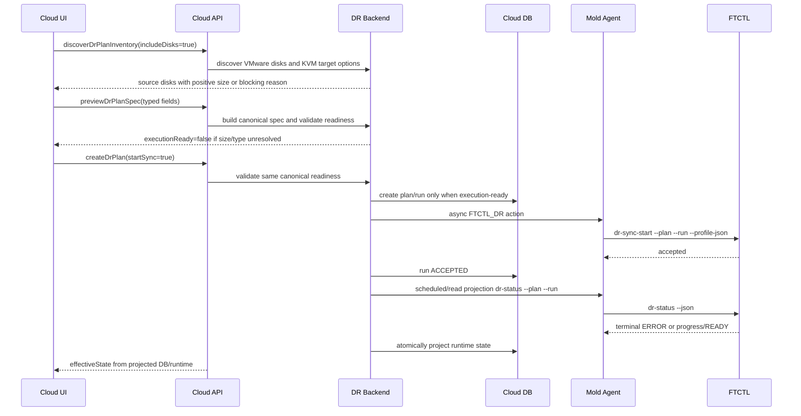

# Cross Hypervisor DR VMware To KVM Disk Size And Projection Hardening Design

Date: 2026-07-07

## 1. Purpose

This document closes the structural gap found during the VMware to ABLESTACK
sync validation for plan `05527cbe-974e-4ca8-b65e-f844cb3420e7`.

The user-created DR plan was accepted asynchronously, but the target worker
failed before materializing the ABLESTACK replica:

| Item | Observed value |
| --- | --- |
| Plan UUID | `05527cbe-974e-4ca8-b65e-f844cb3420e7` |
| Run UUID | `79f4a7b9-778b-4279-a4bd-3aa7af38ed53` |
| Direction | `VMWARE_TO_KVM` |
| Cloud plan state | `SYNCING` |
| Cloud run state | `ACCEPTED` |
| Cloud run projection | `accepted`, `projection_checked=NULL` |
| Replica state | `SKELETON_READY` |
| Restore points | `0` |
| Target VM/volume | not created |
| FTCTL runtime state | `ERROR` |
| FTCTL runtime step | `ablestack-target-map-invalid` |
| FTCTL error code | `DR_TARGET_DISK_SIZE_UNRESOLVED` |
| FTCTL worker state | `FAILED` |

Runtime evidence showed both `vmware-disks.json` and `ablestack-disks.json`
contained `sizeBytes: 0` for disk `2000`. Site health was not the issue:
the VMware site was `VCENTER_API_OK`, and the ABLESTACK site was `MOLD_API_OK`
with `HmacSHA256`.

The fix must therefore be structural:

1. Do not create or start an executable DR plan when source disk size is
   unresolved.
2. Do not let UI/API imply success from an accepted async command.
3. Continuously project terminal FTCTL runtime state back into Cloud DB/API/UI.

## 2. Design Principles

- `ACCEPTED` means "agent accepted command transport", not "sync is healthy".
- A `VMWARE_TO_KVM` sync is execution-ready only when every selected source disk
  has a positive size and every KVM target disk has resolved storage, offering,
  type, and format.
- The UI can guide selections, but the backend owns canonical readiness checks.
- FTCTL remains the final host-side guard and must keep rejecting unsafe target
  maps.
- API read paths and background reconciliation must converge Cloud DB with FTCTL
  runtime state.
- Next-step PASS requires materialization evidence: target VM reference,
  target disk/volume reference, durable checkpoint, and restore point.

## 3. UI Layer Design

Target files:

- `ui/src/views/infra/dr/DrPlanList.vue`
- `ui/src/views/infra/dr/DrPlanOverview.vue`
- `ui/src/views/infra/dr/DrRunsTab.vue`
- `ui/src/utils/dr/resourceActions.js`
- `ui/src/api/dr.js`
- `ui/public/locales/en.json`
- `ui/public/locales/ko_KR.json`

### 3.1 Source Disk Size Validation

`DrPlanList.vue` already builds disk rows from `sourceDiskOptions`.
It must treat missing, zero, or non-numeric size as blocking for
`VMWARE_TO_KVM`.

Required helper:

```js
normalizeDiskSizeBytes (value) {
  const parsed = Number(value)
  return Number.isFinite(parsed) && parsed > 0 ? parsed : 0
}

hasUnresolvedSourceDiskSize () {
  if (this.createForm.direction !== 'VMWARE_TO_KVM') return false
  return this.diskMappingRows.some(row => this.normalizeDiskSizeBytes(row.capacityBytes || row.sizeBytes) <= 0)
}
```

`validatePlanForm()` must return a localized blocking message before
`previewDrPlanSpec()` or `createDrPlan()` is called:

```js
if (this.hasUnresolvedSourceDiskSize()) {
  return this.$t('message.dr.plan.validation.source.disk.size')
}
```

Add messages:

- `message.dr.plan.validation.source.disk.size`
- `message.dr.plan.validation.target.disk.type`
- `message.dr.plan.validation.execution.ready.detail`

Suggested Korean message:

```json
{
  "message.dr.plan.validation.source.disk.size": "원본 디스크 크기를 확인할 수 없어 동기화를 시작할 수 없습니다. 원본 가상머신 디스크 정보를 다시 조회하세요."
}
```

### 3.2 Disk Mapping Payload

`buildDiskMappingsJson()` must put the positive size in all canonical positions.
The current structure carries `capacityBytes`, but a zero value can still be
serialized and accepted. The UI should serialize only after validation:

```js
const sizeBytes = this.normalizeDiskSizeBytes(row.capacityBytes || row.sizeBytes)
return {
  label: row.sourceLabel,
  sourceRef: row.sourceDiskRef,
  sourcePath: row.sourcePath,
  sizeBytes,
  capacityBytes: sizeBytes,
  targetRef: row.targetDiskName,
  targetStorageRef: row.targetStorageRef,
  targetDiskOfferingId: row.targetDiskOfferingId,
  source: {
    diskRef: row.sourceDiskRef,
    label: row.sourceLabel,
    vmdkPath: row.sourcePath,
    sizeBytes,
    capacityBytes: sizeBytes,
    boot: index === 0
  },
  target: {
    name: row.targetDiskName,
    storageRef: row.targetStorageRef,
    diskOfferingId: row.targetDiskOfferingId,
    sizeBytes,
    capacityBytes: sizeBytes,
    format: this.resolveTargetDiskFormat(row)
  }
}
```

`resolveTargetDiskFormat(row)` must not hardcode `qcow2` for every KVM target.
For ABLESTACK RBD target storage, the backend ultimately owns the canonical
normalization, but the UI should avoid generating contradictory hints:

| Target storage | UI default format hint |
| --- | --- |
| RBD | `raw` |
| Filesystem/local/NFS qcow2 target | `qcow2` |
| Unknown | omit and let backend resolve |

### 3.3 Inventory Refresh UX

When a VMware workload is selected and the returned disk option has no positive
size, the disk row must show a warning icon and the submit button must remain
disabled. Add a small command next to the disk mapping section:

- label: `원본 디스크 다시 조회`
- action: re-run `discoverDrPlanInventory` with `includedisks=true`
- result: replace `sourceDiskOptions`, rebuild disk rows, keep existing target
  selections by `sourceDiskRef`

### 3.4 Effective State Rendering

The list/detail screens must render runtime-derived state first:

```js
function normalizeDrRuntimeState (plan) {
  const runtimeState = upper(plan.runtimestate || plan.runtimeState)
  const workerState = upper(plan.workerstate || plan.workerState)
  const runtimeError = plan.runtimeerrorcode || plan.runtimeErrorCode
  if (runtimeState === 'ERROR' || runtimeState === 'FAILED' || workerState === 'FAILED' || runtimeError) {
    return 'ERROR'
  }
  return upper(plan.effectivestate || plan.effectiveState || plan.state)
}
```

Follow-up actions must be disabled when any of these are true:

- latest run is `ACCEPTED` but `projection_checked` is empty and no worker
  heartbeat exists
- `runtimeErrorCode` exists
- `targetVmPresent=false`
- `targetStoragePresent=false`
- `restorePointPresent=false`
- `targetDiskInvalidCount > 0`

## 4. API Layer Design

Target files:

- `PreviewDrPlanSpecCmd.java`
- `CreateDrPlanCmd.java`
- `UpdateDrPlanCmd.java`
- `GetDrPlanCmd.java`
- `ListDrPlansCmd.java`
- `ListDrRunsCmd.java`
- `ListDrReplicasCmd.java`
- `ListDrRestorePointsCmd.java`
- `DrPlanResponse.java`
- `DrRunResponse.java`
- `DrResponseGenerator.java`

### 4.1 Preview Contract

`previewDrPlanSpec` must be the canonical execution-readiness endpoint. It must
return:

```json
{
  "executionready": false,
  "blockingreasons": [
    "SOURCE_DISK_SIZE_UNRESOLVED:0"
  ],
  "warnings": [],
  "mappingjson": "{...}",
  "diskreadiness": [
    {
      "sourceRef": "2000",
      "sizeBytes": 0,
      "sourceSizeResolved": false,
      "targetStorageType": "RBD",
      "targetType": "rbd",
      "targetFormat": "raw"
    }
  ]
}
```

The command must not rely on the UI for disk-size validation. It must call the
same backend validator used by `createDrPlan`.

### 4.2 Create/Update Contract

`createDrPlan` and `updateDrPlan` must reject execution-unsafe specs when
`startsync=true` or when the plan is being enabled for execution.

Recommended behavior:

| Request | Missing disk size | Result |
| --- | --- | --- |
| create with `startsync=true` | yes | reject with `SOURCE_DISK_SIZE_UNRESOLVED` |
| create with `startsync=false` | yes | allow only as `CONFIG_ERROR`/disabled draft, or reject if draft state is not supported |
| update existing executable plan | yes | reject |
| update disabled draft | yes | allow only if UI clearly shows not ready |

If the current product does not have a first-class draft state, reject the plan
for both create and update. That is safer than saving a `SKELETON_READY` replica
that cannot execute.

### 4.3 Read API Projection Refresh

All read APIs used by the UI must refresh projection before generating a
response:

```java
projectionService.refreshPlanProjection(plan.getId(), true);
DrPlanVO latest = drPlanDao.findById(plan.getId());
return responseGenerator.createDrPlanResponse(latest);
```

Required commands:

- `getDrPlan`
- `listDrPlans`
- `listDrRuns`
- `listDrReplicas`
- `listDrRestorePoints`

Best-effort refresh may not fail the read request, but runtime terminal status
must not be swallowed. If FTCTL returns a payload with `state=ERROR`,
`worker_state=FAILED`, or non-empty `error_code`, API must return effective
state `ERROR`.

## 5. Backend Layer Design

Target files:

- `DrPlanGuidedSpecBuilder.java`
- `DrPlanTargetPlacementResolverImpl.java`
- `DrPlanReadinessValidator.java`
- `DrPlanServiceImpl.java`
- `DrProtectionOrchestratorImpl.java`
- `DrRunExecutorImpl.java`
- `DrProjectionService.java`
- `DrProjectionServiceImpl.java`
- `FtctlDrRuntimeProjectionAdapter.java`
- `DrConstants.java`

### 5.1 Canonical Disk Readiness Validator

Introduce a shared validator used by preview, create/update, orchestrator, and
adapter preflight:

```java
public final class DrDiskMappingReadiness {
    private final List<DrDiskReadinessIssue> issues;

    public boolean isExecutionReady() {
        return issues.isEmpty();
    }
}
```

Validator rules for `VMWARE_TO_KVM`:

```java
if (disk.sizeBytes == null || disk.sizeBytes <= 0) {
    issues.add("SOURCE_DISK_SIZE_UNRESOLVED:" + index);
}
if (StringUtils.isBlank(disk.sourceRef) && StringUtils.isBlank(disk.sourcePath)) {
    issues.add("DISK_SOURCE_REQUIRED:" + index);
}
if (StringUtils.isBlank(disk.targetRef) && StringUtils.isBlank(disk.targetName)) {
    issues.add("DISK_TARGET_REQUIRED:" + index);
}
if (targetStorageType.equals("RBD") && !"rbd".equals(targetType)) {
    issues.add("TARGET_DISK_TYPE_INVALID:" + index);
}
if (targetStorageType.equals("RBD") && StringUtils.equalsIgnoreCase(targetFormat, "qcow2")) {
    issues.add("TARGET_DISK_FORMAT_NORMALIZED:" + index); // warning or auto-normalize to raw
}
```

This validator must normalize target disk output:

| Storage type | Canonical targetType | Canonical targetFormat |
| --- | --- | --- |
| `RBD` | `rbd` | `raw` |
| local/qcow2 file | `file` | `qcow2` |

### 5.2 Guided Spec Builder

`DrPlanGuidedSpecBuilder.sanitizeDiskMapping()` currently copies
`capacityBytes`/`sizeBytes` if present. It must parse the value as a positive
long and omit or block invalid values instead of serializing `0`.

Required helper:

```java
private Long positiveLong(JsonObject object, String... keys) {
    String value = firstString(object, keys);
    try {
        long parsed = Long.parseLong(value);
        return parsed > 0 ? parsed : null;
    } catch (RuntimeException e) {
        return null;
    }
}
```

When the source site is VMware and no positive size is available, add blocking
reason `SOURCE_DISK_SIZE_UNRESOLVED:<index>`.

### 5.3 Target Placement Resolver

`DrPlanTargetPlacementResolverImpl.resolveDisks()` must not merely copy
`capacityBytes`. It must:

1. Resolve `sizeBytes` as a positive long.
2. Add `SOURCE_DISK_SIZE_UNRESOLVED:<index>` when VMware source size is absent.
3. Normalize disk storage metadata from `StoragePoolVO`.
4. Set canonical `targetType` and `targetFormat`.
5. Add target storage/type issues to `DrResolvedTargetPlacement.blockingReasons`.

### 5.4 Orchestrator Gate

`DrProtectionOrchestratorImpl.validateDiskMappings()` currently checks only
source and target references. It must also block:

- `sizeBytes == null || sizeBytes <= 0` for VMware source directions
- RBD target without `targetType=rbd`
- missing target disk offering
- missing target storage local id

Failure must be terminal before agent dispatch:

```java
markReplicaError(plan, replica, "disk mapping is not execution-ready: " + issues);
throw new InvalidParameterValueException(DrConstants.ERROR_TARGET_MAPPING_INVALID + ": " + issues);
```

This prevents `dr_run.state=ACCEPTED` when the run was never safe to start.

### 5.5 Async Projection Reconciler

`DrRunExecutorImpl` calls `refreshProjection()` immediately after acceptance,
but that can happen before the background FTCTL worker writes terminal state.
Add a scheduled reconciler:

```java
public int reconcileActiveFtctlDrRuns() {
    List<DrRunVO> runs = drRunDao.listProjectionCandidates(
        Set.of("ACCEPTED", "RUNNING", "RETRYING"),
        Set.of("accepted", "pending", "sync-target-pending", "retrying"));
    for (DrRunVO run : runs) {
        projectionService.refreshPlanProjection(run.getPlanId(), true);
    }
}
```

Candidate rules:

- latest run `ACCEPTED|RUNNING|RETRYING`
- plan state `SYNCING|TESTING|FAILING_OVER|FAILED_OVER|FAILING_BACK|REPROTECTING`
- `projection_checked` is null or older than 15 seconds
- run not completed

The reconciler must run independently of UI reads so a terminal host failure is
persisted even if the user leaves the page.

### 5.6 Terminal Projection

`FtctlDrRuntimeProjectionAdapter.refreshPlanProjection()` must treat terminal
runtime payload as authoritative even when the command answer result is false:

```java
JsonObject runtime = parseObject(status.getStatusJson());
if (isRuntimeTerminalError(status, runtime)) {
    failRunFromProjection(plan, projectionRun, status, runtime);
    markReplicaProjectionFailed(plan, status, runtime, status.getErrorCode(), status.getDetails());
    markPlanProjectionFailed(plan, status.getErrorCode(), status.getDetails());
    return DrAdapterResult.failure(status.getErrorCode(), status.getDetails(), GSON.toJson(details));
}
```

`isRuntimeTerminalError`:

```java
return StringUtils.equalsAnyIgnoreCase(status.getState(), "ERROR", "FAILED")
    || StringUtils.equalsAnyIgnoreCase(stringValue(runtime, "state"), "ERROR", "FAILED")
    || StringUtils.equalsIgnoreCase(status.getWorkerState(), "FAILED")
    || StringUtils.equalsIgnoreCase(stringValue(runtime, "worker_state"), "FAILED")
    || StringUtils.isNotBlank(status.getErrorCode())
    || StringUtils.isNotBlank(stringValue(runtime, "error_code"));
```

For this incident, the projection must update:

- `dr_plan.state=ERROR`
- `dr_plan.last_error_code=DR_TARGET_DISK_SIZE_UNRESOLVED`
- `dr_run.state=FAILED`
- `dr_run.projection_state=runtime-error`
- `dr_run.projection_checked=now`
- `dr_run.error_code=DR_TARGET_DISK_SIZE_UNRESOLVED`
- `dr_run.error_message=DR_TARGET_DISK_SIZE_UNRESOLVED:0`
- latest runtime status into `dr_run.last_status_json`
- `dr_replica.state=ERROR`
- `dr_replica.runtime_state_json=<ftctl status json>`
- `dr_replica_disk.state=ERROR`
- `dr_event` terminal error row

## 6. Agent Layer Design

Target files:

- `FtctlDrActionCommand.java`
- `FtctlDrActionAnswer.java`
- `FtctlDrStatusCommand.java`
- `FtctlDrStatusAnswer.java`
- `LibvirtFtctlDrActionCommandWrapper.java`
- `LibvirtFtctlDrStatusCommandWrapper.java`
- `LibvirtFtctlDrCommandHelper.java`

Required behavior:

1. `FtctlDrStatusCommand` must always include `--plan` and latest `--run`.
2. `LibvirtFtctlDrStatusCommandWrapper` must parse terminal payload fields even
   when FTCTL exits non-zero.
3. `FtctlDrStatusAnswer` must expose:
   - `accepted`
   - `workerState`
   - `workerExitCode`
   - `targetDiskCount`
   - `targetDiskInvalidCount`
   - `sourceDiskMapPath`
   - `targetDiskMapPath`
   - `diskMapRole`
   - `statusJson`
4. `LibvirtFtctlDrActionCommandWrapper` may still return quickly for async
   actions, but if the immediate action output is already terminal JSON, it must
   return that terminal status instead of converting it to accepted.

## 7. FTCTL Layer Design

Target files:

- `lib/ftctl/dr_vmware.sh`
- `lib/ftctl/dr_ablestack.sh`
- `lib/ftctl/dr_runtime.sh`
- `bin/ablestack_vm_ftctl_selftest.sh`

### 7.1 VMware Source Disk Contract

`dr_vmware.sh` must keep source disk size as a mandatory contract for
`VMWARE_TO_KVM`. If the profile mapping has no positive size, FTCTL should:

1. Try a best-effort vCenter/VDDK metadata lookup only when credentials and
   source VM reference are available.
2. If still unresolved, write `vmware-disks.json` with the unresolved disk and
   terminal state:
   - `state=ERROR`
   - `step=vmware-source-map-invalid`
   - `error_code=DR_SOURCE_DISK_SIZE_UNRESOLVED`
   - `source_disk_invalid_count=1`
3. Return a non-zero code distinct from target size failure.

### 7.2 ABLESTACK Target Disk Contract

`dr_ablestack.sh` already rejects size `<=0` for VMware source with
`DR_TARGET_DISK_SIZE_UNRESOLVED`. Keep that guard, but normalize the target map
before validation:

```python
if target_storage_type == "RBD":
    disk["targetType"] = "rbd"
    disk["targetFormat"] = "raw"
```

If an input profile explicitly requests `qcow2` on an RBD block target, FTCTL
should either normalize with a warning or fail with
`DR_TARGET_DISK_FORMAT_INVALID`. The preferred behavior is backend
normalization plus FTCTL warning, because UI format hints are not the source of
truth.

### 7.3 Runtime Status

`dr_runtime.sh` must include these fields in `dr-status --json`:

- `source_disk_count`
- `source_disk_invalid_count`
- `target_disk_count`
- `target_disk_invalid_count`
- `source_disk_map_path`
- `target_disk_map_path`
- `disk_map_role`
- `accepted=false` for terminal preflight failures

Selftests must cover:

- VMware source disk size missing -> source/target size unresolved error
- VMware source disk size positive -> target map accepted
- RBD target storage -> `targetType=rbd`, `targetFormat=raw`
- terminal runtime status is returned by `dr-status --plan --run --json`

## 8. DB Layer Design

Target tables:

- `dr_plan`
- `dr_run`
- `dr_run_step`
- `dr_replica`
- `dr_replica_disk`
- `dr_restore_point`
- `dr_event`

No new table is mandatory. Existing columns are sufficient if projection writes
them consistently. The implementation should still add indexes if the reconciler
needs them.

Recommended DB behavior:

| Table | Required update |
| --- | --- |
| `dr_plan` | terminal `ERROR`, `last_error_code`, `last_error_message`, clear `target_ready_at` |
| `dr_run` | terminal `FAILED`, `projection_state=runtime-error`, `projection_checked=now`, error fields, full runtime JSON |
| `dr_run_step` | add/update `runtime-projection` step with terminal details |
| `dr_replica` | `ERROR`, runtime JSON with FTCTL terminal state |
| `dr_replica_disk` | `ERROR` for invalid disk rows, preserve `size_bytes=0/null` only as failure evidence |
| `dr_restore_point` | no row until durable target checkpoint exists |
| `dr_event` | `RUN_FAILED`/`PROJECTION_FAILED` event with disk-map diagnostics |

Add DAO method:

```java
List<DrRunVO> listProjectionCandidates(Date projectionOlderThan, int limit);
```

Suggested query conditions:

```sql
state IN ('ACCEPTED','RUNNING','RETRYING')
AND completed IS NULL
AND removed IS NULL
AND (projection_checked IS NULL OR projection_checked < ?)
```

## 9. End-To-End Flow



## 10. PASS Criteria

A `VMWARE_TO_KVM` plan is ready for the next step only when all conditions are
true:

- Latest run is terminal success or in a known healthy running state.
- No runtime error code exists.
- `projection_checked` is recent.
- `targetDiskInvalidCount=0`.
- Every selected source disk has `sizeBytes > 0`.
- Target VM exists in Cloud DB and/or runtime.
- Target disk/volume exists in Cloud DB and/or runtime.
- At least one restore point exists.
- `last_target_durable_at` or `dr_plan.last_target_durable_at` is set.
- API `effectiveState` is `READY`, not merely `SYNCING` or `ACCEPTED`.

For the observed plan `05527cbe-974e-4ca8-b65e-f844cb3420e7`, these criteria
are not met.

## 11. Implementation Order

1. Add VMware disk detail inventory enrichment in `DrVmwareInventoryClient`.
2. Add backend disk readiness validator and constants.
3. Wire validator into `previewDrPlanSpec`, `createDrPlan`, `updateDrPlan`, and
   `DrProtectionOrchestratorImpl`.
4. Fix UI disk-size validation, source disk rendering, and target format hints.
5. Add projection reconciler and DAO query.
6. Harden `FtctlDrRuntimeProjectionAdapter` terminal state handling.
7. Extend agent/status answer parsing if any field is still missing.
8. Normalize RBD target format/type in ftctl and add selftests.
9. Add API/UI messages and action gating.
10. Smoke test with a plan whose VMware disk has positive size and with an
   intentionally broken plan to verify fail-fast behavior.

## 12. 2026-07-07 Addendum: VMware Disk Detail Inventory Contract

Later UI validation showed a more specific root cause than a generic missing
disk size:

| Source | Observed value |
| --- | --- |
| vCenter VM | `Rokcy10-1` |
| vCenter VM ref | `vm-4486` |
| disk list endpoint | `/rest/vcenter/vm/vm-4486/hardware/disk` |
| disk list result | `disk=2000`, `capacity=null`, `backing=null` |
| disk detail endpoint | `/rest/vcenter/vm/vm-4486/hardware/disk/2000` |
| disk detail result | `capacity=107374182400`, `label=Hard disk 1`, `backing.vmdk_file=[3번호스트-로컬디스크] test1/test1.vmdk` |

Therefore `disk=2000` is a vCenter disk key, not a size. The backend currently
returns `details={"diskRef":"2000","vmRef":"vm-4486"}` because
`DrVmwareInventoryClient.toDiskOptions()` consumes only the disk list response.
The structurally correct fix is to enrich every VMware source disk through the
disk detail endpoint before the UI builds disk rows or the API validates the
guided spec.

### 12.1 UI Layer

Affected source:

- `ui/src/views/infra/dr/DrPlanList.vue`
- `ui/src/style/cross-dr.less`
- `ui/public/locales/en.json`
- `ui/public/locales/ko_KR.json`

Required behavior:

1. Treat `details.diskRef` as an identifier and display it with a label such as
   `Source disk ID`.
2. Display `details.capacityBytes || details.sizeBytes || details.capacity` as
   the source disk size after normalizing to a positive byte value.
3. Display `details.path || details.vmdkFile || details.backingFile` separately
   from disk size.
4. If a VMware source disk still has no positive size after inventory refresh,
   show a section-level blocking alert and keep submit disabled.
5. Keep the target placement UX split from disk mapping:
   - target VM name, compute, and network stay in target placement;
   - default storage is an optional disk-row bulk-fill helper;
   - per-disk storage remains authoritative.

Code-level helper updates:

```js
sourceDiskSizeBytes (disk) {
  const details = disk.detailsObject || {}
  return this.normalizeDiskSizeBytes(
    details.sizeBytes ||
    details.capacityBytes ||
    details.capacity ||
    disk.sizeBytes ||
    disk.capacityBytes ||
    disk.capacity)
}

sourceDiskPath (disk) {
  const details = disk.detailsObject || {}
  return details.path || details.vmdkFile || details.backingFile || disk.description || ''
}
```

`rebuildDiskMappingRows()` must use these helpers:

```js
capacityBytes: this.sourceDiskSizeBytes(disk),
sourcePath: this.sourceDiskPath(disk),
sourceDiskRef: details.diskRef || disk.value || disk.externalid || disk.id || String(index)
```

### 12.2 API Layer

Affected commands and responses:

- `DiscoverDrPlanInventoryCmd`
- `PreviewDrPlanSpecCmd`
- `CreateDrPlanCmd`
- `UpdateDrPlanCmd`
- `DrPlanInventoryResponse`
- `DrInventoryOptionResponse`
- `DrPlanSpecPreviewResponse`

`discoverDrPlanInventory(includedisks=true)` must return disk details that are
already normalized by the backend:

```json
{
  "name": "Hard disk 1",
  "value": "2000",
  "externalid": "2000",
  "details": {
    "vmRef": "vm-4486",
    "diskRef": "2000",
    "label": "Hard disk 1",
    "capacityBytes": "107374182400",
    "sizeBytes": "107374182400",
    "path": "[3번호스트-로컬디스크] test1/test1.vmdk",
    "backingType": "VMDK_FILE",
    "controllerType": "SCSI"
  }
}
```

If a disk detail call fails, the API should keep the disk option selectable only
when policy allows a draft plan. For executable preview/create/update, it must
return or raise a disk-level blocker:

```text
SOURCE_DISK_SIZE_UNRESOLVED:<diskRef>
```

### 12.3 Backend Layer

Affected source:

- `DrVmwareInventoryClient.java`
- `DrPlanInventoryServiceImpl.java`
- `DrPlanGuidedSpecBuilder.java`
- `DrPlanTargetPlacementResolverImpl.java`
- `DrPlanReadinessValidator.java`

`DrVmwareInventoryClient` must add a disk-detail fetch path:

```java
private JsonObject fetchVmDiskDetail(String rootEndpoint, String sessionId,
        Boolean tlsVerify, String vmRef, String diskRef) throws Exception {
    InventoryException fallback = null;
    try {
        return fetchVmObject(DrSiteProbeSupport.appendPath(rootEndpoint,
                "/rest/vcenter/vm/" + vmRef + "/hardware/disk/" + diskRef),
                "vmware-api-session-id", sessionId, tlsVerify);
    } catch (InventoryException e) {
        fallback = e;
    }
    try {
        return fetchVmObject(DrSiteProbeSupport.appendPath(rootEndpoint,
                "/api/vcenter/vm/" + vmRef + "/hardware/disk/" + diskRef),
                "vmware-api-session-id", sessionId, tlsVerify);
    } catch (InventoryException e) {
        throw fallback != null ? fallback : e;
    }
}
```

The disk list item and disk detail object must be merged before building
`DrInventoryOption`:

```java
JsonObject detail = StringUtils.isNotBlank(diskRef)
        ? fetchVmDiskDetail(rootEndpoint, sessionId, tlsVerify, vmRef, diskRef)
        : null;

String capacity = firstString(detail, "capacity", "capacityBytes", "capacity_bytes");
String label = firstNonBlank(firstString(detail, "label", "name"),
        firstString(listItem, "label", "name"));
JsonObject backing = objectAt(detail, "backing");
String path = firstNonBlank(firstString(backing, "vmdk_file", "file", "path"),
        firstString(listItem, "backing", "file", "vmdk_file", "vmdkFile", "path"));
```

Normalize details:

```java
putDetailIfNotBlank(option, "capacityBytes", positiveLongString(capacity));
putDetailIfNotBlank(option, "sizeBytes", positiveLongString(capacity));
putDetailIfNotBlank(option, "path", path);
putDetailIfNotBlank(option, "backingType", firstString(backing, "type"));
putDetailIfNotBlank(option, "controllerType", firstString(detail, "type"));
```

`DrPlanInventoryServiceImpl` must add a blocking reason when any selected VMware
source disk has no positive detail-enriched size:

```java
if (request.includeDisks() && hasUnresolvedVmwareDiskSize(result.getSourceDisks())) {
    result.addBlockingReason("SOURCE_DISK_SIZE_UNRESOLVED");
}
```

`DrPlanGuidedSpecBuilder`, `DrPlanTargetPlacementResolverImpl`, and
`DrPlanReadinessValidator` must continue to treat missing positive size as a
hard executable-plan blocker.

### 12.4 Agent Layer

No command schema change is required for this inventory fix.

Agent behavior remains:

- receive only backend-validated executable profiles;
- return async action acceptance quickly;
- expose terminal `dr-status` JSON for runtime failures.

The important structural rule is that predictable VMware disk metadata failures
must be blocked before Agent dispatch. The Agent should only see this failure if
a legacy/stale profile bypasses Cloud validation.

### 12.5 FTCTL Layer

No primary ftctl contract change is required.

ftctl keeps the final guard:

- missing source disk size -> terminal disk-map error;
- missing target disk size/path -> terminal target-map error;
- RBD target -> `targetType=rbd`, `targetFormat=raw`.

Optional hardening:

```bash
# only as best-effort fallback when profile still lacks size
ftctl_dr_vmware_lookup_disk_detail "$vm_ref" "$disk_ref"
```

This fallback must not replace Cloud's API/backend validation. Cloud remains
the first authority for guided-plan inventory.

### 12.6 DB Layer

No schema migration is required.

The existing canonical JSON must store positive source size after backend
inventory enrichment:

| JSON path | Required value |
| --- | --- |
| `mapping.disks[].sizeBytes` | positive source disk bytes |
| `mapping.disks[].capacityBytes` | same positive source disk bytes |
| `mapping.disks[].source.sizeBytes` | same positive source disk bytes |
| `mapping.disks[].source.capacityBytes` | same positive source disk bytes |
| `mapping.disks[].source.diskRef` | vCenter disk key such as `2000` |
| `mapping.disks[].source.vmdkPath` | datastore VMDK path from disk detail |

`dr_replica_disk.size_bytes` may preserve null/zero only as failure evidence
for legacy runs. New executable plans must not reach replica materialization
with unresolved source disk size.

### 12.7 Layer Responsibility Summary

| Layer | Structural responsibility |
| --- | --- |
| UI | Render source disk ID, path, and size distinctly; block submit when API reports unresolved size. |
| API | Return detail-enriched `sourcedisks`; expose disk-level readiness blockers. |
| Backend | Query vCenter disk detail, normalize bytes/path, and validate executable readiness. |
| Agent | Execute only backend-approved profiles and report terminal runtime status. |
| ftctl | Keep final host-side guard and terminal JSON for stale/unsafe profiles. |
| DB | Store canonical positive disk size in `dr_plan.mapping_json`; no schema change. |

## 13. Implementation Note - 2026-07-07

Implemented the first Cloud-side correction for VMware source disk metadata:

- `DrVmwareInventoryClient` now enriches VMware disk list results by calling the
  per-disk vCenter hardware detail endpoint.
- Source disk options now carry `capacityBytes`, `sizeBytes`, `path`,
  `vmdkFile`, `backingType`, and controller metadata where vCenter returns it.
- `DrPlanList.vue` now reads source disk size from `sizeBytes`,
  `capacityBytes`, or `capacity`, and shows disk ID, path, and size as distinct
  fields in the guided disk mapping row.
- `ko_KR.json` and `en.json` now include explicit labels for source disk ID,
  path, and size.

This implementation keeps Agent, ftctl, and DB schemas unchanged for this
specific fix. Their role remains validation/guarding of the canonical plan data
that Cloud now builds from detail-enriched inventory.

## 14. Follow-Up Design Note - 2026-07-07

The next validation for plan `8a8ccdf4-ab2b-4819-aa5f-9c476cd8b8a5` proved
that VMware disk size propagation was no longer the immediate blocker:
`ablestack-disks.json` carried a positive `sizeBytes` value and had
`targetType=rbd`.

The worker still failed before target materialization because the FTCTL
ABLESTACK target-preparation loop serialized nullable disk fields as
tab-separated rows. An empty `sourceFormat` field caused the Bash `read` path to
lose column alignment, so `targetType=rbd` was interpreted as missing and the
worker emitted `DR_TARGET_DISK_TYPE_INVALID`.

That follow-up is not a UI inventory-size problem. It is a runtime structured
record contract problem plus a terminal projection convergence problem.
Implementation must satisfy both documents:

- This document: Cloud must build execution-ready VMware to ABLESTACK disk
  mappings with positive source disk sizes.
- `541-cross-hypervisor-dr-ftctl-disk-row-terminal-projection-design-20260707.md`:
  FTCTL must parse disk rows as structured data, and Cloud must project
  terminal FTCTL status back into DB/API/UI even when the original action was
  accepted asynchronously.

## 2026-07-08 Update: Disk Readiness Is Separate From Initial Seed Pending

Positive VMware source disk size and valid target disk mapping are required
before dispatch. They do not imply that the target VM must already exist during
initial full-seed.

After dispatch, if FTCTL reports `SYNCING/full-seed-transfer` with
`target_storage_present=true`, `target_vm_present=false`,
`restore_point_present=false`, and empty `error_code`, Cloud must treat the run
as healthy active sync. It must not write `DR_TARGET_VM_NOT_FOUND` to
`dr_run.error_code`.

Detailed pending projection contract:
`546-cross-hypervisor-dr-initial-sync-pending-projection-contract-design-20260708.md`.
