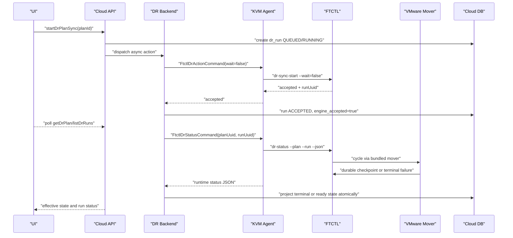

# Cross Hypervisor DR VMware Mover And Projection Convergence Design

Date: 2026-07-07

## 1. Purpose

This document defines the next implementation pass for the VMware to
ABLESTACK DR sync failure observed with plan
`ba4f53f8-eb17-41cd-bbe6-7e746772f209` and run
`459cd2fa-59e4-4a59-9a4d-e1be62413390`.

The previous disk-map fix worked: FTCTL preserved `targetType=rbd`, generated
`/dev/rbd/rbd/Rokcy10-1-dr-disk-0`, and created the 100 GiB RBD image. The
remaining failure is no longer target disk mapping. The current failure is:

```text
state=ERROR
step=scheduler-failed
worker_state=FAILED
worker_exit_code=65
error_code=DR_VMWARE_MOVER_UNAVAILABLE
target_storage_present=true
target_vm_present=false
target_network_present=false
```

Cloud DB/API still showed:

```text
dr_plan.state=SYNCING
dr_run.state=ACCEPTED
dr_run.projection_state=accepted
dr_replica.state=SKELETON_READY
dr_replica_disk.state=SKELETON_READY
```

So the implementation must fix two structural gaps together:

1. Provide a production VMware data mover path. VMware DR must not depend on
   `FTCTL_DR_VMWARE_MOVER` being manually injected by the operator.
2. Make FTCTL terminal runtime status converge into Cloud DB/API/UI state even
   when the original action answer was only `accepted`.

## 2. Non-goals

- Do not reuse V2K as the DR data mover. V2K remains a migration tool.
- Do not mark a plan READY only because target storage exists. READY requires
  target VM reference, target volume/reference, durable checkpoint, restore
  point, and runtime status agreement.
- Do not run long VMware copy work synchronously in UI/API threads.
- Do not store VMware or Mold secret values in UI response, logs, run step
  details, or FTCTL profile dumps.

## 3. Current Evidence

| Layer | Observed value |
| --- | --- |
| FTCTL status | `ERROR`, `scheduler-failed`, `DR_VMWARE_MOVER_UNAVAILABLE` |
| FTCTL target disk | `rbd/Rokcy10-1-dr-disk-0`, 100 GiB, created at 2026-07-07 16:08:56 |
| FTCTL capability | `nbdkit-vddk-plugin` exists, `govc` and `vmware-vdiskmanager` missing |
| Host config | no `FTCTL_DR_VMWARE_MOVER` configured |
| Cloud plan | `SYNCING` |
| Cloud run | `ACCEPTED`, `projection_state=accepted`, `last_status_json` is the original action accept payload |
| Cloud replica | `SKELETON_READY`, no target VM id |
| Cloud VM/volume | no target VM row and no target volume row for `Rokcy10-1-dr` |

The live host command proves the runtime source of truth is already terminal:

```bash
/usr/local/bin/ablestack_vm_ftctl dr-status \
  --plan ba4f53f8-eb17-41cd-bbe6-7e746772f209 \
  --run 459cd2fa-59e4-4a59-9a4d-e1be62413390 \
  --json
```

The status command returns terminal error fields, so Cloud must import them.

## 4. Layered Target Flow



## 5. UI Design

### 5.1 Files

- `ui/src/views/infra/dr/DrPlanList.vue`
- `ui/src/views/infra/dr/DrPlanOverview.vue`
- `ui/src/components/dr/DrRunProgress.vue`
- `ui/src/components/dr/DrStatusPill.vue`
- `ui/src/api/dr.js`
- `ui/public/locales/en.json`
- `ui/public/locales/ko_KR.json`

### 5.2 Behavior

The UI must render runtime-effective state from API responses, not only raw
plan state.

Required display rules:

| API/runtime condition | UI state |
| --- | --- |
| latest run `ACCEPTED/RUNNING` and no terminal runtime | Syncing |
| latest run `FAILED` or plan `ERROR` | Failed |
| runtime `error_code=DR_VMWARE_MOVER_UNAVAILABLE` | VMware data mover is not configured |
| target storage exists but target VM missing | Target storage prepared; target VM not materialized |
| target VM/volume/restore point all present | Ready |

`DrRunProgress` should show a runtime failure panel when the latest run has:

```js
run.state === 'FAILED' ||
run.projectionstate === 'failed' ||
plan.effectivestate === 'ERROR'
```

and should prefer the error in this order:

1. `run.errorcode`
2. `plan.lasterrorcode`
3. `run.steps[].errorcode`
4. `runtime.error_code` parsed from `laststatusjson`

### 5.3 Preflight In The Dialog

For VMware source directions, the guided plan dialog must show a preflight
warning before sync can start:

- VMware mover available
- VDDK plugin available
- Target worker can reach vCenter
- Target worker can write selected target storage

The warning is sourced from API capability fields, not hard-coded UI checks.

## 6. API Design

### 6.1 Files

- `CreateDrPlanCmd.java`
- `UpdateDrPlanCmd.java`
- `PreviewDrPlanSpecCmd.java`
- `CheckDrSiteCmd.java`
- `DiscoverDrSiteInventoryCmd.java`
- `GetDrPlanCmd.java`
- `ListDrRunsCmd.java`
- `ListDrRunStepsCmd.java`
- `DrPlanResponse.java`
- `DrRunResponse.java`
- `DrSiteInventoryResponse.java`
- `DrPlanSpecPreviewResponse.java`

### 6.2 Capability Response Contract

`CheckDrSite` and inventory APIs should expose the data-plane capability for
the worker host that will run VMware sync:

```json
{
  "capabilities": {
    "vmwareMoverAvailable": true,
    "vmwareMoverPath": "/usr/local/lib/ablestack-qemu-exec-tools/ftctl/dr_vmware_mover.sh",
    "nbdkitAvailable": true,
    "nbdkitVddkAvailable": true,
    "qemuImgAvailable": true,
    "qemuNbdAvailable": true,
    "vddkLibdir": "/usr/lib64/vmware-vix-disklib",
    "govcAvailable": false,
    "vmwareVdiskmanagerAvailable": false
  }
}
```

For VMware to ABLESTACK plan preview, API must fail readiness when the selected
coordinator/target worker cannot satisfy `vmwareMoverAvailable=true`.

Suggested error:

```text
DR_VMWARE_MOVER_UNAVAILABLE
```

### 6.3 Read API Projection Rule

Read APIs remain short and bounded. They may trigger best-effort projection,
but must not wait for data copy. They must return DB state after applying the
latest bounded projection result:

```java
DrPlanVO plan = drProjectionService.refreshPlanProjection(id, true);
```

`listDrRuns` must reload runs after refresh. It must not render stale `DrRunVO`
objects captured before projection:

```java
drProjectionService.refreshPlanProjection(planId, true);
List<DrRunVO> runs = drRunService.listRuns(planId);
```

If projection fails due status timeout, API returns previous DB state plus
projection stale warning. If projection imports a terminal runtime error, API
returns terminal DB state.

## 7. Backend Design

### 7.1 Files

- `DrPlanServiceImpl.java`
- `DrPlanReadinessValidator.java`
- `DrPlanTargetPlacementResolverImpl.java`
- `DrProjectionServiceImpl.java`
- `FtctlDrRuntimeProjectionAdapter.java`
- `FtctlDrUnifiedActionAdapter.java`
- `DrResponseGenerator.java`
- `DrRunServiceImpl.java` if run reads are cached or preloaded

### 7.2 Projection Must Be Monotonic

`FtctlDrRuntimeProjectionAdapter.refreshPlanProjection()` already has terminal
handling helpers. The implementation must make them monotonic and impossible to
overwrite with older accept payloads.

Add a normalized runtime status object:

```java
final class FtctlRuntimeStatus {
    String command;
    String result;
    String state;
    String step;
    String errorCode;
    String errorMessage;
    String workerState;
    Integer workerExitCode;
    Date updatedAt;
    boolean targetVmPresent;
    boolean targetStoragePresent;
    boolean targetNetworkPresent;
    boolean restorePointPresent;
    String rawJson;
}
```

Projection order:

1. Parse `status.getStatusJson()`.
2. If runtime `updated_at` is older than `dr_run.last_status_json.updated_at`
   and the stored status is terminal, do not downgrade it.
3. If runtime is terminal, update run/plan/replica/disk first.
4. If runtime is non-terminal, update `last_status_json`, projection timestamp,
   and current step, but do not overwrite existing terminal failure.
5. If runtime is READY, verify target VM, volume, network, restore point, and
   durable checkpoint before completing the run.

Terminal predicate:

```java
boolean terminalFailure =
    equalsAny(runtime.state, "ERROR", "FAILED")
    || equals(runtime.workerState, "FAILED")
    || isNonRetryableError(runtime.errorCode)
    || status.getResult() == false && !isProjectionStale(runtime);
```

Terminal update:

```java
run.setState(DrConstants.RUN_STATE_FAILED);
run.setProjectionState("failed");
run.setProjectionChecked(now);
run.setCompleted(now);
run.setCurrentStepName("runtime-projection");
run.setLastStatusJson(runtime.rawJson);
run.setErrorCode(runtime.errorCode);
run.setErrorMessage(runtime.errorMessage);

plan.setState(DrConstants.PLAN_STATE_ERROR);
plan.setLastErrorCode(runtime.errorCode);
plan.setLastErrorMessage(runtime.errorMessage);

replica.setState(DrConstants.REPLICA_STATE_ERROR);
replica.setRuntimeStateJson(runtime.rawJson);

disk.setState(DrConstants.REPLICA_STATE_ERROR);
disk.setDetailsJson(enrichDiskDetails(runtime));
```

### 7.3 Materialization Must Be Cloud-owned

The live run created an RBD image without Cloud VM/volume rows. That is not a
PASS state. ABLESTACK target materialization must become a Cloud-owned step.

Add a backend service:

```java
public interface DrTargetMaterializationService {
    DrTargetMaterializationResult ensureTargetSkeleton(DrPlanVO plan, DrReplicaVO replica);
    DrTargetMaterializationResult importOrBindTargetDisks(DrPlanVO plan, DrReplicaVO replica,
            FtctlRuntimeStatus runtime);
    DrTargetMaterializationResult verifyTargetReady(DrPlanVO plan, DrReplicaVO replica,
            FtctlRuntimeStatus runtime);
}
```

Responsibilities:

- target VM record/reference is created or imported under Cloud control;
- target volume rows are created or bound to the storage paths FTCTL writes;
- `dr_replica.target_vm_id` is set only after the Cloud VM reference exists;
- `dr_replica_disk.target_volume_id` is set only after the Cloud volume exists;
- READY is impossible while either target reference is null.

Short-term implementation can bind/import the FTCTL-created RBD image after
the first durable checkpoint. Long-term implementation should pre-create
Cloud-owned target volumes before mover writes into them.

### 7.4 Readiness

`DrPlanReadinessValidator` should add a VMware mover gate:

```java
if (direction.startsWith("VMWARE_") && !capabilities.isVmwareMoverAvailable()) {
    readiness.block("DR_VMWARE_MOVER_UNAVAILABLE",
        "The selected worker does not have a configured VMware data mover.");
}
```

`CreateDrPlan` may still create a plan without startSync. If `startSync=true`,
the same readiness block must reject execution before FTCTL creates target
storage.

## 8. Agent Design

### 8.1 Files

- `core/src/main/java/com/cloud/agent/api/FtctlDrStatusAnswer.java`
- `core/src/main/java/com/cloud/agent/api/FtctlDrPreflightAnswer.java`
- `plugins/hypervisors/kvm/.../LibvirtFtctlDrStatusCommandWrapper.java`
- `plugins/hypervisors/kvm/.../LibvirtFtctlDrActionCommandWrapper.java`
- `plugins/hypervisors/kvm/.../LibvirtFtctlWrapperHelper.java`
- `plugins/hypervisors/kvm/.../LibvirtFtctlDrCommandHelper.java`

### 8.2 Robust JSON Parsing

`LibvirtFtctlWrapperHelper.parseJsonObject(output)` currently parses the whole
output as one JSON object. Status wrappers should use a DR-specific helper that
selects the final valid JSON object from stdout/stderr combined output.

```java
public static JsonObject parseLastJsonObject(String output) {
    for (String line : reverseLines(output)) {
        JsonObject obj = tryParseJsonObject(line);
        if (obj != null) {
            return obj;
        }
    }
    return tryParseJsonObject(output);
}
```

For `LibvirtFtctlDrStatusCommandWrapper`, prefer an object where:

```java
"dr-status".equals(payload.get("command").getAsString())
```

If the selected payload has `state=ERROR`, the Answer transport can still be
`success=true` when the CLI exit code is zero, but runtime fields must expose
the failure. Backend projection must then decide terminal state from payload.

### 8.3 Preflight Command Extension

`FtctlDrPreflightAnswer` should include mover capability fields:

```java
private Boolean vmwareMoverAvailable;
private String vmwareMoverPath;
private Boolean nbdkitVddkAvailable;
private Boolean qemuImgAvailable;
private String vddkLibdir;
```

## 9. FTCTL Design

### 9.1 Files

- `bin/ablestack_vm_ftctl.sh`
- `lib/ftctl/dr_vmware.sh`
- `lib/ftctl/dr_scheduler.sh`
- `lib/ftctl/dr_runtime.sh`
- `lib/ftctl/dr_ablestack.sh`
- new `lib/ftctl/dr_vmware_mover.sh`
- `bin/ablestack_vm_ftctl_selftest.sh`

### 9.2 Bundled VMware Mover

Add a bundled mover script and make it the default when executable:

```bash
FTCTL_DR_VMWARE_MOVER="${FTCTL_DR_VMWARE_MOVER:-${ROOT_DIR}/lib/ftctl/dr_vmware_mover.sh}"
```

If the script is missing or not executable, fail preflight before target
storage preparation:

```text
DR_VMWARE_MOVER_UNAVAILABLE
```

### 9.3 Mover Interface

The mover receives only environment variables. No secrets are printed.

```bash
FTCTL_DR_PLAN_UUID
FTCTL_DR_RUN_UUID
FTCTL_DR_CHECKPOINT_SEQUENCE
FTCTL_DR_CYCLE_TYPE
FTCTL_DR_DISK_MAP
FTCTL_DR_CAPABILITY
FTCTL_DR_MANIFEST
FTCTL_DR_CHECKPOINT
FTCTL_DR_CREDENTIALS_FILE
```

### 9.4 VDDK Copy Path

For each VMware disk in `FTCTL_DR_DISK_MAP`:

1. Create a private runtime directory:

   ```bash
   /run/ablestack-vm-ftctl/dr-runtime/plans/<plan>/mover/<run>/<disk>
   ```

2. Start nbdkit VDDK over a Unix socket:

   ```bash
   nbdkit -U "${sock}" --exit-with-parent vddk \
     server="${vcenter}" \
     user="${username}" \
     password=+file:"${password_file}" \
     vm="moref=${source_vm_ref}" \
     file="${source_vmdk_path}" \
     libdir="${vddk_libdir}"
   ```

3. Convert to target storage:

   ```bash
   qemu-img convert -p -n -f raw \
     "nbd+unix:///?socket=${sock}" \
     -O raw "${target_path}"
   ```

4. If `target_path` is not mapped, map it first:

   ```bash
   rbd map "${pool}/${image}"
   ```

5. Verify size:

   ```bash
   blockdev --getsize64 "${target_path}"
   ```

6. Write checkpoint only after every disk succeeds.

The mover returns explicit exit codes:

| Exit | Error code |
| --- | --- |
| 65 | `DR_VMWARE_MOVER_UNAVAILABLE` for missing mover prerequisites or required tools |
| 68 | `DR_VMWARE_MOVER_FAILED` for `qemu-img convert` data copy failure |
| 69 | `DR_VMWARE_NBDKIT_FAILED` when the VDDK `nbdkit` session cannot start |

### 9.5 Capability JSON

`ftctl_dr_vmware_write_capability()` should include:

```json
{
  "moverReady": true,
  "moverPath": "/usr/local/lib/ablestack-qemu-exec-tools/ftctl/dr_vmware_mover.sh",
  "nbdkit": true,
  "nbdkitVddk": true,
  "qemuImg": true,
  "vddkReady": true,
  "vddkLibdir": "/usr/lib64/vmware-vix-disklib"
}
```

Do not report `vddkReady=true` only because the nbdkit plugin exists. The
production condition is `vddkReady && moverReady && qemuImg`.

### 9.6 Runtime Ordering

The scheduler must validate mover availability before target storage creation:

```text
validate profile
validate VMware mover
write VMware source contract
prepare ABLESTACK target storage
run mover cycle
write durable checkpoint
emit TARGET_READY
```

If mover preflight fails, no RBD image should be created.

## 10. DB Design

No mandatory schema change is required for the immediate fix. Existing columns
must be used consistently:

| Table | Required behavior |
| --- | --- |
| `dr_plan` | terminal runtime error sets `state=ERROR`, `last_error_code`, `last_error_message`, `updated` |
| `dr_run` | terminal runtime error sets `state=FAILED`, `projection_state=failed`, `projection_checked`, `completed`, `last_status_json`, `error_code`, `error_message` |
| `dr_run_step` | upsert `runtime-projection` step with terminal payload |
| `dr_replica` | set `state=ERROR`, `runtime_state_json` on terminal failure |
| `dr_replica_disk` | set `state=ERROR`, store runtime/disk diagnostic details |
| `dr_restore_point` | create only after durable target checkpoint |
| `dr_event` | record runtime projection failure and mover diagnostics |

Optional future columns:

```sql
ALTER TABLE dr_run
  ADD COLUMN runtime_updated datetime DEFAULT NULL,
  ADD COLUMN runtime_state varchar(64) DEFAULT NULL,
  ADD COLUMN runtime_error_code varchar(128) DEFAULT NULL;
```

These are not required if `last_status_json` and `projection_checked` are used
reliably.

## 11. Test Plan

### 11.1 Unit Tests

| Component | Test |
| --- | --- |
| Agent wrapper | multi-line output parser selects final `dr-status` JSON |
| Backend projection | `state=ERROR`, `worker_state=FAILED`, `DR_VMWARE_MOVER_UNAVAILABLE` fails run/plan/replica/disk |
| Backend monotonicity | older accepted payload cannot overwrite terminal failure |
| API | `getDrPlan` and `listDrRuns` return failed state after status projection |
| Readiness | VMware source sync blocks when mover unavailable |

### 11.2 FTCTL Selftests

| Test | Expected |
| --- | --- |
| no mover configured | fails before target RBD creation with `DR_VMWARE_MOVER_UNAVAILABLE` |
| bundled mover missing tool | fails with `DR_VMWARE_MOVER_TOOL_MISSING` |
| mock VDDK cycle | writes durable checkpoint and restore point |
| RBD target copy mock | verifies canonical `/dev/rbd/<pool>/<image>` path |

### 11.3 Live PASS Criteria

A VMware to ABLESTACK sync is PASS only when all are true:

1. Latest run is `SUCCEEDED`.
2. Plan state is `READY`.
3. `dr_replica.target_vm_id` is not null for ABLESTACK target.
4. Every `dr_replica_disk.target_volume_id` is not null.
5. A target ready restore point exists.
6. FTCTL `dr-status` is `READY` or `TARGET_READY`.
7. UI enables failover/test failover only after the above conditions.

FAIL must be shown when:

- FTCTL status is `ERROR`;
- latest run remains `ACCEPTED` after terminal runtime failure;
- target storage exists but target VM/volume rows do not;
- VMware mover is unavailable for a VMware source direction.

## 12. AS-IS / TO-BE Summary

| Area | AS-IS | TO-BE |
| --- | --- | --- |
| VMware data mover | External `FTCTL_DR_VMWARE_MOVER` required but not deployed/configured | Bundled FTCTL mover with preflight capability and explicit tool checks |
| Runtime ordering | Target RBD can be created before mover availability is checked | Mover preflight runs before target storage allocation |
| Cloud projection | DB can remain `SYNCING/ACCEPTED` after FTCTL terminal error | Terminal `dr-status` atomically updates plan/run/replica/disk |
| Agent parsing | Whole stdout parsed as one JSON object | Status wrapper selects final valid `dr-status` JSON |
| Target materialization | RBD image can exist without Cloud VM/volume rows | Cloud-owned target VM/volume references are required before READY |
| UI state | Raw plan state can hide runtime terminal failure | Effective runtime state and latest run error are rendered |
| DB readiness | Skeleton replica may look ready enough for the next step | READY requires VM, volume, network, restore point, durable checkpoint |

## 13. 2026-07-07 Follow-up: VDDK Libdir Resolution

The follow-up test with plan
`8037c34e-5a50-4f4c-bc4e-16dfd54f00d1` proved that the bundled mover path and
RBD target mapping were no longer the primary blocker. FTCTL reached the
VMware mover, but nbdkit failed because it loaded the default
`/usr/lib64/vmware-vix-disklib` path instead of the ABLESTACK-bundled VDDK
asset:

```text
error_code=DR_VMWARE_NBDKIT_FAILED
worker_exit_code=69
driver_state=TARGET_PREPARED
nbdkit: error: /usr/lib64/vmware-vix-disklib/lib64/libvixDiskLib.so.9:
  cannot open shared object file
```

The runtime evidence shows:

- target disk mapping is correct: `/dev/rbd/rbd/Rokcy10-1-dr-disk-0`;
- target RBD image exists and has the expected size;
- `dr_vmware_mover.sh` already accepts `credentials.source.vddkLibdir`;
- Cloud/Agent did not populate that field;
- FTCTL did not auto-discover `/usr/share/ablestack/v2k/compat/*/vddk`.

Therefore the mover/projection convergence design is extended by
[543-cross-hypervisor-dr-vddk-libdir-resolution-and-preflight-design-20260707.md](543-cross-hypervisor-dr-vddk-libdir-resolution-and-preflight-design-20260707.md).

Implementation rules added by that document:

- VMware source readiness must include a data-plane gate before sync dispatch.
- `DrResolvedSiteCredential` runtime JSON or the FTCTL profile must carry an
  effective `credentials.source.vddkLibdir` when Cloud/Agent can resolve it.
- `LibvirtComputingResource` must detect ABLESTACK compat VDDK directories,
  not only `vmware-vix-disklib-distrib`.
- `LibvirtFtctlDrActionCommandWrapper` should enrich the profile with the
  agent's detected VDDK path when the backend profile lacks it.
- FTCTL must resolve and validate the actual VDDK libdir before starting
  nbdkit, and must not treat `nbdkit vddk --help` as proof that the library is
  loadable.
- New runtime error codes must distinguish unresolved libdir, library load
  failure, and nbdkit socket/process failure.

Updated AS-IS / TO-BE for this follow-up:

| Area | AS-IS | TO-BE |
| --- | --- | --- |
| VDDK source | nbdkit falls back to `/usr/lib64/vmware-vix-disklib` when profile has no libdir | Cloud/Agent/FTCTL resolve `/usr/share/ablestack/v2k/compat/*/vddk` deterministically |
| Readiness | sync can begin and create target storage before VDDK loadability is known | VMware source data-plane preflight blocks before target preparation |
| Error code | missing library collapses into `DR_VMWARE_NBDKIT_FAILED` | `DR_VDDK_LIBDIR_UNRESOLVED`, `DR_VDDK_LIBRARY_LOAD_FAILED`, `DR_VMWARE_NBDKIT_FAILED` are separate |
| UI evidence | plan may look normal until runtime failure | DR Plan/Site diagnostics show VMware data-plane readiness and detected VDDK path |

## 14. 2026-07-07 Follow-up: VMware Mover NBD Source Graph

The follow-up test with plan `987bb250-3b5a-4053-9720-2ff93b4cc88c` proved that
the VDDK libdir and nbdkit plugin path were no longer the primary blocker.
`nbdkit --dump-plugin vddk libdir=/usr/share/ablestack/v2k/compat/vsphere80/vddk`
loaded VDDK 8 successfully, and the runtime reached the actual `qemu-img`
conversion step.

The terminal failure was:

```text
qemu-img: Could not open 'json:{"driver":"nbd","server":{"type":"unix","path":"/tmp/.../vddk.sock"}}':
  A block device must be specified for "file"
ERROR: qemu-img conversion failed for disk0
```

Therefore the mover/projection convergence design is extended by
[544-cross-hypervisor-dr-vmware-mover-nbd-source-graph-design-20260707.md](544-cross-hypervisor-dr-vmware-mover-nbd-source-graph-design-20260707.md).

Implementation rules added by that document:

- `dr_vmware_mover.sh` must build a raw-over-NBD source graph for `qemu-img`.
- The mover must remove the direct `json:{"driver":"nbd"...}` plus `-f raw`
  convert path.
- The mover should run bounded `qemu-img info --image-opts` before convert.
- Exit 72 maps to `DR_VMWARE_MOVER_SOURCE_GRAPH_INVALID`.
- Backend projection treats that code as terminal and persists it to
  `dr_plan`, `dr_run`, `dr_run_step`, and `dr_event` through existing fields.
- UI/API add only error-code display and response mapping; no synchronous UI/API
  execution is introduced.

Updated AS-IS / TO-BE for this follow-up:

| Area | AS-IS | TO-BE |
| --- | --- | --- |
| qemu-img source | direct NBD JSON is passed while forcing `-f raw` | explicit raw-over-NBD graph through `--image-opts` |
| Mover validation | invalid graph is discovered during convert | bounded source graph probe fails fast with a specific code |
| Error projection | graph failure appears as generic mover failure | `DR_VMWARE_MOVER_SOURCE_GRAPH_INVALID` is terminal and visible in API/UI |
| Layer impact | issue can look like Cloud/DB readiness failure | issue is isolated to ftctl mover source graph while DB/API stay consistent |

## 15. 2026-07-08 Follow-up: VMware VDDK Connect Contract

The follow-up test with plan `71182935-11c6-4ed3-aeec-ebde1486bdfa` confirmed
that the raw-over-NBD graph is no longer the only boundary. The runtime reached
VDDK connection and failed with:

```text
VixDiskLib_ConnectEx: One of the parameters was invalid
```

Therefore this convergence design is extended by
[545-cross-hypervisor-dr-vmware-vddk-connect-contract-design-20260708.md](545-cross-hypervisor-dr-vmware-vddk-connect-contract-design-20260708.md).

Implementation rules added by that document:

- Cloud guided mapping must generate a canonical `mapping.source` object for
  VMware source plans.
- Readiness must validate VMware source endpoint, credential, VM MoRef, and
  disk source paths before agent dispatch or target storage preparation.
- FTCTL must validate the VDDK connect contract before conversion.
- Exit 73 maps to `DR_VMWARE_VDDK_CONNECT_INVALID`.
- Exit 74 maps to `DR_VMWARE_VDDK_EXPORT_UNAVAILABLE`.
- Exit 72 remains reserved for `DR_VMWARE_MOVER_SOURCE_GRAPH_INVALID`.

Updated AS-IS / TO-BE for this follow-up:

| Area | AS-IS | TO-BE |
| --- | --- | --- |
| Source mapping | top-level `sourceExternalRef` can be the only source identity | canonical `mapping.source` carries VMware source identity |
| Readiness | sync can prepare target storage before source connect contract is proven | source connect contract blocks before dispatch/target prep |
| Error projection | VDDK `ConnectEx` can look like source graph failure | `DR_VMWARE_VDDK_CONNECT_INVALID` is terminal and visible in API/UI |
| Target residue | partial RBD target may be left after source connect failure | failed run marks cleanup-required status before retry |

## 16. 2026-07-08 Live Preflight Update: Snapshot-Aware Source Open

Manual validation on target worker `10.10.32.1` proved that a powered-on VMware
source disk cannot be opened reliably with only VM MoRef and VMDK path. The
successful source-open contract is:

- create a temporary run snapshot with `memory=false`;
- resolve the snapshot MoRef;
- pass `vm=moref=<source-vm-moref>`;
- pass `snapshot=<snapshot-moref>`;
- pass the base VMDK path read from vCenter inventory;
- include `thumbprint` and `transports=nbd:nbdssl`;
- run bounded `qemu-img info --image-opts` before conversion.

Observed evidence:

| Probe | Result |
| --- | --- |
| no snapshot | VDDK/NFC reports `DiskLib error 16392: Failed to lock the file` |
| run snapshot + base VMDK path | `qemu-img info` succeeds with 100 GiB raw source |
| run snapshot + current delta path | VDDK reports access-rights failure |

Implementation impact:

- FTCTL must add `source-snapshot-create` before target preparation.
- FTCTL must add `source-open-preflight` before target disk conversion.
- `dr_vmware_mover.sh` must pass `snapshot=<snapshot-moref>`.
- Cloud readiness should not require an operator-entered snapshot ref; snapshot
  lifecycle is owned by the async FTCTL worker.
- Projection must distinguish `DR_VMWARE_VDDK_SOURCE_LOCKED` and
  `DR_VMWARE_VDDK_OPEN_DENIED` from generic graph/export failures.

## 17. 2026-07-08 Live CBT/RPO Update

The same source VM was validated for CBT-driven RPO cycles:

- `config.changeTrackingEnabled=true`.
- Baseline snapshot `S1` produced a durable per-disk changeId.
- `S1` was removed.
- Incremental snapshot `S2` successfully queried changed areas using the `S1`
  changeId.
- The query returned 2 changed areas and 131072 bytes.
- `S2` was removed and the snapshot tree returned to `null`.

Implementation impact:

- Base sync must persist per-disk CBT `new_change_id` after the target restore
  point is durable.
- Base sync must first check `config.changeTrackingEnabled` and selected disk
  `ctkEnabled` state; if disabled and policy allows it, FTCTL enables CBT before
  creating the baseline snapshot.
- Each RPO sync creates a short-lived snapshot, queries changed areas from the
  previous durable changeId, patches only those extents, persists the new
  changeId, and removes the snapshot.
- Snapshot cleanup is part of the checkpoint contract, not an optional
  maintenance task.
- Cloud projection must surface changed bytes/areas and cleanup-required state
  in run/replica disk details.
- Projection must also surface whether CBT was already enabled or enabled by
  FTCTL during the run.

## 2026-07-08 Update: Mover Progress Can Be Healthy Before Target VM Exists

The VMware mover path can now pass VDDK source-open and enter real data copy
through `nbdkit vddk` and `qemu-img convert`. In that phase the ABLESTACK target
RBD may exist and grow while Cloud has not created or linked a target VM row.

Projection convergence must therefore distinguish:

- healthy mover progress: `SYNCING/full-seed-transfer`, empty runtime error,
  target storage present, target VM absent;
- terminal mover failure: runtime `ERROR`/`FAILED`, worker failure, or non-empty
  runtime `error_code`;
- post-durable materialization failure: durable restore point exists, but target
  VM/reference cannot be materialized within the backend grace window.

Detailed pending projection contract:
`546-cross-hypervisor-dr-initial-sync-pending-projection-contract-design-20260708.md`.

## 2026-07-14 Correction: CBT Design Was Not Yet The Deployed Data Path

The S1/S2 live experiment in this document remains valid: VMware accepted the
S1 changeId after S1 removal and returned two changed areas totaling 131072
bytes for S2. However, the currently deployed FTCTL mover does not use that
query in its replication cycle. It still executes a complete `qemu-img
convert` for every VMware disk.

Therefore the earlier implementation-impact bullets are design requirements,
not proof that true incremental replication is deployed. The normative cycle
commit, typed changeId baseline, transfer metrics, and no-silent-fallback
contract is defined in
`555-cross-hypervisor-dr-vmware-cbt-incremental-and-transfer-metrics-design-20260714.md`.
