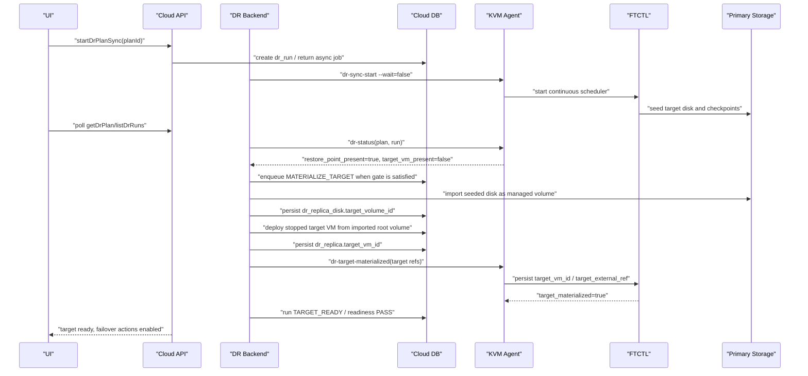

# Cross Hypervisor DR Target VM Materialization Contract Design

> Normative ownership correction (2026-08-03):
> [590-cross-hypervisor-dr-plan-async-mutation-and-target-resource-ownership-design-20260803.md](590-cross-hypervisor-dr-plan-async-mutation-and-target-resource-ownership-design-20260803.md)
> supersedes any name/path-only VM or volume reuse and any unverified
> `POWERED_OFF` projection in this document. Materialization now requires DB
> resource claims, Agent live observation, and FTCTL manifest v2 convergence.

Date: 2026-07-09

## Implementation Update - 2026-07-09

The first implementation pass keeps the preflight-verified data mover path
unchanged and adds the missing target materialization bridge between Cloud and
FTCTL.

Implemented Cloud files:

```text
plugins/integrations/disaster-recovery/src/main/java/com/cloud/dr/DrTargetMaterializationService.java
plugins/integrations/disaster-recovery/src/main/java/com/cloud/dr/DrTargetMaterializationServiceImpl.java
plugins/integrations/disaster-recovery/src/main/java/com/cloud/dr/DrReplicaDeployVMVolumeCmd.java
plugins/integrations/disaster-recovery/src/main/java/com/cloud/dr/adapter/ftctl/FtctlDrRuntimeProjectionAdapter.java
plugins/integrations/disaster-recovery/src/main/resources/META-INF/cloudstack/disaster-recovery/spring-disaster-recovery-context.xml
plugins/hypervisors/kvm/src/main/java/com/cloud/hypervisor/kvm/resource/wrapper/LibvirtFtctlDrActionCommandWrapper.java
core/src/main/java/com/cloud/agent/api/FtctlDrActionCommand.java
```

Implemented FTCTL files:

```text
bin/ablestack_vm_ftctl.sh
lib/ftctl/dr_runtime.sh
lib/ftctl/libvirt_wrap.sh
```

Runtime flow now implemented:

1. `FtctlDrRuntimeProjectionAdapter` detects a durable target checkpoint with
   no target VM reference.
2. It records the pending projection state and enqueues
   `DrTargetMaterializationService.enqueueMaterialization()` outside the API
   request thread.
3. `DrTargetMaterializationServiceImpl` resolves the guided target placement,
   imports or adopts seeded target disks as Cloud volumes, deploys a stopped KVM
   target VM from the imported root volume, attaches data disks, updates
   `dr_replica`, `dr_replica_disk`, and `dr_plan.mapping_json`, then records
   `target-materialization` run steps.
4. Cloud sends `FtctlDrActionCommand.Action.TARGET_MATERIALIZED` to the target
   KVM agent.
5. `LibvirtFtctlDrActionCommandWrapper` maps Cloud context fields to
   `ablestack_vm_ftctl dr-target-materialized` arguments.
6. `ftctl_dr_runtime_target_materialized()` writes `target_vm_id`,
   `target_external_ref`, `target_volume_map_json`,
   `target_materialized=true`, `target_vm_present=true`,
   `target_network_present=true`, and `step=target-ready` into the FTCTL runtime
   state.
7. The Cloud run moves from `target-materializing` to `SUCCEEDED`; the DR plan
   moves to `READY` only after Cloud DB and FTCTL runtime references agree.

The FTCTL `dr-target-materialized` command is explicitly lock-free in
`libvirt_wrap.sh` because it is a Cloud-to-runtime projection handshake, not a
long-running data mover operation. This prevents the reference sync from being
blocked by a scheduler or pause lock after the durable checkpoint already
exists.

Build verification:

- Cloud changed-module Maven build from WSL ext4 clone:
  `mvn -pl plugins/integrations/disaster-recovery -am -DskipTests install`
- FTCTL shell syntax:
  `bash -n bin/ablestack_vm_ftctl.sh`,
  `bash -n lib/ftctl/dr_runtime.sh`,
  `bash -n lib/ftctl/libvirt_wrap.sh`

## 1. Purpose

This document defines the structural fix for the VMware to ABLESTACK DR plan
that reached durable restore points but remained at `40%` with no target VM.

Observed plan:

| Item | Value |
| --- | --- |
| Plan UUID | `dd895181-7fff-43cc-bae6-24a5ab529db8` |
| Run UUID | `bd0972d7-b7a9-4f00-bc6c-e2994eb6a248` |
| Direction | `VMWARE_TO_KVM` |
| Plan RPO/RTO | `300` / `300` seconds |
| Cloud plan state | `SYNCING` |
| Cloud run state | `ACCEPTED` |
| Cloud projection state | `target-materializing` |
| Run step | `runtime-projection`, `RUNNING`, `40%` |
| FTCTL state | `SYNCING` |
| FTCTL step | `incremental-transfer` |
| FTCTL driver state | `CHECKPOINT_READY` |
| Restore points | `60`, latest `READY` |
| Last durable checkpoint | `2026-07-09T12:39:15+09:00` during diagnosis |
| Target storage | present |
| Target VM | not present |
| Target network | not present |
| `dr_replica.target_vm_id` | `NULL` |
| `dr_replica_disk.target_volume_id` | `NULL` |

The data plane has moved past source preflight, VDDK open, CBT validation,
snapshot creation, initial seed, and restore point generation. The remaining
gap is the control-plane materialization step that must turn the seeded target
disk artifacts into Cloud-managed volumes and a stopped target VM.

## 2. Root Cause

The current implementation separates two useful pieces, but does not bridge
them:

1. `FTCTL_DR` creates target storage/checkpoints and reports
   `target_storage_present=true` plus `restore_point_present=true`.
2. Cloud creates only `dr_replica` and `dr_replica_disk` skeleton records during
   sync preparation.

No Cloud backend step imports the seeded target disk as a managed Cloud volume,
deploys the target VM from that volume, updates `dr_replica.target_vm_id`, and
then sends the target references back to FTCTL.

Relevant code evidence:

- `DrProtectionOrchestratorImpl.prepareSyncRun()` calls
  `materializeReplica()` and `materializeReplicaDisks()`, but those methods
  create `SKELETON_READY` DB rows only.
- `FtctlDrRuntimeProjectionAdapter.markSyncTargetPending()` correctly projects
  `target-materializing` when a durable checkpoint exists but no target VM
  reference exists.
- `DrPlanReadinessValidator` correctly refuses `TARGET_READY` when
  `targetVmPresent=false`.
- `dr_runtime.sh` derives `target_vm_present` from `target_vm_id` or
  `target_external_ref`, so Cloud must feed those values back after target VM
  creation.

## 3. Live Preflight Evidence

Non-destructive checks were run against the active `10.10.32.x` environment.

Target placement data is valid:

| Resource | Checked value | Result |
| --- | --- | --- |
| Zone | `data_center.id=1`, `Zone` | present |
| Target worker host | `host.id=1`, `ablecube32-1`, `Up`, `Enabled` | present |
| Service offering | `disk_offering.id=11`, `1C1GB-TO-16C64GB-FR` | present |
| Disk offering | `disk_offering.id=12`, `Custom` | present |
| Network | `networks.id=204`, `L2-Network`, `Setup` | present |
| Storage pool | `storage_pool.id=1`, `Primary`, `RBD`, `Up` | present |
| Target VM by name | `Rokcy10-1-dr` / `Rocky10-1-dr` | absent |
| Target volume by name | `Rokcy10-1-dr*` / `Rocky10-1-dr*` | absent |

Additional read-only recheck on 2026-07-09:

| Item | Current value | Meaning |
| --- | --- | --- |
| `dr_plan.state` | `SYNCING` | sync remains open |
| `dr_plan.last_source_checkpoint_at` | `2026-07-09 04:01:54` | source checkpoint exists |
| `dr_plan.last_target_durable_at` | `2026-07-09 04:01:54` | durable target checkpoint exists |
| `dr_replica.state` | `SKELETON_READY` | Cloud replica row exists only as a skeleton |
| `dr_replica.target_vm_id` | `NULL` | no Cloud-managed target VM reference |
| `dr_replica.target_external_ref` | `NULL` | no external target VM reference |
| `dr_replica_disk.state` | `SKELETON_READY` | Cloud replica disk row exists only as a skeleton |
| `dr_replica_disk.target_volume_id` | `NULL` | seeded disk is not imported/adopted as a Cloud volume |
| `dr_replica_disk.target_disk_ref` | `Rokcy10-1-dr-disk-0` | desired disk ref exists, but is not a managed volume |
| target VM count by `Rokcy10-1-dr` / `Rocky10-1-dr` | `0` | target VM materialization has not happened |

This confirms the current blocker is not an invalid UI selection. The target
resource references are usable, but the materialization worker has not been
implemented or triggered.

## 4. Target Architecture



## 5. State Contract

| Condition | AS-IS projection | TO-BE projection |
| --- | --- | --- |
| Full seed running, no restore point | `SYNCING`, progress `40` | `INITIAL_SEEDING`, progress `40`, no error |
| Durable restore point exists, no target VM | `target-materializing`, progress `40`, no action follows | enqueue `MATERIALIZE_TARGET`, show `TARGET_VM_CREATING` |
| Target volume import running | not represented | `target-volume-import`, progress `70` |
| Target VM deploy running | not represented | `target-vm-deploy`, progress `85` |
| Cloud target VM exists, ftctl not updated | not represented | `target-ref-sync`, progress `95` |
| Target VM, storage, network, restore point all present | unreachable | `TARGET_READY`, progress `100` |
| Materialization timeout/error | can stay `SYNCING` forever | `FAILED` or `DEGRADED` with specific error code |

## 6. UI Layer Design

Affected files:

```text
ui/src/views/infra/dr/DrPlanList.vue
ui/src/views/infra/dr/DrPlanOverview.vue
ui/src/components/dr/DrRunProgress.vue
ui/src/components/dr/DrStatusPill.vue
ui/src/components/dr/DrActionToolbar.vue
ui/src/utils/dr/resourceActions.js
ui/public/locales/en.json
ui/public/locales/ko_KR.json
```

UI must not display the current condition as generic transfer progress. It must
derive a materialization state from the API response.

Suggested normalization:

```js
const MATERIALIZATION_STEPS = new Set([
  'target-materializing',
  'target-volume-import',
  'target-vm-deploy',
  'target-ref-sync'
])

function materializationStateOf (plan) {
  const step = upper(plan?.currentstepname || plan?.currentStepName ||
    plan?.lastrun?.currentstepname || plan?.lastRun?.currentStepName)
  if (plan?.targetmaterialized === true || plan?.targetMaterialized === true) {
    return 'TARGET_READY'
  }
  if (MATERIALIZATION_STEPS.has(step)) {
    return step.toUpperCase().replace(/-/g, '_')
  }
  if (plan?.restorepointpresent === true && plan?.targetvmpresent === false) {
    return 'RESTORE_POINT_READY_TARGET_PENDING'
  }
  return null
}
```

Visible messages:

| State | Korean UI text |
| --- | --- |
| `INITIAL_SEEDING` | `초기 동기화 중` |
| `RESTORE_POINT_READY_TARGET_PENDING` | `복구지점 준비 완료, 대상 VM 생성 대기` |
| `TARGET_VOLUME_IMPORT` | `대상 볼륨 등록 중` |
| `TARGET_VM_DEPLOY` | `대상 가상머신 생성 중` |
| `TARGET_REF_SYNC` | `대상 참조 동기화 중` |
| `TARGET_READY` | `복구 준비 완료` |
| `TARGET_MATERIALIZATION_STALLED` | `대상 VM 생성 지연` |

Action gating:

- `Failover` and `Test failover` remain disabled until:
  - `targetMaterialized=true`
  - `targetVmPresent=true`
  - `targetStoragePresent=true`
  - `targetNetworkPresent=true`
  - `restorePointPresent=true`
  - latest runtime error is empty
- Add `Retry target materialization` only when the backend exposes
  `materializationRetryable=true`.
- The action must call API asynchronously and return a job/run id. UI must poll.

## 7. API Layer Design

Affected files:

```text
plugins/integrations/disaster-recovery/src/main/java/org/apache/cloudstack/api/response/dr/DrPlanResponse.java
plugins/integrations/disaster-recovery/src/main/java/org/apache/cloudstack/api/response/dr/DrRunResponse.java
plugins/integrations/disaster-recovery/src/main/java/org/apache/cloudstack/api/command/admin/dr/GetDrPlanCmd.java
plugins/integrations/disaster-recovery/src/main/java/org/apache/cloudstack/api/command/admin/dr/ListDrPlansCmd.java
plugins/integrations/disaster-recovery/src/main/java/org/apache/cloudstack/api/command/admin/dr/ListDrRunsCmd.java
plugins/integrations/disaster-recovery/src/main/java/org/apache/cloudstack/api/command/admin/dr/RetryDrTargetMaterializationCmd.java
plugins/integrations/disaster-recovery/src/main/java/com/cloud/dr/response/DrResponseGenerator.java
```

Response fields:

```java
@SerializedName("targetmaterializationstate")
private String targetMaterializationState;

@SerializedName("targetmaterializationmessage")
private String targetMaterializationMessage;

@SerializedName("materializationretryable")
private Boolean materializationRetryable;

@SerializedName("targetvolumeids")
private List<String> targetVolumeIds;

@SerializedName("targetvmid")
private String targetVmId;

@SerializedName("targetexternalref")
private String targetExternalRef;
```

Read API rule:

```java
public DrPlanResponse getDrPlanResponse(long planId) {
    projectionService.refreshPlanProjection(planId, ProjectionReason.API_READ);
    materializationService.enqueueIfEligible(planId, MaterializationTrigger.API_READ);
    return responseGenerator.createDrPlanResponse(planId);
}
```

The enqueue call must be bounded and non-blocking. It may create an async run
step/job, but it must not perform volume import or VM deployment in the API
request thread.

Optional retry command:

```java
@APICommand(name = "retryDrTargetMaterialization", ...)
public final class RetryDrTargetMaterializationCmd extends BaseAsyncCmd {
    @Parameter(name = ApiConstants.ID, type = CommandType.UUID, entityType = DrPlanResponse.class, required = true)
    private Long id;

    @Override
    public void execute() {
        DrRunVO run = drPlanService.retryTargetMaterialization(id, CallContext.current());
        setResponseObject(responseGenerator.createDrRunResponse(run));
    }
}
```

## 8. Backend Layer Design

### 8.1 New service boundary

Add a dedicated service instead of overloading projection:

```text
plugins/integrations/disaster-recovery/src/main/java/com/cloud/dr/materialize/DrTargetMaterializationService.java
plugins/integrations/disaster-recovery/src/main/java/com/cloud/dr/materialize/DrTargetMaterializationServiceImpl.java
plugins/integrations/disaster-recovery/src/main/java/com/cloud/dr/materialize/DrTargetMaterializationRequest.java
plugins/integrations/disaster-recovery/src/main/java/com/cloud/dr/materialize/DrTargetMaterializationResult.java
plugins/integrations/disaster-recovery/src/main/java/com/cloud/dr/materialize/DrVolumeImportRequest.java
plugins/integrations/disaster-recovery/src/main/java/com/cloud/dr/materialize/DrTargetVmProvisionRequest.java
```

Interface:

```java
public interface DrTargetMaterializationService {
    boolean isEligible(DrPlanVO plan, DrRunVO run, FtctlDrStatusAnswer status);

    Optional<DrRunStepVO> enqueueIfEligible(long planId, MaterializationTrigger trigger);

    DrTargetMaterializationResult materialize(long planId, long runId);

    DrTargetMaterializationResult retry(long planId, Account caller);
}
```

Eligibility:

```java
boolean isEligible(DrPlanVO plan, DrRunVO run, FtctlDrStatusAnswer status) {
    return plan != null
        && run != null
        && StringUtils.equals(plan.getDirection(), "VMWARE_TO_KVM")
        && StringUtils.equals(run.getRunType(), DrConstants.RUN_TYPE_SYNC)
        && run.getCompleted() == null
        && Boolean.TRUE.equals(status.getTargetStoragePresent())
        && Boolean.TRUE.equals(status.getRestorePointPresent())
        && !Boolean.TRUE.equals(status.getTargetVmPresent())
        && StringUtils.isNotBlank(status.getLastTargetDurableAt());
}
```

### 8.2 Idempotent materialization flow

Pseudo-code:

```java
public DrTargetMaterializationResult materialize(long planId, long runId) {
    return Transaction.execute(status -> {
        DrPlanVO plan = lockPlan(planId);
        DrRunVO run = lockRun(runId);
        DrReplicaVO replica = ensureReplica(plan);
        DrResolvedTargetPlacement placement = placementResolver.resolve(plan);
        List<DrReplicaDiskVO> disks = drReplicaDiskDao.listActiveByReplicaId(replica.getId());

        validatePlacement(placement);
        validateRestorePointReady(plan);

        recordStep(run, "target-volume-import", RUNNING, 70);
        List<VolumeVO> volumes = importTargetVolumes(plan, replica, disks, placement);

        recordStep(run, "target-vm-deploy", RUNNING, 85);
        UserVmVO targetVm = deployStoppedTargetVm(plan, replica, volumes, placement);

        recordStep(run, "target-ref-sync", RUNNING, 95);
        updateReplicaReferences(replica, targetVm, volumes);
        notifyFtctlTargetMaterialized(plan, run, replica, volumes, placement);

        recordStep(run, "target-ready", SUCCEEDED, 100);
        markPlanTargetReady(plan, run, replica);
        return DrTargetMaterializationResult.ready(targetVm.getUuid());
    });
}
```

Idempotency rules:

- If `dr_replica.target_vm_id` points to an existing non-removed VM, skip VM
  deploy and only re-sync FTCTL target refs.
- If a `dr_replica_disk.target_volume_id` points to an existing non-removed
  volume, skip import for that disk.
- If a Cloud volume already exists for `(pool_id, path)`, adopt that volume id
  into `dr_replica_disk.target_volume_id` instead of importing a duplicate.
- If a stopped target VM with the requested name already exists and its root
  volume matches the imported root volume, adopt it into `dr_replica`.
- All partial failures must leave enough DB evidence for retry.

### 8.3 Volume import path

Preferred implementation is an internal service wrapper around the existing
volume import path, not direct API self-calls and not ad-hoc DB writes.

Extend the existing import service with an internal method:

```java
public interface DrVolumeImportService {
    VolumeVO importExistingVolume(DrVolumeImportRequest request);
}

public final class DrVolumeImportRequest {
    Long storagePoolId;
    Long diskOfferingId;
    Long ownerAccountId;
    Long domainId;
    String path;
    String name;
    Volume.Type volumeType; // ROOT for boot disk, DATADISK for data disks
    Long sizeBytes;
}
```

Implementation can reuse the same checks already present in
`VolumeImportUnmanageManagerImpl`:

- storage pool exists and is `Up`
- storage type is supported for KVM (`RBD` is supported)
- volume path exists on storage
- volume is not already managed
- disk offering is accessible and compatible with the storage pool
- resource limits are checked
- usage/event records are emitted

For the boot disk, the import must create a `ROOT` volume or convert the
imported volume to a root volume through a service-owned method before
`deployVirtualMachineForVolume` is called. The legacy DR cluster code performed
this by creating a volume, setting `path`, `storageid`, `state=Ready`, and
`type=ROOT`; the new implementation must wrap that behavior in a tested
service-level method.

### 8.4 Target VM deploy path

Use the existing Cloud VM-from-volume contract instead of manually inserting VM
rows:

- Reuse `deployVirtualMachineForVolume` semantics.
- Prefer an internal provisioner service over HTTP self-calls:

```java
public interface DrTargetVmProvisioner {
    UserVmVO deployStoppedVmFromRootVolume(DrTargetVmProvisionRequest request);
}

public final class DrTargetVmProvisionRequest {
    Long rootVolumeId;
    Long zoneId;
    Long serviceOfferingId;
    Long hostId;
    String name;
    String displayName;
    String hypervisor; // KVM
    List<Long> networkIds;
    boolean startVm; // false
    Map<String, String> details;
}
```

The VM must be created stopped. Failover/test failover owns the later power-on
decision.

### 8.5 Projection integration

`FtctlDrRuntimeProjectionAdapter.markSyncTargetPending()` should enqueue the
target materialization job after a durable restore point is present.

```java
private void markSyncTargetPending(DrPlanVO plan, DrRunVO run,
        FtctlDrStatusAnswer status, JsonObject runtime) {
    boolean durablePresent = hasDurableCheckpoint(status, runtime);
    boolean targetReferencePresent = hasTargetReferenceForDirection(plan);

    if (durablePresent && !targetReferencePresent) {
        materializationService.enqueueIfEligible(plan.getId(), MaterializationTrigger.PROJECTION);
        recordRunProjectionStep(run, RUNNING, 60, compactStatusJson,
                null, "Durable restore point is ready; target VM materialization has been queued");
        run.setProjectionState("target-materializing");
        run.setCurrentStepName("target-materializing");
        return;
    }

    // existing healthy syncing projection
}
```

Timeout/stall rule:

```java
if (materializationQueuedAt.plus(materializationTimeout).isBefore(now)
        && !hasTargetReferenceForDirection(plan)) {
    markRunFailed(run, "DR_TARGET_MATERIALIZATION_STALLED",
        "Target restore point exists, but target VM was not materialized in time");
}
```

## 9. Agent Layer Design

Affected files:

```text
core/src/main/java/com/cloud/agent/api/FtctlDrActionCommand.java
core/src/main/java/com/cloud/agent/api/FtctlDrStatusAnswer.java
plugins/hypervisors/kvm/src/main/java/com/cloud/hypervisor/kvm/resource/wrapper/LibvirtFtctlDrActionCommandWrapper.java
plugins/hypervisors/kvm/src/main/java/com/cloud/hypervisor/kvm/resource/wrapper/LibvirtFtctlDrStatusCommandWrapper.java
plugins/hypervisors/kvm/src/main/java/com/cloud/hypervisor/kvm/resource/wrapper/LibvirtFtctlDrCommandHelper.java
```

Add an action or command to push Cloud-created target references to FTCTL:

```java
public enum FtctlDrAction {
    SYNC,
    PAUSE,
    RESUME,
    TARGET_MATERIALIZED,
    TEST_FAILOVER,
    FAILOVER,
    FAILBACK,
    REPROTECT,
    RELEASE
}
```

Command payload:

```json
{
  "planUuid": "dd895181-7fff-43cc-bae6-24a5ab529db8",
  "runUuid": "bd0972d7-b7a9-4f00-bc6c-e2994eb6a248",
  "action": "TARGET_MATERIALIZED",
  "target": {
    "vmId": "cloud-vm-uuid",
    "externalRef": "i-2-xxx-VM",
    "networkIds": ["network-uuid"],
    "volumes": [
      {
        "sourceDiskRef": "2000",
        "targetVolumeId": "volume-uuid",
        "targetDiskRef": "Rokcy10-1-dr-disk-0",
        "storagePoolId": "91cae554-3fce-3f93-89d1-cefaf9bf8122"
      }
    ]
  }
}
```

The Agent must call FTCTL in bounded async style. It must not wait for future
copy cycles.

## 10. FTCTL Layer Design

Affected files:

```text
bin/ablestack_vm_ftctl.sh
lib/ftctl/dr_runtime.sh
lib/ftctl/dr_scheduler.sh
bin/ablestack_vm_ftctl_selftest.sh
```

Add a command:

```bash
ablestack_vm_ftctl dr-target-materialized \
  --plan <uuid> \
  --run <uuid> \
  --target-vm-id <cloud-vm-uuid> \
  --target-external-ref <instance-name> \
  --target-network-id <network-uuid> \
  --target-volume-map-json <path> \
  --json
```

Behavior:

```bash
ftctl_dr_runtime_mark_target_materialized() {
  local plan="$1" run="$2" target_vm_id="$3" target_external_ref="$4"
  local path
  path="$(ftctl_dr_runtime_plan_dir "${plan}")/state"

  ftctl_dr_runtime_state_update "${path}" \
    "run_uuid=${run}" \
    "target_vm_id=${target_vm_id}" \
    "target_external_ref=${target_external_ref}" \
    "target_vm_present=true" \
    "target_network_present=true" \
    "target_materialized=true" \
    "step=target-ready" \
    "progress=100" \
    "updated_at=$(ftctl_now_iso8601)"
}
```

`dr-status` must continue to compute `target_materialized=true` only when all
required fields are present:

- `target_vm_present=true`
- `target_storage_present=true`
- `target_network_present=true`
- `restore_point_present=true`

Scheduler heartbeat hardening:

- update `worker_updated_at` on every checkpoint cycle and every durable
  restore point write
- emit warning field `rpo_stale=true` when
  `target_ready_rpo_seconds > plan.rpo_seconds`
- keep continuous incremental scheduling active after target materialization

## 11. DB Layer Design

No mandatory schema change is required for the first implementation pass.
Existing tables can represent the new workflow:

| Table | TO-BE usage |
| --- | --- |
| `dr_plan` | keep `SYNCING` while scheduler is active; set `target_ready_at` after target VM materialization; keep `last_error_*` empty for healthy pending states |
| `dr_run` | keep sync run active until target materialized; `projection_state=target-materializing` then `target-ready` |
| `dr_run_step` | add/update `target-volume-import`, `target-vm-deploy`, `target-ref-sync`, `target-ready` |
| `dr_replica` | set `target_vm_id`, `target_external_ref`, `state=TARGET_READY`, `power_state=POWERED_OFF` |
| `dr_replica_disk` | set `target_volume_id`, `state=READY` per imported disk |
| `dr_restore_point` | keep restore point history from FTCTL; latest `READY` restore point remains the materialization gate |

Optional later DB improvement:

```sql
ALTER TABLE cloud.dr_run
  ADD COLUMN materialization_attempts int NOT NULL DEFAULT 0,
  ADD COLUMN materialization_queued datetime NULL,
  ADD COLUMN materialization_started datetime NULL,
  ADD COLUMN materialization_completed datetime NULL;
```

This is not required if the same timestamps are stored in `dr_run_step`.

## 12. Error Codes

Add or normalize these codes:

| Code | Meaning | Retry |
| --- | --- | --- |
| `DR_TARGET_MATERIALIZATION_NOT_QUEUED` | Durable restore point exists but backend did not enqueue materialization | yes |
| `DR_TARGET_MATERIALIZATION_STALLED` | Materialization did not complete within timeout | yes |
| `DR_TARGET_VOLUME_IMPORT_FAILED` | Seeded disk could not be imported as a managed volume | yes after cause fixed |
| `DR_TARGET_ROOT_VOLUME_INVALID` | Imported root volume is missing or not usable for VM deploy | no until mapping fixed |
| `DR_TARGET_VM_DEPLOY_FAILED` | Cloud VM-from-volume deployment failed | yes after capacity/config fix |
| `DR_TARGET_NETWORK_INVALID` | Selected target network is removed or not ready | no until plan fixed |
| `DR_TARGET_REF_SYNC_FAILED` | Cloud created target VM but FTCTL target reference update failed | yes |
| `DR_TARGET_RPO_STALE` | Latest durable point exceeds plan RPO | warning/degraded |

## 13. Tests

### 13.1 Backend unit tests

Add tests under:

```text
plugins/integrations/disaster-recovery/src/test/java/com/cloud/dr/materialize/
plugins/integrations/disaster-recovery/src/test/java/com/cloud/dr/adapter/ftctl/
```

Required cases:

```java
@Test
public void durableRestorePointWithoutTargetVmQueuesMaterialization() {}

@Test
public void materializationImportsRootVolumeAndDeploysStoppedVm() {}

@Test
public void materializationIsIdempotentWhenVolumeAlreadyImported() {}

@Test
public void materializationIsIdempotentWhenTargetVmAlreadyExists() {}

@Test
public void materializationFailureMarksSpecificRunStepButKeepsRuntimeEvidence() {}

@Test
public void projectionDoesNotKeepFortyPercentAfterTargetReady() {}
```

### 13.2 Agent and FTCTL tests

Required FTCTL selftest cases:

- `dr-target-materialized` writes target refs into runtime state
- `dr-status` returns `target_materialized=true` after refs are written and
  restore point/storage are present
- status remains `target_materialized=false` when storage or restore point is
  absent
- scheduler heartbeat updates `worker_updated_at`

### 13.3 Live preflight before implementation verification

Before enabling automatic materialization in a live retest:

1. Verify target placement references still exist.
2. Verify latest restore point is `READY`.
3. Verify no target VM or target volume already exists for the plan.
4. Verify selected storage pool can list/import the seeded RBD path.
5. Verify a dry-run materialization planner returns:

```json
{
  "eligible": true,
  "actions": [
    "IMPORT_ROOT_VOLUME",
    "DEPLOY_STOPPED_TARGET_VM",
    "SYNC_TARGET_REFS_TO_FTCTL"
  ]
}
```

## 14. AS-IS / TO-BE Summary

| Area | AS-IS | TO-BE |
| --- | --- | --- |
| Progress | Stays at `40%` after durable restore point | Advances through target import/deploy/ref-sync and reaches `100%` |
| Data plane | FTCTL creates checkpoints and restore points | Same, plus Cloud consumes restore point readiness as a materialization gate |
| Target volume | Seeded disk remains unmanaged by Cloud | Seeded disk imported/adopted as managed Cloud volume |
| Target VM | `dr_replica.target_vm_id=NULL` forever | Stopped target VM created from imported root volume and persisted in `dr_replica` |
| FTCTL target refs | `target_vm_present=false` | Cloud sends target refs to FTCTL, status becomes `target_materialized=true` |
| API/UI | Shows generic `SYNCING`/`40%` | Shows `target-volume-import`, `target-vm-deploy`, `target-ready` |
| Failover readiness | Cannot become PASS | PASS only after target VM, network, volume, restore point, and RPO are valid |
| Error handling | Can remain active without useful progress | Stalled materialization becomes specific failed/degraded state |
| Preflight | Validates source and target disk path only | Also validates Cloud materialization contract and target placement |

## 15. 2026-07-09 Follow-Up: Custom Compute Offering And Terminal Projection

### 15.1 Error Cause

Live validation for plan `b2a649b7-8313-4bd4-be49-5dda67993e06` proved that
the data plane and target volume import path advanced further than the previous
`40%` symptom:

| Evidence | Value |
| --- | --- |
| FTCTL runtime step | `target-checkpoint-ready` |
| FTCTL runtime progress | `100` |
| FTCTL `last_target_durable_at` | `2026-07-09T16:40:13+09:00` |
| FTCTL restore point | `TARGET_READY` checkpoint written |
| Cloud `dr_restore_point.state` | `READY` |
| Imported Cloud volume | `volumes.id=464`, `Rokcy10-1-dr-disk-0`, `Ready`, pool `1` |
| Cloud run | `FAILED`, `current_step_name=target-materialization` |
| Cloud run error | `DR_TARGET_VM_MATERIALIZE_FAILED` |
| Exception message | `Invalid CPU cores value, specify a value between 1 and 64` |

The blocker is no longer VDDK, CBT, snapshot creation, or RBD seed transfer.
It is Cloud target VM deployment from the imported root volume.

The selected target compute offering is custom/dynamic:

| Field | Live value |
| --- | --- |
| `service_offering.id` | `11` |
| `uuid` | `811a9aad-93b3-4d53-aee5-cf08bdf8c0ec` |
| `name` | `1C1GB-TO-64C96GB-FR` |
| `cpu` | `NULL` |
| `speed` | `NULL` |
| `ram_size` | `NULL` |
| `service_offering_details.mincpunumber` | `1` |
| `service_offering_details.maxcpunumber` | `64` |
| `service_offering_details.minmemory` | `1024` |
| `service_offering_details.maxmemory` | `98304` |

`DrReplicaDeployVMVolumeCmd` passes the service offering id but does not pass
custom compute parameters in `details`. CloudStack's normal VM deployment
validator therefore sees `cpuNumber=-1`, `cpuSpeed=null`, and `memory=-1`.
That is why `UserVmManagerImpl.validateCustomParameters()` rejects target VM
creation.

Additional non-destructive preflight evidence:

| Check | Result |
| --- | --- |
| vCenter source VM MoRef | `VirtualMachine:vm-4486` |
| source VM name | `Rokcy10-1` |
| source VM CPU | `2` |
| source VM memory | `4096` MB |
| target worker host | `host.id=1`, `ablecube32-1`, `speed=2100` MHz |
| custom compute candidate | `cpuNumber=2`, `cpuSpeed=2100`, `memory=4096` |
| range validation | CPU and memory are inside the selected offering range |

### 15.2 Scope By Layer

| Layer | Required for this fix | Rationale |
| --- | --- | --- |
| UI | yes | Users must see and validate custom compute values when a custom offering is selected. |
| API | yes | Preview/create/update must carry target compute details into `mapping_json`. |
| Backend | yes | Materialization must resolve and pass `cpuNumber`, `cpuSpeed`, and `memory` to VM deploy. |
| Agent | no protocol change | Agent already receives only target reference sync after Cloud VM creation. |
| FTCTL | no data-plane change | FTCTL already reaches durable checkpoint and waits for Cloud target references. |
| DB | no schema migration | Existing `mapping_json`, `dr_run_step`, `dr_replica`, and `dr_replica_disk` are sufficient. |

### 15.3 UI Design

Affected files:

```text
ui/src/views/infra/dr/DrPlanList.vue
ui/src/components/dr/DrFormModal.vue
ui/src/utils/dr/
ui/public/locales/en.json
ui/public/locales/ko_KR.json
```

Target compute option metadata must include custom offering constraints.
`DrPlanInventoryServiceImpl.listTargetServiceOfferingOptions()` currently
exports `cpu`, `memoryMb`, and `speed`, which become string `"null"` for
custom offerings. It must also expose:

```json
{
  "customized": true,
  "requiresCpuNumber": true,
  "requiresCpuSpeed": true,
  "requiresMemory": true,
  "minCpuNumber": 1,
  "maxCpuNumber": 64,
  "minMemory": 1024,
  "maxMemory": 98304
}
```

UI behavior:

1. When the selected compute offering is static, keep the current single
   offering selector.
2. When the selected compute offering is custom/dynamic, show a compact
   "Target compute sizing" section under target placement:
   - CPU cores
   - CPU speed MHz
   - Memory MB
3. Defaults:
   - CPU cores: source VM `cpuCount` when present.
   - Memory MB: source VM `memoryMiB` when present.
   - CPU speed MHz: selected target worker host `speed` when present.
4. Validation:
   - CPU cores must be between `minCpuNumber` and `maxCpuNumber`.
   - Memory must be between `minMemory` and `maxMemory`.
   - CPU speed must be a positive integer.
   - Immediate sync cannot be submitted until the values are valid.
5. The review panel must show the resolved compute sizing, not only the
   offering name.

The UI must still treat all action calls as asynchronous. It must not wait for
target VM creation in the modal submit handler.

### 15.4 API Design

Affected files:

```text
plugins/integrations/disaster-recovery/src/main/java/org/apache/cloudstack/api/command/admin/dr/PreviewDrPlanSpecCmd.java
plugins/integrations/disaster-recovery/src/main/java/org/apache/cloudstack/api/command/admin/dr/CreateDrPlanCmd.java
plugins/integrations/disaster-recovery/src/main/java/org/apache/cloudstack/api/command/admin/dr/UpdateDrPlanCmd.java
plugins/integrations/disaster-recovery/src/main/java/org/apache/cloudstack/api/response/dr/DrPlanSpecPreviewResponse.java
plugins/integrations/disaster-recovery/src/main/java/org/apache/cloudstack/api/response/dr/DrInventoryOptionResponse.java
```

Add optional parameters:

```java
@Parameter(name = "targetcpunumber", type = CommandType.INTEGER,
        description = "Target CPU core count for custom compute offerings")
private Integer targetCpuNumber;

@Parameter(name = "targetcpuspeed", type = CommandType.INTEGER,
        description = "Target CPU speed in MHz for custom compute offerings")
private Integer targetCpuSpeed;

@Parameter(name = "targetmemory", type = CommandType.INTEGER,
        description = "Target memory in MB for custom compute offerings")
private Integer targetMemory;
```

Persist them in `mapping_json`:

```json
{
  "target": {
    "serviceOfferingLocalId": "11",
    "compute": {
      "cpuNumber": 2,
      "cpuSpeed": 2100,
      "memory": 4096,
      "source": "SOURCE_VM_AND_TARGET_HOST"
    }
  },
  "targetComputeLocalId": "11",
  "targetCpuNumber": 2,
  "targetCpuSpeed": 2100,
  "targetMemory": 4096
}
```

The preview response must report blocking reasons before plan creation:

| Code | Meaning |
| --- | --- |
| `TARGET_COMPUTE_CPU_REQUIRED` | selected custom offering has no CPU cores value |
| `TARGET_COMPUTE_SPEED_REQUIRED` | selected custom offering has no CPU speed value |
| `TARGET_COMPUTE_MEMORY_REQUIRED` | selected custom offering has no memory value |
| `TARGET_COMPUTE_CPU_OUT_OF_RANGE` | CPU cores are outside offering/global limits |
| `TARGET_COMPUTE_MEMORY_OUT_OF_RANGE` | memory is outside offering/global limits |

### 15.5 Backend Design

Affected files:

```text
plugins/integrations/disaster-recovery/src/main/java/com/cloud/dr/DrPlanGuidedSpec.java
plugins/integrations/disaster-recovery/src/main/java/com/cloud/dr/DrPlanGuidedSpecBuilder.java
plugins/integrations/disaster-recovery/src/main/java/com/cloud/dr/DrPlanReadinessValidator.java
plugins/integrations/disaster-recovery/src/main/java/com/cloud/dr/DrPlanTargetPlacementResolverImpl.java
plugins/integrations/disaster-recovery/src/main/java/com/cloud/dr/DrResolvedTargetPlacement.java
plugins/integrations/disaster-recovery/src/main/java/com/cloud/dr/DrTargetMaterializationServiceImpl.java
plugins/integrations/disaster-recovery/src/main/java/com/cloud/dr/DrReplicaDeployVMVolumeCmd.java
plugins/integrations/disaster-recovery/src/main/java/com/cloud/dr/inventory/DrPlanInventoryServiceImpl.java
plugins/integrations/disaster-recovery/src/main/java/com/cloud/dr/adapter/ftctl/FtctlDrRuntimeProjectionAdapter.java
plugins/integrations/disaster-recovery/src/main/java/com/cloud/dr/DrConstants.java
```

#### 15.5.1 Resolve compute sizing

Add fields to `DrResolvedTargetPlacement`:

```java
private Integer targetCpuNumber;
private Integer targetCpuSpeed;
private Integer targetMemory;
private boolean customComputeOffering;
private boolean targetCpuNumberRequired;
private boolean targetCpuSpeedRequired;
private boolean targetMemoryRequired;
```

Resolver algorithm:

```java
private void applyComputeSizing(JsonObject mapping, JsonObject sourceVm,
        ServiceOfferingVO offering, HostVO targetHost, DrResolvedTargetPlacement placement) {
    Integer cpuNumber = firstPositiveInt(mapping, "targetCpuNumber",
            nested(mapping, "target", "compute", "cpuNumber"),
            nested(sourceVm, "details", "cpuCount"));
    Integer memory = firstPositiveInt(mapping, "targetMemory",
            nested(mapping, "target", "compute", "memory"),
            nested(sourceVm, "details", "memoryMiB"));
    Integer cpuSpeed = firstPositiveInt(mapping, "targetCpuSpeed",
            nested(mapping, "target", "compute", "cpuSpeed"),
            targetHost != null ? targetHost.getSpeed() : null);

    Map<String, String> offeringDetails = serviceOfferingDetailsDao.listDetailsKeyPairs(offering.getId());

    if (offering.getCpu() == null) {
        requireRange(cpuNumber, minCpu(offeringDetails), maxCpu(offeringDetails),
                "TARGET_COMPUTE_CPU_REQUIRED", "TARGET_COMPUTE_CPU_OUT_OF_RANGE");
        placement.setTargetCpuNumber(cpuNumber);
    }
    if (offering.getSpeed() == null) {
        requirePositive(cpuSpeed, "TARGET_COMPUTE_SPEED_REQUIRED");
        placement.setTargetCpuSpeed(cpuSpeed);
    }
    if (offering.getRamSize() == null) {
        requireRange(memory, minMemory(offeringDetails), maxMemory(offeringDetails),
                "TARGET_COMPUTE_MEMORY_REQUIRED", "TARGET_COMPUTE_MEMORY_OUT_OF_RANGE");
        placement.setTargetMemory(memory);
    }
}
```

For the current live plan, this resolves to:

```json
{
  "cpuNumber": 2,
  "cpuSpeed": 2100,
  "memory": 4096
}
```

#### 15.5.2 Pass custom compute params to VM deployment

Change `buildTargetVmDetails` to accept the selected `ServiceOfferingVO` and
resolved placement:

```java
private Map<String, String> buildTargetVmDetails(DrPlanVO plan, VolumeVO rootVolume,
        DrResolvedTargetPlacement placement, ServiceOfferingVO serviceOffering) {
    Map<String, String> details = new HashMap<String, String>();
    details.put("dr.replica.vm", "true");
    details.put("dr.plan.uuid", plan.getUuid());
    details.put(VmDetailConstants.ROOT_DISK_SIZE,
            String.valueOf(bytesToGiBRoundedUp(rootVolume.getSize())));
    details.put(VmDetailConstants.ROOT_DISK_CONTROLLER, "scsi");
    details.put(VmDetailConstants.DATA_DISK_CONTROLLER, "scsi");

    if (serviceOffering.getCpu() == null) {
        details.put(VmDetailConstants.CPU_NUMBER, String.valueOf(placement.getTargetCpuNumber()));
    }
    if (serviceOffering.getSpeed() == null) {
        details.put(VmDetailConstants.CPU_SPEED, String.valueOf(placement.getTargetCpuSpeed()));
    }
    if (serviceOffering.getRamSize() == null) {
        details.put(VmDetailConstants.MEMORY, String.valueOf(placement.getTargetMemory()));
    }
    return details;
}
```

Call site:

```java
Map<String, String> details = buildTargetVmDetails(plan, rootVolume, placement, serviceOffering);
DrReplicaDeployVMVolumeCmd deployCmd = new DrReplicaDeployVMVolumeCmd(..., details);
```

`DrReplicaDeployVMVolumeCmd.getDetails()` already returns the supplied map, so
no API-command structural change is needed once the map is populated.

#### 15.5.3 Fail terminally and do not let projection overwrite it

`FtctlDrRuntimeProjectionAdapter.updatePlanFromStatus()` must not overwrite a
terminal materialization failure with runtime `SYNCING`:

```java
private boolean hasTerminalMaterializationFailure(DrPlanVO plan) {
    DrRunVO run = drRunDao.findById(plan.getLastRunId());
    return run != null
            && DrConstants.RUN_STATE_FAILED.equals(run.getState())
            && DrConstants.ERROR_TARGET_VM_MATERIALIZE_FAILED.equals(run.getErrorCode());
}

private void updatePlanFromStatus(DrPlanVO plan, FtctlDrStatusAnswer status) {
    if (hasTerminalMaterializationFailure(plan)) {
        keepPlanError(plan);
        return;
    }
    // existing runtime projection
}
```

This prevents the UI from showing `SYNCING` or `40%` after the backend has
already recorded a terminal `target-materialization` failure.

#### 15.5.4 Link partially imported volumes before VM deployment

Current failure created a Cloud volume but left
`dr_replica_disk.target_volume_id=NULL` because disk linkage happens after
`ensureTargetVm()`. Link the imported/adopted root volume immediately:

```java
VolumeVO rootVolume = ensureImportedVolume(owner, placement, rootDisk, true, 0L);
updateReplicaDisk(replicaDisks, rootDisk, rootVolume, DrConstants.REPLICA_STATE_VOLUME_READY);
UserVmVO targetVm = ensureTargetVm(plan, placement, owner, rootVolume);
```

Retry/adoption rule:

```java
private VolumeVO ensureImportedVolume(...) {
    VolumeVO existing = findExistingVolume(pool, path, volumeName);
    if (existing != null && existing.getRemoved() == null) {
        normalizeImportedVolume(existing, ...);
        return existing;
    }
    return importVolume(...);
}
```

This makes the next retry reuse `volumes.id=464` instead of importing a
duplicate.

### 15.6 Agent And FTCTL Design

No protocol change is required for this defect.

Cloud must only call `TARGET_MATERIALIZED` after it has:

- an imported/adopted root volume;
- a stopped target VM;
- replica disk rows linked to target volume ids;
- target network ids resolved.

FTCTL remains the data-plane owner and correctly produced durable checkpoint
evidence. It must not create Cloud VMs and must not guess Cloud compute sizing.

### 15.7 DB Design

No DB migration is required.

Existing columns must be used more strictly:

| Table | Field | TO-BE rule |
| --- | --- | --- |
| `dr_plan.mapping_json` | `target.compute.*` | persists CPU/memory/speed for custom target offerings |
| `dr_run` | `state`, `error_code` | terminal materialization failures stay `FAILED` and are not overwritten by runtime `SYNCING` |
| `dr_run_step` | `target-materialization` | stores exact deploy failure and computed custom params excluding secrets |
| `dr_replica_disk` | `target_volume_id` | linked immediately after import/adopt, before target VM deploy |
| `dr_replica` | `target_vm_id` | set only after stopped target VM exists |

Optional later migration:

```sql
ALTER TABLE cloud.dr_plan
  ADD COLUMN target_compute_json text NULL;
```

This is not required for the immediate fix because `mapping_json` already
stores the full guided spec.

### 15.8 Preflight Contract

`PreviewDrPlanSpecCmd`, `CreateDrPlanCmd`, and `UpdateDrPlanCmd` must run the
same target compute preflight before allowing `startSync=true`.

Preflight output example for the current environment:

```json
{
  "eligible": true,
  "targetCompute": {
    "serviceOfferingId": "811a9aad-93b3-4d53-aee5-cf08bdf8c0ec",
    "serviceOfferingLocalId": "11",
    "custom": true,
    "cpuNumber": 2,
    "cpuSpeed": 2100,
    "memory": 4096,
    "source": {
      "cpuNumber": "VMWARE_VM",
      "memory": "VMWARE_VM",
      "cpuSpeed": "TARGET_HOST"
    }
  },
  "blockingReasons": []
}
```

If any required value is missing, the API must return blocking reasons and the
UI must not submit immediate sync.

### 15.9 Tests

Add tests:

```java
@Test
public void customTargetOfferingRequiresCpuSpeedAndMemoryBeforeStartSync() {}

@Test
public void customTargetOfferingDefaultsCpuAndMemoryFromVmwareSourceInventory() {}

@Test
public void customTargetOfferingDefaultsCpuSpeedFromTargetWorkerHost() {}

@Test
public void targetVmDeployReceivesVmDetailConstantsForCustomOffering() {}

@Test
public void materializationFailureKeepsPlanErrorAndIsNotOverwrittenByRuntimeSyncing() {}

@Test
public void importedRootVolumeIsLinkedBeforeTargetVmDeployFailure() {}

@Test
public void retryMaterializationAdoptsExistingImportedRootVolume() {}
```

### 15.10 AS-IS / TO-BE Summary

| Area | AS-IS | TO-BE |
| --- | --- | --- |
| Error cause | Target VM creation fails with `Invalid CPU cores value` after seed transfer succeeds. | Custom offering CPU/memory/speed are resolved before sync and passed to VM deployment. |
| UI | Custom compute offering looks like a single selector; required sizing is hidden. | UI shows CPU cores, CPU speed, and memory fields only when the selected offering requires them. |
| API | Preview/create/update carry target offering id but not custom sizing values. | API accepts and validates `targetcpunumber`, `targetcpuspeed`, and `targetmemory`. |
| Backend | `buildTargetVmDetails()` sends root disk/controller details but no custom compute params. | `buildTargetVmDetails()` sends `VmDetailConstants.CPU_NUMBER`, `CPU_SPEED`, and `MEMORY` when required. |
| Projection | Runtime `SYNCING` can overwrite terminal `target-materialization` failure and make UI look still running. | Terminal materialization failure wins over runtime polling until retry or cleanup. |
| Partial success | Imported target volume exists but `dr_replica_disk.target_volume_id` remains null after VM deploy failure. | Imported/adopted volume is linked immediately, and retry reuses it idempotently. |
| Agent | No change needed. | No change; only receives target refs after Cloud creates the VM. |
| FTCTL | Correctly produces durable checkpoint and waits for Cloud target refs. | No change; Cloud owns target VM creation and calls `dr-target-materialized` after success. |
| DB | No schema issue, but `mapping_json` misses custom compute details. | No migration; `mapping_json.target.compute` stores resolved sizing. |
| Operator view | List can show generic error while detail still appears 40% running. | List/detail both show terminal materialization failure with exact cause, or healthy pending state when retrying. |

## 16. 2026-07-09 Follow-Up: v2k-Compatible Target VM Hardware And I/O Detail Contract

### 16.1 Error Cause

The previous materialization design fixes the Cloud control-plane gap and the
custom compute offering failure, but the target VM creation contract is still
not equivalent to the proven v2k Cloud target path.

v2k already converts source VM inventory into `deployVirtualMachineForVolume`
parameters:

| v2k source field | Cloud deploy parameter |
| --- | --- |
| `.source.vm.cpu` | `details[0].cpuNumber` |
| `.target.cloud.cpu_speed` | `details[0].cpuSpeed` |
| `.source.vm.memory_mb` | `details[0].memory` |
| `.source.vm.firmware == "efi"` | `boottype=UEFI` |
| `.source.vm.firmware == "bios"` | `boottype=BIOS` |
| `.source.vm.secure_boot == true` with EFI or missing firmware | `bootmode=SECURE`, `boottype=UEFI` |
| EFI without secure boot | `bootmode=LEGACY` |
| BIOS | `bootmode=LEGACY` |
| root disk `.controller.type` | `details[0].rootDiskController` |
| first data disk `.controller.type` | `details[0].dataDiskController` |

The DR materialization path currently builds only a small details map. It
passes CPU, speed, and memory when a custom offering requires them, but it still
hard-codes both disk controllers as `scsi` and does not pass boot type, boot
mode, iothreads, or IO policy. Disk cache policy is also not validated against
the selected target disk offering before target VM creation.

This can produce a target VM that is Cloud-managed but not source-compatible:

- UEFI or Secure Boot source VM can be materialized as BIOS/legacy.
- Source disk controller can be replaced by a hard-coded `scsi`.
- KVM IO behavior can silently fall back to storage/global defaults instead of
  the DR contract.
- Disk offering cache mode can be inconsistent with the selected DR target
  storage policy.

### 16.2 Preflight And Code Evidence

Additional code-level preflight was performed before this design update.

| Check | Evidence | Result |
| --- | --- | --- |
| v2k deploy mapping | `lib/v2k/target_cloud.sh::v2k_cloud_target_source_deploy_params_json()` maps CPU, speed, memory, firmware, secure boot, and disk controller to Cloud deploy params. | PASS |
| v2k libvirt IO policy | `lib/v2k/target_libvirt.sh` emits disk drivers with `io='io_uring'`. | PASS |
| Cloud VM detail constants | `VmDetailConstants.IO_POLICY = "io.policy"` and `VmDetailConstants.IOTHREADS = "iothreads"`. | PASS |
| Cloud API params | `DeployVMVolumeCmd` exposes `boottype`, `bootmode`, `iothreadsenabled`, and `iodriverpolicy`. | PASS |
| Cloud details conversion | `DeployVMVolumeCmd.getDetails()` stores `VmDetailConstants.IO_POLICY` and `VmDetailConstants.IOTHREADS` when the command carries those values. | PASS |
| Current DR command | `DrReplicaDeployVMVolumeCmd` overrides only basic deployment getters and returns a raw details map. It does not expose boot, iothreads, or IO policy getters. | GAP |
| Current DR details | `DrTargetMaterializationServiceImpl.buildTargetVmDetails()` sets `rootDiskController=scsi` and `dataDiskController=scsi` unconditionally. | GAP |

No destructive live preflight is required for this design step. The deploy API
contract and v2k mapping are both visible in source code. The implementation
phase must add a dry-run materialization preflight that resolves the exact
target hardware details for the selected source VM and verifies the selected
target disk offerings before any volume import or VM creation.

### 16.3 Scope By Layer

| Layer | Required | Reason |
| --- | --- | --- |
| UI | yes | Show source-derived target hardware and IO policy summary; expose only safe expert overrides. |
| API | yes | Preview/create/update must carry or derive target hardware fields and return blockers. |
| Backend | yes | Resolve source hardware into Cloud VM deploy params and validate disk offering cache policy. |
| Agent | small extension | Status/checkpoint payload should include source hardware inventory when FTCTL discovers it. |
| FTCTL | yes for VMware inventory projection | Reuse v2k-compatible source inventory fields; do not call v2k or create Cloud VMs. |
| DB | no migration required | Store normalized contract in existing `mapping_json` and runtime JSON first. |

### 16.4 Normalized Contract

Add a target hardware section to the guided spec and resolved placement:

```json
{
  "source": {
    "hardware": {
      "cpuNumber": 2,
      "memoryMb": 4096,
      "firmware": "efi",
      "secureBoot": true,
      "rootDiskController": "scsi",
      "dataDiskController": "scsi",
      "disks": [
        {
          "sourceDiskRef": "2000",
          "boot": true,
          "sizeBytes": 21474836480,
          "controller": "scsi"
        }
      ]
    }
  },
  "target": {
    "compute": {
      "cpuNumber": 2,
      "cpuSpeed": 2100,
      "memory": 4096
    },
    "hardware": {
      "bootType": "UEFI",
      "bootMode": "SECURE",
      "rootDiskController": "scsi",
      "dataDiskController": "scsi",
      "ioThreadsEnabled": true,
      "ioPolicy": "io_uring"
    },
    "diskDefaults": {
      "cacheMode": "writeback"
    }
  }
}
```

Contract defaults:

| Field | Default rule |
| --- | --- |
| `bootType` | `UEFI` when source firmware is EFI/UEFI or Secure Boot is true; `BIOS` when source firmware is BIOS/legacy. |
| `bootMode` | `SECURE` when Secure Boot is true; otherwise `LEGACY`. |
| `rootDiskController` | Source boot disk controller after Cloud-supported normalization. |
| `dataDiskController` | First data disk controller after Cloud-supported normalization. |
| `ioThreadsEnabled` | `true` for KVM target DR materialization unless an explicit compatibility blocker disables it. |
| `ioPolicy` | `io_uring`. |
| `cacheMode` | Selected disk offering detail must match the DR policy; do not pass cache mode as a VM deploy param. |

### 16.5 UI Design

Affected files:

```text
ui/src/views/infra/dr/DrPlanList.vue
ui/src/components/dr/DrFormModal.vue
ui/src/utils/dr/
ui/public/locales/en.json
ui/public/locales/ko_KR.json
```

The DR plan dialog should not ask ordinary users to type JSON for boot or IO
settings. After source VM and target site are selected, the UI should show a
read-only "Target VM hardware" review section:

| UI item | Example |
| --- | --- |
| Boot | `UEFI / Secure Boot` |
| Root disk controller | `SCSI` |
| Data disk controller | `SCSI` |
| IOThreads | `Enabled` |
| IO policy | `io_uring` |
| Disk cache policy | `writeback` from selected disk offering |

Only an expert/advanced panel may override these values. Overrides must be
validated by preview before plan creation or immediate sync.

Client-side validation:

```js
function normalizeHardwareSummary (preview) {
  const hardware = preview?.target?.hardware || {}
  return {
    boot: `${hardware.bootType || '-'} / ${hardware.bootMode || '-'}`,
    rootDiskController: hardware.rootDiskController || '-',
    dataDiskController: hardware.dataDiskController || '-',
    ioThreads: hardware.ioThreadsEnabled === true ? 'enabled' : 'disabled',
    ioPolicy: hardware.ioPolicy || 'io_uring'
  }
}
```

Submit gating:

- Block immediate sync when preview returns any target hardware blocker.
- Do not expose `io.policy` as a free text field.
- Show `io_uring` as the default target IO policy.

### 16.6 API Design

Affected files:

```text
plugins/integrations/disaster-recovery/src/main/java/org/apache/cloudstack/api/command/admin/dr/PreviewDrPlanSpecCmd.java
plugins/integrations/disaster-recovery/src/main/java/org/apache/cloudstack/api/command/admin/dr/CreateDrPlanCmd.java
plugins/integrations/disaster-recovery/src/main/java/org/apache/cloudstack/api/command/admin/dr/UpdateDrPlanCmd.java
plugins/integrations/disaster-recovery/src/main/java/org/apache/cloudstack/api/response/dr/DrPlanSpecPreviewResponse.java
```

Add optional expert override parameters:

```java
@Parameter(name = "targetboottype", type = CommandType.STRING,
        description = "Resolved target boot type, BIOS or UEFI")
private String targetBootType;

@Parameter(name = "targetbootmode", type = CommandType.STRING,
        description = "Resolved target boot mode, LEGACY or SECURE")
private String targetBootMode;

@Parameter(name = "targetrootdiskcontroller", type = CommandType.STRING,
        description = "Resolved target root disk controller")
private String targetRootDiskController;

@Parameter(name = "targetdatadiskcontroller", type = CommandType.STRING,
        description = "Resolved target data disk controller")
private String targetDataDiskController;

@Parameter(name = "targetiothreadsenabled", type = CommandType.BOOLEAN,
        description = "Enable KVM iothreads for target VM")
private Boolean targetIoThreadsEnabled;

@Parameter(name = "targetiopolicy", type = CommandType.STRING,
        description = "Target KVM IO driver policy, defaults to io_uring")
private String targetIoPolicy;
```

Preview response additions:

```java
@SerializedName("targethardware")
private DrTargetHardwareResponse targetHardware;

@SerializedName("targethardwareblockers")
private List<DrBlockingReasonResponse> targetHardwareBlockers;
```

Validation blockers:

| Code | Meaning |
| --- | --- |
| `SOURCE_HARDWARE_INVENTORY_REQUIRED` | Source VM hardware inventory is missing. |
| `TARGET_BOOT_MODE_UNSUPPORTED` | Requested boot type/mode cannot be represented by target Cloud. |
| `TARGET_SECURE_BOOT_UNSUPPORTED` | Secure Boot requested but target zone/hypervisor cannot support it. |
| `TARGET_DISK_CONTROLLER_UNSUPPORTED` | Source disk controller cannot be mapped to a supported target controller. |
| `TARGET_MIXED_DATA_CONTROLLER_UNSUPPORTED` | Data disks require multiple controllers but target deploy supports only one data controller detail. |
| `TARGET_DISK_CACHE_MODE_REQUIRED` | Selected disk offering does not declare the required cache mode. |
| `TARGET_IO_POLICY_UNSUPPORTED` | Requested IO policy is not one of `threads`, `native`, `io_uring`, or `storage_specific`. |

### 16.7 Backend Design

Affected files:

```text
plugins/integrations/disaster-recovery/src/main/java/com/cloud/dr/DrPlanGuidedSpec.java
plugins/integrations/disaster-recovery/src/main/java/com/cloud/dr/DrPlanGuidedSpecBuilder.java
plugins/integrations/disaster-recovery/src/main/java/com/cloud/dr/DrPlanTargetPlacementResolverImpl.java
plugins/integrations/disaster-recovery/src/main/java/com/cloud/dr/DrResolvedTargetPlacement.java
plugins/integrations/disaster-recovery/src/main/java/com/cloud/dr/DrPlanReadinessValidator.java
plugins/integrations/disaster-recovery/src/main/java/com/cloud/dr/DrTargetMaterializationServiceImpl.java
plugins/integrations/disaster-recovery/src/main/java/com/cloud/dr/DrReplicaDeployVMVolumeCmd.java
plugins/integrations/disaster-recovery/src/main/java/com/cloud/dr/inventory/DrPlanInventoryServiceImpl.java
plugins/integrations/disaster-recovery/src/main/java/com/cloud/dr/DrConstants.java
```

Add a resolver class:

```text
plugins/integrations/disaster-recovery/src/main/java/com/cloud/dr/DrTargetHardwareResolver.java
plugins/integrations/disaster-recovery/src/main/java/com/cloud/dr/DrResolvedTargetHardware.java
```

Resolver algorithm:

```java
DrResolvedTargetHardware resolve(JsonObject sourceVm, JsonObject mapping, DrResolvedTargetPlacement placement) {
    String firmware = lower(firstNonBlank(
            override(mapping, "target.hardware.firmware"),
            sourceVm(sourceVm, "firmware")));
    boolean secureBoot = firstBoolean(
            override(mapping, "target.hardware.secureBoot"),
            sourceVm(sourceVm, "secureBoot"),
            false);

    BootType bootType = resolveBootType(firmware, secureBoot);
    BootMode bootMode = resolveBootMode(bootType, secureBoot);

    String rootController = normalizeController(firstNonBlank(
            override(mapping, "target.hardware.rootDiskController"),
            sourceVm(sourceVm, "rootDiskController"),
            bootDiskController(sourceVm)));
    String dataController = normalizeController(firstNonBlank(
            override(mapping, "target.hardware.dataDiskController"),
            sourceVm(sourceVm, "dataDiskController"),
            firstDataDiskController(sourceVm),
            rootController));

    boolean ioThreads = firstBoolean(
            override(mapping, "target.hardware.ioThreadsEnabled"),
            sourceVm(sourceVm, "ioThreadsEnabled"),
            true);
    IoDriverPolicy ioPolicy = resolveIoPolicy(firstNonBlank(
            override(mapping, "target.hardware.ioPolicy"),
            sourceVm(sourceVm, "ioPolicy"),
            "io_uring"));

    validateDiskOfferingCacheMode(placement.getDisks(), mapping);

    return new DrResolvedTargetHardware(bootType, bootMode, rootController,
            dataController, ioThreads, ioPolicy);
}
```

Boot mapping must match v2k:

```java
private BootType resolveBootType(String firmware, boolean secureBoot) {
    if (StringUtils.containsAny(firmware, "efi", "uefi") || secureBoot) {
        return BootType.UEFI;
    }
    if (StringUtils.containsAny(firmware, "bios", "legacy")) {
        return BootType.BIOS;
    }
    return BootType.BIOS;
}

private BootMode resolveBootMode(BootType bootType, boolean secureBoot) {
    if (BootType.UEFI.equals(bootType)) {
        return secureBoot ? BootMode.SECURE : BootMode.LEGACY;
    }
    return BootMode.LEGACY;
}
```

Controller normalization:

| Source controller | Target detail |
| --- | --- |
| `VirtualLsiLogicController`, `VirtualLsiLogicSASController`, `VirtualSCSIController`, `pvscsi`, `lsilogic`, `lsisas1068` | `scsi` or exact VMware-compatible value when the target hypervisor path supports it |
| `VirtualIDEController`, `ide` | `ide` |
| `VirtualAHCIController`, `sata` | `sata` |
| `VirtualNVMEController`, `nvme` | blocker unless target Cloud supports NVMe for the selected deploy path |

Change target VM materialization:

```java
private UserVmVO ensureTargetVm(DrPlanVO plan, DrResolvedTargetPlacement placement,
        AccountVO owner, VolumeVO rootVolume) {
    DrResolvedTargetHardware hardware = hardwareResolver.resolve(plan, placement);
    Map<String, String> details = buildTargetVmDetails(plan, placement, serviceOffering, rootVolume, hardware);

    DrReplicaDeployVMVolumeCmd deployCmd = new DrReplicaDeployVMVolumeCmd(..., details, hardware);
    ...
}
```

Change details construction:

```java
private Map<String, String> buildTargetVmDetails(DrPlanVO plan, DrResolvedTargetPlacement placement,
        ServiceOfferingVO serviceOffering, VolumeVO rootVolume, DrResolvedTargetHardware hardware) {
    Map<String, String> details = new HashMap<>();
    details.put("dr.replica.vm", "true");
    details.put("dr.plan.uuid", plan.getUuid());
    details.put("dr.plan.id", String.valueOf(plan.getId()));
    details.put("dr.direction", plan.getDirection());
    details.put(VmDetailConstants.ROOT_DISK_SIZE, String.valueOf(bytesToGiBRoundedUp(rootVolume.getSize())));
    details.put(VmDetailConstants.ROOT_DISK_CONTROLLER, hardware.getRootDiskController());
    details.put(VmDetailConstants.DATA_DISK_CONTROLLER, hardware.getDataDiskController());
    details.put(VmDetailConstants.IO_POLICY, hardware.getIoPolicy().toString());
    if (hardware.isIoThreadsEnabled()) {
        details.put(VmDetailConstants.IOTHREADS, "true");
    }
    putDynamicVmDetail(details, VmDetailConstants.CPU_NUMBER, serviceOffering.getCpu(), placement.getTargetCpuNumber());
    putDynamicVmDetail(details, VmDetailConstants.CPU_SPEED, serviceOffering.getSpeed(), placement.getTargetCpuSpeed());
    putDynamicVmDetail(details, VmDetailConstants.MEMORY, serviceOffering.getRamSize(), placement.getTargetMemory());
    return details;
}
```

Prefer command getter overrides for fields already modeled by the Cloud API:

```java
public class DrReplicaDeployVMVolumeCmd extends DeployVMVolumeCmdByAdmin {
    private final DrResolvedTargetHardware hardware;

    @Override
    public ApiConstants.BootType getBootType() {
        return hardware != null ? hardware.getBootType() : null;
    }

    @Override
    public ApiConstants.BootMode getBootMode() {
        return hardware != null ? hardware.getBootMode() : null;
    }

    @Override
    public ApiConstants.IoDriverPolicy getIoDriverPolicy() {
        return hardware != null ? hardware.getIoPolicy() : ApiConstants.IoDriverPolicy.IO_URING;
    }
}
```

`DeployVMVolumeCmd.getDetails()` only writes `VmDetailConstants.IOTHREADS` when
its private `iothreadsEnabled` field is true, so the DR command should either:

1. put `VmDetailConstants.IOTHREADS=true` directly into the supplied details
   map, or
2. add an override-friendly getter in the Cloud API command hierarchy and then
   override it from `DrReplicaDeployVMVolumeCmd`.

For the first implementation pass, direct details insertion is the smaller and
safer change because `UserVmManagerImpl` already consumes `VmDetailConstants`
from custom parameters.

Disk cache validation:

```java
private void validateDiskOfferingCacheMode(DrResolvedDiskMapping disk, DiskOfferingVO offering) {
    String required = StringUtils.defaultIfBlank(disk.getTargetCacheMode(), "writeback");
    String actual = diskOfferingDetailsDao.findDetail(offering.getId(), "cachemode");
    if (StringUtils.isNotBlank(required) && !StringUtils.equalsIgnoreCase(required, actual)) {
        throw blocker("TARGET_DISK_CACHE_MODE_REQUIRED",
                "Selected disk offering cache mode does not match DR target policy");
    }
}
```

### 16.8 Agent And FTCTL Design

FTCTL must not create Cloud VMs and must not call v2k as a DR engine. It should
only expose source hardware inventory using v2k-compatible field names so Cloud
can build the target VM correctly.

Affected FTCTL files:

```text
bin/ablestack_vm_ftctl.sh
lib/ftctl/dr_runtime.sh
lib/ftctl/dr_vmware.sh
lib/ftctl/dr_vddk.sh
lib/ftctl/dr_status.sh
```

Runtime/status JSON additions:

```json
{
  "source": {
    "vm": {
      "cpu": 2,
      "memory_mb": 4096,
      "firmware": "efi",
      "secure_boot": true,
      "root_disk_controller": "scsi",
      "data_disk_controller": "scsi",
      "disks": [
        {
          "source_disk_ref": "2000",
          "boot": true,
          "size_bytes": 21474836480,
          "controller": {
            "type": "scsi"
          }
        }
      ]
    }
  }
}
```

The VMware source inventory collector should reuse the same conceptual mapping
as v2k:

- `Config.Firmware` -> `source.vm.firmware`
- `Config.BootOptions.EfiSecureBootEnabled` -> `source.vm.secure_boot`
- `Config.Hardware.NumCPU` -> `source.vm.cpu`
- `Config.Hardware.MemoryMB` -> `source.vm.memory_mb`
- virtual disk controller type -> per-disk `controller.type`

ABLESTACK source inventory should read the same values from Cloud VM details
and disk offering/volume metadata when the source site is Cloud-managed.

### 16.9 DB Design

No migration is required for this pass.

Persist the normalized contract in existing JSON fields:

| Table/field | TO-BE content |
| --- | --- |
| `dr_plan.mapping_json.target.hardware` | target boot type, boot mode, controllers, IOThreads, IO policy |
| `dr_plan.mapping_json.source.hardware` | source CPU, memory, firmware, secure boot, controllers |
| `dr_run_step.details_json` | resolved hardware contract used by materialization |
| `dr_replica.runtime_state_json` or existing runtime JSON projection | target hardware and IO policy applied to the target VM |

Optional later DB migration:

```sql
ALTER TABLE cloud.dr_replica
  ADD COLUMN target_hardware_json text NULL;
```

Do not add this column until JSON query/reporting requirements justify it.

### 16.10 Implementation Order

1. Add `DrResolvedTargetHardware` and `DrTargetHardwareResolver`.
2. Extend guided spec/preview response with source and target hardware fields.
3. Extend source inventory projection from FTCTL/runtime status for VMware and
   from Cloud details for ABLESTACK sources.
4. Add readiness blockers for missing/unsupported boot/controller/cache/IO
   policy.
5. Modify `DrTargetMaterializationServiceImpl.buildTargetVmDetails()` to use
   resolved hardware instead of hard-coded `scsi`.
6. Extend `DrReplicaDeployVMVolumeCmd` to carry boot type, boot mode, and IO
   policy; insert `iothreads=true` and `io.policy=io_uring` into details.
7. Add disk offering cache-mode validation before import/deploy.
8. Update UI preview/review panel and submit gating.
9. Add unit tests and a dry-run materialization preflight.
10. Retest VMware -> ABLESTACK sync, then verify target VM XML/details.

### 16.11 Tests

Backend unit tests:

```java
@Test
public void efiSecureBootMapsToUefiSecure() {}

@Test
public void efiWithoutSecureBootMapsToUefiLegacy() {}

@Test
public void secureBootWithoutFirmwareMapsToUefiSecure() {}

@Test
public void biosMapsToBiosLegacy() {}

@Test
public void sourceControllersAreMappedToVmDetails() {}

@Test
public void ioPolicyDefaultsToIoUringAndEnablesIoThreads() {}

@Test
public void diskOfferingWithoutRequiredCacheModeBlocksMaterialization() {}

@Test
public void targetVmDeployReceivesBootControllerIoAndCustomComputeDetails() {}
```

Live verification after implementation:

```bash
mysql -uroot -p cloud -e "
SELECT name, value
  FROM user_vm_details
 WHERE vm_id = <target_vm_id>
   AND name IN ('rootDiskController','dataDiskController','io.policy','iothreads',
                'cpuNumber','cpuSpeed','memory');
"

virsh dumpxml <target-instance-name> | grep -E "loader|firmware|secure-boot|driver name='qemu'|io=|iothreads" -n
```

Expected result:

- UEFI source VM has UEFI target VM metadata.
- Secure Boot source VM has secure target boot mode when supported.
- Target VM details include source-derived disk controllers.
- Target VM details include `io.policy=io_uring`.
- Target VM details include `iothreads=true`.
- Disk driver XML resolves to `io='io_uring'` or the Cloud equivalent derived
  from `io.policy`.
- Target disk offerings satisfy the required cache mode.

### 16.12 AS-IS / TO-BE Summary

| Area | AS-IS | TO-BE |
| --- | --- | --- |
| Error cause | Target VM creation contract is weaker than v2k; source boot/controller/IO attributes are not carried. | DR materialization uses a v2k-compatible target hardware contract before VM creation. |
| Firmware | Not propagated by DR materialization. | `boottype=UEFI/BIOS` resolved from source firmware and Secure Boot. |
| Secure Boot | Not propagated. | `bootmode=SECURE/LEGACY` resolved with v2k rules. |
| Disk controller | `rootDiskController` and `dataDiskController` are hard-coded as `scsi`. | Controllers are normalized from source boot/data disks and blocked if unsupported. |
| IOThreads | Not explicitly applied. | `iothreads=true` is applied for KVM target materialization by default. |
| IO policy | Relies on storage/global defaults. | `io.policy=io_uring` is passed explicitly in VM details. |
| Disk cache | Not validated against the target disk offering. | Selected disk offering must satisfy required cache mode, usually `writeback`. |
| UI | No clear source-derived hardware summary. | Preview shows boot, controller, IOThreads, IO policy, and cache policy before submit. |
| API | No target hardware preview/blockers. | Preview/create/update carry target hardware overrides and return blockers. |
| Backend | Materialization builds minimal details. | Materialization resolves `DrResolvedTargetHardware` and passes boot/controller/IO/custom compute details. |
| Agent/FTCTL | Runtime status focuses on transfer/checkpoint state. | Runtime status also projects v2k-compatible source hardware inventory. |
| DB | No schema issue, but `mapping_json` lacks hardware contract. | Existing JSON fields persist source and target hardware contract; schema migration deferred. |

### 16.13 Implementation Result - 2026-07-09

Implemented Cloud-side target hardware contract propagation for the VMware to
ABLESTACK materialization path.

Changed API/UI fields:

- `targetboottype`
- `targetbootmode`
- `targetrootdiskcontroller`
- `targetdatadiskcontroller`
- `targetiothreadsenabled`
- `targetiopolicy`
- disk mapping `sourceController`
- disk mapping target `cacheMode`

Changed backend classes:

- `DrResolvedTargetHardware`
- `DrTargetHardwareResolver`
- `DrPlanGuidedSpec`
- `DrResolvedTargetPlacement`
- `DrResolvedDiskMapping`
- `DrPlanTargetPlacementResolverImpl`
- `DrPlanGuidedSpecBuilder`
- `DrPlanReadinessValidator`
- `DrTargetMaterializationServiceImpl`
- `DrReplicaDeployVMVolumeCmd`
- `PreviewDrPlanSpecCmd`
- `CreateDrPlanCmd`
- `UpdateDrPlanCmd`

Runtime behavior after this implementation:

- source firmware and Secure Boot metadata are resolved to target `boottype`
  and `bootmode`;
- source disk controllers are normalized to CloudStack target controller
  details instead of always forcing `scsi`;
- target VM details explicitly include `io.policy=io_uring`;
- target VM details explicitly include `iothreads=true`;
- generated preview JSON carries the same hardware contract that will be used
  by create/update/materialization;
- unsupported controller, boot mode, or IO policy values are converted to
  readiness blockers before target VM creation.

Deployment/build evidence:

| Item | Result |
| --- | --- |
| Maven module build | `mvn -pl plugins/integrations/disaster-recovery -am -DskipTests -Dcheckstyle.skip -Dspotbugs.skip -Dmaven.javadoc.skip=true package` succeeded on the WSL ext4 clone. |
| DR plugin JAR SHA256 | `dffbaf02eeb2a1bffcad530640c1e5799a08c4dc82fa79c5a89a3d4a0900ab5d` |
| UI build | `NODE_OPTIONS=--openssl-legacy-provider npm run build` succeeded. |
| UI app bundle SHA256 | `11270f30c41c25ebe9ed82832219569ff36cdeaaff75af4f74d7f03115dab0c2` |
| Management JAR class deployment | changed `.class` files were injected into `/usr/share/cloudstack-management/lib/cloudstack-4.22.0.0-Mold.Europa-202606280754.jar`; backup: `.bak.dr-target-hardware-20260709-181258`. |
| Active UI deployment | static assets were deployed under `/usr/share/cloudstack-management/webapp`; `WEB-INF` was preserved and `/client/` returned HTTP 200. |

Applicable layer decision:

| Layer | Implementation result |
| --- | --- |
| UI | Updated guided DR Plan payload to preserve `sourceController` and hardware override/default fields. |
| API | Added optional target hardware parameters to preview/create/update commands. |
| Backend | Added resolver and materialization propagation for boot/controller/IOThreads/IO policy. |
| Agent | No command schema change in this step; the target VM is Cloud-managed before the existing ftctl materialized notification. |
| ftctl | No package change in this step; ftctl receives the existing materialized target contract after Cloud creates/imports the VM. |
| DB | No schema migration; the contract is persisted through existing `mapping_json` JSON fields. |

## 17. 2026-07-09 Follow-Up: Agent Action Compatibility After Target VM Creation

The target VM materialization path later progressed past VM and volume creation
but failed at the Cloud-to-Agent notification boundary:

```text
DR_TARGET_VM_MATERIALIZE_FAILED
Failed to notify FTCTL_DR target materialization: Missing FTCTL_DR action
```

This proves the 547 target VM creation contract is necessary but not sufficient.
After Cloud creates the target VM, the coordinator Agent must also support the
`TARGET_MATERIALIZED` action and the installed FTCTL package must expose the
`dr-target-materialized` command.

Read-only live preflight on `10.10.32.1` showed:

| Check | Result |
| --- | --- |
| `ablestack_vm_ftctl --help` includes `dr-target-materialized` | PASS |
| installed Agent/common classpath includes `TARGET_MATERIALIZED` | FAIL |
| installed Agent/common classpath includes `dr-target-materialized` | FAIL |

The follow-up design is maintained in
`548-cross-hypervisor-dr-agent-action-compatibility-and-state-convergence-design-20260709.md`.

Summary of the follow-up requirements:

- add Agent/FTCTL capability preflight before sync dispatch and target
  materialization notification;
- carry action as enum plus stable string/CLI fallback in
  `FtctlDrActionCommand`;
- add a read-only `ablestack_vm_ftctl dr-capabilities --json` command;
- make target materialized notification idempotent and retry-safe;
- allow terminal materialization failure recovery only when Cloud DB target
  references and FTCTL runtime target references converge;
- unify DR Plan list/detail primary status on backend `effectivestate`.

### 17.1 Repeated materialization identity clarification

`runUuid` identifies the Cloud execution that carries a materialization
notification. It is not part of target resource ownership. Likewise, the
observed power state is runtime evidence rather than ownership identity. FTCTL
validates the full manifest SHA for transport integrity, then derives a stable
ownership fingerprint from the plan, replica, ownership generation, target VM
identity, and canonical disk map. A later sync Run that points to the same
resources is idempotent; changing those resources without increasing the
ownership generation remains a hard conflict.

| Area | AS-IS | TO-BE |
| --- | --- | --- |
| Manifest SHA | Used for both transport and ownership comparison | Used only to validate the exact delivered document |
| Run retry | New `runUuid` changes the SHA and causes conflict | Stable target ownership accepts the new Run |
| Power observation | Power-state changes alter the ownership comparison | Power state is validated but excluded from ownership identity |
| Resource replacement | Same generation may be ambiguous | VM/replica/disk fingerprint change requires generation advance |

### 17.2 Plan-owned target export lifetime

For an `ABLESTACK_TO_ABLESTACK` Plan using `site-agent-nbd`, Cloud owns the
target VM/RBD records and the target Agent owns the data-plane export process.
The Plan Owner must not interpret a successful Agent command as a durable
endpoint until the Agent reports a live PID and reachable fixed port.

The target FTCTL therefore runs each Plan/disk `qemu-nbd` exporter in a
dedicated transient systemd service. Its persisted redacted intent survives
Mold Agent restart, package replacement, and host reboot; periodic reconcile
recreates the unit without changing Cloud VM, volume, ownership generation, or
materialization digest. Source Cloud execution remains asynchronously in
`WAITING_RESOURCE` and reuses the pending Cycle until that endpoint returns.

This is an Agent/FTCTL lifecycle correction only. Cloud API schemas and DB
tables do not change, and the VMware-to-ABLESTACK materialization contract is
unchanged.

| Layer | AS-IS | TO-BE |
| --- | --- | --- |
| Plan Owner | Agent acceptance can be projected before endpoint survival | Readiness follows persistent intent plus live endpoint evidence |
| Target Agent | Exporter inherits periodic oneshot lifetime | Dedicated transient service survives reconcile completion |
| Source scheduler | Missing endpoint is a typed resource wait | Same Cycle resumes after target recovery |
| Cloud resources | May appear to require rematerialization | Existing VM/RBD identity is retained; only the transport process is recovered |

### 17.3 Full Seed Run terminal convergence

An asynchronous Full Seed can finish after the scheduler has already resumed
continuous protection.  The scheduler Run UUID then differs from the Cloud
control Run UUID, while the canonical `dr_sync_cycle.run_id` still identifies
the Cloud Run that requested the Full Seed.  The durable Cycle ownership is the
terminal contract; an operation journal is additional evidence, not the only
way to close the Cloud Run.

Cloud must therefore complete a Full Seed Run when all of the following hold:

1. `control_request_run_uuid` matches the Cloud Run UUID;
2. `accepted_cycle_sequence` and `accepted_cycle_token` match the canonical
   Cycle;
3. the canonical Cycle `run_id` equals the Cloud Run id;
4. the Cycle is terminal and `LOCAL_DURABLE` (or an equivalent durable commit
   state).

If the FTCTL terminal journal is still present, it remains valid evidence.  If
it has already rotated, the owned canonical Cycle is sufficient.  A late Agent
acceptance write must never permanently overwrite a terminal Run.  Periodic
projection repairs the impossible mixed state `ACCEPTED + completed != NULL`
by evaluating the owned durable Cycle and converging the Run to `SUCCEEDED`.

| Area | AS-IS | TO-BE |
| --- | --- | --- |
| Full Seed completion | Requires a surviving FTCTL operation terminal journal | Accepts terminal journal or the Run-owned canonical durable Cycle |
| Scheduler handoff | New scheduler producer UUID can hide control Run completion | Producer UUID tracks data production; `dr_sync_cycle.run_id` owns Cloud completion |
| Concurrent writes | Late acceptance may leave `ACCEPTED + completed` | Periodic projection repairs projectable mixed states to one terminal state |
| Existing VMware path | Uses the same durable Cycle contract | Behavior is preserved and covered by the shared regression tests |

## 18. 2026-07-10 Correction: Source Hardware Collection Was Not Complete

The 2026-07-09 implementation result correctly added target hardware fields and
the target deploy propagation path, but live validation proved that the source
half of the contract was still absent:

- vCenter reports `vm-4486` as EFI with Secure Boot enabled;
- `DrVmwareInventoryClient` does not collect those VIM config properties;
- `DrPlanGuidedSpecBuilder` does not persist `mapping_json.source.hardware`;
- `DrTargetHardwareResolver` therefore falls back to BIOS/LEGACY;
- the created target VM has `boot.mode=LEGACY` even though `io.policy=io_uring`
  and `iothreads=true` are correct.

Consequently, the statement that source firmware and Secure Boot are already
resolved is conditional on those fields being present and must not be treated
as end-to-end completion.

Corrected materialization gate:

1. Re-read source hardware from vCenter during preview/create/update.
2. Persist canonical source hardware and fingerprint.
3. Block unknown VMware firmware/Secure Boot instead of defaulting.
4. Resolve and persist target `UEFI/SECURE` from the source contract.
5. Verify target VM details match before reuse.
6. Send `TARGET_MATERIALIZED` only after target hardware, volume, and VM
   references all match.

The classpath false-negative, canonical hardware contract, monotonic state
policy, layer-specific code changes, and AS-IS/TO-BE summary are maintained in
section 16 of
`548-cross-hypervisor-dr-agent-action-compatibility-and-state-convergence-design-20260709.md`.
