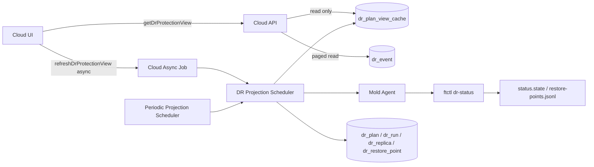
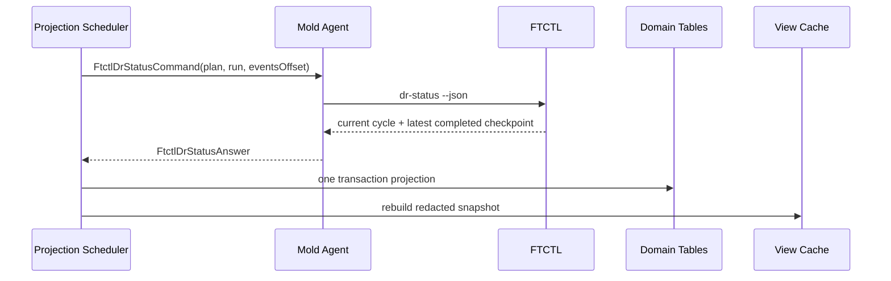

# Cross Hypervisor DR Protection View Cache And Completed Checkpoint Design

Date: 2026-07-10

Status: implementation design

Scope: Cloud UI, Cloud API, DR backend, Mold Agent command contract, FTCTL runtime, Cloud DB

## 1. 목적과 우선순위

이 문서는 DR Plan 상세 화면의 세 가지 표시 영역을 하나의 `보호 정보`
탭으로 통합하고, 읽기 요청이 Agent/FTCTL runtime projection을 직접
실행하는 구조를 제거하기 위한 최신 규범 설계다.

또한 진행 중인 checkpoint sequence와 마지막으로 완료된 checkpoint를
분리하지 않아 Cloud DB에 완료되지 않은 checkpoint가 `READY`로 보이는
문제를 함께 해결한다.

이 문서는 다음 문서의 후속 규범이며, 충돌하는 내용이 있으면 이 문서를
우선한다.

- `500-cross-hypervisor-dr-architecture-plan-20260630.md`
- `501-cross-hypervisor-dr-domain-schema-design-20260630.md`
- `502-cross-hypervisor-dr-adapter-contract-design-20260630.md`
- `503-cross-hypervisor-dr-state-machine-and-worker-design-20260630.md`
- `506-cross-hypervisor-dr-cloud-ui-design-20260630.md`
- `507-cross-hypervisor-dr-cloud-api-command-design-20260630.md`
- `508-cross-hypervisor-dr-cloud-backend-wiring-design-20260630.md`
- `509-cross-hypervisor-dr-db-upgrade-and-entity-design-20260630.md`
- `510-cross-hypervisor-dr-ftctl-runtime-contract-design-20260630.md`
- `549-cross-hypervisor-dr-checkpoint-history-event-rpo-design-20260710.md`

FTCTL shell/runtime 부속 설계는 qemu 저장소의 다음 문서에 유지한다.

- `434-ftctl-dr-current-and-completed-checkpoint-status-contract-design-20260710.md`

핵심 우선순위는 다음과 같다.

1. 실제 DR 보호 상태와 화면 표시가 일치해야 한다.
2. UI/API 읽기 요청은 Agent 또는 FTCTL을 동기 호출하지 않는다.
3. 완료되지 않은 checkpoint는 Failover 후보나 동기화 이력에 나타나지 않는다.
4. 일반 화면 조회가 DB event를 생성하지 않는다.
5. 캐시는 credential, secret, raw status 전체를 포함하지 않는다.

## 2. 실환경 Preflight 결과

검증 Plan:

```text
211c5a64-1d5b-4621-a752-f457e2437095
```

### 2.1 정상 데이터 경로

| 항목 | 확인 결과 |
| --- | --- |
| 초기 SYNC run | `SUCCEEDED` |
| 지속 복제 scheduler | `RUNNING` |
| 대상 VM | materialized, `Stopped`, `READY` |
| 대상 ROOT volume | RBD, 100 GiB, `Ready` |
| 부팅/IO 계약 | `UEFI/SECURE`, SCSI, iothreads, `io_uring` |
| VMware CBT | enabled |
| VMware snapshot tree | FTCTL 작업 snapshot 한 개만 유지 |
| RBD snapshot | 누적 없음 |
| RPO | 300초 목표 이내 |

따라서 복제 data plane은 성공했다. 이번 설계 대상은 읽기 경로와 projection
정합성이다.

### 2.2 이벤트 API 오류

브라우저가 다음 요청을 전송했다.

```text
listDrEvents&planid=<uuid>&pagesize=20
```

Cloud API는 HTTP 431과 다음 오류를 반환했다.

```text
"page" parameter is required when "pagesize" is specified
```

원인은 `DrEventsTab.vue`가 `pagesize`만 전달하고 `page`를 누락한 것이다.
Promise rejection 처리도 없어 event 영역은 비어 있고 브라우저 콘솔에는
실패가 남는다.

### 2.3 읽기 요청에 의한 projection 증폭

실환경에서 다음 API가 각각 약 0.9~1.1초를 사용했다.

```text
getDrPlan
listDrRuns
listDrReplicas
listDrSyncCheckpoints
listDrEvents
```

각 API가 `refreshPlanProjection()`을 직접 호출하므로, 탭을 열거나 새로고침할
때마다 Agent의 `dr-status`가 반복 실행된다. Plan 상세의 5초 poll과
`$route.fullPath` watcher가 이를 더 증폭한다.

검증 중 `dr_event` 401건 가운데 395건이 `PROJECTION_REFRESH`였다. 화면을
읽는 행위가 event를 생성하는 구조는 제거해야 한다.

### 2.4 진행 checkpoint와 완료 checkpoint 혼용

FTCTL scheduler는 cycle 시작 시 다음 값을 먼저 기록한다.

```text
checkpoint_sequence=N
step=incremental-transfer
progress=40
```

이때 `last_target_durable_at`은 아직 N-1 cycle 값이다. 그러나 현재 Cloud
projection은 `checkpoint_sequence=N`과 N-1의 durable timestamp를 결합하여
N을 `READY`로 저장한다.

실환경에서는 다음 상태가 관찰됐다.

```text
FTCTL completed JSONL rows: 4
Cloud DB READY rows:        5
```

cycle가 완료되면 같은 row가 나중에 보정되지만, 진행 중에는 존재하지 않는
완료 checkpoint를 UI/API가 반환한다. 최신 `dr-status --json`도
`checkpoint_sequence`만 제공하고 다음 필드는 제공하지 않았다.

```text
latest_completed_checkpoint_sequence
latest_completed_checkpoint_ref
latest_completed_checkpoint_cycle_type
```

이 경계는 Failover 선택 정확성과 직접 연결되므로 hard gate로 수정한다.

## 3. 목표 정보 구조

DR Plan 상세의 최종 탭 구조는 다음과 같다.

```text
상세 | 보호 정보 | 이력 | 이벤트
```

기존 `보호 토폴로지`와 `복제본` top-level 탭은 제거한다. 기존 URL 호환을
위해 `tab=topology`와 `tab=replica`는 한 release 동안 `tab=protection`으로
redirect한다.

`보호 정보` 탭은 다음 순서로 구성한다.

```text
보호 상태 요약
최근 동기화 작업과 단계
원본 -> 대상 보호 토폴로지
대상 복제 VM/volume 정보
최신 완료 checkpoint 요약
```

`DrPlanOverview`의 resource metadata는 `상세` 탭에 남기고, KPI와 run
progress는 `보호 정보` 탭으로 이동한다.

### 3.1 용어 규칙

| 기존 표시 | 변경 표시 | 이유 |
| --- | --- | --- |
| 복제본 active side | 복제 역할 | Plan의 현재 active side와 혼동 방지 |
| worker RUNNING | 보호 scheduler 실행 중 | terminal run과 background scheduler 구분 |
| run SUCCEEDED | 최근 보호 구성 작업 성공 | scheduler가 종료되었다는 오해 방지 |
| Restore Point | 동기화 checkpoint | 시점 복구 기능으로 오해 방지 |

## 4. 전체 아키텍처



### 4.1 쓰기 소유권

| 데이터 | 소유자 | 다른 레이어의 역할 |
| --- | --- | --- |
| runtime state | FTCTL | Agent가 relay, Cloud가 projection |
| completed checkpoint list | FTCTL JSONL | Cloud가 완료 row만 저장 |
| Plan/run/replica projection | Cloud backend | UI는 읽기만 수행 |
| protection view cache | Cloud backend | API/UI는 캐시를 읽음 |
| operator event | Cloud backend/FTCTL | 조회 자체는 event를 만들지 않음 |

## 5. UI 상세 설계

### 5.1 신규/변경 파일

```text
ui/src/views/infra/dr/DrPlanList.vue
ui/src/views/infra/dr/DrPlanOverview.vue
ui/src/views/infra/dr/DrProtectionInfoTab.vue          new
ui/src/components/dr/DrProtectionSummary.vue           new
ui/src/components/dr/DrReplicaSummaryTable.vue         new
ui/src/views/infra/dr/DrEventsTab.vue
ui/src/api/dr.js
ui/src/utils/dr/protectionViewCache.js                  new
ui/public/locales/en.json
ui/public/locales/ko_KR.json
```

`DrPlanTopologyTab.vue`와 `DrReplicaTab.vue`는 한 release 동안 compatibility
component로 남길 수 있지만 신규 route에서는 사용하지 않는다.

### 5.2 탭 구성

```vue
<a-tab-pane key="details" :tab="$t('label.details')">
  <dr-plan-overview :plan="detailPlan" mode="metadata" />
</a-tab-pane>

<a-tab-pane key="protection" :tab="$t('label.dr.protection.info')">
  <dr-protection-info-tab
    :snapshot="protectionSnapshot"
    :loading="protectionLoading"
    :stale="protectionSnapshotStale"
    @refresh="requestProjectionRefresh" />
</a-tab-pane>

<a-tab-pane key="history" :tab="$t('label.dr.history')">...</a-tab-pane>
<a-tab-pane key="events" :tab="$t('label.events')">...</a-tab-pane>
```

`DrProtectionInfoTab`은 자체 API를 호출하지 않는다. 부모가 전달한 하나의
snapshot만 렌더링한다. 이 규칙으로 status, topology, replica 사이의 시점
불일치를 방지한다.

### 5.3 route watcher 분리

현재 `$route.fullPath` watcher는 tab query 변경에도 `fetchData()`를 호출한다.
다음과 같이 resource ID와 tab query를 분리한다.

```js
watch: {
  '$route.params.id': function (id, previousId) {
    if (id !== previousId) this.loadDetail(id)
  },
  '$route.query.tab': function (tab) {
    this.activeTab = this.normalizeDetailTab(tab)
  }
}
```

`changeTab()`은 router query만 변경하며 API를 호출하지 않는다.

### 5.4 브라우저 메모리 캐시

`protectionViewCache.js`는 Plan별 snapshot과 in-flight Promise를 보관한다.

```js
const entries = new Map()

export function getCachedProtectionView (planId, loader, ttlMs = 15000) {
  const current = entries.get(planId)
  if (current?.value && Date.now() - current.loadedAt < ttlMs) {
    return Promise.resolve({ value: current.value, cached: true })
  }
  if (current?.inflight) return current.inflight

  const inflight = loader().then(value => {
    entries.set(planId, { value, loadedAt: Date.now(), inflight: null })
    return { value, cached: false }
  }).finally(() => {
    const entry = entries.get(planId)
    if (entry) entry.inflight = null
  })
  entries.set(planId, { ...current, inflight })
  return inflight
}
```

이 캐시는 보조 L1 캐시다. authoritative shared cache는 DB의
`dr_plan_view_cache`다.

L1 cache는 최대 100개 Plan을 LRU로 유지하고, Plan update/delete/release,
사용자 logout, API schema version 변경 시 해당 entry를 제거한다. snapshot에
credential이 없더라도 다른 account session 간 entry를 재사용하지 않는다.

### 5.5 polling 규칙

```js
shouldPollFast () {
  return this.protectionSnapshot?.latestOperation?.terminal === false
}

pollIntervalMs () {
  return this.shouldPollFast() ? 5000 : 30000
}
```

- UI poll은 cache API만 조회한다.
- `document.visibilityState !== 'visible'`이면 poll을 중지한다.
- terminal run이면서 protection state가 READY이면 30초 간격을 사용한다.
- tab 이동으로 poll timer를 중복 생성하지 않는다.
- 응답 revision이 같으면 Vue reactive object를 교체하지 않는다.

### 5.6 Events 오류 처리

```js
const params = this.runId
  ? { runid: this.runId, page: 1, pagesize: 20 }
  : { planid: this.planId, page: 1, pagesize: 20 }

listDrEvents(params)
  .then(result => {
    this.events = result.items || []
    this.total = Number(result.count || 0)
    this.error = ''
  })
  .catch(error => {
    this.events = []
    this.error = normalizeDrApiError(error)
  })
  .finally(() => { this.loading = false })
```

오류 시 empty state로 숨기지 않고 compact warning을 표시한다.

### 5.7 snapshot parser

`parseProtectionSnapshot()`은 다음을 검증한다.

```text
schemaVersion == DR_PROTECTION_VIEW_V1
plan.id matches route plan ID
revision is a non-negative integer
payload contains no credential/secret fields
replicas is an array
latestCompletedCheckpoint is null or state == READY
```

검증 실패 시 기존 snapshot을 유지하고 warning만 갱신한다.

## 6. API 상세 설계

### 6.1 신규 read API

```text
command: getDrProtectionView
parameter: id=<DrPlan UUID>
response: DrProtectionViewResponse
```

응답 필드:

```json
{
  "id": "plan-uuid",
  "schemaversion": "DR_PROTECTION_VIEW_V1",
  "revision": 17,
  "generated": "2026-07-10T17:30:20+0900",
  "projectionchecked": "2026-07-10T17:30:20+0900",
  "stale": false,
  "staleafterseconds": 60,
  "payloadhash": "sha256:...",
  "snapshotjson": "{...}"
}
```

`snapshotjson`은 DB에 저장한 redacted JSON text다. API는 이 호출 중
projection adapter나 Agent를 호출하지 않는다.

변경/신규 클래스:

```text
org.apache.cloudstack.api.command.admin.dr.GetDrProtectionViewCmd
org.apache.cloudstack.api.response.dr.DrProtectionViewResponse
com.cloud.dr.DrProtectionViewService
com.cloud.dr.DrProtectionViewServiceImpl
```

### 6.2 explicit async refresh API

```text
command: refreshDrProtectionView
parameter: id=<DrPlan UUID>
return: async job ID and projection request ID
```

이 API는 Agent 응답을 기다리지 않는다. 다음 작업을 queue한 뒤 즉시
반환한다.

```text
QUEUED -> DISPATCHING -> PROJECTED | STALE | FAILED
```

UI는 async job 완료만으로 보호 성공을 판단하지 않고 cache revision 증가와
`projectionchecked`를 확인한다.

### 6.3 기존 read API 정리

다음 API에서 `refreshPlanProjection()` 호출을 제거한다.

```text
getDrPlan
listDrPlans
getDrRun
listDrRuns
listDrRunSteps
listDrReplicas
listDrSyncCheckpoints
listDrRestorePoints
listDrEvents
```

호환 API는 마지막 저장 projection을 반환하고 `projectionchecked`, `stale`
정보를 포함할 수 있다. 읽기 API에 hidden synchronous refresh parameter를
추가하지 않는다.

### 6.4 event pagination

`ListDrEventsCmd`는 `BaseListCmd` 계약을 그대로 따른다.

```java
long startIndex = getStartIndex();
long pageSize = getPageSizeVal();
Pair<List<DrEventVO>, Integer> result = eventService.listSignificant(
    planId, runId, severity, eventClass, startIndex, pageSize);
response.setResponses(map(result.first()), result.second());
```

기본 UI 요청은 항상 `page=1`, `pagesize=20`을 함께 보낸다. backend는
`PROJECTION_REFRESH`를 기본 제외하며 전체 count도 동일한 filter를 사용한다.

## 7. Backend 상세 설계

### 7.1 신규 서비스 구성

```text
com.cloud.dr.projection.DrProjectionScheduler
com.cloud.dr.projection.DrProjectionQueueService
com.cloud.dr.view.DrProtectionViewAssembler
com.cloud.dr.view.DrProtectionViewCacheService
com.cloud.dr.checkpoint.DrCompletedCheckpointProjector
com.cloud.dr.event.DrEventPersistencePolicy
```

Spring wiring:

```xml
<bean id="drProjectionScheduler" class="com.cloud.dr.projection.DrProjectionScheduler" />
<bean id="drProjectionQueueService" class="com.cloud.dr.projection.DrProjectionQueueServiceImpl" />
<bean id="drProtectionViewAssembler" class="com.cloud.dr.view.DrProtectionViewAssembler" />
<bean id="drProtectionViewCacheService" class="com.cloud.dr.view.DrProtectionViewCacheServiceImpl" />
<bean id="drCompletedCheckpointProjector" class="com.cloud.dr.checkpoint.DrCompletedCheckpointProjector" />
```

### 7.2 background projection scheduler

기존 `DrSiteHealthCheckScheduler`의 `ScheduledExecutorService`,
`ManagedContextRunnable`, `GlobalLock` 패턴을 재사용한다.

설정 키:

```text
dr.projection.scheduler.enabled=true
dr.projection.scheduler.tick.seconds=5
dr.projection.scheduler.batch.size=25
dr.projection.active.interval.seconds=5
dr.projection.ready.interval.seconds=30
dr.projection.paused.interval.seconds=60
dr.projection.error.interval.seconds=60
dr.projection.stale.after.seconds=90
```

scan lock:

```java
GlobalLock scanLock = GlobalLock.getInternLock("DrProjectionScheduler");
```

Plan lock:

```java
GlobalLock planLock = GlobalLock.getInternLock("DrProjection:" + planUuid);
```

복수 management server에서 한 Plan을 동시에 poll하지 않도록 scan lock과
Plan lock을 모두 사용한다. lock을 얻지 못한 tick은 실패 event를 만들지
않고 skip한다.

### 7.3 projection 순서



한 status answer를 이용해 다음을 한 transaction boundary 안에서 갱신한다.

1. `dr_plan`
2. `dr_run`과 current step
3. `dr_replica`와 disk readiness
4. latest completed checkpoint
5. significant event transition
6. protection view cache

cache build가 실패해도 domain projection은 rollback하지 않는다. 대신 이전
cache를 유지하고 `stale_reason=VIEW_ASSEMBLY_FAILED`를 기록한다.

### 7.4 read/projection 분리

`DrProjectionServiceImpl.listReplicas/listRestorePoints/listPlanEvents`에서
`refreshPlanProjection()` 호출을 제거한다.

```java
public List<DrReplicaVO> listReplicas(long planId) {
    requirePlan(planId);
    return drReplicaDao.listActiveByPlanId(planId);
}
```

`refreshPlanProjection()`은 다음 위치에서만 호출한다.

```text
DrProjectionScheduler
DrRunExecutor post-dispatch projection
refreshDrProtectionView async worker
explicit repair/cleanup task
```

### 7.5 cache assembler

`DrProtectionViewAssembler`는 Agent를 호출하지 않고 DB 값만 조합한다.

```java
DrProtectionViewSnapshot assemble(long planId) {
    DrPlanVO plan = requirePlan(planId);
    DrRunVO latestRun = runDao.findLatestByPlanId(planId);
    List<DrRunStepVO> steps = latestRun == null
            ? Collections.emptyList()
            : runStepDao.listByRunId(latestRun.getId());
    List<DrReplicaVO> replicas = replicaDao.listActiveByPlanId(planId);
    DrRestorePointVO checkpoint = restorePointDao.findLatestCompleted(planId);
    List<DrEventVO> events = eventDao.listRecentSignificant(planId, 20);
    return snapshot(plan, latestRun, steps, replicas, checkpoint, events);
}
```

`payloadHash`가 기존 값과 같으면 payload와 revision을 변경하지 않는다.
동적 checkpoint age와 RPO age는 UI가 timestamp를 기준으로 계산하므로 매초
cache를 다시 쓸 필요가 없다.

### 7.6 event persistence

다음 경우만 event를 저장한다.

```text
run state transition
protection state transition
completed checkpoint sequence transition
RPO compliant <-> breached transition
target materialization transition
warning/error transition
operator action
```

성공한 unchanged poll과 cache hit/miss는 event로 저장하지 않는다.

## 8. Agent 상세 설계

### 8.1 `FtctlDrStatusAnswer` 필드 추가

```java
private Long currentCheckpointSequence;
private String currentCheckpointRef;
private String currentCheckpointCycleType;
private String currentCheckpointState;

private Long latestCompletedCheckpointSequence;
private String latestCompletedCheckpointRef;
private String latestCompletedCheckpointCycleType;
private String latestCompletedCheckpointState;
private String latestCompletedSourceCheckpointAt;
private String latestCompletedTargetDurableAt;
private Integer latestCompletedTargetReadyRpoSeconds;
private String latestCompletedManifestPath;
private String latestCompletedCheckpointPath;
```

기존 `getLastSourceCheckpointAt()`과 `getLastTargetDurableAt()`은 한 release
동안 latest completed timestamp alias로 유지한다.

### 8.2 KVM wrapper mapping

`LibvirtFtctlDrStatusCommandWrapper`는 다음 JSON key를 typed field로 매핑한다.

```text
current_checkpoint_*
latest_completed_checkpoint_*
```

unknown field는 기존 parser를 깨지 않는다. 신규 Cloud와 구버전 Agent 조합은
latest completed field가 없으면 projection을 수행하지 않고
`DR_COMPLETED_CHECKPOINT_UNAVAILABLE` warning을 기록한다. 현재 sequence로
fallback하여 READY checkpoint를 만들면 안 된다.

### 8.3 Agent 실행 경계

- UI/API thread는 Agent command를 전송하지 않는다.
- Agent status hard timeout은 현재 5초를 유지한다.
- timeout은 Plan error가 아니라 projection stale로 처리한다.
- credential JSON과 profile secret은 status answer/cache/event에 포함하지 않는다.

## 9. FTCTL 상세 설계

### 9.1 상태 필드 분리

FTCTL `status.state`는 다음 두 축을 별도로 보관한다.

```text
current_checkpoint_sequence
current_checkpoint_ref
current_checkpoint_cycle_type
current_checkpoint_state

latest_completed_checkpoint_sequence
latest_completed_checkpoint_ref
latest_completed_checkpoint_cycle_type
latest_completed_checkpoint_state
latest_completed_source_checkpoint_at
latest_completed_target_durable_at
latest_completed_target_ready_rpo_seconds
latest_completed_manifest_path
latest_completed_checkpoint_path
latest_completed_recorded_at
```

호환을 위해 `checkpoint_sequence`는 한 release 동안
`current_checkpoint_sequence` alias로 유지한다. Cloud는 이 alias를 완료
checkpoint로 사용하지 않는다.

### 9.2 scheduler write order

cycle 시작:

```bash
ftctl_dr_scheduler_update_state "$state_path" "$status_path" \
  "current_checkpoint_sequence=${sequence}" \
  "current_checkpoint_ref=${checkpoint_ref}" \
  "current_checkpoint_cycle_type=${cycle_type}" \
  "current_checkpoint_state=TRANSFERRING" \
  "step=${cycle_type}-transfer" \
  "progress=40"
```

이 단계에서는 `latest_completed_*`를 변경하지 않는다.

target flush/verify 완료 후 JSONL append 성공:

```bash
ftctl_dr_scheduler_append_restore_point ...
ftctl_dr_scheduler_update_state "$state_path" "$status_path" \
  "current_checkpoint_state=COMPLETED" \
  "latest_completed_checkpoint_sequence=${sequence}" \
  "latest_completed_checkpoint_ref=${checkpoint_ref}" \
  "latest_completed_checkpoint_cycle_type=${cycle_type}" \
  "latest_completed_checkpoint_state=TARGET_READY" \
  "latest_completed_source_checkpoint_at=${source_at}" \
  "latest_completed_target_durable_at=${target_at}" \
  "latest_completed_target_ready_rpo_seconds=${rpo}" \
  "latest_completed_manifest_path=${manifest_path}" \
  "latest_completed_checkpoint_path=${checkpoint_path}" \
  "latest_completed_recorded_at=$(ftctl_now_iso8601)"
```

JSONL append와 completed state 갱신 사이에 process가 죽으면 다음
`dr-status`가 JSONL 마지막 valid row를 읽어 completed fields를 복구한다.

### 9.3 `dr-status --json`

예시:

```json
{
  "state": "SYNCING",
  "step": "incremental-transfer",
  "current_checkpoint_sequence": 7,
  "current_checkpoint_ref": "ftctl:plan:run:7",
  "current_checkpoint_state": "TRANSFERRING",
  "latest_completed_checkpoint_sequence": 6,
  "latest_completed_checkpoint_ref": "ftctl:plan:run:6",
  "latest_completed_checkpoint_state": "TARGET_READY",
  "latest_completed_source_checkpoint_at": "2026-07-10T08:27:23Z",
  "latest_completed_target_durable_at": "2026-07-10T17:30:20+09:00"
}
```

### 9.4 legacy runtime fallback

`latest_completed_*` state key가 없고 `restore-points.jsonl`이 있으면
`ftctl_dr_runtime_emit_state_json()`은 마지막 유효 JSONL record를 읽어 필드를
채운다. malformed 마지막 행은 건너뛰고 이전 유효 record를 사용한다.

### 9.5 self-test 추가

```text
cycle start keeps latest completed sequence unchanged
cycle completion advances latest completed exactly once
dr-status reports current N and completed N-1 during transfer
JSONL append recovery reconstructs completed fields
failed cycle never advances completed sequence
malformed JSONL tail falls back to previous valid record
```

## 10. DB 상세 설계

### 10.1 신규 cache table

```sql
CREATE TABLE IF NOT EXISTS `dr_plan_view_cache` (
  `id` bigint unsigned NOT NULL AUTO_INCREMENT,
  `plan_id` bigint unsigned NOT NULL,
  `schema_version` varchar(64) NOT NULL,
  `revision` bigint unsigned NOT NULL DEFAULT 0,
  `payload_hash` binary(32) NOT NULL,
  `payload_json` mediumtext NOT NULL,
  `projection_checked` datetime DEFAULT NULL,
  `generated` datetime NOT NULL,
  `expires` datetime NOT NULL,
  `next_refresh_at` datetime DEFAULT NULL,
  `refresh_state` varchar(32) NOT NULL DEFAULT 'READY',
  `stale_reason` varchar(128) DEFAULT NULL,
  `last_error_code` varchar(128) DEFAULT NULL,
  `last_error_message` varchar(1024) DEFAULT NULL,
  `created` datetime NOT NULL,
  `updated` datetime DEFAULT NULL,
  PRIMARY KEY (`id`),
  UNIQUE KEY `uk_dr_plan_view_cache__plan` (`plan_id`),
  KEY `i_dr_plan_view_cache__next_refresh` (`next_refresh_at`, `refresh_state`)
) ENGINE=InnoDB DEFAULT CHARSET=utf8mb4;
```

Cloud schema 관례에 따라 DB foreign key는 추가하지 않고 service delete 시
cache row를 함께 제거한다.

### 10.2 VO/DAO

```text
com.cloud.dr.DrPlanViewCacheVO
com.cloud.dr.dao.DrPlanViewCacheDao
com.cloud.dr.dao.DrPlanViewCacheDaoImpl
```

DAO 메서드:

```java
DrPlanViewCacheVO findByPlanId(long planId);
List<DrPlanViewCacheVO> listDue(Date now, long startIndex, long pageSize);
boolean compareAndSetRefreshState(long id, String expected, String next);
DrPlanViewCacheVO upsert(long planId, String schemaVersion,
        byte[] payloadHash, String payloadJson, Date projectionChecked,
        Date generated, Date expires, Date nextRefreshAt);
boolean removeByPlanId(long planId);
```

### 10.3 cache payload 규칙

cache JSON에 포함할 수 있는 항목:

```text
Plan/site 이름과 ID
effective protection state
active side와 scheduler activity
latest operation summary와 step summary
source/target topology summary
replica VM/volume summary
latest completed checkpoint summary
최근 significant event 20건
projection checked/generated timestamp
```

포함 금지:

```text
API key/secret
vCenter password
credential payload 또는 reference 복호화 결과
temporary password file
nbdkit socket
전체 raw dr-status JSON
전체 mapping/policy JSON
전체 event history
```

### 10.4 completed checkpoint query

`DrRestorePointDao`에 다음 메서드를 추가한다.

```java
DrRestorePointVO findLatestCompletedByPlanId(long planId);
List<DrRestorePointVO> listCompletedByPlanId(
        long planId, long startIndex, long pageSize);
long countCompletedByPlanId(long planId);
DrRestorePointVO findByPlanIdAndCheckpointRefHash(long planId, byte[] hash);
```

완료 조건:

```text
state == READY
checkpoint_sequence != null
checkpoint_ref_hash != null
source_created != null
target_ready_at != null
```

### 10.5 기존 phantom row 보정

일반 migration SQL은 host runtime을 알 수 없으므로 sequence만 비교해 READY
row를 삭제하지 않는다. 수정된 projection이 처음 실행될 때 다음을 수행한다.

1. current ref가 DB에서 READY지만 latest completed ref와 다르면
   `state=IN_PROGRESS`로 낮춘다.
2. `target_ready_at`, `target_ready_rpo_seconds`는 null로 정리한다.
3. latest completed ref는 READY로 upsert한다.
4. History API는 READY row만 반환한다.
5. current cycle가 완료되면 동일 hash row를 READY로 승격한다.

### 10.6 event cleanup

신규 projection이 `PROJECTION_REFRESH`를 더 이상 만들지 않는 것을 확인한
후 batch cleanup을 수행한다.

```sql
DELETE FROM dr_event
 WHERE event_type = 'PROJECTION_REFRESH'
   AND severity = 'INFO'
 LIMIT 1000;
```

반복 batch는 service task가 수행한다. warning/error projection event는 삭제하지
않는다.

## 11. Cache snapshot schema

```json
{
  "schemaVersion": "DR_PROTECTION_VIEW_V1",
  "plan": {
    "id": "...",
    "name": "...",
    "protectionState": "READY",
    "adminState": "ENABLED",
    "activeSide": "SOURCE",
    "rpoSeconds": 300,
    "rtoSeconds": 300
  },
  "projection": {
    "checkedAt": "...",
    "generatedAt": "...",
    "stale": false,
    "staleAfterSeconds": 90
  },
  "activity": {
    "schedulerState": "RUNNING",
    "syncActivity": "WAITING",
    "currentCheckpointSequence": 7,
    "currentCheckpointState": "TRANSFERRING"
  },
  "latestOperation": {
    "id": "...",
    "type": "SYNC",
    "state": "SUCCEEDED",
    "terminal": true,
    "steps": []
  },
  "topology": {
    "source": {},
    "direction": "VMWARE_TO_KVM",
    "target": {}
  },
  "replicas": [],
  "latestCompletedCheckpoint": {},
  "recentEvents": []
}
```

`protectionState`와 `syncActivity`는 별도 축이다. READY protection이 background
incremental transfer 중이어도 사용자에게 오류나 미완료로 표시하지 않는다.

## 12. 오류와 stale 처리

| 상황 | Domain state | Cache/API | UI |
| --- | --- | --- | --- |
| Agent timeout | 기존 state 유지 | stale=true | 최근 상태 확인 지연 |
| cache assemble 실패 | projection 유지 | 이전 payload + stale reason | 이전 데이터 유지 |
| event API 431/5xx | 변화 없음 | API error | warning + retry |
| current cycle 진행 | READY 유지 | current N, completed N-1 | 보호 가능 + 동기화 중 |
| current cycle 실패 | DEGRADED/ERROR 규칙 적용 | completed N-1 유지 | 마지막 정상 checkpoint 표시 |
| no completed checkpoint | not execution-ready | checkpoint null | Failover 비활성 |

stale cache는 destructive action을 자동 실행하거나 Plan을 ERROR로 전이시키지
않는다. Failover 같은 action은 실행 시 backend가 최신 completed checkpoint를
FTCTL Plan lock 안에서 다시 검증한다.

## 13. 테스트 설계

### 13.1 UI

```text
DrPlanList route query change does not call fetchDetail
Protection tab renders status/topology/replica from one revision
legacy topology/replica route redirects to protection
Events sends page=1 and pagesize=20
Events error is visible and does not become empty success
hidden browser tab stops polling
same revision does not replace reactive snapshot
```

### 13.2 API

```text
GetDrProtectionViewCmd never calls DrProjectionAdapter
all read commands return without AgentManager.send
ListDrEventsCmd honors page and page size
significant event total count excludes PROJECTION_REFRESH
refreshDrProtectionView returns async job before Agent completion
```

### 13.3 Backend/DB

```text
projection scheduler single-owner behavior with two management nodes
one status answer produces one atomic domain projection
identical payload hash does not increment revision
cache assembly failure keeps previous payload
unchanged projection creates no event
current N plus completed N-1 never creates READY row N
completed N upserts exactly one READY row
```

### 13.4 Agent/FTCTL

```text
status answer maps all current/latest-completed fields
legacy runtime fallback reads last valid JSONL row
failed transfer keeps completed sequence unchanged
status timeout remains stale, not terminal failure
```

### 13.5 실환경 수용 기준

1. 세 개 이상의 300초 RPO cycle을 실행한다.
2. transfer 진행 중 FTCTL current sequence가 DB max READY보다 정확히 1 클 수
   있음을 확인한다.
3. cycle 완료 후 FTCTL latest completed sequence와 DB max READY가 같아야 한다.
4. sequence별 source/target timestamp가 FTCTL JSONL과 DB에서 같아야 한다.
5. 상세 화면 진입 시 Agent `dr-status` 호출 수는 0이어야 한다.
6. 일반 cache API 응답 p95는 500ms 이하를 목표로 한다.
7. tab 변경 시 `getDrPlan/listDrRuns` 재호출이 없어야 한다.
8. event API는 HTTP 200, 기본 20건 이하를 반환해야 한다.
9. 화면을 10분 열어 둬도 `PROJECTION_REFRESH` event count가 증가하지 않아야 한다.
10. VMware snapshot tree와 RBD snapshot이 cycle별로 누적되지 않아야 한다.
11. Test Failover는 최신 completed checkpoint ref를 lock해야 한다.

## 14. 구현 순서

1. FTCTL current/completed checkpoint 필드와 self-test를 먼저 구현한다.
2. Agent typed answer와 wrapper mapping을 구현한다.
3. Backend completed checkpoint projector를 구현한다.
4. read API의 synchronous projection 호출을 제거한다.
5. projection scheduler와 DB cache table/service를 구현한다.
6. protection view API와 async refresh API를 구현한다.
7. UI `보호 정보` 탭과 browser cache를 구현한다.
8. Events page/error 처리와 backend pagination을 구현한다.
9. projection event와 phantom READY row를 보정한다.
10. build, deploy 후 세 RPO cycle Preflight를 수행한다.
11. 모든 수용 기준을 통과한 뒤 Test Failover로 진행한다.

이 순서를 지키면 Cloud가 completed checkpoint를 구분할 수 없는 과도기에서
read projection을 먼저 제거하여 상태가 갱신되지 않는 문제를 피할 수 있다.

## 15. 오류 원인 및 AS-IS / TO-BE 요약

| 영역 | 오류 원인 | AS-IS | TO-BE |
| --- | --- | --- | --- |
| UI 탭 | 상태/토폴로지/복제본 분리 | 세 화면을 이동하며 별도 데이터 조회 | 하나의 `보호 정보` snapshot으로 통합 |
| UI route | fullPath watcher | tab query 변경도 전체 fetch | resource ID 변경만 detail fetch |
| UI poll | Plan `SYNCING`만 보고 5초 poll | terminal run 이후 polling 중단 | active operation은 5초, ENABLED 보호 계획 cache는 10초 |
| Events | `pagesize`만 전달 | HTTP 431, 빈 화면, console error | `page=1` 동반, catch/warning, server pagination |
| API | read와 refresh 결합 | 조회마다 Agent/FTCTL 호출 | read는 DB/cache 전용, refresh는 async command |
| Backend | projection side effect | 조회가 event와 DB write 생성 | scheduler만 projection/write 수행 |
| Cache | 분산 JSON 재조합 | 여러 API/테이블을 매번 조합 | versioned redacted JSON snapshot `MEDIUMTEXT` |
| Event | unchanged poll도 저장 | event 대부분 `PROJECTION_REFRESH` | state transition/significant event만 저장 |
| FTCTL state | current와 completed 혼용 | current N + durable N-1 | current N과 latest completed N-1 별도 필드 |
| Checkpoint DB | current sequence를 READY upsert | 진행 중 phantom READY row | latest completed ref만 READY upsert |
| Failover gate | DB latest를 신뢰할 위험 | 아직 완료되지 않은 ref 노출 가능 | FTCTL lock 안에서 latest completed ref 재검증 |
| 다중 관리 서버 | projection ownership 불명확 | 동시 poll/중복 write 가능 | Global scan lock + Plan lock + hash idempotency |

## 16. 완료 정의

설계 구현은 다음 조건을 모두 만족해야 완료다.

- UI에서 `상세 | 보호 정보 | 이력 | 이벤트`만 표시된다.
- `보호 정보`의 모든 영역이 같은 cache revision을 사용한다.
- 모든 read API call stack에서 Agent send가 제거된다.
- event 조회가 정상이고 조회 자체가 event를 생성하지 않는다.
- FTCTL current/completed checkpoint가 분리된다.
- DB READY checkpoint는 FTCTL completed JSONL과 sequence/ref/timestamp가 같다.
- cache가 stale이어도 기존 데이터가 사라지지 않는다.
- credential과 raw secret이 cache/API/event에 포함되지 않는다.
- 세 RPO cycle과 Test Failover preflight를 통과한다.

## 17. 2026-07-14 Live Cache Consumption 보강

보호 정보 cache의 생성과 저장은 정상이어도 UI가 latest run active 여부만으로
polling을 중단하면 화면은 stale 상태가 된다. ENABLED 보호 계획은 terminal run
이후에도 `getDrProtectionView`를 10초 주기로 읽는다. active run은 5초 주기를
사용하고, hidden document에서는 polling을 중단한다.

UI는 `snapshot.plan`을 detail model에 병합하되 public UUID를 `id`로 유지한다.
수동 Update만 `refreshDrProtectionView` async job을 만들며 자동 polling은 Agent나
FTCTL을 호출하지 않는다. async 생성 완료와 목록 read-after-write 정합성,
다크모드 token 규칙을 포함한 상세 설계는
`552-cross-hypervisor-dr-async-read-consistency-and-live-cache-ui-design-20260714.md`를 따른다.

## 18. 2026-07-14 Data-Plane Reassessment

The protection-view cache and current/latest completed checkpoint separation in
this document remain valid. The phrase "data-plane replication succeeded" must
be read narrowly: the environment proved repeated durable full-copy cycles and
target materialization. It did not prove that later VMware cycles used CBT
extent-only transfer.

The cached protection view will contain only current/latest aggregate cycle
metrics. Full history is served from typed cycle tables. True VMware CBT
incremental execution and evidence are defined in
`555-cross-hypervisor-dr-vmware-cbt-incremental-and-transfer-metrics-design-20260714.md`.

## 19. 2026-07-21 Current Protection Activity Contract

`latestRun` is operation history and must never be interpreted as the current
protection activity merely because no active Run exists. Protection-view cache
version 2 separates `currentProtectionRuntime`, `activeRun`,
`latestOperationRun`, `currentSyncCycle`, and `latestCompletedSyncCycle`.

The current scheduler, control, owner, freshness, and authority fields come
from `dr_plan_runtime`. A completed Run's frozen `last_status_json` is used only
for operation diagnostics. The normative cache schema, compatibility rules,
UI rendering priority, and acceptance tests are defined in
`566-cross-hypervisor-dr-current-protection-activity-and-operation-history-projection-design-20260721.md`.
