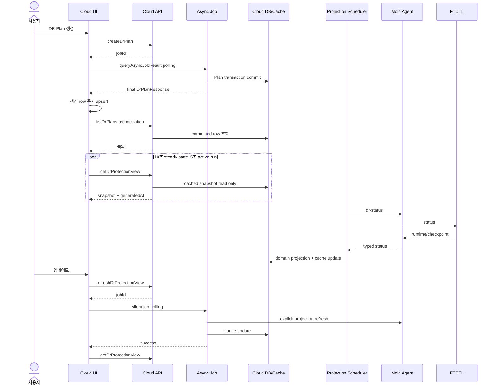

# Cross Hypervisor DR 비동기 생성 정합성 및 실시간 캐시 UI 설계

작성일: 2026-07-14  
상태: 구현 전 상세 설계  
기준 문서:

- `506-cross-hypervisor-dr-cloud-ui-design-20260630.md`
- `507-cross-hypervisor-dr-cloud-api-command-design-20260630.md`
- `508-cross-hypervisor-dr-cloud-backend-wiring-design-20260630.md`
- `515-cross-hypervisor-dr-async-action-remediation-plan-20260701.md`
- `550-cross-hypervisor-dr-protection-view-cache-and-completed-checkpoint-design-20260710.md`
- `551-cross-hypervisor-dr-protection-view-cache-implementation-result-20260710.md`

## 1. 목적

DR Plan 생성 직후 목록이 비어 보이는 문제, 상세 화면의 다크모드 가시성 문제, 수동 업데이트 시 내부 비동기 처리 문구가 노출되는 문제, 활성 보호 계획의 캐시 정보가 자동 갱신되지 않는 문제를 하나의 읽기 정합성 설계로 보정한다.

이번 설계는 장시간 DR 작업을 동기 API로 바꾸지 않는다. UI는 Cloud async job을 비동기로 추적하고, 정상 조회는 DB 캐시만 읽는다. Agent와 FTCTL은 기존 백그라운드 투영 경로에서만 호출한다.

## 2. 실환경 확인 결과

검증 대상 Plan UUID: `2a4a9882-09a5-45eb-8af2-246ba2b8ef0e`

### 2.1 생성 직후 목록 누락

관리 서버 로그에서 다음 순서가 확인됐다.

1. `listDrPlans` 요청 시작: `2026-07-14 06:53:24.198`
2. `createDrPlan` async job 2141 완료: `2026-07-14 06:53:24.292`

UI가 생성 job 완료 전에 목록을 조회했으므로 정상 생성된 Plan이 최초 목록에 포함되지 않았다. 원인은 데이터 손실이 아니라 UI async job 해석 누락과 read-after-write 경쟁이다.

### 2.2 상세 자동 갱신 중단

- 브라우저의 보호 정보 cache 생성 시각은 15초 이상 바뀌지 않았다.
- 같은 시간에 `dr_plan_view_cache.generated_at`과 완료 checkpoint는 Scheduler 주기에 따라 계속 전진했다.
- `DrPlanList.vue.shouldPollRuntime()`은 최신 operator run이 active일 때만 true다.
- 최초 sync run이 `SUCCEEDED`가 되면 FTCTL continuous scheduler가 계속 동작해도 UI polling은 종료된다.

따라서 엔진과 DB 캐시는 정상이나 UI가 보호 수명주기와 작업 실행 수명주기를 같은 조건으로 취급한 것이 원인이다.

### 2.3 다크모드

브라우저에서 `body.dark-mode`는 적용됐지만 Ant Design descriptions의 계산 스타일은 다음과 같았다.

- label background: `rgb(250, 250, 250)`
- label text: `rgba(0, 0, 0, 0.85)`
- content text: `rgba(0, 0, 0, 0.65)`

`DrProtectionInfoTab.vue`가 DR CSS 변수만 선언하고 Ant Design 하위 요소를 재정의하지 않아 light theme 기본값이 우선 적용됐다.

### 2.4 데이터 경로

아래 항목은 정상으로 확인됐다.

- 최신 run 및 모든 step: `SUCCEEDED`
- target replica/VM/volume: `READY`, VM `POWERED_OFF`
- target boot/details: `SECURE`, `io.policy=io_uring`, `iothreads=true`
- FTCTL scheduler: `RUNNING`, full seed와 incremental checkpoint 생성
- Agent, mold-agent, FTCTL timer: 정상
- RPO: 300초 목표 안에서 최신 checkpoint 유지
- RBD snapshot 누적: 없음

따라서 이번 결함은 UI/API의 비동기 결과 소비와 캐시 표시 정책에 한정된다. Agent, FTCTL 동기화 엔진 및 DB 스키마 변경은 필요하지 않다.

## 3. 목표 아키텍처



## 4. UI 상세 설계

### 4.1 공통 async response resolver

대상 파일: `ui/src/api/dr.js`

현재 `createDrPlan`, `createDrSite`, `updateDrPlan`, `updateDrSite`, `checkDrSite`는 `BaseAsyncCmd`인데도 최초 HTTP response를 최종 객체로 해석한다. `discoverDrPlanInventory`에만 존재하는 job polling 패턴을 공통화한다.

```js
function waitForDrJobObject (jobId, command, options = {}) {
  const intervalMs = options.intervalMs || 1000
  const timeoutMs = options.timeoutMs || 120000
  const startedAt = Date.now()

  const poll = () => getAPI('queryAsyncJobResult', { jobId }).then(response => {
    const result = response?.queryasyncjobresultresponse || {}
    if (result.jobstatus === 1) return extractDrJobObject(result.jobresult, command)
    if (result.jobstatus === 2) throw buildDrJobError(result, jobId, command)
    if (Date.now() - startedAt >= timeoutMs) throw buildDrJobTimeout(jobId, command)
    return sleep(intervalMs).then(poll)
  })

  return poll()
}

function postAndWaitForDrObject (command, params, options) {
  return postAPI(command, params).then(response => {
    const jobId = extractJobId(response, command)
    return jobId
      ? waitForDrJobObject(jobId, command, options)
      : extractDrObject(response, command)
  })
}
```

적용 함수:

- `createDrPlan`
- `updateDrPlan`
- `createDrSite`
- `updateDrSite`
- `checkDrSite`
- 기존 `discoverDrPlanInventory`, `discoverDrSiteInventory`도 같은 helper 사용

삭제와 장기 action은 기존처럼 job ID를 반환한다. 생성/수정 form만 최종 resource response가 필요한 command로 분류한다.

UI가 Promise를 기다리는 동안 브라우저 event loop는 막히지 않는다. 이는 동기 서버 처리로의 회귀가 아니라 Cloud async job을 비동기로 추적하는 것이다.

### 4.2 생성 후 목록 정합성

대상 파일: `ui/src/views/infra/dr/DrPlanList.vue`

`fetchList()`는 Promise를 반환하도록 수정한다.

```js
fetchList (options = {}) {
  this.loading = true
  return Promise.all([this.fetchSites(), listDrPlans()])
    .then(([, result]) => {
      this.plans = reconcileDrPlans(result.items || [], options.retain || [])
      return this.plans
    })
    .finally(() => { this.loading = false })
}
```

생성 성공 흐름:

```js
const created = await createDrPlan(this.buildPlanPayload())
this.upsertPlan(created)
this.closeCreateModal()
await this.fetchList({ retain: [created] })
```

규칙:

1. modal은 async job 성공 이후에만 닫는다.
2. job result의 `DrPlanResponse`를 목록에 즉시 upsert한다.
3. 목록 API로 서버 상태를 재조정한다.
4. 재조회 결과가 일시적으로 비어도 같은 UUID의 retained row를 한 주기 유지한다.
5. job 실패 시 성공 알림과 optimistic row를 만들지 않는다.

### 4.3 보호 수명주기와 실행 수명주기 분리

기존 `shouldPollRuntime()`을 다음으로 분리한다.

```js
shouldPollActiveRun () {
  return this.isActiveRun(this.currentRun)
}

shouldPollProtectionView () {
  return Boolean(
    this.detailId &&
    this.detailPlan.id &&
    !this.detailPlan.removed &&
    String(this.detailPlan.adminstate || '').toUpperCase() === 'ENABLED'
  )
}

protectionPollDelay () {
  return this.shouldPollActiveRun() ? 5000 : 10000
}
```

`setInterval` 대신 완료 후 재예약하는 `setTimeout`을 사용한다.

```js
scheduleProtectionPolling () {
  this.stopProtectionPolling()
  if (document.hidden || !this.shouldPollProtectionView()) return
  this.protectionPollTimer = window.setTimeout(
    this.pollProtectionView,
    this.protectionPollDelay()
  )
}

async pollProtectionView () {
  if (this.protectionPollInFlight) return
  this.protectionPollInFlight = true
  try {
    await this.fetchProtectionView({ silent: true })
  } finally {
    this.protectionPollInFlight = false
    this.scheduleProtectionPolling()
  }
}
```

이 방식은 요청 중첩을 막고 active/steady interval을 즉시 전환한다. `visibilitychange`에서 hidden이면 timer를 중단하고 visible 복귀 시 즉시 한 번 읽은 뒤 재예약한다.

### 4.4 cache snapshot을 상세 모델에 반영

현재 `fetchProtectionView()`는 run/site/replica만 갱신하고 `snapshot.plan`을 `detailPlan`에 병합하지 않는다. 좌측 카드와 상세 필드가 stale 상태로 남는 원인이다.

```js
applyCachedPlan (rawPlan) {
  const cached = this.normalizeCachedRecord(rawPlan)
  if (!cached || (!cached.uuid && !cached.id)) return

  const databaseId = cached.id
  const publicId = cached.uuid || this.detailPlan.id || this.detailId
  const refreshableFields = [
    'name', 'description', 'state', 'adminstate', 'activeside',
    'rposeconds', 'rtoseconds', 'lastsourcecheckpointat',
    'lasttargetdurableat', 'targetreadyat', 'targetreadyrposeconds',
    'lasterrorcode', 'lasterrormessage', 'created', 'updated', 'removed'
  ]
  const refreshable = refreshableFields.reduce((result, key) => {
    if (Object.prototype.hasOwnProperty.call(cached, key)) {
      result[key] = cached[key]
    }
    return result
  }, {})
  this.detailPlan = Object.assign({}, this.detailPlan, refreshable, {
    databaseid: databaseId,
    id: publicId,
    uuid: cached.uuid || publicId
  })
}
```

`detailPlan.id`에는 API public UUID를 유지한다. cache 내부 숫자 PK가 route/API parameter로 다시 사용되지 않게 `databaseid`로 분리한다. Cache의 `sourceSiteId`, `targetSiteId`, worker host ID는 내부 숫자 ID이므로 전체 객체를 병합하지 않는다. 실시간 갱신이 필요한 상태/RPO/checkpoint 시각 필드만 allowlist로 병합하고 사이트 UUID와 action eligibility는 `getDrPlan` 응답 값을 보존한다.

snapshot 적용은 한 함수에서 다음 순서로 처리한다.

1. schema/version 검증
2. `plan` 병합
3. source/target site 갱신
4. latest run/steps 갱신
5. replica/checkpoint/event 갱신
6. `generatedAt`, `stale`, `projectionState` 갱신

파싱 실패나 cache API 실패 시 마지막 정상 snapshot을 유지하고, 화면 전체 skeleton으로 되돌리지 않는다.

### 4.5 수동 업데이트 UX

대상 메서드: `DrPlanList.vue.requestProtectionRefresh()`

- 업데이트 버튼에 `protectionRefreshing` spinner만 표시한다.
- `message.dr.async.accepted` 정보 알림을 제거한다.
- async job 완료 후 `fetchProtectionView({ silent: true })`를 한 번 호출한다.
- 성공 toast는 표시하지 않는다.
- 실패 시에만 사용자 조치가 가능한 오류 메시지를 표시한다.
- 기존 화면 데이터는 refresh 동안 유지한다.

### 4.6 다크모드

대상 파일: `ui/src/style/cross-dr.less`

Ant Design 내부 기본색을 DR token으로 덮어쓴다. 컴포넌트 안에 색상 상수를 중복 선언하지 않는다.

```less
.cross-dr-standard-page .cross-dr-protection-info {
  .ant-descriptions-view,
  .ant-descriptions-row,
  .ant-descriptions-item-label,
  .ant-descriptions-item-content {
    border-color: var(--cross-dr-border);
  }

  .ant-descriptions-item-label {
    background: var(--cross-dr-surface-muted);
    color: var(--cross-dr-text);
  }

  .ant-descriptions-item-content {
    background: var(--cross-dr-surface);
    color: var(--cross-dr-text);
  }
}
```

라이트/다크 모두 같은 selector와 token을 사용한다. `body.dark-mode .cross-dr-page`의 기존 변수 정의가 실제 색을 결정한다.

## 5. API 상세 설계

### 5.1 명령 계약

| 명령 | 서버 형태 | UI 소비 계약 |
| --- | --- | --- |
| `createDrPlan` | `BaseAsyncCmd` | job 성공 후 최종 `DrPlanResponse` 사용 |
| `updateDrPlan` | `BaseAsyncCmd` | job 성공 후 최종 `DrPlanResponse` 사용 |
| `createDrSite`/`updateDrSite` | `BaseAsyncCmd` | job 성공 후 최종 `DrSiteResponse` 사용 |
| `getDrProtectionView` | `BaseCmd` | DB cache read-only, Agent 호출 금지 |
| `refreshDrProtectionView` | `BaseAsyncCmd` | 명시적 refresh job, Agent 호출 허용 |

과거 문서의 `refreshDrPlanProjection`은 제안 단계 명칭이다. 구현 및 이후 규범 명칭은 `refreshDrProtectionView`다.

### 5.2 완료 시점

create/update async job은 다음 조건을 모두 만족한 뒤 성공해야 한다.

1. service transaction commit 완료
2. public UUID가 포함된 response 생성
3. start-sync를 요청한 경우 요청 등록과 run enqueue 완료

초기 전체 복제나 FTCTL 작업 완료를 기다리지는 않는다. 최종 resource response와 장기 DR run 완료는 서로 다른 완료 경계다.

## 6. Backend 상세 설계

### 6.1 유지할 구조

- `DrProjectionScheduler`: 기본 10초 주기
- `GlobalLock("DrProjectionScheduler")`: 다중 management 단일 소유
- `DrProtectionViewService.refreshProjectionAndView(planId, scheduled)`
- `DrProtectionViewService.getProtectionView(planId)`: cache 전용 조회

### 6.2 조회와 투영 경계

| 경로 | Agent/FTCTL 호출 | DB write |
| --- | --- | --- |
| `getDrProtectionView` | 금지 | 금지 |
| Scheduler refresh | 허용 | domain/cache 갱신 |
| `refreshDrProtectionView` async job | 허용 | domain/cache 갱신 |
| `listDrPlans`/`getDrPlan` | 금지 | 금지 |

수동 refresh와 Scheduler가 겹쳐도 Plan lock과 기존 cache update transaction을 사용한다. cache 생성 시각이 더 오래된 결과로 역행하지 않도록 update 직전 현재 `generated_at`을 비교하고, stale result이면 저장하지 않는 방어를 추가하는 것을 권장한다. 이 보정은 스키마 추가 없이 service 조건 검사로 구현한다.

## 7. Agent 및 FTCTL 설계 영향

이번 변경에서는 Agent/FTCTL 코드를 수정하지 않는다.

- Agent는 Scheduler 또는 명시적 refresh job에서만 호출된다.
- UI steady polling은 Agent command를 생성하지 않는다.
- FTCTL은 current checkpoint와 latest completed checkpoint를 계속 분리해 보고한다.
- CBT, VDDK, full seed, incremental sync, snapshot merge 정책은 변경하지 않는다.

Agent/FTCTL 변경이 없다는 사실도 회귀 검증 대상으로 삼는다. UI polling 1분 동안 host `dr-status` 호출 수가 UI request 수만큼 증가하면 FAIL이다.

## 8. DB 설계 영향

스키마 변경은 없다.

기존 `dr_plan_view_cache`를 그대로 사용한다.

- `plan_id` unique
- `snapshot_json MEDIUMTEXT`
- `projection_state`
- `last_error`
- `generated_at`
- `updated`

UI는 `generated_at`을 마지막 갱신 시각으로 표시하고 동일 생성 시각의 snapshot은 reactive state를 불필요하게 교체하지 않는다. 캐시가 stale이면 마지막 정상 데이터와 stale 경고를 함께 표시한다.

## 9. Preflight 및 수용 테스트

### 9.1 생성 정합성

1. startsync on/off 각각 Plan을 생성한다.
2. 최초 POST response의 job ID를 확인한다.
3. job 성공 전 `listDrPlans`를 호출하지 않는지 network trace로 확인한다.
4. modal이 닫히는 즉시 생성 row가 보이는지 확인한다.
5. 목록 row UUID와 상세 route UUID가 job result와 같은지 확인한다.

PASS: 20회 반복에서 생성 성공 후 `No Data`가 한 번도 표시되지 않는다.

### 9.2 자동 갱신

1. latest run이 `SUCCEEDED`이고 Plan이 `ENABLED`인 상태를 만든다.
2. Update를 누르지 않고 30초 관찰한다.
3. UI `generatedAt`, 최근 checkpoint, RPO와 DB cache를 비교한다.
4. background tab에서는 request가 멈추고 복귀 즉시 1회 갱신되는지 확인한다.

PASS: Scheduler 두 주기 안에 UI가 최신 cache를 표시하고 중복 요청이 없다.

### 9.3 API/Backend 부하

1. `getDrProtectionView` 호출 stack에 `AgentManager.send`가 없는지 확인한다.
2. steady UI 1분 동안 cache GET만 발생하는지 확인한다.
3. 수동 Update 1회에 `refreshDrProtectionView` job 1개만 생성되는지 확인한다.

PASS: UI polling이 Agent/FTCTL 호출량을 증가시키지 않는다.

### 9.4 다크모드

1. light/dark에서 상세, 보호 정보, 이력, 이벤트 탭을 캡처한다.
2. descriptions label/content의 computed background/text를 확인한다.
3. 1440x900 및 좁은 viewport에서 글자 잘림과 겹침을 확인한다.

PASS: dark mode에서 `#fafafa`와 검정 text가 descriptions에 남지 않고 모든 필드가 식별된다.

### 9.5 회귀

- 기존 VMware -> ABLESTACK continuous sync 유지
- target VM/volume/checkpoint 정합성 유지
- Test Failover/Failover eligibility 유지
- event 최근 20건 및 console error 없음
- RBD snapshot 누적 없음

## 10. 구현 순서

1. `dr.js` async response resolver 공통화 및 단위 테스트
2. Plan/Site create/update 호출부 전환
3. `fetchList()` Promise 반환과 created row reconciliation
4. cache snapshot의 plan 병합
5. active/steady polling 분리 및 visibility 처리
6. 수동 Update 알림 제거와 silent refresh
7. token 기반 Ant descriptions 스타일 추가
8. UI lint/build 및 관련 Maven module build
9. 변경 클래스/UI 정적 자산 배포
10. 9장 실환경 수용 테스트

## 11. 오류 원인 및 AS-IS / TO-BE

| 계층 | 오류 원인 | AS-IS | TO-BE |
| --- | --- | --- | --- |
| UI 생성 | async job ID를 최종 객체로 오인 | POST 직후 목록 조회, commit보다 먼저 조회 가능 | job 성공과 최종 resource 수신 후 upsert/재조회 |
| UI 목록 | `fetchList()`가 Promise를 반환하지 않음 | 후속 동작이 목록 완료를 보장할 수 없음 | Promise 반환 및 reconcile 완료 추적 |
| UI 갱신 | active run 여부만 polling 조건으로 사용 | run 성공 후 continuous sync 화면 정지 | active run 5초, ENABLED 보호 계획 cache 10초 |
| UI 모델 | cache `snapshot.plan` 미병합 | 보호 정보 일부만 갱신, 좌측/상세 stale | public UUID를 보존해 `detailPlan` 병합 |
| UI Update | 내부 async 접수 메시지 노출 | 사용자가 구현 세부사항을 봄 | spinner, silent success, 실패만 알림 |
| UI dark | Ant 기본 light style 우선 | 흰 label/검정 글자 | DR theme token으로 하위 요소 재정의 |
| API | async CRUD 소비 계약 불명확 | HTTP accept와 resource completion 혼합 | BaseAsync job 완료 후 resource response 사용 |
| API refresh | 문서와 구현 명칭 불일치 | `refreshDrPlanProjection`/`refreshDrProtectionView` 혼재 | `refreshDrProtectionView`로 통일 |
| Backend read | 현재 구조는 정상 | DB cache read-only | 그대로 유지, Agent 호출 금지 테스트 추가 |
| Backend projection | Scheduler/수동 refresh가 cache 갱신 | UI가 결과를 소비하지 못함 | 기존 투영 유지, generated time 역행 방어 |
| Agent | 정상 | Scheduler/명시 refresh에 응답 | 변경 없음 |
| FTCTL | 정상 | continuous sync/checkpoint 생성 | 변경 없음 |
| DB | 정상 | cache는 계속 최신이나 UI가 stale | 스키마 변경 없이 기존 cache 활용 |

## 12. 완료 정의

- 생성 async job 완료 전 목록 조회 경쟁이 제거된다.
- 생성 성공 직후 목록에 Plan이 보인다.
- ENABLED Plan은 operator run이 terminal이어도 cache 상태가 자동 갱신된다.
- 자동 갱신은 `getDrProtectionView`만 사용하며 Agent/FTCTL을 직접 호출하지 않는다.
- 수동 Update는 내부 비동기 문구 없이 안전하게 완료된다.
- light/dark descriptions가 같은 token contract를 따른다.
- 기존 continuous sync, checkpoint, target VM/volume, failover eligibility에 회귀가 없다.

## 13. 구현 및 배포 결과 (2026-07-14)

### 13.1 반영 범위

- `ui/src/api/dr.js`
  - Plan/Site create/update/check와 inventory discover가 Cloud async job의 terminal 결과를 공통 resolver로 기다린다.
  - job 실패와 timeout은 command/job metadata를 포함한 예외로 통일한다.
- `ui/src/views/infra/dr/DrPlanList.vue`
  - 생성 결과를 즉시 upsert한 뒤 서버 목록과 reconcile한다.
  - 상세 최초 조회는 API 기본 객체를 먼저 읽고 cache snapshot을 나중에 병합한다.
  - cache plan은 상태/RPO/checkpoint 시각 allowlist만 반영하고 public UUID와 site UUID는 보존한다.
  - active run은 5초, ENABLED steady protection은 10초 간격으로 cache read-only polling한다.
  - hidden tab에서는 polling을 중지하고 visible 복귀 시 1회 즉시 갱신한다.
  - 수동 Update의 비동기 접수 알림을 제거하고 실패만 사용자에게 알린다.
- `ui/src/style/cross-dr.less`
  - dark mode descriptions label/content/border를 Cloud theme token으로 재정의한다.

Preflight에서 `dr_plan_view_cache.generated_at`과 checkpoint가 Scheduler 주기마다 전진했고 Agent, FTCTL timer, continuous scheduler가 정상임을 확인했다. 따라서 Backend, Agent, FTCTL, DB에는 이번 결함을 위한 코드나 스키마 변경을 추가하지 않았다.

### 13.2 검증 결과

| 검증 | 결과 |
| --- | --- |
| Vue ESLint | PASS, 오류 0건 |
| UI production build | PASS, 기존 asset-size/Browserslist 경고만 존재 |
| Cloud `core` clean install | PASS |
| Disaster Recovery Maven module clean package | PASS, 208 main source와 9 test source 재컴파일 |
| 활성 UI bundle | `app.0bcd8ec2.js`, DR chunk `chunk-0ceb6484.78f0e2a3.js` |
| 관리 UI | `/client/` HTTP 200, `WEB-INF` 보존 |
| 브라우저 smoke | dark mode, DR Plan 0건, console error 0건 |

### 13.3 재테스트 cleanup 결과와 별도 발견 사항

검증 Plan `2a4a9882-09a5-45eb-8af2-246ba2b8ef0e`는 release와 delete 후 active Plan/cache/replica가 0건이고 대상 volume/RBD, source VMware 임시 snapshot, host runtime directory가 제거되었다.

다만 최초 `releaseDrProtection`과 `pauseDrSync`는 continuous `dr-sync-start`가 전역 lock을 보유한 상태에서 제어 파일을 쓰지 못해 `DR_ENGINE_BUSY_TIMEOUT`으로 종료됐다. 재테스트 cleanup에서는 해당 Plan의 scheduler control에 `stop`을 기록해 현재 cycle 종료를 기다린 후 release를 재호출하여 성공했다. 이 문제는 본 문서의 UI read consistency 결함과 별개이며, 후속 FTCTL 설계에서는 pause/release/cancel이 전역 lock 획득 전에 scheduler control을 전달하도록 보강해야 한다.

## 14. 2026-07-14 후속 설계 연결

Plan `73d63741-7356-49cb-a3a6-f8a3b56597de`에서도 full seed와 후속
incremental checkpoint는 정상 완료됐지만 비파괴 Test Failover preflight가
동일한 `holder_command=dr-sync-start`, `exit_code=20` self-lock을 재현했다.
따라서 이 문제는 cleanup 예외가 아니라 지속 복제 제어 경로의 구조적
결함으로 확정한다.

Scheduler 수명주기 lock 제거, Plan cycle/transition/checkpoint lease 분리,
control generation/ack, Backend action readiness의 규범 설계는 다음 문서를
따른다.

`553-cross-hypervisor-dr-continuous-sync-control-and-quiesce-lock-design-20260714.md`.

## 15. 2026-07-16 Strict Read-Boundary Addendum

The cache-first UI contract additionally requires strict Agent status
validation, exact server-side Plan identity and paging, bounded Plan-owned
events, and last-good cache retention on malformed live status. The normative
design is
`558-cross-hypervisor-dr-strict-status-storage-format-and-query-boundary-design-20260716.md`.

UI detail refresh uses `getDrPlan(id)` plus the cached protection view. It must
not fetch every Plan and filter locally, and a failed live refresh must never
replace visible cached data with an empty object.

## 16. 2026-07-21 Protection Activity Read-Model Addendum

Cache-first reads additionally separate Plan authority, active finite work,
replication Cycle activity, and completed operation history. Polling frequency
is selected from `activeRun` and `currentSyncCycle`, not from
`latestOperationRun`. A terminal TEST_CLEANUP remains visible in history but
does not keep the protection tab in cleanup progress.

Protection-view cache version 2 and its v1 fallback are normative in
`566-cross-hypervisor-dr-current-protection-activity-and-operation-history-projection-design-20260721.md`.

## 17. Scheduler Recovery Read-Model Addendum - 2026-07-22

Protection snapshot은 단순 `DEGRADED` 외에 `schedulerDesiredState`,
`schedulerRecoveryState`, `schedulerServiceUnit`, `unitActiveState`,
`unitSubState`, `schedulerCgroup`, `recoveryTrigger`, `recoveryAttempts`,
`recoveryErrorCode`, `recoveryErrorMessage`, `nextRecoveryAt`을 투영한다.

UI는 이 snapshot을 cache-first로 읽되 action eligibility를 자체 추론하지 않는다.
Backend가 계산한 `recoverSync.allowed/reasonCode`를 그대로 사용한다. `READY` 캐시는
새 identity ACK, heartbeat, durable Cycle commit 전에는 발행하지 않는다. 구체적인
필드 소유권과 갱신 순서는 문서 568을 따른다.
