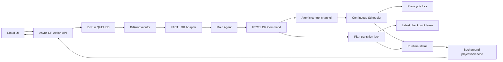
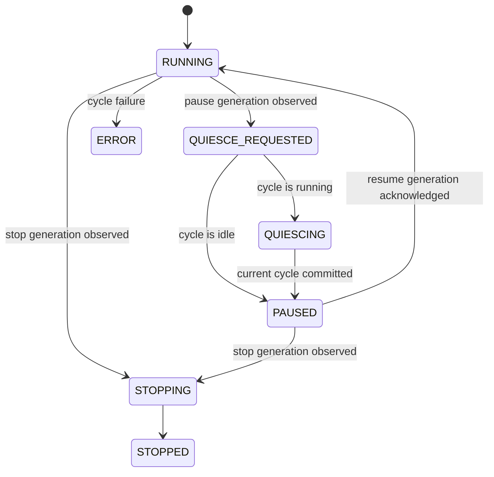
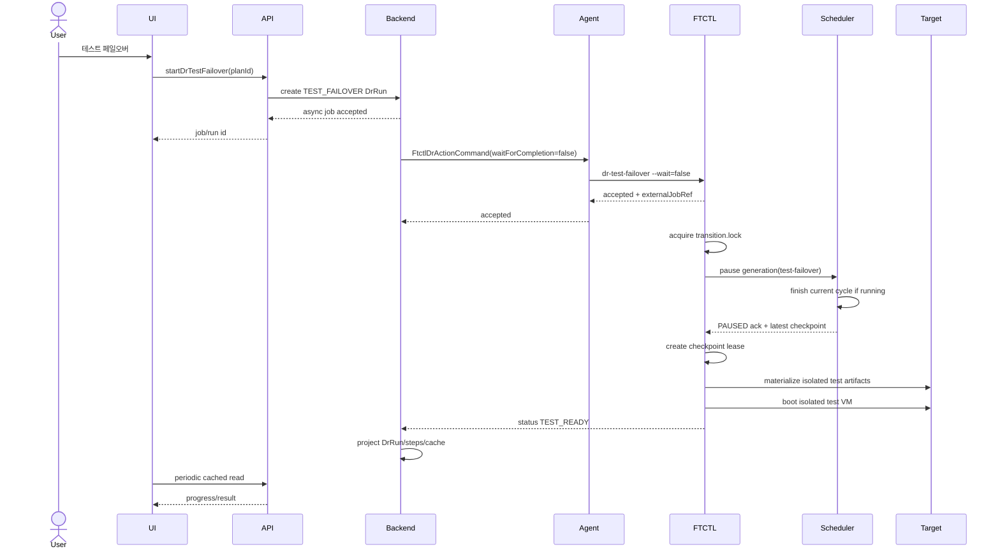

# Cross Hypervisor DR Continuous Sync Control And Quiesce Lock Design

- 문서 번호: 553
- 작성일: 2026-07-14
- 상태: 구현 전 상세 설계
- 적용 범위: Cloud UI, Cloud API, DR Backend, Mold Agent/KVM wrapper, FTCTL DR runtime, Cloud DB projection
- 선행 문서:
  - [503-cross-hypervisor-dr-state-machine-and-worker-design-20260630.md](503-cross-hypervisor-dr-state-machine-and-worker-design-20260630.md)
  - [507-cross-hypervisor-dr-cloud-api-command-design-20260630.md](507-cross-hypervisor-dr-cloud-api-command-design-20260630.md)
  - [508-cross-hypervisor-dr-cloud-backend-wiring-design-20260630.md](508-cross-hypervisor-dr-cloud-backend-wiring-design-20260630.md)
  - [510-cross-hypervisor-dr-ftctl-runtime-contract-design-20260630.md](510-cross-hypervisor-dr-ftctl-runtime-contract-design-20260630.md)
  - [515-cross-hypervisor-dr-async-action-remediation-plan-20260701.md](515-cross-hypervisor-dr-async-action-remediation-plan-20260701.md)
  - [522-cross-hypervisor-dr-protection-failover-failback-sequence-design-20260701.md](522-cross-hypervisor-dr-protection-failover-failback-sequence-design-20260701.md)
  - [552-cross-hypervisor-dr-async-read-consistency-and-live-cache-ui-design-20260714.md](552-cross-hypervisor-dr-async-read-consistency-and-live-cache-ui-design-20260714.md)

## 1. 목적

지속 복제 Scheduler가 동작 중인 정상 DR Plan에서 `dr-test-failover`, `dr-sync-pause`, `dr-release`와 같은 제어 명령이 전역 FTCTL lock에 막히는 문제를 구조적으로 해결한다.

이 설계의 핵심은 다음과 같다.

1. 지속 복제 프로세스의 생명주기와 배타 lock의 생명주기를 분리한다.
2. 복제 사이클과 DR 전환 작업을 Plan 단위로 직렬화한다.
3. 테스트 페일오버와 계획 페일오버는 진행 중인 사이클을 강제 중단하지 않고 안전 지점에서 quiesce한다.
4. UI/API 요청은 엔진 완료를 기다리지 않으며, Cloud Backend와 Agent/FTCTL이 비동기 상태 전이를 담당한다.
5. 기존 RBD/QCOW2 FT/HA 성공 경로의 전역 lock과 blockcopy/xcolo 동작은 변경하지 않는다.

## 2. 실환경 Preflight 결과

검증 대상 Plan:

- Plan UUID: `73d63741-7356-49cb-a3a6-f8a3b56597de`
- 방향: `VMWARE_TO_KVM`
- 원본 VM: `vm-4486`
- 대상 VM: `i-2-244-VM`
- FTCTL Run UUID: `60496998-788a-498c-82ef-fa6c854ffa26`
- Worker host: `10.10.32.1`

### 2.1 데이터 경로

확인 결과:

- Plan state: `SYNCING`
- Effective state: `READY`
- FTCTL step: `target-checkpoint-ready`
- Scheduler state: `RUNNING`
- 최초 full seed와 후속 incremental checkpoint가 정상 완료됨
- 마지막 확인 checkpoint sequence: `4`
- 마지막 완료 checkpoint state: `READY`
- 확인 시 target ready RPO: `77`초, 목표 RPO `300`초 이내
- CBT 활성화 및 VMware VDDK source open 성공
- 대상 RBD 100 GiB, 대상 VM/볼륨/NIC 생성 완료
- 대상 VM `boot.mode=SECURE`, `io.policy=io_uring`, `iothreads=true`

따라서 복제 데이터 경로는 PASS이다.

### 2.2 제어 경로

비파괴 `dr-test-failover --dry-run` 준비성 검사는 다음 응답으로 거절됐다.

```json
{
  "command": "dr-test-failover",
  "result": "locked",
  "lock_file": "/run/ablestack-vm-ftctl/lock",
  "holder_pid": "4077169",
  "holder_command": "dr-sync-start",
  "exit_code": 20,
  "retryable": true,
  "retry_after_sec": 2
}
```

같은 시점의 runtime evidence:

```text
/run/ablestack-vm-ftctl/lock.meta
  pid=4077169
  command=dr-sync-start

scheduler/control.state
  command=run

scheduler pid
  4077169
```

Scheduler 프로세스와 global lock holder가 동일하다. 이는 외부의 우연한 경합이 아니라 현재 프로세스 구조가 만드는 자기 잠금이다.

## 3. 오류 원인

### 3.1 실제 호출 경로

```text
Cloud API
  -> DrRunExecutorImpl
  -> FtctlDrUnifiedActionAdapter
  -> FtctlDrActionCommand
  -> LibvirtFtctlDrActionCommandWrapper
  -> ablestack_vm_ftctl dr-sync-start --wait=false
     -> parent가 accepted state 기록
     -> parent global lock 해제
     -> FTCTL_DR_RUNTIME_WORKER=1 worker 시작
        -> CLI bootstrap에서 global lock 재획득
        -> --wait=true로 Scheduler loop 전체 실행
        -> process 종료 전까지 global lock 보유
```

현재 `ftctl_command_requires_lock()`은 read-only 명령을 제외한 대부분의 명령에 lock을 요구한다. Background worker도 동일한 CLI entrypoint를 통과하므로 `dr-sync-start` worker가 global lock을 다시 잡는다.

### 3.2 retry로 해결되지 않는 이유

Cloud Backend는 retryable lock을 `RETRYING`으로 바꾸고 재시도하지만 lock holder는 일시 작업이 아니라 지속 Scheduler이다. Scheduler가 정상인 동안 lock이 해제되지 않으므로 bounded retry는 결국 `DR_ENGINE_BUSY_TIMEOUT`으로 끝난다.

따라서 retry 횟수나 timeout 증가로 해결하면 안 된다.

## 4. 설계 원칙

1. **Global legacy lock 보존**: 기존 FT/HA, blockcopy, xcolo 명령의 lock 정책은 변경하지 않는다.
2. **DR Plan 격리**: 서로 다른 DR Plan은 동시에 복제할 수 있어야 한다.
3. **Cycle 단위 배타성**: Scheduler는 실제 전송/commit 구간에서만 cycle lock을 보유한다.
4. **Control out-of-band**: pause/resume/stop 요청은 data-plane lock 없이 원자적으로 기록된다.
5. **Transition 직렬화**: test failover/failover/failback/reprotect/release는 Plan별 하나만 실행한다.
6. **Checkpoint lease**: 테스트/페일오버가 사용하는 최신 완료 체크포인트는 작업 종료까지 정리 대상에서 제외한다.
7. **비동기 UI/API**: 사용자 요청은 `DrRun` 생성과 queueing까지만 기다린다.
8. **상태 단조성**: 제어 작업 실패가 정상 보호 상태를 `ERROR`로 강등시키지 않는다.

## 5. 목표 아키텍처



## 6. FTCTL lock 모델

### 6.1 경로

Plan runtime 아래에 lock을 분리한다.

```text
/run/ablestack-vm-ftctl/dr-runtime/plans/<plan>/locks/
  plan.lock
  cycle.lock
  transition.lock
  checkpoint-<sequence>.lease
```

| Lock | 보유 구간 | 소유자 | 금지 사항 |
|---|---|---|---|
| `plan.lock` | profile/run state 원자 갱신 | 짧은 CLI parent | Scheduler sleep 동안 보유 금지 |
| `cycle.lock` | source snapshot/CBT read부터 target durable commit까지 | Scheduler cycle | RPO interval sleep 동안 보유 금지 |
| `transition.lock` | test/failover/failback/reprotect/release 전환 | 해당 action worker | cycle 완료 대기 전에 cycle lock을 잡지 않음 |
| checkpoint lease | 선택한 완료 복제본 사용 기간 | test/failover session | cleanup 전 자동 삭제 금지 |

### 6.2 lock 순서

전환 작업은 다음 순서를 따른다.

```text
transition.lock
  -> control generation 기록
  -> Scheduler PAUSED ack 대기
  -> cycle.lock이 비어 있음을 확인
  -> latest completed checkpoint lease 생성
  -> test/failover materialization
```

Scheduler는 `cycle.lock`만 사용하며 `transition.lock`을 획득하지 않는다. 이 규칙으로 교착을 방지한다.

### 6.3 CLI bootstrap 변경

`lib/ftctl/libvirt_wrap.sh`의 `ftctl_command_requires_lock()`은 DR command를 legacy global lock에서 분리한다.

규범 동작:

```bash
case "${command}" in
  dr-status|dr-capabilities|dr-target-materialized)
    return 1
    ;;
  dr-sync-pause|dr-sync-resume|dr-release|dr-cancel)
    return 1  # atomic control channel을 사용
    ;;
  dr-sync-start)
    [[ "${FTCTL_DR_RUNTIME_WORKER:-0}" == "1" ]] && return 1
    return 1  # ftctl_dr_plan_lock_acquire()가 짧게 직렬화
    ;;
  dr-test-failover|dr-test-cleanup|dr-failover|dr-failback|dr-reprotect)
    return 1  # runtime transition lock으로 직렬화
    ;;
esac
```

위 `return 1`은 무잠금 실행을 뜻하는 것이 아니라 legacy global lock을 사용하지 않는다는 의미다. 각 명령은 `dr_runtime.sh` 내부에서 명시적인 Plan lock을 사용한다.

### 6.4 신규 helper

`lib/ftctl/dr_lock.sh`를 추가하거나 `dr_runtime.sh`의 lock helper를 분리한다.

```bash
ftctl_dr_lock_path <plan> <plan|cycle|transition>
ftctl_dr_lock_try_acquire <plan> <kind> <owner-command> <owner-run>
ftctl_dr_lock_acquire_bounded <plan> <kind> <timeout-sec> <owner-command> <owner-run>
ftctl_dr_lock_release <kind>
ftctl_dr_checkpoint_lease_create <plan> <sequence> <session-id>
ftctl_dr_checkpoint_lease_remove <plan> <sequence> <session-id>
ftctl_dr_checkpoint_is_leased <plan> <sequence>
```

Lock metadata에는 `plan_uuid`, `run_uuid`, `command`, `pid`, `started_at`을 기록한다.

## 7. Scheduler control protocol

### 7.1 control request

`control.state`는 임시 파일 작성 후 `mv`로 원자 교체한다.

```text
version=2
generation=7
command=pause
reason=test-failover
owner_run_uuid=<test-run-uuid>
resume_after_cleanup=true
requested_at=<ISO-8601>
```

### 7.2 acknowledgment

Scheduler는 별도 `control.ack`를 기록한다.

```text
version=2
generation=7
state=PAUSED
cycle_state=IDLE
checkpoint_sequence=4
checkpoint_ref=ftctl:<plan>:<sync-run>:4
acknowledged_at=<ISO-8601>
```

요청 generation과 ack generation이 같아야 제어 요청이 완료된 것으로 판단한다.

### 7.3 Scheduler 상태



진행 중인 복제 사이클은 강제로 중단하지 않는다. source snapshot과 target commit을 완료한 뒤 최신 완료 체크포인트를 갱신하고 `PAUSED` ack를 기록한다.

### 7.4 timeout

- `FTCTL_DR_QUIESCE_TIMEOUT_SEC` 기본값: `max(600, 2 * schedule.intervalSeconds)`
- timeout은 Agent command나 API thread가 아니라 background action worker에서 처리한다.
- timeout 발생 시 `DR_CONTROL_QUIESCE_TIMEOUT`으로 해당 Run만 실패시킨다.
- 기존 continuous sync는 계속 유지하거나 안전하게 resume한다.

## 8. Test Failover 상세 흐름

DR은 임의 시점 복구 기능이 아니다. 테스트 페일오버는 사용자가 과거 시점을 고르는 방식이 아니라 **가장 최근에 완료된 내구성 복제본**을 사용한다.



Test cleanup:

1. test VM 정지 및 삭제
2. test overlay/clone 삭제
3. checkpoint lease 해제
4. `resume_after_cleanup=true`이면 resume generation 기록
5. Scheduler `RUNNING` ack 확인
6. 다음 incremental checkpoint 완료 확인

## 9. Pause, Release, Failover 계약

### 9.1 Pause/Resume

- `dr-sync-pause`와 `dr-sync-resume`은 global lock을 요구하지 않는다.
- 명령은 control generation을 기록하고 즉시 `accepted`를 반환한다.
- 상태 완료는 `dr-status`의 ack generation으로 투영한다.

### 9.2 Release/Cancel

- stop generation은 global lock보다 먼저 기록할 수 있어야 한다.
- Scheduler가 current cycle을 완료하고 `STOPPED` ack를 기록한 뒤 runtime/profile/lease cleanup을 수행한다.
- stale PID와 lock file을 먼저 삭제하는 방식은 금지한다.

### 9.3 Planned Failover

- Test Failover와 동일한 quiesce protocol을 사용한다.
- 최신 완료 체크포인트를 lease하고 target promotion을 수행한다.
- 성공 후 Scheduler는 자동 resume하지 않고 active side 전환과 reprotect를 기다린다.

### 9.4 Disaster Failover

- source 접근 불가 정책이 확인된 경우 기존 완료 체크포인트를 lease한다.
- source cycle을 기다릴 수 없으므로 fencing/authority 확인 후 transition lock 아래에서 target을 승격한다.

## 10. UI 상세 설계

적용 파일:

- `ui/src/components/dr/DrActionToolbar.vue`
- `ui/src/utils/dr/resourceActions.js`
- `ui/src/views/infra/dr/DrPlanOverview.vue`
- `ui/src/components/dr/DrRunProgress.vue`

변경 내용:

1. `actioneligibility` Boolean map은 하위 호환을 위해 유지한다.
2. 신규 `actionreadiness`를 사용해 disabled reason과 필요한 자동 전이를 표시한다.
3. Scheduler가 `RUNNING`이어도 자동 quiesce 가능하면 Test Failover 버튼은 활성화한다.
4. 클릭 후 UI는 API job/run id를 받은 즉시 modal을 닫고 다른 작업을 허용한다.
5. 전체 화면 loading을 사용하지 않고 해당 action과 run progress만 pending으로 표시한다.
6. raw `locked`, PID, lock path는 일반 사용자에게 노출하지 않는다.
7. 진행 단계는 다음 사용자 용어로 표시한다.
   - 동기화 안전 지점 준비
   - 최신 복제본 확정
   - 테스트 환경 준비
   - 테스트 가상머신 시작
8. polling은 cache 기반이며 Agent/FTCTL을 직접 호출하지 않는다.

`actionreadiness`가 stale이면 버튼을 무조건 실행시키지 않고 `상태 확인 중`으로 표시한 뒤 background projection 갱신을 기다린다.

## 11. API 상세 설계

### 11.1 응답 호환성

`DrPlanResponse`에 다음 필드를 추가한다.

```java
@SerializedName("actionreadiness")
private Map<String, DrActionReadinessResponse> actionReadiness;
```

```java
public class DrActionReadinessResponse {
    private boolean eligible;
    private String reasonCode;
    private String message;
    private boolean coordinationRequired;
    private String requiredTransition;
    private String schedulerState;
    private String controlState;
    private Long projectionAgeSeconds;
}
```

예시:

```json
{
  "actioneligibility": {
    "testFailover": true
  },
  "actionreadiness": {
    "testFailover": {
      "eligible": true,
      "coordinationRequired": true,
      "requiredTransition": "QUIESCE_SYNC",
      "schedulerState": "RUNNING",
      "controlState": "RUN",
      "projectionAgeSeconds": 2
    }
  }
}
```

### 11.2 Action API

- `startDrTestFailover`는 Agent/FTCTL 완료를 기다리지 않는다.
- API thread는 eligibility 검증, `DrRun(QUEUED)` 생성, executor queueing까지만 수행한다.
- API에서 synchronous Agent preflight를 호출하지 않는다.
- cache가 오래됐거나 control protocol v2 capability가 없으면 `DR_CONTROL_STATE_STALE` 또는 `DR_CONTROL_PROTOCOL_UNSUPPORTED`로 Run 생성 전에 거절한다.

## 12. Backend 상세 설계

### 12.1 신규 모델과 서비스

```text
com.cloud.dr.DrActionReadiness
com.cloud.dr.DrActionReadinessService
com.cloud.dr.DrActionReadinessServiceImpl
org.apache.cloudstack.api.response.dr.DrActionReadinessResponse
```

`DrActionReadinessService`는 DB와 `dr_plan_view_cache`만 읽는다. API 요청 중 Agent 호출은 금지한다.

```java
DrActionReadiness evaluate(DrPlanVO plan, String action);
Map<String, DrActionReadiness> evaluateAll(DrPlanVO plan);
```

Test Failover eligibility:

```text
admin enabled
AND no active transition run
AND target materialized
AND latest completed checkpoint READY
AND FTCTL capability controlProtocolVersion >= 2
AND control projection fresh
AND no active test session
AND scheduler state in RUNNING, PAUSED
```

`RUNNING`은 blocker가 아니며 `coordinationRequired=true`가 된다.

### 12.2 DrPlanServiceImpl

`getActionEligibility()`의 `targetReady` 단독 판정을 `DrActionReadinessService`로 위임한다. 기존 Boolean map은 `readiness.isEligible()` 값으로 생성한다.

### 12.3 DrRunExecutorImpl

Run step을 다음과 같이 확장한다.

| 순서 | step | 의미 |
|---:|---|---|
| 10 | `prepare` | plan/target/checkpoint 검증 |
| 20 | `quiesce-sync` | Scheduler pause 요청과 ack 대기 |
| 30 | `checkpoint-lease` | 최신 완료 체크포인트 고정 |
| 40 | `dispatch-agent` | Agent acceptance |
| 50 | `test-materialization` | 격리 리소스 생성 |
| 60 | `test-power-on` | 테스트 VM 시작 |
| 100 | `completed` | TEST_READY 투영 |

현재 `retryRun()`은 모든 retryable lock을 같은 방식으로 재시도한다. 변경 후:

- 같은 Plan의 `dr-sync-start`가 holder인 경우는 engine self-conflict로 재시도하지 않는다.
- control protocol v2 엔진에서는 FTCTL 내부 quiesce로 처리한다.
- 다른 transition이 holder인 경우에만 `DR_ENGINE_BUSY_RETRYABLE`을 사용한다.
- retry budget 소진 시 Test Failover Run만 실패시키고 Plan 보호 상태는 유지한다.

`failRun()`은 run type에 따라 plan 영향도를 분리한다.

```java
private boolean shouldDegradeProtection(DrRunVO run, String errorCode) {
    return RUN_TYPE_SYNC.equals(run.getRunType())
            && isDataPlaneTerminalError(errorCode);
}
```

Test Failover/cleanup/control 실패는 `dr_run`과 event에 기록하되 정상 latest checkpoint가 존재하면 Plan은 `READY/SYNCING`을 유지한다.

### 12.4 Projection

`FtctlDrRuntimeProjectionAdapter`는 다음 필드를 파싱한다.

```text
control_protocol_version
control_generation
control_ack_generation
control_command
control_state
scheduler_state
cycle_state
transition_state
transition_owner_run_uuid
checkpoint_lease_sequence
checkpoint_lease_session_id
```

Projection scheduler가 이를 cache snapshot에 반영한다.

## 13. Agent 상세 설계

적용 파일:

- `core/.../FtctlDrActionCommand.java`
- `core/.../FtctlDrStatusAnswer.java`
- `plugins/hypervisors/kvm/.../LibvirtFtctlDrActionCommandWrapper.java`
- `plugins/hypervisors/kvm/.../LibvirtFtctlDrStatusCommandWrapper.java`
- `plugins/hypervisors/kvm/.../LibvirtFtctlDrCommandHelper.java`

규칙:

1. Test Failover action은 `waitForCompletion=false`를 유지한다.
2. wrapper는 `--wait=false --json`으로 acceptance만 기다린다.
3. quiesce 완료를 wrapper process에서 polling하지 않는다.
4. 상태는 기존 `FtctlDrStatusCommand` background projection 경로로 수집한다.
5. Answer에 control generation/state를 typed field로 추가한다.
6. `result=locked`가 같은 Plan Scheduler holder인 경우 `DR_CONTROL_PROTOCOL_CONFLICT`로 식별해 일반 retryable busy와 구분한다.

`dr-capabilities`에는 다음을 추가한다.

```json
{
  "controlProtocolVersion": 2,
  "planScopedLocks": true,
  "cycleScopedLock": true,
  "quiesceBeforeTestFailover": true,
  "checkpointLease": true
}
```

## 14. FTCTL 상세 구현 설계

### 14.1 변경 파일

| 파일 | 변경 |
|---|---|
| `bin/ablestack_vm_ftctl.sh` | DR command의 legacy global lock 진입 제거 |
| `lib/ftctl/libvirt_wrap.sh` | command lock policy를 legacy/DR로 분리 |
| `lib/ftctl/dr_lock.sh` | Plan/cycle/transition/checkpoint lease helper 추가 |
| `lib/ftctl/dr_scheduler.sh` | cycle lock, generation control, ack state 구현 |
| `lib/ftctl/dr_runtime.sh` | action별 quiesce/transition/checkpoint lease orchestration |
| `bin/ablestack_vm_ftctl_selftest.sh` | lock/quiesce/concurrency 회귀 테스트 추가 |

### 14.2 Scheduler loop 의사 코드

```bash
while true; do
  request="$(ftctl_dr_control_read "${plan}")"
  case "${request.command}" in
    stop) acknowledge_stopped_after_safe_point ;;
    pause) acknowledge_paused_if_idle_or_finish_current_cycle ;;
  esac

  ftctl_dr_cycle_lock_acquire "${plan}" || continue
  request="$(ftctl_dr_control_read "${plan}")"
  if [[ "${request.command}" == "pause" || "${request.command}" == "stop" ]]; then
    ftctl_dr_cycle_lock_release
    continue
  fi
  run_replication_cycle
  commit_completed_checkpoint
  ftctl_dr_cycle_lock_release
  acknowledge_pending_control
  sleep_without_any_lock
done
```

### 14.3 Test Failover worker 의사 코드

```bash
ftctl_dr_transition_lock_acquire_bounded "${plan}" "${run}" || busy_transition
generation="$(ftctl_dr_control_request_pause "${plan}" "test-failover" "${run}")"
ftctl_dr_control_wait_ack "${plan}" "${generation}" "PAUSED" "${timeout}" || quiesce_timeout
checkpoint="$(ftctl_dr_latest_completed_checkpoint "${plan}")"
ftctl_dr_checkpoint_lease_create "${plan}" "${checkpoint.sequence}" "${run}"
materialize_test_session "${checkpoint}"
write_test_ready_status
```

오류 시 생성된 test artifact와 lease를 역순으로 정리한다. Scheduler 자동 resume 여부는 test session 생성 전/후에 따라 결정한다.

## 15. DB 상세 설계

### 15.1 DDL

이번 개선은 신규 테이블/컬럼을 요구하지 않는다.

기존 저장소를 사용한다.

| 저장소 | 용도 |
|---|---|
| `dr_run` | action 상태, retry/error, 현재 step |
| `dr_run_step` | quiesce/checkpoint lease/test materialization 단계 |
| `dr_event` | control request/ack/timeout/lease/resume 감사 이벤트 |
| `dr_plan_view_cache.snapshot_json` | 최신 runtime control/action readiness projection |

### 15.2 cache schema

기존 snapshot JSON에 다음을 추가하고 `version`을 증가시킨다.

```json
{
  "runtimeControl": {
    "protocolVersion": 2,
    "schedulerState": "RUNNING",
    "cycleState": "IDLE",
    "controlGeneration": 7,
    "acknowledgedGeneration": 7,
    "controlState": "RUN",
    "transitionState": "IDLE",
    "transitionOwnerRunUuid": null,
    "lastHeartbeatAt": "2026-07-14T08:13:35+09:00"
  },
  "actionReadiness": {
    "testFailover": {
      "eligible": true,
      "coordinationRequired": true,
      "requiredTransition": "QUIESCE_SYNC"
    }
  }
}
```

### 15.3 이벤트

추가 event type:

```text
DR.CONTROL.QUIESCE.REQUESTED
DR.CONTROL.QUIESCE.ACKNOWLEDGED
DR.CONTROL.QUIESCE.TIMEOUT
DR.CHECKPOINT.LEASED
DR.CHECKPOINT.RELEASED
DR.CONTROL.SYNC.RESUMED
```

## 16. 오류 코드

| 코드 | 의미 | Plan 영향 |
|---|---|---|
| `DR_CONTROL_PROTOCOL_UNSUPPORTED` | worker가 control protocol v2 미지원 | Run 거절, Plan 유지 |
| `DR_CONTROL_STATE_STALE` | control projection이 허용 freshness 초과 | Run 생성 전 거절 또는 상태 갱신 대기 |
| `DR_CONTROL_QUIESCE_TIMEOUT` | 안전 지점 pause ack timeout | 해당 Run 실패, Plan 보호 유지 |
| `DR_CONTROL_ACK_MISMATCH` | request/ack generation 불일치 | 해당 Run 실패, Plan 보호 유지 |
| `DR_TRANSITION_BUSY_RETRYABLE` | 다른 전환 작업이 transition lock 보유 | bounded retry |
| `DR_CHECKPOINT_LEASE_FAILED` | 최신 완료 체크포인트 고정 실패 | 해당 Run 실패, Plan 보호 유지 |
| `DR_ENGINE_BUSY_RETRYABLE` | 외부/legacy engine lock 경합 | 기존 retry 정책 |

동일 Plan의 정상 `dr-sync-start`가 holder인 경우는 더 이상 `DR_ENGINE_BUSY_RETRYABLE`이 아니어야 한다.

## 17. 테스트 설계

### 17.1 FTCTL selftest

1. `FTCTL_DR_RUNTIME_WORKER=1 dr-sync-start`가 global lock을 보유하지 않는다.
2. Scheduler sleep 중 global/plan/cycle lock이 모두 비어 있다.
3. 서로 다른 두 Plan의 cycle이 병렬 실행된다.
4. 같은 Plan의 두 cycle은 직렬화된다.
5. idle 상태의 pause 요청은 즉시 generation ack가 된다.
6. cycle 진행 중 pause 요청은 cycle commit 후 ack가 된다.
7. test failover는 ack된 latest completed checkpoint를 lease한다.
8. test cleanup 후 lease 제거와 Scheduler resume가 수행된다.
9. release는 stop ack 이후 runtime을 정리한다.
10. stale PID만으로 lock을 삭제하지 않는다.

### 17.2 Cloud unit test

- `DrPlanServiceImplTest`: Scheduler `RUNNING` + control v2 + target ready이면 testFailover eligible
- stale control cache이면 reason code 반환
- `DrRunExecutorImplTest`: test action lock/timeout 실패가 Plan을 `ERROR`로 바꾸지 않음
- `FtctlDrUnifiedActionAdapterTest`: control conflict와 unrelated transition busy 구분
- wrapper test: action은 `--wait=false`, status는 control fields parse
- response test: Boolean eligibility와 typed action readiness 동시 제공

### 17.3 실환경 수용 테스트

1. 새 Plan 생성 및 full seed 완료
2. incremental checkpoint 2회 이상 확인
3. Scheduler `RUNNING` 상태에서 Test Failover 클릭
4. API가 즉시 job/run id를 반환하는지 확인
5. FTCTL 상태가 `QUIESCE_REQUESTED -> PAUSED -> TEST_READY`로 전이하는지 확인
6. 테스트 VM이 격리 네트워크에서 부팅되는지 확인
7. Secure Boot, 디스크, NIC, 데이터 정합성 확인
8. Test cleanup 수행
9. Scheduler `RUNNING` 복귀와 다음 incremental checkpoint 확인
10. RPO가 목표 범위로 복귀하는지 확인

### 17.4 회귀 테스트

- RBD -> RBD FT
- RBD -> QCOW2 FT
- QCOW2 -> RBD FT
- QCOW2 -> QCOW2 FT
- 기존 HA pause/failover/failback/release

DR lock 변경이 legacy FT global lock 경로에 영향을 주지 않아야 한다.

## 18. 구현 순서

1. FTCTL Plan lock/control generation/cycle lock selftest 작성
2. FTCTL global lock 분리와 Scheduler cycle lock 구현
3. FTCTL test/pause/release quiesce orchestration 구현
4. Agent capability/status typed field 보강
5. Backend projection/cache runtimeControl 반영
6. Backend action readiness와 Run step/state 영향도 분리
7. API typed action readiness 응답 추가
8. UI action reason/progress 표시 보강
9. qemu GitHub Actions build와 Cloud 변경 Maven module/UI build
10. 32.x 배포 후 실환경 Test Failover 수용 테스트

## 18.1 Implementation update (2026-07-14)

The validated control contract is implemented as follows.

| Layer | Implemented behavior |
|---|---|
| FTCTL | DR commands bypass the legacy FT/HA global lock and use plan, cycle, and transition scoped locks. |
| FTCTL scheduler | `control.state` and `control.ack` use protocol version 2 with monotonically increasing request and acknowledged generations. |
| FTCTL test failover | The scheduler is quiesced after the active cycle, the selected completed checkpoint is leased, and test materialization starts only after pause acknowledgement. |
| FTCTL test cleanup | Test artifacts and checkpoint lease are removed before the scheduler is resumed and acknowledged. |
| Agent | Status and capability answers carry control protocol, generation, cycle, transition, and lease state. |
| Backend | Coordinated actions require `control-protocol-v2`. A failed pause, resume, test failover, test cleanup, or release run no longer changes a healthy Plan to `ERROR`. |
| API | The Plan response exposes runtime control readiness and typed control state fields while preserving the Boolean action eligibility map. |
| DB/cache | No DDL change is required. Existing run status and protection view cache JSON persist the new control projection. |
| UI | Protection information displays replication control state, and coordinated action buttons explain when the control channel is not ready. |

The compatibility Boolean `actioneligibility` remains the command gate in this increment. Typed control fields provide reason-bearing state without breaking existing clients.

## 18.2 Build, deployment, and cleanup verification (2026-07-14)

### Build verification

| Target | Result |
|---|---|
| FTCTL selftests | Plan-scoped control, runtime actions, ABLESTACK checkpoint loop, VMware mock checkpoint loop, and test failover cleanup passed. |
| Cloud Maven modules | `core`, `plugins/hypervisors/kvm`, and `plugins/integrations/disaster-recovery` built successfully from the WSL ext4 clone. |
| Cloud unit tests | KVM wrapper tests passed 10 tests; DR service, executor, projection, and action adapter tests passed 24 tests. |
| Checkstyle | The DR integration module completed with zero violations. |
| Cloud UI | Production build completed successfully and locale JSON parsing passed. |
| FTCTL RPM | GitHub Actions run `29298420823` succeeded for commit `0cc36ee449cb7c65532e7f2252d2f92852ca7023`. |

The deployed FTCTL artifact is `ablestack_vm_ftctl-0.9.1-1.noarch.rpm`, with SHA-256 `a266779190f19f979a3fed0802e01bc2cc404c2105ab9d508acc680c5d67ded6`.

### Deployment verification

| Component | Verification |
|---|---|
| Management | `mold` is active, `/client/` returns HTTP 200, and `WEB-INF` remains present. |
| Management JAR | The active JAR contains the control fields and the `control-protocol-v2` adapter gate. Only changed classes were patched into the active JAR. |
| UI | The active bundle contains `runtimecontrolready`; both English and Korean locales contain the replication-control labels. |
| Agent | `mold-agent` is active on `10.10.32.1`, `10.10.32.2`, and `10.10.32.3`. |
| FTCTL | All three hosts run `ablestack_vm_ftctl-0.9.1-1.noarch`; the installed runtime contains `control-protocol-v2`. |
| Timer | `ablestack-vm-ftctl.timer` is active on all three hosts. |

### Retest cleanup verification

The previous test Plan `73d63741-7356-49cb-a3a6-f8a3b56597de` and its replica projection were cleaned after preserving a DB backup at `/root/dr-plan-26-cleanup-backup-20260714.sql`.

- Active DR Plan rows: 0
- Active replica, replica disk, restore point, and view-cache rows for the previous Plan: 0
- Target VM `22249c08-dcb8-46a1-8cb4-8fdeadb8231d`: expunging with a removal timestamp
- Target volume: expunged with a removal timestamp
- Target RBD image and libvirt domain: absent
- Plan runtime directory: absent from all three hosts
- Stale FTCTL lock metadata for the Plan: absent
- Routing hosts: all three Up

No DB DDL change is required for this control-protocol increment. The existing JSON projection columns carry the additional runtime control state.

## 19. AS-IS / TO-BE

| 구분 | AS-IS | TO-BE |
|---|---|---|
| Scheduler lock | `dr-sync-start` worker가 global lock을 수명주기 전체 보유 | 실제 복제 cycle에서만 Plan cycle lock 보유 |
| DR 병렬성 | 하나의 global lock이 모든 DR Plan 직렬화 | Plan 단위 lock으로 서로 다른 Plan 병렬 실행 |
| Pause | pause 명령 자체가 Scheduler lock에 차단 | out-of-band generation request와 ack |
| Test Failover | target ready이면 UI/API는 허용하지만 FTCTL 진입 시 self-lock | 비동기 quiesce 후 최신 완료 체크포인트 lease 및 테스트 실행 |
| Retry | 정상 Scheduler가 종료될 때까지 같은 lock 재시도 | self-conflict 제거, 실제 transition 경합만 bounded retry |
| Plan 상태 | Test action 실패도 Plan `ERROR`로 강등 가능 | 복제본이 정상인 제어 작업 실패는 Run만 실패 |
| API readiness | Boolean eligibility만 제공 | 호환 Boolean + typed action readiness/reason 제공 |
| Agent | lock result 전달 중심 | control protocol capability와 generation/state 전달 |
| DB | 제어 상태를 raw status JSON에서 추론 | 기존 cache JSON에 typed runtimeControl/actionReadiness 투영 |
| UI | 실행 후 raw engine busy 가능 | 즉시 async 접수, 안전 지점 준비 과정을 Run progress로 표시 |
| Cleanup | lock/PID 수동 정리 유혹 | stop ack, lease 해제, runtime 정리의 순서 보장 |

## 20. 완료 기준

- 지속 동기화 중 Test Failover 요청이 `holder_command=dr-sync-start` lock 오류로 실패하지 않는다.
- UI/API thread가 quiesce와 테스트 VM 부팅 완료를 기다리지 않는다.
- 진행 중 cycle은 손상 없이 완료되고 최신 완료 체크포인트가 테스트 기준으로 고정된다.
- Test cleanup 후 지속 증분 복제가 자동 재개된다.
- 제어 작업 실패가 정상 DR 보호 상태를 훼손하지 않는다.
- 기존 4개 FT storage 방향과 HA/FT lock 동작에 회귀가 없다.

## 21. 2026-07-14 Normative Cutover Completion Gate

본 문서의 quiesce, checkpoint lease, transition lock은 cutover의 선행 제어
단계다. 현재 구현의 test artifact 생성은 VM boot 완료를 의미하지 않는다.

Test Failover worker는 checkpoint lease 이후 writable layer, guest inspection,
VirtIO preparation, isolated domain start, boot validation을 수행해야 한다.
`TEST_RUNNING` 이전에 transition 결과를 성공으로 투영하지 않는다.

Test cleanup은 guest/domain artifact 정리 후 checkpoint lease를 해제하고
Scheduler resume acknowledgment를 기다린다. Guest preparation 실패는 해당
Run을 실패시키지만 정상 복제 Plan을 `ERROR`로 강등하지 않는다.

상세 구현 계약은 다음 문서가 우선한다.

- `554-cross-hypervisor-dr-vmware-to-kvm-cutover-and-virtio-bootstrap-design-20260714.md`

## 22. 2026-07-17 Runtime-Authority Reconciliation Addendum

The control protocol remains valid, but acknowledged RUNNING is not evidence
that a scheduler process is alive and owns the Plan. Resume and restart use
one idempotent ensure-running primitive that validates PID, process command
line, Plan/run ownership, transition state, and runtime generation.

The FTCTL timer performs local reconciliation so Cloud availability is not a
continuous-protection dependency. Current ERROR, dead scheduler, stale
runtime, or overdue RPO blocks normal Test Failover and Failover even when a
previous durable target exists.

The normative cross-layer contract is section 17 onward of
558-cross-hypervisor-dr-strict-status-storage-format-and-query-boundary-design-20260716.md.

## 23. 2026-07-20 Plan Singleton And Identity Correction

Control protocol v2 removed the global-lock self-conflict, but generation/state
acknowledgment alone does not prove which process owns the Plan. Live preflight
found multiple run-scoped PID files, a surviving old-run worker, a dead latest
resume worker, and a control ACK that named the latest run. Therefore the
control contract in sections 7 and 22 is necessary but not sufficient.

The corrected contract uses a Plan-scoped scheduler session, lifetime owner
lock, lease epoch, process start token, identity-bearing ACK, and Plan-wide
cycle sequence. `DrRun` remains a short operation record. Protection state,
replication activity, and scheduler health are projected independently.

The normative replacement for scheduler ownership, generation ordering, DB
fields, UI states, migration, and acceptance testing is
`564-cross-hypervisor-dr-plan-scheduler-singleton-authority-design-20260720.md`.

## 24. 2026-07-21 Cleanup Resume Projection Correction

The control protocol and automatic resume implementation are valid, but Cloud
must not query a terminal `TEST_CLEANUP` Run as the continuing protection
producer. RUNNING ACK proves control convergence; a newer durable checkpoint
and its Cloud projection prove resumed data protection.

Operation reconciliation, Plan authority projection, cycle projection, and
restore-point attribution are separate backend phases. The producer is taken
from the validated active worker/completed checkpoint, not from the status
request Run. The detailed correction is normative in document 565.

## 25. Agent Restart Durable Scheduler Correction - 2026-07-22

Continuous sync의 장기 worker는 Mold Agent 요청 process에서 fork하여 소유하지 않는다.
Agent는 `dr-sync-recover` 또는 start 접수만 수행하고, Plan별 systemd unit이
foreground Scheduler를 소유한다. 기존 committed baseline과 CBT cursor는 process
복구만으로 폐기하지 않는다.

복구 Run은 unit start 응답에서 끝나지 않는다. 새 worker identity ACK, heartbeat,
첫 durable Cycle commit까지 추적한다. valid baseline이면
`CBT_INCREMENTAL/RECOVERY_BASELINE_VALID`를 사용하며 Full Reseed는 reason-bearing
fallback에서만 허용한다. 상세 설계는 문서 568과 FTCTL 문서 439를 따른다.
