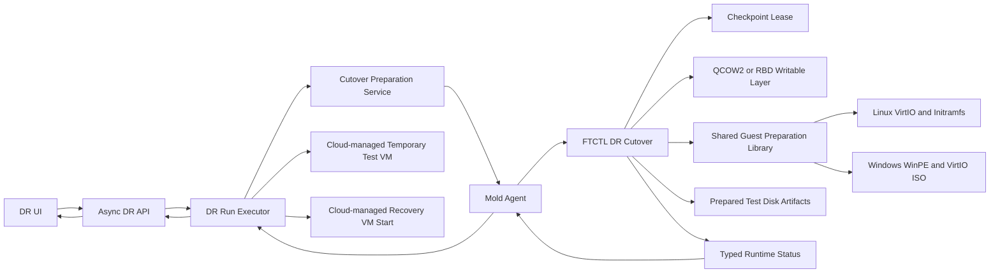

# Cross Hypervisor DR VMware To KVM Cutover And VirtIO Bootstrap Design

- Date: 2026-07-14
- Status: baseline implemented; real Failover manifest correction designed
- Scope: VMware source to ABLESTACK/KVM target
- Related: 510, 521, 522, 553, 561, 562

> Normative correction (2026-07-19):
> [562-cross-hypervisor-dr-test-artifact-contract-and-projection-isolation-design-20260719.md](562-cross-hypervisor-dr-test-artifact-contract-and-projection-isolation-design-20260719.md)
> defines the canonical RBD/file source locator, Cloud Test Session timing,
> failure cleanup, and protection/operation projection isolation. FTCTL must
> not infer provider or path from a bare target disk display reference.
>
> Normative real Failover contract (2026-07-22):
> [567-cross-hypervisor-dr-real-failover-cutover-manifest-and-rollback-design-20260722.md](567-cross-hypervisor-dr-real-failover-cutover-manifest-and-rollback-design-20260722.md)
> separates the Plan profile, selected durable checkpoint, and runtime target
> disk map; requires canonical `rbd:` locators; and assigns target VM start and
> active-side promotion to Cloud after FTCTL reports `CUTOVER_READY`.

## 1. Purpose

This document defines the missing boot conversion and VM start path after a
VMware checkpoint has been replicated to ABLESTACK. It covers both isolated
Test Failover and real Failover.

The design preserves the following ownership boundary.

- Cloud UI calls only Cloud API.
- Cloud API accepts the request asynchronously and creates a DR Run.
- Cloud backend resolves policy, target placement, and Cloud VM lifecycle.
- Mold Agent transports typed commands and reports typed status.
- FTCTL owns checkpoint lease, writable test layers, and guest preparation.
- Cloud owns temporary Test Failover VM, volume, network, host placement, and
  the complete customer workload lifecycle.
- The existing `ablestack_v2k` migration workflow is not used as the DR
  replication engine. Only its proven guest preparation primitives are shared.

## 2. Current verdict and root cause

Current VMware to KVM sync is able to produce a durable checkpoint and a
powered-off target VM. It is not yet a complete Test Failover implementation.

`ftctl_dr_runtime_materialize_test_artifacts()` currently creates qcow2 test
overlays and records metadata. It does not perform any of the following.

1. Detect the guest OS from the selected checkpoint.
2. Enable VirtIO drivers in the guest.
3. Rebuild Linux initramfs.
4. Run Windows WinPE VirtIO bootstrap.
5. Return a validated artifact manifest for Cloud-managed test VM creation.
6. Validate guest boot completion.

The target VM hardware metadata can be correct while the guest is still unable
to boot. `boot.mode=SECURE`, `rootDiskController=scsi`, `io.policy=io_uring`,
and `iothreads=true` describe virtual hardware; they do not install guest
drivers.

## 3. Preflight evidence

The following non-destructive checks were performed on `10.10.32.1`.

| Check | Result |
|---|---|
| V2K `engine.sh` and `orchestrator.sh` shell syntax | PASS |
| `/usr/share/virtio-win/virtio-win.iso` | present |
| ABLESTACK V2K WinPE ISO | present |
| `guestmount`, `virt-customize`, `virt-inspector` | present |
| `dracut`, `lsinitrd` | present |
| Temporary libguestfs filesystem inspection | PASS |
| Temporary qcow2 backing overlay create and cleanup | PASS |
| Temporary RBD snapshot/protect/clone and cleanup | PASS |
| Existing V2K Linux VirtIO bootstrap | present |
| Existing V2K Windows WinPE VirtIO bootstrap | present |
| Current FTCTL guest conversion path | absent |

The result proves that the 32.x host has the required runtime assets and that
both file-backed and RBD writable-layer designs are executable. It does not
replace an end-to-end guest boot test.

## 4. Design principles

1. Never modify the continuously replicated disk during Test Failover.
2. Apply guest conversion only to a checkpoint-derived writable layer.
3. For real Failover, stop replication and seal the final checkpoint before
   modifying the recovery disk.
4. Do not mark Test Failover successful until the Cloud-managed temporary test
   VM is running and the configured boot validation has passed.
5. Do not mark real Failover successful until the Cloud-managed target VM has
   started and boot validation has passed.
6. Test VMs use a selected Cloud isolated network by default and must never
   inherit a production network implicitly. `NO_NIC` is a separate explicit
   diagnostic mode.
7. V2K CLI behavior and Phase1/Phase2 migration semantics remain unchanged.
8. Every artifact is keyed by Plan UUID, Run UUID, checkpoint generation, and
   disk index so retry and cleanup are idempotent.

## 5. Target architecture



## 6. Shared guest preparation library

### 6.1 New qemu package files

Create the following namespaced library files.

```text
lib/guestprep/common.sh
lib/guestprep/inspect.sh
lib/guestprep/linux_virtio.sh
lib/guestprep/windows_winpe.sh
lib/guestprep/domain_xml.sh
lib/ftctl/dr_cutover.sh
lib/ftctl/dr_cutover_storage.sh
```

`lib/v2k/engine.sh` must keep its public functions. Existing V2K functions
become compatibility wrappers around `guestprep_*` functions. No V2K CLI,
manifest, phase, event name, or default behavior may change.

### 6.2 Guest inspection contract

`guestprep_inspect <root-disk-ref> <output-json>` writes:

```json
{
  "schemaVersion": 1,
  "osFamily": "LINUX",
  "osId": "rocky",
  "osVersion": "10",
  "architecture": "x86_64",
  "firmware": "EFI",
  "secureBoot": true,
  "rootDevice": "/dev/sda3",
  "virtioReady": false,
  "qgaDetected": true
}
```

Precedence is:

1. `virt-inspector` result from the selected writable layer.
2. VMware inventory hint from the Plan hardware contract.
3. Explicit Plan override.

Conflicting or unknown OS information fails closed with
`DR_GUEST_OS_UNRESOLVED` unless the Plan explicitly selects `NONE` and accepts
reduced boot assurance.

### 6.3 Linux preparation

`guestprep_linux_enable_virtio` must be idempotent.

1. Mount the root filesystem read-write through libguestfs.
2. Write `/etc/modules-load.d/ablestack-dr-virtio.conf` with
   `virtio_pci`, `virtio_scsi`, and `virtio_blk`.
3. Write a dracut configuration that forces the same drivers and `scsi_mod`.
4. Rebuild every bootable installed-kernel initramfs.
5. Verify each generated initramfs with `lsinitrd`.
6. Record before/after hashes and kernel versions in the status artifact.

Success requires at least one bootable kernel with all required drivers.

### 6.4 Windows preparation

`guestprep_windows_prepare_winpe` uses the proven V2K WinPE workflow.

1. Define an engine-owned helper domain using the writable root disk.
2. Attach the ABLESTACK WinPE ISO and `virtio-win.iso` read-only.
3. If source firmware is EFI Secure Boot, disable Secure Boot only for WinPE.
4. Start WinPE and wait for its explicit completion/shutdown marker.
5. Detach both ISOs.
6. Restore Secure Boot.
7. Verify that the VirtIO storage service and driver files are present offline.
8. Undefine the helper domain while preserving the prepared disk.

Timeout or an unverified shutdown is a failure, not a warning.

## 7. Writable-layer contract

### 7.1 Test Failover

Test Failover always uses a derived writable layer.

| Storage | Writable-layer implementation |
|---|---|
| file-backed qcow2 | `qemu-img create -f qcow2 -F qcow2 -b <checkpoint>` |
| RBD | snapshot, protect, and clone using Plan/Run-scoped names |

Naming:

```text
ftctl-drtest-<plan-short>-<run-short>-disk-<index>
ftctl-drtest-<plan-short>-<run-short>-checkpoint
```

Cleanup order for the customer test workload is Cloud test VM stop/expunge and
Cloud test-volume removal first. Cloud then requests FTCTL artifact cleanup:
writable layer remove, snapshot unprotect/remove, checkpoint lease release,
and scheduler resume. Only an engine-internal offline conversion helper domain
may be stopped/undefined by FTCTL.

### 7.2 Real Failover

After source fencing or planned shutdown and final synchronization:

1. Stop the scheduler and wait for stop acknowledgement.
2. Seal the final checkpoint.
3. Create a provider-specific rollback marker.
4. Prepare the final recovery disk in place.
5. Return `CUTOVER_READY` to Cloud.
6. Cloud starts the existing target VM through normal Cloud VM lifecycle.

RBD uses a pre-cutover snapshot. Qcow2 uses an internal snapshot when supported.
Unsupported rollback capability must be reported before source shutdown for
planned Failover.

## 8. Test Failover state machine

```text
ACCEPTED
  -> QUIESCE_REQUESTED
  -> CHECKPOINT_LEASED
  -> WRITABLE_LAYER_CREATING
  -> GUEST_INSPECTING
  -> GUEST_PREPARING
  -> ARTIFACTS_READY
  -> CLOUD_VOLUMES_IMPORTING
  -> CLOUD_VM_CREATING
  -> CLOUD_VM_STARTING
  -> CLOUD_VM_VALIDATING
  -> ACTIVE
  -> CLEANUP_REQUESTED
  -> CLOUD_VM_EXPUNGED
  -> CLOUD_VOLUMES_REMOVED
  -> ENGINE_ARTIFACTS_REMOVED
  -> CHECKPOINT_RELEASED
  -> REPLICATION_RESUMED
  -> COMPLETED
```

`ACTIVE` is the successful terminal state of the start action and is owned by
the Cloud test session. The session remains active until Stop Test Failover
removes both Cloud resources and FTCTL artifacts.

## 9. Real Failover state machine

```text
ACCEPTED
  -> SOURCE_QUIESCING_OR_FENCING
  -> FINAL_SYNC
  -> FINAL_CHECKPOINT_SEALED
  -> REPLICATION_STOPPED
  -> GUEST_PREPARING
  -> CUTOVER_READY
  -> TARGET_VM_STARTING
  -> BOOT_VALIDATING
  -> TARGET_ACTIVE
  -> COMPLETED
```

`activeSide=TARGET` must not be written before `TARGET_ACTIVE`.

## 10. UI design

### 10.1 Plan dialog

For VMware to ABLESTACK Plans, add a non-JSON Cutover Preparation section.

| Field | Type | Default |
|---|---|---|
| Guest preparation | select: Auto, Linux offline, Windows WinPE, None | Auto |
| Test network | network selector limited to isolated test networks | required |
| Boot validation | Guest Agent required, power-state only | Guest Agent required |
| Boot timeout | numeric seconds | 600 |

`None` requires an explicit risk acknowledgement and disables automatic PASS.

### 10.2 Action eligibility

Test Failover is enabled only when all conditions are true.

- control protocol v2 ready
- durable checkpoint ready
- target VM hardware contract complete
- `guest-bootstrap-v1` capability present
- storage-specific writable-layer capability present
- OS resolved or an explicit policy override exists
- isolated network mapping resolved
- no active cutover session

### 10.3 Progress and details

The Protection Information tab displays these typed fields without raw JSON.

- selected checkpoint
- writable layer state
- detected OS
- VirtIO preparation state
- Secure Boot restoration state
- test domain state
- boot validation state and elapsed time
- cleanup and replication-resume state

The button must remain Stop Test Failover while a session exists, including
partial failures that require cleanup.

## 11. API design

### 11.1 Plan fields

Add typed optional fields to create, update, preview, and Plan responses.

```text
guestpreparationpolicy=AUTO|LINUX_OFFLINE|WINDOWS_WINPE|NONE
testnetworkid=<network UUID>
bootvalidationpolicy=QGA_REQUIRED|POWER_STATE_ONLY
boottimeoutseconds=<60..3600>
```

### 11.2 Test Failover request

`startDrTestFailover` remains asynchronous and immediately returns an async job
and DR Run identifier. It may override only test-specific values:

```text
planid
restorepointid
testnetworkid
bootvalidationpolicy
boottimeoutseconds
```

No API request waits for guest preparation or VM boot.

### 11.3 Typed response

Add a `cutover` object to `DrRunResponse` and `DrPlanResponse`.

```json
{
  "sessionId": "uuid",
  "mode": "TEST",
  "state": "BOOT_VALIDATING",
  "checkpointSequence": 12,
  "osFamily": "WINDOWS",
  "guestPreparationState": "SUCCEEDED",
  "virtioState": "READY",
  "secureBootState": "RESTORED",
  "domainName": "ftctl-drtest-...",
  "powerState": "RUNNING",
  "bootValidationState": "WAITING_FOR_QGA",
  "cleanupRequired": true
}
```

## 12. Backend design

### 12.1 New classes

```text
com.cloud.dr.cutover.DrCutoverPreparationService
com.cloud.dr.cutover.DrCutoverPreparationServiceImpl
com.cloud.dr.cutover.DrCutoverSessionVO
com.cloud.dr.cutover.DrCutoverDiskVO
com.cloud.dr.cutover.dao.DrCutoverSessionDao
com.cloud.dr.cutover.dao.DrCutoverDiskDao
```

### 12.2 Existing classes to change

| Class | Change |
|---|---|
| `DrRunExecutorImpl` | Add cutover preparation and Cloud target start steps. Never declare action success from overlay creation alone. |
| `DrPlanServiceImpl` | Gate Test Failover and Failover using cutover readiness and capabilities. |
| `FtctlDrUnifiedActionAdapter` | Send typed cutover policy and map cutover-specific errors. |
| `FtctlDrRuntimeProjectionAdapter` | Project guest, writable layer, domain, boot, and cleanup states. |
| `DrTargetMaterializationServiceImpl` | Keep the real target VM powered off and provide its hardware contract to cutover preparation. |
| `DrResponseGenerator` | Build typed `cutover` response and reason-bearing eligibility. |

### 12.3 Test Failover orchestration

```java
acceptAsyncRun();
dispatchFtctlTestPrepare();
projectStatusWithoutBlockingApiThread();
reconcileArtifactsIntoCloudVolumes();
createAndStartCloudManagedTestVm();
finishRunOnlyWhen(testVmValidationPassed());
```

The executor worker may poll with a bounded timeout. The API thread must not.

### 12.4 Real Failover orchestration

FTCTL returns `CUTOVER_READY`; it does not directly start a Cloud-managed VM.
The backend then starts `DrReplicaVO.targetVmId` through the normal VM manager,
waits for the Agent boot-validation projection, and only then switches
`activeSide` to `TARGET`.

## 13. Agent design

Extend `FtctlDrActionCommand` with a typed `CutoverSpec`.

```java
class CutoverSpec {
    String mode;                    // TEST or FAILOVER
    String guestPreparationPolicy;
    String bootValidationPolicy;
    Integer bootTimeoutSeconds;
    String testNetworkBridge;
    String firmware;
    Boolean secureBoot;
    String targetVmInstanceName;
    List<CutoverDiskSpec> disks;
}
```

The KVM wrapper serializes this object into the Plan runtime profile. Secrets
are not included.

Extend `FtctlDrStatusAnswer` with typed fields matching the API `cutover`
object. Unknown fields remain backward compatible.

Agent preflight must report these capabilities:

```text
guest-bootstrap-v1
linux-virtio-offline-v1
windows-winpe-virtio-v1
test-domain-v1
writable-layer-qcow2-v1
writable-layer-rbd-v1
boot-validation-qga-v1
```

## 14. FTCTL design

### 14.1 Runtime files

```text
<plan>/cutover/<run>/session.json
<plan>/cutover/<run>/disks.json
<plan>/cutover/<run>/guest-inspection.json
<plan>/cutover/<run>/guest-preparation.json
<plan>/cutover/<run>/domain.xml
<plan>/cutover/<run>/boot-validation.json
```

### 14.2 `dr-test-prepare`

Replace metadata-only success with this workflow:

```bash
transition_begin
scheduler_pause_and_ack
checkpoint_lease_acquire
cutover_writable_layers_create
guestprep_inspect
guestprep_apply
artifact_manifest_validate_and_publish
state_set TEST_ARTIFACTS_READY
```

Cloud then imports the artifacts, creates and starts the temporary VM, and
performs boot validation. Every step writes status before and after execution.
Retry resumes from the last verified idempotent step.

### 14.3 `dr-test-artifact-cleanup`

Cloud first stops and expunges the temporary test VM and deletes its registered
test volumes. FTCTL cleanup is then accepted from artifact-ready, error, and
partially prepared states. It removes engine artifacts and the checkpoint lease
and reports every residual explicitly.

### 14.4 `dr-failover`

The FTCTL worker stops at `CUTOVER_READY`. Target Cloud VM start and final
active-side commit belong to Cloud backend.

## 15. DB design

### 15.1 `dr_cutover_session`

```sql
CREATE TABLE dr_cutover_session (
  id BIGINT UNSIGNED NOT NULL AUTO_INCREMENT,
  uuid VARCHAR(40) NOT NULL,
  plan_id BIGINT UNSIGNED NOT NULL,
  run_id BIGINT UNSIGNED NOT NULL,
  mode VARCHAR(16) NOT NULL,
  checkpoint_sequence BIGINT UNSIGNED DEFAULT NULL,
  state VARCHAR(64) NOT NULL,
  guest_os_family VARCHAR(32) DEFAULT NULL,
  guest_preparation_state VARCHAR(64) DEFAULT NULL,
  virtio_state VARCHAR(32) DEFAULT NULL,
  secure_boot_state VARCHAR(32) DEFAULT NULL,
  domain_name VARCHAR(255) DEFAULT NULL,
  boot_validation_state VARCHAR(64) DEFAULT NULL,
  cleanup_required TINYINT(1) NOT NULL DEFAULT 0,
  details_json MEDIUMTEXT DEFAULT NULL,
  error_code VARCHAR(128) DEFAULT NULL,
  error_message VARCHAR(1024) DEFAULT NULL,
  created DATETIME NOT NULL,
  updated DATETIME NOT NULL,
  removed DATETIME DEFAULT NULL,
  PRIMARY KEY (id),
  UNIQUE KEY uk_dr_cutover_session_uuid (uuid),
  KEY idx_dr_cutover_session_plan_active (plan_id, removed),
  KEY idx_dr_cutover_session_run (run_id)
) ENGINE=InnoDB DEFAULT CHARSET=utf8mb4;
```

### 15.2 `dr_cutover_disk`

```sql
CREATE TABLE dr_cutover_disk (
  id BIGINT UNSIGNED NOT NULL AUTO_INCREMENT,
  session_id BIGINT UNSIGNED NOT NULL,
  disk_index INT UNSIGNED NOT NULL,
  provider VARCHAR(32) NOT NULL,
  checkpoint_ref VARCHAR(1024) NOT NULL,
  writable_ref VARCHAR(1024) DEFAULT NULL,
  rollback_ref VARCHAR(1024) DEFAULT NULL,
  state VARCHAR(64) NOT NULL,
  details_json MEDIUMTEXT DEFAULT NULL,
  created DATETIME NOT NULL,
  updated DATETIME NOT NULL,
  removed DATETIME DEFAULT NULL,
  PRIMARY KEY (id),
  UNIQUE KEY uk_dr_cutover_disk_session_index (session_id, disk_index),
  KEY idx_dr_cutover_disk_session_active (session_id, removed)
) ENGINE=InnoDB DEFAULT CHARSET=utf8mb4;
```

Schema changes must be added to the current Europa upgrade path and clean
schema. Existing JSON cache remains a read-optimized projection, not the
authority for cleanup.

## 16. Error contract

| Error | Meaning | Retry |
|---|---|---|
| `DR_GUEST_OS_UNRESOLVED` | OS could not be resolved safely | after policy correction |
| `DR_GUEST_PREP_CAPABILITY_MISSING` | required host capability is absent | after host remediation |
| `DR_VIRTIO_PREPARATION_FAILED` | Linux or Windows driver preparation failed | bounded |
| `DR_SECURE_BOOT_RESTORE_FAILED` | Secure Boot could not be restored | no automatic start |
| `DR_TEST_NETWORK_NOT_ISOLATED` | selected network is not permitted for testing | after selection |
| `DR_TEST_DOMAIN_START_FAILED` | transient test domain failed to start | bounded |
| `DR_BOOT_VALIDATION_TIMEOUT` | configured validation did not pass | cleanup required |
| `DR_CUTOVER_ROLLBACK_UNAVAILABLE` | real Failover has no safe rollback marker | before source stop |
| `DR_CUTOVER_ARTIFACT_RESIDUAL` | cleanup left an artifact | operator remediation |

These failures fail the Run. They must not turn a healthy, still-replicating
Plan into `ERROR` unless replication itself has failed.

## 17. Test design

### 17.1 Unit and selftest

- Linux inspection and initramfs success/failure fixtures
- Windows WinPE state and Secure Boot restoration fixtures
- qcow2 and RBD writable-layer idempotency
- transition lock, checkpoint lease, cleanup after each partial failure
- capability gating and API compatibility
- backend must not switch active side before boot validation

### 17.2 Environment acceptance

Run at least these guests.

1. Rocky Linux EFI/Secure Boot, RBD target
2. Rocky Linux BIOS, qcow2 target
3. Windows EFI/Secure Boot, RBD target
4. Windows BIOS, qcow2 target

For each guest validate Test Failover, cleanup/resume, planned Failover, boot,
disk visibility, NIC isolation or mapping, QGA policy, and residual artifacts.

## 18. Implementation order

1. Extract shared guest preparation library with unchanged V2K compatibility.
2. Implement FTCTL qcow2/RBD writable-layer drivers and selftests.
3. Implement FTCTL guest inspection and Linux preparation.
4. Implement Windows WinPE helper-domain preparation.
5. Implement isolated transient test-domain lifecycle and boot validation.
6. Extend Agent command, status, and capabilities.
7. Add DB entities, DAOs, and upgrade schema.
8. Add backend cutover service, projection, eligibility, and cleanup recovery.
9. Extend API and UI typed fields and Test Failover dialog.
10. Run module builds, qemu GitHub Actions RPM build, deploy, and acceptance tests.

## 19. AS-IS / TO-BE

| Area | AS-IS | TO-BE |
|---|---|---|
| Test artifact | qcow2 metadata overlay only | qcow2 or RBD writable layer tracked per disk |
| Guest preparation | absent in FTCTL | shared Linux/Windows VirtIO preparation |
| V2K relationship | assets referenced indirectly | proven guest preparation primitives shared without using V2K as DR engine |
| Test VM | not defined or started | isolated Cloud-managed temporary VM built from FTCTL artifacts |
| Test success | overlay creation can appear successful | boot validation must pass |
| Real Failover | target promotion/power state delegated without guest conversion gate | FTCTL `CUTOVER_READY`, Cloud VM start, boot validation, then active-side commit |
| Secure Boot | hardware value copied only | WinPE temporary disable and verified restore |
| Storage | file overlay only | provider-specific qcow2 and RBD drivers |
| Cleanup | artifact directory removal | Cloud VM/volume cleanup followed by FTCTL artifact, snapshot, lease, and scheduler cleanup |
| UI | no guest/cutover readiness | typed preparation, boot, and cleanup progress |
| DB | Run JSON only | authoritative session and disk artifact tables plus cache projection |

## 20. Completion criteria

- Test Failover starts an isolated VM from the selected durable checkpoint.
- Linux and Windows guests boot with VirtIO storage and network support.
- EFI/Secure Boot state matches the source after preparation.
- A test failure cannot modify the continuously replicated disk.
- Stop Test Failover removes every transient artifact and resumes replication.
- Real Failover starts the Cloud-managed target VM and changes active side only
  after boot validation.
- Existing V2K migration behavior and the four FT storage combinations do not
  regress.

## 21. Implementation and deployment result (2026-07-14)

### 21.1 Implemented contract

| Layer | Implemented result |
|---|---|
| UI | Added typed test-boot validation mode/timeout fields and request validation. VMware-to-KVM actions are capability-gated. |
| API | Create, preview, update, and Test Failover commands accept typed boot-validation values instead of free-form JSON. |
| Backend | Runtime projection persists cutover session/disk state, waits for `CUTOVER_READY`, and idempotently starts the Cloud-owned target VM on the selected host. Active-side promotion is projected only after the target is running. |
| Agent | Typed guest-preparation and test-domain status fields are parsed and relayed without direct UI-to-host access. |
| FTCTL | Added shared V2K-compatible guest preparation, qcow2/RBD writable test layers, transient test-domain lifecycle, cleanup, and the `CUTOVER_READY` hand-off state. Source EFI/Secure Boot, CPU, memory, disk, and guest-family contracts are preserved in the preparation manifest. |
| DB | Added `dr_cutover_session` and `dr_cutover_disk` authoritative lifecycle tables and their upgrade/create schema definitions. |

### 21.2 Build and test evidence

- FTCTL shell syntax and selected DR selftests passed, including VMware source
  readiness, EFI/Secure Boot manifest preservation, Test Failover cleanup, and
  planned-failover checkpoint handling.
- Cloud changed-module Maven build passed for
  `plugins/integrations/disaster-recovery` and `plugins/hypervisors/kvm`.
- Disaster-recovery projection/action tests passed: 14 tests.
- KVM FTCTL command-wrapper tests passed: 10 tests.
- Cloud UI production build and locale JSON validation passed.

### 21.3 Artifact and deployment evidence

- FTCTL source commit: `741d76a36d8f8d3aefd96bd6f7e69ae95bc8a277`.
- GitHub Actions run: `29314550681`.
- Deployed package: `ablestack_vm_ftctl-0.9.1-1.noarch`.
- Package SHA-256:
  `05b1961b637ab34fd3fc5e527e0677f5cfa15c8815a0c7268568033b53f62ba9`.
- The FTCTL RPM job succeeded. The workflow aggregate is red because an
  unrelated N2K Rocky 9.7 dependency-install job failed; this does not replace
  the required end-to-end DR acceptance test.
- The package is installed on `10.10.32.1`, `.2`, and `.3`; `mold-agent` and
  the FTCTL timer are active on all three hosts.
- Changed Cloud management and agent classes were injected into the active
  runtime JARs. The UI static assets were deployed while preserving
  `WEB-INF`; `/client/` returns HTTP 200.
- The two cutover tables are present on the management DB.

### 21.4 Retest cleanup and acceptance boundary

Cleanup completed with zero active DR Plans, replicas, Runs, and cutover rows.
No transient Test Failover/cutover domain or RBD test clone remains on the
three compute hosts. A stale Run whose parent Plan was already removed was
closed as `CANCELED` with reason `DR_PLAN_REMOVED`.

The legacy engine-owned preparation path passed its implementation/build/
deployment/cleanup gate. The Cloud-managed Test Failover v2 ownership gate is
**NOT IMPLEMENTED**. Runtime acceptance therefore remains **not PASS** until a
new VMware-to-ABLESTACK Plan executes Test Failover with a Cloud-registered
temporary VM/volumes/network, validates boot, completes ordered cleanup, and
then completes planned Failover without premature active-side promotion.

### 21.5 Final AS-IS / TO-BE implementation summary

| Area | Current implementation | Required TO-BE |
|---|---|---|
| VMware guest conversion | writable disk alone could be reported as test-ready | V2K-compatible Linux/Windows guest preparation is a required gate |
| Test Failover | split or incomplete VM lifecycle | FTCTL artifact preparation plus Cloud-managed VM, validation, and cleanup lifecycle |
| Real Failover | target could be promoted before a verified boot path | FTCTL stops at `CUTOVER_READY`; Cloud starts its VM and then projects promotion |
| Firmware contract | EFI/Secure Boot could be lost in hand-off | source firmware and Secure Boot metadata are carried in the manifest |
| Runtime state | mainly Run JSON/progress text | typed Agent answer plus cutover session/disk DB records |
| Operator input | engine-oriented free-form values | typed API/UI validation mode and timeout controls |
| Retest baseline | stale removed-parent Run remained active | active Plan/replica/Run/cutover rows and transient host artifacts are zero |

## 22. 2026-07-14 Replication-Evidence Dependency

The cutover and VirtIO bootstrap flow must lease only the latest Cloud-committed
durable synchronization cycle. `latest completed checkpoint` is not sufficient
when its execution mode and baseline transition are unverified.

Before Test Failover or Failover, readiness additionally requires the latest
cycle to have a committed baseline generation, consistent per-disk rows, and a
valid effective mode. For `CBT_INCREMENTAL`, `incremental_verified` must be
true. The normative dependency is defined in
`555-cross-hypervisor-dr-vmware-cbt-incremental-and-transfer-metrics-design-20260714.md`.

## 23. 2026-07-16 Target-Format Readiness Dependency

Cutover readiness now requires the physical target, DR disk mapping,
`dr_replica_disk.format`, and Cloud `volumes.format` to agree. An RBD target is
RAW; a Cloud volume recorded as QCOW2 is a blocking metadata inconsistency even
when the physical RBD data is readable.

Normalization, migration, Agent validation, and Test Failover gating are
defined in
`558-cross-hypervisor-dr-strict-status-storage-format-and-query-boundary-design-20260716.md`.

## 24. 2026-07-19 Cloud-managed Test Failover Ownership

The legacy FTCTL-owned transient libvirt domain path described by the original
implementation result is superseded for new implementation work. Cloud owns
temporary test VM, volume, network, placement, and workload lifecycle; FTCTL
owns checkpoint leases, writable artifacts, guest preparation, and artifact
cleanup. The normative contract, state model, database schema, rollout gates,
and source change map are defined in
[`561-cross-hypervisor-dr-cloud-managed-test-failover-lifecycle-design-20260719.md`](561-cross-hypervisor-dr-cloud-managed-test-failover-lifecycle-design-20260719.md).

## 25. 2026-07-22 Actual Failover Promotion Authority

The VMware-to-KVM guest preparation result `CUTOVER_READY` does not authorize
FTCTL to start the Cloud-managed target VM and does not by itself complete the
Failover Run. Cloud owns target power-on, validation, and `activeSide=TARGET`.
After committing target authority, Cloud sends an idempotent
`dr-cutover-commit` acknowledgement so FTCTL can mirror the final state without
acquiring VM lifecycle ownership.

The latest normative design is section 13 of
[`567-cross-hypervisor-dr-real-failover-cutover-manifest-and-rollback-design-20260722.md`](567-cross-hypervisor-dr-real-failover-cutover-manifest-and-rollback-design-20260722.md).
