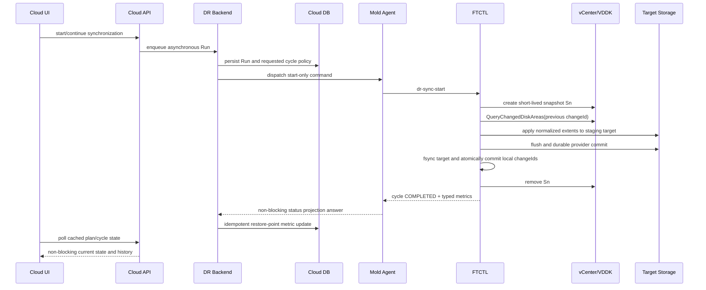

# Cross Hypervisor DR VMware CBT Incremental And Transfer Metrics Design

- Date: 2026-07-14
- Status: implementation deployed; 2026-07-17 live validation found repeated FULL_RESEED; corrective design 559 pending implementation
- Scope: VMware source to ABLESTACK target continuous replication
- Affected layers: UI, Cloud API, Cloud backend, Mold Agent, FTCTL, Cloud DB
- Related: 501, 520, 521, 523, 542, 545, 549, 550, 553, 554, 556, 557, 558, 559

> Live progress note (2026-08-10): this document remains normative for
> completed-cycle CBT and transfer metrics. In-flight progress transport,
> staleness, Cloud projection, and UI presentation are defined by
> `601-cross-hypervisor-dr-live-transfer-progress-projection-design-20260810.md`
> and qemu document
> `442-ftctl-dr-live-transfer-progress-contract-design-20260810.md`.

## 1. Purpose And Normative Priority

This document closes two correctness gaps in the current VMware DR path.

1. A cycle with sequence greater than one is labelled `incremental`, but the
   deployed mover still copies the complete source disk with `qemu-img convert`.
2. The product does not persist or display enough transfer evidence to prove
   whether a cycle was a full copy, a VMware CBT incremental copy, or a no-change
   cycle.

This document is normative for VMware CBT baseline ownership, cycle commit,
transfer metrics, and synchronization-history semantics. If an older document
conflicts with this document, this document takes priority.

Cross Hypervisor DR does not provide historical point-in-time recovery. A
completed cycle advances the mutable DR replica to a newer durable state. The
cycle history is operational evidence, not a list of selectable recovery points.

## 2. Confirmed Root Cause

### 2.1 FTCTL labels an execution mode without executing it

Current source evidence:

- `lib/ftctl/dr_scheduler.sh` returns `incremental` based only on sequence.
- `lib/ftctl/dr_vmware_mover.sh` always executes a full
  `qemu-img convert --force-share -p -n` for the target disk.
- The mover creates and removes a VMware snapshot, but it does not call
  `QueryChangedDiskAreas`.
- `lib/ftctl/dr_vmware.sh` rewrites the manifest from the static disk map after
  the mover and does not commit a new per-disk CBT changeId.

Therefore the current cycle name is intent, not execution evidence.

### 2.2 The reusable CBT implementation exists outside the DR engine

The V2K implementation already contains proven primitives:

- `lib/v2k/vmware_changed_areas.py` calls `QueryChangedDiskAreas`.
- `lib/v2k/transfer_patch.sh` reads `last_change_id`, calculates changed areas
  and bytes, applies only those extents, and advances to `new_change_id` after
  successful apply.
- `lib/v2k/patch_apply.py` applies an extent stream to a target.

V2K remains a migration tool and must not be invoked as the DR lifecycle
engine. The CBT query and patch primitives must be extracted into a shared,
side-effect-bounded library and used by both engines.

### 2.3 Cloud has no committed cycle or typed baseline model

Current Cloud evidence:

- `dr_replica_disk` has only generic `details_json` for CBT data.
- `dr_run` represents a long-running operation and may contain many RPO cycles;
  it is not a cycle-history entity.
- `FtctlDrStatusAnswer` exposes current/latest checkpoint identifiers but no
  per-cycle transfer metrics or baseline generation.
- `listDrSyncCheckpoints` exposes sequence and timestamps but no actual mode,
  CBT proof, or byte counters.
- The 32.x DB has no `dr_sync_cycle` or `dr_sync_cycle_disk` tables.

This prevents an atomic answer to: "which baseline was used, what was read and
written, and which new baseline became authoritative?"

## 3. Snapshot And CBT Decision

The previous VMware snapshot does not have to remain in the snapshot tree.
The durable object that must remain is the per-disk CBT `changeId` returned for
the last successfully committed snapshot.

Correct sequence:

1. Create baseline snapshot `S1`.
2. Complete the initial full seed and read each disk's `S1.changeId`.
3. Make the target durable and commit `S1.changeId` as the baseline.
4. Remove `S1`.
5. Create short-lived snapshot `S2` at the next RPO boundary.
6. Call `QueryChangedDiskAreas(S2, diskKey, S1.changeId)`.
7. Apply only returned extents to a transactional target staging layer.
8. Flush and make the target durable.
9. Atomically commit metrics and `S2.changeId`.
10. Remove `S2`.

Keeping both `S1` and `S2` is not required for VMware CBT and would create an
unbounded snapshot chain. Removing `S1` before `S2` is valid if the committed
changeId is retained and VMware still accepts it.

## 4. Read-Only Live Preflight Evidence

The active 32.x environment was inspected without changing the running Plan,
snapshot tree, target disk, or DB rows.

| Check | Result |
|---|---|
| Source VM | `vm-4486`, display name `Rokcy10-1`, powered on |
| VMware CBT | `config.changeTrackingEnabled=true` |
| Current snapshot reference | Present (`snapshot-7240`) while active Plan is `SYNCING` |
| Active Plan | `410be8ad-1b40-4405-bcd5-b0840fa7caba`, `SYNCING` |
| Deployed FTCTL mover | Full `qemu-img convert`; snapshot create/remove only |
| Deployed FTCTL CBT query | No `QueryChangedDiskAreas` or changeId advancement |
| Installed reusable V2K code | Query, extent metrics, patch, and changeId advancement present |
| Cloud cycle tables | Absent |
| Current Run transfer-byte fields | Absent |

The earlier live S1/S2 test documented in 542 and 545 remains valid evidence:
S1 was removed, S2 successfully queried with the S1 changeId, and VMware
returned two changed areas totaling 131072 bytes. No additional snapshot
mutation was executed during this design pass because a Plan was active.

## 5. Execution State Model

### 5.1 Requested mode versus effective mode

The scheduler request and the executed result must be separate fields.

| Value | Meaning |
|---|---|
| `FULL_SEED` | First durable replica copy |
| `CBT_INCREMENTAL` | Valid committed baseline, successful CBT query, extent-only apply |
| `NO_CHANGE` | Valid CBT query returned zero changed extents |
| `FULL_RESEED` | Explicitly approved replacement of an invalid/missing baseline |

`requested_mode=CBT_INCREMENTAL` must never be reported as successful
incremental when the engine silently performs a full copy.

### 5.2 Incremental verification gate

`incremental_verified=true` only when all conditions are true for every source
disk:

- a committed previous changeId and baseline generation exist;
- `QueryChangedDiskAreas` succeeded with that exact previous changeId;
- the engine did not use full-copy fallback;
- only the returned normalized extents were read and applied;
- the target provider completed its durable commit;
- the FTCTL mover flushed the target and atomically replaced its local disk-map
  baseline with the returned changeId;
- Cloud projected the completed-cycle metrics into the typed history row.

Any missing condition produces either `FULL_RESEED` through an explicit action
or a terminal `RESEED_REQUIRED` state. It must not produce a green incremental
badge.

### 5.3 Cycle states

```text
PREPARING
  -> SNAPSHOT_CREATED
  -> CBT_QUERIED
  -> APPLYING
  -> TARGET_DURABLE
  -> LOCAL_DURABLE
  -> CLOUD_PROJECTED
  -> COMPLETED
```

Terminal failure states include `QUERY_FAILED`, `APPLY_FAILED`,
`TARGET_COMMIT_FAILED`, `BASELINE_CONFLICT`, and `RESEED_REQUIRED`.

## 6. End-To-End Asynchronous Commit Protocol



FTCTL's local disk map is authoritative for the next VMware CBT query because
it is committed only after target durability. Cloud DB is the operator-facing
typed audit/cache projection. Cloud projection failure cannot roll back a
durable target, and retrying projection is idempotent by Plan and sequence.

## 7. FTCTL Code-Level Design

### 7.1 Reused query primitive and DR-specific patcher

The implementation keeps the proven V2K query helper as a side-effect-bounded
primitive and does not invoke the V2K migration lifecycle:

- `lib/v2k/vmware_changed_areas.py` accepts VMware numeric disk keys and calls
  `QueryChangedDiskAreas` through the installed compatibility pyVmomi runtime.
- the RPM installs the helper as FTCTL's
  `dr_vmware_changed_areas.py` runtime entry point;
- `lib/ftctl/dr_extent_patch.py` validates, sorts, merges and bounds extents,
  applies them with `pread`/`pwrite`, calls `fsync`, and emits actual counters.

### 7.2 FTCTL modules

Implemented changes:

- `dr_vmware_mover.sh`
  - retains `qemu-img convert` only for `FULL_SEED` and explicit
    `FULL_RESEED`;
  - queries CBT and applies normalized extents through source/target NBD;
  - commits each disk's new changeId with temp-file plus atomic rename only
    after target flush;
  - emits aggregate and per-disk cycle metrics.
- `dr_scheduler.sh`
  - rejects incremental execution without a committed local changeId;
  - records the effective mode returned by the mover;
  - publishes latest completed metrics without holding the UI/API call.
- `dr_vmware.sh`
  - passes cycle identity and a cycle-metrics output path;
  - embeds the resulting metrics in manifest/checkpoint output.
- `dr_runtime.sh`
  - exposes latest completed mode, verification, counters, generation and
    token as typed JSON fields;
  - keeps the existing current/latest checkpoint split.

### 7.3 Per-disk result contract

```json
{
  "diskIndex": 0,
  "sourceDiskRef": "2000",
  "requestedMode": "CBT_INCREMENTAL",
  "effectiveMode": "CBT_INCREMENTAL",
  "previousChangeId": "52 ... /636",
  "newChangeId": "52 ... /640",
  "baselineGeneration": 7,
  "virtualBytes": 107374182400,
  "changedBytes": 131072,
  "sourceReadBytes": 131072,
  "targetWrittenBytes": 131072,
  "transferPayloadBytes": 131072,
  "zeroBytes": 0,
  "discardBytes": 0,
  "changedExtentCount": 2,
  "targetCheckpointRef": "rbd-snap://...",
  "incrementalVerified": true
}
```

Secrets, VDDK passwords, session cookies, and complete source URIs are never
written to this result.

### 7.4 Provider transaction boundary

RBD target:

1. Create a provider rollback snapshot or clone-based staging image.
2. Apply changed extents.
3. Flush the RBD image.
4. Create/confirm the new durable target checkpoint.
5. Remove the old rollback object only after the local durable baseline commit.

qcow2 target:

1. Create an external staging overlay above the last durable base.
2. Apply changed extents and fsync data/metadata.
3. Atomically switch/commit the overlay as the new durable target.
4. Discard the overlay on failure.

The engine must not partially overwrite the only durable replica without a
rollback boundary.

### 7.5 Error codes

- `DR_CBT_BASELINE_MISSING`
- `DR_CBT_BASELINE_INVALID`
- `DR_CBT_BASELINE_CONFLICT`
- `DR_CBT_QUERY_FAILED`
- `DR_CBT_EXTENT_INVALID`
- `DR_CBT_PATCH_FAILED`
- `DR_CBT_METRICS_INVALID`
- `DR_CBT_RESEED_REQUIRED`

Invalid or expired changeId is not a silent full-copy fallback. The Plan enters
`RESEED_REQUIRED`; an explicit reseed action creates an auditable
`FULL_RESEED` cycle.

## 8. Agent Contract Design

### 8.1 Typed status fields

`FtctlDrStatusAnswer` carries the latest completed effective mode,
incremental-verification flag, estimated flag, byte counters, extent count,
duration, throughput, baseline generation and cycle token. The KVM status
wrapper maps the exact FTCTL JSON names into these typed fields.

### 8.2 Command behavior

`FtctlDrActionCommand` remains start-only. The Agent returns acceptance quickly
and does not wait for transfer completion. Projection polling reports state and
metrics. Cloud does not synchronously acknowledge or gate the next FTCTL cycle;
its projection is an idempotent operator-facing cache update.

## 9. Cloud DB Design

### 9.0 Current delivery profile

For this implementation, the existing `dr_restore_point` row is the typed
completed-cycle history entity. The schema adds `effective_mode`,
`incremental_verified`, `metrics_estimated`, virtual/changed/read/write/payload
byte counters, extent count, duration, throughput, baseline generation and
cycle token. This is applied consistently to create-schema and all active
Europa upgrade paths.

Sections 9.1 through 9.4 describe a possible future high-volume normalization
into dedicated aggregate/disk tables. They are not runtime requirements of the
current delivery and must not be used to judge this deployment incomplete.

### 9.1 `dr_sync_cycle`

Add a typed aggregate history table.

```sql
CREATE TABLE cloud.dr_sync_cycle (
  id bigint unsigned NOT NULL AUTO_INCREMENT,
  uuid varchar(40) NOT NULL,
  plan_id bigint unsigned NOT NULL,
  run_id bigint unsigned NULL,
  sequence bigint unsigned NOT NULL,
  cycle_token varchar(96) NOT NULL,
  requested_mode varchar(32) NOT NULL,
  effective_mode varchar(32) NULL,
  incremental_verified tinyint(1) NOT NULL DEFAULT 0,
  state varchar(32) NOT NULL,
  baseline_generation bigint unsigned NOT NULL DEFAULT 0,
  source_snapshot_at datetime NULL,
  target_durable_at datetime NULL,
  virtual_bytes bigint unsigned NOT NULL DEFAULT 0,
  changed_bytes bigint unsigned NOT NULL DEFAULT 0,
  source_read_bytes bigint unsigned NOT NULL DEFAULT 0,
  target_written_bytes bigint unsigned NOT NULL DEFAULT 0,
  transfer_payload_bytes bigint unsigned NOT NULL DEFAULT 0,
  changed_extent_count bigint unsigned NOT NULL DEFAULT 0,
  duration_ms bigint unsigned NULL,
  throughput_bps bigint unsigned NULL,
  target_rpo_seconds int unsigned NULL,
  full_copy_reason varchar(128) NULL,
  error_code varchar(128) NULL,
  error_message varchar(4096) NULL,
  created datetime NOT NULL,
  updated datetime NULL,
  completed datetime NULL,
  removed datetime NULL,
  PRIMARY KEY (id),
  UNIQUE KEY uk_dr_sync_cycle__uuid (uuid),
  UNIQUE KEY uk_dr_sync_cycle__plan_sequence (plan_id, sequence),
  UNIQUE KEY uk_dr_sync_cycle__plan_token (plan_id, cycle_token),
  KEY i_dr_sync_cycle__plan_completed (plan_id, completed),
  KEY i_dr_sync_cycle__plan_state (plan_id, state)
);
```

### 9.2 `dr_sync_cycle_disk`

Store disk-level proof, including the baseline transition.

Required columns:

- `cycle_id`, `replica_disk_id`, `disk_index`, `disk_label`
- `requested_mode`, `effective_mode`, `incremental_verified`, `state`
- `virtual_bytes`, `changed_bytes`, `source_read_bytes`
- `target_written_bytes`, `transfer_payload_bytes`, `zero_bytes`
- `discard_bytes`, `changed_extent_count`, `duration_ms`
- `previous_change_id`, `new_change_id`, `baseline_generation`
- `target_checkpoint_ref`, `error_code`, `error_message`

Unique key: `(cycle_id, disk_index)`.

### 9.3 Typed baseline columns on `dr_replica_disk`

Add:

- `cbt_change_id varchar(2048)`
- `cbt_generation bigint unsigned not null default 0`
- `baseline_state varchar(32) not null default 'MISSING'`
- `last_sync_sequence bigint unsigned`
- `last_target_checkpoint_ref varchar(2048)`
- `last_sync_at datetime`

`details_json` remains extension data, not the source of truth for the baseline.

### 9.4 Schema and Java artifacts

Update all active schema paths consistently:

- `schema-Europa-After.sql`
- `schema-42200to42210.sql`
- `schema-42210to42300.sql`
- `setup/db/create-schema.sql`

Add `DrSyncCycleVO/Dao` and `DrSyncCycleDiskVO/Dao`. Extend
`DrReplicaDiskVO/Dao` with compare-and-set update by
`(id, cbt_generation, cbt_change_id)`.

Retention defaults to 90 days or 1000 cycles per Plan, whichever retains more
operator evidence. Cleanup is soft-delete first and must not remove the latest
completed cycle or current baseline.

## 10. Backend Projection And Transaction Design

### 10.0 Current delivery profile

`FtctlDrRuntimeProjectionAdapter` projects the latest completed typed metrics
into the matching `DrRestorePointVO` row. Projection is idempotent and runs on
the existing asynchronous status path. The authoritative next-query changeId
is not advanced by Cloud: FTCTL advances its local disk map atomically only
after the target flush succeeds. Therefore a delayed or repeated Cloud
projection changes only the UI/audit cache and cannot corrupt the CBT baseline.

The service and CAS protocol below are a future multi-controller extension,
not part of the current single active FTCTL controller delivery.

Add `DrSyncCycleProjectionService` with these operations:

```java
ProjectResult projectCycle(DrPlanVO plan, FtctlDrSyncCycleMetrics metrics);
CommitResult commitDurableCycle(DrPlanVO plan, FtctlDrSyncCycleMetrics metrics);
ReconcileResult reconcilePendingCycle(DrPlanVO plan, FtctlDrSyncCycleMetrics metrics);
```

`commitDurableCycle()` runs in one DB transaction:

1. Lock the Plan and active replica rows.
2. Upsert the cycle by `(plan_id, cycle_token)`.
3. Validate disk count and aggregate sums.
4. For every disk, compare expected previous changeId/generation.
5. Insert/update `dr_sync_cycle_disk`.
6. CAS-update each `dr_replica_disk` to the new changeId/generation.
7. Mark `dr_sync_cycle` `CLOUD_COMMITTED`.
8. Commit the transaction.
9. Send the idempotent Agent commit acknowledgement after commit.

If any disk CAS fails, no baseline advances. The cycle becomes
`BASELINE_CONFLICT`, and FTCTL keeps/reconciles its pending local journal.

The existing protection-view cache includes only the current and latest
completed cycle summary. History APIs read the typed cycle tables and never
call Agent/FTCTL synchronously.

## 11. API Design

### 11.0 Current delivery profile

`listDrSyncCheckpoints` and the existing restore-point response expose the new
typed fields. No new synchronous action API is introduced. UI reads remain
side-effect free and synchronization actions remain start-only asynchronous
jobs.

The separate cycle/disk endpoints below are future pagination and per-disk
diagnostic extensions.

Add:

- `listDrSyncCycles(planid, page, pagesize, state, effectivemode)`
- `getDrSyncCycle(id)`
- `listDrSyncCycleDisks(cycleid, page, pagesize)`
- `startDrFullReseed(planid, reason, idempotencykey)`

`listDrSyncCheckpoints` remains a compatibility summary but must source its
sequence/state/time from completed `dr_sync_cycle` rows. It must not infer the
mode from sequence.

Cycle response fields include all aggregate metric fields, actual/effective
mode, verification state, change ratio, throughput, RPO, and reseed reason.
Disk responses include the same counters without exposing raw changeIds to
ordinary users. ChangeId values are admin-diagnostic fields and are redacted by
default.

All start/reseed APIs are asynchronous and return an async job plus Run ID.
Read APIs are side-effect free.

## 12. UI Design

The existing synchronization history view becomes evidence-oriented.

Columns:

- sequence and completion time
- actual method: Initial full / CBT incremental / No changes / Full reseed
- state and incremental verification badge
- virtual disk size
- CBT changed bytes
- actual source read bytes
- actual target written bytes
- transfer payload bytes
- changed ratio
- duration and effective throughput
- actual RPO

Expanding a row shows the same fields per disk. Raw changeIds are not displayed
in the normal UI.

Rules:

- `CBT incremental` is green only when `incrementalverified=true`.
- Requested incremental with another effective mode is a warning, not success.
- `FULL_RESEED` always shows the operator/system reason.
- Exact byte values are available in tooltips; compact units are used in cells.
- Only an active cycle is polled. Completed history is paginated and cached.
- No page-blocking spinner is used for continuous replication.
- Dark mode uses existing CloudStack semantic tokens, not fixed white table
  cells or fixed black text.

Byte metrics are necessary but not sufficient proof of incrementality. The UI
must always display them together with effective mode and verification state.

## 13. Metric Definitions

| Metric | Definition |
|---|---|
| `virtual_bytes` | Sum of source disk logical capacities |
| `changed_bytes` | Sum of normalized CBT extent lengths |
| `source_read_bytes` | Bytes actually read from VDDK by the patch path |
| `target_written_bytes` | Bytes actually submitted to target storage |
| `transfer_payload_bytes` | Payload bytes transported after protocol framing, when measurable |
| `zero_bytes` | Changed extents represented as zero writes |
| `discard_bytes` | Changed extents represented as discard/hole operations |
| `changed_extent_count` | Normalized, merged extent count |
| `duration_ms` | CBT query start through durable target commit |
| `throughput_bps` | `source_read_bytes * 1000 / duration_ms` |
| `change_ratio` | `changed_bytes / virtual_bytes` |

Aggregate values must equal the sum of disk rows. A mismatch is
`DR_CBT_METRICS_INVALID` and cannot advance the baseline.

## 14. Crash And Retry Semantics

| Failure point | Required behavior |
|---|---|
| Before snapshot | Retry same sequence/token |
| After snapshot, before query | Remove owned snapshot on bounded cleanup; baseline unchanged |
| After query, before apply | Discard staging; baseline unchanged |
| During apply | Roll back/discard provider staging; baseline unchanged |
| After target durable, before local rename | Old changeId remains authoritative; retry/reseed according to target verification |
| After local rename, before Cloud projection | Retry the same typed projection; new local changeId remains authoritative |
| After local commit, before snapshot removal | Retry owned-snapshot cleanup; committed baseline remains valid |
| Duplicate projection | Update the same Plan/sequence restore-point row idempotently |

The scheduler may not publish sequence N as completed until target flush and
the local atomic baseline rename both succeed.

## 15. Validation Plan

### 15.1 Automated tests

- FTCTL unit tests for baseline selection and no silent fallback.
- Query helper fixtures for empty, overlapping, out-of-range, and full-disk
  extents.
- Patch tests for RBD and qcow2 transactional targets.
- Crash/restart tests at every state in section 14.
- Agent serialization and numeric-bound tests.
- Backend transaction, duplicate projection, and CAS-conflict tests.
- API pagination/filter/redaction tests.
- UI rendering tests for full, incremental, no-change, reseed, and dark mode.

### 15.2 Live acceptance

1. Verify/enable VM and per-disk CBT before the baseline snapshot.
2. Run `FULL_SEED`; record virtual/read/write bytes and committed changeIds.
3. Remove S1 and make a known small guest write.
4. Create S2 and execute `CBT_INCREMENTAL` using S1 changeIds.
5. Prove `changed_bytes < virtual_bytes` and target content correctness.
6. Execute a no-write cycle and prove `NO_CHANGE` with zero extents.
7. Corrupt an isolated test baseline and prove `RESEED_REQUIRED`, not fallback.
8. Execute explicit `FULL_RESEED` and prove the reason is visible in history.
9. Repeat for all disks and both RBD and qcow2 targets.
10. Verify snapshot count returns to the pre-cycle level after each completion.

Acceptance is based on effective mode, query evidence, byte counters, target
content, and baseline generation. A cycle name or green state alone is not
evidence.

## 16. Implementation Order

1. Reuse and harden the CBT query primitive; add the DR extent patcher.
2. Refactor FTCTL full-seed, CBT incremental, no-change and reseed paths.
3. Add typed Agent status metrics.
4. Extend `dr_restore_point`, API response and asynchronous backend projection.
5. Update synchronization-history UI with mode, verification and transfer
   evidence, including measured/estimated distinction.
6. Run changed-module Maven tests, UI build, FTCTL GitHub Actions packaging,
   deployment and clean-Plan acceptance.

## 17. Error Cause And AS-IS / TO-BE Summary

| Layer | Error cause | AS-IS | TO-BE |
|---|---|---|---|
| UI | Cycle label is treated as proof | Sequence/timestamp only; no byte proof | Effective mode, verification, aggregate and per-disk transfer metrics |
| API | Checkpoint response lacked cycle evidence | Checkpoint summary only | Existing checkpoint response carries typed mode and transfer metrics |
| Backend | Completed cycle was timestamp-only | Latest checkpoint projected without transfer proof | Idempotent typed projection into the matching restore-point row |
| Agent | Status lacked cycle proof | Current/latest checkpoint strings | Typed latest-completed mode, verification and transfer metrics |
| FTCTL | Sequence selects `incremental`, mover still full-copies | Snapshot + full `qemu-img convert` every cycle | Full seed once; CBT query and extent patch for later cycles |
| DB | No typed cycle evidence | Generic JSON and checkpoint timestamps | Typed metrics and cycle identity on `dr_restore_point` |
| Snapshot | Snapshot deletion is mistaken for loss of baseline | No usable persisted baseline in DR path | Delete short-lived snapshots after durable changeId commit |
| Failure handling | Invalid CBT can collapse into full copy | Incremental intent may silently become full transfer | `RESEED_REQUIRED` and explicit audited `FULL_RESEED` |
| Evidence | Transferred capacity is unknown | Cannot distinguish full from incremental | Changed/read/written/payload bytes, extents, ratio, duration, throughput |

## 18. Completion Criteria

The design is implemented only when:

- sequence greater than one does not determine the effective mode;
- a real VMware CBT query and extent-only transfer are observable;
- per-disk changeIds advance only after target durability and atomic local
  disk-map commit;
- failed/duplicate Cloud projection cannot change the FTCTL baseline;
- synchronization history proves actual mode and transferred capacity;
- RBD and qcow2 pass full, incremental, no-change, and explicit reseed tests;
- Test Failover and Failover consume only the latest Cloud-committed durable
  cycle.

## 19. 2026-07-16 Corrective Commit Addendum

Live Plan `538befc6-0efb-4304-ba1a-5243311de4fb` completed the target full copy
but failed while serializing the per-disk result because the mover used jq's
reserved `$label` keyword. No baseline or restore point was committed, while
the copied RBD data remained physically present. The same terminal status was
stored as a complete error string and caused invalid Plan API JSON for a UTF-8
datastore path.

The normative correction is
`557-cross-hypervisor-dr-cycle-commit-and-api-json-recovery-design-20260716.md`.
In particular, section 14's `After target durable, before local rename` case is
now represented by a plan-scoped cycle journal and the explicit
`DATA_COPIED_METADATA_FAILED` state. A generic cycle error and anonymous mover
temporary files are not sufficient recovery evidence.

## 20. 2026-07-16 Snapshot-Lifecycle And Strict-Status Addendum

The committed CBT baseline remains the per-disk changeId and generation; it
does not require a VMware snapshot to remain in the tree. Runtime status must,
however, distinguish an active owned snapshot from the last cleaned snapshot.
After verified removal it records `lifecycleState=CLEANED`, clears the active
reference, and retains a bounded last-reference audit field.

Canonical JSON booleans, Plan-local bounded events, verified snapshot cleanup,
and cross-layer readiness gates are defined in
`558-cross-hypervisor-dr-strict-status-storage-format-and-query-boundary-design-20260716.md`.

## 21. 2026-07-17 Automatic Baseline Repair And NBD Barrier Addendum

Live preflight proved that qemu-nbd can return before the attached target
reports a non-zero size: the tested target reported zero at attach return and
the correct 100 GiB after 50 ms. Incremental patching waits for matching
non-zero sysfs and blockdev sizes, retries attachment once, and fails before
opening a write path if readiness is not established.

A missing committed per-disk changeId is recoverable. The pre-cycle evaluator
selects one whole-VM FULL_RESEED when any disk lacks a valid committed
baseline. The old baseline and last-good checkpoint remain authoritative until
all target writes are flushed and the replacement baseline is atomic.

Detailed functions, transitions, tests, and acceptance criteria are normative
in sections 21 and 28 of
558-cross-hypervisor-dr-strict-status-storage-format-and-query-boundary-design-20260716.md.

## 22. 2026-07-17 Incremental Mode Decision Correction

Live Linux and Windows Plans proved that committed per-disk changeIds and
positive `LOCAL_DURABLE` baseline generations survive each cycle, while every
sequence after the initial seed still executes as `FULL_RESEED`.

The mover's disk-plan row copies `previousChangeId` but drops
`baselineState`, `baselineGeneration`, and `lastSyncSequence`. Its resolver
then reads the missing generation as zero and overwrites the Scheduler's
`CBT_INCREMENTAL` request with `FULL_RESEED`. This is an FTCTL row-contract
defect, not a VMware snapshot-retention requirement.

Requested mode is henceforth immutable and separate from effective mode.
Baseline fields cross the execution-row boundary, automatic reseed is typed
and circuit-broken, and Cloud projects the latest completed sequence even when
the next sequence is already current. Normal cutover additionally requires a
verified incremental or valid no-change checkpoint.

The complete corrective contract is normative in
`559-cross-hypervisor-dr-incremental-mode-decision-and-cycle-projection-design-20260717.md`.

## 23. 2026-07-23 NBD Teardown Commit-Gate Addendum

Transferred-byte evidence and target flush are necessary but not sufficient for
a completed VMware-to-ABLESTACK incremental cycle. Live validation found that
immediate `qemu-nbd` and `nbd-client` disconnect can race with asynchronous
udev/partition reads and produce sector-zero kernel I/O errors.

The normative correction is:

```text
569-cross-hypervisor-dr-nbd-deterministic-drain-and-cycle-observability-design-20260723.md
```

`incrementalVerified=true`, a new committed changeId, and a new baseline
generation now additionally require `nbdTeardownState=DRAINED`. If target data
was flushed but teardown failed, the cycle is
`NBD_TEARDOWN_FAILED/TARGET_DURABLE_CLEANUP_PENDING`, the previous committed
baseline remains authoritative, and only cleanup-only recovery is allowed.

## 2026-08-01 Directional Tracking Addendum

VMware CBT is authoritative only while VMware is the replication source. It
cannot describe writes made after KVM becomes active. Reverse protection uses
a KVM-native immutable baseline and changed-extent tracker, then writes those
extents into VMware staging disks through VDDK.

Metrics must expose `tracker_type`, `source_generation`, `from_checkpoint`,
`to_checkpoint`, `changed_bytes`, `source_read_bytes`,
`target_written_bytes`, and `direction`. A reverse cycle that only advances a
VMware CBT change ID is invalid. See
[588-cross-hypervisor-dr-bidirectional-incremental-replication-and-failback-data-contract-design-20260801.md](588-cross-hypervisor-dr-bidirectional-incremental-replication-and-failback-data-contract-design-20260801.md).
