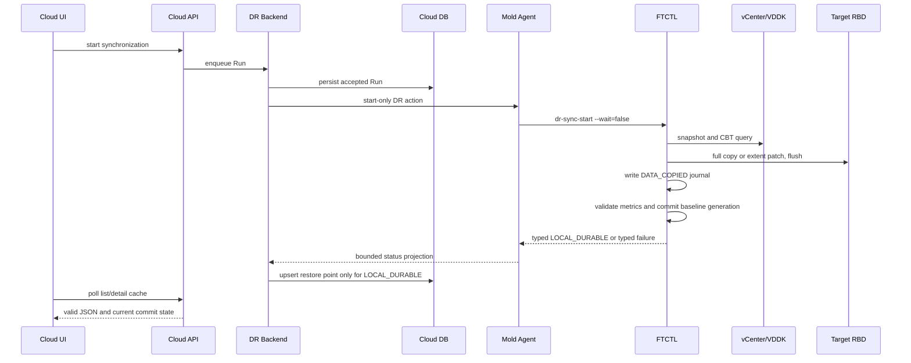

# Cross Hypervisor DR Cycle Commit And API JSON Recovery Design

- Date: 2026-07-16
- Status: cycle commit/API recovery implemented; incremental decision and projection follow-up is defined in 559
- Scope: VMware to ABLESTACK initial seed and continuous CBT replication
- Affected layers: UI, Cloud API, Cloud backend, Mold Agent, FTCTL, Cloud DB
- Supersedes on conflict: failure and retry portions of 502, 506, 507, 508,
  509, 510, 525, 555, and the live-acceptance statement in 556

## 1. Purpose

Live Plan `538befc6-0efb-4304-ba1a-5243311de4fb` proved that the data plane can
finish a full VMware-to-RBD copy while the cycle still fails before its metrics,
baseline, and restore-point commit. The same failure also exposed an independent
Cloud response bug: a complete FTCTL status object was persisted as a user-facing
error string, and nested Unicode escapes made `listDrPlans` and `getDrPlan`
return invalid JSON.

This document defines a single end-to-end correction for both failures. A copy
is not a completed DR checkpoint until its metadata and baseline are committed,
but copied data must remain visible as uncommitted evidence rather than looking
deleted. Full runtime JSON must never be transported through a user-facing
error-message field.

## 2. Confirmed Live Evidence

| Evidence | Result |
|---|---|
| Plan / Run | Plan `538befc6-0efb-4304-ba1a-5243311de4fb`, Run `262c878e-410f-4d24-8145-fdf390a8c83b` |
| Cloud state | Plan `ERROR`, Run `FAILED`, step `runtime-projection` |
| FTCTL state | cycle 1 `FAILED`, worker exit code `3` |
| FTCTL failure | `jq: syntax error, unexpected label` after full-copy completion |
| Target RBD | `rbd/Rokcy10-1-dr-disk-0`, 100 GiB, about 5.68 GiB allocated |
| Target content | GPT, EFI, XFS, and LVM signatures readable through a read-only map |
| Restore point | none; no completed checkpoint or target VM exists |
| VMware source | powered on, CBT enabled, EFI Secure Boot enabled |
| VMware snapshot | owned cycle snapshot removed after failure |
| API | `listDrPlans` and `getDrPlan` invalid JSON; run/replica/checkpoint lists valid |
| Agent | `mold-agent` and FTCTL timers active on all three hosts |

The current `jq` expression fails on the deployed worker because `label` is a
jq language keyword. The same expression using `$disk_label` completed in a
live read-only preflight. No production source, target, snapshot, or DB row was
changed by that preflight.

## 3. Root-Cause Chains

### 3.1 Data-copy commit failure

```text
qemu-img full copy succeeds
  -> patch metric file is written
  -> per-disk result jq uses --arg label and $label
  -> jq parser exits 3
  -> aggregate cycle metrics are never written
  -> disk-map changeId is never committed
  -> scheduler maps exit 3 to DR_REPLICATION_CYCLE_FAILED
  -> no restore point and no target materialization
```

The physical target data remains, but it is correctly not exposed as a durable
checkpoint. The missing behavior is a typed, resumable representation of this
`copied but uncommitted` state.

### 3.2 UI data-disappearance failure

```text
FTCTL emits a generic error code and an empty error_message
  -> Agent places the full status output in Answer.details
  -> Backend projection uses status.details as plan/run error_message
  -> error_message contains nested JSON with literal Unicode escapes
  -> DrPlanResponse serializes the nested JSON as a string
  -> generic API unescape converts an escaped sequence into an invalid one
  -> browser JSON parsing fails
  -> list/detail loading has no valid response and appears empty
```

The DB and protection-view cache were still present. The UI symptom was an API
contract failure, not deletion of the Plan or source/target disk data.

## 4. Normative Invariants

1. `TRANSFER_COMPLETED` is not equivalent to `CHECKPOINT_COMMITTED`.
2. A `dr_restore_point` row is created or advanced only from a locally durable,
   validated FTCTL cycle commit.
3. The previous CBT baseline remains authoritative until every disk result,
   aggregate metric, target durability proof, and new changeId are committed.
4. A metadata-only failure after data copy must expose
   `DATA_COPIED_METADATA_FAILED`; it must not collapse into a generic mover
   failure or silently report success.
5. `error_message` is a short operator-facing sentence. Complete status JSON is
   stored only in `last_status_json` or redacted event/details JSON.
6. Read APIs always return syntactically valid JSON for UTF-8 text, literal
   backslashes, and nested diagnostic data.
7. UI refresh failure never converts an existing Plan into an empty list or a
   fabricated runtime `ERROR` state.
8. Retry is idempotent by `(plan UUID, checkpoint sequence, cycle token)`.

## 5. Corrected Cycle State Machine

```text
PREPARING
  -> SNAPSHOT_CREATED
  -> CBT_QUERIED
  -> TRANSFERRING
  -> DATA_COPIED
  -> METADATA_PREPARED
  -> LOCAL_DURABLE
  -> CLOUD_PROJECTED
  -> COMPLETED
```

Failure states:

- `TRANSFER_FAILED`: target transaction is rolled back or discarded.
- `DATA_COPIED_METADATA_FAILED`: target bytes exist, but no baseline or restore
  point was committed.
- `LOCAL_COMMIT_FAILED`: prepared journal exists and recovery must finish or
  roll back before another cycle starts.
- `CLOUD_PROJECTION_PENDING`: local checkpoint is durable; Cloud projection is
  retryable and must not repeat data transfer.
- `RESEED_REQUIRED`: target or journal proof is insufficient for safe resume.

The FTCTL status contract adds:

```json
{
  "data_commit_state": "DATA_COPIED_METADATA_FAILED",
  "data_copied": true,
  "metadata_committed": false,
  "target_durable": true,
  "cycle_retry_mode": "METADATA_ONLY",
  "error_code": "DR_CBT_METRICS_INVALID",
  "error_message": "Cycle metrics serialization failed after target copy"
}
```

## 6. FTCTL Code-Level Design

### 6.1 Immediate parser correction

In `lib/ftctl/dr_vmware_mover.sh`:

- replace `--arg label` with `--arg disk_label`;
- replace `$label` in the jq program with `$disk_label`;
- move per-disk result construction into
  `ftctl_vmware_mover_build_disk_result()`;
- execute a zero-data fixture through that function before snapshot creation or
  target mutation;
- map serialization/aggregation failures to exit code `87` and
  `DR_CBT_METRICS_INVALID`.

The preflight fixture covers `FULL_SEED`, `CBT_INCREMENTAL`, and `NO_CHANGE` and
validates the generated object with `jq -e` against required keys and numeric
types.

### 6.2 Plan-scoped cycle journal

Temporary result files must move from the shared mover directory to:

```text
<plan>/cycles/<sequence>/
  query-disk-<n>.json
  transfer-disk-<n>.json
  cycle-results.json
  cycle-metrics.json
  commit.json
```

`transfer-disk-<n>.json` is atomically written immediately after target close
and flush. It contains only non-secret evidence: target image identity, logical
size, target image generation/mtime, source snapshot reference hash, new
changeId hash, requested/effective mode, counters, and completion time.

`commit.json` transitions monotonically:

```text
PREPARED -> LOCAL_DURABLE -> CLOUD_PROJECTED
```

Every file is written to `.tmp`, flushed, and atomically renamed. The commit
journal is the recovery authority; anonymous `mktemp` files are diagnostics
only and are not accepted as resume evidence.

### 6.3 Atomic baseline commit

`ftctl_vmware_mover_commit_cycle_metrics()` is split into:

```text
prepare_cycle_commit()
  -> validate all disk results and aggregate sums
  -> write cycle metrics and next disk map into journal staging

commit_cycle_baseline()
  -> fsync staging files and directory
  -> atomically advance baseline.current to generation N
  -> mark commit.json LOCAL_DURABLE
```

The active disk map is read through `baseline.current`. An in-place disk-map
rewrite is no longer the commit boundary. A crash can therefore select either
generation N-1 or complete generation N from its journal without observing a
partially advanced multi-disk baseline.

### 6.4 Resume and cleanup

Before a new cycle, `ftctl_dr_scheduler_reconcile_cycle()` examines the latest
journal:

- `DATA_COPIED` plus verified target identity: rebuild metadata and perform a
  metadata-only commit;
- `PREPARED`: finish the atomic baseline pointer update;
- `LOCAL_DURABLE`: publish/projection retry only;
- missing or mismatched target proof: mark `RESEED_REQUIRED`;
- incremental staging failure: roll back the provider transaction before
  clearing the journal.

The current failed Plan has no plan-scoped durable journal. Its RBD data must
not be adopted manually; cleanup followed by a new `FULL_SEED` is required.

### 6.5 Scheduler error propagation

`ftctl_dr_scheduler_run_cycle()` captures a bounded mover error envelope instead
of only its exit code. `dr_scheduler.sh` persists:

- `error_code`
- `error_message`
- `failed_component=vmware-mover`
- `data_commit_state`
- `cycle_retry_mode`

Exit code `87` maps to `DR_CBT_METRICS_INVALID`. Unknown exit codes retain a
short stderr tail in the plan-scoped journal but do not place raw command output
in the status `error_message`.

## 7. Mold Agent Contract Design

`FtctlDrStatusAnswer` adds typed fields:

```java
String errorMessage;
String failedComponent;
String dataCommitState;
Boolean dataCopied;
Boolean metadataCommitted;
Boolean targetDurable;
String cycleRetryMode;
```

`LibvirtFtctlDrStatusCommandWrapper` maps `error_message` or bounded `message`
from the final FTCTL JSON object. `Answer.details` becomes a concise execution
summary and must not contain the full status payload. `statusJson` remains the
only complete redacted runtime payload.

The Agent remains asynchronous: action commands return acceptance, while the
status command projects typed state. No transfer waits are added to UI/API or
Agent command threads.

## 8. Cloud Backend Design

### 8.1 Error normalization

`FtctlDrRuntimeProjectionAdapter.projectionFailureMessage()` changes to:

1. use `status.getErrorMessage()`;
2. use runtime `error_message`;
3. use a code-to-message mapping;
4. otherwise return `FTCTL_DR failed (<errorCode>)`.

It must never return `status.getDetails()` when that value begins with `{`, `[`,
or exceeds the bounded operator-message limit. Full status is compacted and
stored only in `DrRunVO.lastStatusJson`.

`DR_CBT_METRICS_INVALID` maps to an explicit message that distinguishes target
copy completion from checkpoint commit failure.

### 8.2 Projection semantics

When `data_commit_state=DATA_COPIED_METADATA_FAILED`:

- `dr_run.state=FAILED` and `error_code=DR_CBT_METRICS_INVALID`;
- `dr_run_step.state=FAILED`, with bounded diagnostic JSON;
- `dr_replica.state=DEGRADED`;
- `dr_replica_disk.state=UNCOMMITTED_DATA`;
- no `dr_restore_point` is created;
- Plan readiness is blocked with `DURABLE_CHECKPOINT_MISSING`;
- retry eligibility is true only for `METADATA_ONLY` with valid journal proof.

When FTCTL reports `LOCAL_DURABLE`, Cloud upserts the restore-point row by
`(plan_id, checkpoint_sequence)` and can retry projection without dispatching a
new copy.

### 8.3 Existing-row normalization

On projection refresh, legacy plan/run messages that contain a full
`dr-status` object are replaced with a concise mapped message. This is an
application reconciliation, not a destructive schema migration.

## 9. API And Serialization Design

Plan and Run responses expose only:

- `errorcode`, `errormessage`
- `failedcomponent`
- `datacommitstate`
- `datacopied`, `metadatacommitted`, `targetdurable`
- `cycleretrymode`
- an opaque diagnostic/event identifier when deeper evidence is needed

They do not expose `last_status_json` inside an error string.

Regression tests serialize responses containing:

- a Korean datastore path;
- literal `\\uXXXX` text;
- Windows-style backslashes;
- quotes and newlines;
- a nested diagnostic object.

Every result must parse with Gson/Jackson after `ApiResponseSerializer` output.
The preferred scoped correction is to remove nested status JSON from DR
message fields. A generic serializer change is allowed only with server-wide
tests proving that JSON Unicode escapes are not unescaped when their backslash
is itself escaped.

## 10. UI Design

### 10.1 Non-destructive refresh

`DrPlanList.vue.fetchList()` adds `listLoadWarning` and updates `this.plans`
only after a valid response. On failure:

- retain the last successful rows;
- show a non-blocking stale-data warning;
- do not render `No Data` unless a successful response has count zero;
- keep refresh available.

`fetchDetail()` retains `detailPlan` and the last protection snapshot. If the
initial detail request fails, it renders a stale/unknown shell with the request
warning; it does not fabricate plan state `ERROR` from a transport/parsing
failure.

### 10.2 Uncommitted-data presentation

The protection information tab displays:

```text
Data copy: completed
Checkpoint commit: failed
Recovery readiness: unavailable
Next action: metadata retry or full reseed
```

No green restore/checkpoint row is shown until `metadataCommitted=true` and a
typed restore point exists. A physically present target disk can be shown as
`Uncommitted` without presenting it as a recoverable replica.

### 10.3 Client validation

`ui/src/api/dr.js` rejects malformed or shape-invalid Plan responses before
they reach view reconciliation. UI tests cover list/detail refresh failure,
last-good-state retention, UTF-8 paths, and recovery after the next successful
poll.

## 11. Cloud DB Design

No mandatory schema change is required for this correction.

| Data | Storage rule |
|---|---|
| Operator error | `dr_plan.last_error_message`, `dr_run.error_message`; concise text only |
| Complete runtime | `dr_run.last_status_json`; compact, redacted JSON |
| Failed-stage evidence | `dr_run_step.details_json`, `dr_event.details_json` |
| Uncommitted target | existing replica/disk state plus bounded details JSON |
| Durable cycle | `dr_restore_point`, only after `LOCAL_DURABLE` |
| Cached UI view | `dr_plan_view_cache`, generated from typed rows and valid JSON |

DAO/backend tests enforce that a failed metadata commit does not insert a
restore point and that duplicate local-durable projection updates one row.

## 12. End-To-End Sequence



## 13. Test And Preflight Plan

### 13.1 FTCTL tests

- parser fixture proving `$disk_label` works on the packaged jq version;
- shell test proving reserved `$label` is not present;
- full-seed, incremental, and no-change disk-result serialization;
- injected failure after target copy and before metrics commit;
- restart reconciliation for `DATA_COPIED`, `PREPARED`, and `LOCAL_DURABLE`;
- multi-disk baseline pointer atomicity;
- RBD target identity mismatch forcing `RESEED_REQUIRED`;
- snapshot cleanup and secret-redaction checks.

### 13.2 Cloud/Agent tests

- Agent maps typed error and commit-state fields without raw status in details;
- projection stores concise error plus full compact `last_status_json`;
- metadata failure produces no restore point;
- local-durable duplicate projection is idempotent;
- `listDrPlans` and `getDrPlan` parse with UTF-8 and literal Unicode escapes;
- UI retains last-good list/detail data on rejected refresh.

### 13.3 Live acceptance

1. Deploy corrected FTCTL and changed Cloud classes/UI.
2. Clean the failed Plan runtime and uncommitted RBD after evidence capture.
3. Create a new Plan and complete sequence 1 as `FULL_SEED`.
4. Verify a restore point, target VM/volume, baseline generation, and byte
   metrics exist.
5. Make a known small guest write and complete sequence 2 as verified
   `CBT_INCREMENTAL`.
6. Verify changed/read/written bytes are smaller than virtual bytes and target
   content is correct.
7. Inject a metadata-serialization failure in an isolated run and verify the UI
   shows copied-but-uncommitted state without losing the Plan list.
8. Verify list/detail API responses remain valid with the Korean datastore path.

Test Failover remains blocked until steps 3 through 6 pass.

## 14. Error Cause And AS-IS / TO-BE Summary

| Layer | Error cause | AS-IS | TO-BE |
|---|---|---|---|
| UI | list/detail parsing failure is indistinguishable from empty data | Initial failure can show `No Data` or a fabricated error shell | Retain last-good data and show stale/read-failure state |
| API | raw nested status enters an error string | Unicode escape processing can produce invalid JSON | Typed short errors; complete status excluded from messages; UTF-8 regression tests |
| Backend | generic code falls back to `status.details` | whole `dr-status` JSON stored as plan/run error | typed mapping and bounded message; full JSON only in `last_status_json` |
| Agent | no typed `errorMessage` or commit state | full output doubles as details and diagnostics | typed error/commit fields plus separate status JSON |
| FTCTL | jq variable uses reserved `label` keyword | copy succeeds, result serialization exits 3 | safe result builder, preflight fixture, typed exit 87 |
| FTCTL commit | data copy and checkpoint commit are not recoverably separated | copied RBD becomes anonymous uncommitted data | plan-scoped journal and monotonic commit states |
| DB | full status duplicated into error columns | large escaped text can poison API responses | concise errors, compact status JSON, no restore point before local durability |
| Recovery | no durable journal for post-copy metadata failure | only cleanup/full retry is safe | metadata-only resume when journal proof is valid; otherwise explicit reseed |

## 15. Completion Criteria

- no FTCTL jq program uses reserved `$label`;
- post-copy metadata failure is typed and recoverable or explicitly reseedable;
- baseline generation advances atomically for all disks;
- Plan/Run error columns never contain a complete status object;
- all DR list/detail APIs return valid JSON for UTF-8 source paths;
- UI never clears last-known data because a refresh failed;
- a new FULL_SEED and a second verified CBT incremental cycle pass;
- only then are Test Failover and Failover eligibility restored.

## 16. Implementation, Build, Deployment, And Cleanup Result

Status on 2026-07-16: implementation and deployment complete; fresh runtime
acceptance pending.

### 16.1 Implemented contract

- FTCTL writes atomic Plan-cycle journals for `PREPARING`, `DATA_COPIED`,
  `METADATA_PREPARED`, and `LOCAL_DURABLE`.
- Per-disk results are built and validated with Python; the jq reserved
  `$label` expression is no longer used.
- Baseline and metrics metadata are committed only after required byte metrics
  validate and temporary files are flushed.
- Exit codes 87 and 88 project as `DR_CBT_METRICS_INVALID` and
  `DR_CBT_LOCAL_COMMIT_FAILED`, including copied/metadata/durable and retry-mode
  fields.
- Agent status transport separates concise typed errors from complete status
  JSON.
- Backend projection preserves known operator messages, accepts only bounded
  one-line non-JSON fallback details, and never promotes an uncommitted cycle
  to a restore point.
- Plan and Run API responses expose the cycle commit fields.
- UI list/detail refresh keeps the last-good view on a rejected refresh and
  the Protection Information tab shows the cycle commit boundary.

### 16.2 Verification

- FTCTL Bash syntax and the targeted cycle-result/journal self-test: PASS.
- `LibvirtFtctlCommandWrappersTest`: 10 tests, 0 failures.
- `FtctlDrRuntimeProjectionAdapterTest`: 11 tests, 0 failures.
- Maven package for `core`, KVM, and disaster-recovery modules: PASS.
- UI production build: PASS with only existing asset-size/dependency warnings.
- Locale JSON parse: PASS.

### 16.3 Deployment

- FTCTL commit: `46ec5b9648fdd3d695201c37db65a09d192f7e48`.
- GitHub Actions run:
  `https://github.com/dhslove/ablestack-qemu-exec-tools/actions/runs/29466429194`.
- The `build-ftctl-rpm` job passed. The aggregate workflow is red only because
  the unrelated N2K Rocky 9.7 dependency-install job failed.
- Dedicated FTCTL release workflow run:
  `https://github.com/dhslove/ablestack-qemu-exec-tools/actions/runs/29467910656`.
  The `build-ftctl-rpm` job, repository generation, artifact upload, and branch
  development release all passed for the exact commit above.
- Deployed FTCTL RPM: `ablestack_vm_ftctl-0.9.1-1.noarch.rpm`, SHA-256
  `6ff965245bf3894ead85fd46c9e600e2cdb11459e32de2190c5214872cf918a3`.
- RPM and changed Agent classes were deployed to `10.10.32.1`, `.2`, and `.3`.
- Management deployment updated only six class entries in the active
  monolithic JAR.
- UI deployment overlaid static assets only; `WEB-INF` remained present and
  `/client/` returned HTTP 200.
- `mold`, all three `mold-agent` services, and all three FTCTL timers are
  active; no recent class-linkage error was found.
- No DB schema migration was required for this correction.

### 16.4 Retest cleanup

- Failed Plan `538befc6-0efb-4304-ba1a-5243311de4fb` completed an asynchronous
  Release Run and `deleteDrPlan`; the Plan is soft-deleted.
- Active Plan mapping, active Run, active Replica, and active target Volume
  counts for the Plan are zero.
- VMware snapshot
  `ftctl-dr-262c878e-410f-4d24-8145-fdf390a8c83b-cycle-1` was confirmed absent.
- Uncommitted RBD `rbd/Rokcy10-1-dr-disk-0` had no watcher and was removed.
- The Plan runtime directory was removed and the FTCTL timer returned to
  `active`.

The next acceptance test must create a fresh Plan and prove one `FULL_SEED`
cycle followed by one measured `CBT_INCREMENTAL` cycle. Test Failover remains
gated until both cycles are locally durable and projected as typed restore
records.

## 17. 2026-07-16 Strict Status And Metadata Follow-Up

The valid-JSON requirement in this document extends to every success status,
not only error serialization. Live verification found Python `True/False`
values in successful `dr-status` output, global events from unrelated VMs, RBD
target volumes recorded as QCOW2, ignored Plan list filters, and stale active
snapshot references after successful cleanup.

The complete correction and acceptance gates are defined in
`558-cross-hypervisor-dr-strict-status-storage-format-and-query-boundary-design-20260716.md`.

## 18. 2026-07-17 Continuous-Cycle Projection Addendum

The local cycle journal remains engine commit authority, but scheduler cycles
after the initial Cloud command require first-class Cloud projection. A
completed dr_run records one requested asynchronous operation and must not be
mutated to represent later cycles.

Cloud adds one dr_sync_cycle row per Plan-wide sequence and one
dr_plan_runtime row for the newest accepted generation. Only LOCAL_DURABLE
creates a restore point. A current cycle failure remains current authority
while the previous durable restore point stays last-good evidence.

The transactional projection, generation ordering, DB schema, readiness
precedence, and cache boundary are normative in sections 19, 20, 23, and 24 of
558-cross-hypervisor-dr-strict-status-storage-format-and-query-boundary-design-20260716.md.

## 19. 2026-07-17 Mode Decision And Completed-Cycle Projection Addendum

The journal commit boundary in this document remains valid. A later live test
found two defects above that boundary:

1. FTCTL discards baseline generation while building mover rows and therefore
   repeatedly chooses FULL_RESEED for Scheduler-requested incremental cycles.
2. Cloud projects only the current cycle and can miss a different
   latest-completed cycle when the next RPO cycle starts immediately.

The cycle journal now preserves requested and effective mode separately, and
Cloud independently projects current and latest-completed identities. Detailed
fields, transactions, tests, and cutover gates are normative in
`559-cross-hypervisor-dr-incremental-mode-decision-and-cycle-projection-design-20260717.md`.
