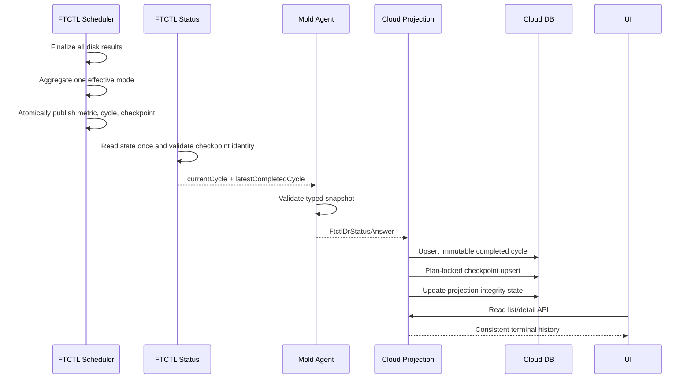

# Cross-Hypervisor DR Cycle Snapshot Consistency Design

> 2026-07-27 후속 계약: operation 전환 중 completed-cycle snapshot의 일부 필드가
> 사라지는 경우를 포함한 authority 승계, evidence completeness, 제한 재시도
> 규칙은
> [577-cross-hypervisor-dr-failover-projection-evidence-and-compensation-design-20260727.md](577-cross-hypervisor-dr-failover-projection-evidence-and-compensation-design-20260727.md)
> 를 따른다.

Date: 2026-07-18  
Status: Implemented, built, deployed, and ready for live retest  
Parent design: `559-cross-hypervisor-dr-incremental-mode-decision-and-cycle-projection-design-20260717.md`

## 1. Purpose

This design corrects two post-deployment consistency defects without changing
the VMware CBT transfer algorithm or the RPO scheduler policy.

1. A completed Cloud cycle and checkpoint can retain the baseline generation
   of a different sequence.
2. FTCTL `cycles/*.json` can report `CBT_INCREMENTAL` while every disk and the
   canonical cycle metrics report `NO_CHANGE`.

The correction establishes one immutable terminal-cycle contract from FTCTL
through Agent, Cloud projection, DB, API, and UI.

## 2. Live Preflight Evidence

### 2.1 Environment examined

| Workload | Plan | Engine Run | Worker |
|---|---|---|---|
| Rocky Linux | `75df369c-eb0e-4028-9a3e-7c07bb5d6fc6` | `ef3d42f8-efad-4b5e-97b5-49a76ffb1611` | `10.10.32.1` |
| Windows Server | `f76a4c48-4596-422c-9ed7-3c222b497de8` | `890ccd51-71c3-4801-9e46-0f346b07e336` | `10.10.32.2` |

Both Plans continued to complete RPO cycles. The defects are historical audit
and projection-consistency defects, not evidence that the latest data transfer
failed.

At the end of this preflight, both engines and DB were consistent at sequence
137: Linux was a verified 2,031,616-byte `CBT_INCREMENTAL` cycle and Windows
was a verified zero-byte `NO_CHANGE` cycle. Both had
`baselineGeneration=137` and no engine error.

### 2.2 Baseline-generation mismatch

| Plan ID | Sequence | FTCTL metric generation | `dr_sync_cycle` | `dr_restore_point` |
|---:|---:|---:|---:|---:|
| 33 | 36 | 36 | `NULL` | `NULL` |
| 33 | 118 | 118 | 119 | 119 |
| 34 | 55 | 55 | 56 | 56 |

Later rows, including Linux 119/120 and Windows 118/119/120, were correct. This
pattern proves an intermittent read/projection race rather than a deterministic
generation calculation error.

### 2.3 Final-mode mismatch

For Linux sequence 118 and 136 and Windows sequences 55, 118, 119, and 120:

- `cycle-metrics/*.json.effectiveMode` is `NO_CHANGE`;
- every `disks[].effectiveMode` is `NO_CHANGE`;
- `cycles/*.json.effectiveMode` is `CBT_INCREMENTAL`.

The metric file also contains the correct `baselineGeneration` and
`cycleToken`. The cycle summary omits both values.

### 2.4 Existing DB protection

The live DB already has:

- unique `(plan_id, sequence)` on `dr_sync_cycle`; `engine_run_uuid` is producer metadata;
- unique `(plan_id, checkpoint_ref_hash)` on `dr_restore_point`.

These prevent duplicate identities but do not prevent an existing terminal row
from being overwritten with fields from another generation.

## 3. Root Cause

### 3.1 Mixed-generation FTCTL status

`ftctl_dr_runtime_path_set` replaces the state file, but
`ftctl_dr_runtime_emit_state_json` calls
`ftctl_dr_runtime_state_get_from_path` separately for each field. Every call
reopens the file. If the scheduler publishes N+1 during those calls, one JSON
response can combine:

```text
latest_completed_checkpoint_sequence=N
latest_completed_baseline_generation=N+1
```

There are two additional publication weaknesses:

1. `mktemp -t` creates a temporary file outside the destination directory, so
   `mv` is not guaranteed to be a same-filesystem atomic rename.
2. `ftctl_dr_scheduler_update_state` uses `cp -f` to publish `status_path`,
   which permits readers to observe a partially copied file.

The Agent faithfully maps the mixed flat fields. Cloud then unconditionally
updates an already completed cycle and independently rebuilds the restore point
from the same response, preserving the mismatch twice.

### 3.2 Two final-mode writers

`ftctl_vmware_mover_write_cycle` writes the top-level mode from the pre-transfer
decision. Later, the mover computes the actual mode from disk results and
writes it only to `cycle-metrics/*.json`. The terminal cycle summary is never
finalized from that result.

The current metric aggregation also rejects a valid multi-disk cycle where
some disks are `CBT_INCREMENTAL` and unchanged disks are `NO_CHANGE`.

## 4. Terminal Cycle Contract

### 4.1 Identity

Every current or completed cycle snapshot has this immutable identity:

```text
(planUuid, runUuid, sequence, cycleToken)
cycleToken = planUuid + ":" + sequence
```

For schema version 1, a locally durable VMware cycle must satisfy:

```text
baselineGeneration == sequence
cycleCommitState == LOCAL_DURABLE
checkpoint state in {TARGET_READY, READY, COMPLETED}
```

A future schema may decouple generation from sequence, but it must increment
the contract version and provide an explicit generation identity. It must not
silently reinterpret version 1.

### 4.2 Effective-mode aggregation

The VM-level effective mode is derived only after all disk results are final.

| Disk result set | VM effective mode |
|---|---|
| all `NO_CHANGE` | `NO_CHANGE` |
| one or more `CBT_INCREMENTAL`, remainder `NO_CHANGE` | `CBT_INCREMENTAL` |
| all `FULL_SEED` | `FULL_SEED` |
| all `FULL_RESEED` | `FULL_RESEED` |
| empty or any other full/incremental mixture | fail with `DR_CYCLE_MODE_AGGREGATION_INVALID` |

`requestedMode` remains operator/scheduler intent. `effectiveMode` is the
measured result and must never be copied from the request after disk execution.

### 4.3 Terminal immutability

After a cycle is locally durable:

- identity, mode, generation, byte metrics, verification, and terminal
  timestamps are immutable;
- an equivalent repeat poll is a no-op;
- null fields may be backfilled only from the exact same terminal snapshot;
- a non-null conflict is not overwritten and raises
  `DR_CYCLE_TERMINAL_PROJECTION_CONFLICT`;
- current N+1 fields must never patch completed N.

## 5. FTCTL Design

### 5.1 Atomic state publication

Modify `lib/ftctl/dr_runtime.sh`:

```bash
ftctl_dr_runtime_atomic_replace_kv() {
  local path="$1"
  local dir tmp
  dir="$(dirname "$path")"
  tmp="$(mktemp "${dir}/.$(basename "$path").tmp.XXXXXX")"
  # Copy, apply all key mutations, fsync file, rename in the same directory,
  # then fsync the directory.
}
```

`ftctl_dr_runtime_path_set` delegates to this function. Temporary files are
created in the destination directory and cleaned by a trap.

Modify `lib/ftctl/dr_scheduler.sh` so
`ftctl_dr_scheduler_update_state` publishes `status_path` through the same
same-directory temporary-file and rename sequence. Remove direct `cp -f`.

### 5.2 Read one state snapshot

Replace the repeated key reads in `ftctl_dr_runtime_emit_state_json` with:

```bash
snapshot_path="$(ftctl_dr_runtime_capture_state_snapshot "$state_path")"
ftctl_dr_runtime_emit_snapshot_json "$snapshot_path" ...
```

`capture_state_snapshot` opens the state file once, parses all key/value pairs
in one Python process, and emits one temporary JSON object. All scalar output
fields and the nested cycle objects are derived from that object. Profile,
process-liveness, and event information may be added afterward, but they must
not replace cycle identity fields.

### 5.3 Canonical completed snapshot

The immutable VMware checkpoint JSON is the terminal source. When state points
to `latest_completed_checkpoint_path`, `dr-status` loads that file once and
validates:

```text
checkpoint.planUuid == requested plan
checkpoint.runUuid == requested run
checkpoint.sequence == state.latest_completed_checkpoint_sequence
checkpoint.cycleToken == plan + ":" + sequence
checkpoint.baselineGeneration == checkpoint.sequence   # contract v1
```

If validation fails, return `DR_STATUS_CYCLE_SNAPSHOT_INCOHERENT` and retain
the last-good Cloud projection. Do not emit a successful mixed snapshot.

The JSON response gains nested objects while retaining flat compatibility
fields for a rolling upgrade:

```json
{
  "cycleContractVersion": 1,
  "currentCycle": { "sequence": 121, "state": "RUNNING" },
  "latestCompletedCycle": {
    "sequence": 120,
    "cycleToken": "<plan>:120",
    "requestedMode": "CBT_INCREMENTAL",
    "effectiveMode": "NO_CHANGE",
    "baselineGeneration": 120,
    "commitState": "LOCAL_DURABLE"
  }
}
```

The version-1 identity tuple and typed metric fields are the comparison
contract. A separate digest is intentionally not added in this correction:
terminal immutability is enforced by sequence, token, generation, and typed
field validation, without introducing a second representation of the same
data.

### 5.4 Single final-mode writer

Refactor `lib/ftctl/dr_vmware_mover.sh`:

```text
ftctl_vmware_mover_collect_disk_results
  -> ftctl_vmware_mover_aggregate_cycle_result
  -> ftctl_vmware_mover_publish_cycle_result
```

`aggregate_cycle_result` implements section 4.2 once. The resulting object is
used to write both `cycle-metrics/*.json` and the terminal fields of
`cycles/*.json`. The cycle summary gains `cycleToken`, `baselineGeneration`,
`incrementalVerified`, and all aggregate byte metrics.

Both files are written by same-directory temp/rename. The checkpoint writer
continues to copy the already finalized metric object; it must not recalculate
mode or generation.

### 5.5 Historical-row correction boundary

This release does not add a second host command for historical repair. The
live preflight compared the retained sequence-specific FTCTL checkpoint and
metric artifacts with the three affected DB rows. Only rows whose Plan,
Run, sequence, token, generation, mode, and metrics were proven were corrected
before cleanup. Future inconsistencies are rejected before projection and keep
the last-good DB row.

## 6. Agent Design

### 6.1 Typed snapshot

Add `FtctlDrCycleSnapshot` under `core/src/main/java/com/cloud/agent/api` with
typed identity, mode, generation, metric, verification, and timestamp fields.
`FtctlDrStatusAnswer` gains:

```java
private FtctlDrCycleSnapshot currentCycle;
private FtctlDrCycleSnapshot latestCompletedCycle;
private Integer cycleContractVersion;
```

The existing flat getters remain during one compatibility window and delegate
to the nested snapshot when present.

### 6.2 Wrapper validation

Update `LibvirtFtctlDrStatusCommandWrapper` to parse the nested objects first.
For older FTCTL packages it may build a legacy snapshot from flat fields, but
only when all identity fields agree. Validation failure returns an unsuccessful
answer with `DR_STATUS_CYCLE_SNAPSHOT_INCOHERENT`.

No credential, profile path, or raw host file is added to the typed answer.

## 7. Cloud Backend Design

### 7.1 Snapshot conversion and validation

`FtctlDrRuntimeProjectionAdapter` consumes `FtctlDrCycleSnapshot` before
terminal DAO mutation. It validates Plan, Run, sequence, cycle token,
generation, mode, and byte-metric coherence. A failure marks the runtime
projection `INCONSISTENT`, returns a retryable typed error, and retains the
last-good cycle/checkpoint projection.

### 7.2 Immutable merge policy

`upsertTerminalCycle` applies:

```text
missing row                -> insert terminal snapshot
non-terminal same identity -> promote to terminal
terminal equivalent        -> no-op
terminal with null field   -> same-sequence non-null backfill only
terminal conflict          -> retain DB row and mark projection inconsistent
```

`projectCurrentSyncCycle` keeps its existing completed-row guard. Restore-point
upsert is protected by the existing Plan lock and is also a no-op when the
terminal generation and token are already identical. This patch deliberately
does not overwrite a coherent completed row with newer current-cycle fields.

## 8. DB Design

### 8.1 Schema additions

Use a forward-only, idempotent upgrade script and update `create-schema.sql`.

```sql
ALTER TABLE dr_sync_cycle
  ADD COLUMN cycle_token varchar(255) NULL;

ALTER TABLE dr_plan_runtime
  ADD COLUMN projection_integrity_state varchar(32)
    NOT NULL DEFAULT 'UNKNOWN',
  ADD COLUMN projection_integrity_code varchar(128) NULL,
  ADD COLUMN projection_integrity_sequence bigint unsigned NULL;
```

### 8.2 Backfill and repair

- populate `cycle_token` only when Plan, Run, sequence, and retained FTCTL
  evidence agree;
- repair the three observed rows only after exact retained-artifact comparison;
- never manufacture missing verification or generation evidence;
- retain existing unique indexes; they are already correct.

## 9. API And UI Design

### 9.1 API

Normal list/detail APIs keep their current mode, generation, and byte fields.
Add Plan-level fields:

```text
projectionintegritystate = CONSISTENT | INCONSISTENT | UNKNOWN
projectionintegritycode
projectionintegritysequence
```

Wire these fields through `DrPlanRuntimeVO`, `DrPlanResponse`, and
`DrResponseGenerator`. The Plan detail API therefore exposes projection
integrity without merging browser-side guesses into historical data.

The API serves cycle/checkpoint data only from DB terminal rows. It does not
merge current runtime values into historical responses.

### 9.2 UI

Update `DrProtectionInfoTab.vue`:

- continue to render API terminal cycle rows;
- show a compact warning only when projection integrity is `INCONSISTENT`;
- do not guess a generation or mode client-side;
- do not expose raw FTCTL paths or JSON.

Normal healthy Plans have no additional operator step or persistent banner.

## 10. End-to-End Flow



## 11. Tests

### 11.1 FTCTL

1. Publish N and N+1 repeatedly while calling `dr-status`; assert every result
   is wholly N or wholly N+1.
2. Kill publication between temp write and rename; assert the previous complete
   status remains readable.
3. All disks `NO_CHANGE` produces `NO_CHANGE` in cycle, metric, checkpoint, and
   status.
4. `CBT_INCREMENTAL + NO_CHANGE` produces VM-level `CBT_INCREMENTAL`.
5. Invalid full/incremental mixtures fail with the typed aggregation error.
6. The final journal overwrites the canonical summary with the measured result.

### 11.2 Agent

1. Nested snapshot type parsing and legacy fallback.
2. Token, sequence, generation, and negative-metric validation.
3. Mixed flat-field legacy input is rejected rather than transported.
4. Typed answers contain no credential or raw profile material.

### 11.3 Backend and DB

1. Complete N, then project running N+1; N remains unchanged.
2. A mixed N/N+1 snapshot is rejected and the last-good row is retained.
3. Equivalent terminal poll is a no-op.
4. Conflicting terminal poll does not overwrite and sets integrity
   `INCONSISTENT`.
5. Missing artifact does not result in inferred data.

### 11.4 API and UI

1. Historical cycle fields remain stable while current replication advances.
2. Healthy integrity has no warning.
3. Inconsistent integrity shows the typed warning and preserves the last-good
   row.

## 12. Deployment And Acceptance

Implementation order:

1. FTCTL atomic publication, snapshot read, aggregation, tests, and package.
2. Agent typed contracts and wrappers.
3. DB migration and VO/DAO changes.
4. Backend coherence validation, immutable completed-row projection, and
   last-good retention.
5. API/UI integrity fields and focused UI tests.
6. Changed-module Maven build, UI build, package deployment, and cleanup.

Live acceptance requires at least three consecutive Linux and Windows cycles,
including one `NO_CHANGE` and one changed CBT cycle where available. For every
accepted sequence, cycle summary, metric, checkpoint, Agent answer, DB cycle,
restore point, API, and UI must agree on identity, effective mode, generation,
metrics, and verification. The three known historical mismatches must be
corrected only from retained matching evidence without changing unrelated
terminal rows.

## 13. AS-IS / TO-BE

| Layer | AS-IS | TO-BE |
|---|---|---|
| FTCTL state | each status field reopens a changing file; status copy is not atomic | one captured state snapshot, same-directory atomic publication, checkpoint identity validation |
| FTCTL mode | cycle summary keeps pre-transfer mode while metrics contain actual mode | one post-disk aggregation writes cycle, metric, checkpoint, and status consistently |
| Agent | transports independent flat fields without cross-field validation | typed current/completed snapshots with identity and generation validation |
| Backend | completed cycles can be rewritten from a later mixed response | validate one typed snapshot, retain last-good data, and make equivalent completed polls no-ops |
| DB | unique identity prevents duplicates but not conflicting terminal updates | cycle token and Plan-level integrity state make projection identity explicit |
| API | cannot distinguish healthy data from a projection conflict | exposes typed projection-integrity state while preserving existing fields |
| UI | trusts every historical row as authoritative | shows last-good data and a concise warning only when integrity is degraded |
| Repair | historical mismatch can be guessed from adjacent sequence values | retained exact Plan/Run/sequence artifacts are required before a scoped correction |

## 14. Completion Criteria

The correction is complete only when:

1. no concurrent `dr-status` test produces a mixed-generation snapshot;
2. VM-level effective mode agrees across every FTCTL artifact;
3. completed DB cycles cannot be overwritten by N+1 fields;
4. cycle and restore-point rows accept only coherent terminal snapshots;
5. the three known historical mismatches are repaired from exact FTCTL
   evidence;
6. Linux and Windows live RPO cycles satisfy the end-to-end invariant;
7. focused FTCTL, Agent, backend, DB, API, and UI tests pass.

## 15. Implementation And Deployment Result

### 15.1 Source result

- FTCTL commit: `4c7ff88f8259b23b9c358cda8ccab75a3d6395c2`
- FTCTL GitHub Actions run: `29647125866`
- package: `ablestack_vm_ftctl-0.9.1-1.noarch`
- package SHA-256:
  `79d86f9977b53b4ae54e8eacb5b62d2b49a7b212f862ee578fcd717b6896a193`
- Cloud KVM wrapper tests: 12 passed
- Cloud DR projection adapter tests: 12 passed
- Cloud changed-module Maven package build: passed
- Cloud UI production build and post-build validation: passed

### 15.2 Deployment result

- FTCTL package deployed to `10.10.32.1`, `.2`, and `.3`;
- changed Cloud management and Agent classes deployed without replacing full
  Cloud packages;
- DB forward schema applied and verified at `cycle_token varchar(255)`;
- UI static assets overlaid while preserving `WEB-INF`;
- `mold`, all `mold-agent` services, and all FTCTL timers are active;
- `/client/` returns HTTP 200 and the active bundle contains the projection
  integrity marker.

### 15.3 Cleanup and retest boundary

The two preflight Plans were released and soft-deleted. Their runtime authority
and active cycle rows were removed, target volumes were expunged, target VMs
entered normal asynchronous expunge, and the Plan-specific FTCTL runtime
directories were removed. A new Linux and Windows Plan can now be created for
the required live acceptance cycles in section 12.
