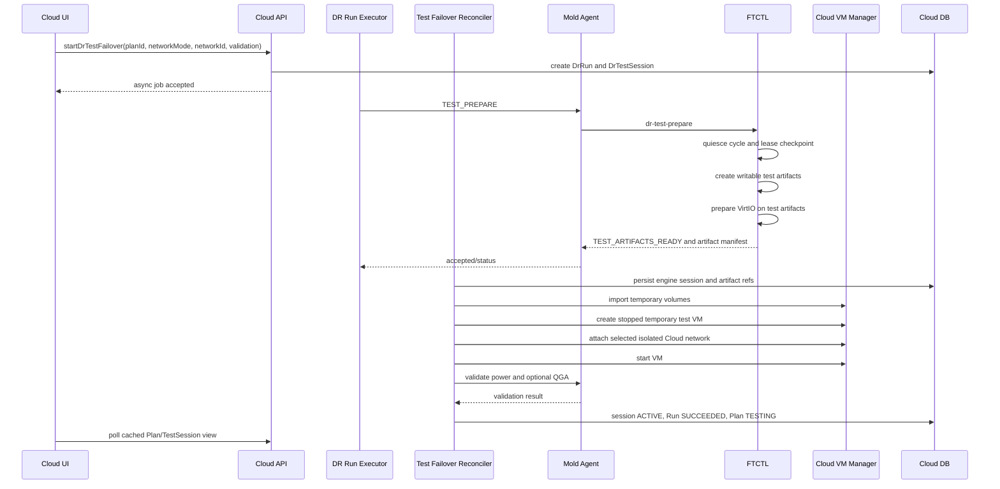
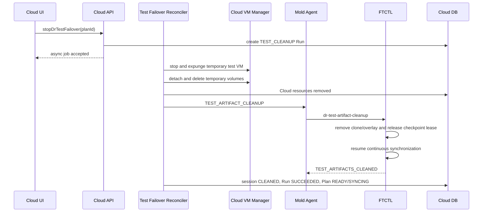

# Cross Hypervisor DR Cloud-Managed Test Failover Lifecycle Design

- Date: 2026-07-19
- Status: baseline and canonical artifact path implemented; terminal convergence correction pending
- Scope: VMware to ABLESTACK Test Failover lifecycle ownership
- Normative for: UI, API, Cloud backend, Mold Agent, FTCTL, DB
- Related: 500, 501, 502, 503, 506, 507, 508, 509, 510, 521, 522, 554, 562, 563

> Normative guest identity and failed-session convergence correction
> (2026-07-28):
> [579-cross-hypervisor-dr-action-intent-guest-identity-and-failed-test-terminal-convergence-design-20260728.md](579-cross-hypervisor-dr-action-intent-guest-identity-and-failed-test-terminal-convergence-design-20260728.md)
> supersedes this document for action-intent correlation, canonical guest
> identity resolution, pre-artifact guest preflight, and failed Test Session
> cleanup proof.

> Normative correction (2026-07-19):
> [562-cross-hypervisor-dr-test-artifact-contract-and-projection-isolation-design-20260719.md](562-cross-hypervisor-dr-test-artifact-contract-and-projection-isolation-design-20260719.md)
> supersedes this document wherever disk identity is inferred from
> `targetDiskRef`, an early engine failure has no Cloud Test Session row, or a
> finite Test Failover operation is allowed to replace continuous-sync
> protection authority.
>
> Normative terminal convergence correction (2026-07-20):
> [563-cross-hypervisor-dr-test-failover-terminal-convergence-design-20260720.md](563-cross-hypervisor-dr-test-failover-terminal-convergence-design-20260720.md)
> supersedes this document wherever `ACTIVE` may regress to an engine artifact
> state, Run completion waits on a later polling race, or Plan protection state
> is used as the active-test lifecycle state.

## 1. Decision

Test Failover must not start the permanent DR target VM because that VM and its
volumes are the continuously replicated recovery asset. Test Failover therefore
requires checkpoint-derived writable test disks and a separate temporary VM.

The temporary VM, however, must be created, started, observed, stopped, and
expunged by Cloud. FTCTL must not define or start the customer workload domain
directly through `virsh`.

The ownership boundary is fixed as follows.

| Resource or action | Authority |
|---|---|
| DR Plan, Run, test session, eligibility | Cloud backend |
| Permanent DR target VM and volumes | Cloud backend |
| Temporary test VM, volumes, network, host placement | Cloud backend |
| Durable checkpoint and checkpoint lease | FTCTL |
| RBD clone, qcow2 immutable copy/overlay, guest preparation | FTCTL |
| Typed command transport and VM validation probe | Mold Agent |
| UI state | Cloud API/DB projection only |

The existing FTCTL direct-domain lifecycle is a compatibility path only. The
new Cloud-managed path must fail closed when either Cloud or FTCTL does not
advertise the v2 contract. It must never silently fall back to a raw libvirt
domain.

## 2. Root cause

The current implementation has two independent VM lifecycle authorities.

1. `DrTargetMaterializationServiceImpl` imports the replicated volumes, creates
   a permanent stopped Cloud VM, and stores `dr_replica.target_vm_id`.
2. `ftctl_dr_runtime_materialize_test_artifacts()` creates RBD clones or qcow2
   overlays from the permanent replica disks.
3. `ftctl_guestprep_prepare_and_start()` generates a different domain named
   `ftctl-dr-test-<plan>-<run>` and directly calls libvirt define/start helpers.
4. `ftctl_dr_runtime_cleanup_test_session()` directly undefines that domain and
   removes its artifacts.
5. `ISOLATED` currently becomes an empty NIC list, not a Cloud-managed isolated
   network attachment.

This produces the following structural defects.

- Cloud cannot account for, authorize, schedule, or display the test VM.
- Cloud and FTCTL can disagree about VM state and cleanup completion.
- Host capacity and network policy are bypassed.
- A test domain can survive Cloud Run failure or management restart.
- UI `ISOLATED` does not mean an actual isolated Cloud network.
- The permanent DR target VM and the test VM have unrelated resource identity.

## 3. Read-only preflight evidence

The following checks were performed without starting or modifying a VM.

| Check | Result |
|---|---|
| Linux Plan `cbdf5abe-2795-4e7c-9995-78a67129b0de` | Cloud target VM id `252`, `Stopped` |
| Windows Plan `738d3fc8-45b1-4dc7-9115-8c1b7ffbeef3` | Cloud target VM id `253`, `Stopped` |
| Replica disks | Cloud volumes are attached and `Ready` |
| Target hosts | host ids `1` and `2` are `Up/Enabled` |
| libvirt domains | no permanent target or active `ftctl-dr-test-*` domain |
| FTCTL profiles | each Plan profile exists on its designated worker host |
| Installed FTCTL code | still directly generates `ftctl-dr-test-*` |

This confirms that Cloud owns the durable stopped VM records while FTCTL would
create a second unmanaged runtime object for Test Failover.

## 4. Non-negotiable invariants

1. UI calls Cloud API only.
2. API returns an asynchronous job/Run and never waits for guest preparation or
   VM boot.
3. The permanent target VM id and permanent target volume ids never change
   during Test Failover.
4. Test writes never reach permanent replica disks.
5. Every test VM and test volume has a Cloud DB identity.
6. FTCTL never invokes define/start/stop/undefine for the customer test VM.
7. Agent does not become an authority; it transports commands and probes the
   Cloud-managed VM on the selected host.
8. Cleanup is idempotent and ordered: Cloud resources first, FTCTL artifacts
   and checkpoint lease second.
9. A Run is action history. A `DrTestSession` is the authoritative active test
   lifecycle object.
10. No automatic fallback to `test-domain-lifecycle-v1` is allowed.

## 5. Target flow



Test cleanup is the reverse ownership order.



## 6. State model

### 6.1 Test session states

```text
REQUESTED
  -> ENGINE_PREPARING
  -> ARTIFACTS_READY
  -> VOLUMES_IMPORTING
  -> VM_CREATING
  -> VM_STARTING
  -> VM_VALIDATING
  -> ACTIVE
  -> CLEANUP_VM_STOPPING
  -> CLEANUP_VM_EXPUNGING
  -> CLEANUP_VOLUME_DELETING
  -> CLEANUP_ENGINE_ARTIFACTS
  -> CLEANED
```

Any nonterminal state may move to `FAILED`. A failed session remains cleanup
eligible until every Cloud and FTCTL resource is confirmed absent.

### 6.2 Plan and Run semantics

| Object | State rule |
|---|---|
| `DrRun(TEST_FAILOVER)` | succeeds only after test VM validation passes |
| `DrPlan` | becomes `TESTING` only when session is `ACTIVE` |
| `DrRun(TEST_CLEANUP)` | succeeds only after Cloud resources and FTCTL artifacts are absent |
| `DrPlan` after cleanup | returns to `READY` or current continuous-sync state |

`ARTIFACTS_READY` is not Test Failover success. Agent acceptance is not Test
Failover success. A Running libvirt domain without a Cloud VM id is an integrity
failure.

A successful finite action also clears stale `DrPlan.last_error_code` and
`last_error_message` left by an earlier failed attempt, unless the Plan itself is
in terminal `ERROR`. Run history retains the earlier failure for audit, while the
current Plan summary reflects the successful retry.

## 7. UI design

### 7.1 Dialog

`DrPlanList.vue` keeps the Test Failover dialog but changes its network model.

| Field | Design |
|---|---|
| Network mode | `ISOLATED_NETWORK`, `NO_NIC`, `PRODUCTION_NETWORK` |
| Test network | Cloud network select; required for isolated/production modes |
| Boot validation | `POWER_STATE_ONLY` or `QGA_REQUIRED` |
| Timeout | validated integer with backend limit |

`ISOLATED_NETWORK` is the default. It must resolve a Cloud network id from the
target site inventory or the Plan policy. `NO_NIC` is an explicit diagnostic
choice and must not be labeled isolated. `PRODUCTION_NETWORK` is admin-only and
requires confirmation.

### 7.2 Detail view

The protection information view adds one test-session block.

- session state and progress
- temporary test VM name/id and Cloud link
- checkpoint sequence
- selected test network
- boot validation result
- cleanup residual count

The UI never displays an FTCTL domain name as the VM identity. Engine session
and artifact references are diagnostic fields in execution details only.

### 7.3 Action gating

`testFailover=true` requires all of the following.

- permanent target VM exists and is stopped
- latest durable checkpoint exists
- no active conflicting Run or Test Session
- resolved test network for networked modes
- Cloud/Agent/FTCTL v2 capabilities
- no residual Cloud test VM/volume from an older session

## 8. API design

### 8.1 Existing public commands

Keep the command names.

- `startDrTestFailover`
- `stopDrTestFailover`

Extend `startDrTestFailover` with:

| Parameter | Type | Rule |
|---|---|---|
| `networkmode` | string | normalized enum |
| `networkid` | UUID | required unless `NO_NIC` |
| `bootvalidationmode` | string | existing enum |
| `boottimeoutseconds` | integer | bounded server-side |

The API creates the Run/Test Session in one transaction and returns immediately.
It does not synchronously invoke Agent, FTCTL, volume import, or VM start.

### 8.2 Response additions

`DrPlanResponse` and `DrProtectionViewResponse` expose a compact typed summary.

```json
{
  "testsession": {
    "id": "uuid",
    "state": "VM_STARTING",
    "testvmid": "uuid-or-null",
    "testvmname": "Rocky10-1-dr-test-1a2b3c",
    "networkmode": "ISOLATED_NETWORK",
    "networkid": "uuid",
    "checkpointsequence": 12,
    "validationmode": "POWER_STATE_ONLY",
    "residualcount": 0
  }
}
```

Secrets and raw engine profile JSON are never returned.

## 9. Cloud backend code design

### 9.1 New entities and services

Add:

```java
interface DrTestFailoverService {
    DrTestSessionVO createSession(DrExecutionContext context, DrTestRequest request);
    void reconcile(long sessionId);
    void requestCleanup(long sessionId, long cleanupRunId);
}

interface DrTestVmLifecycleService {
    TestVmResources importArtifacts(DrTestSessionVO session, ArtifactManifest manifest);
    UserVmVO createStoppedTestVm(DrTestSessionVO session, TestVmResources resources);
    void startAndValidate(DrTestSessionVO session);
    CleanupResult cleanupCloudResources(DrTestSessionVO session);
}
```

Implement with:

- `DrTestFailoverServiceImpl`
- `DrTestVmLifecycleServiceImpl`
- `DrTestFailoverReconciler`
- `DrTestSessionVO`, `DrTestDiskVO`
- corresponding DAO interfaces and implementations

`DrRunExecutorImpl` remains the generic Run dispatcher. For `TEST_FAILOVER` and
`TEST_CLEANUP`, it creates or advances the test session and returns after Agent
acceptance. `DrProjectionScheduler` invokes the reconciler when FTCTL status or
Cloud VM state changes. Long guest preparation and boot work never runs on the
API thread.

### 9.2 Artifact import and VM creation

Extract reusable import logic from `DrTargetMaterializationServiceImpl` into a
provider-neutral helper instead of duplicating `VolumeManager.importVolume()`.

```java
DrImportedVolume importManagedVolume(
    AccountVO owner,
    long poolId,
    long diskOfferingId,
    String path,
    ImageFormat format,
    long sizeBytes,
    Map<String, String> details);
```

Temporary volume details:

- `dr.test.volume=true`
- `dr.plan.uuid`
- `dr.test.session.uuid`
- `dr.checkpoint.sequence`
- `dr.engine.artifact.ref`

Create the stopped test VM with the same resolved CPU, memory, firmware,
Secure Boot, controller, `io.policy=io_uring`, and iothreads contract as the
permanent target VM. Use the imported test root volume and test data volumes,
not the permanent replica volumes.

Temporary VM details:

- `dr.test.vm=true`
- `dr.plan.uuid`
- `dr.test.session.uuid`
- `dr.permanent.target.vm.id`
- `dr.cleanup.required=true`

VM name:

```text
<permanent-target-name>-test-<session-short-uuid>
```

### 9.3 Boot validation

Cloud starts the VM through `UserVmManager.startVirtualMachine()` on the
resolved worker host. Power state comes from normal Cloud VM state. Optional
QGA validation uses a typed Agent probe against the Cloud VM instance name.

Cloud commits `ACTIVE` only when:

- VM state is `Running`
- the VM id belongs to the active test session
- host id matches the session placement
- optional QGA probe passes
- all test disks are attached to the test VM
- permanent target VM remains `Stopped`

### 9.4 Compensation

Every step writes DB state before and after the external side effect.

| Failure | Compensation |
|---|---|
| artifact prepare fails | release engine partial artifacts/lease |
| volume import partially fails | delete imported test volumes, then engine cleanup |
| VM create fails | delete test volumes, then engine cleanup |
| VM start/validation fails | stop/expunge test VM, delete volumes, engine cleanup |
| management restart | reconciler resumes from DB and observed Cloud/FTCTL state |
| Agent unavailable during cleanup | retain cleanup-required session and retry |

## 10. Agent contract

Agent transports typed commands only.

Replace the test-domain capability requirement:

```text
remove/deprecate: test-domain-lifecycle-v1
require: test-artifact-lifecycle-v2
require: guest-preparation-v2
require: checkpoint-lease-v1
require: cloud-managed-test-vm-v1
```

Add action semantics:

| Action | CLI | Result |
|---|---|---|
| `TEST_PREPARE` | `dr-test-prepare` | artifact manifest ready |
| `TEST_ARTIFACT_CLEANUP` | `dr-test-artifact-cleanup` | artifacts and lease removed |
| `TEST_VM_VALIDATE` | Agent-local probe | Cloud VM power/QGA result |

`FtctlDrActionAnswer`/status must carry typed artifact metadata or a reference to
the status manifest. The wrapper validates that every artifact path belongs to
the requested Plan and engine session before returning it.

Agent must never call `virsh define/start/undefine` for the customer test VM.
An engine-internal conversion helper domain may be used only for offline Windows
driver preparation. It has no customer network, is tracked as an engine job,
and is not reported as the test VM.

## 11. FTCTL code design

### 11.1 Split preparation from VM lifecycle

Refactor:

```text
ftctl_dr_runtime_prepare_test_session
ftctl_dr_runtime_materialize_test_artifacts
ftctl_guestprep_prepare_and_start
```

to:

```text
ftctl_dr_runtime_prepare_test_artifacts
ftctl_guestprep_prepare_artifacts
ftctl_dr_runtime_publish_test_artifact_manifest
```

The new path performs:

1. scheduler transition/quiesce
2. latest committed checkpoint selection
3. checkpoint lease acquisition
4. provider-specific writable artifact creation
5. Linux/Windows guest preparation on test artifacts
6. artifact manifest validation and atomic publication
7. scheduler resume when the storage driver reports `syncSafe=true`

It does not call:

- `v2k_target_generate_libvirt_xml()` for the customer test VM
- `v2k_target_define_libvirt()`
- `v2k_target_start_vm()`
- `virsh undefine` during normal test cleanup

### 11.2 Artifact manifest

```json
{
  "schemaVersion": 2,
  "engineSessionRef": "plan/run/generation",
  "checkpointRef": "opaque-ref",
  "checkpointSequence": 12,
  "syncSafe": true,
  "guestPreparation": {
    "state": "READY",
    "family": "linux",
    "firmware": "efi",
    "secureBoot": true
  },
  "artifacts": [
    {
      "device": "disk0",
      "type": "rbd-clone",
      "path": "rbd:pool/image-clone",
      "format": "raw",
      "virtualSizeBytes": 107374182400,
      "cleanupToken": "opaque-token"
    }
  ]
}
```

The manifest contains no credentials. `cleanupToken` is validated against the
Plan/session namespace and is not a shell fragment.

### 11.3 Storage safety

RBD clone from a protected snapshot may set `syncSafe=true` after the clone is
created and the checkpoint lease is durable. A qcow2 backing overlay must not
set `syncSafe=true` if its backing file can continue changing. The file driver
must create an immutable reflink/copy or reject Test Failover with
`DR_TEST_STORAGE_ISOLATION_UNSUPPORTED`.

Continuous synchronization must not remain paused for the operator's entire
test window. It resumes as soon as test artifacts are proven independent.

### 11.4 FTCTL states

Replace customer-domain states with artifact states.

```text
TEST_ARTIFACT_PREPARING
TEST_ARTIFACTS_READY
TEST_ARTIFACT_CLEANUP
TEST_ARTIFACTS_CLEANED
```

`TEST_RUNNING` belongs to Cloud session projection, not FTCTL runtime authority.

## 12. DB design

Add `dr_test_session`.

```sql
CREATE TABLE dr_test_session (
  id BIGINT UNSIGNED NOT NULL AUTO_INCREMENT,
  uuid VARCHAR(40) NOT NULL,
  plan_id BIGINT UNSIGNED NOT NULL,
  start_run_id BIGINT UNSIGNED NOT NULL,
  cleanup_run_id BIGINT UNSIGNED DEFAULT NULL,
  checkpoint_id BIGINT UNSIGNED DEFAULT NULL,
  checkpoint_sequence BIGINT UNSIGNED DEFAULT NULL,
  engine_session_ref VARCHAR(2048) DEFAULT NULL,
  test_vm_id BIGINT UNSIGNED DEFAULT NULL,
  target_host_id BIGINT UNSIGNED DEFAULT NULL,
  network_mode VARCHAR(32) NOT NULL,
  network_id BIGINT UNSIGNED DEFAULT NULL,
  validation_mode VARCHAR(32) NOT NULL,
  state VARCHAR(64) NOT NULL,
  error_code VARCHAR(128) DEFAULT NULL,
  error_message TEXT DEFAULT NULL,
  residual_count INT NOT NULL DEFAULT 0,
  version BIGINT UNSIGNED NOT NULL DEFAULT 0,
  created DATETIME NOT NULL,
  updated DATETIME DEFAULT NULL,
  completed DATETIME DEFAULT NULL,
  removed DATETIME DEFAULT NULL,
  PRIMARY KEY (id),
  UNIQUE KEY uk_dr_test_session_uuid (uuid),
  KEY idx_dr_test_session_plan_state (plan_id, state, removed),
  KEY idx_dr_test_session_vm (test_vm_id)
);
```

Add `dr_test_disk`.

```sql
CREATE TABLE dr_test_disk (
  id BIGINT UNSIGNED NOT NULL AUTO_INCREMENT,
  uuid VARCHAR(40) NOT NULL,
  session_id BIGINT UNSIGNED NOT NULL,
  replica_disk_id BIGINT UNSIGNED NOT NULL,
  engine_artifact_ref VARCHAR(2048) NOT NULL,
  cleanup_token VARCHAR(2048) DEFAULT NULL,
  test_volume_id BIGINT UNSIGNED DEFAULT NULL,
  format VARCHAR(64) DEFAULT NULL,
  size_bytes BIGINT DEFAULT NULL,
  state VARCHAR(64) NOT NULL,
  created DATETIME NOT NULL,
  updated DATETIME DEFAULT NULL,
  removed DATETIME DEFAULT NULL,
  PRIMARY KEY (id),
  UNIQUE KEY uk_dr_test_disk_uuid (uuid),
  KEY idx_dr_test_disk_session (session_id, removed),
  KEY idx_dr_test_disk_volume (test_volume_id)
);
```

Do not overload `dr_cutover_session`. Test Failover is reversible and has a
temporary Cloud resource lifecycle; real Failover changes active-side authority.

## 13. Error model

| Error | Meaning |
|---|---|
| `DR_TEST_CAPABILITY_V2_REQUIRED` | mixed old/new Cloud-Agent-FTCTL stack |
| `DR_TEST_NETWORK_UNRESOLVED` | required Cloud test network missing |
| `DR_TEST_ARTIFACT_PREPARE_FAILED` | FTCTL artifact preparation failed |
| `DR_TEST_STORAGE_ISOLATION_UNSUPPORTED` | no immutable test disk strategy |
| `DR_TEST_VOLUME_IMPORT_FAILED` | Cloud temporary volume import failed |
| `DR_TEST_VM_CREATE_FAILED` | Cloud temporary VM creation failed |
| `DR_TEST_VM_START_FAILED` | Cloud VM manager could not start VM |
| `DR_TEST_BOOT_TIMEOUT` | VM did not reach requested validation state |
| `DR_TEST_QGA_UNAVAILABLE` | QGA-required validation failed |
| `DR_TEST_CLEANUP_INCOMPLETE` | one or more Cloud/FTCTL resources remain |
| `DR_TEST_OWNERSHIP_INCONSISTENT` | unmanaged test domain or mismatched VM id detected |

## 14. Compatibility and rollout

1. Add DB schema and Cloud classes first, feature default disabled.
2. Deploy Agent command wrappers and FTCTL v2 artifact capability.
3. Verify every target host reports all v2 capabilities.
4. Enable `dr.test.cloud.managed.lifecycle.enabled` globally.
5. Eligibility rejects Test Failover on mixed versions.
6. Remove/deprecate direct test-domain code after one compatibility release.

There is no automatic fallback. A direct-domain fallback would recreate the
same split authority and make cleanup nondeterministic.

## 15. Required tests

### 15.1 Cloud unit tests

- API validation for network mode/id
- session creation and single-active-session enforcement
- artifact manifest validation and credential redaction
- idempotent volume import and VM creation
- permanent target VM remains stopped
- state reconciliation after management restart
- compensation for every partial failure
- cleanup ordering and residual detection

### 15.2 Agent/FTCTL tests

- capability v2 negotiation
- RBD snapshot/clone manifest and cleanup
- file-backed immutable-copy strategy
- Linux VirtIO preparation without customer-domain start
- Windows helper isolation and cleanup
- checkpoint lease retention/release
- no customer `virsh define/start/undefine` call

### 15.3 End-to-end acceptance

For Linux and Windows:

1. permanent target VM remains `Stopped`
2. test volumes and test VM are visible in Cloud
3. test VM boots on the selected Cloud network
4. firmware/Secure Boot and VirtIO contract match
5. sync resumes while the independent test VM remains active
6. Stop Test Failover removes the Cloud VM/volumes and FTCTL artifacts
7. next incremental cycle completes without reseed
8. DB, Cloud VM state, Agent status, and FTCTL state are consistent

### 15.4 Expected source change map

| Repository/file | Planned code change |
|---|---|
| `ui/src/views/infra/dr/DrPlanList.vue` | network mode/id input, typed session display, action gating |
| `ui/src/api/dr.js` | pass `networkid`; consume typed test-session response |
| `StartDrTestFailoverCmd.java` | validate typed network/boot policy and create async session |
| `DrPlanResponse.java`, `DrProtectionViewResponse.java` | expose compact test-session summary |
| `DrRunExecutorImpl.java` | route start/cleanup to the test-session workflow without blocking |
| `DrProjectionScheduler.java` | trigger idempotent test-session reconciliation |
| new `DrTestFailoverServiceImpl.java` | authoritative session transition and compensation |
| new `DrTestVmLifecycleServiceImpl.java` | import volumes, create/start/validate/expunge Cloud VM |
| `DrTargetMaterializationServiceImpl.java` | extract reusable managed-volume import/hardware helpers |
| `FtctlDrUnifiedActionAdapter.java` | dispatch artifact actions and require v2 capabilities |
| `FtctlDrRuntimeProjectionAdapter.java` | project artifact state separately from Cloud VM state |
| `FtctlDrActionCommand.java` | add `TEST_PREPARE`, `TEST_ARTIFACT_CLEANUP`, typed session context |
| `LibvirtFtctlDrActionCommandWrapper.java` | map typed artifact CLI args; remove customer-domain authority |
| new Agent validation command/wrapper | probe Cloud VM power and optional QGA only |
| schema upgrade files and `create-schema.sql` | create `dr_test_session` and `dr_test_disk` |
| `lib/ftctl/dr_runtime.sh` | artifact-only prepare/cleanup state machine |
| `lib/ftctl/guestprep.sh` | prepare artifacts without defining/starting customer VM |
| `lib/v2k/target_libvirt.sh` | remain available for migration/helper use, not Test Failover VM lifecycle |
| FTCTL self-tests | assert no customer-domain define/start/undefine in v2 path |

## 16. AS-IS / TO-BE

| Layer | AS-IS | TO-BE |
|---|---|---|
| UI | isolated option can mean no NIC; no Cloud test VM link | explicit network semantics and Cloud test VM/session status |
| API | starts an engine action with no Cloud test resource contract | creates async Run plus authoritative Test Session |
| Backend | projects FTCTL test-domain status | reconciles FTCTL artifacts into Cloud volumes and a Cloud VM |
| Agent | transports command that lets FTCTL own domain lifecycle | transports artifact actions and validates Cloud-managed VM |
| FTCTL | clone, guest prep, direct `virsh` lifecycle, cleanup | checkpoint/clone/guest prep only; no customer VM lifecycle |
| DB | Run JSON and permanent replica only | typed test session and per-disk Cloud/engine identities |
| Network | `ISOLATED` becomes empty NIC list | selected Cloud isolated network; `NO_NIC` is explicit |
| Cleanup | FTCTL undefines domain and removes clone | Cloud removes VM/volumes first, FTCTL removes artifacts/lease second |
| Authority | Cloud and FTCTL both own VM state | Cloud exclusively owns VM lifecycle; FTCTL owns data-plane artifacts |

## 17. Continuous sync projection completion

Continuous FTCTL synchronization intentionally keeps the scheduler process alive after a cycle. Therefore the Cloud run projection must not wait only for a top-level `READY` state. A sync run is complete when either the runtime is `READY`/`TARGET_READY`, or all of the following are true:

- runtime state is `SYNCING`;
- `cycle_state` is `IDLE` or `COMPLETED`;
- `current_checkpoint_state` is `COMPLETED`, `READY`, or `TARGET_READY`;
- a durable target checkpoint and the Cloud-managed target references exist.

This rule completes the finite Cloud async run while retaining the long-lived FTCTL scheduler. It also refreshes `dr_plan_runtime` with the live scheduler PID so action eligibility is derived from the current authority generation instead of a stale completed run.

`runtime_generation` is monotonic only inside one `engine_run_uuid`. A correlated
new run starts a new authority epoch and may restart generation at `1`; a lower
generation is rejected only for the same run or for a status payload without a
correlated run UUID. This prevents an older completed run with a larger
generation from blocking live scheduler and RPO projection for its successor.

## 18. Completion gate

This design is complete when all referenced documents use the ownership matrix
in section 1 and no normative text describes the customer Test Failover VM as
engine-owned. Implementation is not complete until the v2 capability, DB
entities, Cloud reconciler, FTCTL artifact-only path, and Linux/Windows
end-to-end tests pass.

The baseline Cloud-managed lifecycle has been implemented. The implementation
is not accepted for Test Failover until document 562's typed storage locator,
transactional REQUESTED session, all-path cleanup, error normalization,
projection isolation, and restore-point producer attribution gates pass.

## 19. Terminal convergence clarification - 2026-07-20

The successful steady state is `DrRun(TEST_FAILOVER)=SUCCEEDED` together with
`DrTestSession=ACTIVE`. FTCTL remains `TEST_ARTIFACTS_READY` while the operator
uses the Cloud-managed test VM. These states are complementary, not conflicting.

Cloud session transitions are monotonic. Runtime projection may copy artifact
evidence into an `ACTIVE` session but must not change its state back to
`ARTIFACTS_READY`. The target materializer directly invokes the idempotent Run
completion boundary after boot validation, while periodic projection is a
restart-recovery fallback. Plan protection authority remains separate and the
UI derives a `TEST_ACTIVE` overlay from the active Test Session.

The detailed code contract, request-field correction, steps/events, DB
conditional transition, and verification gates are normative in document 563.

## 20. Post-Cleanup Protection Convergence - 2026-07-21

`DrTestSession=CLEANED` and cleanup Run `SUCCEEDED` remain authoritative for the
temporary environment lifecycle. They must not become the authority for later
replication checkpoints. Cloud presents a short `복제 재개 확인 중` overlay until
the Plan scheduler has acknowledged RUNNING and a checkpoint newer than the
test checkpoint is durable and projected.

The producer Run, Plan authority, cycle/restore-point attribution, DB fields,
and delayed-resume error contract are defined in document 565. No direct UI to
Agent/FTCTL call and no duplicate automatic Resume command are permitted.

## 21. Failed Session Blocking Clarification - 2026-07-31

A failed Test Session blocks a new test only while it has a cleanup obligation
or lacks terminal cleanup proof. `FAILED` with `cleanup_required=false`, no
Cloud test resources, and terminal FTCTL evidence is soft-closed and retained
as history. `CLEANUP_FAILED` always blocks a new test and exposes cleanup retry.

Menu availability and action-time validation must consume the same lifecycle
resolution. The normative state matrix, transaction boundary, and async
acceptance flow are defined in document 586.
