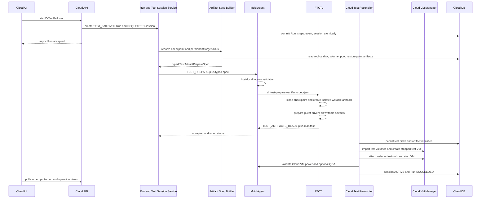

# Cross Hypervisor DR Test Artifact Contract And Projection Isolation Design

- Date: 2026-07-19
- Status: canonical artifact path implemented and real-environment verified; terminal convergence correction pending
- Scope: VMware to ABLESTACK Test Failover failure remediation
- Normative for: UI, API, Cloud backend, Mold Agent, FTCTL, DB
- Related: 521, 522, 523, 554, 561, 563
- FTCTL companion: `ablestack-qemu-exec-tools/docs/ftctl/435-ftctl-dr-test-artifact-canonical-locator-and-failure-contract-design-20260719.md`

> Normative guest identity and failed-cleanup update (2026-07-28):
> [579-cross-hypervisor-dr-action-intent-guest-identity-and-failed-test-terminal-convergence-design-20260728.md](579-cross-hypervisor-dr-action-intent-guest-identity-and-failed-test-terminal-convergence-design-20260728.md)
> requires pre-artifact canonical guest inspection and separates failed
> operation history from the actual cleanup-required flag.

> Normative terminal convergence update (2026-07-20):
> [563-cross-hypervisor-dr-test-failover-terminal-convergence-design-20260720.md](563-cross-hypervisor-dr-test-failover-terminal-convergence-design-20260720.md)
> governs monotonic Cloud Test Session state, direct Run completion after Cloud
> boot validation, restart recovery, and canonical validation-policy fields.

## 1. Decision

The existing Cloud-managed Test Failover ownership model remains correct, but
the disk handoff and projection boundaries are incomplete. This design fixes
those boundaries without returning VM lifecycle authority to FTCTL.

The final ownership model is:

| Resource or decision | Authority |
|---|---|
| Test Failover request, Run, Test Session, eligibility | Cloud backend |
| Permanent replica VM and permanent replica volumes | Cloud backend |
| Temporary test VM, test volumes, network, placement | Cloud backend |
| Mapping from Cloud volume/storage identity to typed source locator | Cloud backend |
| Host-local validation and normalization of the locator | Mold Agent |
| Checkpoint lease, RBD clone or immutable file artifact, guest preparation | FTCTL |
| Continuous replication authority and checkpoint production | FTCTL sync scheduler |
| Protection-state projection and operation-state projection | Cloud backend, stored separately |
| User-visible state | Cloud API/DB projection only |

FTCTL must not infer a storage provider from a display name. Cloud must not ask
FTCTL to create, start, stop, or delete the customer test VM. Agent must not
become a durable state authority.

## 2. Observed failure and root cause

### 2.1 Failed run

The Linux Plan `cbdf5abe-2795-4e7c-9995-78a67129b0de` produced Test Failover
Run `82110fc4-c643-4a83-a25e-8cfa6e73a13a`.

| Stage | Result |
|---|---|
| API asynchronous acceptance | PASS |
| Run creation and Agent dispatch | PASS |
| FTCTL checkpoint selection | PASS, checkpoint sequence 53 |
| FTCTL writable artifact creation | FAIL |
| Cloud test session/volume/VM creation | not reached |
| Boot validation | not reached |

The selected checkpoint existed and was `TARGET_READY`. The permanent target
volume also existed as an RBD image.

```text
Cloud volume id: 481
Cloud volume path: Rokcy10-1-dr-disk-0
Storage pool type: RBD
Storage pool path: rbd
Canonical engine locator: rbd:rbd/Rokcy10-1-dr-disk-0
```

The checkpoint manifest contained only:

```json
{
  "targetDiskRef": "Rokcy10-1-dr-disk-0",
  "targetFormat": "raw"
}
```

`ftctl_dr_runtime_materialize_test_artifacts()` recognizes RBD only when the
value begins with `rbd:` or `/dev/rbd/`. It therefore treated the Cloud volume
path as a local relative file and executed:

```text
qemu-img create -f qcow2 -F raw -b Rokcy10-1-dr-disk-0 <test-overlay>
```

The command failed because the value was an RBD image name, not a local file.

### 2.2 Secondary defects

1. The Python `CalledProcessError` returned `1`, which the shell mapped to
   `DR_RESTORE_POINT_NOT_FOUND` instead of a materialization failure.
2. The error message became `OK`, contradicting the failed state.
3. Cleanup ran only for selected exit codes, leaving `active.json`, the test
   session JSON, and a partial artifact directory.
4. Cloud creates `dr_test_session` only after FTCTL reports artifacts ready, so
   this early failure left no durable Cloud test-session audit row.
5. A finite Test Failover status replaced the continuous-sync authority in
   `dr_plan_runtime`.
6. Checkpoints 54 and 55, produced by the continuing sync scheduler, were
   incorrectly associated with the failed Test Failover Run.
7. The Plan was displayed as protection `ERROR` even though the scheduler
   resumed and later durable checkpoints were created.

## 3. Read-only preflight validation

The proposed RBD locator was validated on the actual target host without
creating or deleting a snapshot, clone, volume, or VM.

```text
rbd info rbd/Rokcy10-1-dr-disk-0
  result: PASS, format 2, size 107374182400

qemu-img info rbd:rbd/Rokcy10-1-dr-disk-0
  result: PASS, format raw, virtual size 107374182400

rbd snap ls rbd/Rokcy10-1-dr-disk-0
  result: []
```

The RBD image exposes `layering`, so a protected snapshot plus clone is a valid
writable test-artifact strategy. The test did not mutate the image.

## 4. Non-negotiable invariants

1. Public API remains asynchronous and returns after Run acceptance.
2. A Test Session is persisted in the same transaction as the Test Failover
   Run, before Agent dispatch.
3. The permanent target VM remains stopped throughout Test Failover.
4. The permanent target volume is never attached writable to the test VM.
5. Every input disk has a typed provider locator. Missing or ambiguous locators
   fail before scheduler quiesce.
6. Every created artifact has a cleanup token and a durable Cloud/FTCTL record.
7. FTCTL never infers RBD, qcow2, pool, or path from a display name.
8. FTCTL does not control the Cloud test VM lifecycle.
9. Test-operation failure never replaces healthy continuous-sync authority.
10. Restore points are attributed to the engine Run that produced them, not to
    whichever finite operation is currently being projected.
11. Every failure after session creation runs idempotent compensation and
    resumes the sync scheduler.
12. A failed response must have a non-empty, non-`OK` error message.

## 5. Target sequence



## 6. Canonical test-artifact contract

### 6.1 Command DTO

Add a typed contract under `core/src/main/java/com/cloud/agent/api/`.

```java
public final class FtctlDrTestArtifactSpec implements Serializable {
    private int schemaVersion;
    private String planUuid;
    private String runUuid;
    private String engineSessionRef;
    private String checkpointRef;
    private Long checkpointSequence;
    private List<FtctlDrTestDiskSource> disks;
}

public final class FtctlDrTestDiskSource implements Serializable {
    private int diskIndex;
    private String device;
    private String provider;
    private Long sourceVolumeId;
    private String sourceVolumeUuid;
    private Long storagePoolId;
    private String storagePoolUuid;
    private String pool;
    private String image;
    private String absolutePath;
    private String canonicalLocator;
    private String format;
    private Long virtualSizeBytes;
}
```

`FtctlDrActionCommand` adds:

```java
private String artifactContractVersion; // test-artifact-v3
@LogLevel(LogLevel.Log4jLevel.Off)
private String artifactSpecJson;
```

The JSON field is transport-compatible with existing Agent serialization, but
Cloud constructs it from typed objects and validates it before dispatch.

### 6.2 Provider forms

RBD:

```json
{
  "provider": "RBD",
  "storagePoolId": 1,
  "pool": "rbd",
  "image": "Rokcy10-1-dr-disk-0",
  "canonicalLocator": "rbd:rbd/Rokcy10-1-dr-disk-0",
  "format": "raw",
  "virtualSizeBytes": 107374182400
}
```

Local file:

```json
{
  "provider": "FILE_QCOW2",
  "storagePoolId": 7,
  "storagePoolUuid": "uuid",
  "absolutePath": "/validated/pool/path/volume.qcow2",
  "canonicalLocator": "file:/validated/pool/path/volume.qcow2",
  "format": "qcow2",
  "virtualSizeBytes": 107374182400
}
```

Display name, volume label, or bare `targetDiskRef` is never a canonical
locator. `krbd` device paths are not used for RBD Test Failover artifact
creation; `rbd` commands use librbd semantics.

## 7. UI design

### 7.1 State separation

`DrPlanList.vue` and `DrPlanOverview.vue` must display two independent concepts.

| UI field | Source |
|---|---|
| Protection state | `DrProtectionView.protectionState` / `dr_plan_runtime` |
| Latest operation | latest `DrRun` |
| Active test state | active `DrTestSession` |

A failed test operation must appear as `Test Failover failed` in operation
history and the test-session block. It must not turn a healthy protection row
red unless continuous replication itself is unhealthy.

### 7.2 Failure presentation

For a pre-VM materialization failure, display:

```text
Stage: Test disk preparation
Result: Failed
Test VM: Not created
Protection: Active / Within RPO
Cleanup: Required or Complete
Error: DR_TEST_SOURCE_LOCATOR_INVALID or DR_TEST_MATERIALIZATION_FAILED
```

The UI must not translate a storage materialization failure into restore-point
absence. Raw command lines and credentials remain hidden from normal users.

### 7.3 Polling

Poll the cached protection view and latest operation view independently. A
Test Failover Run in `ACCEPTED/RUNNING` uses the active polling interval. After
failure, poll until `cleanupRequired=false` or show a cleanup-required action.

## 8. API design

The public parameters of `startDrTestFailover` remain unchanged. No storage
locator is accepted from the UI or external API caller.

`StartDrTestFailoverCmd` continues to validate network and boot policy, then
calls `DrRunService.startRun()`. The backend derives storage identities from
Cloud DB only.

Response changes:

```json
{
  "runtype": "TEST_FAILOVER",
  "state": "FAILED",
  "currentstepname": "test-artifact-prepare",
  "errorcode": "DR_TEST_MATERIALIZATION_FAILED",
  "errormessage": "RBD test clone creation failed for disk 0",
  "testsession": {
    "state": "FAILED",
    "cleanuprequired": true,
    "testvmid": null
  }
}
```

The async job result remains acceptance-only. Completion is obtained from the
Run/Test Session projection; API execution never waits for FTCTL or VM boot.

## 9. Cloud backend design

### 9.1 Transactional session creation

Modify `DrOrchestratorImpl.createRun()` inside its existing transaction.

```java
if (RUN_TYPE_TEST_FAILOVER.equals(runType)) {
    drTestSessionDao.persist(
        DrTestSessionVO.requested(planId, run.getId(), requestJson));
}
```

Idempotency handling must return the existing Run and existing session. The
Plan row is locked while checking for another active test session.

The initial session stores:

- network mode/id
- validation mode and timeout
- selected restore point id/ref/sequence
- state `REQUESTED`
- `cleanup_required=false`

Before Agent dispatch, `DrRunExecutorImpl` moves the session to
`ENGINE_PREPARING`. Any failure is written to the same row.

### 9.2 Artifact spec builder

Add:

```java
public interface DrTestArtifactSpecBuilder {
    FtctlDrTestArtifactSpec build(DrPlanVO plan, DrRunVO run,
                                  DrTestSessionVO session);
}
```

Implementation: `DrTestArtifactSpecBuilderImpl`.

For each active `DrReplicaDiskVO`:

1. require `target_volume_id`;
2. load `VolumeVO` and require `Ready` plus `removed IS NULL`;
3. load `StoragePoolVO` and require enabled/accessible pool;
4. match disk index, size, and format against the resolved placement;
5. construct provider-specific locator;
6. compare with `dr_restore_point_artifact` when present;
7. reject duplicate or missing disk indices;
8. serialize only non-secret storage identity.

RBD locator:

```java
String pool = storagePool.getPath();
String image = volume.getPath();
requireNonBlank(pool, image);
locator = "rbd:" + pool + "/" + image;
```

File locator is resolved through the existing host/storage abstraction. Cloud
must not concatenate an untrusted relative path into a host path.

### 9.3 Materialization reconciler

`DrTargetMaterializationServiceImpl.materializeTestTarget()` must require the
pre-existing session. It must not create a new session in `ARTIFACTS_READY`.

```java
DrTestSessionVO session = requireSessionForRun(runId);
requireState(session, "ENGINE_PREPARING", "ARTIFACTS_READY");
```

When artifact projection arrives:

1. validate manifest plan/run/session/checkpoint identity;
2. upsert `dr_test_disk` rows before volume import;
3. set session `ARTIFACTS_READY`;
4. import volumes and create/start/validate the Cloud test VM;
5. set session `ACTIVE` and Run `SUCCEEDED` only after validation.

### 9.4 Failure and compensation

Add `DrTestFailoverCompensationService` with an idempotent method:

```java
CompensationResult compensate(long sessionId, FailureStage stage);
```

Order:

1. stop/expunge Cloud test VM if present;
2. remove Cloud test volumes if present;
3. send `TEST_ARTIFACT_CLEANUP` if engine session exists;
4. verify checkpoint lease and writable artifacts are absent;
5. set `cleanup_required=false`, state `FAILED_CLEANED`;
6. leave the failed Run and session as audit history.

Compensation retries through the projection scheduler after management restart.

## 10. Mold Agent design

Add `LibvirtFtctlDrStorageLocatorResolver`.

```java
ValidatedArtifactSpec validateAndNormalize(
    FtctlDrTestArtifactSpec spec,
    LibvirtComputingResource resource);
```

Validation rules:

- RBD: non-empty pool/image, no `..`, no snapshot supplied by caller, `rbd info`
  succeeds, reported size matches the contract.
- FILE_QCOW2: canonical absolute path, path remains under the resolved storage
  root, regular file, no symlink escape, `qemu-img info` format/size match.
- disk count and indices are stable.
- plan/run/checkpoint in the spec match the Agent command.

The wrapper writes the validated JSON to a root-only temporary file and passes:

```text
ablestack_vm_ftctl dr-test-prepare \
  --plan <uuid> --run <uuid> \
  --restore-point <ref> \
  --artifact-spec-json <root-only-file> \
  --wait=false --json
```

The Agent deletes the temporary file after the command is accepted. It does
not create storage artifacts or a customer VM.

## 11. FTCTL design

### 11.1 Strict input rule

`dr-test-prepare` requires `test-artifact-v3`. The v3 path must never fall back
to checkpoint `targetDiskRef` inference.

Refactor `ftctl_dr_runtime_materialize_test_artifacts()` into:

```text
ftctl_dr_test_spec_validate
ftctl_dr_test_source_preflight
ftctl_dr_test_rbd_create
ftctl_dr_test_file_create
ftctl_dr_test_manifest_publish
ftctl_dr_test_artifacts_cleanup
```

### 11.2 RBD transaction

For each RBD disk:

1. `rbd info <pool>/<image>` and verify size;
2. generate Plan/Run-scoped snapshot and clone names;
3. create snapshot;
4. protect snapshot;
5. clone snapshot using librbd-backed `rbd clone`;
6. verify clone format/size;
7. append a durable artifact record with cleanup token;
8. roll back clone/snapshot in reverse order on any failure.

No krbd map is required. No `qemu-img -b <bare image name>` is allowed.

### 11.3 File transaction

For file-backed qcow2, require an absolute validated source path. Test
Failover may use an overlay only when the backing checkpoint is immutable for
the test lifetime. Otherwise create an immutable reflink/copy or fail with
`DR_TEST_STORAGE_ISOLATION_UNSUPPORTED`.

### 11.4 Failure normalization

The embedded Python code catches `subprocess.CalledProcessError` and writes a
sanitized error record before exiting with an explicit code.

| Exit | Error code |
|---:|---|
| 46 | `DR_TEST_MATERIALIZATION_FAILED` |
| 53 | `DR_TEST_SOURCE_LOCATOR_INVALID` |
| 54 | `DR_TEST_SOURCE_UNREACHABLE` |
| 55 | `DR_TEST_ARTIFACT_ROLLBACK_FAILED` |
| other nonzero | `DR_ENGINE_ACTION_FAILED` |

The shell must not default an unknown failure to
`DR_RESTORE_POINT_NOT_FOUND`. `error_message` is mandatory for every failed
state.

### 11.5 Finally-style cleanup

After the test session file is created, every nonzero path executes cleanup,
not only return codes greater than or equal to 46.

```bash
rc=0
ftctl_dr_test_prepare_transaction || rc=$?
if (( rc != 0 )); then
  ftctl_dr_test_artifacts_cleanup ... || cleanup_rc=$?
  ftctl_dr_scheduler_resume_after_transition ... || true
  ftctl_dr_test_publish_failure "$rc" "$cleanup_rc"
  return "$rc"
fi
```

Terminal failure evidence is written before transient files are removed.

## 12. Protection and operation projection isolation

### 12.1 FTCTL status model

Stop copying a finite operation run state over the Plan-wide protection state.
Maintain:

```text
plans/<plan>/status.state                 # protection authority only
plans/<plan>/runs/<operation-run>.state   # finite action state
plans/<plan>/test-sessions/<run>.json     # test artifact session
```

`dr-status --run <test-run>` returns a composite payload:

```json
{
  "planUuid": "...",
  "operation": {
    "runUuid": "test-run",
    "type": "TEST_FAILOVER",
    "state": "FAILED",
    "errorCode": "DR_TEST_MATERIALIZATION_FAILED"
  },
  "protection": {
    "authorityRunUuid": "sync-run",
    "state": "SYNCING",
    "schedulerState": "RUNNING",
    "latestCompletedCheckpointSequence": 55
  }
}
```

### 12.2 Cloud projection rules

`FtctlDrRuntimeProjectionAdapter` must:

1. update `dr_plan_runtime` only from the nested protection authority;
2. update the finite `DrRun` and `DrTestSession` from operation state;
3. never set Plan state `ERROR` solely because Test Failover failed;
4. retain Plan `READY/SYNCING` when protection remains healthy;
5. set Test Session/Run error independently;
6. mark Plan error only for protection-integrity failure.

### 12.3 Restore-point attribution

`upsertRestorePoint()` resolves `run_id` from checkpoint metadata
`engineRunUuid`, not from the projected Test Failover Run.

```java
String producerRunUuid = cycleSnapshot.getEngineRunUuid();
DrRunVO producer = drRunDao.findByUuid(producerRunUuid);
restorePoint.setRunId(producer != null ? producer.getId() : null);
```

If the producer cannot be resolved, retain `run_id=NULL` and record a projection
integrity warning. Never assign the current finite operation by convenience.

## 13. DB design

### 13.1 `dr_test_session` additions

```sql
ALTER TABLE dr_test_session
  ADD COLUMN restore_point_id BIGINT UNSIGNED NULL,
  ADD COLUMN restore_point_ref VARCHAR(2048) NULL,
  ADD COLUMN engine_session_ref VARCHAR(2048) NULL,
  ADD COLUMN validation_mode VARCHAR(32) NULL,
  ADD COLUMN boot_timeout_seconds INT NULL,
  ADD COLUMN cleanup_attempts INT UNSIGNED NOT NULL DEFAULT 0,
  ADD COLUMN cleanup_last_error VARCHAR(1024) NULL;
```

Add an index on `(plan_id, state, removed)`. Single-active-session enforcement
is performed while locking the Plan row because MySQL has no portable partial
unique index for `removed IS NULL`.

### 13.2 `dr_test_disk` additions

```sql
ALTER TABLE dr_test_disk
  ADD COLUMN replica_disk_id BIGINT UNSIGNED NULL,
  ADD COLUMN source_volume_id BIGINT UNSIGNED NULL,
  ADD COLUMN source_volume_uuid VARCHAR(40) NULL,
  ADD COLUMN storage_pool_id BIGINT UNSIGNED NULL,
  ADD COLUMN source_locator_json TEXT NULL,
  ADD COLUMN cleanup_token VARCHAR(1024) NULL,
  ADD COLUMN expected_size_bytes BIGINT UNSIGNED NULL,
  ADD COLUMN expected_format VARCHAR(32) NULL;
```

`source_locator_json` is diagnostic storage identity, not credentials. API
responses expose only provider and redacted pool/image summaries.

### 13.3 Restore-point artifacts

Use the existing `dr_restore_point_artifact` table. Projection upserts one
record per target disk with:

- restore point id
- artifact type `REPLICA_DISK`
- canonical or opaque artifact reference
- storage pool id
- format and size
- state `READY`
- details containing disk index and producer engine Run UUID

This record provides a durable cross-check; it does not transfer storage
authority from Cloud to FTCTL.

## 14. Error contract

| Error code | Owner | Meaning |
|---|---|---|
| `DR_TEST_SESSION_CONFLICT` | Cloud | another active test session exists |
| `DR_TEST_SOURCE_LOCATOR_MISSING` | Cloud | volume/pool cannot form a typed locator |
| `DR_TEST_SOURCE_LOCATOR_INVALID` | Agent/FTCTL | provider locator is malformed |
| `DR_TEST_SOURCE_UNREACHABLE` | Agent/FTCTL | source cannot be opened on target host |
| `DR_TEST_MATERIALIZATION_FAILED` | FTCTL | snapshot/clone/overlay creation failed |
| `DR_TEST_ARTIFACT_ROLLBACK_FAILED` | FTCTL | failed artifact could not be fully removed |
| `DR_TEST_VOLUME_IMPORT_FAILED` | Cloud | temporary Cloud volume import failed |
| `DR_TEST_VM_CREATE_FAILED` | Cloud | temporary Cloud VM creation failed |
| `DR_TEST_VM_START_FAILED` | Cloud | Cloud VM start failed |
| `DR_TEST_BOOT_TIMEOUT` | Cloud/Agent | configured boot validation timed out |
| `DR_TEST_CLEANUP_INCOMPLETE` | Cloud | residual Cloud or FTCTL resources remain |
| `DR_TEST_PROJECTION_CONFLICT` | Cloud | operation status attempted to replace protection authority |

## 15. Required code changes

| Layer/file | Change |
|---|---|
| `DrPlanList.vue` | separate protection state, operation result, test-session cleanup state |
| `DrPlanOverview.vue` | show failed stage and whether a test VM was created |
| `StartDrTestFailoverCmd.java` | retain public validation; never accept storage locator input |
| `DrOrchestratorImpl.java` | create Run and REQUESTED Test Session transactionally |
| new `DrTestArtifactSpecBuilderImpl.java` | resolve Cloud volume/pool to typed disk sources |
| `FtctlDrUnifiedActionAdapter.java` | attach v3 artifact spec for `TEST_PREPARE` |
| `FtctlDrRuntimeProjectionAdapter.java` | isolate protection authority from finite operation state |
| `DrTargetMaterializationServiceImpl.java` | require existing session; persist disk rows before import |
| new `DrTestFailoverCompensationServiceImpl.java` | idempotent cross-layer compensation |
| `FtctlDrActionCommand.java` | add artifact contract version and spec JSON |
| `LibvirtFtctlDrActionCommandWrapper.java` | validate/normalize locators and pass root-only spec file |
| new `LibvirtFtctlDrStorageLocatorResolver.java` | RBD/file host-local read-only preflight |
| `lib/ftctl/dr_runtime.sh` | strict v3 provider dispatch, error normalization, finally cleanup |
| schema upgrade and create-schema files | add session/disk audit columns and indexes |

## 16. Verification plan

### 16.1 Unit tests

- RBD locator built from `StoragePoolVO.path + VolumeVO.path`.
- Bare display name rejected as a canonical locator.
- Run and REQUESTED session commit or roll back together.
- Agent rejects path traversal, relative file paths, and mismatched sizes.
- FTCTL RBD failure rolls back snapshot/clone and resumes scheduler.
- Any subprocess failure maps to a non-empty materialization error.
- Test failure leaves Plan protection state unchanged.
- New sync checkpoints retain the sync producer Run id during Test Failover.

### 16.2 Integration tests

1. Use a disposable RBD test image, not the permanent replica image.
2. Validate `rbd info` and `qemu-img info` through the canonical locator.
3. Create/protect/clone and verify independent writeability.
4. Inject clone failure and verify zero residual snapshots/clones.
5. Verify Cloud Test Session exists before Agent dispatch.
6. Verify temporary volumes and VM are Cloud-visible.
7. Verify permanent target VM and volumes remain unchanged.
8. Verify continuous sync produces a correctly attributed checkpoint while the
   test VM is active.
9. Stop Test Failover and verify Cloud resources, FTCTL artifacts, and leases
   are absent.

### 16.3 Acceptance gate

PASS requires all of the following:

- Run `SUCCEEDED` only after test VM validation;
- Test Session `ACTIVE` with Cloud VM id;
- selected network attached according to policy;
- RBD clone or file artifact independently writable;
- permanent target VM remains stopped;
- protection remains `READY/SYNCING` and within RPO;
- restore points remain attributed to the sync producer Run;
- cleanup leaves zero Cloud and FTCTL residual resources;
- the next incremental cycle completes without reseed.

## 17. Implementation order

1. Add DB columns and transactional REQUESTED session creation.
2. Add typed core command DTO and Cloud artifact spec builder.
3. Add Agent locator resolver and read-only validation.
4. Replace FTCTL inference with strict provider drivers and rollback.
5. Normalize errors and finally-style cleanup.
6. Isolate protection and operation projection plus restore-point attribution.
7. Update UI state/error presentation and cleanup gating.
8. Run unit/module builds, package smoke, deployment, cleanup, and Linux test.
9. Repeat acceptance with Windows guest preparation and QGA policy.

## 18. AS-IS / TO-BE

| Layer | AS-IS | TO-BE |
|---|---|---|
| UI | failed operation can make protection appear failed | protection, operation, and test session shown independently |
| API | async acceptance is correct but no initial session audit | async acceptance plus transactional REQUESTED session |
| Backend | passes mapping JSON and creates session only after artifacts | builds typed provider locator and owns session from request to cleanup |
| Agent | transports profile with ambiguous disk reference | validates host-local canonical locator and transports v3 spec |
| FTCTL | infers provider from string prefix and may use bare name as file | strict RBD/file driver dispatch with no display-name inference |
| Error | subprocess rc 1 becomes restore point not found / OK | typed materialization error with meaningful message |
| Cleanup | selected exit codes only; stale session can remain | every post-session failure runs idempotent rollback and scheduler resume |
| Projection | test run can overwrite sync authority | operation state separated from protection authority |
| Restore point | new checkpoints can inherit active test Run id | checkpoint producer engine Run determines DB run id |
| DB | no row for failures before artifacts ready | Run, session, disks, cleanup, and artifact identities are durable |
| VM lifecycle | Cloud-managed baseline already present | Cloud remains exclusive VM/volume/network lifecycle authority |

## 19. Completion rule

This corrective design is complete when documents 521, 522, 523, 554, and 561
defer to this contract for Test Failover disk identity, failure cleanup, and
projection isolation. Implementation is complete only after Linux and Windows
end-to-end acceptance passes with zero residual resources.

## 20. Verified artifact path and remaining convergence boundary - 2026-07-20

The canonical v3 RBD path has now passed a real Test Failover preparation:
FTCTL created a protected snapshot and Plan/Run-scoped clone, guest preparation
completed, Cloud imported the clone as a managed volume, and the Cloud test VM
booted. The remaining nonterminal Run is not an Agent, FTCTL, or artifact
failure.

Document 563 defines the remaining correction: preserve `ACTIVE` as the Cloud
session authority, complete the finite Run directly after boot validation, and
use periodic projection only as an idempotent recovery path.

## 21. Terminal Cleanup Is Not A Protection Producer - 2026-07-21

The projection isolation rule in section 12 also applies after cleanup is
terminal. The latest operation Run may be `TEST_CLEANUP`, while the producer is
the existing `SYNC` worker. Cloud resolves and persists both identities
separately. A completed checkpoint and restore point are attributed to the
producer Run even when status was requested with the cleanup Run.

The exact adapter refactor, status envelope, DB migration, UI convergence
overlay, and acceptance gate are normative in document 565.
