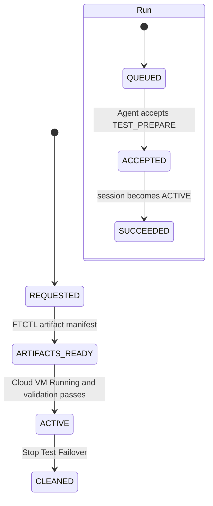

# Cross Hypervisor DR Test Failover Terminal Convergence Design

- Date: 2026-07-20
- Status: corrective design complete; implementation pending
- Scope: Cloud-managed VMware to ABLESTACK Test Failover completion semantics
- Normative for: UI, API, Cloud backend, Mold Agent, FTCTL, DB
- Related: 521, 522, 561, 562
- FTCTL companion: `ablestack-qemu-exec-tools/docs/ftctl/435-ftctl-dr-test-artifact-canonical-locator-and-failure-contract-design-20260719.md`

> Normative failed-operation correction (2026-07-28):
> [579-cross-hypervisor-dr-action-intent-guest-identity-and-failed-test-terminal-convergence-design-20260728.md](579-cross-hypervisor-dr-action-intent-guest-identity-and-failed-test-terminal-convergence-design-20260728.md)
> extends this successful-session convergence contract with canonical guest
> identity, owned checkpoint lease release, worker terminal state, and
> `FAILED` versus `cleanup_required` separation.

## 1. Decision

Test Failover has two different successful outcomes that must coexist:

1. the finite `DrRun(TEST_FAILOVER)` finishes as `SUCCEEDED`; and
2. the durable `DrTestSession` remains `ACTIVE` while the operator uses the
   temporary test VM.

FTCTL remaining in `TEST_ARTIFACTS_READY` is also correct during that window.
It means the checkpoint lease and writable test artifacts are being retained;
it does not mean that Cloud VM materialization is incomplete.

The three authorities are therefore fixed as follows.

| Authority | Object | Successful active-test state |
|---|---|---|
| Engine artifact authority | FTCTL test session | `TEST_ARTIFACTS_READY`, transition `TEST_ACTIVE` |
| Cloud resource authority | `dr_test_session` | `ACTIVE`, test VM `Running` |
| Finite operation history | `dr_run(TEST_FAILOVER)` | `SUCCEEDED`, completed timestamp set |

No projection path may copy the engine artifact state over the Cloud session
state. No active test session may keep the finite Run nonterminal after Cloud
boot validation succeeds.

This document supersedes documents 521, 522, 561, and 562 wherever they:

- allow `ACTIVE` to regress to `ARTIFACTS_READY`;
- require FTCTL to report a Cloud VM terminal state;
- use Plan protection state as the active-test state; or
- leave Run completion dependent on a race with the next periodic projection.

## 2. Real-environment preflight evidence

The following evidence was collected read-only for Linux Plan
`cbdf5abe-2795-4e7c-9995-78a67129b0de` and Test Failover Run
`5d44ebc4-3bde-46d1-a706-353cfd878f60`.

| Layer | Evidence | Result |
|---|---|---|
| API/Run | Run id `64`, `TEST_FAILOVER`, `ACCEPTED`, `agent-accepted` | nonterminal defect reproduced |
| FTCTL | `TEST_ARTIFACTS_READY`, progress `100`, worker `SUCCEEDED`, exit `0` | PASS |
| FTCTL transition | `control_state=PAUSED`, `transition_state=TEST_ACTIVE`, checkpoint lease held | expected during active test |
| Checkpoint | sequence `19`, incremental, 1,441,792 changed bytes | PASS |
| RBD | protected snapshot and Plan/Run-scoped clone exist | PASS |
| Cloud session | id `1`, state `ACTIVE`, checkpoint `19` | PASS |
| Cloud disk | `CLOUD_VOLUME_READY`, volume id `483` | PASS |
| Cloud VM | id `254`, `i-2-254-VM`, `Running` on host id `1` | PASS |
| Boot contract | secure OVMF loader and `io=io_uring` | PASS |
| Boot validation | `POWER_STATE_VALIDATED` | PASS |
| Run steps | only prepare, dispatch-agent, agent-accept | terminal steps missing |
| Run events | only created, queued, started, accepted | success event missing |

The preflight proves that Agent, FTCTL, RBD, Cloud volume import, Cloud VM
creation, and boot all succeeded. The remaining defect is Cloud control-plane
terminal convergence.

## 3. Root cause

### 3.1 State regression in runtime projection

`FtctlDrRuntimeProjectionAdapter.reconcileCloudManagedTestTarget()` currently
executes this logic for every status refresh:

```java
if (runtimeState.equals("TEST_ARTIFACTS_READY")) {
    session.setState("ARTIFACTS_READY");
    drTestSessionDao.update(session.getId(), session);
    drTargetMaterializationService.enqueueTestMaterialization(...);
}
```

The method does not inspect the current Cloud session rank. A session already
set to `ACTIVE` by `DrTargetMaterializationServiceImpl` is downgraded to
`ARTIFACTS_READY`.

The same projection cycle then calls:

```java
if (drTargetMaterializationService.isTestTargetActive(run.getId())) {
    completeRunFromProjection(...);
}
```

`isTestTargetActive()` requires session state `ACTIVE`, so the condition is
false immediately after the projection itself downgraded the row. The
asynchronous materializer later sees the existing VM, sets the session back to
`ACTIVE`, and the next status cycle repeats the downgrade. The Run remains
`ACCEPTED` even though the VM is running.

### 3.2 Missing direct completion handoff

`DrTargetMaterializationServiceImpl.materializeTestTarget()` writes `ACTIVE`
and `POWER_STATE_VALIDATED`, but it does not invoke a single transaction that:

- validates all Cloud completion evidence;
- terminally updates the Run;
- writes the remaining Run steps; and
- writes `RUN_SUCCEEDED`.

Completion is left to a later polling cycle, creating a race and making
management restart recovery dependent on timing.

### 3.3 Request field mismatch

`StartDrTestFailoverCmd` writes:

```text
testBootValidationMode
testBootTimeoutSeconds
```

`DrOrchestratorImpl.createRequestedTestSession()` currently reads:

```text
validationMode
bootTimeoutSeconds
```

The active test succeeded because materialization currently performs power
validation directly, but `dr_test_session.validation_mode` and
`boot_timeout_seconds` remained null. Audit and restart behavior are therefore
not deterministic.

## 4. Non-negotiable invariants

1. UI calls Cloud API only and never polls Agent or FTCTL directly.
2. The start API returns after Run/session persistence and asynchronous dispatch.
3. Cloud session states are monotonic except through an explicit cleanup or
   compensation transition.
4. `ACTIVE` never transitions to `ARTIFACTS_READY`, `PREPARING`, or `REQUESTED`.
5. FTCTL artifact state never overwrites Cloud VM lifecycle state.
6. A successful Run may coexist with an active session; Run completion does
   not imply test resource cleanup.
7. A test session may remain `ACTIVE` until `stopDrTestFailover` succeeds.
8. Plan-wide protection authority remains independent from finite test state.
9. Completion is idempotent across repeated status projection and management
   restart.
10. Every successful external side effect has a durable step/event projection.
11. Cleanup remains ordered: Cloud VM/volumes first, FTCTL artifact/lease second.
12. Agent and FTCTL do not become authorities for Cloud Run completion.

## 5. State model

### 5.1 Cloud test session state machine

```text
REQUESTED
  -> ENGINE_PREPARING
  -> ARTIFACTS_READY
  -> CLOUD_VOLUMES_IMPORTING
  -> CLOUD_VM_CREATING
  -> CLOUD_VM_STARTING
  -> CLOUD_VM_VALIDATING
  -> ACTIVE
  -> CLOUD_CLEANUP_RUNNING
  -> CLOUD_RESOURCES_REMOVED
  -> CLEANED
```

Failure states are `FAILED`, `CLEANUP_FAILED`, and `FAILED_CLEANED`.
`FAILED` remains cleanup eligible. Terminal audit rows are soft-removed only
according to retention policy, not as part of ordinary UI refresh.

### 5.2 Allowed transitions

Add a central transition policy rather than scattered string assignments.

```java
public enum DrTestSessionState {
    REQUESTED,
    ENGINE_PREPARING,
    ARTIFACTS_READY,
    CLOUD_VOLUMES_IMPORTING,
    CLOUD_VM_CREATING,
    CLOUD_VM_STARTING,
    CLOUD_VM_VALIDATING,
    ACTIVE,
    CLOUD_CLEANUP_RUNNING,
    CLOUD_RESOURCES_REMOVED,
    CLEANED,
    FAILED,
    CLEANUP_FAILED,
    FAILED_CLEANED
}

public interface DrTestSessionStateMachine {
    DrTestSessionVO transition(long sessionId,
                               Set<DrTestSessionState> expected,
                               DrTestSessionState next,
                               Consumer<DrTestSessionVO> mutation);
    boolean canApplyEngineArtifactState(DrTestSessionState current);
}
```

`canApplyEngineArtifactState()` returns true only for `REQUESTED`,
`ENGINE_PREPARING`, and `ARTIFACTS_READY`. It returns false for Cloud resource
states, `ACTIVE`, cleanup states, and terminal failure states.

### 5.3 Run and session relationship



`SUCCEEDED + ACTIVE` is the normal steady state while the operator is testing.

### 5.4 Plan state

Do not mutate the Plan protection state to represent the test window. Keep the
last valid protection authority (`READY`, `SYNCING`, or its current durable
projection) and expose an independent operation overlay:

```json
{
  "protectionState": "SYNCING",
  "operationState": "SUCCEEDED",
  "testSessionState": "ACTIVE",
  "displayOverlay": "TEST_ACTIVE"
}
```

This avoids treating intentional scheduler quiesce and checkpoint lease as a
protection failure.

## 6. Target sequence

```mermaid
sequenceDiagram
  participant UI as Cloud UI
  participant API as Cloud API
  participant ORCH as DrOrchestrator
  participant PROJ as Runtime Projection
  participant MAT as Target Materializer
  participant AG as Mold Agent
  participant FT as FTCTL
  participant DB as Cloud DB
  participant VM as Cloud VM Manager

  UI->>API: startDrTestFailover
  API->>ORCH: create asynchronous Run
  ORCH->>DB: Run QUEUED plus Session REQUESTED
  API-->>UI: accepted Run
  ORCH->>AG: TEST_PREPARE
  AG->>FT: dr-test-prepare
  FT-->>AG: TEST_ARTIFACTS_READY
  PROJ->>DB: monotonic transition to ARTIFACTS_READY
  PROJ->>MAT: enqueue once by run id
  MAT->>DB: CLOUD_VOLUMES_IMPORTING
  MAT->>VM: import volumes and create/start VM
  MAT->>DB: CLOUD_VM_VALIDATING
  MAT->>VM: verify Running and optional QGA
  MAT->>DB: Session ACTIVE plus Run SUCCEEDED transaction
  DB-->>UI: operation complete and test session active
  PROJ->>DB: repeated status is idempotent; ACTIVE is retained
```

## 7. UI design

### 7.1 Display semantics

`DrPlanList.vue`, `DrPlanOverview.vue`, `DrProtectionInfoTab.vue`, and
`DrRunProgress.vue` display separate fields.

| UI concept | Source | Display |
|---|---|---|
| Protection | cached protection view | current replication health |
| Test operation | `DrRun` | completed when `SUCCEEDED` |
| Active test | `DrTestSession` | test VM running until stopped |

After successful start, show:

```text
Test Failover: Completed
Test environment: Active
Test VM: Rokcy10-1-dr-test-5d44ebc4 (Running)
Boot validation: Passed
Action: Stop Test Failover
```

Do not show `TEST_ARTIFACTS_READY` as incomplete user work after the Cloud
session is `ACTIVE`. Keep it in diagnostic execution details only.

### 7.2 Polling

- Poll the Run actively while it is `QUEUED`, `DISPATCHING`, `ACCEPTED`, or
  `RUNNING`.
- Stop active Run polling when it becomes terminal.
- Continue lightweight session/protection polling while a test session is
  `ACTIVE` so unexpected VM stop or cleanup state is reflected.
- Never block the entire page while polling.
- Refresh list and detail from the same cached protection/session projection.

### 7.3 Action eligibility

`Stop Test Failover` is enabled from active session evidence, not from latest
Run state. It remains enabled when the start Run is `SUCCEEDED`.

`Start Test Failover` is disabled whenever an active or cleanup-required test
session exists, regardless of whether the latest Run is terminal.

## 8. API design

### 8.1 Canonical request keys

Keep the public parameters and normalize once in `StartDrTestFailoverCmd`.

```java
request.addProperty("testBootValidationMode", normalizedValidationMode);
request.addProperty("testBootTimeoutSeconds", boundedTimeoutSeconds);
```

`DrOrchestratorImpl` reads the same names. During one compatibility release it
may fall back to the old internal aliases:

```java
session.setValidationMode(firstString(request,
        "testBootValidationMode", "validationMode"));
session.setBootTimeoutSeconds(firstInteger(request,
        "testBootTimeoutSeconds", "bootTimeoutSeconds"));
```

New writers never emit the aliases.

### 8.2 Response contract

`listDrRuns`, `getDrProtectionView`, and the start response expose:

```json
{
  "run": {
    "type": "TEST_FAILOVER",
    "state": "SUCCEEDED",
    "currentStepName": "test-failover-active",
    "completed": "timestamp"
  },
  "testSession": {
    "state": "ACTIVE",
    "testVmId": "uuid",
    "testVmName": "name",
    "testVmState": "Running",
    "checkpointSequence": 19,
    "validationMode": "POWER_STATE_ONLY",
    "bootValidationState": "POWER_STATE_VALIDATED",
    "cleanupRequired": true
  }
}
```

The async API job remains acceptance-only. The Run/session projection is the
source for completion.

## 9. Cloud backend design

### 9.1 Central completion service

Add a single idempotent completion boundary.

```java
public interface DrTestFailoverCompletionService {
    CompletionResult completeIfReady(long planId, long runId,
                                     String runtimeStatusJson);
    CompletionResult recover(long planId, long runId);
}
```

`completeIfReady()` performs one transaction with the Plan/Run/session rows
locked in stable id order.

Required evidence:

1. Run type is `TEST_FAILOVER` and state is projectable or already succeeded.
2. Session belongs to the same Plan and Run and state is `ACTIVE`.
3. Session has a target VM id.
4. Test VM exists, is not removed, and is `Running`.
5. VM details contain the same `dr.test.session.uuid`.
6. Every active `dr_test_disk` is `CLOUD_VOLUME_READY` and references a live
   Cloud volume attached to the test VM.
7. Boot validation satisfies the persisted validation policy.
8. Checkpoint sequence/ref and artifact contract version are present.

When ready, the service:

```java
upsertStep(run, "test-artifacts-ready", 30, SUCCEEDED, 80);
upsertStep(run, "target-materialization", 40, SUCCEEDED, 90);
upsertStep(run, "boot-validation", 50, SUCCEEDED, 100);
upsertStep(run, "test-failover-active", 100, SUCCEEDED, 100);
markRunSucceeded(run, "test-failover-active", compactEvidence);
appendEventOnce(plan, run, "TEST_VM_ACTIVE", ...);
appendEventOnce(plan, run, RUN_SUCCEEDED, ...);
```

Event idempotency uses `(run_id, event_type, source)` lookup or a deterministic
event UUID. Repeated calls return `ALREADY_COMPLETED` without duplicating rows.

### 9.2 Materializer handoff

At the end of `DrTargetMaterializationServiceImpl.materializeTestTarget()`:

```java
stateMachine.transition(session.getId(),
        EnumSet.of(CLOUD_VM_VALIDATING, CLOUD_VM_STARTING),
        ACTIVE,
        row -> {
            row.setBootValidationState(validation.getState());
            row.setArtifactManifest(manifest);
            row.setCleanupRequired(true);
        });

completionService.completeIfReady(planId, runId, runtimeStatusJson);
```

This direct handoff is the primary completion path. It removes dependency on a
later polling race.

### 9.3 Projection fallback

`FtctlDrRuntimeProjectionAdapter.reconcileCloudManagedTestTarget()` becomes:

```java
DrTestSessionVO session = findSession(runId);
if (isEngineFailure(status)) {
    failOnlyIfCloudMaterializationNotActive(session, status);
} else if (isArtifactsReady(status)) {
    if (stateMachine.canApplyEngineArtifactState(session.getState())) {
        stateMachine.transition(session.getId(), PRE_ARTIFACT_STATES,
                ARTIFACTS_READY, row -> copyArtifactEvidence(row, status));
    } else {
        copyDiagnosticEvidenceWithoutChangingState(session, status);
    }
    enqueueMaterializationIfNeeded(planId, runId, status);
}

completionService.completeIfReady(planId, runId, status.getStatusJson());
```

The projection fallback repairs Run completion after management restart. It
never regresses the session.

### 9.4 Enqueue idempotency

`inFlightTestRuns` remains a local duplicate guard, but DB state is the durable
guard. `enqueueTestMaterialization()` returns without work when the session is
`ACTIVE`, cleanup has started, or the Run is completed. Multiple management
nodes must converge through conditional DB transitions rather than the local
set alone.

### 9.5 Recovery watchdog

The projection scheduler scans nonterminal Test Failover Runs older than one
active polling interval.

Recovery order:

1. load session, VM, volumes, disks, and latest FTCTL status;
2. attempt `completeIfReady()` first;
3. resume materialization only for a valid pre-`ACTIVE` state;
4. fail with `DR_TEST_COMPLETION_STALLED` only when required evidence is
   absent after the configured grace period;
5. never fail a healthy `ACTIVE` session because FTCTL remains artifact-ready.

## 10. Mold Agent design

No Agent behavior change is required for this defect. Agent continues to:

- transport `TEST_PREPARE` and status commands;
- validate canonical artifact locators;
- return FTCTL artifact/worker/checkpoint status; and
- optionally perform a typed QGA probe when requested by Cloud.

Agent must not infer Cloud Run completion and must not report the Cloud test VM
as an FTCTL-managed domain. Contract tests should retain the current
`TEST_ARTIFACTS_READY`, worker success, and checkpoint identity fields.

## 11. FTCTL design

No FTCTL state transition change is required. The verified engine behavior is
the target contract:

```text
state=TEST_ARTIFACTS_READY
step=test-artifacts-ready
progress=100
worker_state=SUCCEEDED
worker_exit_code=0
transition_state=TEST_ACTIVE
checkpoint_lease_state=LEASED
```

FTCTL intentionally remains artifact-ready while Cloud runs the temporary VM.
It does not know whether Cloud has finished volume import or boot validation.
`dr-test-artifact-cleanup` remains the explicit boundary that removes the
clone/snapshot, releases the lease, and resumes continuous synchronization.

No new FTCTL state such as `TEST_VM_RUNNING` is added because that would move
Cloud VM lifecycle authority back into the engine.

## 12. DB design

### 12.1 Schema

No schema migration is required for the terminal convergence fix. Existing
columns are sufficient:

- `dr_test_session.validation_mode`
- `dr_test_session.boot_timeout_seconds`
- `dr_test_session.boot_validation_state`
- `dr_test_session.cleanup_required`
- `dr_run.state`, `completed`, `projection_state`, `current_step_name`
- `dr_run_step`
- `dr_event`

### 12.2 Conditional update contract

Add DAO methods that make state transitions atomic.

```java
boolean transitionState(long sessionId, Set<String> expectedStates,
                        String nextState, Date updated);
DrTestSessionVO lockById(long sessionId);
DrRunVO lockById(long runId);
```

Equivalent SQL:

```sql
UPDATE dr_test_session
   SET state = ?, updated = UTC_TIMESTAMP()
 WHERE id = ?
   AND removed IS NULL
   AND state IN (...expected...);
```

The completion transaction locks Run before session, matching the global lock
order used by orchestration code. This prevents projection and materializer
threads from completing or regressing the same Run concurrently.

### 12.3 Existing-row recovery

For a deployed stuck Run, do not edit DB rows manually. After corrected code is
deployed, one projection refresh calls `recover()` and terminally completes the
Run from the existing `ACTIVE` session and Running VM evidence. This preserves
the original timestamps and audit identities.

## 13. Error contract

| Error | Meaning | Run result | Session result |
|---|---|---|---|
| `DR_TEST_ARTIFACT_PREPARE_FAILED` | FTCTL artifact transaction failed | FAILED | FAILED/cleanup required |
| `DR_TEST_CLOUD_MATERIALIZATION_FAILED` | Cloud volume or VM creation failed | FAILED | FAILED/cleanup required |
| `DR_TEST_VM_BOOT_FAILED` | VM did not become Running | FAILED | FAILED/cleanup required |
| `DR_TEST_BOOT_VALIDATION_FAILED` | required validation failed | FAILED | FAILED/cleanup required |
| `DR_TEST_COMPLETION_STALLED` | evidence remains incomplete after recovery grace | FAILED | retain actual state |

`DR_TEST_COMPLETION_STALLED` is never used when session is `ACTIVE`, VM is
Running, disks are ready, and validation passed.

## 14. Required tests

### 14.1 Cloud unit tests

Add to `FtctlDrRuntimeProjectionAdapterTest`:

- `TEST_ARTIFACTS_READY` moves `ENGINE_PREPARING` to `ARTIFACTS_READY`;
- repeated artifact-ready status does not downgrade `ACTIVE`;
- an `ACTIVE` session plus Running VM completes an accepted Run;
- repeated projection does not duplicate completion steps/events;
- FTCTL artifact-ready does not change Plan protection authority.

Add `DrTargetMaterializationServiceImplTest`:

- successful boot writes `ACTIVE` then completes the Run;
- completion survives an existing imported volume/VM retry;
- failed validation does not complete the Run;
- management restart recovery completes from existing DB/VM evidence.

Add to `DrProtectionOrchestratorImplTest` or a new orchestrator test:

- canonical request keys persist validation mode and timeout;
- legacy aliases are read only as compatibility fallback;
- another active test session blocks a new start.

### 14.2 Agent/FTCTL contract tests

No new engine behavior is required. Retain regression assertions that:

- artifact-ready status remains stable while the test lease is active;
- Cloud VM state is absent from FTCTL authority;
- cleanup removes artifacts and releases the lease idempotently;
- scheduler resumes after cleanup.

### 14.3 Integration acceptance

1. Start Test Failover and receive API acceptance immediately.
2. Observe FTCTL artifact-ready and worker success.
3. Observe Cloud test volume and VM creation.
4. Verify VM Running, secure boot contract, and selected validation.
5. Verify Run becomes `SUCCEEDED` within one projection interval.
6. Verify session remains `ACTIVE` and Stop action remains enabled.
7. Restart management and verify no state regression or duplicate event.
8. Stop Test Failover.
9. Verify test VM/volume removal, RBD clone/snapshot removal, lease release,
   session `CLEANED`, cleanup Run `SUCCEEDED`, and incremental sync resume.

## 15. Implementation order

1. Fix canonical request field persistence.
2. Add session state enum/policy and conditional DAO transition.
3. Add idempotent completion service and steps/events.
4. Call completion directly after materialization/validation.
5. Make runtime projection monotonic and add recovery fallback.
6. Expose separate operation/session response fields.
7. Update UI labels, polling, and action gating.
8. Add unit and integration tests.
9. Deploy changed Cloud classes/UI only; Agent/FTCTL redeploy is unnecessary
   unless contract tests reveal version drift.
10. Recover the existing active test Run through projection, then validate
    Stop Test Failover cleanup end to end.

## 16. AS-IS / TO-BE

| Area | AS-IS | TO-BE |
|---|---|---|
| Engine state | artifact-ready is returned correctly | unchanged; remains engine artifact authority |
| Session projection | `ACTIVE` can be overwritten by `ARTIFACTS_READY` | monotonic Cloud session state |
| Run completion | waits for a later projection race | direct completion after validation plus recovery fallback |
| Successful steady state | Run `ACCEPTED`, session `ACTIVE` | Run `SUCCEEDED`, session `ACTIVE` |
| Plan state | finite test can blur protection state | protection state plus independent `TEST_ACTIVE` overlay |
| Validation policy | request keys do not match session reader | canonical names persisted with temporary alias fallback |
| Steps | stops at agent-accept | artifact, materialization, validation, active completion steps |
| Events | stops at RUN_ACCEPTED | TEST_VM_ACTIVE and RUN_SUCCEEDED |
| Concurrency | local in-flight set plus unconditional writes | DB conditional transitions and idempotent completion |
| Restart recovery | depends on polling timing | evidence-based completion watchdog |
| UI | appears perpetually incomplete | operation completed, test environment active |
| Agent | transports valid FTCTL status | unchanged |
| FTCTL | valid artifact-ready active-test state | unchanged |
| DB schema | sufficient columns, null policy values | no migration; populate and transition existing rows correctly |

## 17. Completion gate

The implementation is complete only when both of these conditions hold:

1. Test Failover start reaches `DrRun=SUCCEEDED` and
   `DrTestSession=ACTIVE` with a Running Cloud test VM; and
2. Stop Test Failover reaches cleanup Run `SUCCEEDED`, session `CLEANED`, no
   active test VM/volume/artifact/lease, and resumed incremental protection.

Passing only the VM boot check is a data-plane PASS, not a complete control-plane
PASS. Conversely, a successful Run without a Running validated Cloud VM is
also invalid.

## 18. Cleanup Run Completion And Protection Recovery - 2026-07-21

Condition 2 is evaluated in two stages. Cleanup Run/session convergence removes
the test environment. Protection convergence then requires matching scheduler
control ACK, released checkpoint lease, and a newer durable cycle projected by
the long-lived producer. A terminal cleanup Run must not suppress or own this
projection. Document 565 is normative for the code split and timeout states.

## 19. Terminal Failure Closure And History - 2026-07-31

`FAILED` is an execution result, while `cleanup_required` is the resource
obligation. When terminal cleanup proof is complete and no Cloud test resource
remains, the Test Session is soft-closed even though the Run and session state
remain FAILED for audit. Historical response paths must include soft-removed
sessions; current projection paths must use open sessions only.

Document 586 supersedes any interpretation that every unremoved FAILED row is
an active Test Session.
