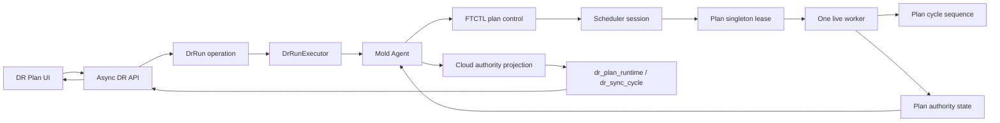
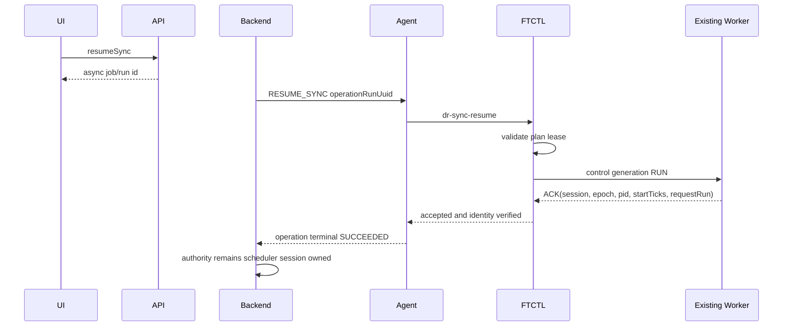

# Cross Hypervisor DR Plan Scheduler Singleton Authority Design

- 문서 번호: 564
- 작성일: 2026-07-20
- 상태: 실환경 Preflight 검증 완료, 구현 전 상세 설계
- 적용 범위: Cloud UI, Cloud API, DR Backend, Mold Agent/KVM wrapper, FTCTL DR runtime, Cloud DB
- FTCTL 부속 문서: `ablestack-qemu-exec-tools/docs/ftctl/436-ftctl-dr-plan-scheduler-singleton-lease-and-generation-design-20260720.md`
- 관련 문서:
  - [521-cross-hypervisor-dr-full-stack-implementation-design-20260701.md](521-cross-hypervisor-dr-full-stack-implementation-design-20260701.md)
  - [522-cross-hypervisor-dr-protection-failover-failback-sequence-design-20260701.md](522-cross-hypervisor-dr-protection-failover-failback-sequence-design-20260701.md)
  - [550-cross-hypervisor-dr-protection-view-cache-and-completed-checkpoint-design-20260710.md](550-cross-hypervisor-dr-protection-view-cache-and-completed-checkpoint-design-20260710.md)
  - [552-cross-hypervisor-dr-async-read-consistency-and-live-cache-ui-design-20260714.md](552-cross-hypervisor-dr-async-read-consistency-and-live-cache-ui-design-20260714.md)
  - [553-cross-hypervisor-dr-continuous-sync-control-and-quiesce-lock-design-20260714.md](553-cross-hypervisor-dr-continuous-sync-control-and-quiesce-lock-design-20260714.md)
  - [558-cross-hypervisor-dr-strict-status-storage-format-and-query-boundary-design-20260716.md](558-cross-hypervisor-dr-strict-status-storage-format-and-query-boundary-design-20260716.md)
  - [560-cross-hypervisor-dr-cycle-snapshot-consistency-design-20260718.md](560-cross-hypervisor-dr-cycle-snapshot-consistency-design-20260718.md)

## 1. 목적

지속 복제 중인 DR Plan에서 Cloud 작업 이력인 `DrRun`, FTCTL 지속 Scheduler,
복제 cycle, Cloud runtime authority의 식별자와 생명주기를 분리한다. 한 Plan에는
정확히 하나의 Scheduler worker만 존재하도록 보장하고, UI가 현재 복제 활동을
Plan의 보호 준비 상태로 오인하지 않도록 상태 모델을 정규화한다.

이 문서의 규범적 목표는 다음과 같다.

1. `one Plan = one scheduler session = at most one live worker`를 보장한다.
2. `DrRun`은 짧은 비동기 작업 이력이며 지속 worker의 소유권 식별자가 아니다.
3. pause/resume/test/failover 요청은 scheduler session을 제어하며 새 지속 worker를
   무조건 생성하지 않는다.
4. FTCTL 상태의 순서를 `(leaseEpoch, authoritySequence)`로 판정하고 run별로
   초기화되는 cycle sequence와 혼용하지 않는다.
5. 보호 준비 상태, scheduler 건강 상태, 현재 복제 활동을 별도 상태 축으로
   제공한다.
6. UI/API는 비동기 요청 계약을 유지하며 엔진 완료를 동기식으로 기다리지 않는다.
7. 기존 RBD/QCOW2 FT/HA, blockcopy, xcolo 성공 경로는 변경하지 않는다.

## 2. 실환경 Preflight 결과

### 2.1 검증 대상

| 항목 | 값 |
|---|---|
| Plan UUID | `cbdf5abe-2795-4e7c-9995-78a67129b0de` |
| Plan DB ID | `35` |
| 방향 | VMware -> ABLESTACK |
| Worker host | `10.10.32.1` |
| Cloud 최신 RESUME run | `d0fb2b49-bc29-4c99-987b-c6821947a258` |
| 실제 생존 Scheduler run | `f2c9d0dc-e11d-455a-b11a-7969f23f862c` |

### 2.2 Cloud DB 관측

```text
dr_plan.state                     = SYNCING
dr_plan_runtime.engine_run_uuid   = d0fb2b49-...
dr_plan_runtime.runtime_generation= 22
dr_plan_runtime.scheduler_state   = RUNNING
dr_plan_runtime.scheduler_pid_alive = 1
dr_plan_runtime.current_cycle_state = IDLE
dr_plan_runtime.protection_state  = SYNCING
dr_plan_runtime.freshness_state   = WITHIN_RPO
```

최신 `RESUME_SYNC` run은 `SUCCEEDED / terminal`로 완료됐지만 해당 run의
Scheduler PID는 실제로 종료되어 있었다. 따라서 Cloud 작업 완료와 지속 worker
생존은 같은 사실이 아니다.

### 2.3 FTCTL host 관측

Plan의 `scheduler/` 아래에는 6개의 run별 PID 파일이 남아 있었다.

| Run | PID | 실제 상태 |
|---|---:|---|
| `0b4a427a-...` | 215276 | DEAD |
| `2a7b7ba9-...` | 669318 | DEAD |
| `2b29358d-...` | 289872 | DEAD |
| `3c85195b-...` | 493972 | DEAD |
| `d0fb2b49-...` | 957336 | DEAD |
| `f2c9d0dc-...` | 200700 | ALIVE |

공용 제어 파일은 최신 RESUME run을 owner로 기록하고 있었다.

```text
control.state
  generation=23
  command=run
  owner_run=d0fb2b49-...

control.ack
  generation=23
  state=RUNNING
  owner_run=d0fb2b49-...
```

그러나 실제 유일한 생존 프로세스의 command line은 이전 run
`f2c9d0dc-...`였다. 제어 ACK의 owner 표시와 프로세스 소유권이 일치하지 않는다.

### 2.4 데이터 경로 판정

이전 run worker가 증분 cycle을 계속 생성했으므로 target durable checkpoint와
RPO 데이터는 존재했다. 데이터 경로가 완전히 중단된 것은 아니지만, Cloud가
제어하는 run과 실제 복제 worker가 달라 정상 보호로 판정할 수 없다.

Preflight 최종 판정은 다음과 같다.

| 경계 | 판정 | 근거 |
|---|---|---|
| 대상 데이터/체크포인트 | PASS | durable incremental checkpoint 존재 |
| 단일 Scheduler 소유권 | FAIL | 이전 run worker가 생존하고 최신 run PID는 종료 |
| Cloud runtime authority | FAIL | DB PID alive 및 owner가 실제 프로세스와 불일치 |
| UI 상태 | FAIL | 복구 가능성과 worker 장애를 모두 `SYNCING`으로 표시 |
| 다음 cutover 준비 | FAIL | normal cutover authority를 신뢰할 수 없음 |

## 3. 오류 원인

### 3.1 run별 PID가 Plan singleton을 보장하지 못함

`ftctl_dr_scheduler_pid_path(plan, run)`은 PID 파일을 run별로 만든다.
`ftctl_dr_scheduler_ensure_running()`은 요청 run의 PID만 검사하므로 다른 run의
worker가 살아 있어도 새 worker를 시작할 수 있다. cycle lock은 데이터 쓰기를
직렬화하지만 여러 Scheduler의 존재 자체를 막지 않는다.

### 3.2 작업 run과 지속 Scheduler session이 혼합됨

`SYNC`, `PAUSE_SYNC`, `RESUME_SYNC`, `TEST_CLEANUP`은 각각 독립적인 Cloud
operation이다. 이 UUID를 Scheduler owner로 사용하면 resume마다 owner가 바뀌고
이전 worker와 최신 operation의 관계가 모호해진다.

### 3.3 ACK가 worker identity를 증명하지 않음

현재 ACK 대기는 `generation`과 `state`만 확인한다. ACK에 기록된 owner, 실제
PID, `/proc/<pid>/stat` start time, scheduler session, lease epoch를 검증하지
않으므로 stale 또는 다른 worker의 ACK를 성공으로 오인할 수 있다.

### 3.4 하나의 runtime generation에 다른 단위를 기록함

Scheduler recovery는 control generation을 `runtime_generation`에 기록하고,
cycle은 run-local sequence를 다시 `runtime_generation`으로 기록한다. 같은 run에서
`22 -> 1 -> 2`와 같은 감소가 발생할 수 있으며 Cloud projection은 이를 stale
status로 거부한다.

### 3.5 보호 상태와 복제 활동 상태가 혼합됨

첫 durable checkpoint 이후에도 FTCTL cycle은 top-level `state=SYNCING`을
기록한다. Cloud authority와 UI가 이를 Plan 보호 상태로 사용하여, 복구 가능한
READY Plan도 매 cycle 동안 또는 영구적으로 SYNCING처럼 보인다.

## 4. 규범적 불변식

1. 하나의 Plan에는 하나의 `schedulerSessionUuid`만 active일 수 있다.
2. 하나의 active scheduler session에는 하나의 lifetime owner lock과 하나의
   live worker만 존재한다.
3. `operationRunUuid`는 요청/감사 이력이며 scheduler identity가 아니다.
4. worker 교체 때만 `leaseEpoch`가 증가한다.
5. 같은 lease 안에서 `authoritySequence`는 단조 증가한다.
6. `planCycleSequence`는 Plan 단위로 단조 증가하며 run 변경 시 초기화하지 않는다.
7. control ACK는 요청 generation뿐 아니라 scheduler session, lease epoch, 실제
   worker identity를 증명해야 한다.
8. 완료된 durable checkpoint가 있고 RPO 이내이며 Scheduler가 건강하면 cycle이
   실행 중이어도 보호 상태는 `READY`다.
9. durable checkpoint는 있으나 worker가 죽거나 owner가 다르면 `DEGRADED`다.
10. 첫 durable checkpoint 전의 전송만 보호 상태 `SYNCING`으로 표현한다.
11. last-good cache는 화면 표시 보조이며 action authority를 대체하지 않는다.

## 5. 식별자와 세대 모델

| 필드 | 생명주기 | 소유자 | 용도 |
|---|---|---|---|
| `planUuid` | Plan 전체 | Cloud | 보호 정책 식별 |
| `schedulerSessionUuid` | 보호 시작부터 release/recreate까지 | Backend/FTCTL | 지속 복제 세션 식별 |
| `operationRunUuid` | API 작업 1회 | Cloud | 실행 이력과 비동기 작업 식별 |
| `leaseEpoch` | worker 획득/교체 1회 | FTCTL | worker incarnation 식별 |
| `authoritySequence` | lease 안의 상태 갱신 | FTCTL | 상태 순서 판정 |
| `planCycleSequence` | Plan의 복제 cycle 전체 | FTCTL | checkpoint/cycle 순서 |
| `controlGeneration` | pause/resume/stop 요청 | FTCTL control channel | 제어 요청/ACK 상관관계 |

`schedulerSessionUuid`는 initial sync가 target durable에 도달해 Cloud `DrRun`이
종료된 뒤에도 유지된다. `RESUME_SYNC`는 새 scheduler session을 만드는 작업이
아니라 기존 session을 재개하거나 worker를 복구하는 operation이다.

## 6. 상태 모델

### 6.1 독립 상태 축

```text
protectionState
  UNKNOWN | SYNCING | READY | DEGRADED | PAUSED | ERROR | RELEASED

replicationActivity
  IDLE | TRANSFERRING | QUIESCING | RECOVERING | PAUSED | STOPPED

schedulerHealth
  HEALTHY | RECOVERING | HEARTBEAT_STALE | OWNER_MISMATCH |
  DUPLICATE_WORKER | DEAD | STOPPED | UNKNOWN
```

### 6.2 계산 규칙

| 조건 | protectionState | replicationActivity |
|---|---|---|
| 첫 durable checkpoint 전 | SYNCING | TRANSFERRING/IDLE |
| target ready + RPO 이내 + worker healthy | READY | IDLE/TRANSFERRING |
| target ready + worker dead/mismatch/stale | DEGRADED | RECOVERING/STOPPED |
| 운영자 pause + durable target 존재 | PAUSED | PAUSED |
| current cycle 실패, last-good target 존재 | DEGRADED | IDLE/RECOVERING |
| target durability 자체가 손상됨 | ERROR | STOPPED |

UI에서 `복제 중`은 activity label이며 Plan의 주 상태가 아니다.

## 7. 목표 아키텍처



## 8. FTCTL 코드 수준 설계

상세 shell 계약은 부속 문서 436을 우선한다.

### 8.1 Plan 단위 파일 구조

```text
plans/<plan>/scheduler/
  owner.lock
  lease.state
  active.pid
  control.state
  control.ack
  sequence.state

plans/<plan>/authority.state
plans/<plan>/runs/<operation-run>.state
plans/<plan>/restore-points.jsonl
```

run별 `scheduler/<run>.pid`는 호환 조회 후 정리 대상이며 신규 worker ownership에
사용하지 않는다.

### 8.2 `lib/ftctl/dr_scheduler.sh`

다음 helper를 추가/교체한다.

```bash
ftctl_dr_scheduler_owner_lock_path PLAN
ftctl_dr_scheduler_lease_path PLAN
ftctl_dr_scheduler_active_pid_path PLAN
ftctl_dr_scheduler_sequence_path PLAN
ftctl_dr_scheduler_acquire_lease PLAN SESSION RUN
ftctl_dr_scheduler_validate_lease PLAN SESSION EPOCH
ftctl_dr_scheduler_find_active_worker PLAN
ftctl_dr_scheduler_adopt_or_start PLAN SESSION REQUEST_RUN PROFILE
ftctl_dr_scheduler_heartbeat PLAN SESSION EPOCH
ftctl_dr_scheduler_release_lease PLAN SESSION EPOCH
ftctl_dr_scheduler_next_plan_sequence PLAN
```

worker는 수명주기 전체에 대해 `owner.lock`의 `flock` FD를 유지한다. PID 파일만
검사하지 않고 다음을 모두 검증한다.

```text
PID alive
command line plan UUID 일치
schedulerSessionUuid 일치
/proc/<pid>/stat starttime 일치
leaseEpoch 일치
heartbeat가 허용 시간 이내
owner.lock을 다른 프로세스가 획득할 수 없음
```

### 8.3 start/resume 알고리즘

```text
plan.lock 획득
  -> live lease 조회
  -> healthy session이 존재하면 adopt
     -> 새 worker 생성 금지
     -> control request 기록
  -> stale/dead lease이면 epoch 증가
     -> stale PID metadata 정리
     -> owner.lock 획득 후 worker 1개 시작
  -> duplicate live worker이면 자동 선택 금지
     -> DUPLICATE_WORKER로 DEGRADED
plan.lock 해제
  -> 요청 generation의 identity-bearing ACK 대기
```

`RESUME_SYNC` operation 성공 조건은 새 PID 생성이 아니라 다음 ACK의 검증이다.

```text
ack.controlGeneration == request.controlGeneration
ack.requestRunUuid == operationRunUuid
ack.schedulerSessionUuid == expected session
ack.leaseEpoch == current lease epoch
ack.workerPid/startTicks == validated live process
ack.state == RUNNING
```

### 8.4 generation 분리

`runtime_generation` 단일 필드에 control generation과 cycle sequence를 쓰지 않는다.

```text
lease_epoch         worker 교체 시 +1
authority_sequence  동일 lease의 authority write마다 +1
plan_cycle_sequence cycle commit 시작 시 Plan 단위 +1
control_generation  제어 요청 시 +1
```

Cloud의 status ordering token은 `(lease_epoch, authority_sequence)`다.

### 8.5 plan authority와 run state 분리

Scheduler는 `authority.state`에 현재 Plan 상태를 기록한다. operation worker는
`runs/<run>.state`에 요청 결과만 기록한다. `dr-status --plan`은 authority를,
`dr-status --plan --run <uuid> --operation-only`는 작업 진단을 반환한다.

## 9. Mold Agent 코드 수준 설계

### 9.1 DTO

`core/.../FtctlDrStatusAnswer.java`와 `FtctlDrCycleSnapshot.java`에 다음 typed
field를 추가한다.

```java
String schedulerSessionUuid;
long schedulerLeaseEpoch;
long authoritySequence;
long planCycleSequence;
String schedulerHealth;
String replicationActivity;
String activeWorkerRunUuid;
Long activeWorkerPid;
Long activeWorkerStartTicks;
Date workerHeartbeatAt;
long controlGeneration;
long controlAckGeneration;
String controlRequestRunUuid;
boolean ownerMatched;
```

PID와 start ticks는 관리자 진단/Backend 검증용이며 일반 UI 응답에는 직접
노출하지 않는다.

### 9.2 KVM wrapper

`LibvirtFtctlDrStatusCommandWrapper`는 Plan current authority를 조회한다. 최신
Cloud run UUID를 FTCTL current authority selector로 사용하지 않는다. run UUID는
operation detail이 필요할 때만 별도 인자로 전달한다.

Agent는 다음 status를 실패로 반환한다.

- Plan/session identity 불일치
- epoch 또는 authority sequence 음수/누락
- ownerMatched=false
- ACK request run 불일치
- JSON enum/크기/타입 위반

## 10. Cloud Backend 코드 수준 설계

### 10.1 `FtctlDrRuntimeProjectionAdapter`

`projectProtectionAuthority()`의 단일 generation 비교를 다음으로 교체한다.

```java
AuthorityVersion incoming = new AuthorityVersion(
        status.getSchedulerLeaseEpoch(),
        status.getAuthoritySequence());
AuthorityVersion current = authority.version();

if (incoming.compareTo(current) < 0) {
    return ProjectionResult.stale(ERROR_STATUS_AUTHORITY_STALE);
}
if (!Objects.equals(status.getSchedulerSessionUuid(),
        authority.getSchedulerSessionUuid())) {
    return ProjectionResult.sessionMismatch();
}
```

새 epoch는 Backend가 recovery/start operation에서 기대 session과 일치함을 확인한
경우에만 수용한다. `engineRunUuid`가 달라졌다는 이유만으로 낮은 sequence를
무조건 수용하지 않는다.

### 10.2 operation projection 분리

`DrRunExecutorImpl`과 `DrOrchestratorImpl`은 다음을 분리한다.

```text
operation projection -> dr_run.state/current_step/completed
plan authority projection -> dr_plan_runtime typed columns
cycle projection -> dr_sync_cycle
```

`RESUME_SYNC` run은 identity-bearing RUNNING ACK를 받으면 terminal SUCCEEDED가
된다. 이후 지속 cycle은 이 run을 다시 RUNNING으로 만들지 않는다.

### 10.3 `DrProtectionAuthorityServiceImpl`

권한 계산 순서는 다음과 같다.

```text
validate scheduler session/lease/heartbeat/owner
  -> validate latest durable checkpoint and target materialization
  -> calculate RPO freshness
  -> derive schedulerHealth
  -> derive replicationActivity
  -> derive protectionState
  -> calculate action readiness
```

`READY` 조건:

```text
target materialized
latest durable checkpoint present
freshness WITHIN_RPO
schedulerHealth HEALTHY
ownerMatched true
control generation == ack generation
latest completed incremental verification valid
```

worker 장애 또는 owner mismatch는 last-good checkpoint를 삭제하지 않고
`DEGRADED`로 만든다.

### 10.4 `DrResponseGenerator`

authority가 존재하면 오래된 run/cache를 사용해 effective state를 다시 계산하지
않는다. list와 detail은 같은 canonical authority DTO를 사용한다.

`TARGET_READY`는 resource readiness이며 scheduler 건강을 포함하지 않는다.
따라서 `TARGET_READY + scheduler DEAD`는 API `DEGRADED`다.

## 11. API 설계

`listDrPlans`, `getDrPlan`, `getDrProtectionView`에 다음 필드를 제공한다.

```json
{
  "protectionstate": "READY",
  "replicationactivity": "TRANSFERRING",
  "schedulerhealth": "HEALTHY",
  "schedulersessionid": "...",
  "schedulerleaseepoch": 4,
  "authoritysequence": 31,
  "plancyclesequence": 28,
  "authorityupdated": "2026-07-20T14:43:13+09:00",
  "ownermatched": true,
  "freshnessstate": "WITHIN_RPO",
  "actionreadiness": {
    "testFailover": {"eligible": true, "reasonCode": null}
  }
}
```

일반 사용자 응답은 PID를 제외하고, `details=diagnostic` 권한이 있는 관리자 요청만
worker identity 요약을 반환한다.

## 12. UI 코드 수준 설계

### 12.1 상태 resolver

`ui/src/utils/dr/planState.js`는 `protectionstate`를 그대로 최우선 반환하는
fallback을 제거한다. Backend canonical `effectivestate` 또는 새 typed authority를
사용하고, 필드가 불완전하면 보수적으로 `UNKNOWN`을 표시한다.

```javascript
export const resolveDrPlanState = (plan) => {
  if (plan.schedulerhealth === 'OWNER_MISMATCH' ||
      plan.schedulerhealth === 'DEAD' ||
      plan.schedulerhealth === 'HEARTBEAT_STALE') {
    return 'DEGRADED'
  }
  return plan.effectivestate || plan.protectionstate || 'UNKNOWN'
}
```

### 12.2 목록과 상세

- `DrPlanList.vue`: 주 상태는 `READY/DEGRADED/SYNCING/PAUSED`만 표시한다.
- `DrPlanOverview.vue`: 보호 상태, 복제 활동, Scheduler 건강을 별도 행으로 표시한다.
- `DrProtectionInfoTab.vue`: 현재 cycle과 last durable checkpoint를 분리한다.
- `DrRunProgress.vue`: operation 완료 이후 지속 Scheduler 상태를 run progress로
  계속 표시하지 않는다.

표시 예:

```text
보호 상태       정상
복제 활동       증분 데이터 전송 중
스케줄러 상태   정상
마지막 완료     2분 전
```

worker가 죽은 경우:

```text
보호 상태       저하
복제 활동       복구 대기
스케줄러 상태   실행 프로세스 확인 필요
```

### 12.3 비동기 갱신

작은 authority API는 5초 간격으로 polling하고, protection view의 큰 cache는
`authoritySequence` 또는 cache generation이 변할 때만 갱신한다. 갱신 중 전체
화면 skeleton으로 교체하지 않는다.

## 13. DB와 마이그레이션 설계

### 13.1 `dr_plan_runtime`

세 schema 경로에 동일한 idempotent migration을 추가한다.

- `schema-42200to42210.sql`
- `schema-42210to42300.sql`
- `schema-Europa-After.sql`

신규 typed column:

```sql
ALTER TABLE cloud.dr_plan_runtime
  ADD COLUMN scheduler_session_uuid varchar(40) NULL,
  ADD COLUMN scheduler_lease_epoch bigint unsigned NOT NULL DEFAULT 0,
  ADD COLUMN authority_sequence bigint unsigned NOT NULL DEFAULT 0,
  ADD COLUMN scheduler_health_state varchar(32) NOT NULL DEFAULT 'UNKNOWN',
  ADD COLUMN replication_activity_state varchar(32) NOT NULL DEFAULT 'IDLE',
  ADD COLUMN active_worker_run_uuid varchar(40) NULL,
  ADD COLUMN active_worker_pid bigint unsigned NULL,
  ADD COLUMN active_worker_start_ticks bigint unsigned NULL,
  ADD COLUMN worker_heartbeat_at datetime NULL,
  ADD COLUMN control_generation bigint unsigned NOT NULL DEFAULT 0,
  ADD COLUMN control_ack_generation bigint unsigned NOT NULL DEFAULT 0,
  ADD COLUMN control_request_run_uuid varchar(40) NULL,
  ADD COLUMN owner_matched tinyint(1) NOT NULL DEFAULT 0;
```

`runtime_generation`은 한 릴리스 동안 읽기 호환 alias로 유지하지만 신규 ordering에
사용하지 않는다.

### 13.2 `dr_sync_cycle`

```sql
ALTER TABLE cloud.dr_sync_cycle
  ADD COLUMN scheduler_session_uuid varchar(40) NULL,
  ADD COLUMN scheduler_lease_epoch bigint unsigned NULL,
  ADD COLUMN plan_cycle_sequence bigint unsigned NULL;
```

신규 데이터에는 `(plan_id, plan_cycle_sequence)` unique key를 적용한다. 기존
run-local sequence 충돌 데이터는 created/id 순으로 audit backfill하고, backfill
완료 전에는 nullable column과 application idempotency를 사용한다.

### 13.3 backfill 규칙

1. 기존 active Plan을 자동 READY로 만들지 않는다.
2. 기존 runtime row는 `scheduler_health_state=UNKNOWN`, `owner_matched=0`으로 둔다.
3. 다음 live status가 singleton lease를 증명하면 session/epoch를 채운다.
4. 여러 live worker가 발견되면 `DUPLICATE_WORKER`로 기록하고 자동 선택하지 않는다.
5. stale run PID 파일과 DB runtime row는 운영 migration에서 삭제하지 않고 별도
   reconcile/cleanup 작업으로 정리한다.

## 14. 오류 코드

| 코드 | 의미 | 상태 영향 | 자동 처리 |
|---|---|---|---|
| `DR_SCHEDULER_DUPLICATE_WORKER` | 같은 Plan에 live worker가 둘 이상 | DEGRADED | 자동 선택 금지 |
| `DR_SCHEDULER_OWNER_MISMATCH` | ACK owner와 실제 worker 불일치 | DEGRADED | reconcile |
| `DR_SCHEDULER_LEASE_STALE` | heartbeat/lease 만료 | DEGRADED | epoch 증가 후 재시작 |
| `DR_SCHEDULER_ACK_IDENTITY_MISMATCH` | 요청 run/session/epoch 불일치 | operation 실패 | 재조회 후 재시도 |
| `DR_STATUS_AUTHORITY_STALE` | 낮은 epoch/sequence status | authority 유지 | status 폐기 |
| `DR_SCHEDULER_SESSION_MISMATCH` | 다른 보호 session status | DEGRADED | 수동 확인 |

## 15. 주요 시퀀스

### 15.1 Resume와 worker adopt



### 15.2 Worker crash recovery

```text
heartbeat stale 감지
  -> schedulerHealth=HEARTBEAT_STALE
  -> protectionState=DEGRADED
  -> action readiness 차단
  -> timer reconcile가 owner.lock 획득 시도
  -> stale lease 종료 확인
  -> leaseEpoch + 1
  -> 동일 schedulerSessionUuid로 worker 재시작
  -> identity-bearing RUNNING ACK
  -> 다음 durable cycle 완료
  -> protectionState=READY
```

## 16. 테스트 설계

### 16.1 FTCTL selftest

- 같은 Plan에 두 `dr-sync-start` 동시 호출 시 worker 1개만 생김
- stale PID와 PID reuse를 start ticks로 구분
- 기존 healthy worker가 있으면 resume가 adopt하고 새 PID를 만들지 않음
- owner ACK의 request run/session/epoch/PID 불일치 거절
- worker crash 후 epoch가 정확히 1 증가
- cycle sequence가 run 변경 후에도 증가
- control generation과 authority sequence가 서로 덮어쓰지 않음
- 여러 live worker 발견 시 자동 kill 없이 duplicate 오류 반환

### 16.2 Agent test

- Plan authority 조회가 latest Cloud run에 종속되지 않음
- malformed identity, stale epoch/sequence, oversized JSON 거절
- operation status와 plan authority DTO 분리
- PID 진단 필드가 일반 API로 누출되지 않음

### 16.3 Backend test

- lower authority sequence 거절
- higher lease epoch 수용 조건 검증
- RESUME run terminal 후 Plan authority 유지
- target ready + healthy + cycle running은 READY
- target ready + dead/mismatch worker는 DEGRADED
- list/detail/protection view 상태 일치
- stale cache가 action eligibility를 활성화하지 않음

### 16.4 UI test

- READY + TRANSFERRING을 `정상 / 복제 중`으로 표시
- DEAD/OWNER_MISMATCH를 `저하`로 표시
- 초기 seed만 `동기화 중`으로 표시
- polling 중 목록/상세 데이터가 사라지지 않음
- operation 완료 후 progress가 무한 실행으로 남지 않음

### 16.5 실환경 수용 테스트

1. 깨끗한 Plan에서 initial seed를 시작한다.
2. host에 Plan 단위 active worker가 정확히 하나인지 확인한다.
3. incremental cycle 2회 이상에서 plan cycle sequence가 증가하는지 확인한다.
4. pause/resume을 3회 반복하고 PID가 불필요하게 늘지 않는지 확인한다.
5. 각 operation run은 terminal이고 scheduler session은 동일한지 확인한다.
6. worker를 통제된 방식으로 종료해 DEGRADED 전이를 확인한다.
7. timer reconcile 후 epoch 증가, worker 복구, READY 복귀를 확인한다.
8. UI/API/DB/Agent/FTCTL의 session, epoch, sequence, 상태를 대조한다.
9. Test Failover 실행 전 singleton/owner/freshness gate가 모두 PASS인지 확인한다.

## 17. 구현 순서

1. FTCTL singleton/lease/generation selftest를 먼저 작성한다.
2. FTCTL Plan owner lock, lease state, Plan sequence를 구현한다.
3. FTCTL start/resume/reconcile을 adopt-or-start primitive로 통합한다.
4. FTCTL plan authority와 operation run state를 분리한다.
5. Agent DTO와 wrapper를 session/epoch/owner 검증형으로 보강한다.
6. DB migration과 VO/DAO typed column을 추가한다.
7. Backend projection ordering과 operation/authority/cycle 분리를 구현한다.
8. 보호 상태, scheduler 건강, 복제 활동 계산을 통합 authority service로 모은다.
9. API list/detail/view를 같은 authority DTO로 통일한다.
10. UI 상태 resolver와 목록/상세 표시를 변경한다.
11. qemu GitHub Actions, Cloud 변경 Maven module, UI build를 수행한다.
12. 배포 후 stale runtime을 정리하고 실환경 반복 pause/resume 수용 테스트를 한다.

## 18. 호환성과 배포

- FTCTL capability에 `dr-scheduler-singleton-v1`을 추가한다.
- Cloud는 capability가 없는 host에서 신규 Plan 시작/Resume을 차단하고 명확한
  업그레이드 사유를 반환한다.
- 기존 control protocol v2 field는 한 릴리스 유지하되 singleton ACK가 action
  authority다.
- 기존 `runtime_generation`과 run-local sequence는 읽기 호환만 유지한다.
- rolling deployment 중 신규 Cloud가 구버전 Agent/FTCTL의 PID alive만 믿고
  READY를 만들지 않는다.

## 19. AS-IS / TO-BE

| 레이어 | AS-IS | 문제 | TO-BE |
|---|---|---|---|
| UI | `protectionstate=SYNCING` 우선 | READY target도 영구 SYNCING | 보호 상태와 복제 활동 분리 |
| API | latest run/cache/authority가 혼합 | 목록과 상세 상태 불일치 | canonical authority DTO 사용 |
| Backend | `runtime_generation` 하나로 ordering | control 22 뒤 cycle 1이 stale 처리 | `(leaseEpoch, authoritySequence)` 비교 |
| Backend | operation run을 scheduler owner로 취급 | terminal run과 지속 worker 혼합 | scheduler session 별도 관리 |
| Agent | 요청 run 기준 status 조회 | 실제 active worker를 놓침 | Plan authority와 operation status 분리 |
| FTCTL | run별 PID 파일 | 같은 Plan의 worker 중복 생성 | Plan owner lock과 singleton lease |
| FTCTL control | generation/state만 ACK 확인 | 다른/stale worker ACK 오인 | session/epoch/PID/startTicks 검증 |
| FTCTL cycle | run별 sequence 초기화 | generation 감소와 cycle 충돌 | Plan 단위 cycle sequence |
| DB | worker owner/heartbeat typed 정보 없음 | stale PID alive가 권한으로 남음 | session, epoch, heartbeat, health 저장 |
| 상태 모델 | cycle `SYNCING`이 Plan 상태 | 현재 활동과 복구 가능성 혼동 | READY + TRANSFERRING 병행 표현 |

## 20. 완료 기준

- 한 Plan에서 live Scheduler worker가 항상 0개 또는 1개다.
- resume/test cleanup을 반복해도 PID 파일과 worker 수가 증가하지 않는다.
- Cloud operation run과 scheduler session이 명확히 분리된다.
- control ACK가 실제 프로세스 identity와 일치하지 않으면 성공 처리되지 않는다.
- generation은 감소하지 않으며 stale projection이 current authority를 덮지 않는다.
- 첫 durable checkpoint 이후 정상 cycle 중 Plan은 READY로 유지된다.
- worker 장애는 무한 SYNCING이 아니라 DEGRADED로 즉시 표시된다.
- UI/API/DB/Agent/FTCTL이 같은 session, epoch, sequence와 보호 상태를 보고한다.
- singleton/authority gate가 PASS한 뒤에만 Test Failover와 Failover가 활성화된다.

## 21. 구현 및 빌드 결과 (2026-07-20)

### 21.1 구현 반영

- Agent DTO/wrapper가 FTCTL singleton authority 필드를 typed 값으로 전달한다.
- FTCTL profile의 `schedulerSessionUuid`는 Plan UUID로 고정하고 operation
  `runUuid`와 분리했다.
- `dr_plan_runtime`은 scheduler session, lease epoch, authority sequence,
  heartbeat, health, replication activity, active worker identity를 저장한다.
- projection ordering은 run UUID가 아니라 `(leaseEpoch, authoritySequence)`를
  비교하며 과거 lease/sequence의 상태가 현재 authority를 덮지 못한다.
- `dr_sync_cycle`은 active scheduler run과 lease/authority identity를 보존한다.
- API는 목록과 상세에 동일한 persisted authority를 노출한다.
- UI resolver는 owner mismatch/dead/stale를 `DEGRADED`로 우선 표시하고,
  상세에는 scheduler health, replication activity, heartbeat를 분리 표시한다.

### 21.2 검증 결과

- WSL ext4 변경 모듈 빌드
  - `core`: BUILD SUCCESS
  - `plugins/hypervisors/kvm`: BUILD SUCCESS
  - `plugins/integrations/disaster-recovery`: BUILD SUCCESS
- DR projection/target/test-session 단위 테스트: 20건 PASS
- UI production build: PASS
- 전체 UI lint는 이번 변경과 무관한 기존
  `RegisterFtctlProtection.spec.js` 들여쓰기 6건 때문에 실패했다.

### 21.3 배포 후 수용 기준

1. active worker와 DB authority의 session/epoch/PID/start ticks가 일치한다.
2. pause/resume 뒤 operation run은 terminal이지만 active worker run은 유지된다.
3. 정상 incremental cycle 중 protection은 READY, replication activity만
   TRANSFERRING으로 바뀐다.
4. worker 종료 또는 owner mismatch는 90초 이내 DEGRADED로 수렴한다.
5. reconcile 후 lease epoch가 증가하고 worker가 정확히 하나로 복구된다.

## 22. Terminal Operation Projection Trap - 2026-07-21

The singleton runtime can be healthy while Cloud remains stale if the
projection scheduler selects the latest terminal operation Run. Preflight found
exactly this state after Test Cleanup: FTCTL authority/cycles advanced, while
Cloud repeatedly queried the cleanup UUID and retained the older DB sequence.

The correction operationalizes section 10.2: operation Run, protection producer
Run, and scheduler authority are separate projection inputs. Finite-operation
reconciliation cannot return before coherent Plan authority and latest
completed-cycle projection. Completed-cycle ownership comes from the producer,
not the request Run. Full code and migration design is in document 565.

## 23. Owner-mismatch recovery correction - 2026-07-21

Post-deployment read-only preflight found a second boundary after the producer
correction. Plan 37 retained checkpoint sequence 154 with verified incremental
data, but its scheduler exited with `DR_SCHEDULER_OWNER_MISMATCH`. Cloud DB and
cache still reported the preceding RUNNING/HEALTHY authority, so UI showed
READY while the strict Test Failover gate remained disabled.

The scheduler must distinguish a transient or repairable self-record mismatch
from a proven foreign owner. The worker captures immutable identity after
background `exec` using PID, `/proc` start ticks, session UUID, lease epoch, and
producer Run UUID. It keeps the Plan owner lock for its lifetime. Missing or
partially replaced `active.pid`/`lease.state` is reread and, while the same
worker still owns the lock and no higher live lease exists, atomically repaired.
Only a proven live foreign identity or higher lease may produce
`DR_SCHEDULER_OWNER_MISMATCH`.

The Plan reconcile path is responsible for dead-owner recovery. Under the same
owner lock it increments the lease once, starts one worker, waits for a full
identity-bearing ACK, and leaves protection DEGRADED/RECOVERING until a fresh
heartbeat and durable checkpoint arrive. Status queries remain read-only.

Cloud projection must independently query Plan authority. A terminal operation
Run UUID cannot be used to assess worker identity, health, or cutover
eligibility. The complete UI/API/backend/Agent/FTCTL/DB contract, compare-and-set
rules, and implementation order are normative in document 565 section 19.

## 24. Systemd Ownership And Automatic Recovery Correction - 2026-07-22

본 문서의 singleton lease와 immutable worker identity 규약은 유지한다. 다만 실제
프로세스 소유자는 Mold Agent cgroup의 `nohup` worker가 아니라 Plan별
`ablestack-vm-ftctl-dr@.service`여야 한다. PPID 1은 독립 수명 증거가 아니며 cgroup을
검증해야 한다.

Cloud는 DB conditional claim을 사용하는 `DrSchedulerRecoveryScheduler`로 복구를
조정하고, FTCTL local reconcile은 `/run`의 Cloud-fenced profile만 처리한다. 둘은 같은
Plan owner lock과 lease epoch를 사용해 중복 worker를 막는다. 상태 조회 scheduler는
계속 read-only이며 command-side recovery와 분리한다. 전체 계약은 문서 568을 따른다.
