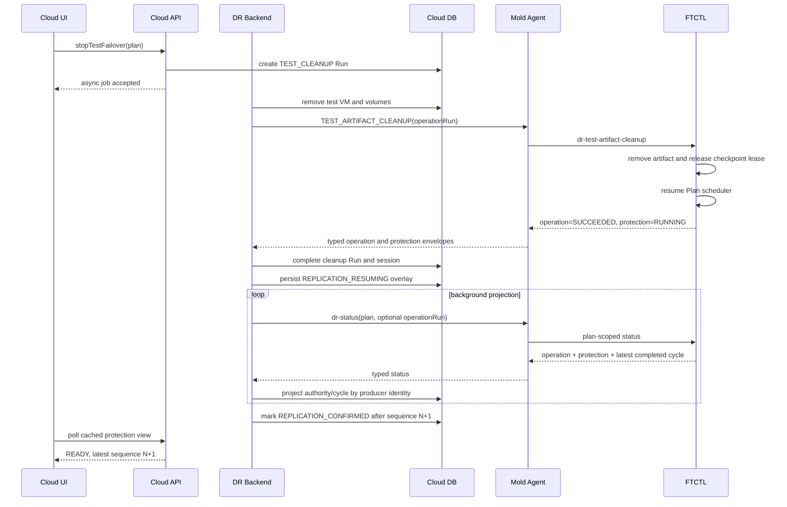

# Cross Hypervisor DR Post-Test Cleanup Protection Projection Convergence Design

- Date: 2026-07-21
- Scope: UI, API, Cloud backend, Mold Agent, FTCTL, DB
- Applies to: all four Cross Hypervisor DR directions
- Primary incident: VMware to ABLESTACK Test Failover cleanup
- FTCTL companion: `ablestack-qemu-exec-tools/docs/ftctl/437-ftctl-dr-operation-and-protection-status-envelope-design-20260721.md`

## 1. Decision

Test cleanup completion and continuous-protection recovery are different facts.

1. `TEST_CLEANUP` Run completion proves that temporary Cloud and FTCTL test
   resources were removed.
2. Scheduler control acknowledgment proves that the long-lived producer worker
   accepted `RUNNING` after cleanup.
3. A new durable checkpoint proves that continuous protection actually resumed.
4. Cloud DB/API/UI convergence proves that the resumed protection state is
   visible to the operator.

The Cloud projection path must therefore carry three separate identities:

| Identity | Lifetime | Purpose |
|---|---|---|
| operation Run | one API action | completion, progress, error, audit |
| protection producer Run | long-lived scheduler worker | cycle and restore-point attribution |
| scheduler authority | protection session | ordering, health, ownership, RPO |

A terminal finite operation such as `TEST_CLEANUP` must never become the
steady-state protection producer merely because it is the latest `dr_run` row.

## 2. Read-only preflight evidence

The design was revalidated against Plan
`c952cae5-11db-4e2a-807d-5ae1d3f9634d` on 2026-07-21.

### 2.1 Cloud DB

| Item | Observed value |
|---|---|
| Plan id/state/RPO | `37 / READY / 300s` |
| latest operation | Run `78`, `TEST_CLEANUP`, `SUCCEEDED` |
| cleanup Run UUID | `308e9451-786d-4aa0-b916-9f01d41c0714` |
| producer Run | Run `75`, `SYNC`, `SUCCEEDED` |
| producer Run UUID | `faf53080-6832-4fbd-9d5a-77e3cc19461c` |
| DB authority | lease `1`, authority `285` |
| DB cycle | plan/current/completed sequence `142` |
| DB latest durable | `2026-07-21 06:52:31 +09:00` |

No cycle newer than sequence 142 was projected to `dr_sync_cycle`.

### 2.2 FTCTL runtime

| Item | Observed value |
|---|---|
| scheduler session | Plan UUID |
| active producer | `faf53080-...` |
| worker | PID `1098232`, owner matched, heartbeat live |
| cleanup control | generation `4`, command `run`, reason `test-cleanup` |
| cleanup ACK | generation `4`, `RUNNING`, producer `faf53080-...` |
| lease/transition | checkpoint lease released, transition completed |
| authority | `292` |
| plan cycle | `146` in progress |
| latest completed | sequence `145`, `TARGET_READY` |
| latest durable | `2026-07-21T07:16:59+09:00` |

The engine had completed sequences 143, 144, and 145 after cleanup. Automatic
resume therefore worked; the failure was Cloud projection convergence.

### 2.3 Management projection trace

`DrProjectionScheduler` continued polling normally, but every request used the
terminal cleanup UUID:

```text
FtctlDrStatusCommand(
  planUuid=c952cae5-...,
  runUuid=308e9451-...  # TEST_CLEANUP
)
```

The returned status already contained scheduler authority 292, active producer
`faf53080-...`, and latest completed sequence 145. However, the top-level finite
operation timestamps remained at the cleanup checkpoint, and
`latestCompletedCycle.runUuid` was incorrectly emitted as the cleanup UUID.

## 3. Root cause

### 3.1 Latest operation was used as projection authority

`FtctlDrRuntimeProjectionAdapter.refreshPlanProjection()` calls
`resolveProjectionRun(plan)`. That method returns:

```java
active Run, otherwise drRunDao.findLatestByPlanId(planId)
```

After cleanup there is no active Run, so the latest terminal `TEST_CLEANUP` Run
is selected forever.

### 3.2 Finite-operation guards suppress protection projection

The same adapter then suppresses protection updates in two places:

```java
projectProtectionAuthority(...)
  if (isFiniteOperationRun(projectionRun)) return;

updatePlanFromStatus(...)
  if (isFiniteOperationRun(projectionRun)) {
      reconcileAcceptedRunFromStatus(...);
      return;
  }
```

Consequences:

- `dr_plan_runtime` remains at authority 285 and sequence 142;
- sequences 143 through 145 are not inserted in `dr_sync_cycle`;
- the latest completed checkpoint is not upserted;
- RPO is calculated from the stale cleanup-run timestamp;
- list/detail cache continues to show stale protection information.

### 3.3 Restore-point attribution would still be wrong after removing the guard

`upsertRestorePointFromStatus()` independently calls `resolveProjectionRun()`
and assigns that Run id to the restore point. Removing only the finite-operation
guard would therefore attribute sequence 145 to cleanup Run 78, not producer
Run 75.

### 3.4 FTCTL mixed two status domains

The current flat `dr-status --run <cleanup>` payload combines:

- immutable operation fields from cleanup Run state;
- live scheduler authority from the Plan;
- latest completed checkpoint from the producer;
- a cycle snapshot whose `runUuid` is copied from the request Run.

Cloud cannot safely infer ownership from this mixed envelope.

## 4. Non-negotiable invariants

1. UI calls Cloud API only; it never contacts Agent or FTCTL directly.
2. API action acceptance remains asynchronous.
3. A terminal operation Run is immutable audit history.
4. Protection authority is Plan-scoped and ordered by
   `(schedulerLeaseEpoch, authoritySequence)`.
5. Cycle ownership comes from `activeWorkerRunUuid` or an explicit producer Run
   in the completed-cycle snapshot, never from the status request Run.
6. `TEST_CLEANUP=SUCCEEDED` does not by itself prove resumed protection.
7. Protection recovery is confirmed only after control ACK, lease release, and
   a newer durable cycle are projected.
8. Repeated status projection is idempotent.
9. A stale operation envelope cannot overwrite a newer protection envelope.
10. Linux and Windows, and all four DR directions, use the same contract.

## 5. Target state model

### 5.1 Projection context

Add an internal immutable model in the DR plugin:

```java
final class DrProjectionContext {
    private final DrRunVO operationRun;
    private final DrRunVO producerRun;
    private final FtctlDrStatusAnswer status;
    private final boolean finiteOperationActive;
    private final boolean producerResolved;
}
```

`operationRun` and `producerRun` may be the same for initial `SYNC`, but are
normally different after pause, resume, test, failover, or cleanup operations.

### 5.2 Cleanup convergence states

```text
CLEANUP_RUNNING
  -> CLEANUP_SUCCEEDED
  -> REPLICATION_RESUMING
  -> REPLICATION_CONFIRMED

REPLICATION_RESUMING
  -> REPLICATION_RESUME_DELAYED   when grace expires
  -> REPLICATION_RESUME_FAILED    when authority/worker is unhealthy
```

These are operation/projection overlays. They do not replace the Plan's
protection state (`READY`, `PAUSED`, `DEGRADED`, `ERROR`).

## 6. Target sequence



## 7. UI code-level design

### 7.1 Files

- `ui/src/utils/dr/planState.js`
- `ui/src/views/infra/dr/DrPlanOverview.vue`
- `ui/src/views/infra/dr/DrProtectionInfoTab.vue`
- `ui/src/components/dr/DrActionToolbar.vue`
- locale files under `ui/public/locales/{ko,en}`

### 7.2 Display resolver

Add a pure resolver:

```javascript
export function resolveReplicationResumeDisplay(plan) {
  const state = String(plan.replicationresumestate || '').toUpperCase()
  if (state === 'VERIFYING') return { status: 'PROCESSING', label: '복제 재개 확인 중' }
  if (state === 'DELAYED') return { status: 'WARNING', label: '복제 상태 반영 지연' }
  if (state === 'FAILED') return { status: 'ERROR', label: '복제 재개 확인 필요' }
  return null
}
```

The overlay is shown above normal replication activity while it exists. It must
not rewrite cleanup history to failed when only projection is delayed.

### 7.3 Polling

- Reuse the existing protection-view polling timer.
- Poll every 10 to 15 seconds while `replicationresumestate=VERIFYING`.
- Stop the accelerated poll after `CONFIRMED`, `DELAYED`, `FAILED`, route leave,
  or component destruction.
- Do not block navigation and do not show a full-page loading mask.
- List and detail use the same cached API fields.

### 7.4 Action gating

During `VERIFYING` or projection inconsistency:

- allow read, refresh, and cleanup-history inspection;
- disable another Test Failover and planned Failover;
- expose explicit Resume only if scheduler control is not `RUNNING`;
- do not automatically submit duplicate Resume operations.

## 8. API code-level design

### 8.1 `DrPlanResponse`

Add typed fields:

```java
replicationResumeState       // NONE, VERIFYING, CONFIRMED, DELAYED, FAILED
protectionProducerRunId
protectionProducerRunUuid
lastOperationRunId
lastOperationRunType
lastOperationRunState
engineCheckpointSequence
projectedCheckpointSequence
projectionLagCycles
```

`engineCheckpointSequence` is diagnostic and comes only from a fresh status
projection. Normal list/detail values remain persisted DB/cache data.

### 8.2 Protection view snapshot

Version the cached JSON schema and store separate objects:

```json
{
  "latestOperation": {"id":78,"type":"TEST_CLEANUP","state":"SUCCEEDED"},
  "protection": {
    "producerRunUuid":"faf53080-...",
    "authoritySequence":292,
    "latestCompletedSequence":145,
    "resumeState":"CONFIRMED"
  }
}
```

The API must not serialize cleanup Run timestamps as the latest protection
checkpoint.

## 9. Cloud backend code-level design

### 9.1 DAO contract

Extend `DrRunDao` and `DrRunDaoImpl`:

```java
DrRunVO findByUuid(String uuid);
DrRunVO findLatestProtectionProducerByPlanId(long planId);
```

The fallback producer query includes only producer-capable run types such as
`SYNC` and the direction-specific long-lived reprotection producer. It excludes
`PAUSE_SYNC`, `RESUME_SYNC`, `TEST_FAILOVER`, `TEST_CLEANUP`, and release Runs.

### 9.2 Projection-context resolution

Replace `resolveProjectionRun()` with two explicit resolvers:

```java
DrRunVO resolveOperationRun(DrPlanVO plan) {
    DrRunVO active = drRunDao.findActiveByPlanId(plan.getId());
    return active != null ? active : drRunDao.findLatestByPlanId(plan.getId());
}

DrRunVO resolveProducerRun(DrPlanVO plan, FtctlDrStatusAnswer status) {
    DrRunVO producer = drRunDao.findByUuid(status.getActiveWorkerRunUuid());
    return producer != null ? producer
            : drRunDao.findLatestProtectionProducerByPlanId(plan.getId());
}
```

If status has a nonblank producer UUID that cannot be resolved, projection is
retained at last-good state and records `DR_PROJECTION_PRODUCER_UNRESOLVED`.

### 9.3 `refreshPlanProjection()`

Refactor the method in this order:

```text
resolve operation Run
send one status request
validate Plan/session/lease/authority coherence
resolve producer Run from protection envelope
project operation state
project protection authority
project current/latest completed cycles
project restore point using producer Run
reconcile cleanup-resume convergence
refresh view cache
```

An active finite operation may suppress cycle creation only while its
protection envelope reports a held checkpoint lease or paused scheduler. A
terminal finite operation never suppresses Plan authority projection.

### 9.4 Split adapter methods

Replace the early returns with explicit methods:

```java
projectOperationState(plan, context);
projectProtectionState(plan, context);
projectLatestCompletedCycle(plan, context);
projectRestorePoint(plan, context.getProducerRun(), context.getStatus());
```

`reconcileAcceptedRunFromStatus()` receives `operationRun` as an argument and
must not call a global latest-Run resolver internally.

### 9.5 Completed-cycle precedence

Protection timestamps and RPO use this precedence:

1. coherent `latestCompletedCycle.targetDurableAt`;
2. typed `latestCompletedTargetDurableAt`;
3. last-good DB value.

The finite operation's top-level `lastTargetDurableAt` is never used for a
newer Plan authority snapshot. Source time follows the same rule.

### 9.6 Restore-point and sync-cycle attribution

Pass the resolved producer Run explicitly:

```java
upsertRestorePointFromStatus(plan, producerRun, status, runtime);
projectLatestCompletedSyncCycle(plan, producerRun, status, sequence, baseline);
```

The cycle key remains `(planId, engineRunUuid, sequence)`, where
`engineRunUuid=producerRun.uuid`. Duplicate projection updates the same row.

### 9.7 Cleanup convergence evaluator

Create `DrReplicationResumeConvergenceService`:

```java
ResumeState evaluate(DrPlanVO plan, DrRunVO cleanupRun,
        DrTestSessionVO testSession, DrPlanRuntimeVO before,
        DrPlanRuntimeVO after) {
    if (!controlAckRunning(after) || !leaseReleased(after)) return VERIFYING;
    if (!healthyAuthority(after)) return FAILED;
    if (after.getLatestCompletedCycleSequence() >
            testSession.getCheckpointSequence()) return CONFIRMED;
    if (pastGrace(cleanupRun, plan.getRpoSeconds())) return DELAYED;
    return VERIFYING;
}
```

Grace is `max(2 * RPO, 2 * scheduler interval) + 30 seconds`, capped by an
operator-configurable maximum. A delayed projection does not submit commands;
it emits an event and keeps polling.

## 10. Mold Agent code-level design

### 10.1 DTO

`FtctlDrStatusAnswer` must carry separate typed fields for:

```java
operationRunUuid
operationAction
operationState
operationStep
operationProgress
operationTerminal
protectionProducerRunUuid
schedulerSessionUuid
schedulerLeaseEpoch
authoritySequence
controlGeneration
controlAckGeneration
controlState
transitionState
checkpointLeaseState
latestCompletedCycle
```

Existing flat getters remain for one compatibility release, but Cloud
projection uses the new envelopes when capability
`dr-status-envelope-v2` is present.

### 10.2 Wrapper

`LibvirtFtctlDrStatusCommandWrapper` parses `operation` and `protection`
objects independently. It must reject:

- protection Plan UUID mismatch;
- producer UUID missing when a live worker is reported;
- completed-cycle producer mismatch;
- lower lease/authority than the accepted DB snapshot.

The Agent remains transport and validation only; it does not write Cloud DB or
decide UI state.

## 11. FTCTL code-level design

The automatic cleanup resume path in `lib/ftctl/dr_runtime.sh` and
`lib/ftctl/dr_scheduler.sh` is retained. The required change is the status
contract, not a second resume command.

`dr-status` emits:

```json
{
  "operation": {
    "runUuid": "308e9451-...",
    "action": "dr-test-artifact-cleanup",
    "state": "READY",
    "step": "test-cleanup-completed",
    "progress": 100,
    "terminal": true
  },
  "protection": {
    "producerRunUuid": "faf53080-...",
    "schedulerSessionUuid": "c952cae5-...",
    "schedulerLeaseEpoch": 1,
    "authoritySequence": 292,
    "controlState": "RUNNING",
    "transitionState": "COMPLETED",
    "checkpointLeaseState": "RELEASED",
    "latestCompletedCycle": {
      "runUuid": "faf53080-...",
      "sequence": 145,
      "state": "TARGET_READY",
      "targetDurableAt": "2026-07-21T07:16:59+09:00"
    }
  }
}
```

The completed-cycle `runUuid` comes from the checkpoint reference/record or
active producer, not the status request Run. Flat fields remain compatibility
aliases and are generated from the appropriate envelope.

## 12. DB persistence design

No schema migration is required for this correction. Existing typed columns
already represent the required ownership and convergence contract:

- `dr_plan_runtime.engine_run_uuid` stores the protection producer UUID;
- `dr_plan_runtime.authority_sequence` and cycle sequence columns store the
  monotonic FTCTL authority;
- `dr_sync_cycle.run_id` and `engine_run_uuid` store producer ownership;
- `dr_restore_point.run_id` stores the same producer Run relation;
- the finite cleanup operation remains independently recorded in `dr_run` and
  `dr_test_session.cleanup_run_id`.

Replication resume state is derived for API/UI presentation from scheduler,
health, owner, activity, and protection fields. Persisting a second state
machine would create another authority requiring reconciliation.

Data rules:

- no historical `dr_run` row is rewritten;
- newly discovered cycles use the resolved SYNC/REPROTECT producer Run;
- restore points use the same producer Run;
- repair after deployment is performed by normal idempotent projection, not
  direct row edits or DDL.

## 13. Error contract

| Code | Meaning | Action |
|---|---|---|
| `DR_PROJECTION_PRODUCER_UNRESOLVED` | active producer UUID has no Cloud Run | retain last-good state, alert |
| `DR_PROJECTION_OPERATION_PROTECTION_MIXED` | operation UUID used as cycle owner | reject snapshot |
| `DR_REPLICATION_RESUME_VERIFYING` | cleanup done, newer cycle not yet durable | continue polling |
| `DR_REPLICATION_RESUME_DELAYED` | grace expired without projected cycle | warning, no duplicate command |
| `DR_REPLICATION_RESUME_FAILED` | worker/owner/control unhealthy | DEGRADED and operator action |
| `DR_PROJECTION_SEQUENCE_LAG` | engine sequence exceeds DB sequence | project/retry, expose lag |

## 14. Tests

### 14.1 Cloud unit tests

Add cases to `FtctlDrRuntimeProjectionAdapterTest`:

1. latest Run is terminal cleanup, producer is active, sequence 145 projects;
2. restore point and cycle use producer Run id, not cleanup Run id;
3. stale top-level operation time loses to latest completed-cycle time;
4. active Test Failover with held lease does not create a new cycle;
5. cleanup ACK running without N+1 cycle remains `VERIFYING`;
6. N+1 durable cycle changes state to `CONFIRMED`;
7. lower lease/authority is rejected;
8. repeated sequence projection is idempotent;
9. unresolved producer retains last-good authority;
10. list/detail cache expose the same sequence and resume state.

### 14.2 Agent and FTCTL tests

- request Run differs from producer Run;
- completed-cycle `runUuid` equals producer Run;
- cleanup control generation and ACK match;
- lease is released before resume confirmation;
- next cycle sequence is greater than the leased test checkpoint;
- flat compatibility fields match the new envelopes.

### 14.3 Integration acceptance

For Linux and Windows:

1. complete a normal incremental checkpoint `N`;
2. start Test Failover from `N`;
3. confirm test VM boot;
4. execute Test Cleanup;
5. verify temporary Cloud VM/volumes and FTCTL artifacts are absent;
6. verify control ACK `RUNNING`, lease `RELEASED`, one live producer worker;
7. wait at most one RPO interval plus projection grace;
8. verify FTCTL, DB, API, and UI all report `N+1` or newer;
9. verify cycle/restore-point Run id is the producer Run;
10. verify no manual Sync/Resume command was needed.

## 15. Recommended implementation order

1. Add failing Cloud unit tests for terminal-cleanup/latest-run projection.
2. Add FTCTL status-envelope self-tests and producer Run attribution.
3. Implement FTCTL `operation`/`protection` envelope with compatibility aliases.
4. Extend Agent DTO/wrapper and capability negotiation.
5. Add Cloud DAO producer resolution and `DrProjectionContext`.
6. Split operation, authority, cycle, and restore-point projection.
7. Reuse existing runtime/cycle/restore-point ownership columns; no DDL.
8. Derive replication-resume state from the canonical runtime projection.
9. Update UI presentation and action gating from the same runtime fields.
10. Build changed Cloud Maven modules and UI; build FTCTL through GitHub Actions.
11. Deploy FTCTL/Agent/Cloud/UI in compatibility order.
12. Let normal projection repair existing Plan 37, then execute Linux and Windows
    Test Failover cleanup acceptance tests.

## 16. AS-IS / TO-BE

| Layer | AS-IS | TO-BE |
|---|---|---|
| UI | cleanup success can coexist with stale checkpoint display | cleanup and replication-resume confirmation shown separately |
| API | latest operation and protection authority are mixed | latest operation plus canonical protection object |
| Backend | active Run else latest Run drives all projection | operation Run and producer Run resolved independently |
| Backend | finite-operation guard skips authority/cycles | operation always reconciled; protection always projected when coherent |
| Backend | restore point re-resolves latest Run | producer Run passed explicitly |
| Agent | flat mixed status DTO | typed operation/protection envelopes |
| FTCTL | request Run leaks into completed-cycle owner | checkpoint producer owns completed-cycle snapshot |
| DB | authority 285/sequence 142 remains while engine is 292/145 | monotonic authority and N+1 cycles converge automatically |
| RPO | finite operation timestamp can become stale source | latest completed durable cycle is canonical |
| Cleanup | Run success interpreted as full recovery | resource cleanup, scheduler ACK, and new durable cycle are separate gates |

## 17. Implementation and deployment record (2026-07-21)

Implemented scope:

- Agent DTO/wrapper accepts `latest_completed_producer_run_uuid` and uses it
  for the completed-cycle snapshot;
- `DrRunDao` resolves the latest SYNC/REPROTECT producer when runtime status
  does not provide one;
- `FtctlDrRuntimeProjectionAdapter` projects authority, cycle, and restore point
  even when the request Run is a finite cleanup operation;
- cycle and restore-point `run_id` use the producer Run, not the cleanup Run;
- the UI derives and displays a localized replication resume state;
- no DB schema change was necessary.

Build verification passed for the changed Maven modules, 12 KVM wrapper tests,
16 projection tests, and the production UI build. Deployment updated only the
changed classes in management/agent JARs and copied static UI assets while
preserving `WEB-INF`.

Runtime verification on Plan 37 converged as follows:

| Signal | Before deployment | After projection convergence |
|---|---|---|
| runtime authority | 285 | 308 |
| completed sequence | 142 | 153 |
| runtime producer | SYNC Run 75 | SYNC Run 75 |
| latest operation | cleanup Run 78 | cleanup Run 78, independently retained |
| projection integrity | `DR_STATUS_CYCLE_SNAPSHOT_INCOHERENT` | `CONSISTENT` |
| scheduler | stale/dead after package replacement | `RUNNING`, `HEALTHY`, owner matched |
| test session | `CLEANED` | `CLEANED` |

The post-deployment cycle 153 was attributed to Run 75 and verified as
incremental. This is the retest baseline; a new Test Failover/Cleanup run must
confirm that no operator-issued resume is needed during the normal workflow.

## 18. Completion gate

Implementation is complete only when:

- cleanup Run and Test Session are terminal and temporary resources are absent;
- scheduler control/ACK, lease, session, owner, and worker identity are coherent;
- FTCTL produces a checkpoint newer than the test checkpoint;
- Cloud DB, API cache, list, and detail project that checkpoint within the
  bounded interval;
- cycle and restore point are attributed to the producer Run;
- no manual Sync or Resume action is required;
- Linux and Windows acceptance tests pass without weakening the other three DR
  direction contracts.

## 19. Post-implementation regression and normative correction - 2026-07-21

This section supersedes the minimum compatibility conclusion in section 17.
Producer attribution fixed cycle ownership, but it did not fully separate a
finite operation response from Plan protection authority. The full status
boundary and scheduler recovery design below is therefore required before Test
Failover can be considered available.

### 19.1 Read-only preflight evidence

Plan `c952cae5-11db-4e2a-807d-5ae1d3f9634d` was inspected without changing DB
rows, runtime files, services, or VM state.

Cloud DB reported:

```text
dr_plan.state                         READY
dr_plan.last_run_id                   78 (TEST_CLEANUP, SUCCEEDED)
dr_plan_runtime.scheduler_state       RUNNING
dr_plan_runtime.scheduler_health      HEALTHY
dr_plan_runtime.scheduler_pid_alive   true
dr_plan_runtime.owner_matched         true
dr_plan_runtime.protection_state      READY
dr_plan_runtime.latest_completed_incremental_verified NULL
dr_plan_runtime.last_status_at        2026-07-20 23:12:14 UTC
```

The management trace showed that periodic Plan projection sent:

```text
FtctlDrStatusCommand(
  planUuid=c952cae5-...,
  runUuid=308e9451-...  # terminal TEST_CLEANUP Run 78
)
```

The corresponding run-scoped response reported cleanup success, but its flat
protection aliases contained `schedulerHealth=STOPPED`,
`schedulerPidAlive=false`, `ownerMatched=false`, and no
`latestCompletedIncrementalVerified` value.

At the same time, the authoritative Plan-scoped FTCTL query reported:

```text
state                         ERROR
step                          scheduler-recovery-failed
error_code                    DR_SCHEDULER_OWNER_MISMATCH
scheduler_state               ERROR
scheduler_pid_alive           false
scheduler_health              OWNER_MISMATCH
replication_activity          STOPPED
owner_matched                 false
latest_completed_sequence     154
latest_completed_incremental_verified true
```

The latest checkpoint remained locally durable and incrementally verified, but
continuous protection was not running. The UI displayed cached `READY`, while
Test Failover was disabled because `normalCutoverReady` requires the persisted
incremental verification value to be exactly `true`.

### 19.2 Confirmed fault chain

1. `FtctlDrRuntimeProjectionAdapter.resolveProjectionRun()` selected the active
   Run or latest terminal Run.
2. `refreshPlanProjection()` used that Run UUID for the only FTCTL status
   request, even when the request was intended to refresh Plan authority.
3. `projectProtectionAuthority()` copied nullable protection aliases from the
   cleanup response into `dr_plan_runtime` before the operation/status boundary
   was validated.
4. `latest_completed_incremental_verified` became `NULL`; the strict cutover
   gate correctly disabled Test Failover.
5. A separate Plan-scoped query revealed that the scheduler had exited after
   self-owner validation failed with `DR_SCHEDULER_OWNER_MISMATCH`.
6. Because list/detail cache was generated from stale DB authority, UI status
   remained `READY` instead of `DEGRADED` or `ERROR`.

The action gate is not the defect. Weakening the gate would allow a Test
Failover while replication is stopped. The defects are mixed query scope,
non-atomic authority projection, missing-value overwrite, scheduler recovery,
and stale presentation.

### 19.3 Normative status-query architecture

Cloud uses two independent status scopes:

```text
PLAN_AUTHORITY
  key: plan UUID
  command: dr-status --plan <plan> --json
  writes: dr_plan_runtime, dr_sync_cycle, dr_restore_point

OPERATION
  key: plan UUID + run UUID
  command: dr-status --plan <plan> --run <run> --json
  writes: dr_run, dr_run_step, dr_test_session, dr_cutover_session
```

Capability-aware behavior:

1. When `dr-status-envelope-v2` is present, one `BOTH` request may return typed
   `operation` and `protection` envelopes. Each envelope is still processed by
   a separate projector.
2. During compatibility rollout, Cloud issues a Plan-only request for authority
   and a run-scoped request only when operation reconciliation is needed.
3. A run-scoped flat response is never accepted as Plan authority.
4. A Plan-scoped response never completes or fails a finite operation Run.

### 19.4 UI code-level design

Files:

- `ui/src/utils/dr/planState.js`
- `ui/src/utils/dr/resourceActions.js`
- `ui/src/components/dr/DrActionToolbar.vue`
- `ui/src/views/infra/dr/DrPlanOverview.vue`

Changes:

1. Add `resolveProtectionDisplayState(plan)` precedence:

```text
authorityStale -> VERIFYING
schedulerHealth in DEAD/OWNER_MISMATCH/DUPLICATE_WORKER/STALE -> DEGRADED
ownerMatched == false or schedulerPidAlive == false -> DEGRADED
protectionState ERROR/DEGRADED -> same state
otherwise use protectionState
```

2. Do not derive Plan health from `latestRun.state`.
3. Replace a boolean-only disabled action with backend eligibility details:

```json
{
  "eligible": false,
  "reasonCode": "DR_SCHEDULER_OWNER_MISMATCH",
  "reasonText": "The replication scheduler is not running.",
  "evaluatedAuthoritySequence": 310,
  "evaluatedAt": "2026-07-21T08:13:28+09:00"
}
```

4. Show the localized reason in the disabled action tooltip. Do not synthesize
   eligibility in the browser.
5. Poll lightweight protection authority every 5 seconds while a detail page is
   open and every 10 seconds in the list. Update rows/panels in place without a
   full-screen loading state.
6. If `authorityObservedAt` exceeds two poll intervals, display `Status check
   required` and disable destructive/promote/test actions.

### 19.5 API code-level design

`DrPlanResponse` keeps `actionEligibility: Map<String, Boolean>` for one release
and adds:

```java
Map<String, DrActionEligibilityResponse> actionEligibilityDetails;
Date authorityObservedAt;
Long authoritySequence;
String projectionIntegrityState;
String projectionIntegrityCode;
```

`DrActionEligibilityResponse` contains `eligible`, `reasonCode`, `reasonText`,
`evaluatedAuthoritySequence`, and `evaluatedAt`. List, detail, and protection
view responses must use the same persisted authority snapshot and eligibility
evaluation. A cache snapshot is valid only when its authority sequence equals
the current `dr_plan_runtime.authority_sequence`.

### 19.6 Cloud backend code-level design

#### 19.6.1 Split projection context

Replace the single `resolveProjectionRun()` input with:

```java
final class DrProjectionContext {
    DrPlanVO plan;
    DrRunVO operationRun;          // nullable finite operation
    DrRunVO protectionProducerRun; // SYNC or REPROTECT only
    Long persistedLeaseEpoch;
    Long persistedAuthoritySequence;
}
```

`refreshPlanProjection()` becomes:

```java
DrProjectionContext context = projectionContextResolver.resolve(plan);
FtctlDrStatusAnswer protection = statusClient.queryPlan(plan);
validateProtectionBoundary(protection);
projectProtectionSnapshot(context, protection);

if (context.operationRun != null && shouldReconcile(context.operationRun)) {
    FtctlDrStatusAnswer operation = statusClient.queryOperation(plan, context.operationRun);
    validateOperationBoundary(operation, context.operationRun);
    projectOperationSnapshot(context, operation);
}
```

#### 19.6.2 Validation ordering

Do not call `projectProtectionAuthority()` before checking answer result,
schema/capability, scope, Plan UUID, session UUID, lease epoch, authority
sequence, and completed-cycle coherence. Boundary failure retains the last-good
authority and marks projection integrity degraded.

#### 19.6.3 Null and monotonic merge rules

- Operation fields never update authority columns.
- A lower `(leaseEpoch, authoritySequence)` is ignored.
- The same authority sequence must be byte-for-byte equivalent for immutable
  identity fields; conflict produces `DR_STATUS_AUTHORITY_CONFLICT`.
- A newer READY authority must include scheduler identity, heartbeat,
  latest-completed sequence, producer UUID, durable time, and incremental
  verification. Missing required fields produce
  `DR_STATUS_AUTHORITY_INCOMPLETE`; they do not overwrite last-good values.
- `latestCompletedIncrementalVerified=NULL` is never interpreted as success.
- `resolveProtectionProducerRunUuid()` must not fall back to
  `status.getRunUuid()` when the request Run is finite.

#### 19.6.4 Eligibility evaluator

`DrProtectionAuthorityServiceImpl` remains strict and returns a structured
decision. Test Failover requires all of:

```text
protectionState == READY
freshnessState == WITHIN_RPO
schedulerState == RUNNING
schedulerPidAlive == true
schedulerHealth == HEALTHY
ownerMatched == true
projectionIntegrityState == CONSISTENT
latestCompletedIncrementalVerified == true
latestCompletedCycleSequence != null
no active operation
no active test session requiring cleanup
```

The first failed predicate becomes the stable reason code. No UI or API layer
may bypass this evaluator.

### 19.7 Agent code-level design

Add an explicit status scope to `FtctlDrStatusCommand`:

```java
enum FtctlDrStatusScope { PLAN_AUTHORITY, OPERATION, BOTH }
```

The KVM wrapper maps scope to CLI arguments and validates the returned envelope:

```text
PLAN_AUTHORITY -> --plan only; protection envelope required
OPERATION      -> --plan + --run; operation envelope required
BOTH           -> --plan + --run; v2 capability required
```

`FtctlDrStatusAnswer` gains typed `operation` and `protection` objects. Existing
flat getters remain compatibility aliases but the Cloud projector must use the
typed object whenever v2 is advertised. The wrapper rejects an answer whose
declared scope does not match the command.

### 19.8 FTCTL code-level design

#### 19.8.1 Status envelope

`dr-status --plan` reads only Plan-scoped files. `--run` adds operation state but
does not replace protection fields. `latest_completed_*` always comes from the
latest durable cycle/restore-point record, never the requested Run state.

```json
{
  "schema_version": 2,
  "scope": "BOTH",
  "operation": {"run_uuid":"308e...","state":"SUCCEEDED"},
  "protection": {
    "state":"ERROR",
    "scheduler":{"health":"OWNER_MISMATCH","pid_alive":false},
    "latest_completed_cycle":{"sequence":154,"incremental_verified":true}
  }
}
```

#### 19.8.2 Scheduler self-ownership validation

`ftctl_dr_scheduler_active_worker_valid()` currently returns only success or
failure. Replace it with a diagnostic identity comparison that records:

```text
LOCAL_PID, LOCAL_START_TICKS, LOCAL_SESSION, LOCAL_LEASE_EPOCH, LOCAL_RUN
FILE_PID, FILE_START_TICKS, FILE_SESSION, FILE_LEASE_EPOCH, FILE_RUN
OWNER_LOCK_HELD
```

The worker captures its immutable identity with `BASHPID` and start ticks after
the background `exec`, then retains the owner-lock file descriptor for its full
lifetime. Before declaring owner mismatch:

1. read `active.pid` and `lease.state` through one atomic snapshot helper;
2. retry bounded transient read failures three times;
3. if the worker still holds the owner lock and no newer live lease is proven,
   repair missing/stale identity files from the immutable local identity;
4. emit `DR_SCHEDULER_SELF_LEASE_REPAIRED` and continue;
5. emit `DR_SCHEDULER_OWNER_MISMATCH` only when another live identity or higher
   lease epoch is proven.

On a genuine dead worker, Plan reconcile acquires the owner lock, increments
the lease epoch exactly once, starts one replacement worker, and waits for an
identity-bearing RUNNING ACK. Protection remains `DEGRADED/RECOVERING` until a
new heartbeat and durable cycle are observed.

#### 19.8.3 Reconcile ownership

The periodic reconcile path scans enabled DR Plan profiles as well as HA/FT
profiles. It may recover a scheduler only when no transition/checkpoint lease
is active and no live owner holds the lock. Recovery is rate-limited and
idempotent; status reads never start workers.

### 19.9 DB code-level design

The core fix uses existing columns. No new DDL is required. DAO behavior must
change from read-then-unconditional-update to a transactional compare-and-set:

```java
boolean updateIfNewerAuthority(
    long planId,
    long leaseEpoch,
    long authoritySequence,
    DrPlanRuntimeVO snapshot);
```

The SQL update accepts only a newer lease or a non-decreasing sequence in the
same lease. Required READY fields are validated before the update. Projection
integrity errors may update only `projection_integrity_*`, `last_status_at`, and
diagnostic error fields; they cannot erase the last-good cycle metrics.

`dr_plan_view_cache` is regenerated after the authority transaction commits.
Its `snapshot_version` is advanced and the JSON stores the authority sequence
and observed time. A cache row with a different sequence is stale and is never
used for action eligibility.

### 19.10 Test and preflight design

Required tests:

1. terminal cleanup Run plus healthy Plan authority keeps Test Failover enabled;
2. terminal cleanup Run plus owner mismatch disables it with the exact reason;
3. run-scoped null metric cannot erase Plan-scoped incremental verification;
4. Plan-scoped error cannot be hidden by a successful operation;
5. lower lease/authority snapshots cannot overwrite current authority;
6. concurrent projection writers converge through DAO compare-and-set;
7. missing `active.pid` while the same worker holds owner lock is repaired;
8. proven foreign live owner produces OWNER_MISMATCH and no duplicate worker;
9. dead worker is recovered once with lease epoch +1;
10. list, detail, cache, and action eligibility expose the same authority.

Live acceptance for Linux and Windows must capture, at one timestamp, FTCTL
Plan status, Cloud DB runtime, API response, UI status, action eligibility, one
live scheduler process, lease/active PID identity, and the latest cycle. Test
Failover PASS requires all layers to agree; a green cached UI is not evidence.

### 19.11 Recommended implementation order

1. Add failing Cloud tests for cleanup Run scope, null overwrite, stale cache,
   and structured eligibility reasons.
2. Add FTCTL self-tests for envelope v2, self-lease repair, genuine owner
   mismatch, and single recovery.
3. Implement FTCTL typed status envelope and Plan-only authority read.
4. Harden scheduler identity, atomic snapshot, self-repair, and reconcile.
5. Extend Agent command scope, DTO, wrapper, and capability negotiation.
6. Split Cloud operation and protection status clients/projectors.
7. Add transactional monotonic DAO update and cache sequence validation.
8. Expose structured eligibility details through API.
9. Update UI state resolver, disabled-action reason, and bounded polling.
10. Build/deploy FTCTL first, then Agent/Cloud changed modules, then UI.
11. Let normal Plan projection repair Plan 37; do not edit runtime DB manually.
12. Run Linux and Windows cleanup-resume-Test Failover acceptance tests.

### 19.12 AS-IS / TO-BE summary

| Layer | AS-IS | TO-BE |
|---|---|---|
| UI | cached READY with silently disabled action | canonical authority state plus explicit disabled reason |
| API | boolean eligibility only | boolean compatibility map plus structured decision |
| Backend | latest operation Run drives the only status query | independent operation and Plan-authority queries/projectors |
| Backend | authority projected before boundary validation | validate scope/coherence first, then transactional projection |
| Agent | one flat mixed answer | scoped command and typed operation/protection answer |
| FTCTL status | requested Run can suppress Plan metrics | operation and protection envelopes with Plan-cycle authority |
| FTCTL scheduler | any self-validation miss becomes OWNER_MISMATCH | bounded reread, self-lease repair, proven-conflict failure |
| Reconcile | stopped DR scheduler remains stopped | idempotent singleton recovery with epoch +1 |
| DB | nullable operation aliases overwrite authority | monotonic compare-and-set; incomplete snapshot retains last-good values |
| Cache | generated from stale runtime and trusted for actions | authority-sequence-bound cache; eligibility uses current runtime |

### 19.13 Corrected completion gate

The correction is complete only when the full envelope is deployed, a terminal
cleanup Run can coexist with a healthy Plan authority, a genuine scheduler
failure is visible as degraded within two poll intervals, automatic singleton
recovery advances the lease exactly once, and Linux/Windows Test Failover
actions are enabled only from the same coherent authority snapshot shown in the
UI.

## 20. Current activity and completed cleanup display boundary

After the four cleanup convergence outcomes are satisfied, the terminal
TEST_CLEANUP Run is historical evidence only. It must not remain the prominent
activity card on the protection tab and its frozen status must not provide
current scheduler or control fields.

The current protection tab is resolved in this order: active finite Run,
active replication Cycle, then idle protection. Plan authority always comes
from `dr_plan_runtime`; completed operation history remains in `dr_run`.
Protection-view cache version 2, exact class changes, and v1 compatibility are
defined in
`566-cross-hypervisor-dr-current-protection-activity-and-operation-history-projection-design-20260721.md`.
