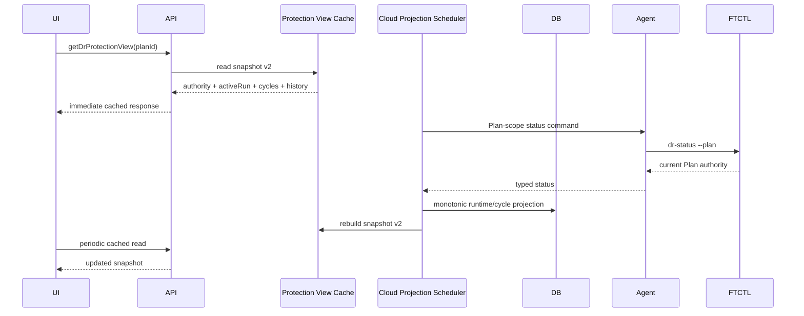

# Cross-Hypervisor DR Current Protection Activity And Operation History Projection Design

- 작성일: 2026-07-21
- 상태: 구현 전 상세 설계
- 적용 범위: Cloud UI/API/Backend/DB, Agent/FTCTL 상태 계약 확인
- 기준 사례: DR Plan `2514a846-64a2-4bc7-ba88-38a874410782`

## 1. 목적

테스트 정리가 완료되고 지속 복제가 재개된 Plan에서 완료된
`TEST_CLEANUP` Run이 보호 정보 화면의 대표 작업으로 계속 표시되는 문제를
해결한다. 다음 세 상태를 하나의 값으로 축약하지 않는 것이 핵심이다.

1. **현재 보호 상태**: 장기 실행 Scheduler와 최신 durable checkpoint가
   제공하는 Plan 단위 상태
2. **현재 복제 활동**: 현재 실행 중인 RPO Cycle 또는 대기 상태
3. **작업 이력**: `TEST_FAILOVER`, `TEST_CLEANUP`, `SYNC` 같은 유한 Run의 결과

완료된 테스트 정리는 작업 이력에는 남지만 현재 보호 동작을 대표하지 않는다.

## 2. 실환경 Preflight 결과

2026-07-21 14:04 KST에 관리 서버 `10.10.32.10`의 Cloud DB를 읽기 전용으로
확인했다.

| 항목 | 확인값 | 판정 |
| --- | --- | --- |
| Plan | `READY / ENABLED`, 오류 없음 | 정상 보호 상태 |
| 최신 Run | `TEST_CLEANUP #84`, `SUCCEEDED`, `completed` | 완료된 과거 작업 |
| 활성 Run | 없음 | 현재 유한 작업 없음 |
| 최신 Cycle | `#189`, `READY`, `CBT_INCREMENTAL -> NO_CHANGE` | 최신 동기화 정상 완료 |
| Runtime | generation `380`, Scheduler `RUNNING/HEALTHY`, PID alive | 장기 보호 엔진 정상 |
| 보호 상태 | `READY / WITHIN_RPO / CONSISTENT` | 정상 |
| Cache | snapshot version `1`, generated 14:04:32 KST | 최신이나 계약 불충분 |

캐시 v1의 키는 `plan`, `latestRun`, `latestRunSteps`, `replicas`,
`latestCompletedCheckpoint`, `events`뿐이다. `activeRun`, `currentSyncCycle`,
`currentProtectionRuntime`가 없으며 `latestRun`은 완료된 TEST_CLEANUP이다.

따라서 이번 오류는 캐시 지연이나 FTCTL 정지가 아니다. 최신 캐시가 잘못된
대표 항목을 전달하고 UI가 이를 현재 작업으로 렌더링하는 **projection 의미
오류**다.

## 3. 확인된 코드 원인

### 3.1 UI

`ui/src/views/infra/dr/DrPlanList.vue`

```js
currentRun () {
  return this.detailRuns.find(run => this.isActiveRun(run)) ||
    this.detailRuns[0] || this.detailPlan.lastrun || {}
}
```

활성 Run이 없으면 첫 번째 완료 Run을 `currentRun`으로 승격한다.
`fetchProtectionView()`도 `snapshot.latestRun` 하나만 `detailRuns`에 넣는다.

`ui/src/views/infra/dr/DrPlanOverview.vue`

```vue
<dr-run-progress
  v-if="showProtectionSummary && currentRun && currentRun.id"
  :run="currentRun" />
```

Run의 활성 여부를 검사하지 않으므로 완료된 TEST_CLEANUP이 보호 정보의 대표
진행 카드가 된다. 일부 상세 값도 `plan -> currentRun` 순서로 fallback하여
작업 종료 시점의 frozen status가 현재 runtime처럼 보일 수 있다.

### 3.2 API/Backend

`DrProtectionViewServiceImpl.rebuildProtectionView()`는
`DrRunDao.findLatestByPlanId()` 한 건과 그 step만 snapshot에 넣는다. Plan
runtime과 Cycle은 별도 projection으로 존재하지만 캐시 계약에 포함하지 않는다.

`DrResponseGenerator.createPlanResponse()`는 보호 권위 필드에는
`DrProtectionAuthoritySnapshot`을 사용하지만, control protocol, control
generation/ack, transition, checkpoint lease 같은 runtime 제어 필드는 최신
Run의 `last_status_json`에서 읽는다. 완료된 TEST_CLEANUP status가 현재 Scheduler
상태보다 오래되거나 필드를 생략하면 UI에 `-`, `UNKNOWN`, `NOT READY`가 나타난다.

### 3.3 DB

DB에는 필요한 권위 데이터가 이미 분리되어 있다.

- `dr_plan_runtime`: 현재 Plan/Scheduler 보호 권위
- `dr_sync_cycle`: 현재 및 완료 Cycle
- `dr_run`: 유한 작업 이력
- `dr_plan_view_cache`: UI용 비동기 read model

문제는 저장 구조가 아니라 cache builder와 response generator가 서로 다른
수명주기의 레코드를 다시 섞는 데 있다.

## 4. 설계 원칙과 불변조건

1. `latestOperationRun`은 이력이며 현재 보호 권위가 아니다.
2. `activeRun`만 작업 진행 카드에 표시한다.
3. 활성 Run이 없어도 `currentSyncCycle`은 별도로 표시할 수 있다.
4. Cycle도 없으면 보호 화면은 `대기(IDLE)`를 표시한다.
5. 현재 Scheduler/control/authority 필드는 오직 `dr_plan_runtime`에서 읽는다.
6. Run의 `last_status_json`은 해당 작업의 진단 정보에만 사용한다.
7. UI 조회는 DB/cache 전용이며 Agent 또는 FTCTL을 동기 호출하지 않는다.
8. 캐시 생성 실패 시 마지막 정상 snapshot을 유지하고 stale 경고만 표시한다.
9. Action eligibility와 화면 상태는 동일한 authority sequence를 사용한다.
10. 완료된 TEST_CLEANUP은 이력 탭에서 조회되며 보호 상태를 덮어쓰지 않는다.

## 5. 목표 상태 모델

```text
ProtectionAuthority
  source: dr_plan_runtime
  lifetime: Plan
  fields: protection, scheduler, owner, freshness, control, authoritySequence

ReplicationActivity
  source: dr_sync_cycle + dr_plan_runtime
  lifetime: RPO cycle
  fields: currentCycle, latestCompletedCycle, replicationActivity

OperationActivity
  source: dr_run + dr_run_step
  lifetime: finite command
  fields: activeRun, latestOperationRun, steps
```

대표 화면 우선순위는 다음과 같다.

```text
activeRun exists       -> 유한 작업 진행 표시
else active Cycle      -> 현재 복제 Cycle 간결 표시
else                   -> 보호 정상/대기 표시

latestOperationRun     -> 이력 탭 또는 최근 작업 요약
latestCompletedCycle   -> 마지막 완료 복제 영역
```

## 6. API 및 캐시 v2 계약

`getDrProtectionView`의 snapshot version을 `2`로 올린다.

```json
{
  "version": 2,
  "plan": {},
  "currentProtectionRuntime": {
    "runtimeGeneration": 380,
    "authoritySequence": 380,
    "protectionState": "READY",
    "freshnessState": "WITHIN_RPO",
    "schedulerState": "RUNNING",
    "schedulerHealth": "HEALTHY",
    "schedulerPidAlive": true,
    "ownerMatched": true,
    "replicationActivity": "IDLE",
    "controlProtocolVersion": 2,
    "controlGeneration": 12,
    "controlAckGeneration": 12,
    "controlState": "ACKNOWLEDGED",
    "currentCycleSequence": 189,
    "currentCycleState": "COMPLETED",
    "latestCompletedCycleSequence": 189
  },
  "activeRun": null,
  "activeRunSteps": [],
  "latestOperationRun": {
    "id": "c52eb0e1-65c0-4989-8067-b4eef6711d5d",
    "runtype": "TEST_CLEANUP",
    "state": "SUCCEEDED"
  },
  "latestOperationRunSteps": [],
  "currentSyncCycle": null,
  "latestCompletedSyncCycle": {
    "sequence": 189,
    "state": "READY",
    "effectiveMode": "NO_CHANGE",
    "changedBytes": 0
  },
  "replicas": [],
  "latestCompletedCheckpoint": {},
  "events": []
}
```

### 6.1 호환 정책

- `latestRun`, `latestRunSteps`는 한 릴리스 동안
  `latestOperationRun`, `latestOperationRunSteps`의 deprecated alias로 유지한다.
- v1 UI는 기존 필드로 동작하되 Backend는 v2와 alias를 함께 생성한다.
- v2 UI가 v1 snapshot을 읽으면 `latestRun`을 `latestOperationRun`으로만
  해석한다. 활성 여부를 검사하지 않고 `activeRun`으로 승격하지 않는다.
- `snapshotVersion`이 지원 범위를 벗어나면 화면을 비우지 않고 마지막 정상
  cache를 유지하며 `DR_PROTECTION_VIEW_VERSION_UNSUPPORTED`를 표시한다.

## 7. Backend 상세 설계

### 7.1 DAO

`DrRunDao`

```java
DrRunVO findActiveByPlanId(long planId);
DrRunVO findLatestByPlanId(long planId); // history compatibility
```

기존 `findActiveByPlanId()`를 캐시 생성 경로에서 사용한다. 활성 상태 집합은
상수로 중앙화한다.

```java
Set<String> ACTIVE_RUN_STATES = Set.of(
    QUEUED, PREPARING, DISPATCHING, ACCEPTED,
    RUNNING, RETRYING, CANCEL_REQUESTED);
```

`DrSyncCycleDao`에 명시적 조회를 추가한다.

```java
DrSyncCycleVO findActiveByPlanId(long planId);
DrSyncCycleVO findLatestCompletedByPlanId(long planId);
```

활성 Cycle은 `PREPARING`, `SNAPSHOTTING`, `TRANSFERRING`, `COMMITTING`,
`RETRYING` 상태만 포함한다. `READY`, `COMPLETED`, `NO_CHANGE`는 완료 조회에
포함한다.

### 7.2 Protection view builder

`DrProtectionViewServiceImpl.rebuildProtectionView()`는 한 cache transaction에서
다음을 조회한다.

```java
DrProtectionAuthoritySnapshot authority =
    drProtectionAuthorityService.getAuthority(planId);
DrRunVO activeRun = drRunDao.findActiveByPlanId(planId);
DrRunVO latestOperationRun = drRunDao.findLatestByPlanId(planId);
DrSyncCycleVO activeCycle = drSyncCycleDao.findActiveByPlanId(planId);
DrSyncCycleVO latestCompletedCycle =
    drSyncCycleDao.findLatestCompletedByPlanId(planId);
```

snapshot 생성 전 아래 일관성을 검증한다.

```java
authority.planId == planId
activeRun == null || activeRun.planId == planId
activeCycle == null || activeCycle.planId == planId
latestCompletedCycle.sequence <= authority.latestCompletedCycleSequence
```

authority sequence가 기존 cache보다 작으면 새 cache로 교체하지 않고
`DR_PROTECTION_VIEW_AUTHORITY_REGRESSION`을 기록한다.

### 7.3 Plan response

`DrResponseGenerator.createPlanResponse()`를 두 데이터 경계로 나눈다.

```java
populateOperationSummary(response, latestOperationRun);
populateProtectionRuntime(response, authority);
```

`populateOperationSummary`는 last run, run projection, run error만 채운다.
`populateProtectionRuntime`는 Scheduler/control/cycle/transition/checkpoint lease를
`DrPlanRuntimeVO.status_json`과 typed columns에서 채운다. 같은 필드가 typed
column과 JSON에 모두 있으면 typed column을 우선한다.

금지되는 fallback은 다음과 같다.

```java
// 금지: 완료 Run의 frozen status를 현재 Plan runtime으로 사용
controlState = latestRun.lastStatusJson.control_state;
```

### 7.4 Action eligibility

Action eligibility는 `latestOperationRun`의 완료 상태로 결정하지 않는다.

- 동시 실행 차단: `activeRun != null`
- Test Failover 허용: authority READY, Scheduler HEALTHY, owner matched,
  최신 durable checkpoint 존재
- Test Cleanup 허용: active Test Session 존재
- 완료 cleanup Run 존재 여부: eligibility에 영향 없음

API는 boolean map과 함께 `reasonCode`, `message`, `authoritySequence`를 반환한다.

## 8. UI 상세 설계

### 8.1 `DrPlanList.vue`

상태 변수를 분리한다.

```js
data () {
  return {
    activeRun: {},
    latestOperationRun: {},
    currentSyncCycle: {},
    latestCompletedSyncCycle: {},
    currentProtectionRuntime: {}
  }
}
```

기존 `currentRun` computed는 제거하거나 active 의미로 제한한다.

```js
currentRun () {
  return this.activeRun && this.isActiveRun(this.activeRun)
    ? this.activeRun
    : {}
}
```

`fetchProtectionView()`는 `latestOperationRun`을 `detailRuns` 한 건으로 만들어
현재 Run으로 사용하지 않는다. 작업 이력 배열과 보호 요약 모델을 독립적으로
갱신한다.

### 8.2 `DrProtectionInfoTab.vue`

props를 다음과 같이 변경한다.

```js
activeRun: Object
latestOperationRun: Object
currentSyncCycle: Object
latestCompletedSyncCycle: Object
currentProtectionRuntime: Object
```

표시 규칙:

- `activeRun` 존재: `DrRunProgress` 표시
- 활성 Cycle 존재: `DrSyncCycleProgress` 간결 카드 표시
- 둘 다 없음: `복제 활동: 대기` 표시
- 완료된 최신 Run: 보호 카드에서 제외하고 이력 탭에서 표시
- 완료된 최신 Cycle: `마지막 완료 복제` 영역에 표시

### 8.3 `DrPlanOverview.vue`

`currentRun` 대신 `activeRun`을 받고 진행 카드는 반드시 활성 상태를 다시
검사한다.

```vue
<dr-run-progress
  v-if="showProtectionSummary && isActiveRun(activeRun)"
  :run="activeRun" />
```

현재 Plan 상세 필드의 fallback 순서는 다음으로 고정한다.

```text
currentProtectionRuntime typed field
-> currentProtectionRuntime status JSON
-> plan persisted aggregate
-> '-'
```

완료 Run은 이 fallback에 참여하지 않는다.

### 8.4 Polling

- 활성 Run: 5초
- 활성 Cycle: 5초
- ENABLED + idle: 10초
- hidden document: 중단
- visible 복귀: 즉시 1회 cache 조회

조회는 `getDrProtectionView`만 사용하며 수동 Update도 async refresh command를
발행한 뒤 즉시 기존 cache 화면으로 복귀한다.

## 9. Agent와 FTCTL 경계

이번 오류의 직접 수정 대상은 Cloud projection과 UI다. Agent/FTCTL 명령이나
복제 엔진 동작은 변경하지 않는다.

다만 계약 회귀를 막기 위해 다음을 검증한다.

- Plan scope status는 Scheduler/control/authority/Cycle 필드를 제공한다.
- Run scope status는 유한 작업의 step/result/error만 제공한다.
- Agent DTO가 Plan scope와 Run scope를 섞지 않는다.
- UI/API read 경로가 Agent command를 직접 호출하지 않는다.

향후 status envelope v2가 배포되면 `scope=PLAN`과 `scope=OPERATION`을 명시한다.
구버전 FTCTL에서는 Cloud가 `dr_plan_runtime`에 이미 투영된 Plan status를 사용해
동일한 경계를 유지한다.

## 10. DB 설계

### 10.1 스키마 변경 판단

신규 테이블과 신규 상태 컬럼은 필요하지 않다. 실환경에서 다음 인덱스를
확인했다.

- `dr_run(plan_id, state, completed)`
- `dr_run(plan_id, created)`
- `dr_sync_cycle(plan_id, state, updated)`
- `dr_sync_cycle(plan_id, sequence)`

따라서 활성 Run, 최신 Run, 활성 Cycle, 최신 완료 Cycle 조회는 기존 인덱스로
구현한다. 실행계획에서 filesort 또는 대량 scan이 확인될 때만 별도 migration을
추가한다.

### 10.2 Cache

`dr_plan_view_cache.snapshot_version`을 2로 저장하며 JSON column 자체는
`MEDIUMTEXT`를 유지한다. 캐시 교체 조건은 다음과 같다.

```text
new.authoritySequence >= old.authoritySequence
AND new.generatedAt >= old.generatedAt
AND snapshot validation PASS
```

실패 시 기존 snapshot과 generated time을 보존하고 refresh error 필드만 갱신한다.

## 11. 비동기 시퀀스



완료된 TEST_CLEANUP은 `dr_run` 이력으로 남지만 두 번째 시퀀스의 Plan-scope
status를 대체하지 않는다.

## 12. 오류 코드

| 코드 | 의미 | 처리 |
| --- | --- | --- |
| `DR_PROTECTION_VIEW_VERSION_UNSUPPORTED` | UI가 cache version을 지원하지 않음 | 마지막 정상 화면 유지 |
| `DR_PROTECTION_VIEW_AUTHORITY_REGRESSION` | 낮은 authority sequence 수신 | cache 교체 거부 |
| `DR_PROTECTION_VIEW_ACTIVE_RUN_CONFLICT` | 활성 Run이 둘 이상 | 보호 저하, 작업 차단 |
| `DR_PROTECTION_VIEW_CYCLE_INCONSISTENT` | runtime과 Cycle sequence 불일치 | stale 표시, last-good 유지 |
| `DR_PROTECTION_RUNTIME_UNAVAILABLE` | current runtime 없음 | latest Run으로 대체하지 않고 UNKNOWN |

## 13. 테스트 설계

### 13.1 Backend 단위 테스트

1. 최신 Run이 완료 TEST_CLEANUP이고 활성 Run이 없으면 `activeRun=null`이다.
2. 위 조건에서도 runtime RUNNING/HEALTHY가 snapshot에 유지된다.
3. 활성 TEST_FAILOVER가 있으면 activeRun과 latestOperationRun이 같은 Run이다.
4. 활성 Cycle만 있으면 activeRun은 null이고 currentSyncCycle만 존재한다.
5. 완료 Run의 null control 필드가 current runtime 값을 지우지 않는다.
6. 낮은 authority sequence snapshot은 last-good cache를 교체하지 않는다.
7. v2 snapshot에 secret/API key/password가 포함되지 않는다.

### 13.2 UI 단위 테스트

1. completed TEST_CLEANUP은 `DrRunProgress`를 표시하지 않는다.
2. active Run만 진행 카드가 된다.
3. active Cycle은 복제 진행 카드로 표시된다.
4. idle이면 보호 상태 READY와 복제 활동 대기가 표시된다.
5. v1 cache latestRun은 이력으로만 해석한다.
6. polling으로 데이터가 갱신되어도 카드 전체가 사라지지 않는다.

### 13.3 통합 및 실환경 수용 테스트

동일 타임스탬프에 다음을 수집한다.

1. `dr_plan_runtime` authority sequence와 Scheduler 상태
2. `dr_run` 활성 Run 수와 최신 Run
3. `dr_sync_cycle` 현재/최신 완료 Cycle
4. cache snapshot version과 각 분리 필드
5. API response
6. UI 보호 정보와 이력 탭

테스트 정리 후 다음 조건을 모두 만족해야 PASS다.

- TEST_CLEANUP Run은 SUCCEEDED로 이력에 존재한다.
- 활성 Run은 없다.
- Scheduler는 RUNNING/HEALTHY다.
- 다음 Cycle이 진행되거나 idle 대기 상태다.
- 보호 화면에 TEST_CLEANUP 진행 카드가 없다.
- Test Failover eligibility가 current authority 기준으로 계산된다.

## 14. 권장 구현 순서

1. Backend/UI 회귀 테스트를 먼저 추가한다.
2. `DrSyncCycleDao`의 active/latest-completed 조회를 추가한다.
3. `DrProtectionViewServiceImpl`을 snapshot v2 builder로 변경한다.
4. `DrResponseGenerator`의 operation/runtime projection을 분리한다.
5. API response와 compatibility alias를 반영한다.
6. UI model에서 active Run, latest Run, Cycle, runtime을 분리한다.
7. 보호 정보 화면의 표시 우선순위와 polling을 변경한다.
8. i18n 및 dark mode 회귀를 검증한다.
9. Cloud 변경 Maven module과 UI를 빌드한다.
10. 변경 class/JAR와 정적 UI asset만 배포한다.
11. cache v2가 생성될 때까지 기존 v1 cache를 유지한다.
12. Linux/Windows Plan에서 cleanup -> resume -> cycle -> Test Failover를 검증한다.

## 15. AS-IS / TO-BE 요약

| 영역 | 오류 원인 | AS-IS | TO-BE |
| --- | --- | --- | --- |
| UI 대표 작업 | latest와 active 혼용 | 완료 TEST_CLEANUP을 현재 진행으로 표시 | active Run만 진행 표시 |
| UI 복제 활동 | Run 중심 모델 | Cycle 대기/진행을 구분하지 못함 | active Cycle 또는 IDLE 표시 |
| Cache | snapshot v1 계약 부족 | latestRun만 포함 | runtime, activeRun, latestRun, Cycle 분리 |
| API Plan runtime | 완료 Run status fallback | control 값이 `-`/UNKNOWN으로 회귀 | current Plan runtime만 사용 |
| Backend | 서로 다른 수명주기 혼합 | Run이 Plan authority를 덮음 | operation/protection/cycle projector 분리 |
| DB | 데이터는 분리됐으나 소비가 혼합 | 최신 row 하나로 대표 상태 결정 | 기존 테이블을 권위별 조회 |
| Agent | flat status 오해 가능 | 호출자가 scope를 추론 | Plan/Operation scope 명시·검증 |
| FTCTL | 정상 Plan status가 UI까지 유지되지 않음 | Cloud에서 frozen Run으로 대체 | FTCTL Plan authority를 그대로 projection |
| 이력 | 완료 작업이 대표 화면을 점유 | cleanup 완료가 현재 상태처럼 보임 | 이력 탭에만 완료 작업 유지 |
| Action gate | 표시와 판정 근거가 다를 수 있음 | READY인데 버튼 비활성 가능 | 동일 authority sequence로 표시·판정 |

## 16. 완료 기준

이 설계의 구현 완료는 다음을 모두 만족할 때다.

- 완료된 TEST_CLEANUP이 보호 정보의 현재 진행 카드로 표시되지 않는다.
- 보호 상태, 복제 활동, 작업 이력이 서로 독립적으로 표시된다.
- control/Scheduler 값이 최신 완료 Run에 의해 UNKNOWN으로 회귀하지 않는다.
- cache v2와 API, UI가 같은 authority sequence를 표시한다.
- UI 조회 중 Agent/FTCTL 동기 호출이 없다.
- Linux와 Windows Plan의 cleanup 후 자동 복제 재개 및 Test Failover 재실행이
  동일한 상태 계약으로 PASS한다.

## 17. 구현 및 배포 결과 (2026-07-21)

### 17.1 구현 결과

- `DrProtectionViewServiceImpl`은 snapshot version 2를 생성하고 현재 보호 런타임,
  활성 Run, 최근 완료 작업, 활성 Cycle, 최근 완료 Cycle을 별도 필드로 저장한다.
- 활성 Cycle 후보는 `dr_plan_runtime.current_cycle_sequence/state`와 정확히 일치할 때만
  현재 활동으로 채택한다. 과거 `TRANSFERRING` 행이 남아 있어도 런타임 권위와 다르면
  현재 화면에 노출하지 않는다.
- `DrSyncCycleDao`는 활성 Cycle과 최근 완료 Cycle을 서로 다른 조회로 제공한다.
- `DrResponseGenerator`는 완료 Run의 고정 상태 대신 Plan runtime authority를 우선한다.
- `RefreshDrProtectionViewCmd`는 큰 snapshot을 async job 결과에 저장하지 않고 작은
  `SuccessResponse`만 반환한다. 실제 snapshot은 `getDrProtectionView`로 조회한다.
- UI는 활성 상태의 Run만 진행 카드로 표시하고 완료된 `TEST_CLEANUP`은 작업 이력으로만
  유지한다. 보호 정보에는 현재 복제 활동과 Cycle 정보가 별도로 표시된다.

### 17.2 검증 결과

| 항목 | 결과 |
| --- | --- |
| DR Maven module test | 63 tests, 0 failures, 0 errors |
| Maven package | `cloud-plugin-integrations-disaster-recovery` BUILD SUCCESS |
| UI state helper test | 3 tests PASS |
| UI production build | BUILD SUCCESS |
| 운영 cache | version 2, projection `READY` |
| 운영 async refresh | job status `SUCCEEDED`, result `{success:true}` |
| Agent/FTCTL | 기존 Plan-scope authority 필드 확인, 변경 불필요 |
| DB | 기존 Run/Cycle/runtime index 확인, schema 변경 불필요 |

### 17.3 운영 배포 및 재테스트 기준선

- Cloud는 변경된 DR class만 관리 JAR에 반영했다.
- UI는 `/usr/share/cloudstack-management/webapp`의 정적 asset만 갱신했고 `WEB-INF`를
  보존했다.
- Mold 서비스는 `active`, `/client/`는 HTTP 200이다.
- Windows Plan `2514a846-64a2-4bc7-ba88-38a874410782`은 `READY/ENABLED`이다.
- Scheduler는 `RUNNING/HEALTHY`, 보호 상태는 `READY`, freshness는 `WITHIN_RPO`이다.
- 활성 Run과 활성 Test session은 없고 마지막 Test session은 `CLEANED`이다.
- snapshot v2에서 `activeRun=null`, `currentSyncCycle=null`, 최근 완료 Cycle은 216이며
  최근 `TEST_CLEANUP`은 `latestOperationRun`에만 남는다.
- 운영 UI에서 현재 복제 활동은 `IDLE`, 현재 복제 주기는 `-`, 마지막 완료 복제는
  `216`으로 표시되고 완료된 `TEST_CLEANUP` 진행 카드는 표시되지 않는 것을 확인했다.

따라서 다음 재테스트는 보호 정보 화면에서 현재 복제 활동이 `IDLE` 또는 실제 활성
Cycle로 표시되고, 완료된 정리 작업이 현재 진행 카드로 표시되지 않는지 확인한 뒤
Windows Test Failover를 다시 실행한다.

## 18. Recovery Activity Projection - 2026-07-22

Scheduler 복구는 현재 활동과 이력 양쪽에 일관되게 표시한다. 진행 중
`RECOVER_SYNC`는 `activeRun`과 보호 정보의 `RECOVERING` 상태로 표시하고, terminal
Run은 이력으로 이동한다. 복구 후 첫 durable Cycle이 완료되기 전에는 `READY` 또는
`WITHIN_RPO`를 표시하지 않는다.

`TARGET/FAILED_OVER`는 `DEAD`나 일반 성능 저하로 투영하지 않고
`FAILED_OVER_UNPROTECTED`와 failback/reprotection eligibility를 표시한다. 신규 필드,
상태 우선순위, cache 갱신 규칙은 문서 568을 규범으로 한다.
