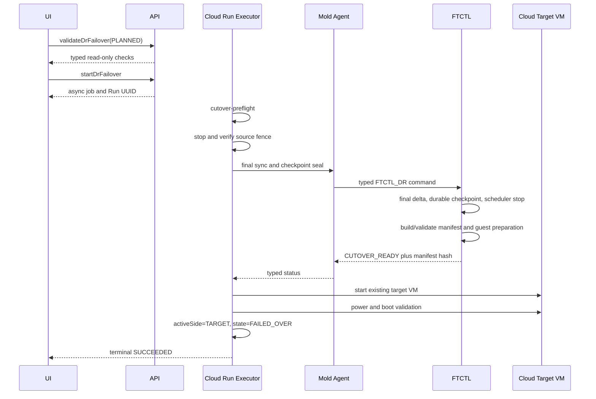

# Cross Hypervisor DR Real Failover Cutover Manifest And Rollback Design

> 2026-08-06 normative terminal-commit correction:
> [599-cross-hypervisor-dr-forward-cutover-commit-contract-and-authority-convergence-design-20260806.md](599-cross-hypervisor-dr-forward-cutover-commit-contract-and-authority-convergence-design-20260806.md)
> requires a typed V2 envelope and forbids Cloud TARGET authority before FTCTL
> ACK. This supersedes any earlier sequence that writes Plan TARGET first.

> 2026-07-27 후속 계약: `CUTOVER_READY` status의 completed-cycle 증거 검증,
> bounded retry, target power-on 전 보상 종료, orphan Cutover Session 정리는
> [577-cross-hypervisor-dr-failover-projection-evidence-and-compensation-design-20260727.md](577-cross-hypervisor-dr-failover-projection-evidence-and-compensation-design-20260727.md)
> 를 따른다.

- Date: 2026-07-22
- Status: implementation design; live read-only preflight verified
- Scope: VMware source to ABLESTACK/KVM real failover
- Related: 521, 522, 554, 562, 563, 564, 565, 566
- FTCTL contract: `ablestack-qemu-exec-tools/docs/ftctl/438-ftctl-dr-real-failover-cutover-manifest-contract-design-20260722.md`
- Reprotect authority addendum: [570-cross-hypervisor-dr-reprotect-canonical-authority-preservation-design-20260723.md](570-cross-hypervisor-dr-reprotect-canonical-authority-preservation-design-20260723.md)

> Normative shared-parser correction (2026-07-28):
> [579-cross-hypervisor-dr-action-intent-guest-identity-and-failed-test-terminal-convergence-design-20260728.md](579-cross-hypervisor-dr-action-intent-guest-identity-and-failed-test-terminal-convergence-design-20260728.md)
> requires Test Failover and real Failover to use the same canonical
> `source_vm()` resolver and manifest validation contract.

## 1. Purpose

This document corrects the real Failover path after Test Failover and Test
Cleanup have already succeeded. The correction is not an error-message-only
change. It establishes one typed cutover manifest, explicit ownership of every
input, a read-only preflight gate, and monotonic Cloud state transitions.

The source VM is never deleted by Failover. In a planned cutover it is stopped
and fenced before the final delta. In a disaster cutover Cloud records an
operator assertion that the source is isolated or unreachable. The existing
Cloud-managed target VM is started only after FTCTL reports `CUTOVER_READY`.

## 2. Verified failure and root cause

The production Failover for Plan
`2514a846-64a2-4bc7-ba88-38a874410782` accepted Run
`31bba4d5-2a66-4281-91e6-c5d343b06e32` asynchronously, but FTCTL failed guest
preparation with `DR_GUEST_OS_UNSUPPORTED`.

| Evidence | Verified value |
|---|---|
| Source VM | VMware `vm-6429`, Windows, powered off |
| Firmware | EFI, Secure Boot enabled |
| Target VM | Cloud VM id 256, stopped, two ready volumes |
| Latest durable checkpoint | cycle 418, `TARGET_READY`, `LOCAL_DURABLE` |
| Requested mode | disaster, no final sync, source-fence skip asserted |
| Generated cutover manifest | empty guest identity, zero disks, file/qcow2 default |
| Actual target storage | two RBD/raw images |
| Cloud terminal result | Plan `ERROR`, active side still `SOURCE` |

The current `ftctl_guestprep_prepare_cutover_target()` reads obsolete paths:

- guest identity from `source.workload.guestId` or `source.guestId`;
- disk locators from `targetPath` or `targetDiskRef`.

The current Plan profile instead stores the source guest under
`mapping.source.vm` and `mapping.source.hardware`. The Plan disk entries carry
display references, while the authoritative runtime target paths are stored in
`dr-runtime/plans/<plan>/ablestack-disks.json`. As a result, the real Failover
builder discarded the Windows, EFI, Secure Boot, and RBD disk facts that were
already available.

Test Failover succeeded because its artifact-based manifest path differs from
the real Failover path. The two paths therefore proved different code, not the
correctness of the current real cutover manifest builder.

Two secondary state defects were also verified:

1. Cloud persisted `last_error_message=OK` instead of the FTCTL failure text.
2. FTCTL status projected `worker_state=RUNNING` after the recorded worker PIDs
   no longer existed.

## 3. Authority and ownership

No component may infer a missing field from a display name.

| Data | Authoritative owner | Allowed use |
|---|---|---|
| Plan mapping | Cloud Plan | source hardware intent and target placement intent |
| Durable checkpoint | FTCTL | immutable replicated data version selected for cutover |
| Runtime target disk map | FTCTL plus Cloud volume binding | actual target provider image for each source disk |
| Cloud VM and volume rows | Cloud | customer resource lifecycle and target power state |
| Agent answer | Agent transport | command acknowledgement and typed engine status only |
| Plan active side | Cloud | service authority after boot validation |

Additional invariants:

1. UI calls only Cloud API and never calls Agent, libvirt, or FTCTL directly.
2. `startDrFailover` remains asynchronous and returns a Run/job immediately.
3. `activeSide=TARGET` is forbidden before target power-on and boot validation.
4. A display reference such as `w22-01-dr-disk-0` is never a provider locator.
5. A durable RBD locator is `rbd:<pool>/<image>`; `/dev/rbd/...` is a transient
   mapped device and is not persisted as storage identity.
6. FTCTL prepares guest data and provider mappings. Cloud starts and validates
   the already defined target VM.
7. A failure before promotion preserves the checkpoint and target data for a
   retry and does not automatically start either side.

## 4. Typed cutover manifest

FTCTL emits and consumes `FTCTL_GUESTPREP_MANIFEST_V2`.

```json
{
  "schemaVersion": "FTCTL_GUESTPREP_MANIFEST_V2",
  "planUuid": "2514a846-64a2-4bc7-ba88-38a874410782",
  "runUuid": "31bba4d5-2a66-4281-91e6-c5d343b06e32",
  "checkpoint": {
    "sequence": 418,
    "state": "TARGET_READY",
    "commitState": "LOCAL_DURABLE",
    "reference": "...cycle-418-vmware-checkpoint.json"
  },
  "source": {
    "guestId": "windows2019srvNext_64Guest",
    "guestFamily": "windows",
    "firmware": "efi",
    "secureBoot": true
  },
  "target": {
    "hypervisor": "KVM",
    "rootDiskController": "scsi",
    "ioPolicy": "io_uring",
    "ioThreads": true
  },
  "disks": [
    {
      "sourceDiskKey": "2000",
      "device": "sda",
      "boot": true,
      "sizeBytes": 42949672960,
      "storage": {
        "type": "rbd",
        "format": "raw",
        "locator": "rbd:rbd/w22-01-dr-disk-0"
      }
    }
  ]
}
```

The manifest SHA-256 is persisted with the Cutover Session. Secrets, session
keys, temporary mapped device names, and raw provider credentials are excluded.

### 4.1 Deterministic input join

The builder receives exactly three input documents:

1. Plan profile for source guest and hardware identity.
2. Selected durable checkpoint for data-version authority.
3. Current target disk map for provider storage identity.

Disks are joined by stable `sourceDiskKey` and verified against `device`.
Duplicate keys, missing disks, extra boot disks, and size mismatches fail the
preflight. Array position and display name are not join keys.

For backward compatibility only, an input `/dev/rbd/<pool>/<image>` may be
normalized to `rbd:<pool>/<image>`. The normalized manifest always emits the
canonical provider locator. File storage requires an absolute path and a
declared format.

## 5. API and asynchronous sequence

### 5.1 Read-only validation API

Add `ValidateDrFailoverCmd` next to `StartDrFailoverCmd`.

```text
validateDrFailover
  id=<plan uuid>
  mode=PLANNED|DISASTER
  checkpointId=<optional durable checkpoint uuid>
  sourceIsolationAcknowledged=<boolean>
```

The command is bounded and read-only. It returns eligibility and typed checks;
it does not create a Run, stop a source, map an RBD image, or prepare a guest.

```json
{
  "eligible": true,
  "checkpoint": {"sequence": 418, "ageSeconds": 124},
  "sourceFence": {"required": true, "state": "ACKNOWLEDGED"},
  "guest": {"family": "windows", "firmware": "efi", "secureBoot": true},
  "target": {"vmState": "Stopped", "diskCount": 2},
  "engine": {"manifestSchema": "FTCTL_GUESTPREP_MANIFEST_V2"},
  "checks": []
}
```

Actual execution remains `startDrFailover` and creates a durable asynchronous
Run. The preflight result is revalidated by the backend at Run execution time;
the UI result is advisory and cannot bypass backend validation.

### 5.2 Planned Failover



### 5.3 Disaster Failover

Disaster mode does not perform final sync by default. It selects the latest
eligible `LOCAL_DURABLE` checkpoint and requires either verified source fencing
or an explicit operator isolation acknowledgement. A boolean
`skipSourceFenceRequest` without recorded reason and evidence is insufficient.

The remaining target preparation and promotion sequence is identical to the
planned path. This keeps guest preparation, target power-on, and authority
promotion deterministic across both modes.

## 6. Layer-level code design

### 6.1 UI

Affected components are the DR Plan action toolbar, Failover modal, Protection
Information tab, and operation history view.

- Call `validateDrFailover` when the Failover modal opens and when mode or
  checkpoint changes.
- Render named checks for checkpoint age, source isolation, guest family,
  firmware, disk count, target VM state, and engine capability.
- In disaster mode require an explicit checkbox and reason for source
  isolation. Do not imply that the source will be deleted.
- Submit `startDrFailover` and close the modal after async acceptance.
- Poll cached Plan/Run projection; do not block the whole UI on Agent or FTCTL.
- Show distinct stages: preflight, source isolation, final sync, guest
  preparation, target start, boot validation, promotion.
- On pre-promotion failure show `Retry failover` and, only when backend
  eligibility permits it, `Abort cutover and resume source protection`.
- Never display `OK` as an error. Missing error text is rendered from the typed
  error code and the raw value is flagged for backend correction.

### 6.2 API

- Add `ValidateDrFailoverCmd` and `DrFailoverValidationResponse`.
- Extend the start request with `sourceIsolationAcknowledged`,
  `sourceIsolationReason`, and optional `checkpointId`.
- Validate mode-specific fields in `StartDrFailoverCmd`, but leave runtime
  eligibility to the orchestrator.
- Preserve asynchronous semantics of `StartDrFailoverCmd`.
- Never return credentials, provider secrets, or host-local mapped paths.

### 6.3 Backend and orchestration

`DrRunExecutorImpl` uses these ordered finite steps:

1. `cutover-preflight`
2. `source-fence-confirmed`
3. `final-sync` or `durable-checkpoint-selected`
4. `guest-preparation`
5. `cutover-ready`
6. `target-power-on`
7. `boot-validation`
8. `promotion`
9. `final`

`FtctlDrUnifiedActionAdapter` sends the selected checkpoint reference and
requires capability `cutover-manifest-v2`. It rejects a legacy engine before
any disruptive action.

`DrTargetMaterializationServiceImpl` must start the existing Cloud target VM,
not create an unmanaged replacement. It runs only after a matching Cutover
Session reaches `CUTOVER_READY` with the expected manifest hash and disk count.

`FtctlDrRuntimeProjectionAdapter` must:

- preserve the exact FTCTL error code and nonblank message;
- treat a reported running worker with dead/missing PID evidence as terminal or
  stale, never as active;
- project `CUTOVER_READY` independently from target VM boot state;
- avoid clearing the latest durable checkpoint on a cutover failure;
- never promote `activeSide` from transient runtime text.

State changes use compare-and-set generation/version checks so a stale Agent
answer cannot overwrite a later terminal Run.

### 6.4 Agent

The Agent remains a transport boundary.

- Advertise `cutover-manifest-v2` and `cutover-preflight-v1` capabilities.
- Accept Plan UUID, Run UUID, checkpoint reference, mode, and isolation token.
- Return typed phase, terminal flag, retryability, error code/message,
  manifest schema/hash, checkpoint sequence, and cleanup requirement.
- Do not parse Cloud placement, manufacture storage locators, or start the
  customer VM.
- A command acknowledgement means accepted, not completed.

### 6.5 FTCTL

Implement the canonical contract described in document 438.

- Add `lib/ftctl/guestprep_manifest.py` for schema-aware JSON normalization and
  validation using structured parsers.
- Replace embedded legacy extraction in `lib/ftctl/guestprep.sh` with:
  - `ftctl_guestprep_build_cutover_manifest`
  - `ftctl_guestprep_validate_manifest`
  - `ftctl_guestprep_prepare_target_devices`
  - `ftctl_guestprep_release_target_devices`
- Select only a `TARGET_READY` and `LOCAL_DURABLE` checkpoint.
- Validate every provider object before guest preparation.
- For RBD, keep `rbd:` in the durable manifest and map it just in time through
  the proven V2K device mapping primitive. Unmap it in a trap/finalizer.
- Reuse V2K guest-preparation primitives without invoking the V2K migration
  workflow or changing the V2K CLI.
- Emit a terminal status file even when setup fails before a worker starts.

Typed FTCTL errors:

| Code | Meaning |
|---|---|
| `DR_CUTOVER_MANIFEST_INVALID` | schema or cross-field validation failed |
| `DR_GUEST_OS_UNRESOLVED` | guest family cannot be derived |
| `DR_TARGET_DISK_MAP_MISSING` | source disk has no target binding |
| `DR_TARGET_DISK_LOCATOR_INVALID` | provider locator is not canonical |
| `DR_TARGET_DISK_NOT_DURABLE` | provider object is absent or unreadable |
| `DR_GUEST_PREP_RUNTIME_UNAVAILABLE` | required tool or ISO is unavailable |
| `DR_GUEST_PREPARATION_FAILED` | guest mutation failed after validation |

### 6.6 Database

Critical cutover gates must be queryable columns, not only free-form JSON.
Add a new schema migration after the current Europa DR migration set:

```sql
ALTER TABLE dr_cutover_session
  ADD COLUMN source_fence_state varchar(32) NULL,
  ADD COLUMN source_power_state varchar(32) NULL,
  ADD COLUMN manifest_schema_version varchar(64) NULL,
  ADD COLUMN manifest_sha256 varchar(64) NULL,
  ADD COLUMN target_disk_count int unsigned NULL,
  ADD COLUMN scheduler_recovery_state varchar(32) NULL;
```

Persist the selected checkpoint UUID/sequence in the existing Cutover Session
fields and put non-gating diagnostics in `details_json`. Add an index on Plan,
active state, and creation time if not already covered.

The migration is additive and nullable for existing rows. DAO update methods
must use state/version predicates. No API key, secret key, vCenter password,
RBD key, session key, or transient `/dev/rbd` path is stored.

## 7. Failure and rollback contract

Before `promotion`, any failure performs the following:

1. Mark the finite Run and Cutover Session `ERROR` with the exact typed error.
2. Stop and remove only helper domains created for guest preparation.
3. Unmap only devices mapped by this Run.
4. Preserve the selected checkpoint and target data.
5. Keep the Cloud target VM stopped unless it was started by this Run, in which
   case stop it after boot-validation failure.
6. Keep `activeSide=SOURCE`; do not claim service is active.
7. Do not auto-start the source.
8. Resume the scheduler only through a Cloud-authorized recovery action after
   confirming the source is still authoritative and safe to run.

After successful target boot validation, `promotion` is the commit point.
Post-commit failures require failback/reprotect handling rather than local
cutover rollback.

## 8. Preflight verification performed

The following read-only preflight was performed against the current Plan and
target provider objects on `10.10.32.2`.

| Check | Result |
|---|---|
| Profile guest path normalization | PASS: Windows guest ID resolved |
| Firmware and Secure Boot | PASS: EFI and Secure Boot resolved |
| Durable checkpoint | PASS: cycle 418, target ready, locally durable |
| Runtime target disk join | PASS: two source disks joined |
| Locator normalization | PASS: `/dev/rbd/...` converted to canonical `rbd:` |
| RBD provider existence | PASS: both images readable by `rbd info` |
| Guest family detection | PASS: `windows` |
| WinPE asset | PASS: readable |
| VirtIO ISO asset | PASS: readable |
| Temporary preflight cleanup | PASS: no runtime mutation retained |

Actual WinPE injection was intentionally not executed during design because it
mutates target data. It becomes an implementation/retest gate after the typed
manifest and map/unmap lifecycle are deployed.

## 9. Tests and acceptance criteria

### 9.1 FTCTL tests

- Build V2 manifest from the exact current profile shape.
- Reject zero disks, duplicate disk keys, missing boot disk, unknown guest, and
  display-only locators.
- Normalize legacy `/dev/rbd` input but emit only `rbd:`.
- Verify RBD map/unmap cleanup on success, signal, and failure.
- Verify Windows and Linux guest preparation paths independently.

### 9.2 Cloud tests

- `DrRunExecutorImplTest`: step order, no promotion before boot validation,
  planned/disaster branch, and rollback behavior.
- `FtctlDrUnifiedActionAdapterTest`: capability and checkpoint contract.
- `FtctlDrRuntimeProjectionAdapterTest`: dead worker correction and exact error
  preservation; blank/`OK` fallback is forbidden.
- `DrTargetMaterializationServiceImplTest`: existing target VM ownership,
  idempotent start, and boot-validation failure cleanup.
- API tests for validation/start separation and isolation acknowledgement.
- UI tests for asynchronous acceptance, modal checks, and state-gated actions.

### 9.3 End-to-end PASS

PASS requires all of the following:

1. Preflight identifies Windows, EFI, Secure Boot, two RBD/raw disks.
2. Source is stopped/fenced or disaster isolation is explicitly recorded.
3. FTCTL reports `CUTOVER_READY` for the selected durable checkpoint.
4. Cloud starts the existing target VM and validates boot.
5. Target firmware remains EFI/Secure Boot and its two Cloud volumes are used.
6. Plan becomes `FAILED_OVER`, `activeSide=TARGET`, Run `SUCCEEDED`.
7. No source VM deletion occurs.
8. Failure injection at every pre-promotion step leaves `activeSide=SOURCE`,
   target stopped, exact error visible, and a retryable checkpoint preserved.

## 10. Recommended implementation order

1. Implement and self-test the FTCTL V2 manifest normalizer.
2. Add provider validation and bounded read-only cutover preflight.
3. Add RBD map/unmap ownership and terminal failure cleanup.
4. Add Agent capability and typed status fields.
5. Add the additive DB migration and DAO compare-and-set updates.
6. Add backend preflight gates, finite steps, and rollback rules.
7. Gate Cloud target start on `CUTOVER_READY` and validate boot.
8. Add UI preflight presentation and recovery actions.
9. Build changed Cloud modules and qemu artifacts, deploy together, clean stale
   failed-session state, and retest planned then disaster Failover.

## 11. AS-IS / TO-BE

| Area | AS-IS | TO-BE |
|---|---|---|
| Guest identity | obsolete JSON paths produce empty guest ID | schema-aware lookup resolves the authoritative Plan fields |
| Disk identity | display reference or transient `/dev/rbd` path | stable source-disk join and canonical `rbd:` provider locator |
| Checkpoint | implicit latest runtime state | explicitly selected target-ready, locally durable checkpoint |
| Preflight | failure appears after disruptive cutover starts | bounded read-only API plus backend revalidation |
| RBD access | mapped path may be assumed to exist | validate provider, map just in time, unmap by Run ownership |
| Target VM | preparation and VM lifecycle boundaries are blurred | FTCTL prepares data; Cloud starts the existing target VM |
| Promotion | runtime text may affect Plan state | only Cloud boot validation commits `activeSide=TARGET` |
| Source handling | skip-fence boolean lacks durable evidence | planned fence verification or explicit disaster isolation record |
| Failure state | `OK` message and stale running worker can survive | exact typed error and PID-aware terminal correction |
| Rollback | partial cleanup and ambiguous scheduler recovery | preserve data, clean helpers, keep SOURCE authority, explicit recovery |
| DB | critical gates hidden in JSON | queryable manifest/fence/recovery columns plus diagnostic JSON |
| UI | action result and engine internals are difficult to distinguish | asynchronous finite stages, clear preflight, retry/abort recovery actions |

## 12. Implementation and verification record (2026-07-22)

### 12.1 Implemented contract

- Agent status projection carries manifest schema, SHA-256, and the selected
  guest-preparation checkpoint sequence.
- Backend `CUTOVER_READY` requires the V2 manifest, a valid SHA-256, an exact
  durable-checkpoint match, and at least one validated target disk.
- Disaster failover requires an explicit source-isolation acknowledgement and
  reason in both the API command and backend adapter.
- Cutover session persistence records source fence/power state, manifest
  identity, target disk count, and scheduler recovery state.
- Success projection ignores placeholder messages such as `OK` and persists a
  typed error only when an error code is present.
- The UI keeps the action asynchronous and collects the disaster isolation
  acknowledgement without exposing engine-side synchronous waits.

### 12.2 Build and test evidence

| Scope | Result |
|---|---|
| Changed Cloud Maven modules | PASS, WSL ext4 build |
| KVM FTCTL wrapper tests | PASS, 13 tests |
| DR materialization/projection/action tests | PASS, 22 tests |
| Cloud UI production build | PASS, size warnings only |
| DR protection state UI unit tests | PASS, 3 tests |
| UI bundle contract markers | PASS, isolation acknowledgement/reason present |
| FTCTL GitHub Actions RPM job | PASS, run `29891374059` |
| FTCTL RPM | `ablestack_vm_ftctl-0.9.1-1.noarch.rpm` |
| FTCTL RPM SHA-256 | `2cb386ec636015d592df21224ff40d22102ad2900e6b7e40fc72ac6df5f21bfe` |

### 12.3 Deployment and live verification

The environment gate was cleared after the `10.10.32.*` hosts were restored.
Deployment and live verification completed as follows:

| Scope | Result |
|---|---|
| Management changed classes | PASS, monolithic management JAR updated and `mold` active |
| Cloud UI | PASS, active webapp updated, `WEB-INF` preserved, `/client/` HTTP 200 |
| Agent changed classes | PASS on `10.10.32.1/2/3`, `mold-agent` active |
| FTCTL package | PASS on `10.10.32.1/2/3`, `ablestack_vm_ftctl-0.9.1-1.noarch` |
| FTCTL timer | PASS on `10.10.32.1/2/3` |
| DB migration | PASS, six cutover manifest/fence/recovery columns present |
| Live V2 manifest build/validate | PASS, checkpoint 418, two RBD disks, Windows EFI/Secure Boot |
| RBD size/provider validation | PASS, 100 GiB and 50 GiB target images match the manifest |
| Recovery sync | PASS, cycle 419 full reseed followed by cycle 420 CBT incremental |
| Cloud runtime projection | PASS, `READY`, `WITHIN_RPO`, scheduler `RUNNING/HEALTHY` |
| Failed cutover cleanup | PASS, failed Run retained for audit and active session soft-deleted |

The verified Plan `2514a846-64a2-4bc7-ba88-38a874410782` is ready for retest.
Its latest completed checkpoint sequence is 420, the baseline is
`LOCAL_DURABLE`, and normal/test failover eligibility is enabled.

## 13. Post-failover authority commit and action-gate design

### 13.1 Live finding and root cause

The planned failover Run `44533a29-b03e-4423-8c8c-9ac8bbad7ed1` completed
functionally: checkpoint 439 was selected, FTCTL produced a valid V2 manifest,
the VMware source VM was powered off, and Cloud started the existing target VM
with Secure Boot, `io_uring`, I/O threads, and both RBD disks. Cloud persisted
the Plan as `FAILED_OVER` with `activeSide=TARGET` and the Run as `SUCCEEDED`.

The live read model nevertheless exposed these inconsistencies:

- FTCTL remained at `CUTOVER_READY`, `active_side=SOURCE`, and
  `target_power_state=POWERED_OFF` because its responsibility ended before the
  Cloud-owned target power-on.
- `dr_cutover_session` also remained `CUTOVER_READY`; target power-on, boot
  validation, promotion, and final completion were not durably recorded.
- `dr_run_step` ended at `runtime-projection` and did not contain the Cloud
  lifecycle stages described by this document.
- `getActionEligibility()` returned `sync=true` while the Plan was
  `FAILED_OVER/TARGET` because the sync gate did not require SOURCE authority.
- The protection view rendered the stopped forward scheduler as generic
  `DEGRADED`, even though a stopped forward scheduler is expected after a
  completed cutover and before reverse protection is established.

The code-level causes are:

1. `DrTargetMaterializationService.ensureTargetPoweredOn()` returns only a
   boolean, discarding target identity, observed power state, validation mode,
   validation result, and timestamps.
2. `FtctlDrRuntimeProjectionAdapter.upsertCutoverSession()` runs before the
   Cloud target power-on and writes only the raw FTCTL state.
3. `isRunSatisfiedByRuntime()` accepts a nonblank `failover_session_id` as
   sufficient success evidence instead of requiring Cloud promotion evidence.
4. `DrPlanServiceImpl.getActionEligibility()` does not gate forward sync,
   pause, and resume by `activeSide=SOURCE` and a non-failed-over Plan state.
5. There is no idempotent Cloud-to-FTCTL acknowledgement after Cloud commits
   target activation.

### 13.2 Split authority state machine

FTCTL remains authoritative only for the data-plane preparation boundary:

```text
SYNCED -> QUIESCING -> CHECKPOINT_LOCKED -> GUEST_PREPARING -> CUTOVER_READY
```

Cloud is authoritative for the VM lifecycle and service-side promotion:

```text
CUTOVER_READY
  -> TARGET_POWERING_ON
  -> BOOT_VALIDATING
  -> PROMOTED_PENDING_ENGINE_ACK
  -> FAILED_OVER
```

The Plan is not promoted before the existing target VM is observed Running and
the configured validation policy succeeds. FTCTL never starts or stops the
Cloud-managed target VM. After Cloud commits target authority, it sends an
idempotent `dr-cutover-commit` acknowledgement through the Agent. This command
mirrors the Cloud decision into FTCTL runtime state but does not grant FTCTL VM
lifecycle ownership.

If Cloud crashes after target power-on, reconciliation observes the same target
VM and resumes at `BOOT_VALIDATING`. If it crashes after the DB commit but before
the Agent acknowledgement, the Plan remains correctly `FAILED_OVER/TARGET` and
the reconciler retries only the acknowledgement.

### 13.3 Cloud backend changes

#### `DrTargetMaterializationService`

Replace the boolean contract with a result object:

```java
DrTargetPowerOnResult ensureTargetPoweredOn(long planId, long runId,
        String validationMode, int timeoutSeconds);
```

`DrTargetPowerOnResult` contains:

- `targetVmId`, `targetVmUuid`, `instanceName`, and `hostId`;
- `powerState`, `powerOnRequestedAt`, and `powerOnObservedAt`;
- `validationMode`, `validationState`, `validatedAt`, and warning/error fields;
- `alreadyRunning` for idempotent replay.

`POWER_STATE_ONLY` succeeds only after a fresh DAO read reports `Running`.
`QGA` and application-aware modes must not silently fall back when the guest
agent is unavailable. They remain pending until timeout and then return a typed
failure.

#### `FtctlDrRuntimeProjectionAdapter`

Refactor `updatePlanFromStatus()` into these explicit methods:

```java
projectEnginePreparation(...);
advanceCloudCutover(...);
persistCloudPromotion(...);
dispatchCutoverCommitAck(...);
completeFailoverRunAfterAck(...);
```

Required ordering:

1. Upsert FTCTL preparation evidence and validate manifest/checkpoint/disk count.
2. Record `target-power-on` as RUNNING and call the target service.
3. Record `target-power-on` and `boot-validation` as SUCCEEDED.
4. In one DB transaction, set the Cutover Session to
   `PROMOTED_PENDING_ENGINE_ACK`, Plan to `FAILED_OVER/TARGET`, Replica to
   `FAILED_OVER/POWERED_ON/TARGET`, and preserve the selected checkpoint.
5. Send `dr-cutover-commit` asynchronously through the Agent.
6. After matching acknowledgement, set the session to `COMPLETED`, record
   `promotion` and `final`, and then mark the Failover Run `SUCCEEDED`.

`isRunSatisfiedByRuntime()` must delete the
`failover_session_id != blank` shortcut. Failover success requires all of:

```text
plan.state == FAILED_OVER
plan.activeSide == TARGET
cutoverSession.cloudPromotionState == PROMOTED
cutoverSession.bootValidationState == SUCCEEDED
cutoverSession.engineAckState == ACKNOWLEDGED
target VM observed state == Running
```

An acknowledgement timeout leaves the Plan correctly promoted but the Run in
`RUNNING` at `engine-state-reconciliation`; it must not roll back a running
target automatically.

#### `DrPlanServiceImpl`

Apply the same transition predicate in the API and backend execution path:

```java
boolean sourceAuthority = "SOURCE".equalsIgnoreCase(plan.getActiveSide());
boolean targetAuthority = "TARGET".equalsIgnoreCase(plan.getActiveSide());
boolean failedOver = PLAN_STATE_FAILED_OVER.equals(plan.getState());

sync       = enabled && sourceAuthority && !failedOver && executionReady;
pauseSync  = enabled && sourceAuthority && !failedOver && syncPausable;
resumeSync = enabled && sourceAuthority && !failedOver && syncPaused;
failover   = enabled && sourceAuthority && !failedOver && normalCutoverReady;
test       = enabled && sourceAuthority && !failedOver && normalCutoverReady;
failback   = enabled && targetAuthority && failedOver && sourceRecoveryReady;
reprotect  = enabled && targetAuthority && failedOver && reverseTargetReady;
```

Command handlers repeat these checks server-side so stale UI data cannot start
a forward sync after target promotion.

### 13.4 API contract

Add these fields to `DrPlanResponse` and `DrProtectionViewResponse`:

- `operatingSide`: `SOURCE` or `TARGET`;
- `protectionPhase`: `FORWARD_PROTECTED`, `CUTOVER_IN_PROGRESS`,
  `FAILED_OVER_UNPROTECTED`, or `REVERSE_PROTECTED`;
- `cutoverSessionState`, `cloudPromotionState`, and `engineAckState`;
- `targetPowerState`, `bootValidationMode`, and `bootValidationState`;
- `cutoverCheckpointSequence`, `cutoverRpoSeconds`, and `actualRtoSeconds`;
- `nextRecommendedAction` and `actionBlockingReasons`.

`effectiveState` must remain `FAILED_OVER` after a successful cutover. A stopped
forward scheduler is represented by `FAILED_OVER_UNPROTECTED`, not by replacing
the Plan state with generic `DEGRADED`. RPO age is frozen at the selected
cutover checkpoint until reverse protection begins.

All mutation APIs remain asynchronous. `startDrFailover` returns a job/Run ID;
the UI observes state through cached protection-view reads and does not wait for
Agent or FTCTL completion in the request thread.

### 13.5 Agent and FTCTL acknowledgement

Add `CUTOVER_COMMIT("dr-cutover-commit")` to `FtctlDrActionCommand.Action` and
advertise `cloud-cutover-commit-v1` in the capability response. The KVM wrapper
passes only non-secret authority evidence:

```text
--plan, --run, --checkpoint-sequence, --manifest-sha256
--cloud-authority-generation, --active-side TARGET
--target-power-state POWERED_ON
--boot-validation-state SUCCEEDED
--target-power-on-at, --failover-completed-at
```

FTCTL validates that Plan UUID, Run UUID, checkpoint sequence, and manifest hash
match the existing failover session. It then atomically writes:

```text
state=FAILED_OVER_ACKNOWLEDGED
step=cloud-promotion-acknowledged
active_side=TARGET
target_power_state=POWERED_ON
target_promotion_state=PROMOTED
boot_validation_state=SUCCEEDED
scheduler_recovery_state=STOPPED_AFTER_CUTOVER
```

The command is idempotent for an equal-or-newer Cloud authority generation and
rejects mismatched or older generations with a typed, retry-safe error. It does
not call libvirt or Cloud APIs.

### 13.6 DB persistence

Extend `dr_cutover_session` with queryable Cloud-finalization columns:

```sql
cloud_promotion_state       varchar(32),
target_power_state          varchar(32),
target_power_on_at          datetime,
boot_validated_at           datetime,
engine_ack_state            varchar(32),
engine_ack_at               datetime,
cloud_authority_generation  bigint unsigned NOT NULL DEFAULT 0,
completed_at                datetime
```

Use the existing `boot_validation_state` and `source_power_state` columns.
`details_json` remains diagnostic only. Add the columns to both
`setup/db/create-schema.sql` and the active upgrade SQL using
`information_schema.columns` guards because the deployed MySQL version does not
support `ADD COLUMN IF NOT EXISTS` consistently.

No new table is required for UI phases. Persist `target-power-on`,
`boot-validation`, `promotion`, `engine-state-reconciliation`, and `final` in
the existing `dr_run_step` table with stable step orders 40 through 80.

### 13.7 UI changes

Update `resourceActions.js` with defense-in-depth gating: hide or disable
forward sync, pause/resume, test failover, and failover when
`operatingSide=TARGET` or state is `FAILED_OVER`, even if a stale server response
incorrectly enables them.

`DrProtectionInfoTab.vue` and `DrRunProgress.vue` display:

- `대상 사이트 운영 중` for `FAILED_OVER/TARGET`;
- `역방향 보호 미구성` for `FAILED_OVER_UNPROTECTED`;
- Cloud-owned target power-on and boot-validation stages separately from the
  FTCTL `CUTOVER_READY` stage;
- `전원 상태만 확인` as a warning when QGA/application validation was not
  requested, instead of implying guest-service validation.

The UI must not merge `CUTOVER_READY` and `FAILED_OVER`: the former means data
and guest preparation are ready, while the latter means Cloud has started and
validated the target and committed authority.

### 13.8 Verification matrix

Automated tests must cover:

1. `FAILED_OVER/TARGET` returns `sync=false`, `pauseSync=false`, and
   `resumeSync=false` from both API eligibility and command validation.
2. A `failover_session_id` without a valid V2 manifest or Cloud promotion never
   completes a Run.
3. A stopped/failed target VM leaves Plan authority on SOURCE.
4. `POWER_STATE_ONLY` records an explicit successful validation result.
5. QGA mode fails with a typed timeout when the guest agent is unavailable.
6. Crash replay at every boundary is idempotent and never starts a second VM.
7. Agent acknowledgement mismatch does not overwrite a newer generation.
8. Run steps include all five Cloud finalization phases and the final Run is
   completed only after acknowledgement.
9. UI status and actions match the server truth table in dark and light modes.

The current live Plan provides read-only preflight evidence for these tests:
Plan `FAILED_OVER/TARGET`, source `poweredOff`, target `Running`, checkpoint
439, V2 manifest with two disks, Cloud Run `SUCCEEDED`, FTCTL
`CUTOVER_READY/SOURCE`, and API `sync=true`.

### 13.9 Recommended implementation order

1. Add DB columns and VO/response fields.
2. Implement the shared server-side transition predicate and close unsafe
   action gates.
3. Introduce `DrTargetPowerOnResult` and durable Cloud finalization stages.
4. Correct Failover Run completion predicates and persist Run steps.
5. Add Agent `CUTOVER_COMMIT` transport and KVM wrapper arguments.
6. Implement idempotent FTCTL `dr-cutover-commit` and capability negotiation.
7. Add backend retry/reconciliation for pending acknowledgements.
8. Update cached protection-view projection and post-failover state vocabulary.
9. Update UI action defense, labels, and progress rendering.
10. Run module tests, UI build, FTCTL GitHub Actions package build, deploy, and
    repeat planned failover from a clean/reprotected Plan.

### 13.10 AS-IS / TO-BE

| Area | AS-IS | TO-BE |
|---|---|---|
| Failover completion | Cloud Run ends with only `runtime-projection` | target power, validation, promotion, acknowledgement, and final are durable stages |
| Cutover Session | remains `CUTOVER_READY` after target boot | progresses through Cloud promotion to `COMPLETED` |
| FTCTL state | remains SOURCE/POWERED_OFF after Cloud promotion | mirrors Cloud decision through idempotent acknowledgement |
| VM ownership | Cloud starts target, but result is a boolean | Cloud returns and persists typed power/validation evidence |
| Plan authority | correctly becomes TARGET | remains Cloud-owned and is generation protected |
| Forward sync gate | enabled even after failover | forbidden unless SOURCE owns a non-failed-over Plan |
| Protection status | generic `DEGRADED` | explicit `FAILED_OVER_UNPROTECTED` until reprotect |
| RPO display | age can continue after cutover | freezes cutover RPO; reverse RPO starts with reprotect |
| Boot validation | Running state is implicit | policy and result are explicit; QGA never silently falls back |
| Recovery after crash | inferred from mixed runtime text | resumable DB phases plus idempotent Agent acknowledgement |

## 14. Reprotect Authority Preservation Addendum (2026-07-23)

Post-failover authority is durable only when a subsequent asynchronous
Reprotect or Failback Run cannot erase it. Reprotect must receive the committed
Cloud generation, cutover session, checkpoint, and target identity as one
immutable authority specification.

The detailed cross-layer contract is
[570-cross-hypervisor-dr-reprotect-canonical-authority-preservation-design-20260723.md](570-cross-hypervisor-dr-reprotect-canonical-authority-preservation-design-20260723.md).
It supersedes any sequence that lets a finite Run read active-side eligibility
from mutable FTCTL `status.state`.

Cloud must additionally verify the target VM through
`CheckVirtualMachineCommand` before dispatch. `UserVmVO.State.Running` alone is
not sufficient. A non-destructive Reprotect failure remains a Run-local error:
Plan authority stays `FAILED_OVER/TARGET`, the replica remains serving, and the
protection phase remains `FAILED_OVER_UNPROTECTED` until a durable reverse seed
completes.

## 2026-07-30 Post-Failover Runtime Convergence Addendum

A successful Cloud cutover acknowledgement is followed by one atomic database
commit for Plan, Runtime, Cutover Session, Replica, and Cutover Disk audit
state. TARGET authority uses `scheduler desired STOPPED` and freezes the
displayed RPO at the selected cutover checkpoint. The detailed successor
contract is document
[581-cross-hypervisor-dr-post-failover-runtime-ui-convergence-design-20260730.md](581-cross-hypervisor-dr-post-failover-runtime-ui-convergence-design-20260730.md).
