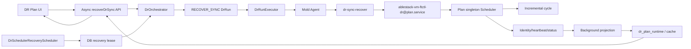
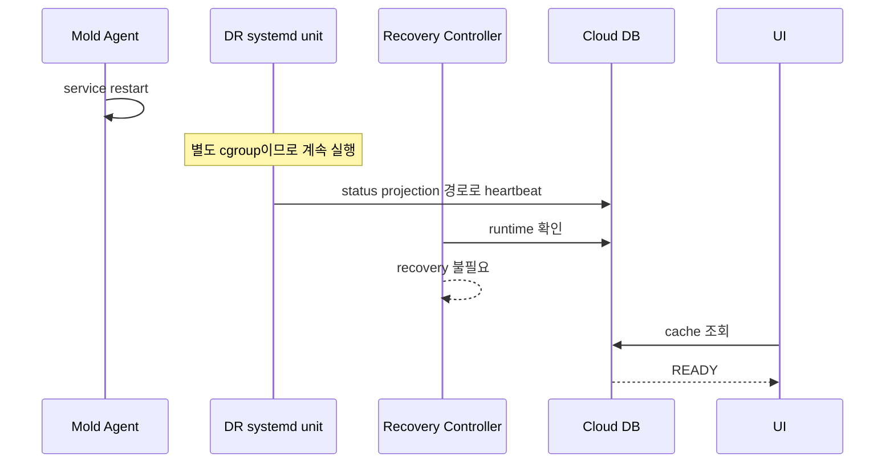
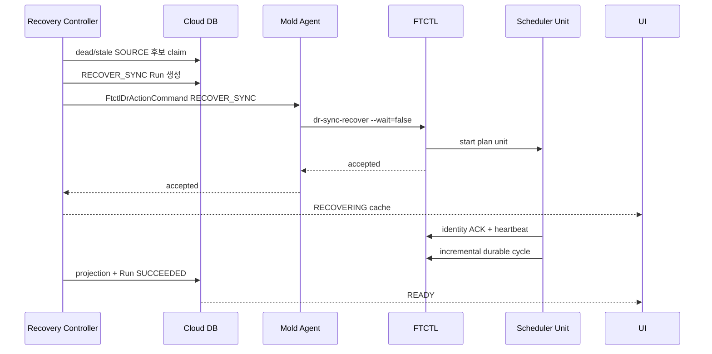

# Cross-Hypervisor DR Scheduler Service And Automatic Recovery Design

- 문서 번호: 568
- 작성일: 2026-07-22
- 상태: 실환경 Preflight 검증 완료, 구현 전 상세 설계
- 적용 범위: Cloud UI, Cloud API, DR Backend, Mold Agent, FTCTL, Cloud DB
- FTCTL 부속 문서:
  - `ablestack-qemu-exec-tools/docs/ftctl/439-ftctl-dr-systemd-owned-scheduler-and-recovery-design-20260722.md`
- 관련 문서:
  - [521-cross-hypervisor-dr-full-stack-implementation-design-20260701.md](521-cross-hypervisor-dr-full-stack-implementation-design-20260701.md)
  - [522-cross-hypervisor-dr-protection-failover-failback-sequence-design-20260701.md](522-cross-hypervisor-dr-protection-failover-failback-sequence-design-20260701.md)
  - [552-cross-hypervisor-dr-async-read-consistency-and-live-cache-ui-design-20260714.md](552-cross-hypervisor-dr-async-read-consistency-and-live-cache-ui-design-20260714.md)
  - [553-cross-hypervisor-dr-continuous-sync-control-and-quiesce-lock-design-20260714.md](553-cross-hypervisor-dr-continuous-sync-control-and-quiesce-lock-design-20260714.md)
  - [564-cross-hypervisor-dr-plan-scheduler-singleton-authority-design-20260720.md](564-cross-hypervisor-dr-plan-scheduler-singleton-authority-design-20260720.md)
  - [566-cross-hypervisor-dr-current-protection-activity-and-operation-history-projection-design-20260721.md](566-cross-hypervisor-dr-current-protection-activity-and-operation-history-projection-design-20260721.md)
  - [569-cross-hypervisor-dr-nbd-deterministic-drain-and-cycle-observability-design-20260723.md](569-cross-hypervisor-dr-nbd-deterministic-drain-and-cycle-observability-design-20260723.md)
  - [570-cross-hypervisor-dr-reprotect-canonical-authority-preservation-design-20260723.md](570-cross-hypervisor-dr-reprotect-canonical-authority-preservation-design-20260723.md)
  - [613-cross-hypervisor-dr-source-site-outage-automatic-recovery-design-20260821.md](613-cross-hypervisor-dr-source-site-outage-automatic-recovery-design-20260821.md)

> 2026-08-21 보강: 원본 사이트 전체 단절과 복구는 문서 613의 연속 헬스
> gate, 비동기 RECOVER_SYNC, 기존 durable baseline 보존 계약을 우선 적용한다.

## 1. 목적

지속 복제 Scheduler를 Mold Agent 프로세스의 자식으로 실행하는 현재 구조에서는
Agent 재시작과 배포가 정상 DR Scheduler까지 종료시킨다. `nohup`과 PPID 1은
systemd cgroup 분리를 보장하지 않으므로 이 문제를 해결하지 못한다.

이 설계의 목표는 다음과 같다.

1. 지속 Scheduler의 프로세스 소유권을 Mold Agent에서 전용 systemd service로 분리한다.
2. Agent 재시작에는 Scheduler가 중단되지 않게 한다.
3. 호스트 재부팅이나 실제 worker 사망은 Cloud가 비동기 복구한다.
4. 복구는 기존 durable baseline을 우선 보존하며 무조건 Full Reseed하지 않는다.
5. UI/API/DB는 자동 복구, 수동 복구, 페일오버 후 정지 상태를 구분한다.
6. 조회 요청은 상태를 변경하지 않고, 별도 Backend controller만 자동 복구를 수행한다.
7. TARGET 권한 또는 `FAILED_OVER_UNPROTECTED` 계획은 forward Scheduler를 복구하지 않는다.

## 2. 실환경 장애와 Preflight 결과

### 2.1 장애 대상

| 계획 | Plan UUID | 장애 호스트 | 장애 전 결과 |
|---|---|---|---|
| Rocky10-1 DR Plan | `c952cae5-11db-4e2a-807d-5ae1d3f9634d` | `10.10.32.1` | Scheduler DEAD, RPO OVERDUE |
| Ubuntu DR Plan | `daf0ab48-fd83-48d4-8729-9bd2918fbb43` | `10.10.32.3` | Scheduler DEAD, RPO OVERDUE |
| w22-01 DR Plan | `2514a846-64a2-4bc7-ba88-38a874410782` | `10.10.32.2` | `FAILED_OVER`, TARGET 권한 |

Rocky와 Ubuntu의 runtime 파일에는 `RUNNING`이 남았지만 PID는 존재하지 않았다.
Windows 계획은 장애가 아니라 실제 페일오버 완료 상태이므로 일반 forward sync가
비활성화되는 것이 정상이다.

### 2.2 systemd 소유권 증거

Agent 재시작 시각은 Scheduler heartbeat 종료 시각과 일치했다.

```text
10.10.32.1 mold-agent ActiveEnterTimestamp = 2026-07-22 17:52:44 KST
10.10.32.3 mold-agent ActiveEnterTimestamp = 2026-07-22 17:52:54 KST
mold-agent KillMode = control-group
```

Cloud API로 수동 복구한 뒤 Scheduler의 PPID는 1이지만 cgroup은 다음과 같았다.

```text
Rocky PID 4154207  -> /system.slice/mold-agent.service
Ubuntu PID 1914350 -> /system.slice/mold-agent.service
```

따라서 `nohup`, background subshell, orphan adoption은 Agent 재시작 내구성을
제공하지 않는다.

### 2.3 독립 systemd unit 가능성 검증

두 호스트에서 비파괴 transient unit을 생성해 cgroup 분리를 검증했다.

```text
systemd-run --unit=ftctl-dr-preflight-<epoch> \
  --collect --property=Type=exec /bin/sleep 8

ControlGroup=/system.slice/ftctl-dr-preflight-<epoch>.service
ActiveState=active
SubState=running
```

검증 unit은 확인 직후 중지했다. 실제 Scheduler를 중단하거나 Agent를 재시작하지
않았다.

### 2.4 현재 수동 복구 결과

Cloud 비동기 `startDrSync`로 복구했으며 다음 결과를 확인했다.

| 계획 | 복구 Run | 첫 복구 Cycle | 후속 Cycle |
|---|---|---|---|
| Rocky | `718481b6-366f-4519-a343-5870a3e338d0` | #483 Full Reseed, `OPERATOR_REQUESTED` | #484 incremental |
| Ubuntu | `6aa2461b-f345-4d20-989a-a01a342ee270` | #21 Full Reseed, `MISSING_OR_INVALID_COMMITTED_BASELINE` | #22 incremental |

두 계획은 최종적으로 `READY / WITHIN_RPO / CONSISTENT`가 됐다. 그러나 Scheduler
복구에 `startDrSync`를 사용하면 불필요한 Full Reseed가 발생할 수 있으므로 이는
정상 복구 API가 아니라 임시 운영 복구였다.

## 3. 오류 원인

### 3.1 Agent 자식 cgroup에 남는 장기 프로세스

현재 실행 경로는 다음과 같다.

```text
Cloud Backend
  -> FtctlDrActionCommand
  -> Mold Agent Script.execute()
  -> ablestack_vm_ftctl dr-sync-start --wait=false
  -> ftctl_dr_runtime_start_background_worker()
  -> nohup ablestack_vm_ftctl ... --wait=true
  -> ftctl_dr_scheduler_start()
  -> background Scheduler loop
```

`lib/ftctl/dr_runtime.sh`와 `lib/ftctl/dr_scheduler.sh`의 background worker는
프로세스 부모만 분리한다. systemd cgroup은 상속되므로 `systemctl restart
mold-agent`가 worker와 Scheduler를 모두 종료한다.

### 3.2 자동 DR reconcile 구현 부재

문서 436/564에는 dead owner 자동 복구가 설계되어 있지만 현재 `reconcile` 명령은
기존 FT/HA profile을 중심으로 동작하며 DR Plan profile을 스캔해 Scheduler를
재기동하는 구현 경로가 없다. FTCTL timer가 active여도 DR Scheduler는 복구되지
않는다.

### 3.3 API 동작 의미 혼합

현재 `DrPlanServiceImpl.getActionEligibility()`는 dead Scheduler 계획에도 `sync`를
허용할 수 있고 `resumeSync`는 Plan state가 `PAUSED`일 때만 허용한다. 따라서
운영자는 `startDrSync`를 복구 명령으로 사용하게 된다.

하지만 `startDrSync`는 초기 복제 또는 운영자 재시드 의미를 가지며 기존 baseline
복구와 의미가 다르다. 복구 전용 동작과 audit Run이 필요하다.

### 3.4 상태 표시 의미 혼합

`DEAD`, `HEARTBEAT_STALE`, `FAILED_OVER_UNPROTECTED`가 모두 단순 `DEGRADED`로
표시되면 사용자는 다음 행동을 구분할 수 없다.

- source Scheduler 복구
- RPO 초과 조사
- failback 또는 reprotect
- 수동 pause 해제

## 4. 설계 불변식

1. `one Plan = one scheduler session = one systemd main process`를 보장한다.
2. Scheduler process cgroup은 `mold-agent.service`와 달라야 한다.
3. Agent는 명령 전달자이며 장기 Scheduler의 프로세스 부모가 아니다.
4. Cloud가 desired state와 active side의 최종 권한을 가진다.
5. FTCTL local reconcile은 이미 전달된 Cloud desired-state fence 안에서만 재기동한다.
6. `SOURCE + ENABLED + desired RUNNING` 계획만 자동 복구할 수 있다.
7. `TARGET`, `FAILED_OVER`, `PAUSED`, active transition 계획은 자동 복구하지 않는다.
8. durable baseline이 유효하면 복구 첫 Cycle은 incremental을 우선한다.
9. baseline 검증 실패 시에만 명시적 자동 Full Reseed로 전환한다.
10. recovery Run 성공은 process start가 아니라 identity ACK, heartbeat, durable Cycle
    완료로 판단한다.
11. UI 조회와 `getDrProtectionView`는 상태를 변경하지 않는다.
12. 모든 자동·수동 복구는 `dr_run`과 `dr_event`에 남긴다.

## 5. 목표 아키텍처



## 6. UI 상세 설계

### 6.1 작업 메뉴

`ui/src/utils/dr/resourceActions.js`와
`ui/src/components/dr/DrActionToolbar.vue`에 `recoversync` 작업을 추가한다.

```js
{
  key: 'recoversync',
  api: 'recoverDrSync',
  command: 'recoverDrSync',
  icon: 'reload-outlined',
  label: 'label.dr.action.recover.sync'
}
```

활성 조건은 Backend `actioneligibility.recoverSync`만 사용한다. UI가 PID, RPO,
active side를 다시 계산해 권한을 확장하지 않는다.

### 6.2 상태 표현

`ui/src/utils/dr/planState.js`는 다음 표시 모델을 사용한다.

| Backend 상태 | 사용자 표시 | 주 작업 |
|---|---|---|
| `RECOVERY_PENDING` | 동기화 복구 대기 | 자동 복구 대기/수동 복구 |
| `RECOVERING` | 동기화 복구 중 | 실행 이력 조회 |
| `RECOVERY_FAILED` | 동기화 복구 실패 | 수동 복구/원인 확인 |
| `FAILED_OVER_UNPROTECTED` | 페일오버 완료, 재보호 필요 | Failback/Reprotect |
| `HEARTBEAT_STALE` | 동기화 상태 확인 중 | 잠시 대기 |
| `DEAD` | 동기화 스케줄러 중단 | Recover Sync |

TARGET 권한 계획에는 forward `sync`, `pauseSync`, `resumeSync`, `recoverSync`를
숨기고 failback/reprotect만 표시한다.

### 6.3 자동 갱신

목록과 상세는 기존 cache polling을 유지한다. 다음 필드가 변경되면 보호 정보
영역만 갱신한다.

```text
schedulerrecovery.state
schedulerrecovery.attempts
schedulerrecovery.nextattemptat
schedulerrecovery.errorcode
schedulerunit.activestate
actioneligibility.recoverSync
```

수동 업데이트 버튼은 조회만 수행하며 자동 복구를 시작하지 않는다.

### 6.4 i18n

`ui/public/locales/ko_KR.json`, `en.json`에 다음 키를 추가한다.

```text
label.dr.action.recover.sync
label.dr.scheduler.recovery.pending
label.dr.scheduler.recovery.running
label.dr.scheduler.recovery.failed
message.dr.scheduler.recovery.auto
message.dr.scheduler.recovery.target.authority
message.dr.scheduler.recovery.baseline.fallback
```

## 7. API 상세 설계

### 7.1 신규 명령

`RecoverDrSyncCmd`를 `AbstractDrPlanActionCmd` 기반 비동기 명령으로 추가한다.

```text
command: recoverDrSync
required: planid
optional: reason, forceFullReseed=false
response: recoverdrsyncresponse.drrun
eligibility key: recoverSync
```

기본값에서 `forceFullReseed`는 false다. 수동 recovery도 baseline을 보존한다.
Full Reseed 강제는 별도 명시와 확인이 있어야 한다.

### 7.2 기존 API 의미 정리

| API | 의미 |
|---|---|
| `startDrSync` | 최초 보호 시작 또는 healthy Scheduler의 즉시 Cycle 요청 |
| `pauseDrSync` | running Scheduler pause |
| `resumeDrSync` | 운영자가 pause한 Scheduler resume |
| `recoverDrSync` | 죽은 Scheduler 재구성 및 baseline 연속성 복구 |

`startDrSync`가 durable baseline과 dead Scheduler를 발견하면 Full Reseed하지 않고
`DR_SYNC_RECOVERY_REQUIRED`를 반환한다. UI는 `recoverDrSync`를 제시한다.

### 7.3 응답 필드

`DrPlanResponse`와 protection view cache v2에 다음 typed 필드를 추가한다.

```json
{
  "schedulerdesiredstate": "RUNNING",
  "schedulerunit": "ablestack-vm-ftctl-dr@c952...service",
  "schedulerunitactivestate": "active",
  "schedulerunitsubstate": "running",
  "schedulerrecovery": {
    "state": "RECOVERING",
    "attempts": 1,
    "trigger": "AUTO_AGENT_RESTART",
    "nextattemptat": null,
    "errorcode": null
  },
  "actioneligibility": {
    "recoverSync": false
  }
}
```

## 8. Backend 상세 설계

### 8.1 상수와 Run 타입

`DrConstants.java`에 다음을 추가한다.

```java
RUN_TYPE_RECOVER_SYNC = "RECOVER_SYNC";

SCHEDULER_RECOVERY_NONE = "NONE";
SCHEDULER_RECOVERY_PENDING = "PENDING";
SCHEDULER_RECOVERY_CLAIMED = "CLAIMED";
SCHEDULER_RECOVERY_DISPATCHING = "DISPATCHING";
SCHEDULER_RECOVERY_RECOVERING = "RECOVERING";
SCHEDULER_RECOVERY_SUCCEEDED = "SUCCEEDED";
SCHEDULER_RECOVERY_FAILED = "FAILED";
SCHEDULER_RECOVERY_SUPPRESSED = "SUPPRESSED";
```

### 8.2 `DrSchedulerRecoveryService`

신규 서비스는 자동/수동 복구 판단을 한 곳에 모은다.

```java
interface DrSchedulerRecoveryService {
    DrRunVO requestRecovery(long planId, RecoveryTrigger trigger,
                            Long requestedByUserId, boolean forceFullReseed);
    boolean isRecoveryEligible(DrPlanVO plan, DrPlanRuntimeVO runtime);
    void evaluateRecoveries(int batchSize);
}
```

`isRecoveryEligible()` 조건:

```text
plan.removed == null
plan.adminState == ENABLED
plan.activeSide == SOURCE
plan.state in READY,SYNCING
engine == FTCTL_DR
no active DrRun
no active test/cutover/failback/reprotect session
scheduler desired state == RUNNING
scheduler PID dead OR heartbeat stale beyond grace
runtime owner mismatch is not a proven foreign live owner
coordinator host is Up and Agent connected
```

`FAILED_OVER`, TARGET, PAUSED, RELEASED는 `SUPPRESSED`로 기록하고 실행하지 않는다.

### 8.3 `DrSchedulerRecoveryScheduler`

`DrProjectionScheduler`와 분리된 command-side controller를 추가한다.

```text
dr.scheduler.recovery.enabled=true
dr.scheduler.recovery.interval=30
dr.scheduler.recovery.batch.size=25
dr.scheduler.recovery.stale.grace.seconds=60
dr.scheduler.recovery.max.attempts=3
dr.scheduler.recovery.backoff.seconds=30
dr.scheduler.recovery.lease.seconds=120
```

`GlobalLock("DrSchedulerRecoveryScheduler")`는 scan 중복만 막는다. Plan별 실제
claim은 DB conditional update로 수행해 다중 Management Server에서도 안전하게 한다.

### 8.4 Plan별 recovery claim

`DrPlanRuntimeDao`에 다음 메서드를 추가한다.

```java
boolean claimRecovery(long planId, long expectedAuthoritySequence,
                      long managementServerId, Date leaseUntil, Date now);
void completeRecovery(long planId, String state, String errorCode,
                      String errorMessage, Date nextAttemptAt);
List<DrPlanRuntimeVO> listRecoveryCandidates(Date heartbeatCutoff,
                                              Date retryCutoff, int limit);
```

claim update 조건에 `authority_sequence`, `recovery_lease_until`,
`scheduler_recovery_state`를 포함한다. 같은 Plan에 RECOVER_SYNC Run을 두 개 만들지
않는다.

### 8.5 Orchestrator와 Executor

`DrOrchestratorImpl`은 `RECOVER_SYNC` Run을 생성한다.

```text
idempotencyKey = scheduler-recovery:<planUuid>:<leaseEpoch>:<trigger>
requestedByUserId = null for automatic recovery
requestJson.trigger = AUTO_AGENT_RESTART | AUTO_HOST_REBOOT | MANUAL
requestJson.forceFullReseed = false by default
```

`DrRunExecutorImpl`은 RECOVER_SYNC를 일반 비동기 Run으로 dispatch한다. Plan의
영속 상태를 `SYNCING`으로 덮지 않고 runtime protection을 `DEGRADED`, activity를
`RECOVERING`으로 유지한다.

Run 완료 조건:

```text
scheduler unit active
AND scheduler PID/start ticks match
AND ownerMatched == true
AND fresh heartbeat observed after recovery acceptedAt
AND leaseEpoch increased exactly once
AND one durable cycle completed after recovery acceptedAt
```

process start/Agent accepted만으로 `SUCCEEDED` 처리하지 않는다.

### 8.6 Adapter

`FtctlDrUnifiedActionAdapter.resolveAction()`에 다음 매핑을 추가한다.

```java
RECOVER_SYNC -> FtctlDrActionCommand.Action.RECOVER_SYNC
```

profile에는 비밀값이 아닌 다음 fencing 정보를 넣는다.

```json
{
  "desiredSchedulerState": "RUNNING",
  "activeSide": "SOURCE",
  "cloudAuthoritySequence": 973,
  "recoveryTrigger": "AUTO_AGENT_RESTART",
  "forceFullReseed": false
}
```

## 9. Agent 상세 설계

### 9.1 DTO

`FtctlDrActionCommand.Action`에 다음을 추가한다.

```java
RECOVER_SYNC("dr-sync-recover")
```

`FtctlDrStatusAnswer`에는 다음 typed 필드를 추가한다.

```text
schedulerServiceUnit
schedulerUnitActiveState
schedulerUnitSubState
schedulerUnitMainPid
schedulerCgroup
schedulerDesiredState
schedulerRecoveryState
schedulerRecoveryReason
schedulerRecoveryAttempt
schedulerRecoveredAt
```

### 9.2 KVM wrapper

`LibvirtFtctlDrActionCommandWrapper`는 profile을 기록한 뒤 짧은 CLI 호출만 수행한다.
Scheduler 프로세스를 자식으로 보유하지 않는다.

```text
Agent -> ablestack_vm_ftctl dr-sync-recover --wait=false
FTCTL -> systemctl start ablestack-vm-ftctl-dr@<plan>.service
Agent <- accepted JSON
```

`LibvirtFtctlDrStatusCommandWrapper`는 `dr-status` 결과를 전달할 뿐 recovery를
시작하지 않는다.

### 9.3 Agent restart hook 금지

Agent 자체 시작 코드에서 모든 Plan을 임의 복구하지 않는다. Agent에는 Cloud의
현재 Plan 권한 목록과 credential 계약이 없기 때문이다. 자동 복구 시작 권한은
Backend recovery controller와 Cloud-fenced local reconcile에만 둔다.

## 10. FTCTL 상세 설계

### 10.1 전용 systemd template

qemu-exec-tools RPM에 다음 파일을 추가한다.

`lib/ftctl/systemd/ablestack-vm-ftctl-dr@.service`

```ini
[Unit]
Description=ABLESTACK FTCTL DR scheduler for plan %I
After=network-online.target libvirtd.service
Wants=network-online.target
StartLimitIntervalSec=300
StartLimitBurst=3

[Service]
Type=exec
EnvironmentFile=-/etc/ablestack/ablestack-vm-ftctl.conf
ExecStart=/usr/local/bin/ablestack_vm_ftctl dr-scheduler-run --plan %I --json
Restart=on-failure
RestartSec=5s
KillMode=mixed
TimeoutStopSec=30s

[Install]
WantedBy=multi-user.target
```

Plan unit은 전역 enable하지 않는다. Cloud profile이 `/run`에 전달된 뒤에만
start한다. profile에 credential 원문을 영속 저장하지 않는다.

### 10.2 신규 CLI

`bin/ablestack_vm_ftctl.sh`에 내부/제어 명령을 추가한다.

```text
dr-sync-recover   Cloud fenced scheduler recovery request
dr-scheduler-run  systemd main process entrypoint
dr-reconcile      existing runtime profile recovery scan
```

capability:

```text
dr-scheduler-systemd-unit-v1
dr-sync-recover-v1
dr-local-reconcile-fence-v1
```

### 10.3 launch state

`/run/ablestack-vm-ftctl/dr-runtime/plans/<plan>/scheduler/launch.state`를 atomic
write한다.

```text
plan_uuid
scheduler_session_uuid
producer_run_uuid
profile_path
desired_state
active_side
cloud_authority_sequence
requested_mode
recovery_trigger
force_full_reseed
created_at
```

systemd unit command line에는 credential이나 endpoint secret을 넣지 않는다.

### 10.4 `ftctl_dr_scheduler_launch_via_systemd()`

`lib/ftctl/dr_scheduler.sh`에 다음 helper를 추가한다.

```bash
ftctl_dr_scheduler_unit_name PLAN
ftctl_dr_scheduler_write_launch_state PLAN RUN PROFILE TRIGGER
ftctl_dr_scheduler_unit_status PLAN
ftctl_dr_scheduler_launch_via_systemd PLAN
ftctl_dr_scheduler_stop_unit PLAN REASON
ftctl_dr_scheduler_recover PLAN RUN PROFILE FORCE_RESEED
ftctl_dr_scheduler_reconcile_plan PLAN
ftctl_dr_scheduler_reconcile_all
```

`ftctl_dr_scheduler_start()`의 background subshell은 전용 unit start로 교체한다.
foreground mode는 selftest에서만 유지한다.

### 10.5 복구 알고리즘

```text
1. profile과 Cloud fence 검증
2. activeSide=SOURCE, desiredState=RUNNING 확인
3. transition/checkpoint lease 부재 확인
4. active worker identity 재검사
5. Plan owner lock 획득
6. leaseEpoch +1
7. 기존 durable baseline 검증
8. launch.state atomic 기록
9. 전용 systemd unit start/reset-failed
10. identity ACK + heartbeat 대기
11. baseline valid이면 CBT_INCREMENTAL cycle
12. durable commit 후 recovery SUCCEEDED
```

baseline 판정:

| 조건 | effective mode | decision code |
|---|---|---|
| committed baseline valid | `CBT_INCREMENTAL` | `RECOVERY_BASELINE_VALID` |
| CBT chain invalid | `FULL_RESEED` | `RECOVERY_CBT_CHAIN_INVALID` |
| baseline artifact missing | `FULL_RESEED` | `RECOVERY_BASELINE_MISSING` |
| operator force | `FULL_RESEED` | `RECOVERY_OPERATOR_FORCED_RESEED` |

자동 fallback은 `automatic_reseed=true`와 명확한 `reseed_reason`을 기록한다.

### 10.6 local reconcile 경계

FTCTL timer는 `/run/ablestack-vm-ftctl/dr-runtime/plans/*/profile.json`만 스캔한다.
다음 조건을 모두 만족할 때만 같은 scheduler session을 재기동한다.

```text
desiredState == RUNNING
activeSide == SOURCE
Cloud authority sequence가 local fence와 일치
cutover/test/failback/reprotect transition 없음
active live owner 없음
profile에 credential 원문 없음
```

호스트 재부팅으로 `/run` profile이 사라지면 local reconcile은 아무 동작도 하지
않고 Cloud controller의 profile 재전달을 기다린다.

## 11. DB 상세 설계

### 11.1 `dr_plan_runtime`

```sql
ALTER TABLE cloud.dr_plan_runtime
  ADD COLUMN scheduler_desired_state VARCHAR(32) NOT NULL DEFAULT 'STOPPED',
  ADD COLUMN scheduler_service_unit VARCHAR(255) NULL,
  ADD COLUMN scheduler_unit_active_state VARCHAR(32) NULL,
  ADD COLUMN scheduler_unit_sub_state VARCHAR(32) NULL,
  ADD COLUMN scheduler_cgroup VARCHAR(512) NULL,
  ADD COLUMN scheduler_recovery_state VARCHAR(32) NOT NULL DEFAULT 'NONE',
  ADD COLUMN scheduler_recovery_trigger VARCHAR(64) NULL,
  ADD COLUMN scheduler_recovery_attempts INT UNSIGNED NOT NULL DEFAULT 0,
  ADD COLUMN scheduler_recovery_owner_msid BIGINT UNSIGNED NULL,
  ADD COLUMN scheduler_recovery_lease_until DATETIME NULL,
  ADD COLUMN scheduler_recovery_next_at DATETIME NULL,
  ADD COLUMN scheduler_recovery_error_code VARCHAR(128) NULL,
  ADD COLUMN scheduler_recovery_error_message VARCHAR(4096) NULL,
  ADD COLUMN scheduler_recovered_at DATETIME NULL,
  ADD INDEX idx_dr_plan_runtime_recovery
    (scheduler_recovery_state, scheduler_recovery_next_at);
```

반영 파일:

- `engine/schema/src/main/resources/META-INF/db/schema-42210to42300.sql`
- `engine/schema/src/main/resources/META-INF/db/schema-Europa-After.sql`
- `setup/db/create-schema.sql`

현재 브랜치의 schema 체인에 따라 중복 DDL을 피하고 한 upgrade 경로만 실행되게 한다.

### 11.2 backfill

```text
ENABLED + SOURCE + READY/SYNCING -> desired RUNNING
PAUSED                          -> desired PAUSED
FAILED_OVER or TARGET           -> desired STOPPED
RELEASED/DISABLED               -> desired STOPPED
```

backfill은 recovery를 즉시 시작하지 않는다. 첫 projection 이후 controller가 typed
runtime을 검증한 뒤 후보로 선택한다.

### 11.3 기록 소유권

| 데이터 | 소유자 |
|---|---|
| desired scheduler state | Cloud Backend |
| unit/PID/cgroup/heartbeat | FTCTL status projection |
| recovery claim/attempt/backoff | Cloud recovery controller |
| baseline/mode decision | FTCTL |
| Run과 사용자 요청 | Cloud orchestrator |

## 12. 상태 전이

```text
HEALTHY
  -> heartbeat stale
RECOVERY_PENDING
  -> DB claim
CLAIMED
  -> Agent accepted
RECOVERING
  -> identity ACK + heartbeat + durable cycle
SUCCEEDED -> HEALTHY

RECOVERING
  -> retryable failure
PENDING(backoff)

RECOVERING
  -> max attempts or non-retryable failure
FAILED
```

`FAILED_OVER_UNPROTECTED`는 이 상태 기계에 진입하지 않는다.

## 13. 비동기 시퀀스

### 13.1 Agent 재시작



### 13.2 호스트 재부팅 또는 실제 Scheduler 사망



## 14. 오류 코드

| 코드 | 의미 | retry |
|---|---|---|
| `DR_SCHEDULER_RECOVERY_REQUIRED` | start 대신 recover 필요 | false |
| `DR_SCHEDULER_RECOVERY_CLAIMED` | 다른 MS가 복구 중 | true |
| `DR_SCHEDULER_UNIT_START_FAILED` | systemd unit 시작 실패 | true |
| `DR_SCHEDULER_UNIT_NOT_ACTIVE` | unit 상태 불일치 | true |
| `DR_SCHEDULER_RECOVERY_ACK_TIMEOUT` | identity ACK 미수신 | true |
| `DR_SCHEDULER_RECOVERY_HEARTBEAT_TIMEOUT` | 새 heartbeat 미수신 | true |
| `DR_SCHEDULER_RECOVERY_CYCLE_TIMEOUT` | durable cycle 미완료 | true |
| `DR_SCHEDULER_RECOVERY_SUPPRESSED_TARGET` | TARGET 권한 | false |
| `DR_SCHEDULER_RECOVERY_SUPPRESSED_PAUSED` | 운영자 pause | false |
| `DR_SCHEDULER_RECOVERY_FOREIGN_OWNER` | 다른 live owner 증명 | false/manual |
| `DR_SCHEDULER_RECOVERY_BASELINE_INVALID` | incremental baseline 무효 | fallback |

## 15. 테스트 설계

### 15.1 Cloud unit test

- `DrPlanServiceImplTest`
  - DEAD SOURCE 계획은 `recoverSync=true`, `sync=false`
  - TARGET/FAILED_OVER는 `recoverSync=false`
  - PAUSED는 `resumeSync=true`, `recoverSync=false`
- `DrSchedulerRecoveryServiceImplTest`
  - 조건별 후보/억제 판정
  - 다중 MS claim 경쟁에서 하나만 성공
  - backoff와 max attempts
  - active transition 중 복구 금지
- `DrRunExecutorImplTest`
  - RECOVER_SYNC accepted 후 바로 terminal 처리하지 않음
  - 새 heartbeat와 durable cycle 이후 성공
- `FtctlDrUnifiedActionAdapterTest`
  - RECOVER_SYNC 매핑과 profile fence 전달
- `DrProtectionViewServiceImplTest`
  - recovery typed fields와 action eligibility cache 정합성

### 15.2 Agent test

- RECOVER_SYNC가 `dr-sync-recover`로 변환된다.
- command line에 credential 원문이 없다.
- status answer가 unit/cgroup/recovery 필드를 보존한다.
- Agent accept timeout 후 status probe는 중복 unit을 만들지 않는다.

### 15.3 FTCTL selftest

```text
test_dr_scheduler_launches_in_dedicated_systemd_unit
test_dr_scheduler_unit_start_is_idempotent
test_dr_scheduler_recover_preserves_valid_baseline
test_dr_scheduler_recover_falls_back_only_on_invalid_baseline
test_dr_scheduler_reconcile_ignores_target_authority
test_dr_scheduler_reconcile_ignores_paused_plan
test_dr_scheduler_reconcile_rejects_stale_cloud_fence
test_dr_scheduler_recovery_increments_lease_once
test_dr_scheduler_recovery_requires_new_durable_cycle
test_agent_restart_does_not_stop_scheduler_unit
```

### 15.4 실환경 수용 테스트

1. SOURCE 계획 두 개가 `READY/WITHIN_RPO`인지 확인한다.
2. Scheduler cgroup이 `ablestack-vm-ftctl-dr@*.service`인지 확인한다.
3. `mold-agent`를 순차 재시작한다.
4. Scheduler PID/lease/checkpoint sequence가 유지되는지 확인한다.
5. worker 강제 종료 후 30초 이내 `RECOVERY_PENDING/RECOVERING`을 확인한다.
6. 복구 후 lease epoch +1, fresh heartbeat, durable incremental Cycle을 확인한다.
7. baseline valid 계획에서 Full Reseed가 발생하지 않았는지 확인한다.
8. TARGET/FAILED_OVER 계획이 자동 재기동되지 않는지 확인한다.
9. UI 작업 메뉴와 DB/API/cache가 같은 eligibility를 반환하는지 확인한다.

## 16. 권장 구현 순서

1. FTCTL `dr-scheduler-run`, `dr-sync-recover`, systemd template 구현
2. FTCTL baseline-preserving recovery와 local fence reconcile 구현
3. FTCTL selftest 및 GitHub Actions RPM 빌드
4. Agent DTO/wrapper/capability/status 필드 구현
5. DB migration과 `DrPlanRuntimeVO/Dao` recovery claim 구현
6. Backend `DrSchedulerRecoveryService/Scheduler` 구현
7. RECOVER_SYNC orchestrator/adapter/projection 완료 조건 구현
8. `recoverDrSync` API와 action eligibility 구현
9. UI 상태·작업 메뉴·i18n 구현
10. Cloud 변경 Maven 모듈 빌드와 UI 빌드
11. qemu RPM 선배포 후 capability 확인
12. Cloud class/UI 배포, recovery controller는 초기 disabled로 배포
13. 수동 recovery 수용 테스트
14. 자동 recovery 활성화 후 Agent rolling restart 테스트
15. 문서·운영 절차·배포 체크리스트 확정

qemu capability가 없는 동안 Cloud는 자동 recovery를 실행하지 않고 기존 수동
경로를 유지한다. Cloud가 먼저 자동 복구를 활성화해서는 안 된다.

## 17. 배포와 운영 보호 장치

### 17.1 배포 전 drain

배포 도구는 `dr_run` active 여부와 transition session을 확인한다. TEST_FAILOVER,
FAILOVER, FAILBACK, REPROTECT가 진행 중이면 Agent 재시작을 중단한다.

### 17.2 qemu 선배포

호스트에서 다음 capability를 확인한 뒤 Cloud 자동 복구를 활성화한다.

```text
dr-scheduler-systemd-unit-v1
dr-sync-recover-v1
```

### 17.3 롤백

Cloud rollback 시 recovery controller를 disable한다. 전용 Scheduler unit은 계속
동작할 수 있으나 구버전 Cloud가 이해하지 못하는 상태 필드는 무시한다. qemu
rollback 전에는 Plan을 pause/release하거나 Scheduler unit을 정상 control 명령으로
중지한다.

## 18. AS-IS / TO-BE

| 레이어 | 오류 원인 | AS-IS | TO-BE |
|---|---|---|---|
| UI | 저하 원인 혼합 | 모든 이상을 성능 저하로 표시 | dead/recovering/failed-over를 구분 |
| UI 작업 | 복구 전용 작업 없음 | sync 비활성 또는 start 재사용 | `동기화 복구` 작업 제공 |
| API | start/resume/recover 혼합 | dead Scheduler에 start 사용 | `recoverDrSync` 비동기 API |
| Backend | command-side controller 없음 | projection만 주기 실행 | 별도 recovery controller와 DB claim |
| Backend Run | process start 중심 | start가 Full Reseed를 유발 | RECOVER_SYNC가 durable cycle까지 추적 |
| Agent | 장기 worker cgroup 소유 | Agent restart가 Scheduler 종료 | 짧은 전달 후 systemd unit이 소유 |
| FTCTL process | `nohup` background | PPID만 분리, cgroup 유지 | Plan별 systemd main process |
| FTCTL reconcile | DR profile scan 없음 | timer가 DR Scheduler를 복구하지 못함 | Cloud-fenced local reconcile |
| baseline | recovery와 reseed 혼합 | 복구 시 Full Reseed 가능 | valid baseline incremental 우선 |
| DB | recovery 상태/claim 없음 | DEAD/DEGRADED만 저장 | desired/unit/recovery typed columns |
| Cache | 원인 없는 DEGRADED | 작업 선택 근거 부족 | recovery 상태와 eligibility 동시 snapshot |
| TARGET 계획 | 일반 저하처럼 표시 | sync 비활성 이유 불명확 | 페일오버 완료/재보호 필요 표시 |
| 배포 | Agent restart 영향 미검증 | active Scheduler 일괄 종료 가능 | capability, drain, rolling 검증 |

## 19. 완료 기준

- Agent 재시작 전후 Scheduler unit PID 또는 정상 lease가 유지된다.
- Scheduler cgroup은 `mold-agent.service`가 아니다.
- 실제 worker 사망은 자동 recovery Run 하나만 생성한다.
- valid baseline 복구는 incremental로 완료된다.
- Full Reseed fallback에는 명시적 reason과 transferred bytes가 남는다.
- `READY` 복원 전 새 identity ACK, heartbeat, durable cycle이 모두 확인된다.
- TARGET/FAILED_OVER/PAUSED 계획은 자동 forward recovery되지 않는다.
- UI/API/DB/cache action eligibility가 일치한다.
- 기존 RBD/QCOW2 FT/HA, blockcopy, xcolo 경로에는 회귀가 없다.

## 20. 구현, 빌드 및 배포 결과 (2026-07-22)

### 20.1 레이어별 반영 결과

| 레이어 | 반영 내용 |
|---|---|
| UI | 복구 상태 표시, `동기화 복구` 작업, recovery 중 일반 sync 차단, TARGET 억제 사유 표시 |
| API | 비동기 `recoverDrSync` 명령과 Resource Admin 권한 추가 |
| Backend | desired/unit/recovery 투영, 복구 eligibility, 중복 방지 claim, RECOVER_SYNC 실행 흐름 |
| Agent | RECOVER_SYNC 전달, systemd unit/cgroup/recovery 상태 응답 |
| FTCTL | systemd 소유 Scheduler, local reconcile, baseline 보존 복구 및 authority fence |
| DB | `dr_plan_runtime`에 desired/unit/cgroup/recovery typed column 12개와 권한 migration |

Cloud 자동 recovery controller는 초기 rollout 안전을 위해 기본값을 `false`로 배포했다.
호스트 local reconcile이 1차 복구를 담당하며, 운영자가 명시적으로 사용하는
`recoverDrSync` 비동기 API는 활성화했다. Cloud controller 활성화는 rolling restart 및
host reboot 시험을 마친 뒤 별도 구성 변경으로 수행한다.

### 20.2 빌드 검증

- Cloud 커밋: `4b5c3d8a05`
- `core` Maven install 성공
- KVM wrapper test 13건 성공
- DR plugin 핵심 test 42건 성공
- UI state unit test 3건 성공
- schema package 및 UI production build 성공
- 총 명시적 테스트 58건 성공

Cloud Maven 빌드는 WSL ext4 clone
`/home/ablecloud/work/builds/cloud-dr-recovery-20260722-2015`에서 변경 모듈만 수행했다.

### 20.3 배포 결과

- 관리 JAR에는 변경 class 49개와 Spring 설정만 반영했다.
- Agent core/KVM wrapper class는 `10.10.32.1/2/3`에 반영하고 `mold-agent`를 재시작했다.
- UI는 `/usr/share/cloudstack-management/webapp`에 정적 파일만 overlay했으며
  `WEB-INF`를 보존했다.
- DB migration과 기존 Plan의 desired/recovery 상태 backfill을 적용했다.
- `mold`, 세 호스트의 `mold-agent`, FTCTL timer는 모두 active이다.
- `/client/`는 HTTP 200이고 active bundle에서 `recoverDrSync`,
  `blockingLoadingState`, `fetchSyncProgress`, `extractJobId`를 확인했다.
- 최근 관리 로그에 ClassNotFound, NoSuchMethod, Unknown column, Spring bean 기동 오류가 없다.

### 20.4 API/DB/런타임 정합성

`listApis`는 `recoverDrSync`를 `isasync=true`로 반환한다. `listDrPlans`와
`dr_plan_runtime`, FTCTL `dr-status`, systemd 상태의 결과는 다음과 같이 일치한다.

| Plan | Cloud 상태 | Scheduler desired/unit | Recovery | 판정 |
|---|---|---|---|---|
| Rocky `c952cae5-...` | READY / READY | RUNNING / active | SUCCEEDED | PASS |
| Windows `2514a846-...` | FAILED_OVER / DEGRADED | STOPPED / 없음 | SUPPRESSED | PASS |
| Ubuntu `daf0ab48-...` | READY / READY | RUNNING / active | SUCCEEDED | PASS |

Windows Plan의 DEGRADED는 장애가 아니라 TARGET authority에서 forward replication이 멈춘
페일오버 상태 표현이다. 자동 복구 대상이 아니며 failback/reprotect 흐름으로만 전환한다.

### 20.5 실제 환경 preflight 교정 사항

초기 FTCTL unit의 `%I` 사용은 UUID 하이픈을 slash로 unescape하여 Plan UUID를 훼손했다.
실제 호스트 preflight에서 재시작 루프를 확인한 뒤 `%i`로 교정했고, 교정 커밋
`a8a2029ee0`의 GitHub Actions run `29916365845`로 RPM을 다시 빌드해 세 호스트에
동일 SHA256으로 배포했다. Rocky/Ubuntu는 전용 systemd cgroup에서 자동 복구되고 새
incremental durable cycle까지 완료했으며, Windows TARGET Plan은 unit을 만들지 않았다.

### 20.6 재테스트 준비 판정

DR 관련 failed systemd unit, stale recovery transition, 중복 Scheduler는 없다. 기존
baseline과 복구 대상 VM은 보존했으며 SOURCE Plan은 RPO 동기화를 계속 수행한다. 따라서
Agent 재시작 또는 Scheduler 강제 종료 후 local reconcile 복구, 수동 `recoverDrSync`,
TARGET 억제의 세 시나리오를 재테스트할 준비가 완료되었다.

## 21. NBD Quarantine Recovery Addendum (2026-07-23)

`nbdTeardownState=QUARANTINED` is not a normal dead-worker condition. Local and
Cloud recovery controllers must first dispatch cleanup-only NBD drain. They may
resume the Plan's previous desired `RUNNING` state only after FTCTL reports
`DRAINED`.

While quarantined, ordinary sync, Test Failover, and Failover are disabled by
both Backend eligibility and UI action state. Recovery does not create a new
snapshot, perform CBT transfer, advance the cycle sequence, or replace the
previous committed baseline. The normative cross-layer contract is document
569.

## 22. Reprotect Scheduler Ownership Addendum (2026-07-23)

Automatic scheduler recovery applies only to a SOURCE-authority protection
session. A `FAILED_OVER/TARGET` Plan does not restart the old forward
scheduler. It requires an explicit Reprotect transition.

Reprotect first validates canonical TARGET authority and the actual target VM
runtime. FTCTL then completes a durable reverse seed and starts a new
target-side scheduler. Only that scheduler may change protection from
`FAILED_OVER_UNPROTECTED` to `READY`.

A failed Reprotect Run must not trigger generic forward scheduler recovery and
must not mark the serving target replica `ERROR`. The detailed authority,
operation-envelope, and failure-scope contract is document 570.

## 23. Failback Commit and Rollback Scheduler Fence Addendum (2026-07-27)

Failback commit에서 Scheduler recovery는 일반 dead-worker recovery가 아니다.
transition이 생성한 하나의 RUN generation을 systemd worker가 채택하고 같은
generation으로 ACK해야 한다. worker startup이 별도 `scheduler-start`
generation을 만들어 commit 요청을 덮어쓰면 안 된다.

commit 응답이 불확실하면 recovery controller는 새 worker를 추가로 시작하지
않고 commit journal/generation을 조회한다. rollback이 결정되면 자동 recovery를
억제하고 다음 순서를 강제한다.

```text
STOP generation
  -> matching STOPPED/IDLE ACK
  -> SOURCE OFF
  -> TARGET ON
  -> TARGET authority commit
```

`FAILED_OVER_UNPROTECTED/TARGET`에서는 forward scheduler desired state도
`STOPPED`다. 상세 cross-layer 계약은 문서 575, FTCTL control protocol은 qemu
문서 215를 따른다.

## 2026-07-30 TARGET Scheduler Terminal Addendum

TARGET authority에서는 scheduler가 실행되지 않는 것이 정상이다. 상태는
`STOPPED/desired STOPPED/health SUPPRESSED/recovery SUPPRESSED`로 투영하며
자동 recovery 대상에서 제외한다. Plan이 TARGET인데 desired state가 RUNNING인
행은 정합성 결함으로 backfill한다. 상세 계약은 Cloud 문서 581과 qemu 문서
218을 따른다.
