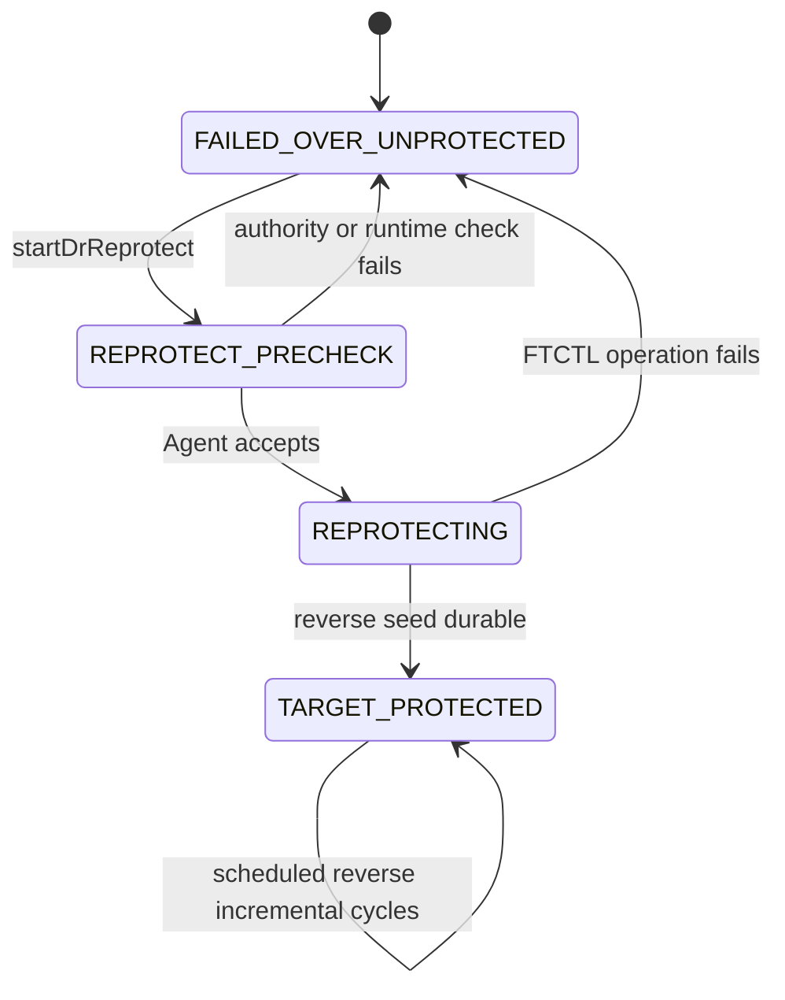
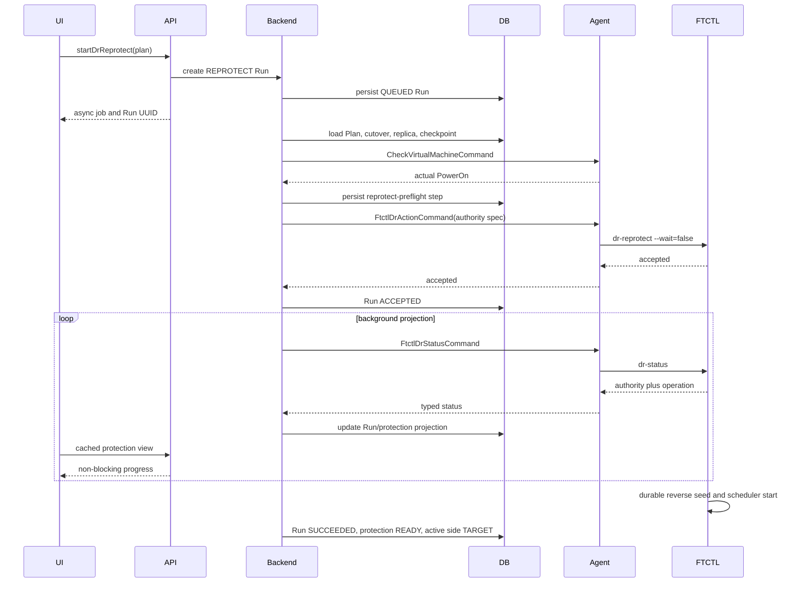

# Cross Hypervisor DR Reprotect Canonical Authority Preservation Design

> 2026-08-03 최신 후속 규약:
> [589-cross-hypervisor-dr-reprotect-preflight-and-release-terminal-convergence-design-20260803.md](589-cross-hypervisor-dr-reprotect-preflight-and-release-terminal-convergence-design-20260803.md)
> 는 typed transition preflight v2, Agent 배포 계약 검증, Release의 authority
> 보존과 `UNPROTECTED` terminal convergence를 정의한다. 충돌 시 589를 우선한다.

- Date: 2026-07-23
- Status: detailed implementation design; live read-only preflight verified
- Scope: VMware to ABLESTACK failover followed by reverse reprotection
- Related: 521, 522, 567, 568
- FTCTL contract:
  `ablestack-qemu-exec-tools/docs/ftctl/441-ftctl-dr-reprotect-canonical-authority-preservation-design-20260723.md`

## 1. Purpose

After Failover, the ABLESTACK target VM is the production authority. Reprotect
must create reverse protection from ABLESTACK to VMware without blocking the UI
and without changing authority back to SOURCE.

The current failure is not a credential or RPO problem. It is a cross-layer
state-envelope defect: an accepted asynchronous FTCTL Run replaces the Plan
status projection before the worker reads the committed TARGET authority.

This design fixes the authority contract, adds a real target-runtime preflight,
and prevents a reprotect operation failure from marking a healthy serving
target as a broken replica.

## 2. Live failure evidence

Plan:

```text
2514a846-64a2-4bc7-ba88-38a874410782
```

Failed Reprotect Run:

```text
3448788d-ff01-47bc-a4a3-368e6d9e764b
```

### 2.1 Database

| Record | Verified value |
|---|---|
| `dr_plan` | id 38, `ERROR`, `ENABLED`, `active_side=TARGET` |
| `dr_run` | id 97, `REPROTECT`, `FAILED`, engine accepted |
| Run failure | `DR_REPROTECT_REQUIRES_TARGET_ACTIVE`, message `OK` |
| `dr_cutover_session` | `PROMOTED`, `POWERED_ON`, acknowledged, generation 1, checkpoint 439 |
| `dr_replica` | target VM id 256, `POWERED_ON`, `active_side=TARGET`, state `ERROR` |
| latest durable cycle | sequence 439, verified incremental baseline |

### 2.2 FTCTL

| Source | Verified value |
|---|---|
| saved profile | `activeSide=TARGET` |
| `failovers/active.json` | `FAILED_OVER/TARGET`, generation 1, `PROMOTED/POWERED_ON` |
| failed Run status | `active_side=""`, materialization false, checkpoint empty |
| result | rejected at `reprotect-not-eligible`; no reverse checkpoint |

### 2.3 Target VM runtime drift

Cloud DB currently reports VM id 256 as `Running` on host id 2. A read-only
libvirt query on that host did not find `i-2-256-VM`. This is independent of
the authority-overwrite defect, but it proves that DB state alone is
insufficient for a safe reverse-protection transition.

Reprotect must therefore verify the target through the host Agent immediately
before dispatch.

## 3. Root cause

### 3.1 Cloud command lacks a reprotect authority envelope

`FtctlDrUnifiedActionAdapter.buildActionCommand()` sends:

- Plan/run identity;
- profile JSON;
- user request context;
- optional restore point.

It does not load the committed `dr_cutover_session`, active replica, and target
VM into one immutable expected-authority contract for `REPROTECT`.

### 3.2 FTCTL overwrites authority before the worker reads it

`ftctl_dr_runtime_action()` creates a minimal Run state, copies it to
`status.state`, and starts a background worker. The worker later reads
`active_side` from the overwritten `status.state` and rejects the Plan.

### 3.3 Projection expands an operation failure into resource failure

`FtctlDrRuntimeProjectionAdapter.failRunFromProjection()` always calls:

```text
markPlanProjectionFailed()
markReplicaProjectionFailed()
```

These set Plan and every replica to `ERROR`, even when the failed operation did
not modify the serving target or committed authority.

### 3.4 Error text accepts transport placeholders

The typed code is correct, but the persisted message is `OK`. Transport-level
success text is being treated as an engine failure explanation.

## 4. Ownership and invariants

| Concern | Owner |
|---|---|
| Plan active side and service authority | Cloud |
| target VM lifecycle and actual host placement | Cloud and KVM Agent |
| committed cutover session | Cloud DB |
| local authority mirror and reverse data movement | FTCTL |
| command transport | Agent |
| operation history | Cloud `dr_run` and `dr_run_step` |
| transient engine progress | FTCTL status, projected by Cloud |

Mandatory invariants:

1. Reprotect never powers off or deletes the serving target VM.
2. Reprotect never changes `active_side` from TARGET.
3. A failed Reprotect Run leaves Plan state `FAILED_OVER`, protection phase
   `FAILED_OVER_UNPROTECTED`, and replica serving state intact.
4. UI/API returns immediately after Run creation and Agent acceptance.
5. Only a durable reverse seed changes protection to READY.
6. Cloud DB power state is an input hint; Agent `PowerOn` is the execution gate.

## 5. State model



Cloud Plan remains `FAILED_OVER` while TARGET is unprotected or Reprotect is
in progress. Only a durable reverse seed and healthy target-side scheduler may
transition the Plan to `READY`; `active_side` remains `TARGET`. Runtime
protection follows:

```text
FAILED_OVER_UNPROTECTED -> REPROTECTING -> READY
```

Do not use Plan `ERROR` for a non-destructive reprotect preflight failure.

## 6. API and asynchronous contract

The user-facing command remains:

```text
startDrReprotect&id=<plan UUID>
```

No authority, VM id, checkpoint, or provider value is accepted from the UI.
The backend derives all of them.

API behavior:

1. validate server-side eligibility;
2. create a `REPROTECT` Run and return its async job immediately;
3. enqueue execution;
4. project status in the background;
5. expose the Run-local failure without changing serving authority.

Response additions:

```text
protectionPhase
activeSide
reprotectReadiness
reprotectBlockingCode
authorityGeneration
cutoverSessionId
targetRuntimePowerState
targetRuntimeCheckedAt
```

## 7. UI design

Affected files:

```text
ui/src/components/dr/DrActionToolbar.vue
ui/src/utils/dr/resourceActions.js
ui/src/views/infra/dr/DrPlanList.vue
ui/src/views/infra/dr/DrPlanOverview.vue
ui/src/api/dr.js
```

### 7.1 Action gate

The Reprotect action is enabled only when the server returns
`actions.reprotect=true`. The UI must not reconstruct authority rules from
labels.

### 7.2 Status semantics

During dispatch:

```text
상태: 페일오버 완료
보호 상태: 재보호 준비 중 / 재보호 진행 중
활성 사이트: 대상
```

On non-destructive failure:

```text
상태: 페일오버 완료
보호 상태: 재보호 필요
최근 작업: 재보호 실패
```

The UI must not show the Plan or target VM as failed unless the target-runtime
probe itself proves it absent or stopped.

### 7.3 Polling

Use the cached protection-view endpoint for normal refresh. Poll the active Run
at a short interval only while `REPROTECT_PRECHECK` or `REPROTECTING`. Do not
block the page and do not issue direct host/FTCTL calls.

### 7.4 Error message

Display a typed operator message:

```text
재보호를 시작하지 못했습니다. 대상 가상머신의 서비스 권한은 유지됩니다.
```

Show the exact blocking reason below it. Never display `OK` as an error.

## 8. Backend design

### 8.1 `DrReprotectPreflightService`

Add:

```text
com.cloud.dr.DrReprotectPreflightService
com.cloud.dr.DrReprotectPreflightServiceImpl
com.cloud.dr.DrReprotectAuthoritySpec
com.cloud.dr.DrReprotectPreflightResult
```

The service loads, in one transaction:

1. `DrPlanVO`;
2. latest completed `DrCutoverSessionVO`;
3. active `DrReplicaVO`;
4. target `UserVmVO`;
5. latest target-ready `DrRestorePointVO`;
6. current `DrPlanRuntimeVO`;
7. active Run and transition locks.

It validates:

```text
plan.state == FAILED_OVER
plan.activeSide == TARGET
cutover.state in {PROMOTED, COMPLETED}
cutover.cloudPromotionState == PROMOTED
cutover.engineAckState == ACKNOWLEDGED
cutover.cloudAuthorityGeneration > 0
replica.activeSide == TARGET
replica target identity matches the Plan target
latest checkpoint sequence matches the committed cutover checkpoint
no active transition Run
```

### 8.2 Actual target runtime probe

Do not stop at `UserVmVO.State.Running`.

Send:

```java
CheckVirtualMachineCommand(targetVm.getInstanceName())
```

to `targetVm.getHostId()` through `AgentManager`. Require:

```text
answer.result == true
answer.state == PowerState.PowerOn
```

If the VM is not found, returns `PowerOff`, or Agent is unavailable:

```text
DR_REPROTECT_TARGET_RUNTIME_NOT_RUNNING
DR_REPROTECT_TARGET_RUNTIME_UNKNOWN
DR_REPROTECT_TARGET_AGENT_UNAVAILABLE
```

The preflight records the actual result as a Run step. It does not overwrite
the DB VM state by itself; the standard VM state sync path remains responsible
for reconciliation.

### 8.3 Authority specification

`DrReprotectAuthoritySpec` contains:

```java
String contractVersion;
String planUuid;
String runUuid;
String expectedActiveSide;
long authorityGeneration;
String cutoverSessionId;
long checkpointSequence;
long targetVmId;
String targetExternalRef;
String targetInstanceName;
String targetPowerState;
boolean targetMaterialized;
String targetPromotionState;
String bootValidationState;
String sourceFenceState;
String sourcePowerState;
```

Serialize it once. Persist the redacted copy in the `reprotect-preflight` Run
step details and send the exact same JSON to Agent.

### 8.4 `DrPlanServiceImpl.getActionEligibility()`

Replace the current state-only reprotect gate:

```text
failedOver && controlReady
```

with:

```text
enabled
&& !activeRun
&& ftctlDrControlReady
&& plan.state == FAILED_OVER
&& plan.activeSide == TARGET
&& cutover committed and acknowledged
&& replica target identity present
&& no active test/failback/reprotect session
```

The actual Agent power probe occurs after the action is requested so the UI
does not synchronously wait on a host.

### 8.5 `FtctlDrUnifiedActionAdapter`

Inject `DrReprotectPreflightService`.

For `Action.REPROTECT`:

1. run the preflight;
2. record `reprotect-preflight`;
3. set `authorityContractVersion`;
4. set `authoritySpecJson`;
5. dispatch with `waitForCompletion=false`.

Do not derive the authority specification from UI request JSON or free-form
context.

### 8.6 Projection classification

Add:

```text
DrProjectionFailureScope
  OPERATION_ONLY
  PROTECTION_DEGRADED
  TARGET_RESOURCE_FAILED
  AUTHORITY_CONFLICT
```

Classify these errors as `OPERATION_ONLY`:

```text
DR_REPROTECT_AUTHORITY_*
DR_REPROTECT_CUTOVER_SESSION_MISMATCH
DR_REPROTECT_CHECKPOINT_MISMATCH
DR_REPROTECT_REVERSE_CAPABILITY_UNAVAILABLE
DR_REPROTECT_REVERSE_SYNC_FAILED before commit
```

For `OPERATION_ONLY`:

- fail only the Run and its step;
- preserve Plan `FAILED_OVER/TARGET`;
- preserve replica `READY/POWERED_ON/TARGET`;
- set protection state `FAILED_OVER_UNPROTECTED`;
- store the last operation error in Run history.

Only `TARGET_RESOURCE_FAILED` may mark the replica failed.

### 8.7 Periodic projection authority precedence

`PLAN_AUTHORITY` polling continues after a finite Reprotect Run becomes
terminal. The FTCTL operation status may therefore still contain the last
`DR_REPROTECT_*` error while Cloud has no active Run.

The no-active-Run projection path must apply the same operation-only failure
rule before mapping `status.state` to `dr_plan.state`:

1. Load the latest active cutover session.
2. Require `PROMOTED`, `POWERED_ON`, `ACKNOWLEDGED`, and a positive Cloud
   authority generation.
3. Preserve Plan `FAILED_OVER/TARGET`, replica
   `READY/POWERED_ON/TARGET`, and runtime
   `FAILED_OVER_UNPROTECTED`.
4. Keep the failed Reprotect Run and its exact error in Run history.
5. Do not expose that historical Run error as the current Plan error in the
   list/detail API response.

This rule prevents a periodic refresh from disabling Reprotect after a
successful failover while retaining the complete audit trail.

### 8.8 Error normalization

Add a shared normalizer:

```java
String normalizeEngineErrorMessage(String errorCode,
        String statusMessage, String runtimeMessage, String answerDetails)
```

Reject placeholders:

```text
OK
SUCCESS
ACCEPTED
DELEGATED
```

When no meaningful text remains, use a message catalog keyed by `errorCode`.

## 9. Agent design

### 9.1 Command DTO

Extend `FtctlDrActionCommand`:

```java
String authorityContractVersion;
@LogLevel(Off)
String authoritySpecJson;
```

Increment:

```text
ACTION_CONTRACT_VERSION = 2026-07-23
```

### 9.2 KVM wrapper

`LibvirtFtctlDrActionCommandWrapper`:

1. validates contract version and required fields;
2. writes authority JSON to a `0600` temporary file;
3. passes `--authority-spec-json`;
4. preserves the file contents for the delegated worker by letting FTCTL copy
   it into the Plan Run directory;
5. deletes the Agent temporary file after command return.

The wrapper does not decide active-side ownership.

### 9.3 Status answer

Return authority and operation sections without flattening one over the other.
On terminal failure, propagate `error_code` and `error_message`; do not replace
them with command-execution text.

## 10. FTCTL design

The normative implementation is
`441-ftctl-dr-reprotect-canonical-authority-preservation-design-20260723.md`.

Required Cloud-visible behavior:

1. `dr-cutover-commit` maintains an atomic Plan authority file.
2. delegated action creation preserves authority fields.
3. reprotect worker reads the immutable authority envelope.
4. reverse provider preflight runs before profile promotion.
5. failed operation leaves the serving TARGET authority untouched.
6. successful reverse seed starts target-side scheduled protection.

## 11. Database design

No schema migration is required for the authority fix.

Use existing records:

| Data | Record |
|---|---|
| Cloud authority generation and session | `dr_cutover_session` |
| Plan active side | `dr_plan.active_side` |
| serving target identity and power projection | `dr_replica` |
| operation authority snapshot | `dr_run_step.details_json` |
| operation result | `dr_run` |
| protection and scheduler projection | `dr_plan_runtime` |

Write rules:

1. Preflight step details are written before Agent dispatch.
2. A reprotect failure updates `dr_run` only, plus
   `dr_plan_runtime.protection_state=FAILED_OVER_UNPROTECTED`.
3. `dr_plan.last_error_*` is not used for operation-only failure.
4. `dr_replica.state` is not changed unless actual target-resource failure is
   confirmed.
5. Existing failed Run id 97 remains immutable audit evidence.
6. Successful reverse seed changes Plan `FAILED_OVER -> READY` while preserving
   `active_side=TARGET`, then sets runtime protection `READY`.

For the current incorrectly projected Plan, a one-time reconciliation after
deployment may restore:

```text
dr_plan.state = FAILED_OVER
dr_plan.active_side = TARGET
dr_replica.active_side = TARGET
dr_plan_runtime.protection_state = FAILED_OVER_UNPROTECTED
```

This reconciliation is allowed only after Agent target-runtime verification.

## 12. End-to-end asynchronous sequence



## 13. Tests

### 13.1 Cloud unit tests

Add:

```text
DrReprotectPreflightServiceImplTest
FtctlDrUnifiedActionAdapterTest.reprotectCarriesAuthoritySpec
FtctlDrRuntimeProjectionAdapterTest.reprotectFailurePreservesTargetAuthority
DrPlanServiceImplTest.reprotectEligibilityRequiresCommittedTargetAuthority
```

Cover:

1. valid TARGET authority and actual Agent `PowerOn`;
2. Cloud DB Running but Agent PowerOff/not found;
3. stale authority generation;
4. mismatched target identity;
5. missing committed cutover session;
6. operation-only failure preserving Plan and replica;
7. meaningful error text replacing `OK`;
8. async API response before engine completion.

### 13.2 Agent tests

Verify:

1. authority JSON is passed without mutation;
2. temporary file permissions and cleanup;
3. background worker receives a persisted copy;
4. status authority and operation are both returned;
5. timeout status probing does not convert failure to acceptance.

### 13.3 FTCTL self-tests

Use the exact sequence defined in document 441, including the
TARGET/generation 1/checkpoint 439 regression fixture.

### 13.4 Live acceptance

PASS requires:

1. Cloud Plan and FTCTL authority both TARGET;
2. Agent confirms target `PowerOn`;
3. source VMware VM is isolated or powered off;
4. reverse provider preflight passes;
5. one reverse seed checkpoint is durable;
6. target-side scheduler is alive and healthy;
7. Run succeeds asynchronously;
8. active side remains TARGET;
9. a second cycle proves incremental reverse protection;
10. UI shows TARGET protected, not SOURCE restored.

## 14. Recommended implementation order

1. Add FTCTL canonical authority and operation-envelope preservation.
2. Add FTCTL reverse-provider dry-run preflight and self-tests.
3. Extend Agent DTO/wrapper authority contract.
4. Add Cloud `DrReprotectPreflightService` and actual target runtime probe.
5. Send immutable authority spec from the unified adapter.
6. Add failure-scope projection and error normalization.
7. Tighten eligibility and response fields.
8. Update UI labels, action gate, and polling.
9. Build changed Cloud Maven modules and UI.
10. Build FTCTL through GitHub Actions, deploy Agent/Cloud/FTCTL together,
    reconcile the current Plan after runtime verification, and retest.

## 15. AS-IS / TO-BE

| Layer | AS-IS | TO-BE |
|---|---|---|
| UI | generic Plan ERROR after reprotect failure | failover remains complete; reprotect failure is Run-local |
| API | state-only action gate | committed TARGET authority gate; execution remains asynchronous |
| Backend | no immutable reprotect authority spec | transactional authority spec plus actual target runtime probe |
| Agent | free-form context arguments | versioned authority document passed unchanged |
| FTCTL | worker reads overwritten `status.state` | canonical authority plus immutable operation envelope |
| Reverse path | cycle begins after profile reversal | non-mutating KVM-to-VMware capability gate first |
| Projection | all failures mark Plan and replica ERROR | scope-aware operation/protection/resource failure |
| DB | `ERROR/TARGET`, replica ERROR, message `OK` | `FAILED_OVER/TARGET`, unprotected warning, exact Run error |
| Safety | valid target authority can disappear from status | operation cannot modify authority before reverse commit |
| Retry | retry repeats the same code-47 failure | retry is idempotent by generation/session/checkpoint |

## 16. 2026-08-01 Reverse Data-Plane Addendum

Authority preservation does not make a reverse profile executable. Reprotect
must create or validate a KVM baseline, run a KVM-to-VMware writer, and commit
the reverse checkpoint before the Plan becomes `REVERSE_PROTECTED`. For legacy
plans without a baseline, the first Reprotect operation is explicitly
`FULL_REVERSE_SEED`.

The full cross-layer contract is
[588-cross-hypervisor-dr-bidirectional-incremental-replication-and-failback-data-contract-design-20260801.md](588-cross-hypervisor-dr-bidirectional-incremental-replication-and-failback-data-contract-design-20260801.md).

## 17. 2026-08-06 Forward Target Locator Reuse Addendum

Reprotect after Failback must reuse the target-volume and storage-pool identity
that Cloud materialized for initial protection. `targetDiskRef` is not a
transport locator. Cloud supplies a versioned target descriptor and FTCTL
derives the librbd sync URI and krbd runtime path. Document 598 is normative
for the UI/API/backend/Agent/DB contract; FTCTL document 454 defines the engine
implementation.
