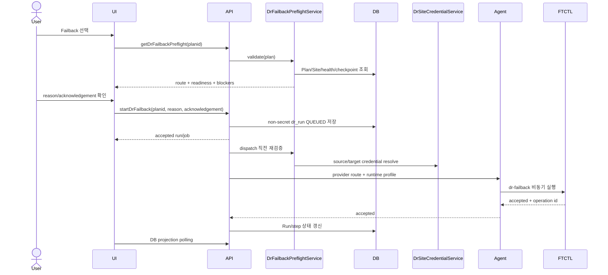

# 571. Cross Hypervisor DR Site-Derived Failback Contract Design

> 2026-07-26 보정: 이 문서의 Site-derived route/credential 계약은 유효하다.
> 실제 failback 완료 조건은 문서 574의 Cloud-owned VM lifecycle 및
> `FAILBACK_COMMIT` 계약을 따른다. reverse checkpoint 완료만으로
> `READY/SOURCE` 또는 Run `SUCCEEDED`를 기록하지 않는다.

작성일: 2026-07-25

## 1. 목적

현재 DR Plan 페일백 대화상자는 다음 내부 FTCTL 호환 입력을 사용자에게
노출한다.

- `failbacktargetmoldtype`
- `remotemoldapiurl`
- `remotemoldapikey`
- `remotemoldsecretkey`
- `targetmoldapiurl`
- `targetmoldapikey`
- `targetmoldsecretkey`

이 계약은 DR Site와 암호화 credential 관리가 도입되기 전의 remote-Mold
source-controller failback 모델에서 시작되었다. 현재 `FTCTL_DR` Plan은 이미
`source_site_id`, `target_site_id`, `active_side`, direction, 양쪽 Site
credential을 가지고 있으므로 정상 페일백에서 사용자가 Mold 유형이나
인증정보를 다시 입력할 이유가 없다.

이 문서는 일반 source-controller failback을 다음 원칙으로 재정의한다.

1. 페일백 경로는 DR Plan과 등록된 DR Site에서 결정한다.
2. 인증정보는 `DrSiteCredentialService`가 저장된 credential을 실행 시점에
   resolve한다.
3. UI/API는 secret, API key, password 또는 내부 credential 참조를 받지 않는다.
4. Cloud는 VM과 사이트 lifecycle을 소유하고 FTCTL은 data-plane action만
   수행한다.
5. 신규 또는 교체 사이트 복구는 일반 페일백과 분리한다.
6. 비동기 Run의 durable JSON에는 secret을 저장하지 않는다.

이 문서는 다음 과거 계약을 최신 Site 기반 계약으로 보정한다.

- `506-cross-hypervisor-dr-cloud-ui-design-20260630.md`
- `507-cross-hypervisor-dr-cloud-api-command-design-20260630.md`
- `510-cross-hypervisor-dr-ftctl-runtime-contract-design-20260630.md`
- `514-cross-hypervisor-dr-ui-backend-flow-diagrams-20260701.md`
- `515-cross-hypervisor-dr-async-action-remediation-plan-20260701.md`
- `522-cross-hypervisor-dr-protection-failover-failback-sequence-design-20260701.md`
- `527-cross-hypervisor-dr-site-credential-management-design-20260702.md`
- qemu documents 205, 206, 207, 208, 211, and 212

## 2. 확인된 오류 원인

### 2.1 UI가 내부 capability를 운영자 선택으로 노출

`DrPlanList.vue`는 `current`, `original-primary`, `new`를 사용자 선택으로
노출한다. 이 값은 과거 backend capability 용어이며 현재 구현된 일반
source-controller failback의 사용자 계약이 아니다.

`current`는 특히 의미가 모호하다.

- 현재 UI를 제공하는 Mold
- 현재 active workload를 소유한 Site
- 현재 qemu coordinator
- failback destination

이 네 의미가 동일하지 않을 수 있으므로 사용자 입력값으로 사용할 수 없다.

### 2.2 Site credential 도입 후 과거 action 입력이 남음

`FtctlDrUnifiedActionAdapter.buildProfileJson()`은 이미 다음 데이터를 사용한다.

- `DrPlanVO.getSourceSiteId()`
- `DrPlanVO.getTargetSiteId()`
- `DrSiteDao.findById()`
- `DrSiteCredentialService.resolveCredential()`

따라서 action modal의 remote/target Mold 입력은 동일 정보를 중복 입력하게
한다. 입력값이 저장 Site 정보와 다르면 어떤 값이 authoritative한지 알 수
없다.

### 2.3 API secret이 durable Run JSON에 들어갈 수 있음

현재 `StartDrFailbackCmd.addRequestProperties()`는 API key와 secret을 request
JSON에 추가한다. `AbstractDrPlanActionCmd.execute()`는 이 JSON을
`DrRunService.startRun()`에 전달하고 `DrOrchestratorImpl.createRun()`은 이를
`dr_run.request_json`에 저장한다.

Agent 전송 전에 redaction하더라도 DB 저장은 이미 끝난 뒤다. 따라서 action
modal에 secret을 입력하면 다음 위험이 생긴다.

- `dr_run.request_json` 평문 잔존
- DB backup과 support dump로 확산
- credential rotation 이후 오래된 값 재사용
- 등록 Site credential과 action credential 불일치
- VMware destination인데 Target Mold를 묻는 provider 오류

### 2.4 과거 문서 간 계약 충돌

2026-07-01 문서 515는 one-time remote/target Mold payload를 추가했지만,
2026-07-02 문서 527과 현재 코드는 `DrSiteCredentialService` 기반 저장
credential을 사용한다. 문서 206/211 역시 target-Mold selector를 operator
UI에 노출하지 말라고 정의한다.

따라서 one-time action credential 설계는 최신 Site credential 설계로
대체되어야 한다.

## 3. 실환경 Preflight 결과

2026-07-25, secret 원문을 조회하지 않는 read-only DB Preflight를 수행했다.

대상 Plan:

```text
uuid: 2514a846-64a2-4bc7-ba88-38a874410782
direction: VMWARE_TO_KVM
engine: FTCTL_DR / FTCTL_DR
state: FAILED_OVER
active_side: TARGET
```

Site 및 credential:

| 역할 | Site | Site 유형 | Hypervisor | Health | Credential |
| --- | --- | --- | --- | --- | --- |
| 원본/복귀 목적지 | 21 VMware ESXi Cluster | VMWARE_DIRECT | VMWARE | CONNECTED | VCENTER / CONFIGURED |
| 현재 active | 32 ABLESTACK Cluster | MOLD_KVM | KVM | CONNECTED | MOLD_API / CONFIGURED |

판정:

- Plan만으로 active Site와 복귀 목적지를 결정할 수 있다.
- source vCenter와 target Mold credential이 모두 저장되어 있다.
- 일반 페일백에서 추가 Mold 선택 또는 API credential 입력은 필요하지 않다.
- 이 Plan의 정상 경로는 `TARGET ABLESTACK -> SOURCE VMware`다.

## 4. Authority와 경로 결정 규칙

### 4.1 일반 source-controller failback

전제:

- Plan state가 `FAILED_OVER` 또는 `FAILED_OVER_UNPROTECTED`
- `active_side=TARGET`
- source Site가 존재하며 복구 가능
- source-controller와 source-side Plan/authority가 존재

경로:

```text
active workload Site = plan.target_site_id
failback destination = plan.source_site_id
```

사용자에게 target type을 묻지 않는다.

### 4.2 provider별 credential 요구

| Site 유형 | required credential type | 주요 사용처 |
| --- | --- | --- |
| `VMWARE_DIRECT` | `VCENTER` | VM inventory, snapshot/CBT, destination VM lifecycle |
| `MOLD_KVM`, `ABLESTACK` | `MOLD_API` | Cloud VM/volume/network lifecycle |

네 방향 모두 동일한 resolver를 사용한다.

| 최초 보호 방향 | 페일백 active Site | 페일백 destination | credential 해석 |
| --- | --- | --- | --- |
| ABLESTACK -> VMware | VMware | ABLESTACK | target VCENTER + source MOLD_API |
| VMware -> VMware | target VMware | source VMware | target/source VCENTER |
| ABLESTACK -> ABLESTACK | target ABLESTACK | source ABLESTACK | target/source MOLD_API |
| VMware -> ABLESTACK | ABLESTACK | VMware | target MOLD_API + source VCENTER |

### 4.3 별도 workflow로 분리할 경우

다음은 일반 `startDrFailback`이 아니다.

- 원본 Site가 파괴되어 새 Site로 복구
- 원본 Plan authority가 유실됨
- 현재 replica Site가 독립 controller가 됨
- replica를 production으로 채택

해당 경우는 각각 다음 workflow를 사용한다.

- registered replacement Site를 대상으로 한 replica-controller recovery
- delegated failback
- adopt replica
- reprotect

신규 Site가 필요하면 먼저 DR Site로 등록하고 credential, inventory, target
mapping을 검증한다. 일반 페일백 modal에서 URL과 secret을 즉석 입력하지
않는다.

## 5. UI 상세 설계

### 5.1 변경 파일

- `ui/src/views/infra/dr/DrPlanList.vue`
- `ui/src/components/dr/DrFailbackRouteSummary.vue` 신규 권장
- `ui/src/api/dr.js`
- `ui/public/locales/ko_KR.json`
- `ui/public/locales/en.json`

### 5.2 제거할 form state

`defaultActionForm()`에서 다음 필드를 제거한다.

```javascript
failbacktargetmoldtype
remotemoldapiurl
remotemoldapikey
remotemoldsecretkey
targetmoldapiurl
targetmoldapikey
targetmoldsecretkey
```

`buildActionPayload()`에서도 같은 필드 전송을 제거한다.

### 5.3 페일백 modal 구성

modal header/footer는 기존 DR modal 표준을 유지하고 body만 scroll한다.

표시 항목:

1. 읽기 전용 경로
   - 현재 active Site
   - 원본/복귀 Site
   - provider/hypervisor
2. 준비 상태
   - 양쪽 Site health
   - credential configured/validated 상태
   - latest durable sync/checkpoint
   - source isolation/fencing
3. 사용자 입력
   - `reason`
   - `acknowledgement`
   - 기존 정책상 필요한 `force`

표시 금지:

- API key
- secret key
- password
- credential ID/ref
- `current/original-primary/new` selector

### 5.4 Preflight UX

`openActionModal(startDrFailback)`는 `getDrFailbackPreflight(planid)`를 호출한다.
이 API는 캐시된 DB 상태만 읽어 빠르게 응답한다.

```javascript
async openFailbackModal (plan) {
  this.failbackPreflightLoading = true
  try {
    this.failbackPreflight = await getDrFailbackPreflight({ planid: plan.id })
    this.showActionModal = true
  } finally {
    this.failbackPreflightLoading = false
  }
}
```

`eligible=false`면 확인 버튼을 비활성화하고 `blockingreasons`를 표시한다.

credential 문제는 대화상자에서 다시 입력받지 않는다. 해당 DR Site 수정
화면으로 이동하는 action을 제공한다.

## 6. API 상세 설계

### 6.1 `startDrFailback`

정상 request:

```text
planid
idempotencykey
force
reason
acknowledgement
```

다음 public parameter는 deprecated 처리 후 제거한다.

```text
failbacktargetmoldtype
remotemoldapiurl
remotemoldapikey
remotemoldsecretkey
targetmoldapiurl
targetmoldapikey
targetmoldsecretkey
```

1차 호환 단계에서는 parameter annotation을 유지할 수 있지만
`addRequestProperties()`에 넣지 않는다. 하나라도 전달되면
`DR_FAILBACK_INLINE_CREDENTIAL_UNSUPPORTED`를 반환해 무시된 secret으로
작업이 진행되는 상황을 방지한다.

다음 release에서 parameter 자체를 제거한다.

### 6.2 `getDrFailbackPreflight`

신규 read API 권장:

```java
public final class GetDrFailbackPreflightCmd extends BaseCmd {
    @Parameter(name = "planid", required = true, type = CommandType.UUID)
    private Long planId;
}
```

응답:

```json
{
  "eligible": true,
  "activeSide": "TARGET",
  "activeSite": {
    "id": "site-uuid",
    "name": "32 ABLESTACK Cluster",
    "provider": "ABLESTACK",
    "health": "CONNECTED",
    "credentialState": "CONFIGURED"
  },
  "destinationSite": {
    "id": "site-uuid",
    "name": "21 VMware ESXi Cluster",
    "provider": "VMWARE",
    "health": "CONNECTED",
    "credentialState": "CONFIGURED"
  },
  "latestDurableAt": "2026-07-25T10:00:00+09:00",
  "sourceIsolationState": "CONFIRMED",
  "blockingReasons": []
}
```

secret, principal 원문, 내부 numeric credential ID는 반환하지 않는다.

### 6.3 공통 request sanitizer

`AbstractDrPlanActionCmd`와 `DrRunService` 사이에
`DrActionRequestSanitizer`를 둔다.

금지 key:

```text
password
secret
token
apikey
api_key
credential
remoteMoldApiKey
remoteMoldSecretKey
targetMoldApiKey
targetMoldSecretKey
```

redaction 후 저장하지 말고 request를 거부한다. redaction 저장은 사용자가
credential이 적용됐다고 오해하게 만들 수 있다.

## 7. Backend 상세 설계

### 7.1 신규 서비스

```java
public interface DrFailbackPreflightService {
    DrFailbackPreflightResult validate(long planId);
    DrFailbackExecutionContext resolveForExecution(DrPlanVO plan, DrRunVO run);
}
```

```java
public final class DrFailbackExecutionContext {
    private DrSiteVO activeSite;
    private DrSiteVO destinationSite;
    private DrResolvedSiteCredential activeCredential;
    private DrResolvedSiteCredential destinationCredential;
    private String activeProvider;
    private String destinationProvider;
    private String authorityContractVersion;
}
```

`DrResolvedSiteCredential`은 `AutoCloseable` 의미를 유지하고 사용 완료 후
secret payload 참조를 해제한다.

### 7.2 resolve 순서

```java
DrPlanVO plan = requirePlan(planId);
requireState(plan, FAILED_OVER, FAILED_OVER_UNPROTECTED);
requireActiveSide(plan, TARGET);

DrSiteVO activeSite = requireSite(plan.getTargetSiteId());
DrSiteVO destinationSite = requireSite(plan.getSourceSiteId());

requireConnected(activeSite);
requireConnected(destinationSite);
requireConfiguredCredential(activeSite);
requireConfiguredCredential(destinationSite);
requireSourceAuthority(plan);
requireLatestDurableCheckpoint(plan);
requireNoConflictingRun(plan);
```

API Preflight와 실행 직전 backend validation은 같은 서비스를 사용한다.
UI 결과를 신뢰하지 않고 Run dispatch 직전에 다시 검증한다.

### 7.3 Unified adapter

`FtctlDrUnifiedActionAdapter` 변경:

1. request에서 failback target Mold type을 읽지 않는다.
2. `DrFailbackPreflightService.resolveForExecution()` 결과를 사용한다.
3. provider-neutral route와 disk map을 profile에 넣는다.
4. Site credential은 `buildCredentials()`가 저장 credential에서 생성한다.
5. action request에는 non-secret operator intent만 넣는다.

`FtctlDrActionAdapter` legacy 경로:

- Plan에 source/target Site가 있으면 같은 resolver 사용
- Site 없는 standalone FTCTL 보호는 기존 FTCTL 전용 API로 분리
- DR Plan API에서 inline credential fallback을 허용하지 않음

### 7.4 Cloud와 FTCTL 역할

Cloud:

- active/destination Site 결정
- Mold/vCenter credential resolve
- source/target VM 및 volume lifecycle
- final cutover authorization
- Plan/Run/step 상태 commit

FTCTL:

- reverse data copy
- checkpoint/disk map validation
- finalize
- reprotect data-plane 준비
- 구조화된 status/event 반환

FTCTL은 Mold 유형을 선택하거나 Cloud-managed VM을 임의 생성/삭제/기동하지
않는다.

## 8. Agent와 ftctl credential 전달 계약

현재 FTCTL_DR는 profile의 `credentials`를 host runtime으로 전달하고,
qemu-exec-tools의 `ftctl_dr_runtime_save_credentials()`가 다음 방식으로
분리한다.

- `credentials.json`: mode `0600`
- durable profile: secret redacted

이번 개선에서 유지할 계약:

1. credential 원본은 `DrSiteCredentialService`에서만 시작한다.
2. `dr_run.request_json`에는 들어가지 않는다.
3. Agent command의 action request/context에는 들어가지 않는다.
4. 실행용 profile credential은 Agent transport 안에서만 일시적으로 존재한다.
5. host는 `/run/ablestack-vm-ftctl/.../credentials.json`만 root-readable로
   저장한다.
6. status, event, stdout, stderr, profile에는 secret을 기록하지 않는다.
7. protection release/plan delete/credential rotation 시 runtime credential
   파일을 제거하거나 교체한다.

이번 UI/API 보정 자체는 새로운 FTCTL CLI option을 요구하지 않는다.
Agent/ftctl 변경은 방어 검증과 cleanup 테스트 보강 범위다.

권장 qemu 검증:

- `ftctl_dr_runtime_save_credentials()`가 mode `0600`을 보장
- redacted profile에 API key/password가 없음
- `dr-failback` event/status에 credential key가 없음
- terminal release 후 credentials file cleanup

## 9. DB 상세 설계

### 9.1 신규 Run 저장 규칙

`dr_run.request_json` 허용 예:

```json
{
  "force": true,
  "reason": "planned failback",
  "acknowledgement": "FAILBACK"
}
```

금지:

- endpoint override
- API key
- secret
- password
- credential ref/ID
- user-selected target Mold type

실행 감사 정보가 필요하면 secret 대신 다음 non-secret snapshot만 기록한다.

```json
{
  "route": {
    "activeSiteUuid": "...",
    "destinationSiteUuid": "...",
    "activeProvider": "ABLESTACK",
    "destinationProvider": "VMWARE"
  },
  "credentialEvidence": {
    "activeType": "MOLD_API",
    "destinationType": "VCENTER",
    "activeValidatedAt": "...",
    "destinationValidatedAt": "..."
  }
}
```

### 9.2 기존 데이터 보정

upgrade script는 `run_type='FAILBACK'`인 valid JSON에서 다음 key를 제거한다.

```sql
UPDATE cloud.dr_run
SET request_json = JSON_REMOVE(
    request_json,
    '$.remoteMoldApiUrl',
    '$.remoteMoldApiKey',
    '$.remoteMoldSecretKey',
    '$.targetMoldApiUrl',
    '$.targetMoldApiKey',
    '$.targetMoldSecretKey',
    '$.failbackTargetMoldType'
)
WHERE run_type = 'FAILBACK'
  AND request_json IS NOT NULL
  AND JSON_VALID(request_json) = 1
  AND (
      request_json LIKE '%remoteMold%'
      OR request_json LIKE '%targetMold%'
      OR request_json LIKE '%failbackTargetMoldType%'
  );
```

주의:

- 운영 반영 전 backup과 영향 row count를 기록한다.
- JSON invalid row는 자동 수정하지 않고 별도 audit한다.
- secret 원문을 migration log에 출력하지 않는다.
- 같은 보정을 schema upgrade 경로와 Europa after-schema에 일관되게 넣는다.

## 10. 비동기 실행 시퀀스



UI는 Agent/FTCTL 완료를 동기식으로 기다리지 않는다.

## 11. 오류 코드

| 오류 코드 | 의미 | UI 조치 |
| --- | --- | --- |
| `DR_FAILBACK_INLINE_CREDENTIAL_UNSUPPORTED` | action에 inline credential 전달 | Site credential 사용 안내 |
| `DR_FAILBACK_SOURCE_SITE_MISSING` | 원본 Site 없음 | Plan 수정/재생성 |
| `DR_FAILBACK_ACTIVE_SITE_MISSING` | active target Site 없음 | Plan 정합성 점검 |
| `DR_FAILBACK_SITE_DISCONNECTED` | Site health 불량 | DR Site 점검 |
| `DR_FAILBACK_CREDENTIAL_NOT_CONFIGURED` | 저장 credential 없음 | DR Site 수정 |
| `DR_FAILBACK_CREDENTIAL_STALE` | 검증 시각/상태 불충분 | Site 재점검 |
| `DR_FAILBACK_SOURCE_AUTHORITY_MISSING` | source-controller authority 없음 | replica-controller workflow |
| `DR_FAILBACK_CHECKPOINT_NOT_READY` | durable checkpoint 없음 | 동기화 복구 |
| `DR_FAILBACK_ACTIVE_RUN_EXISTS` | 충돌 Run 존재 | 기존 Run 완료/취소 |

## 12. 구현 순서

1. 공통 request sanitizer와 단위 테스트
2. `DrFailbackPreflightService`와 provider/site resolver
3. `getDrFailbackPreflight` API와 response
4. `StartDrFailbackCmd` inline credential 차단 및 durable JSON 축소
5. `FtctlDrUnifiedActionAdapter` site-derived execution context 적용
6. UI modal에서 Mold/credential 입력 제거
7. 양쪽 locale과 route summary 추가
8. 기존 `dr_run.request_json` 보정 script
9. Agent/ftctl redaction 및 credential file cleanup 회귀 테스트
10. Maven changed-module build, UI build, qemu GitHub Actions build
11. 배포 후 DB/API/UI/Agent/ftctl Preflight
12. VMware -> ABLESTACK failback 재테스트

## 13. 테스트 설계

### 13.1 UI

- failback modal에 Mold type selector가 없음
- URL/API key/secret/password 입력이 없음
- active/destination Site가 읽기 전용으로 정확히 표시됨
- Site credential 불량이면 실행 버튼 비활성화
- API request에 legacy credential parameter가 없음

### 13.2 API/Backend

- raw credential parameter 전달 시 typed rejection
- `dr_run.request_json`에 secret key 이름과 값이 없음
- `VMWARE_TO_KVM`이 target MOLD_API + source VCENTER를 resolve
- 네 방향 모두 provider별 credential type을 resolve
- dispatch 직전 credential rotation 또는 health 변경을 재검증
- source authority 유실은 일반 failback이 아니라 replica recovery로 라우팅

### 13.3 Agent/ftctl

- command acceptance는 비동기
- runtime credential file mode `0600`
- durable profile/event/status/log redaction
- FTCTL은 Cloud VM lifecycle을 직접 수행하지 않음
- reverse copy/finalize 결과가 operation id로 projection됨

### 13.4 DB

- 신규 FAILBACK Run에 secret 없음
- 기존 legacy key 보정 row count 확인
- invalid JSON row는 유지되고 audit 대상이 됨
- Site credential row 자체는 변경하지 않음

## 14. AS-IS / TO-BE 요약

| 레이어 | AS-IS | TO-BE |
| --- | --- | --- |
| UI | Mold 유형과 remote/target credential 재입력 | Plan 기반 경로/준비 상태와 reason/ack만 표시 |
| API | failback action이 API key/secret 수신 | non-secret operator intent만 수신 |
| Backend | request credential과 Site credential이 혼재 | source/target Site credential 자동 resolve |
| Authority | `current` 의미가 모호 | active=target, destination=source를 Plan에서 결정 |
| Agent | action request에 legacy field가 섞일 수 있음 | Site-derived runtime profile만 전달 |
| FTCTL | 사용자 Mold 선택 의미가 data-plane에 유입 | provider-neutral reverse copy/finalize만 수행 |
| DB | secret이 `dr_run.request_json`에 저장될 가능성 | secret key 차단, 기존 row 보정 |
| 신규 Site 복구 | 일반 failback modal에 `new` 선택 | 별도 registered-site replica recovery workflow |
| UX | credential 오류를 action modal에서 재입력 | DR Site 수정/재검증으로 안내 |

## 15. 완료 기준

다음 조건을 모두 만족해야 구현 완료로 판단한다.

1. 일반 failback modal에 Mold selector와 credential 입력이 없다.
2. UI request와 `dr_run.request_json`에 legacy credential key가 없다.
3. backend가 Plan source/target Site로 provider와 credential을 결정한다.
4. 실환경 Preflight에서 양쪽 Site health/credential 상태를 확인한다.
5. Agent/ftctl profile, event, status, log에 secret이 없다.
6. VMware -> ABLESTACK 페일백이 source vCenter와 target Mold Site 정보를
   자동 사용한다.
7. 신규 Site 또는 source authority 유실은 별도 recovery workflow로
   명확히 거절/안내한다.
