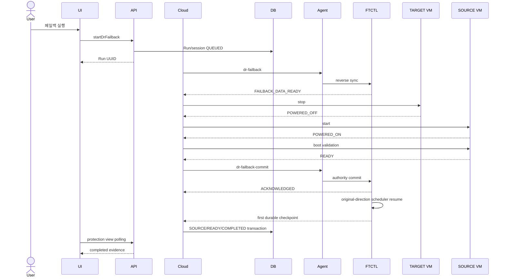

# 574. Cross Hypervisor DR Cloud-Owned Failback Lifecycle Commit Design

작성일: 2026-07-26

## 1. 목적과 적용 범위

FTCTL의 역방향 데이터 동기화 완료와 실제 서비스 페일백 완료를 분리한다.
Cloud가 양쪽 가상머신의 lifecycle과 실행 권한을 확인한 뒤에만 페일백을
최종 커밋하도록 UI/API/Backend/Agent/FTCTL/DB 계약을 정의한다.

다음 네 방향에 동일한 완료 조건을 적용한다.

- ABLESTACK -> VMware
- VMware -> VMware
- ABLESTACK -> ABLESTACK
- VMware -> ABLESTACK

## 2. 실제 환경 검증과 판정

Plan `2514a846-64a2-4bc7-ba88-38a874410782`을 2026-07-26 읽기 전용으로
재검증했다.

| 대상 | 실제 값 |
| --- | --- |
| `dr_plan` | `READY / SOURCE` |
| FAILBACK Run 98 | `SUCCEEDED / runtime-projection` |
| FTCTL checkpoint | `440` |
| FTCTL | `READY / active-side-restore / SOURCE` |
| FTCTL scheduler | `STOPPED` |
| FTCTL target | `POWERED_ON / PROMOTED` |
| FTCTL source | `POWER_ON_DELEGATED / PROMOTED` |
| `dr_replica` | `READY / POWERED_ON / SOURCE` |
| ABLESTACK 대상 VM | `i-2-256-VM / Running / host 2` |
| VMware 원본 VM | `w22-01 / poweredOff` |

역방향 checkpoint 440 생성은 성공했지만 실제 서비스는 TARGET에서 실행되고
SOURCE는 꺼져 있다.

- 데이터 페일백: **PASS**
- 서비스 페일백: **FAIL**
- 이중 기동: 현재는 없음
- 위험: 원본 VM을 수동 기동하면 split-brain 가능

## 3. 오류 원인

### 3.1 FTCTL 조기 완료

`lib/ftctl/dr_runtime.sh`의 `ftctl_dr_runtime_failback_worker()`는 reverse
checkpoint 직후 다음 값을 기록한다.

```text
state=READY
step=active-side-restore
active_side=SOURCE
source_power_state=POWER_ON_DELEGATED
source_promotion_state=PROMOTED
failback_completed_at=<reverse-copy completion time>
```

FTCTL은 원본 VM을 기동하거나 부팅을 검증하지 않았으므로 이는 evidence가
아니라 선언이다.

### 3.2 Cloud 완료 predicate 부족

`FtctlDrRuntimeProjectionAdapter.isRunSatisfiedByRuntime()`의 FAILBACK 조건은
현재 `plan=READY`, `activeSide=SOURCE`, `failback_session_id 존재`뿐이다.
FAILOVER가 `DrCutoverSessionVO`의 target power, boot validation, Cloud
promotion, engine ACK, completed time을 확인하는 것과 비대칭이다.

### 3.3 Projection의 권한 조기 승격

`updatePlanFromStatus()`가 FTCTL 상태를 읽는 즉시 Plan을 `READY/SOURCE`로
바꾸므로 다음 모순이 정상 상태처럼 저장된다.

```text
active_side=SOURCE
target actual power=POWERED_ON
source actual power=POWERED_OFF
```

### 3.4 Preflight와 완료 검증의 혼용

`DrFailbackPreflightServiceImpl`은 Plan 권한, Site health, credential,
durable checkpoint만 검사한다. 시작 가능성 검증으로는 맞지만 양쪽 VM의
실제 전원, lifecycle capability, 부팅 검증, authority generation은 확인하지
않아 완료 판정에 사용할 수 없다.

## 4. 불변 조건

1. reverse-copy 완료는 `FAILBACK_DATA_READY`다.
2. `FAILBACK_DATA_READY`는 서비스 완료가 아니다.
3. Cloud가 VM lifecycle과 production authority를 소유한다.
4. UI/API는 Run을 enqueue하고 즉시 반환한다.
5. Agent는 명령 전달과 비동기 상태 보고를 담당한다.
6. TARGET 정지를 확인하기 전 SOURCE를 기동하지 않는다.
7. SOURCE 부팅 검증 전 Plan을 `SOURCE`로 바꾸지 않는다.
8. FTCTL commit ACK 전 Run을 `SUCCEEDED`로 만들지 않는다.
9. 실패 시 실제 서비스 중인 쪽의 authority를 유지한다.
10. 한 시점에 production VM은 하나만 허용한다.

## 5. Failback 상태 기계

| Session 상태 | 소유자 | 의미 |
| --- | --- | --- |
| `QUEUED` | Cloud | 비동기 Run 생성 |
| `REVERSE_SYNCING` | FTCTL | 최종 변경 데이터 전송 |
| `DATA_READY` | FTCTL | durable reverse checkpoint 완료 |
| `TARGET_QUIESCING` | Cloud | 대상 서비스 정지 준비 |
| `TARGET_STOPPING` | Cloud | 대상 VM 정지 요청 |
| `TARGET_STOPPED` | Cloud | 실제 OFF 확인 |
| `SOURCE_STARTING` | Cloud | 원본 VM 기동 요청 |
| `SOURCE_BOOT_VALIDATING` | Cloud | 전원/guest/boot 검증 |
| `AUTHORITY_COMMITTING` | Cloud/Agent/FTCTL | authority commit |
| `PROTECTION_RESUMING` | FTCTL/Cloud | 원래 방향 scheduler와 복제 재개 |
| `COMPLETED` | Cloud | 첫 durable checkpoint와 DB transaction 완료 |
| `ROLLING_BACK` | Cloud | TARGET 서비스 복구 |
| `FAILED_TARGET_ACTIVE` | Cloud | TARGET 유지 실패 |
| `COMMIT_UNCERTAIN` | Cloud | 실행 위치 수동 확인 필요 |

Plan/authority:

| 구간 | Plan | active side |
| --- | --- | --- |
| `QUEUED` ~ `DATA_READY` | `FAILED_OVER` | `TARGET` |
| lifecycle 진행 | `FAILBACK_IN_PROGRESS` | `TARGET` |
| commit 중 | `FAILBACK_IN_PROGRESS` | `TRANSITION` |
| SOURCE 서비스 복구 | `SYNCING` | `SOURCE` |
| 보호 재개 완료 | `READY` | `SOURCE` |
| rollback 성공 | `FAILED_OVER` | `TARGET` |
| commit 불확실 | `ERROR` | `TRANSITION` |

`TRANSITION`에서는 모든 일반 action을 잠그고 recovery action만 허용한다.

## 6. UI 설계

대상:

- `ui/src/views/infra/dr/DrPlanList.vue`
- `ui/src/views/infra/dr/DrProtectionInfoTab.vue`
- `ui/src/api/dr.js`
- 한글/영문 locale

`startDrFailback`은 Run UUID를 받은 뒤 modal을 닫고 화면 전체를 block하지
않는다. protection view polling으로 다음 단계를 표시한다.

```text
최종 데이터 동기화
대상 가상머신 정지
원본 가상머신 시작
원본 부팅 검증
보호 권한 커밋
완료
```

`failback_completed_at`을 직접 완료 시각으로 사용하지 않고 API의
`failbacksession.completed`만 사용한다.

Action gating:

```javascript
canFailback =
  plan.state === 'FAILED_OVER' &&
  plan.activeSide === 'TARGET' &&
  !plan.activeRun &&
  preflight.ready

canReprotect =
  plan.state === 'READY' &&
  plan.activeSide === 'SOURCE' &&
  failbackSession.state === 'COMPLETED'
```

주요 메시지:

- `DATA_READY`: 최종 데이터 동기화 완료, 서비스 전환 준비 중
- `SOURCE_BOOT_VALIDATING`: 원본 VM 부팅 확인 중
- `FAILED_TARGET_ACTIVE`: 페일백 미완료, DR Site 서비스 유지
- `COMMIT_UNCERTAIN`: 서비스 실행 위치 운영자 확인 필요

## 7. API 설계

### 7.1 비동기 시작 API

`startDrFailback` 입력은 다음 non-secret intent만 허용한다.

```text
id, reason, force, confirmation, idempotencykey
```

Site URL, API key, secret, vCenter/ESXi 계정은 받지 않는다.

### 7.2 Preflight 확장

`DrFailbackPreflightResponse`:

```java
String sourceVmExternalRef;
String targetVmExternalRef;
String sourcePowerState;
String targetPowerState;
String sourceLifecycleCapability;
String targetLifecycleCapability;
String bootValidationCapability;
Long authorityGeneration;
String blockingReasonCode;
```

실제 power가 `UNKNOWN`이면 ready=false다. timeout은 typed retryable error다.

### 7.3 Protection view

```json
{
  "failbacksession": {
    "id": "...",
    "state": "SOURCE_BOOT_VALIDATING",
    "checkpointsequence": 440,
    "sourcepowerstate": "POWERED_ON",
    "targetpowerstate": "POWERED_OFF",
    "bootvalidationstate": "RUNNING",
    "engineackstate": "PENDING",
    "started": "...",
    "updated": "...",
    "completed": null,
    "errorcode": null
  }
}
```

같은 Plan에 active session이 있거나 동일 idempotency key가 재전송되면 기존
Run/session을 반환한다.

## 8. Backend 설계

### 8.1 신규 구성요소

```text
DrFailbackLifecycleService[Impl]
DrFailbackSessionVO
DrFailbackSessionDao[Impl]
DrSiteVmLifecycleProvider
DrSiteVmLifecycleProviderRegistry
DrVmwareLifecycleProvider
DrMoldLifecycleProvider
DrVmPowerEvidence
DrBootEvidence
```

Provider 계약:

```java
public interface DrSiteVmLifecycleProvider {
    boolean supports(DrSiteVO site);
    DrVmPowerEvidence probePower(DrSiteVO site, String externalRef);
    DrVmPowerEvidence stop(DrSiteVO site, String externalRef, Duration timeout);
    DrVmPowerEvidence start(DrSiteVO site, String externalRef, Duration timeout);
    DrBootEvidence validateBoot(
        DrSiteVO site, String externalRef, DrBootValidationPolicy policy);
}
```

Provider 내부에서 `DrSiteCredentialService`로 credential을 resolve하고 durable
JSON이나 event에는 저장하지 않는다.

### 8.2 Provider 구현

`DrVmwareLifecycleProvider`는 기존 `DrVmwareInventoryClient`와 vCenter
session 계층을 공유한다. ESXi 계정을 UI/API로 받지 않는다. vCenter task
완료 후 runtime power를 다시 조회하고, VMware Tools heartbeat 또는 안정적인
poweredOn 상태로 boot를 검증한다.

`DrMoldLifecycleProvider`는 현재 Site이면 `UserVmManager`, 원격 Site이면 등록
Site credential로 서명한 Mold API client를 사용한다. Cloud VM UUID와 provider
external ref를 구분해 session에 저장한다.

### 8.3 비동기 lifecycle worker

Projection thread에서 VM stop/start를 동기 실행하지 않는다.
`FAILBACK_DATA_READY` 최초 관측 시 `DrFailbackLifecycleService.enqueue()`만
호출한다.

```java
verifyTargetStillActive();
transition(TARGET_QUIESCING);
require(targetProvider.stop(...).powerState() == POWERED_OFF);
transition(TARGET_STOPPED);
sourceProvider.start(...);
transition(SOURCE_BOOT_VALIDATING);
require(sourceProvider.validateBoot(...).isReady());
transition(AUTHORITY_COMMITTING);
require(sendFailbackCommit(...).isAcknowledged());
completeInTransaction();
```

모든 단계는 실제 power를 재조회해 idempotent resume 가능해야 한다.

### 8.4 Projection과 완료 predicate

`isFailbackRestoredRuntime()`은 Plan/replica를 변경하지 않는다.
`DATA_READY`에서는 session의 checkpoint와 engine 상태만 갱신한다.

```java
DrFailbackSessionVO s = failbackSessionDao.findActiveByRunId(run.getId());
return s != null
    && "COMPLETED".equals(s.getState())
    && "POWERED_OFF".equals(s.getTargetPowerState())
    && "POWERED_ON".equals(s.getSourcePowerState())
    && "READY".equals(s.getBootValidationState())
    && "ACKNOWLEDGED".equals(s.getEngineAckState())
    && "RUNNING".equals(s.getSchedulerState())
    && s.getPostFailbackCheckpointSequence() != null
    && s.getCompletedAt() != null
    && PLAN_STATE_READY.equals(plan.getState())
    && "SOURCE".equalsIgnoreCase(plan.getActiveSide());
```

FTCTL ACK 후 한 transaction에서 다음을 갱신한다.

```text
dr_failback_session = COMPLETED
dr_plan = READY / SOURCE
dr_replica = READY / POWERED_OFF / SOURCE
dr_run = SUCCEEDED / completed
```

## 9. Agent 설계

`FtctlDrActionCommand.Action`:

```java
FAILBACK_COMMIT("dr-failback-commit"),
FAILBACK_ABORT("dr-failback-abort")
```

action contract version과 capability map도 함께 올린다.

commit context:

```text
failbackSessionId
checkpointSequence
authorityGeneration
sourcePowerState=POWERED_ON
targetPowerState=POWERED_OFF
bootValidationState=READY
```

`LibvirtFtctlDrActionCommandWrapper`는 이를 다음 option으로 전달한다.

```text
--session-id --checkpoint-sequence --authority-generation
--source-power-state --target-power-state --boot-validation-state
```

장기 작업은 status projection으로 보고하고 commit은 30초 이내의 짧은
idempotent ACK 작업으로 만든다.

## 10. FTCTL 설계

상세 계약은 qemu 문서
`214-dr-failback-data-ready-cloud-commit-contract-design-20260726.md`다.

reverse checkpoint 완료:

```text
state=FAILBACK_DATA_READY
step=cloud-lifecycle-pending
active_side=TARGET
target_power_state=POWERED_ON
engine_ack_state=PENDING
failback_completed_at=
```

`dr-failback-commit` 성공 후에만:

```text
state=SYNCING
step=protection-resuming
active_side=SOURCE
source_power_state=POWERED_ON
target_power_state=POWERED_OFF
source_promotion_state=PROMOTED
target_promotion_state=DEMOTED
engine_ack_state=ACKNOWLEDGED
service_restored_at=<commit time>
scheduler_state=RUNNING
```

첫 original-direction durable checkpoint가 target에 commit되면
`state=READY`, `step=completed`, `protection_resumed_at`,
`post_failback_checkpoint_sequence`, `failback_completed_at`을 기록한다.

## 11. DB 설계

```sql
CREATE TABLE `cloud`.`dr_failback_session` (
  `id` bigint unsigned NOT NULL AUTO_INCREMENT,
  `uuid` varchar(40) NOT NULL,
  `plan_id` bigint unsigned NOT NULL,
  `run_id` bigint unsigned NOT NULL,
  `checkpoint_sequence` bigint unsigned,
  `state` varchar(64) NOT NULL,
  `source_site_id` bigint unsigned NOT NULL,
  `target_site_id` bigint unsigned NOT NULL,
  `source_vm_id` bigint unsigned,
  `source_external_ref` varchar(255),
  `target_vm_id` bigint unsigned,
  `target_external_ref` varchar(255),
  `source_power_state` varchar(32),
  `target_power_state` varchar(32),
  `boot_validation_state` varchar(64),
  `engine_ack_state` varchar(32),
  `scheduler_state` varchar(32),
  `cloud_authority_generation` bigint unsigned,
  `checkpoint_ready_at` datetime,
  `target_stopped_at` datetime,
  `source_power_on_at` datetime,
  `boot_validated_at` datetime,
  `engine_ack_at` datetime,
  `service_restored_at` datetime,
  `protection_resumed_at` datetime,
  `post_failback_checkpoint_sequence` bigint unsigned,
  `completed_at` datetime,
  `rollback_required` tinyint(1) NOT NULL DEFAULT 0,
  `details_json` mediumtext,
  `error_code` varchar(128),
  `error_message` varchar(1024),
  `created` datetime NOT NULL,
  `updated` datetime NOT NULL,
  `removed` datetime,
  PRIMARY KEY (`id`),
  UNIQUE KEY `uk_dr_failback_session_uuid` (`uuid`),
  UNIQUE KEY `uk_dr_failback_session_run` (`run_id`),
  KEY `idx_dr_failback_session_plan_active` (`plan_id`,`removed`),
  KEY `idx_dr_failback_session_state_updated` (`state`,`updated`),
  CONSTRAINT `fk_dr_failback_session_plan`
    FOREIGN KEY (`plan_id`) REFERENCES `dr_plan` (`id`) ON DELETE CASCADE,
  CONSTRAINT `fk_dr_failback_session_run`
    FOREIGN KEY (`run_id`) REFERENCES `dr_run` (`id`) ON DELETE CASCADE
) ENGINE=InnoDB DEFAULT CHARSET=utf8mb4;
```

`dr_cutover_session`은 SOURCE -> TARGET failover 증거이므로 재사용하지 않는다.
실제 구현은 schema upgrade SQL과 `create-schema.sql`을 함께 갱신한다.

## 12. 전체 시퀀스



## 13. 오류와 rollback

| 실패 | 처리 |
| --- | --- |
| reverse sync | TARGET 유지 |
| TARGET stop | SOURCE 기동 금지, TARGET 유지 |
| SOURCE start | TARGET 재기동 시도 |
| SOURCE boot | SOURCE 정지 후 TARGET 재기동 |
| FTCTL commit | `COMMIT_UNCERTAIN`, 자동 성공 금지 |
| Management 재시작 | session과 실제 power를 읽어 resume |
| Agent ACK timeout | generation ACK 조회 후 idempotent 재전송 |

rollback 실패 시 실제로 켜진 VM을 UI에 표시하고 일반 action을 잠근다.

## 14. 기존 잘못 완료된 Plan 복구

다음 조합을 reconcile 대상으로 삼는다.

```text
plan=READY/SOURCE
actual target=POWERED_ON
actual source=POWERED_OFF
failback session 없음
```

TARGET을 정지하지 않고 Plan/replica/FTCTL authority를
`FAILED_OVER/TARGET`으로 복구한다. Run 98은 삭제하지 않고
`DR_FAILBACK_LIFECYCLE_INCOMPLETE` 보정 event를 남긴다. 이후 새 Run으로
패치된 페일백을 실행한다.

## 15. 테스트와 구현 순서

단위/통합 테스트:

- DATA_READY만으로 Run 완료 금지
- TARGET ON, SOURCE OFF, boot 미완료, ACK 미완료 각각 completion false
- provider stop/start idempotency
- duplicate projection 중복 실행 방지
- commit/abort session, checkpoint, generation 검증
- commit 후 original-direction scheduler와 첫 durable checkpoint 검증
- 네 방향과 Linux/Windows에서 VM power/boot/DB/UI 정합성

권장 구현 순서:

1. `dr_failback_session`과 VO/DAO
2. FTCTL DATA_READY, commit/abort와 selftest
3. Agent action/context/capability
4. Backend lifecycle provider와 worker
5. projection 조기 SOURCE 승격 제거
6. API protection view/preflight
7. UI 단계/action gating
8. 기존 Plan reconcile
9. 변경 Maven 모듈/UI/FTCTL GitHub Actions build
10. 동시 배포 후 Windows/Linux 실제 재검증

## 16. AS-IS / TO-BE

| 레이어 | AS-IS | TO-BE |
| --- | --- | --- |
| UI | reverse 완료를 페일백 완료처럼 표시 | VM lifecycle과 commit 단계 표시 |
| API | 시작 가능 여부만 제공 | power/capability/session evidence 제공 |
| Backend | FTCTL status로 `READY/SOURCE` 승격 | TARGET stop, SOURCE start/boot, commit 오케스트레이션 |
| Agent | `dr-failback`만 전달 | `FAILBACK_COMMIT/ABORT` 전달 |
| FTCTL | reverse 직후 SOURCE/COMPLETED | DATA_READY/TARGET 대기 후 Cloud commit |
| DB | durable failback lifecycle 없음 | 단계/power/ACK/rollback session 기록 |
| 완료 조건 | session ID 존재 | TARGET OFF + SOURCE ON/boot + engine ACK + 보호 재개 |

## 17. 최종 PASS 조건

```text
target actual power == POWERED_OFF
source actual power == POWERED_ON
source boot validation == READY
failback session == COMPLETED
engine ack == ACKNOWLEDGED
scheduler state == RUNNING
post-failback durable checkpoint exists
plan == READY / SOURCE
replica == READY / POWERED_OFF / SOURCE
run == SUCCEEDED
no second production VM is running
```

역방향 데이터 전송만 성공한 상태는 `DATA_READY`이며 PASS가 아니다.
SOURCE 서비스가 복구됐지만 첫 정방향 checkpoint가 아직 없으면
`SYNCING/SOURCE`이며 RTO는 만족할 수 있어도 보호 완료 PASS는 아니다.

## 18. 2026-07-27 Commit Outcome Convergence 보강

실환경 Run 99에서 VM lifecycle은 실행됐지만 Agent가 FTCTL nonzero 출력을
재수집하는 과정에서 `Stream closed`를 반환했다. Cloud는 이 불확실 응답을
명시적 commit 거부로 해석해 즉시 VM rollback을 수행했으며, FTCTL scheduler는
다른 generation으로 실제 실행됐다.

따라서 다음 규칙을 추가한다.

- Agent 응답은 `ACKNOWLEDGED`, `REJECTED`, `UNKNOWN`으로 구분한다.
- `UNKNOWN`이면 Cloud는 VM을 즉시 전환하지 않고 FTCTL commit journal과
  scheduler generation/ACK를 조회한다.
- rollback은 scheduler `STOPPED/IDLE` fence를 먼저 확보한 후 SOURCE OFF,
  TARGET ON, TARGET authority commit 순서로 수행한다.
- `READY/TARGET`은 허용하지 않고 안전 rollback은
  `FAILED_OVER_UNPROTECTED/TARGET`으로 수렴한다.
- lifecycle 오류는 cycle snapshot projection 경고로 덮지 않는다.
- failback eligibility와 Preflight는 하나의 canonical decision service를
  사용한다.

상세 계층별 설계, DB 확장, 테스트 및 배포 순서는
[575-cross-hypervisor-dr-failback-commit-convergence-and-rollback-fencing-design-20260727.md](575-cross-hypervisor-dr-failback-commit-convergence-and-rollback-fencing-design-20260727.md)를
따른다.
## 21. 2026-08-01 Data-Ready Commit Correction

`data-ready` is not satisfied by a successful Agent command, a zero-byte
cycle, or a newly advanced forward VMware CBT change ID. Cloud must validate a
typed reverse checkpoint owned by the current Failback Run, including target
write durability and reverse guest compatibility. Only then may it stop the
KVM active VM, start the VMware staging VM, and commit SOURCE authority.

The detailed gate and rollback behavior are defined in
[588-cross-hypervisor-dr-bidirectional-incremental-replication-and-failback-data-contract-design-20260801.md](588-cross-hypervisor-dr-bidirectional-incremental-replication-and-failback-data-contract-design-20260801.md).

## 20. 2026-07-30 Action Response And Sequence Handoff Amendment

기존 `post-failback checkpoint > failback checkpoint` 조건은 유지한다. 추가로
Failback commit은 기준 sequence를 FTCTL scheduler에 인계하고 첫 재개 cycle을
즉시 실행해야 한다. API 수락 응답은 idempotency key로 복원 가능해야 하며,
`PROTECTION_RESUMING`은 오류가 아닌 typed transition이다. 구체적인 레이어별
변경은 문서 583이 우선한다.
