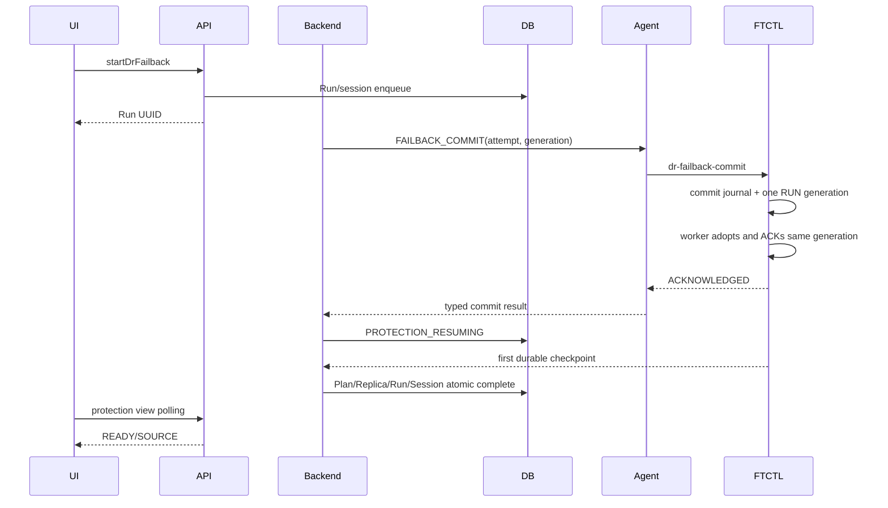
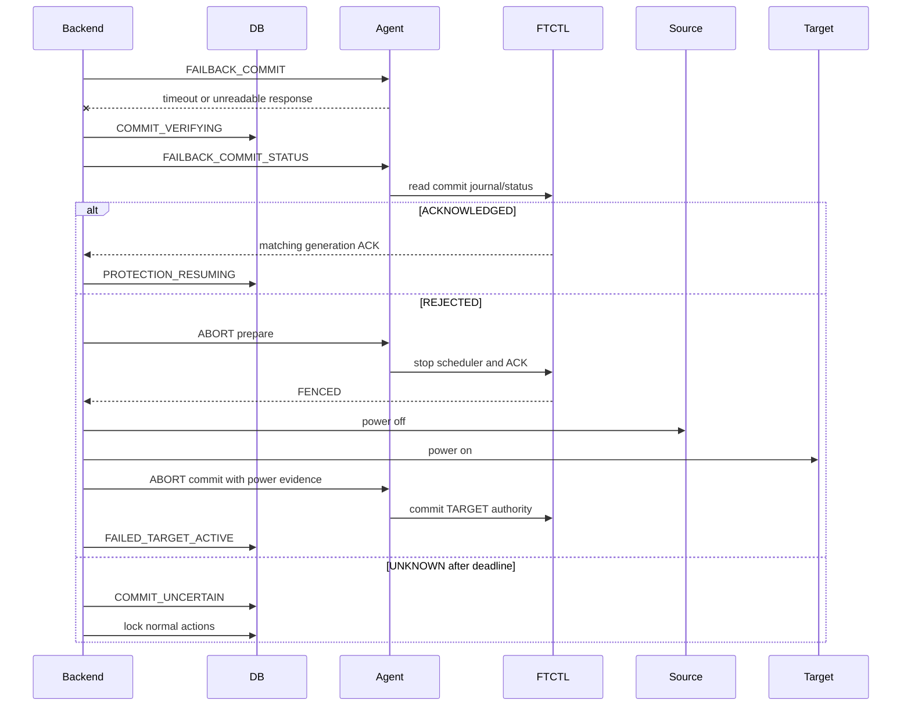

# 575. Cross Hypervisor DR Failback Commit Convergence and Rollback Fencing Design

작성일: 2026-07-27

## 0. Implementation Status (2026-07-27)

Status: implemented and changed-module unit validation passed. Deployment and
live retest evidence are appended after the deployment step.

Implemented ownership:

| Layer | Implementation |
| --- | --- |
| UI | Shows commit outcome, scheduler generation/ACK, scheduler state, rollback fence state, and verification time |
| API | Protection-view snapshot version 3 carries the canonical failback session evidence |
| Backend | `DrFailbackLifecycleServiceImpl` converges `UNKNOWN` through a status probe and never treats transport loss as an immediate rejection |
| Agent | Preserves already-drained FTCTL output and probes `dr-failback-commit-status` after an uncertain commit response |
| FTCTL | Owns durable commit journal, scheduler generation ACK, and two-phase rollback fence |
| DB | `dr_failback_session` stores attempt, outcome, generations, rollback evidence, probe time, and lifecycle version |

`COMMIT_VERIFYING` is a lifecycle transition lock. API eligibility disables
conflicting actions until the commit is acknowledged or a fenced rollback is
completed.

## 1. 목적과 적용 범위

페일백의 VM lifecycle은 성공했지만 FTCTL commit 응답이 불확실한 경우,
Cloud가 즉시 rollback하여 실제 FTCTL authority/scheduler와 충돌하는 문제를
해결한다. UI, API, Backend, Agent, FTCTL, DB가 하나의 canonical lifecycle
결과로 수렴하도록 상태, 오류, retry, rollback 계약을 정의한다.

다음 네 방향에 같은 상태 기계와 완료 조건을 적용한다.

- ABLESTACK -> VMware
- VMware -> VMware
- ABLESTACK -> ABLESTACK
- VMware -> ABLESTACK

하이퍼바이저 차이는 VM power/boot provider와 data-plane driver에만 존재한다.

이 문서는 다음 문서를 보강하며, commit 결과 불확실성, Agent 출력 수집,
scheduler generation, rollback fence에 대해서는 이 문서가 우선한다.

- `522-cross-hypervisor-dr-protection-failover-failback-sequence-design-20260701.md`
- `568-cross-hypervisor-dr-scheduler-service-and-automatic-recovery-design-20260722.md`
- `574-cross-hypervisor-dr-cloud-owned-failback-lifecycle-commit-design-20260726.md`
- FTCTL 문서
  `215-dr-failback-commit-generation-and-rollback-fence-design-20260727.md`

## 2. 실환경 Preflight와 판정

대상 Plan:

```text
2514a846-64a2-4bc7-ba88-38a874410782
```

2026-07-27 읽기 전용 재검증:

| 레이어 | 실제 값 | 판정 |
| --- | --- | --- |
| `dr_plan` | `READY / TARGET / last_run_id=99` | 모순 |
| `dr_replica` | `ERROR / TARGET / POWERED_ON` | Plan과 불일치 |
| Run 99 | `FAILBACK / FAILED / runtime-projection` | 실패 |
| Run 오류 | `DR_STATUS_CYCLE_SNAPSHOT_INCOHERENT` | lifecycle 원인 은폐 |
| failback session | `FAILED / engine_ack=PENDING` | commit 미확정 |
| 대상 VM | `i-2-256-VM / running` | TARGET 서비스 유지 |
| FTCTL unit | `active` | TARGET authority와 충돌 |
| FTCTL control | generation `15`, `run`, `scheduler-start` | worker가 새 generation 생성 |
| FTCTL ACK | generation `15`, `RUNNING` | scheduler 실제 실행 |

실패 당시 lifecycle:

1. reverse checkpoint 440 완료
2. TARGET VM 정지 성공
3. SOURCE VMware VM 기동 성공
4. `FAILBACK_COMMIT` Agent 응답에서 `java.io.IOException: Stream closed`
5. Cloud가 SOURCE를 정지하고 TARGET을 재기동
6. `FAILBACK_ABORT` 전달
7. FTCTL scheduler는 계속 실행되어 cycle 441 `NO_CHANGE` 완료

따라서 현재 결과는 다음과 같다.

- 서비스 안전 복구: TARGET이 실행 중이므로 부분 PASS
- authority 수렴: FAIL
- scheduler fence: FAIL
- Run/session/Plan/Replica 정합성: FAIL
- 다음 페일백 재시도 준비: FAIL

## 3. 오류 원인

### 3.1 FTCTL scheduler generation 경합

현재 `ftctl_dr_scheduler_resume_after_transition()`은 worker를 시작한 뒤
`run` generation을 생성한다. 동시에 새 worker의
`ftctl_dr_scheduler_run()`은 무조건 `scheduler-start` generation을 생성한다.

```text
Cloud commit generation N
worker startup generation N+1
ACK generation N+1
Cloud/FTCTL caller waits generation N
timeout/nonzero
```

실제 scheduler는 실행되지만 commit caller는 실패한다.

### 3.2 Agent가 실제 FTCTL 오류를 `Stream closed`로 덮음

`LibvirtFtctlDrActionCommandWrapper.executeFtctl()`은
`OutputInterpreter.AllLinesParser`를 사용한다. `Script.executeInternal()`은
drain task가 input stream을 읽고 닫은 뒤, nonzero exit에서 같은 input
stream으로 새 `BufferedReader`를 만들고 `processError()`를 호출한다.

```text
Task drains and closes process stdout
process exits nonzero
Script opens the same stream again
OutputInterpreter.processError()
java.io.IOException: Stream closed
```

그 결과 FTCTL의 typed JSON, exit code, generation mismatch/timeout 정보가
Cloud에 전달되지 않는다.

### 3.3 Backend가 UNKNOWN을 REJECTED로 취급

`DrFailbackLifecycleServiceImpl.executeLifecycle()`은 Agent answer가 null이거나
`result=false`면 즉시 예외를 발생시키고 `compensate()`를 실행한다.
실제 commit이 적용됐는지 status를 재조회하지 않는다.

### 3.4 Rollback 순서가 scheduler fence보다 앞섬

현재 compensation:

```text
SOURCE off
TARGET on
FAILBACK_ABORT
```

abort도 scheduler를 정지하지 않는다. 따라서 TARGET 서비스 재기동 후
source-to-target scheduler가 계속 실행될 수 있다.

### 3.5 Projection이 lifecycle 오류를 덮음

latest cycle의 current/completed snapshot이 순간적으로 다르면
FAILBACK lifecycle의 본래 오류 대신
`DR_STATUS_CYCLE_SNAPSHOT_INCOHERENT`가 Run에 기록된다.

### 3.6 Eligibility와 Preflight의 canonical source 부재

Plan은 `READY/TARGET`이고 action eligibility는 failback 가능으로 계산될 수
있지만 `getDrFailbackPreflight`는 `DR_FAILBACK_REQUIRES_TARGET_ACTIVE`를
반환한다. 목록, 상세, 실행 API가 서로 다른 predicate를 사용한다.

## 4. 설계 불변 조건

1. UI/API는 비동기 Run을 생성하고 즉시 반환한다.
2. VM lifecycle은 Cloud Backend가 소유한다.
3. data-plane authority와 scheduler는 FTCTL이 소유한다.
4. Agent는 명령 전달과 결과/상태 수집만 담당한다.
5. Agent transport 오류는 commit 거부를 의미하지 않는다.
6. commit 결과는 `ACKNOWLEDGED`, `REJECTED`, `UNKNOWN`으로 구분한다.
7. `UNKNOWN`에서는 자동 성공과 즉시 rollback을 모두 금지한다.
8. rollback은 scheduler fence를 가장 먼저 수행한다.
9. TARGET authority에서는 forward scheduler가 실행되지 않는다.
10. Plan, Replica, Run, Session은 한 transaction 또는 versioned reconcile로
    수렴한다.
11. lifecycle 오류는 unrelated cycle projection 오류로 덮지 않는다.
12. 목록 action eligibility와 Preflight는 같은 service 결과를 사용한다.
13. 한 시점에 production VM은 하나만 실행한다.
14. 모든 상태 변경은 session/run/idempotency key로 멱등이다.

## 5. Canonical 상태 기계

### 5.1 Commit outcome

```java
public enum DrFailbackCommitOutcome {
    PENDING,
    ACKNOWLEDGED,
    REJECTED,
    UNKNOWN,
    ROLLED_BACK
}
```

### 5.2 Session 상태

| 상태 | 의미 | 허용 작업 |
| --- | --- | --- |
| `DATA_READY` | reverse checkpoint 완료 | lifecycle 계속 |
| `TARGET_STOPPED` | TARGET 실제 OFF | SOURCE start |
| `SOURCE_BOOT_VALIDATED` | SOURCE 실제 ON/boot | commit |
| `COMMIT_REQUESTED` | commit 요청 durable 기록 | status probe |
| `COMMIT_VERIFYING` | 응답 불확실, 결과 조회 중 | probe/reconcile만 |
| `PROTECTION_RESUMING` | ACK 후 첫 durable cycle 대기 | polling |
| `COMPLETED` | SOURCE 보호 복구 완료 | 정상 작업 |
| `ROLLBACK_FENCING` | scheduler STOP 요청 | fence 확인 |
| `ROLLBACK_VM_RECOVERY` | SOURCE OFF, TARGET ON | lifecycle rollback |
| `ROLLBACK_COMMITTING` | TARGET authority commit | abort commit |
| `FAILED_TARGET_ACTIVE` | TARGET 서비스로 안전 복구 | failback retry |
| `COMMIT_UNCERTAIN` | deadline 후에도 권한 미확정 | 운영자 reconcile |

### 5.3 Plan/Replica 상태

| Session | Plan | active side | Replica |
| --- | --- | --- | --- |
| `DATA_READY` ~ `COMMIT_REQUESTED` | `FAILBACK_IN_PROGRESS` | `TARGET` | `READY/POWERED_ON` 또는 transition evidence |
| `COMMIT_VERIFYING` | `FAILBACK_IN_PROGRESS` | `TRANSITION` | 실제 power 표시 |
| `PROTECTION_RESUMING` | `SYNCING` | `SOURCE` | `READY/POWERED_OFF` |
| `COMPLETED` | `READY` | `SOURCE` | `READY/POWERED_OFF` |
| `ROLLBACK_*` | `FAILBACK_IN_PROGRESS` | `TRANSITION` | 실제 power 표시 |
| `FAILED_TARGET_ACTIVE` | `FAILED_OVER_UNPROTECTED` | `TARGET` | `READY/POWERED_ON` |
| `COMMIT_UNCERTAIN` | `ERROR` | `TRANSITION` | 실제 power 표시 |

`READY/TARGET`은 canonical 상태로 허용하지 않는다.

## 6. UI 상세 설계

대상:

- `ui/src/views/infra/dr/DrPlanList.vue`
- `ui/src/views/infra/dr/DrProtectionInfoTab.vue`
- `ui/src/components/dr/DrStatusPill.vue`
- `ui/src/api/dr.js`
- `ui/public/locales/ko_KR.json`
- `ui/public/locales/en.json`

### 6.1 목록과 상세의 상태 분리

한 개의 `상태` 문자열에 authority와 최신 작업을 섞지 않는다.

```text
보호 상태: 페일오버됨 - DR 대상에서 서비스 중
최근 작업: 페일백 실패 - DR 대상 서비스 유지
복제 상태: 중지됨
```

`FAILED_TARGET_ACTIVE`는 일반 `오류`가 아니라 경고 상태로 표시한다.

### 6.2 Protection view

Failback 카드:

```text
단계
commit 결과
실제 SOURCE/TARGET 전원
scheduler fence/ACK generation
rollback 상태
운영 서비스 위치
오류 코드와 사용자 조치
```

내부 예외 `Stream closed`는 기본 화면에 표시하지 않는다. 사용자 메시지는:

```text
페일백 커밋 결과를 확인하는 중입니다.
DR 대상 가상머신의 서비스는 유지됩니다.
```

상세 진단에는 typed code와 correlation ID만 제공한다.

### 6.3 Action gating

UI에서 별도 로직을 재구성하지 않고 API snapshot의 값을 사용한다.

```javascript
canFailback = snapshot.actions.failback.allowed
failbackBlockedReason = snapshot.actions.failback.reasoncode
```

다음 상태에서는 일반 sync, failback retry, reprotect를 모두 잠근다.

```text
COMMIT_REQUESTED
COMMIT_VERIFYING
ROLLBACK_FENCING
ROLLBACK_VM_RECOVERY
ROLLBACK_COMMITTING
COMMIT_UNCERTAIN
```

### 6.4 자동 갱신

상세 화면은 5초 polling을 유지하되 마지막 정상 snapshot을 지우지 않는다.
version이 증가할 때만 lifecycle 카드와 action eligibility를 교체한다.
Run 완료 토스트는 terminal 상태가 확정된 한 번만 표시한다.

## 7. API 상세 설계

### 7.1 Protection view 응답

```json
{
  "snapshotversion": 142,
  "authority": {
    "side": "TARGET",
    "state": "FAILED_OVER_UNPROTECTED",
    "sourcepowerstate": "POWERED_OFF",
    "targetpowerstate": "POWERED_ON"
  },
  "failbacksession": {
    "state": "FAILED_TARGET_ACTIVE",
    "commitoutcome": "ROLLED_BACK",
    "commitattemptid": "...",
    "schedulergeneration": 16,
    "schedulerackgeneration": 16,
    "schedulerstate": "STOPPED",
    "rollbackstate": "COMPLETED",
    "errorcode": "DR_FAILBACK_COMMIT_ACK_TIMEOUT"
  },
  "actions": {
    "failback": {
      "allowed": true,
      "reasoncode": null
    }
  }
}
```

### 7.2 Commit status probe

Cloud 내부 Agent command:

```text
FAILBACK_COMMIT_STATUS
```

context:

```text
planUuid
runUuid
failbackSessionId
commitAttemptId
authorityGeneration
schedulerGeneration
```

결과:

```text
ACKNOWLEDGED
REJECTED
PENDING
NOT_FOUND
CONFLICT
```

### 7.3 Error envelope

API는 HTTP transport와 lifecycle outcome을 분리한다.

```json
{
  "accepted": true,
  "runid": "...",
  "state": "COMMIT_VERIFYING",
  "retryable": true,
  "errorcode": "DR_FAILBACK_COMMIT_OUTCOME_UNKNOWN",
  "correlationid": "..."
}
```

## 8. Backend 상세 설계

대상:

- `DrFailbackLifecycleServiceImpl`
- `DrFailbackPreflightServiceImpl`
- `FtctlDrRuntimeProjectionAdapter`
- `DrProtectionViewServiceImpl`
- `DrPlanServiceImpl`
- `DrResponseGenerator`
- `DrFailbackSessionVO`와 DAO

### 8.1 명령 결과 모델

```java
public final class DrEngineCommitResult {
    private DrFailbackCommitOutcome outcome;
    private String errorCode;
    private String errorMessage;
    private Long schedulerGeneration;
    private Long schedulerAckGeneration;
    private String schedulerState;
    private String rawStatusJson;
}
```

`Answer.getResult()` boolean만으로 commit을 판정하지 않는다.

### 8.2 Commit 실행

```java
persistCommitRequested(session, attemptId);
DrEngineCommitResult result = sendCommit(...);
switch (result.getOutcome()) {
case ACKNOWLEDGED:
    transitionProtectionResuming(...);
    break;
case REJECTED:
    beginRollback(...);
    break;
case UNKNOWN:
case PENDING:
    transitionCommitVerifying(...);
    enqueueCommitProbe(...);
    break;
}
```

timeout, blank output, parse failure, `Stream closed`, Agent disconnect는
`UNKNOWN`이다.

### 8.3 Commit verifier

`DrFailbackCommitVerifier`를 별도 command-side worker로 추가한다.

```text
initial delay = 2s
interval = 2s
deadline = 30s
max dispatch retries = 3
```

각 probe는:

1. FTCTL commit journal 조회
2. authority/session/generation 일치 확인
3. scheduler control/ACK 일치 확인
4. 실제 VM power 재조회
5. 결과를 session에 compare-and-set

`ACKNOWLEDGED`면 lifecycle을 계속한다. 명시적 `REJECTED`면 rollback한다.
deadline 후에도 모르면 `COMMIT_UNCERTAIN`으로 잠그며 자동 power toggle을
금지한다.

### 8.4 2단계 compensation

```java
transition(ROLLBACK_FENCING);
require(sendAbortPrepare(...).schedulerState() == STOPPED);
transition(ROLLBACK_VM_RECOVERY);
ensureSourcePowerState(plan, false);
ensureTargetPowerState(plan, true);
validateTargetPowerOrBoot();
transition(ROLLBACK_COMMITTING);
require(sendAbortCommit(...).outcome() == ACKNOWLEDGED);
completeRollbackTransaction();
```

fence 실패 시 VM을 자동 전환하지 않고 `COMMIT_UNCERTAIN`으로 둔다.

### 8.5 Projection 우선순위

Run 오류 소유권:

```text
lifecycle terminal error
  > authority safety error
  > scheduler control error
  > cycle snapshot projection error
```

FAILBACK Run이 lifecycle 단계에 있으면 cycle snapshot 불일치는
`projectionWarning`에만 기록하고 `dr_run.error_code`를 덮지 않는다.

### 8.6 Atomic completion

SOURCE protection 완료 transaction:

```text
session = COMPLETED / ACKNOWLEDGED
plan = READY / SOURCE
replica = READY / POWERED_OFF / SOURCE
run = SUCCEEDED
runtime scheduler generation/ACK = matching
snapshot version increment
```

Rollback 완료 transaction:

```text
session = FAILED_TARGET_ACTIVE / ROLLED_BACK
plan = FAILED_OVER_UNPROTECTED / TARGET
replica = READY / POWERED_ON / TARGET
run = FAILED with original lifecycle error
runtime scheduler desired/state = STOPPED
snapshot version increment
```

### 8.7 Canonical eligibility

`DrActionEligibilityService`를 도입하거나 기존 eligibility builder를 단일
service로 승격한다.

```java
DrActionDecision evaluateFailback(DrPlanVO plan,
        DrReplicaVO replica,
        DrFailbackSessionVO session,
        DrPlanRuntimeVO runtime,
        DrPowerEvidence power);
```

`listDrPlans`, `getDrPlan`, `getDrFailbackPreflight`,
`getDrProtectionView`, `startDrFailback`이 같은 결과를 사용한다.

## 9. Agent 상세 설계

대상:

- `LibvirtFtctlDrActionCommandWrapper`
- `LibvirtFtctlDrStatusCommandWrapper`
- `LibvirtFtctlDrCommandHelper`
- `Script`
- `OutputInterpreter`

### 9.1 `Script` nonzero drain 수정

`interpreter.drain()==true`면 drain task가 이미 stdout을 소유한다.
nonzero exit에서도 새 reader를 만들지 않고 `task.getResult()`를 사용한다.

```java
if (process.exitValue() != 0) {
    if (interpreter != null && interpreter.drain()) {
        return task.getResult();
    }
    return interpreter != null
            ? interpreter.processError(ir)
            : String.valueOf(process.exitValue());
}
```

`Task` 완료와 exit value를 포함하는 typed result가 필요하면
`ScriptExecutionResult`를 추가하되 기존 `execute()` 호환성을 유지한다.

### 9.2 FTCTL action result

`FtctlDrActionAnswer`에 다음을 추가한다.

```text
outcome
exitCode
errorCode
controlGeneration
controlAckGeneration
commitPhase
rollbackPhase
rawPayload
```

stdout JSON이 있으면 exit code가 nonzero여도 먼저 parse한다.

### 9.3 Ambiguous response probe

commit/abort control action에서 다음은 status probe 대상이다.

```text
timeout
blank output
unparseable output
Stream closed
Agent channel interruption
```

현재 `shouldProbeStatus()`의 timeout-only 조건을 typed ambiguity 판정으로
확장한다. long-running action의 acceptance probe와 commit outcome probe는
별도 함수로 둔다.

## 10. FTCTL 상세 설계

규범 구현은 qemu 문서 215를 따른다.

핵심 변경:

- caller와 worker가 공유하는 단일 control generation
- worker의 pending generation 채택
- durable failback commit journal
- idempotent commit status 조회
- abort prepare/commit 2단계 fence
- TARGET authority에서 forward cycle hard block

신규/확장 action:

```text
dr-failback-commit
dr-failback-commit-status
dr-failback-abort --phase prepare
dr-failback-abort --phase commit
```

## 11. DB 상세 설계

### 11.1 `dr_failback_session` 확장

모든 upgrade SQL과 `setup/db/create-schema.sql`을 함께 수정한다.

```sql
ALTER TABLE `cloud`.`dr_failback_session`
  ADD COLUMN `commit_attempt_id` varchar(64) DEFAULT NULL
    AFTER `engine_ack_state`,
  ADD COLUMN `commit_outcome` varchar(32) NOT NULL DEFAULT 'PENDING'
    AFTER `commit_attempt_id`,
  ADD COLUMN `commit_requested_at` datetime DEFAULT NULL
    AFTER `commit_outcome`,
  ADD COLUMN `commit_verified_at` datetime DEFAULT NULL
    AFTER `commit_requested_at`,
  ADD COLUMN `scheduler_generation` bigint unsigned DEFAULT NULL
    AFTER `commit_verified_at`,
  ADD COLUMN `scheduler_ack_generation` bigint unsigned DEFAULT NULL
    AFTER `scheduler_generation`,
  ADD COLUMN `scheduler_state` varchar(32) DEFAULT NULL
    AFTER `scheduler_ack_generation`,
  ADD COLUMN `rollback_state` varchar(32) NOT NULL DEFAULT 'NONE'
    AFTER `scheduler_state`,
  ADD COLUMN `rollback_generation` bigint unsigned DEFAULT NULL
    AFTER `rollback_state`,
  ADD COLUMN `rollback_requested_at` datetime DEFAULT NULL
    AFTER `rollback_generation`,
  ADD COLUMN `rollback_verified_at` datetime DEFAULT NULL
    AFTER `rollback_requested_at`,
  ADD COLUMN `last_probe_at` datetime DEFAULT NULL
    AFTER `rollback_verified_at`,
  ADD COLUMN `version` bigint unsigned NOT NULL DEFAULT 0
    AFTER `last_probe_at`,
  ADD UNIQUE KEY `uk_dr_failback_session_commit_attempt`
    (`commit_attempt_id`),
  ADD KEY `idx_dr_failback_session_commit_probe`
    (`commit_outcome`,`last_probe_at`);
```

### 11.2 Compare-and-set

DAO update:

```sql
UPDATE dr_failback_session
   SET state=?, commit_outcome=?, version=version+1, updated=NOW()
 WHERE id=? AND version=? AND removed IS NULL;
```

영향 행이 0이면 다시 읽고 terminal/idempotent 결과를 반환한다.

### 11.3 Backfill

```text
COMPLETED + ACKNOWLEDGED -> commit_outcome=ACKNOWLEDGED
FAILED/ABORTED + TARGET active -> commit_outcome=ROLLED_BACK
PENDING/FAILED + evidence 불충분 -> commit_outcome=UNKNOWN
```

현재 `READY/TARGET` Plan은 자동 성공 처리하지 않는다. 실제 power,
FTCTL authority, scheduler fence를 probe한 뒤
`FAILED_OVER_UNPROTECTED/TARGET` 또는 `COMMIT_UNCERTAIN/TRANSITION`으로
보정한다.

## 12. 비동기 시퀀스

### 12.1 정상 commit



### 12.2 응답 불확실과 rollback



## 13. 오류 코드

| 코드 | 레이어 | retry | 의미 |
| --- | --- | --- | --- |
| `DR_AGENT_OUTPUT_STREAM_CLOSED` | Agent | yes | drained output 재읽기 오류 |
| `DR_FAILBACK_COMMIT_OUTCOME_UNKNOWN` | Backend | yes | commit 결과 probe 필요 |
| `DR_FAILBACK_COMMIT_REJECTED` | FTCTL | no | 명시적 contract 거부 |
| `DR_FAILBACK_COMMIT_ACK_TIMEOUT` | FTCTL | yes | matching generation ACK 없음 |
| `DR_FAILBACK_ROLLBACK_FENCE_FAILED` | FTCTL/Backend | no | scheduler STOP fence 실패 |
| `DR_FAILBACK_ROLLBACK_INCOMPLETE` | Backend | no | VM/authority rollback 미완료 |
| `DR_FAILBACK_STATE_INVARIANT_VIOLATION` | Backend/DB | no | Plan/Replica/Session 모순 |
| `DR_FAILBACK_ACTION_STATE_MISMATCH` | API | no | eligibility와 preflight 불일치 |

## 14. 테스트 설계

### 14.1 Cloud unit test

```text
Agent false + FTCTL ACK -> commit verifier continues, no rollback
Agent false + FTCTL REJECTED -> fenced rollback
UNKNOWN before deadline -> COMMIT_VERIFYING
UNKNOWN after deadline -> COMMIT_UNCERTAIN, no VM toggle
rollback fence failure -> source/target lifecycle untouched
rollback success -> FAILED_OVER_UNPROTECTED/TARGET
lifecycle error not overwritten by cycle projection error
eligibility == preflight == protection view action
```

### 14.2 Agent/Script test

```text
nonzero + AllLinesParser returns drained JSON without Stream closed
nonzero JSON preserves exit code and typed error
timeout/blank/unparseable commit triggers status probe
commit probe maps journal state to typed outcome
```

### 14.3 FTCTL test

문서 215의 실제 worker generation/rollback fence selftest를 모두 실행한다.
resume 함수를 stub한 테스트만으로 PASS를 선언하지 않는다.

### 14.4 DB/API/UI test

```text
schema upgrade and create-schema parity
CAS conflict retries without duplicate side effects
READY/TARGET rejected as canonical
FAILED_TARGET_ACTIVE warning rendering
COMMIT_VERIFYING action lock
last-good snapshot retained during polling
Korean/English error and action reason labels
```

### 14.5 실환경 수용 테스트

Linux와 Windows 각각:

1. normal failback success
2. Agent 응답 timeout 주입 후 status-probe success
3. explicit FTCTL reject 후 fenced rollback
4. scheduler bootstrap 직전 worker restart
5. duplicate commit 재전송
6. Management restart during `COMMIT_VERIFYING`
7. SOURCE/TARGET 실제 power와 DB/UI 대조
8. rollback 뒤 TARGET에서 서비스 유지, scheduler STOP 확인

## 15. 권장 구현 순서

1. FTCTL control protocol v4와 실제 worker selftest
2. FTCTL commit journal/status와 2단계 abort
3. `Script` nonzero drain 수정과 utility regression test
4. Agent typed outcome와 ambiguous status probe
5. DB typed columns, VO/DAO CAS
6. Backend commit verifier와 2단계 compensation
7. Projection 오류 우선순위와 atomic completion
8. canonical eligibility/preflight service
9. API protection snapshot 확장
10. UI 상태/작업/메시지 정합성
11. 기존 `READY/TARGET` 데이터 read-only audit와 fenced reconcile
12. FTCTL 선배포, Agent/Cloud/DB/UI 동시 배포
13. Linux 정상/장애 주입 acceptance
14. Windows 정상/장애 주입 acceptance

## 16. 배포 보호 장치

1. 배포 전 active FAILBACK/REPROTECT session이 없어야 한다.
2. FTCTL capability
   `dr-failback-control-generation-v4`,
   `dr-failback-commit-journal-v1`,
   `dr-failback-rollback-fence-v1`을 먼저 배포한다.
3. Agent가 typed outcome capability를 확인하기 전 Cloud verifier를 활성화하지
   않는다.
4. DB migration은 nullable/default-safe로 먼저 적용한다.
5. 기존 Plan reconcile은 dry-run 결과를 검토한 뒤 batch 실행한다.
6. Cloud UI는 active webapp의 `WEB-INF`를 보존하고 static asset만 overlay한다.
7. rollback 시 새 lifecycle controller를 disable하고 transition Plan을 자동
   전환하지 않는다.

## 17. AS-IS / TO-BE

| 레이어 | 오류 원인 | AS-IS | TO-BE |
| --- | --- | --- | --- |
| UI | authority/작업 혼합 | `READY` 또는 `오류`만 표시 | 보호, 최근 작업, 실제 서비스 위치 분리 |
| UI 작업 | predicate 중복 | 상세/목록별 활성 조건 차이 | API canonical action decision 사용 |
| API | boolean 중심 | commit 실패/불확실 구분 없음 | typed outcome와 correlation/generation |
| Preflight | 별도 판정 | eligibility와 모순 | 한 service에서 동일 snapshot |
| Backend | false 즉시 보상 | 실제 commit 여부 확인 없이 power rollback | `COMMIT_VERIFYING` 후 ACK/REJECT 확인 |
| Backend rollback | VM 먼저 전환 | scheduler 실행 중 TARGET 재기동 가능 | scheduler fence 후 VM/authority rollback |
| Projection | cycle 오류 우선 | lifecycle 원인이 덮임 | lifecycle 오류 우선, cycle은 warning |
| Agent | drained stream 재읽기 | `Stream closed`로 원인 손실 | drained output와 exit code 보존 |
| Agent probe | timeout만 확인 | parse/stream 오류 미확인 | 모든 ambiguous commit status probe |
| FTCTL generation | caller/worker 이중 생성 | ACK generation 불일치 | transition당 단일 generation |
| FTCTL commit | runtime write 중심 | 재시도 시 실행 위치 불명확 | durable commit journal과 멱등 resume |
| FTCTL abort | authority 필드만 변경 | scheduler가 계속 실행 가능 | STOP fence, VM rollback, TARGET commit |
| DB | ACK/rollback 세부 없음 | `FAILED/PENDING`만 남음 | commit/ACK/generation/rollback typed evidence |
| Plan 상태 | `READY/TARGET` 허용 | 서비스/보호 의미 모순 | `FAILED_OVER_UNPROTECTED/TARGET` |
| 테스트 | scheduler resume stub | 핵심 경합 미검증 | 실제 worker/control/ACK 통합 검증 |

## 18. 최종 PASS 조건

정상 페일백:

```text
commit outcome == ACKNOWLEDGED
requested scheduler generation == ACK generation
source actual power == POWERED_ON
target actual power == POWERED_OFF
active side == SOURCE
scheduler == RUNNING
post-failback durable checkpoint exists
plan/replica/run/session are transactionally consistent
```

실패 후 안전 rollback:

```text
rollback fence == STOPPED/IDLE ACK
source actual power == POWERED_OFF
target actual power == POWERED_ON
active side == TARGET
scheduler desired/actual == STOPPED
plan == FAILED_OVER_UNPROTECTED
replica == READY/TARGET/POWERED_ON
run retains original lifecycle error
failback retry eligibility == preflight result
```

위 두 결과 중 하나로 수렴하지 않으면 `COMMIT_UNCERTAIN`이며 PASS가 아니다.
## 18. Implementation Verification

Changed-module verification:

| Module | Verification |
| --- | --- |
| `core` | compile/install succeeds with the 2026-07-27 Agent command contract |
| KVM Agent | `LibvirtFtctlCommandWrappersTest`: commit probe, drained output, and rollback phase arguments |
| DR plugin | lifecycle convergence, projection, eligibility, and protection-view cache tests |
| UI | UTF-8 locale JSON parse and production build |
| DB | upgrade scripts are idempotent and columns match `DrFailbackSessionVO` |

Live acceptance requires:

1. failback is accepted asynchronously;
2. target VM stops and source VM starts under Cloud ownership;
3. Agent returns or recovers a typed FTCTL commit outcome;
4. `UNKNOWN` remains `COMMIT_VERIFYING` and does not trigger an unsafe
   compensation;
5. an explicit rejection fences the scheduler before restoring target
   authority;
6. acknowledged commit resumes source-side protection and reaches a new durable
   checkpoint;
7. Plan, Replica, Run, Session, protection-view cache, and UI show the same
   authority.

### AS-IS / TO-BE

| Layer | AS-IS | TO-BE |
| --- | --- | --- |
| UI/API | Generic failure or stale authority | Canonical transition and typed evidence |
| Backend | Transport error implied rejection | `ACKNOWLEDGED/UNKNOWN/REJECTED/ROLLED_BACK` convergence |
| Agent | Nonzero exit could collapse to `Stream closed` | Output-preserving parser plus status probe |
| FTCTL | Generation race and non-fenced abort | Protocol v4 generation adoption and STOP-first rollback |
| DB | Session lacked durable commit evidence | Versioned commit, ACK, rollback, and probe fields |
| Actions | Conflicting operations could re-enable | `COMMIT_VERIFYING` locks all conflicting actions |

## 19. Live Deployment Preflight Addendum

The 2026-07-27 deployment and rollback preflight found two environment-specific
gaps and folded them back into the implementation contract.

1. The live database does not accept `ADD COLUMN IF NOT EXISTS` in the
   multi-column `ALTER TABLE` form. Versioned upgrade scripts therefore use
   ordinary `ADD COLUMN` statements, while fresh installations create the
   final table shape directly.
2. A scheduler writes a durable `STOPPED/IDLE` ACK and then exits immediately.
   FTCTL must validate that terminal ACK against the owner tuple captured
   before the request. Requiring the worker to remain alive after STOP creates
   a false timeout and prevents Cloud from completing fenced rollback.

### AS-IS / TO-BE

| Area | AS-IS | TO-BE |
| --- | --- | --- |
| DB upgrade | Unsupported multi-column `IF NOT EXISTS` syntax | Versioned plain `ADD COLUMN`; final shape in create schema |
| STOP ACK | ACK accepted only while worker remained alive | Durable ACK accepted by generation and captured owner tuple |
| Rollback cleanup | Worker stopped but caller reported timeout | STOP fence converges and rollback commit can proceed |

## 20. Current Error Versus Audit Error

The FTCTL rollback commit clears transient failback error fields after target
authority has been restored. Cloud then treats the states differently:

- the failed `dr_run` remains unchanged as audit history;
- `dr_failback_session` becomes `ABORTED/ROLLED_BACK/COMPLETED`;
- the current Plan and runtime have no active error;
- the runtime is `FAILED_OVER_UNPROTECTED` with scheduler desired and actual
  state both `STOPPED`;
- failback preflight can be evaluated again from current site, power, and
  checkpoint evidence.

When a failed `FAILBACK` run carries complete rollback evidence
(`ROLLED_BACK`, `COMPLETED`, source OFF, target ON), runtime projection keeps
the run failed for audit but routes the current Plan through
`preserveFailedOverTargetAuthority()`. A stale operation failure can therefore
never overwrite the serving TARGET authority.

| Area | AS-IS | TO-BE |
| --- | --- | --- |
| FTCTL status | Rollback completes but stale failback error remains | Rollback commit clears current error fields |
| Cloud projection | Reimports stale engine error after DB cleanup | Projects target authority without a current error |
| History | Current state and failed attempt look identical | Failed run remains visible only as immutable history |

## 21. Commit Envelope And Deterministic Failure Amendment - 2026-08-06

Commit convergence begins only after Cloud persists a complete versioned
commit envelope. A command rejected for missing session, checkpoint, authority
generation, attempt ID, or envelope hash is deterministic and must not enter
`COMMIT_VERIFYING`. Status probing is reserved for transport ambiguity after
a recorded dispatch attempt.

The envelope, pre-power gate, DB dispatch state, and current-session recovery
algorithm are defined by document 597. Its authority-generation rule
supersedes checkpoint or Run-ID fallback behavior.

## 2026-07-27 Late ACK and Projection Convergence Addendum

실환경에서는 commit 호출이 timeout된 뒤 scheduler가 같은 generation의
`RUNNING/IDLE` ACK를 기록하고 정상 증분 cycle까지 진행했지만, Cloud의 Plan,
Run, failback session, Replica 및 protection cache가 `COMMIT_VERIFYING`에
남았다. 따라서 timeout은 terminal failure가 아니며 다음 reconciliation이
필수다.

1. FTCTL commit-status에서 현재 control/ACK를 재검증한다.
2. Cloud lifecycle reconciler가 전환 상태를 5초 주기로 다시 조회한다.
3. SOURCE ON, TARGET OFF, ACK owner/generation 일치 및 post-failback checkpoint를
   확인한다.
4. Plan/Run/Session/Replica를 한 transaction으로 terminal 수렴시키고 protection
   cache를 무효화한다.
5. UI는 lifecycle, protection, 실제 serving side 및 cache freshness를 분리해
   표시한다.

operation Run, Plan authority 및 cycle producer Run은 서로 다른 소유권이다.
Agent status 요청도 `OPERATION`과 `PLAN_AUTHORITY` scope를 구분해야 한다.
세부 코드 계약, DB transaction, API schema와 구현 순서는
[576-cross-hypervisor-dr-failback-late-ack-and-projection-convergence-design-20260727.md](576-cross-hypervisor-dr-failback-late-ack-and-projection-convergence-design-20260727.md)를
우선한다.

## 22. Rollback cleanup retry amendment - 2026-08-25

`ROLLBACK_FAILED`는 serving TARGET authority를 보존한 채 FTCTL abort
acknowledgement를 다시 받아야 하는 중간 상태다. DAO reconciliation
candidate에는 포함하지만 lifecycle terminal predicate에는 포함하지 않는다.
Reconciler는 같은 Session/Run으로 abort prepare와 commit을 재시도하고,
정리 완료 transaction에서 Session과 Run을 각각 `FAILED`로 종결한다.
엔진이 이미 `ROLLED_BACK`을 보고한 경우에도 Session만 `ABORTED`로 바꾸지
않고 같은 transaction을 호출한다. 배포 전에 남은 `ABORTED + RUNNING`
조합은 다음 runtime projection에서 동일하게 수렴한다.

| AS-IS | TO-BE |
| --- | --- |
| `ROLLBACK_FAILED`를 terminal로 판정해 retry branch가 도달 불가 | recoverable cleanup으로 분류해 기존 retry branch 실행 |
| Run은 `RUNNING`으로 남고 UI 재실행 차단 | 같은 Run을 authoritative `FAILED`로 종결 |
| `ROLLED_BACK` status가 Session만 `ABORTED` 처리 | Session/Run/Plan/Replica/Step/cache 원자 종결 |
| 운영자가 DB를 수동 정리해야 재테스트 가능 | 패치 배포 후 reconciler가 자동 수렴 |

## 23. Cross-Run rollback isolation amendment - 2026-08-25

Rollback fencing is owned by the failed Run. Its status may update Plan
authority only while no newer live transition owns the Plan status. Runtime
projection must reject operation evidence whose Run/session identity differs
from the Cloud Run being reconciled. A delayed abort is therefore unable to
replace a newer Failback Session identity or terminalize that newer Run.

Session/Run mixed terminal pairs are completed by the same atomic failure
convergence transaction. Until that convergence finishes, admission rejects a
new Failback instead of relying on a force flag to overlap two destructive
transitions. FTCTL treats an already completed abort as idempotent and does not
publish an old Run over a newer active owner.

## 24. Failback startup `run_not_found` identity quarantine - 2026-08-25

새 Failback 명령이 Agent에서 수락된 직후에는 Run 파일 생성보다 Cloud의 첫
OPERATION 조회가 먼저 도착할 수 있다. 이때 FTCTL은 요청한 `run_uuid`를
응답에 반사하면서도 Plan 범위의 과거 `control_request_run_uuid`와
`failback_session_id`를 함께 제공할 수 있다. 이 혼합 응답은 새 Run의 상태가
아니며, 과거 rollback 결과로 새 Session을 종결해서는 안 된다.

Cloud는 Failback OPERATION 상태의 모든 비어 있지 않은 식별자를 교집합으로
검증한다. `run_uuid`, `control_request_run_uuid`, Run UUID를 포함한 typed
`failback_session_id` 중 하나라도 현재 Run과 충돌하면 해당 payload를 격리한다.
불투명 레거시 Session ID는 호환을 위해 소유권 식별자로 사용하지 않는다.
`result=run_not_found`는 Run 생성
유예 시간 동안 lifecycle reconcile보다 먼저 처리하고 재조회한다. 식별자가 전혀
없는 레거시 상태만 기존 호환 경로를 사용한다.

| Area | AS-IS | TO-BE |
| --- | --- | --- |
| Run ownership | 식별자 하나만 일치해도 새 Run 상태로 수용 | 명시된 모든 식별자가 현재 Run과 일치해야 수용 |
| Startup status | `run_not_found`의 과거 rollback 필드를 먼저 reconcile | 생성 유예로 격리한 뒤 새 Run 상태를 재조회 |
| Failback Session | 새 Session ID가 과거 Session ID로 교체될 수 있음 | Session/Run 소유권을 불변으로 유지 |
| Regression scope | 공유 상태 변경이 성공 경로에 영향 가능 | 전송·RBD·VM lifecycle은 유지하고 상태 투영만 보강 |
## Failback cancellation convergence

An accepted `cancelDrRun` request for a Failback run is not terminal until both
the engine runtime and the Cloud-owned authority transition have converged.
After FTCTL returns authoritative `CANCELED` and drained runtime evidence, Cloud
must fence the canceled Failback transition, power off the source VM that was
started speculatively, restore the serving target VM, and commit the FTCTL
Failback abort envelope. Only then may the Run become `CANCELED`.

The cancellation transaction terminates the Failback session as `ABORTED`,
records `ROLLED_BACK`, projects `FAILED_OVER / TARGET`, clears stale plan error
metadata, restores the replica to `FAILED_OVER / POWERED_ON / TARGET`, and
invalidates the plan view cache. If any compensation step fails, the Run stays
`CANCEL_REQUESTED`; it must not expose a false terminal state or allow another
DR action to start.

| Concern | AS-IS | TO-BE |
| --- | --- | --- |
| FTCTL cancel ACK | Terminates only the Run | Opens Cloud authority compensation |
| Failback session | Can remain `COMMIT_VERIFYING` | Terminates as `ABORTED / ROLLED_BACK` |
| VM power | Source may stay on while target is off | Source off, serving target on |
| Plan authority | DB authority may disagree with power state | `FAILED_OVER / TARGET` is projected atomically |
| Retry safety | A stale active session blocks later menus | Run remains non-terminal until compensation succeeds |

The Agent semantic parser treats a canceled Run as terminal failure for normal
actions. The exception is the `FAILBACK_ABORT` prepare phase: FTCTL may retain
`state=CANCELED` while publishing `result=ok` and
`rollback_state=FENCED`. This tuple is an authoritative fence acknowledgement,
not a failed abort. The exception is limited to prepare; abort commit still
must publish the target-authority terminal state.
## Canceled Failback terminal acknowledgement

`dr-failback-abort --phase=commit` is a terminal state transition, not a new work admission. The engine therefore may return `accepted=false` after it has already converged to `FAILED_OVER`, `ABORTED`, and `ROLLED_BACK`. The Agent must accept this response only when all durable terminal evidence agrees: rollback is `COMPLETED`, the active side is `TARGET`, the source is `POWERED_OFF`, the target is `POWERED_ON`, and no error code is present. Any incomplete combination remains a failure and keeps Cloud in commit verification.

## 29. Canceled Failback orphan projection recovery - 2026-08-25

Cloud may finish the user-facing Run cancellation before the asynchronous
Failback compensation Session reaches `ABORTED / ROLLED_BACK`. In that narrow
window `findActiveByPlanId()` returns no Run, while the latest canceled Failback
still owns a non-terminal compensation Session such as `ROLLBACK_FAILED` with
`DR_FAILBACK_CANCEL_ROLLBACK_PENDING`. The normal committed-target early return
must not bypass that Session.

`DrFailbackLifecycleService` is the single owner of the compensation predicate.
Runtime projection first selects the active Run. If none exists, it may select
only the latest canceled Failback for which the lifecycle service confirms that
compensation is still required. The subsequent authoritative operation status
is then reconciled by the existing cancellation transaction. Arbitrary terminal
Runs are not revived, and transfer, scheduler, materialization, and provider-pair
contracts are unchanged.

| Concern | AS-IS | TO-BE |
| --- | --- | --- |
| Projection selection | No active Run causes an immediate target-authority return | Pending canceled Failback compensation remains projectable |
| Session terminalization | Actual VM power is restored but Session can remain `ROLLBACK_FAILED` | Existing lifecycle transaction converges Session to `ABORTED / ROLLED_BACK` |
| Scope | A broad latest-Run fallback could replay old operations | Only a lifecycle-confirmed canceled Failback is selected |
| Regression boundary | Shared data path could be disturbed | Status selection only; validated VMware and RBD transfer paths remain unchanged |

## 30. Completed abort idempotent prepare acknowledgement - 2026-08-25

Cancellation compensation can be retried after FTCTL has already completed the
abort commit. In that case a repeated `FAILBACK_ABORT prepare` does not regress
the engine to `CANCELED / FENCED`; FTCTL returns the durable terminal tuple
`FAILED_OVER / ABORTED / ROLLED_BACK / COMPLETED / TARGET` with source off and
target on. The Agent must accept that exact tuple for either rollback phase.

This is not a general `accepted=false` exception. The response is successful
only when `result` is successful, no error code exists, rollback and Cloud
lifecycle are terminal, authority is TARGET, and both power states agree. A
partial terminal tuple remains rejected. The change is limited to the Agent
semantic acknowledgement and does not alter transfer, provider-pair, scheduler,
or VMware contracts.

| Concern | AS-IS | TO-BE |
| --- | --- | --- |
| Repeated prepare | Completed abort is rejected because the phase is not commit | Exact completed abort tuple is an idempotent acknowledgement |
| Cloud compensation | Session retries forever in `ROLLBACK_FAILED` | Existing compensation transaction can converge the Session |
| Failure safety | Broad `accepted=false` handling could hide failures | All terminal, authority, power, and error fields must match |
| Validated paths | Shared runtime behavior could regress | Agent response classification only; data-plane behavior is unchanged |

## 31. ABLESTACK RBD forward transport restoration amendment - 2026-08-25

`ABLESTACK_TO_ABLESTACK` Failback commit은 reverse write의 완료만으로 끝나지
않는다. Failover 중 중지한 replica-site Plan-owned RBD export를 다시 시작하고
Agent가 qemu-nbd endpoint를 검증한 뒤에만 SOURCE authority와 original
scheduler를 커밋한다. 이 단계는 `FORWARD_TRANSPORT_PREPARING`과
`FORWARD_TRANSPORT_READY`로 Session에 투영한다.

Forward export 준비가 실패하면 Cloud는 authority commit을 호출하지 않는다.
rollback은 source VM을 끄고, forward export를 중지하고, target VM을 켠 뒤
TARGET authority를 복구한다. 성공 commit 이후에는 required post-Failback
checkpoint가 durable해질 때까지 Run을 `PROTECTION_RESUMING`으로 유지한다.

| Concern | AS-IS | TO-BE |
| --- | --- | --- |
| Forward transport | Persisted intent가 `STOPPED`인 채 scheduler 재개 | Persisted profile로 export를 재기동하고 endpoint 검증 |
| Commit barrier | Source boot가 첫 외부 barrier | Export ready가 source boot보다 앞선 barrier |
| Rollback | Target VM 복구와 export ownership 관계 불명확 | Export stop을 확인한 뒤 target VM 복구 |
| Terminal result | VM 전환 성공과 보호 재개 실패가 혼재 | 첫 forward durable checkpoint까지 하나의 Failback Run으로 종결 |
| Scope | 공통 Failback 변경으로 VMware 회귀 가능 | Remote KVM-to-KVM RBD route에만 적용 |
