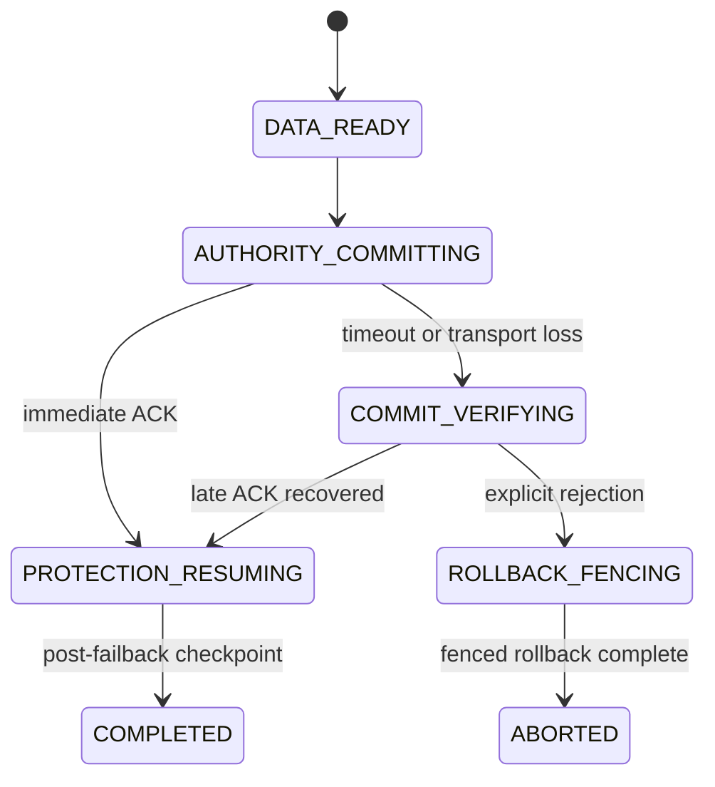
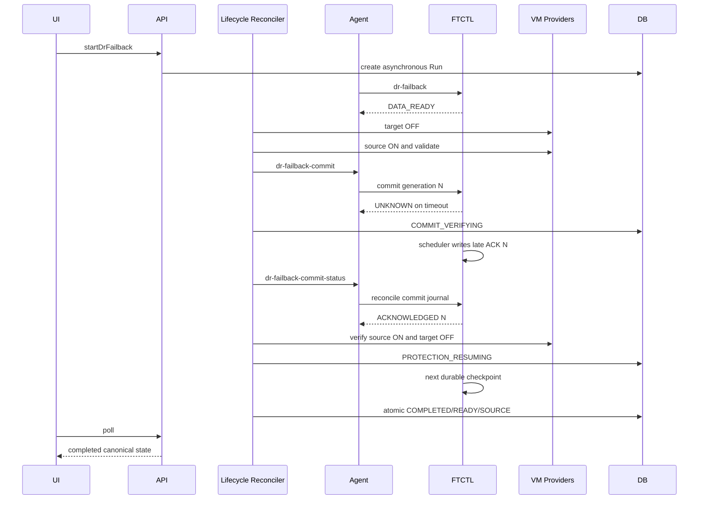

# 576. Cross Hypervisor DR Failback Late ACK and Projection Convergence Design

작성일: 2026-07-27

상태: 설계 완료, 구현 대기

## 1. 목적

페일백의 실제 VM 전환과 데이터 복제는 성공했지만 Cloud의 Plan, Run,
failback session, Replica, 보호 화면 cache가 terminal 상태로 수렴하지 않는
문제를 해결한다.

적용 레이어:

- UI
- API
- Backend
- Agent
- FTCTL
- DB

FTCTL 내부 상태 계약은 qemu 문서
`216-dr-failback-late-ack-and-authority-snapshot-convergence-design-20260727.md`
를 따른다.

## 2. 라이브 오류 증거

Plan:

```text
2514a846-64a2-4bc7-ba88-38a874410782
```

Failback Run:

```text
77ee629a-bc8a-44b2-b05b-cf24b4696d32
```

### 실제 인프라

| 항목 | 실제 상태 |
| --- | --- |
| VMware 원본 `w22-01` | `poweredOn` |
| VMware Tools | `guestToolsRunning` |
| ABLESTACK 복제 `w22-01-dr` | `Stopped` |
| scheduler | `RUNNING/HEALTHY` |
| control generation/ACK | `21/21` |
| 최신 증분 checkpoint | `463` |

### Cloud/FTCTL 영속 상태

| 계층 | 상태 |
| --- | --- |
| FTCTL commit journal | `UNKNOWN`, generation `21`, ACK `19` |
| Cloud `dr_plan` | `COMMIT_VERIFYING / SOURCE` |
| Cloud `dr_failback_session` | `COMMIT_VERIFYING / UNKNOWN` |
| Cloud `dr_run` | `ACCEPTED`, 완료 시각 없음 |
| Cloud `dr_replica` | `FAILED_OVER / POWERED_ON / TARGET` |
| list API | raw state `COMMIT_VERIFYING`, effective state `READY` |
| protection cache | 과거 TARGET authority 및 이전 오류 보존 |

실제 serving authority와 Cloud projection이 불일치하므로 End-to-End
판정은 FAIL이다.

## 3. 오류 원인

### 3.1 FTCTL late ACK 수렴 누락

FTCTL이 timeout 당시의 `UNKNOWN`을 보존하고, 이후 동일 generation의
`RUNNING` ACK를 terminal commit으로 승격하지 않는다.

### 3.2 Cloud lifecycle가 이벤트성 호출에 의존

`DrFailbackLifecycleServiceImpl`은 projection refresh가 session을 다시
전달할 때 lifecycle executor를 제출한다. UI refresh가 실패하거나 projection
validation이 먼저 실패하면 `COMMIT_VERIFYING` probe가 지속되지 않는다.

### 3.3 operation과 Plan authority 혼동

failback Run은 operation identity이고 최신 복제 cycle은 장기 sync producer
Run이 생산한다. 두 Run UUID가 다르다는 것은 정상인데 status wrapper와
projection validation이 이를 하나의 Run으로 취급할 수 있다.

### 3.4 cycle 스냅샷 필드 혼합

cycle sequence/token은 Plan authority에서 가져오고 NBD teardown 필드는
operation Run에서 가져오면 `incrementalVerified=true`이면서
`nbdTeardownState`가 비어 있는 가짜 혼합 스냅샷이 생성된다.

### 3.5 DB terminal transaction 부재

ACK 수신 후 Plan, Session, Run, Replica, cache invalidation이 하나의
transaction/lock 경계로 갱신되지 않는다.

## 4. 목표 상태

late ACK와 post-failback checkpoint를 확인하면 다음 상태로 수렴한다.

```text
dr_plan.state = READY
dr_plan.active_side = SOURCE
dr_run.state = SUCCEEDED
dr_run.completed != null
dr_failback_session.state = COMPLETED
dr_failback_session.commit_outcome = ACKNOWLEDGED
dr_failback_session.engine_ack_state = ACKNOWLEDGED
dr_replica.state = READY
dr_replica.power_state = POWERED_OFF
dr_replica.active_side = SOURCE
dr_plan_runtime.protection_state = READY
dr_plan_runtime.scheduler_state = RUNNING
protection cache authority = SOURCE
```

## 5. UI 설계

대상 파일:

- `ui/src/views/infra/dr/DrPlanList.vue`
- `ui/src/views/infra/dr/DrProtectionInfoTab.vue`
- `ui/src/components/dr/DrStatusPill.vue`
- `ui/src/api/dr.js`

### 5.1 표시 모델

UI는 raw Plan state 하나로 전체 화면을 판단하지 않는다.

```javascript
const displayState = {
  lifecycleState: plan.state,
  protectionState: plan.protectionstate,
  servingSide: plan.operatingside || plan.activeside,
  freshnessState: plan.freshnessstate,
  projectionState: view.projectionstate,
  cacheGeneratedAt: view.generated
}
```

우선순위:

1. lifecycle transition
2. 현재 serving side
3. protection health
4. freshness
5. cache freshness

`COMMIT_VERIFYING`에서는 `오류`나 `사용 가능` 대신
`페일백 완료 확인 중`을 표시한다.

### 5.2 자동 갱신

| 상태 | poll interval |
| --- | --- |
| `COMMIT_VERIFYING`, `PROTECTION_RESUMING` | 5초 |
| active Run 존재 | 5초 |
| 안정 `READY` | 30초 |
| 탭 비활성 | poll 중지 |

poll은 화면 전체 skeleton을 다시 표시하지 않고 Plan, lifecycle session,
protection cache를 부분 갱신한다.

### 5.3 cache 오류

cache refresh가 실패하면 이전 snapshot을 현재 상태처럼 표시하지 않는다.

```text
마지막 정상 정보: <timestamp>
현재 상태 확인 중
```

목록 API의 최신 Plan/runtime는 계속 표시하되 cache 기반 operation 상세만
stale로 표시한다.

### 5.4 action eligibility

`COMMIT_VERIFYING` 중 충돌 action은 비활성화한다. 단, 사용자가 아무 작업도
할 수 없는 이유를 tooltip으로 표시한다.

```text
페일백 권한 전환 결과를 확인하고 있습니다.
```

강제 재시도나 rollback 버튼은 일반 UI에 노출하지 않는다.

## 6. API 설계

### 6.1 응답 필드

`listDrPlans`, `getDrPlan`, `getDrProtectionView`는 다음 canonical 필드를
동일한 의미로 반환한다.

```json
{
  "lifecyclestate": "COMMIT_VERIFYING",
  "protectionstate": "READY",
  "servingside": "SOURCE",
  "schedulerstate": "RUNNING",
  "commitoutcome": "UNKNOWN",
  "projectionstate": "STALE",
  "cachegeneratedat": "...",
  "cacheage": 123,
  "transitionmessage": "Failback commit acknowledgement is being verified"
}
```

`effectivestate`로 lifecycle transition을 숨기지 않는다. raw state와
effective protection state를 별도 필드로 유지한다.

### 6.2 refresh API

`refreshDrProtectionView`는 비동기 job을 반환하고 다음 순서로 처리한다.

1. Plan authority status 조회
2. active lifecycle operation status 조회
3. lifecycle reconcile 제출
4. projection/cache 생성

lifecycle reconcile가 `COMMIT_VERIFYING`이면 projection 오류와 별개로 probe를
계속 예약한다.

## 7. Backend 설계

대상 파일:

- `DrFailbackLifecycleServiceImpl.java`
- `dao/DrFailbackSessionDao.java`
- `dao/DrFailbackSessionDaoImpl.java`
- `DrProjectionServiceImpl.java`
- `DrProtectionViewServiceImpl.java`
- `FtctlDrRuntimeProjectionAdapter.java`
- `DrPlanServiceImpl.java`
- `DrResponseGenerator.java`

### 7.1 독립 lifecycle reconciler

`DrFailbackLifecycleServiceImpl`에 주기적인 candidate scan을 추가한다.

```java
@Override
public boolean start() {
    executor = Executors.newSingleThreadExecutor(...);
    reconciler = Executors.newSingleThreadScheduledExecutor(...);
    reconciler.scheduleWithFixedDelay(
        this::reconcilePendingSessions, 5, 5, TimeUnit.SECONDS);
    return true;
}
```

candidate:

```sql
state IN ('DATA_READY', 'COMMIT_VERIFYING', 'PROTECTION_RESUMING')
AND last_probe_at < NOW() - INTERVAL 3 SECOND
```

한 번에 최대 50건을 처리하고 Plan별 in-flight set으로 중복 실행을 막는다.
UI refresh는 즉시 reconcile을 촉발할 수 있지만 유일한 진행 조건이 아니다.

DAO 계약:

```java
List<DrFailbackSessionVO> listReconcileCandidates(
    Date probeBefore, int limit);
```

`DrFailbackSessionDaoImpl`은 상태
`DATA_READY/COMMIT_VERIFYING/PROTECTION_RESUMING`, `removed IS NULL`,
`lastProbeAt IS NULL OR lastProbeAt < probeBefore` 조건을 사용하고
`updated ASC, id ASC` 순서로 제한 조회한다. 각 candidate를 실행하기 전에
`lifecycleVersion`을 다시 확인해 다른 management 노드가 이미 진행한 row를
건너뛴다.

### 7.2 commit outcome 검증

`verifyCommitOutcome()`:

1. Agent를 통해 `dr-failback-commit-status` 호출
2. FTCTL terminal journal이 `ACKNOWLEDGED`인지 확인
3. requested generation과 ACK generation 일치 확인
4. ACK owner Run/session 일치 확인
5. VMware/Mold provider를 통해 source 실제 전원 재조회
6. Cloud VM DAO로 target 실제 전원 재조회
7. source ON, target OFF이면 `acknowledgeCommit()`
8. 불확실하면 backoff 후 재시도

전원 조회 실패는 rollback 근거가 아니라 `COMMIT_VERIFYING` 유지 근거다.

### 7.3 protection resumed 판정

기존 operation runtime의 `engine_ack_state`만 사용하지 않는다.

```java
private boolean protectionResumed(
        DrFailbackSessionVO session,
        PlanAuthoritySnapshot authority) {
    return ACKNOWLEDGED.equals(session.getEngineAckState())
        && SOURCE.equals(authority.getActiveSide())
        && RUNNING.equals(authority.getSchedulerState())
        && authority.isOwnerMatched()
        && authority.getLatestCompletedSequence()
              > session.getCheckpointSequence();
}
```

최신 cycle producer Run은 failback Run과 달라도 된다.

### 7.4 terminal transaction

다음 메서드를 추가한다.

```java
private void completeFailbackTransaction(
        long planId, long runId, long sessionId,
        long expectedLifecycleVersion,
        PlanAuthoritySnapshot authority) {
    Transaction.execute(new TransactionCallback<Void>() {
        @Override
        public Void doInTransaction(TransactionStatus status) {
            DrPlanVO plan = drPlanDao.lockRow(planId, true);
            DrFailbackSessionVO session =
                drFailbackSessionDao.lockRow(sessionId, true);
            DrRunVO run = drRunDao.lockRow(runId, true);

            requireLifecycleVersion(session, expectedLifecycleVersion);
            requireTerminalEvidence(plan, run, session, authority);

            // Session COMPLETED
            // Run SUCCEEDED/completed/current step completed
            // Plan READY/SOURCE
            // Replica READY/POWERED_OFF/SOURCE
            // current error clear
            // cache row invalidate or mark STALE
            // terminal events insert
            return null;
        }
    });
}
```

내부 메서드의 `@DB` self-invocation에 transaction 생성을 기대하지 않는다.
현재 DR 모듈이 이미 사용하는 `Transaction.execute(TransactionCallback)`을
명시적으로 사용한다. Plan을 첫 lock row로 고정하고 Session, Run, Replica
순서로 잠가 교착 순서를 일정하게 한다. 부분 갱신 실패 시 전체 transaction을
rollback한다.

### 7.5 retry/backoff

| probe 횟수 | 다음 probe |
| --- | --- |
| 1~6 | 5초 |
| 7~18 | 15초 |
| 이후 | 60초 |

최대 시간 경과 후에도 자동 rollback하지 않는다. 실제 source/target 전원을
조회해 authority가 명확하면 operator-visible `COMMIT_UNCERTAIN`으로 유지한다.

## 8. Agent 설계

대상 파일:

- `LibvirtFtctlDrActionCommandWrapper.java`
- `LibvirtFtctlDrStatusCommandWrapper.java`
- `LibvirtFtctlDrCommandHelper.java`
- `FtctlDrActionCommand.java`
- `FtctlDrStatusAnswer.java`
- `FtctlDrCycleSnapshot.java`

### 8.1 commit status

`FAILBACK_COMMIT_STATUS`는 짧은 read/reconcile 명령이다.

```text
command timeout: 30s
waitForCompletion: true
stdout JSON 보존
nonzero exit에서도 typed payload 우선
```

`Stream closed` 같은 transport 오류는 `UNKNOWN/retryable`로 보존한다.

### 8.2 status scope 분리

`PLAN_AUTHORITY` 응답:

- scheduler/owner/active side
- latest completed cycle
- protection/freshness

`OPERATION` 응답:

- operation Run state
- failback commit/session state
- 별도 `authority` snapshot

operation Run UUID와 latest cycle producer Run UUID가 다르다는 이유로 status
전체를 거부하지 않는다.

### 8.3 cycle validation

canonical token:

```text
cycleToken = planUuid + ":" + sequence
checkpointRef = "ftctl:" + planUuid + ":" + producerRunUuid + ":" + sequence
```

NBD teardown 등 cycle 필드는 동일 checkpoint snapshot에서 온 경우에만
검증한다. operation Run의 빈 필드로 authority cycle을 덮어쓰지 않는다.

## 9. FTCTL 설계

qemu 문서 216의 다음 항목을 구현한다.

- interruptible RPO wait와 즉시 control ACK
- `ftctl_dr_runtime_reconcile_failback_commit()`
- late ACK의 멱등 terminal journal 승격
- operation/authority 구조화 status
- immutable checkpoint 단위 cycle 로딩
- operation Run에서 `status.state`로의 역복사 금지

FTCTL은 Cloud VM을 직접 기동/정지하지 않는다. journal에 저장된 전원 상태는
Cloud가 commit 요청 시 제공한 증거이며, terminal Cloud 수렴 전 실제 전원은
Cloud provider가 다시 확인한다.

## 10. DB 설계

기존 `dr_failback_session` 컬럼을 사용하고 reconcile 조회 인덱스만 추가한다.

대상 schema:

- `engine/schema/src/main/resources/META-INF/db/schema-Europa-After.sql`
- `engine/schema/src/main/resources/META-INF/db/schema-42200to42210.sql`
- `engine/schema/src/main/resources/META-INF/db/schema-42210to42300.sql`

신규 설치용 `CREATE TABLE`에는 다음 KEY를 직접 포함한다. upgrade 경로에는
`information_schema.statistics` 확인 뒤 동적 DDL을 실행하는 기존
forward-only/idempotent 패턴을 사용해 중복 배포를 허용한다.

```sql
ALTER TABLE dr_failback_session
  ADD INDEX i_dr_failback_session_reconcile
    (state, last_probe_at, removed, plan_id);
```

인덱스는 candidate query의 상태/시간 범위를 먼저 줄이고 soft-deleted session을
제외한다. Plan별 중복 실행 방지는 DB row lock과 `lifecycle_version` CAS가
최종 권위이며 JVM `inFlightRuns`는 동일 프로세스의 중복만 줄이는 최적화다.

terminal 갱신:

| 테이블 | 변경 |
| --- | --- |
| `dr_failback_session` | `COMPLETED`, ACK, generation, post checkpoint |
| `dr_run` | `SUCCEEDED`, `completed`, current step `completed` |
| `dr_plan` | `READY/SOURCE`, current error clear |
| `dr_replica` | `READY/POWERED_OFF/SOURCE` |
| `dr_plan_runtime` | Plan authority snapshot 유지 |
| protection cache | version 4 snapshot 재생성 |

`dr_event`에는 다음 이벤트를 기록한다.

- `FAILBACK_COMMIT_LATE_ACK_RECOVERED`
- `FAILBACK_AUTHORITY_COMMITTED`
- `FAILBACK_PROTECTION_RESUMED`
- `FAILBACK_COMPLETED`

## 11. 상태 전이



## 12. 전체 시퀀스



## 13. 테스트 설계

### Backend

1. late ACK를 `COMMIT_VERIFYING -> PROTECTION_RESUMING`으로 승격
2. actual power mismatch 시 terminal 완료 금지
3. post checkpoint producer Run이 failback Run과 달라도 완료
4. projection refresh 실패와 무관하게 scheduled reconcile 진행
5. repeated reconcile idempotency
6. terminal transaction rollback

### Agent

1. operation/authority scope 분리
2. canonical cycle token 검증
3. cycle field mixed-generation 거부
4. late ACK status JSON 보존

### UI/API

1. transition과 protection health 동시 표시
2. stale cache가 active side를 덮어쓰지 않음
3. 5초 polling 후 terminal 상태 표시
4. transition 중 action tooltip
5. terminal 후 action eligibility 복구

### Live

1. ACK 응답을 의도적으로 Cloud timeout 이후로 지연
2. source ON/target OFF 확인
3. late ACK generation/owner 확인
4. 후속 checkpoint 확인
5. Plan/Run/Session/Replica/cache/UI가 한 상태로 수렴하는지 확인

## 14. 권장 구현 순서

1. FTCTL late ACK reconcile 함수와 self-test
2. FTCTL interruptible wait/즉시 ACK
3. FTCTL authority/operation snapshot 분리
4. Agent status scope 및 cycle validation 수정
5. Cloud scheduled lifecycle reconciler
6. Cloud actual power 재검증
7. DB terminal transaction과 reconcile index
8. API canonical response
9. UI transition/cache 표시
10. changed-module build와 FTCTL GitHub Actions build
11. 배포 후 기존 session의 멱등 reconcile
12. 새 Plan live 재테스트

## 15. AS-IS / TO-BE

| 레이어 | AS-IS | TO-BE |
| --- | --- | --- |
| UI | `COMMIT_VERIFYING`, `READY`, stale TARGET가 혼재 | lifecycle/protection/serving side 분리 |
| API | raw/effective/cache 상태가 서로 모순 | canonical transition과 cache freshness 제공 |
| Backend | UI/projection refresh에 lifecycle 진행 의존 | 독립 scheduled reconciler |
| Backend commit | timeout 후 `UNKNOWN` 반복 | late ACK와 실제 전원으로 멱등 수렴 |
| Agent | operation과 producer cycle identity 혼동 | operation/authority scope 분리 |
| FTCTL | commit journal ACK 19에 고정 | 현재 동일-generation ACK 21로 승격 |
| FTCTL status | 여러 파일의 cycle 필드를 혼합 | immutable checkpoint 단위 snapshot |
| DB | Plan/Run/Session/Replica 부분 갱신 | 단일 terminal transaction |
| Cache | 마지막 실패 snapshot 장기 유지 | stale 명시 및 terminal 후 version 4 재생성 |

## 16. PASS 조건

```text
source actual power == POWERED_ON
target actual power == POWERED_OFF
commit requested generation == ACK generation
commit owner == failback Run
session commit outcome == ACKNOWLEDGED
post-failback checkpoint sequence > failback checkpoint sequence
scheduler == RUNNING/HEALTHY
Plan == READY/SOURCE
Run == SUCCEEDED/completed
Session == COMPLETED
Replica == READY/POWERED_OFF/SOURCE
cache and UI serving side == SOURCE
all conflicting actions are re-evaluated from the terminal state
```

## 17. 구현 결과 (2026-07-27)

본 설계의 Cloud 적용 범위 구현을 완료했다.

- `DrFailbackLifecycleServiceImpl`에 management-server 독립 scheduled reconciler를 추가했다.
- `DrFailbackSessionDao`는 비종료 상태와 `last_probe_at`을 기준으로 reconcile 대상을 제한 조회한다.
- commit ACK만으로 완료하지 않고 원본 ON, 대상 OFF의 실제 전원 상태를 다시 확인한다.
- `PROTECTION_RESUMING` 단계에서 `PLAN_AUTHORITY` 상태를 조회하고 failback 기준보다 새로운
  checkpoint가 확인된 뒤 terminal commit을 수행한다.
- Plan, Run, Session, Replica projection과 view cache 무효화를 하나의 DB transaction으로 처리한다.
- terminal transaction 완료 후 이벤트를 기록하며, 반복 reconcile은 동일 terminal 결과를 반환한다.
- 신규 설치 및 업그레이드 스키마에
  `idx_dr_failback_session_reconcile(state, last_probe_at, removed, plan_id)`를 추가했다.

레이어별 적용 범위는 다음과 같다.

| 레이어 | 구현 결과 |
| --- | --- |
| UI | 기존 canonical API polling과 action eligibility를 유지하고 terminal projection을 즉시 반영 |
| API | operation 상태와 `PLAN_AUTHORITY` 상태를 구분하여 backend가 조회 |
| Backend | 독립 reconciler, 실제 전원 재검증, post-checkpoint gate, 원자적 terminal commit |
| Agent | 기존 status scope 전달 경로를 이용해 operation/authority 조회 분리 |
| FTCTL | late ACK journal 수렴 및 immutable checkpoint snapshot 제공 |
| DB | reconcile 인덱스와 Plan/Run/Session/Replica 원자적 완료 갱신 |

빌드 후에는 `DrFailbackLifecycleServiceImplTest`, DR plugin module test, KVM wrapper test를 실행한다.
배포 후에는 기존 `COMMIT_VERIFYING/UNKNOWN` 세션이 UI 조회 없이 자동 수렴하고, 실제 전원 상태와
post-failback checkpoint가 확인된 경우에만 `READY/SOURCE`로 완료되는지를 검증한다.

## 18. 빌드, 배포 및 실환경 수렴 결과 (2026-07-27)

### 빌드

- WSL ext4 clone에서 `core`, `engine/schema`,
  `plugins/integrations/disaster-recovery`,
  `plugins/hypervisors/kvm` 변경 모듈을 빌드했다.
- DR plugin 전체 테스트는 84건, KVM FTCTL wrapper 테스트는 16건이
  모두 통과했다.
- UI는 `npm ci` 후 production build를 통과했다.

### 배포

- Management는 변경 class만 기존 active JAR에 반영했다.
- Mold Agent의 core/KVM JAR도 변경 class만 반영했다.
- DB에는
  `idx_dr_failback_session_reconcile(state, last_probe_at, removed, plan_id)`
  인덱스를 적용했다.
- `mold`, 세 호스트의 `mold-agent`, FTCTL timer가 모두 active이고,
  Cloud host 상태가 모두 `Up`임을 확인했다.
- 활성 webapp의 `WEB-INF` 보존과 `/client/` HTTP 200을 확인했다.

### 실환경 수렴

Plan `2514a846-64a2-4bc7-ba88-38a874410782`에서 다음 순서로 검증했다.

1. FTCTL late ACK가 `ACKNOWLEDGED`, generation `21/21`로 복구됐다.
2. Cloud lifecycle reconciler가 실제 전원 상태 불일치를
   `DR_FAILBACK_POWER_STATE_UNVERIFIED`로 차단했다.
3. VMware 원본 `vm-6429`가 실제 `POWERED_OFF`임을 vCenter API로 확인하고,
   의도된 failback 최종 상태인 `POWERED_ON`으로 복구했다.
4. ABLESTACK 대상 VM `i-2-256-VM`은 `Stopped`임을 확인했다.
5. 다음 reconcile에서 Plan/Run/Session/Replica가 하나의 terminal 결과로
   원자적으로 수렴했다.

최종 상태는 다음과 같다.

| 엔터티 | 최종 상태 |
| --- | --- |
| Plan | `READY / SOURCE` |
| Run 100 | `SUCCEEDED / completed` |
| Failback Session 2 | `COMPLETED / ACKNOWLEDGED` |
| Replica 38 | `READY / POWERED_OFF / SOURCE` |
| VMware 원본 | `POWERED_ON` |
| ABLESTACK 대상 VM 256 | `Stopped` |
| post-failback checkpoint | `478` 이상 |
| Scheduler | `RUNNING / HEALTHY` |

이 결과는 engine ACK만으로 terminal 처리하지 않고, 실제 양측 전원 상태와
post-failback checkpoint를 모두 만족할 때만 `READY/SOURCE`로 완료하는
본 설계의 차단 및 수렴 동작을 입증한다.

## 19. Current Authority And Historical Cutover Correction - 2026-07-28

후속 Failover Run 102와 Failback Run 103은 정상 완료됐고, Plan
`READY/SOURCE`, source ON, target OFF, scheduler `27/27 RUNNING`, 후속
incremental checkpoint `585`까지 확인됐다.

그러나 과거 `dr_cutover_session`이 `FAILED_OVER/PROMOTED`와
`removed=NULL`로 남아 Plan response의 현재 보호 단계를 오염했다.
`removed`는 이력 보존을 위한 soft-delete field이므로 current authority로
해석해서는 안 된다.

Failback terminal transaction은 current cutover를 `FAILED_BACK`으로
종결해야 하며, current authority resolver와 Protection View version 4가
terminal eligibility를 UI에 원자 전달해야 한다. 이 보정의 상세 설계와
구현 순서는 문서 578을 따른다.
## 20. Precondition For Late-ACK Reconciliation - 2026-08-06

Late-ACK reconciliation applies only when a complete commit envelope was
persisted and dispatch reached an ambiguous transport outcome. It must not
convert deterministic `DR_FAILBACK_COMMIT_INVALID` into an unknown outcome or
probe a journal for a commit that was never submitted.

When physical serving side is SOURCE but FTCTL authority remains TARGET, the
API exposes `authorityConsistent=false` and the UI shows an authority commit
warning instead of Ready. See document 597 for the canonical response fields
and terminal transaction.

## 2026-07-30 Post-Commit Resume Evidence Amendment

late ACK 수렴 후 terminal 완료는 operation status의 필드만으로 판정하지 않는다.
Failback Session의 ACK/commit과 `PLAN_AUTHORITY`의 scheduler/checkpoint를
합성하며, 기준 checkpoint `N`에 대해 required post-failback sequence는
`N+1`이다. sequence handoff와 immediate cycle 계약은 문서 583 및 qemu 문서
219를 따른다.
