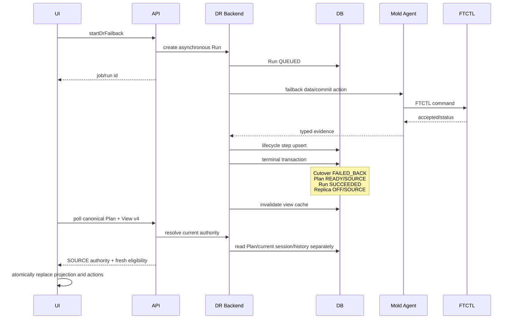

# 578. Cross Hypervisor DR Current Authority and UI Eligibility Projection Design

> 2026-08-03 최신 후속 규약:
> [589-cross-hypervisor-dr-reprotect-preflight-and-release-terminal-convergence-design-20260803.md](589-cross-hypervisor-dr-reprotect-preflight-and-release-terminal-convergence-design-20260803.md)
> 는 보호 해제 후에도 Release 직전 authority를 보존하고 Plan/runtime/cache를
> `UNPROTECTED/DISABLED`로 원자적으로 수렴시킨다. 충돌 시 589를 우선한다.

> 2026-07-28 후속 규약:
> [579-cross-hypervisor-dr-action-intent-guest-identity-and-failed-test-terminal-convergence-design-20260728.md](579-cross-hypervisor-dr-action-intent-guest-identity-and-failed-test-terminal-convergence-design-20260728.md)
> 는 현재 권한 projection을 유지하면서 Test Failover 실패 이력과 실제 cleanup
> 필요 상태를 분리하고, UI/API action intent를 Run type과 상호 검증한다.

- 작성일: 2026-07-28
- 상태: 상세 설계 완료, 구현 대기
- 검증 대상: VMware -> ABLESTACK Windows DR Plan
- Plan UUID: `2514a846-64a2-4bc7-ba88-38a874410782`
- 적용 레이어: UI, API, DR Backend, Agent 경계, FTCTL 경계, Cloud DB
- 관련 Cloud 설계:
  - [522-cross-hypervisor-dr-protection-failover-failback-sequence-design-20260701.md](522-cross-hypervisor-dr-protection-failover-failback-sequence-design-20260701.md)
  - [566-cross-hypervisor-dr-current-protection-activity-and-operation-history-projection-design-20260721.md](566-cross-hypervisor-dr-current-protection-activity-and-operation-history-projection-design-20260721.md)
  - [576-cross-hypervisor-dr-failback-late-ack-and-projection-convergence-design-20260727.md](576-cross-hypervisor-dr-failback-late-ack-and-projection-convergence-design-20260727.md)
  - [577-cross-hypervisor-dr-failover-projection-evidence-and-compensation-design-20260727.md](577-cross-hypervisor-dr-failover-projection-evidence-and-compensation-design-20260727.md)
- 관련 FTCTL 설계:
  - `ablestack-qemu-exec-tools/docs/ftctl/217-dr-cloud-current-authority-projection-boundary-design-20260728.md`

## 1. 목적

정상적으로 완료된 Failover와 Failback 이후에도 과거 Failover 세션이 현재
보호 권한처럼 표시되고, 열린 UI의 작업 메뉴가 최신 backend eligibility를
즉시 반영하지 못하며, Failback의 Cloud 소유 단계가 실행 이력에 충분히
기록되지 않는 문제를 구조적으로 해결한다.

이번 설계는 다음 세 가지 데이터를 분리한다.

1. **현재 권한**: 현재 어느 사이트가 서비스 권한을 가지는지 나타내는
   canonical control-plane projection
2. **현재 작업**: 진행 중인 Failover, Failback, Sync 등 비동기 Run
3. **과거 이력**: 완료된 cutover/failback session과 Run/Step/Event

FTCTL은 체크포인트, scheduler, engine ACK 등 data-plane 증거를 제공한다.
현재 Cloud VM 수명주기와 사용자 작업 가능 여부는 Cloud가 소유한다. UI는
Agent 또는 FTCTL을 직접 호출하거나 과거 세션으로 현재 권한을 추론하지 않는다.

## 2. 실환경 Preflight 결과

### 2.1 정상 완료 증거

직전 실환경 검증에서 다음 상태를 확인했다.

| 항목 | 값 |
| --- | --- |
| Failover Run | Cloud Run `102`, `SUCCEEDED / completed` |
| Failback Run | Cloud Run `103`, `SUCCEEDED / completed` |
| Failback 기준 checkpoint | `584` |
| Failback 후 checkpoint | `585`, `CBT_INCREMENTAL` |
| checkpoint 585 전송량 | `1,530,789,888` bytes |
| checkpoint 585 소요 시간 | `9,080` ms |
| Plan | `READY / ENABLED / SOURCE` |
| VMware 원본 `w22-01` | `poweredOn` |
| ABLESTACK 복제 `w22-01-dr` | `Stopped` |
| scheduler | `RUNNING`, generation/ACK `27/27` |
| NBD | `DRAINED`, quarantined device `0` |

따라서 Failover와 Failback의 실제 실행 경로는 성공했다. 이번 설계의 대상은
실행 실패가 아니라 **성공 후 current projection의 오염**이다.

### 2.2 관측된 projection 불일치

`dr_plan.active_side=SOURCE`이고 Failback Session이 `COMPLETED`인데도
마지막 성공한 `dr_cutover_session`이 다음 상태로 남아 있었다.

```text
state=FAILED_OVER
cloud_promotion_state=PROMOTED
target_power_state=POWERED_ON
engine_ack_state=ACKNOWLEDGED
removed=NULL
```

현재 `findLatestActiveByPlanId()`가 `removed IS NULL`만으로 세션을 고르므로
이 과거 행이 현재 cutover 권한으로 반환된다.

API의 `actioneligibility`는 post-failback 상태에 맞게 Sync, Test Failover,
Failover 등을 허용했다. 그러나 이미 열린 화면은 작업 메뉴를 비활성 상태로
유지했고 강제 새로고침 뒤에만 정상 활성화됐다.

Failback Run의 `dr_run_step`에는 generic dispatch 단계만 남고 실제 Cloud
lifecycle 단계는 `dr_event`와 `dr_failback_session`에만 남았다.

### 2.3 현재 관리 서버 운영 조건

2026-07-28 10:24 KST의 추가 읽기 전용 DB 확인은 management 서버의
`mysqld.service`가 `Error: 28 (No space left on device)`로 실패해 수행하지
못했다. 이 장애는 02:32 KST 이후 발생했으며 앞서 확인한 projection 결함의
원인은 아니다.

구현, DB migration, 배포, 재테스트 전에 다음 운영 gate를 먼저 통과해야 한다.

```text
management filesystem free space 확보
mysqld.service == active
mold.service == active
/client/ == HTTP 200
```

이번 문서 작성 과정에서는 DB 값 변경, 서비스 재시작 또는 cleanup을 수행하지
않았다.

## 3. 코드 수준 오류 원인

### 3.1 Cutover session의 active 의미가 잘못 정의됨

대상:

```text
plugins/integrations/disaster-recovery/src/main/java/com/cloud/dr/dao/
DrCutoverSessionDaoImpl.java
```

현재 `findLatestActiveByPlanId()`는 다음 조건만 사용한다.

```text
plan_id = ?
removed IS NULL
```

`removed`는 soft-delete 의미이며 현재 권한 보유 여부가 아니다. 성공한 과거
세션은 감사 이력으로 남아야 하므로 `removed=NULL`이 정상이다.

### 3.2 Response generator가 DAO 조회와 현재 상태 해석을 동시에 수행함

대상:

```text
plugins/integrations/disaster-recovery/src/main/java/com/cloud/dr/response/
DrResponseGenerator.java
```

`createPlanResponse()`가 직접 최신 cutover row를 읽고 flat field에 복사한다.
`resolveProtectionPhase()`는 `cloudPromotionState=PROMOTED`를
`plan.activeSide=SOURCE`보다 먼저 평가한다.

결과적으로 과거 세션의 `PROMOTED`가 현재 Plan의 SOURCE 권한을 덮는다.

### 3.3 Protection View snapshot이 raw VO를 캐시함

대상:

```text
plugins/integrations/disaster-recovery/src/main/java/com/cloud/dr/
DrProtectionViewServiceImpl.java
```

snapshot version 3의 `plan`은 `DrPlanVO`를 직렬화한다. 다음 derived field가
포함되지 않는다.

- `actioneligibility`
- canonical protection phase
- current authority projection
- current cutover session
- readiness와 runtime control gate

`getDrPlan` 응답과 protection cache가 서로 다른 형태의 Plan을 반환하므로 UI가
부분 병합 규칙을 유지해야 하고, 새 필드가 추가될 때마다 누락 위험이 생긴다.

### 3.4 UI가 cache Plan을 선택적으로 병합함

대상:

```text
ui/src/views/infra/dr/DrPlanList.vue
```

`applyCachedPlan()`의 `refreshableKeys`에는 runtime 일부만 포함된다.
`actioneligibility`, `protectionphase`, current cutover projection은 포함되지
않는다. polling은 `fetchProtectionView()`만 호출하므로 작업 가능 여부는
초기 `getDrPlan` 결과에 머물 수 있다.

### 3.5 UI가 과거 cutover field의 존재를 현재 권한으로 해석함

대상:

```text
ui/src/views/infra/dr/DrProtectionInfoTab.vue
```

`hasCutoverState`는 `cloudpromotionstate`가 존재하기만 해도 현재
`페일오버 권한` 섹션을 표시한다. 세션이 현재 권한인지 과거 이력인지 구분하지
않는다.

### 3.6 lifecycle step과 event가 서로 다른 이력을 만듦

`DrFailbackLifecycleServiceImpl`은 세부 진행을 Session과 Event에 기록하지만
`DrRunStepVO`를 갱신하지 않는다. `DrOrchestratorImpl.recordStep()`은 항상 새
행을 생성하므로 lifecycle reconciler가 반복 호출될 때 그대로 사용하기도
어렵다.

## 4. 상태 소유권 원칙

| 데이터 | canonical 소유자 | 용도 |
| --- | --- | --- |
| 현재 활성 사이트 | `dr_plan.active_side` | 현재 서비스 권한 |
| 현재 보호 건전성 | `DrProtectionAuthoritySnapshot` | READY, freshness, scheduler |
| 현재 비동기 작업 | active `dr_run` | 진행 중 operation |
| 현재 target 권한 세션 | authority-bearing `dr_cutover_session` | TARGET 권한 증거 |
| 과거 Failover | terminal `dr_cutover_session` | 감사/이력 |
| 과거 Failback | terminal `dr_failback_session` | 감사/이력 |
| 작업 단계 | `dr_run_step` | 사용자 실행 이력 |
| 상세 진단 | `dr_event` | 운영 진단 |
| engine 증거 | FTCTL status/checkpoint | data-plane 증거 |

현재 권한 판정 우선순위:

```text
1. active Run의 lifecycle transition
2. dr_plan.active_side
3. DrProtectionAuthoritySnapshot의 authority sequence와 scheduler ACK
4. active_side=TARGET일 때만 current cutover session
5. 과거 session은 current 판정에서 제외
```

## 5. Cutover Session 상태 모델

### 5.1 현재 target 권한을 가질 수 있는 상태

```text
CLOUD_PROMOTED
ENGINE_ACK_VERIFYING
FAILED_OVER
```

이 상태는 `dr_plan.active_side=TARGET`일 때만 current authority로 인정한다.

### 5.2 권한 종료 상태

```text
FAILED_BACK
SUPERSEDED
ABORTED
FAILED
```

`FAILED_BACK`은 Failback terminal transaction에서 기록한다.
`SUPERSEDED`는 새 cutover session이 같은 Plan의 target 권한을 인수할 때
기존 session에 기록한다.

### 5.3 금지되는 조합

```text
plan.active_side=SOURCE && currentCutoverSession != null
plan.active_side=TARGET && acknowledged currentCutoverSession == null
plan.state=READY && protectionPhase=FAILED_OVER_UNPROTECTED
```

발견 시 `PROJECTION_INCONSISTENT`로 표시하고 사용자 action을 fail-closed한다.
과거 세션을 자동으로 현재 권한으로 승격하지 않는다.

## 6. DB 상세 설계

### 6.1 `dr_cutover_session`

감사 가능성을 위해 권한 종료 시점을 명시한다.

```sql
ALTER TABLE cloud.dr_cutover_session
  ADD COLUMN IF NOT EXISTS authority_ended_at datetime NULL
    AFTER completed_at,
  ADD COLUMN IF NOT EXISTS authority_ended_by_run_id bigint unsigned NULL
    AFTER authority_ended_at,
  ADD INDEX IF NOT EXISTS idx_dr_cutover_session_plan_state
    (plan_id, state, removed, id),
  ADD INDEX IF NOT EXISTS idx_dr_cutover_session_authority_end_run
    (authority_ended_by_run_id);
```

`authority_ended_by_run_id`는 Failback Run을 가리킨다. 기존 설치 환경의 FK
추가가 안전한지 migration preflight로 orphan run을 확인한 뒤, 안전하면
`dr_run(id) ON DELETE SET NULL` FK를 추가한다.

`authority_active` boolean은 추가하지 않는다. 현재 권한은 Plan이 소유하고
session state와의 조합으로 검증한다.

### 6.2 기존 데이터 backfill

다음 조건을 모두 만족하는 과거 promoted session을 `FAILED_BACK`으로
종결한다.

```text
Plan.active_side == SOURCE
session.cloud_promotion_state == PROMOTED
session.engine_ack_state == ACKNOWLEDGED
session.completed_at != null
해당 session 이후 COMPLETED failback session 존재
```

backfill 값:

```text
state = FAILED_BACK
authority_ended_at = failback_session.completed_at
authority_ended_by_run_id = failback_session.run_id
```

단순히 `active_side=SOURCE`라는 이유만으로 실패/중단 session을
`FAILED_BACK`으로 바꾸지 않는다.

### 6.3 `dr_run_step`

조회 성능을 위해 다음 인덱스를 추가한다.

```sql
ALTER TABLE cloud.dr_run_step
  ADD INDEX IF NOT EXISTS idx_dr_run_step_run_name
    (run_id, step_name, removed);
```

기존 데이터 중 동일 order 중복 가능성을 확인하기 전에는 unique index를
추가하지 않는다. 멱등 갱신은 DAO transaction과 row lookup으로 보장한다.

### 6.4 cache version

`dr_plan_view_cache` schema는 유지하고 snapshot version을 `3 -> 4`로 올린다.
배포 시 version 3 cache는 자동 rebuild 대상이다.

## 7. Backend 상세 설계

### 7.1 `DrCurrentAuthorityResolver` 신설

```java
public interface DrCurrentAuthorityResolver {
    DrCurrentAuthorityProjection resolve(long planId);
}
```

projection 필드:

```java
String activeSide;
String protectionPhase;
Long authoritySequence;
DrCutoverSessionVO currentCutoverSession;
boolean consistent;
String inconsistencyCode;
String inconsistencyMessage;
```

핵심 로직:

```java
if (SOURCE.equalsIgnoreCase(plan.getActiveSide())) {
    return sourceProjectionWithoutCurrentCutover(plan, runtime);
}
if (TARGET.equalsIgnoreCase(plan.getActiveSide())) {
    DrCutoverSessionVO current = cutoverDao.findCurrentAuthorityByPlanId(planId);
    return validateTargetAuthority(plan, runtime, current);
}
return inconsistent("DR_AUTHORITY_SIDE_UNKNOWN");
```

### 7.2 DAO 분리

`DrCutoverSessionDao`:

```java
DrCutoverSessionVO findCurrentAuthorityByPlanId(long planId);
DrCutoverSessionVO findLatestByPlanId(long planId);
List<DrCutoverSessionVO> listHistoryByPlanId(long planId, int limit);
```

`findLatestActiveByPlanId()`는 deprecated 처리하고 current projection에서
사용하지 않는다.

`findCurrentAuthorityByPlanId()`는 authority-bearing state만 조회한다.
호출자는 반드시 `plan.active_side=TARGET`을 먼저 확인한다.

### 7.3 Response generator를 stateless serializer로 축소

`DrResponseGenerator.createPlanResponse()`에서 DAO 직접 조회와
`resolveProtectionPhase()`를 제거한다.

새 signature:

```java
DrPlanResponse createPlanResponse(
    DrPlanVO plan,
    DrCurrentAuthorityProjection authority,
    Map<String, Boolean> actionEligibility
);
```

`DrPlanProjectionService`가 Plan, current authority, readiness, eligibility를
같은 read boundary에서 조립하고 Response Generator는 직렬화만 수행한다.

### 7.4 공통 eligibility evaluator

```java
public interface DrPlanActionEligibilityEvaluator {
    Map<String, Boolean> evaluate(
        DrPlanVO plan,
        DrCurrentAuthorityProjection authority
    );
}
```

`DrPlanServiceImpl.getActionEligibility()`와
`DrProtectionViewServiceImpl`이 이 evaluator를 함께 사용한다. 동일 화면에서
Plan API와 Protection View의 action map이 달라지는 것을 방지한다.

authority projection이 inconsistent이면:

```text
update=false
delete=false
sync=false
testFailover=false
failover=false
failback=false
reprotect=false
releaseProtection=false
cancelRun=<active run일 때만 true>
```

### 7.5 Failback terminal transaction 보강

`DrFailbackLifecycleServiceImpl.completeLifecycle()`의 기존 transaction에 다음을
추가한다.

1. `dr_plan` row lock
2. latest current cutover session 조회
3. 해당 session을 `FAILED_BACK`으로 전환
4. `authority_ended_at`, `authority_ended_by_run_id` 기록
5. Plan `READY/SOURCE`
6. Failback Session `COMPLETED`
7. Run `SUCCEEDED`
8. Replica `READY/POWERED_OFF/SOURCE`
9. lifecycle Run Step terminal 갱신
10. protection cache 삭제

이미 `FAILED_BACK`이면 같은 Failback Run에 대한 반복 reconcile은 no-op
성공으로 처리한다.

### 7.6 lifecycle step recorder

```java
public interface DrLifecycleStepRecorder {
    DrRunStepVO upsert(
        long runId,
        String stepName,
        int stepOrder,
        String state,
        Integer progress,
        String detailsJson
    );
}
```

`DrRunStepDao`에 다음 조회를 추가한다.

```java
DrRunStepVO findActiveByRunIdAndStepName(long runId, String stepName);
```

Failback lifecycle step:

| order | step |
| --- | --- |
| 100 | `failback-data-ready` |
| 110 | `failback-target-stop` |
| 120 | `failback-source-start` |
| 130 | `failback-source-boot-validation` |
| 140 | `failback-authority-commit` |
| 150 | `failback-scheduler-resume` |
| 160 | `failback-post-checkpoint` |
| 170 | `failback-completed` |

Event는 진단 메시지를 계속 보존하고 Run Step은 사용자 진행 이력의 canonical
단계가 된다.

## 8. API 상세 설계

### 8.1 `DrPlanResponse`

기존 flat cutover field는 **current cutover session만** 의미하도록 정의를
수정한다.

```text
cutoversessionstate
cloudpromotionstate
cutovertargetpowerstate
cutoverbootvalidationstate
engineackstate
cutoverauthoritygeneration
cutovercompletedat
```

`active_side=SOURCE`이고 current cutover가 없으면 모두 `null`이다.

추가 field:

```text
authorityside
authorityphase
authoritysequence
authorityconsistent
authorityinconsistencycode
authorityinconsistencymessage
currentcutoversessionid
```

과거 cutover 정보는 Plan response에 섞지 않고 Run/Event history API 또는
별도 `listDrCutoverSessions`에서 조회한다.

### 8.2 Protection View snapshot version 4

```json
{
  "version": 4,
  "planProjection": {
    "id": "<plan-uuid>",
    "state": "READY",
    "authorityside": "SOURCE",
    "authorityphase": "READY",
    "authoritysequence": 585,
    "actioneligibility": {
      "sync": true,
      "testFailover": true,
      "failover": true,
      "failback": false
    }
  },
  "currentAuthority": {
    "side": "SOURCE",
    "phase": "READY",
    "sequence": 585,
    "consistent": true
  },
  "currentCutoverSession": null,
  "latestOperationRun": {},
  "latestOperationRunSteps": [],
  "failbackSession": {},
  "currentProtectionRuntime": {},
  "latestCompletedSyncCycle": {}
}
```

version 4의 `planProjection`은 `DrPlanResponse`와 동일한 derived projection을
사용한다. version 3의 raw `plan`은 한 release 동안 compatibility alias로
유지하되 UI는 version 4에서 사용하지 않는다.

### 8.3 비동기 원칙

모든 변경 action은 기존처럼 Run ID를 즉시 반환한다. API가 Failover,
Failback 또는 cache rebuild 완료까지 HTTP 요청을 잡고 있지 않는다.

UI polling은 다음 두 읽기 API만 사용한다.

```text
getDrPlan
getDrProtectionView
```

Agent/FTCTL 직접 조회는 backend projection refresh 내부에서만 수행한다.

## 9. UI 상세 설계

### 9.1 원자적 projection 적용

`DrPlanList.vue`에 다음 메서드를 둔다.

```javascript
applyCanonicalProjection (planResponse, protectionView) {
  const snapshot = parseSnapshot(protectionView)
  const cachedProjection = normalize(snapshot.planProjection)
  const selected = selectNewestProjection(planResponse, cachedProjection, {
    snapshotVersion: protectionView.snapshotversion,
    generated: protectionView.generated
  })

  this.detailPlan = Object.assign({}, selected)
  this.protectionSnapshot = normalizeProtectionSnapshot(snapshot)
}
```

`applyCachedPlan()`의 field allow-list 방식은 제거한다. static/dynamic field를
한 객체에 부분 병합하지 않고 canonical Plan projection을 한 번에 교체한다.

### 9.2 projection 선택 규칙

1. snapshot version 4 미만이면 `getDrPlan`을 canonical Plan으로 사용
2. snapshot authority sequence가 현재보다 작으면 적용 거부
3. 같은 sequence이면 더 최신 `generated`를 사용
4. `actioneligibility`가 없는 snapshot은 작업 메뉴 source로 사용하지 않음
5. projection inconsistency이면 action fail-closed와 경고 표시

### 9.3 작업 메뉴

`resourceActions.js`:

```javascript
function isEligible (resource, key) {
  const map = eligibility(resource)
  return Object.prototype.hasOwnProperty.call(map, key) && map[key] === true
}
```

backend map이 없을 때 permissive fallback을 사용하지 않는다. API permission은
메뉴 표시 여부를 결정하고 backend eligibility는 현재 상태의 활성 여부를
결정한다.

polling으로 새 `actioneligibility`가 도착하면 `detailPlan` 객체를 교체해
`DrResourceActionMenu`가 즉시 다시 계산되도록 한다. 강제 브라우저 새로고침을
요구하지 않는다.

### 9.4 현재 권한과 과거 이력 표시

`DrProtectionInfoTab.vue`:

```javascript
hasCurrentCutoverState () {
  return this.protectionPlan.authorityside === 'TARGET' &&
    Boolean(this.protectionPlan.currentcutoversessionid)
}
```

`cloudpromotionstate` field의 존재만으로 현재 권한 섹션을 표시하지 않는다.

완료된 Failover/Failback은 `이력` 탭의 Run/Step/Event에서 표시한다.
보호 정보 탭에는 현재 authority, protection, scheduler, replication만
표시한다.

### 9.5 polling

| 상태 | 주기 |
| --- | --- |
| active Run 또는 lifecycle transition | 5초 |
| 안정 READY/ENABLED | 30초 |
| 브라우저 hidden | 중지 |
| visible 복귀 | 즉시 1회 |

action terminal 감지 시 `fetchProtectionView()`만 호출하지 않고
`Promise.all(getDrPlan, getDrProtectionView)`로 canonical state를 다시 읽는다.
화면 전체 skeleton은 표시하지 않는다.

## 10. Agent와 FTCTL 설계 경계

이번 개선은 Agent command나 FTCTL engine action을 추가하지 않는다.

Agent/FTCTL이 계속 제공해야 하는 기존 증거:

```text
active_side
engine_ack_state
control_generation
control_ack_generation
scheduler_state
latest_completed_checkpoint_sequence
latest_completed_checkpoint_cycle_type
nbd_teardown_state
nbd_quarantined_device_count
```

금지 사항:

- UI가 Agent/FTCTL을 직접 호출
- Cloud가 과거 operation Run state를 current Plan authority로 복사
- FTCTL이 Cloud DB의 cutover session history를 관리
- historical session을 근거로 active side를 변경

따라서 구현 시 Agent와 FTCTL source 변경 및 RPM 재빌드는 원칙적으로 필요
없다. DTO field 변경이 발생하지 않는지 changed-file audit로 확인한 뒤
Cloud changed-module build만 수행한다.

## 11. 목표 비동기 시퀀스



## 12. 테스트 및 Preflight 설계

### 12.1 Backend unit test

1. `SOURCE + historical FAILED_OVER`는 current cutover를 반환하지 않음
2. `TARGET + acknowledged FAILED_OVER`는 current cutover를 반환
3. `TARGET + no current cutover`는 `PROJECTION_INCONSISTENT`
4. Failback terminal transaction이 cutover를 `FAILED_BACK`으로 종결
5. 동일 Failback reconcile 재호출은 멱등
6. `resolveProtectionPhase()`가 historical PROMOTED를 무시
7. Plan API와 Protection View v4의 eligibility가 동일
8. snapshot version 3 cache는 rebuild
9. lifecycle step upsert가 중복 행을 만들지 않음

### 12.2 UI unit test

1. version 4 projection의 eligibility가 메뉴를 즉시 활성화
2. 브라우저 reload 없이 polling 결과 반영
3. version 3 snapshot이 API eligibility를 덮지 않음
4. 낮은 authority sequence snapshot 적용 거부
5. SOURCE에서는 과거 cutover 권한 섹션 미표시
6. TARGET current cutover에서만 권한 섹션 표시
7. eligibility 누락 시 action fail-closed

### 12.3 DB migration preflight

```sql
SELECT plan_id, state, COUNT(*)
  FROM dr_cutover_session
 WHERE removed IS NULL
 GROUP BY plan_id, state;

SELECT run_id, step_order, COUNT(*)
  FROM dr_run_step
 WHERE removed IS NULL
 GROUP BY run_id, step_order
HAVING COUNT(*) > 1;
```

orphan run과 중복 step을 확인한 뒤 migration/backfill을 적용한다.

### 12.4 실환경 PASS gate

```text
Plan READY/SOURCE
currentCutoverSession == null
latest historical cutover == FAILED_BACK
Failback Run == SUCCEEDED
Failback lifecycle steps 100..170 terminal
source VM == POWERED_ON
target VM == POWERED_OFF
scheduler == RUNNING/HEALTHY
post-failback checkpoint > failback checkpoint
Plan API eligibility == Protection View v4 eligibility
UI action menu updates without full reload
```

## 13. 권장 구현 순서

1. management disk 공간 확보와 MySQL/Mold 정상화
2. DB migration preflight와 cutover/step 중복 확인
3. `DrConstants`에 `FAILED_BACK`, `SUPERSEDED` 추가
4. `DrCutoverSessionVO`와 schema migration
5. `DrCutoverSessionDao` current/history query 분리
6. `DrCurrentAuthorityResolver` 구현
7. 공통 `DrPlanActionEligibilityEvaluator` 추출
8. `DrResponseGenerator`를 stateless serializer로 변경
9. Failback terminal transaction에서 cutover 종결
10. `DrLifecycleStepRecorder`와 Failback step upsert
11. Protection View snapshot version 4
12. Plan/Protection View API 계약과 단위 테스트
13. UI atomic projection merge와 fail-closed action
14. UI current authority/history 표시 분리
15. changed Maven module과 UI build
16. Cloud 변경 class/UI 정적 자산 배포
17. DB backfill과 cache version rebuild
18. 서비스, `/client/`, API, DB smoke
19. 기존 Windows Plan read-only 검증
20. 새 Failover -> Failback E2E 재테스트

## 14. AS-IS / TO-BE

| 레이어 | AS-IS | TO-BE |
| --- | --- | --- |
| UI 현재 권한 | 과거 PROMOTED field 존재 시 현재 권한처럼 표시 | `authorityside`와 current session만 표시 |
| UI action | 열린 화면에서 eligibility가 오래된 객체에 남음 | v4 projection을 원자 교체해 즉시 재평가 |
| UI fallback | eligibility 누락 시 일부 action permissive | backend map 누락 시 fail-closed |
| API Plan | current와 historical cutover flat field 혼합 | flat cutover field는 current 전용 |
| API cache | raw `DrPlanVO` snapshot | derived `DrPlanResponse` 기반 version 4 |
| Backend phase | 과거 PROMOTED가 SOURCE보다 우선 | Plan active side와 current resolver 우선 |
| Backend 구조 | Response Generator가 DAO 조회/판정/직렬화 수행 | resolver/evaluator/projection/serializer 분리 |
| Failback terminal | Plan/Run/Session/Replica만 수렴 | 과거 cutover도 `FAILED_BACK`으로 종결 |
| Run 이력 | generic dispatch 단계만 표시 | Cloud lifecycle 세부 단계를 멱등 upsert |
| DB active 의미 | `removed IS NULL`을 현재 권한으로 오해 | state 기반 current query와 별도 history query |
| DB 감사 | 권한 종료 시각/원인 없음 | 종료 시각과 Failback Run 기록 |
| Agent | 현재 증거 제공 | 계약 유지, 변경 없음 |
| FTCTL | authority/checkpoint 증거 제공 | 계약 유지, 변경 없음 |

## 15. 완료 기준

다음 조건을 모두 만족해야 구현 완료로 판정한다.

1. 성공한 Failback 뒤 과거 Failover가 현재 권한으로 표시되지 않는다.
2. Plan API, Protection View, DB, 실제 VM 전원과 FTCTL active side가 일치한다.
3. 작업 메뉴가 브라우저 강제 새로고침 없이 최신 eligibility를 반영한다.
4. Failback 실행 이력에서 Cloud 소유 lifecycle 단계 전체를 확인할 수 있다.
5. stale/구버전 cache가 최신 authority를 덮어쓰지 않는다.
6. UI/API는 계속 비동기이며 Agent/FTCTL 직접 호출이 없다.
7. 기존 Failover, Failback, Sync, Test Failover 동작에 회귀가 없다.

## 16. 구현 및 배포 결과

### 16.1 구현 범위

- `DrCurrentAuthorityResolver`가 Plan active side, 현재 cutover session, FTCTL authority 증거를 결합해 단일 current-authority projection을 생성한다.
- 과거 cutover session은 history로만 조회하며, 성공한 Failback이 연결된 세션을 `FAILED_BACK`으로 종결한다.
- Plan API와 Protection View snapshot version 4는 같은 `DrPlanResponse`와 `actionEligibility`를 사용한다.
- UI는 version 4 projection을 원자적으로 교체하고, backend eligibility가 없거나 authority가 불일치하면 action을 fail-closed 처리한다.
- Failback lifecycle step은 run/step 이름 기준 멱등 upsert로 기록한다.

### 16.2 빌드 결과

| 대상 | 결과 |
| --- | --- |
| Disaster Recovery Maven module 및 의존 모듈 | PASS |
| current-authority/failback lifecycle 대상 Java test | 6 PASS |
| UI resource action unit test | 5 PASS |
| UI production build | PASS |
| DB schema module build | PASS |

### 16.3 배포 결과

- Cloud는 전체 패키지를 교체하지 않고 변경 class/resource entry만 운영 JAR에 반영했다.
- UI는 `/usr/share/cloudstack-management/webapp`의 정적 자산만 갱신했으며 `WEB-INF`를 보존했다.
- DB에는 `authority_ended_at`, `authority_ended_by_run_id`와 current/history 조회용 index를 반영했다.
- 과거 승격 세션 2건을 연결된 Failback run 기준 `FAILED_BACK`으로 백필했다.
- Protection View cache를 삭제 후 version 4로 재생성했다.
- Spring context는 운영 JAR의 `resources/META-INF/...`와 탐색용 `META-INF/...` entry를 함께 유지해야 한다. 변경 class 패치에서도 두 entry 중 하나를 제거하면 DR API plugin 전체가 등록되지 않는다.

### 16.4 실환경 검증 결과

검증 대상 Plan: `2514a846-64a2-4bc7-ba88-38a874410782`

| 계층 | 검증 결과 |
| --- | --- |
| DB | Plan `READY/ENABLED/SOURCE`, 활성 current cutover 0건 |
| 과거 cutover | 최근 승격 세션 `FAILED_BACK`, 종료 run과 종료 시각 기록 |
| Plan API | `authorityside=SOURCE`, `authorityphase=READY`, `authorityconsistent=true` |
| Protection View | snapshot version 4, current cutover null, Plan API와 동일 projection |
| UI eligibility | Failback/Reprotect 비활성, Failover/Test Failover/Sync 활성 |
| Scheduler | `RUNNING/HEALTHY`, incremental cycle `COMPLETED` |
| 서비스 | Mold active, `/client/` HTTP 200, DR API plugin 등록 |
| UI 배포 | `WEB-INF` 보존, current-authority 및 atomic projection marker 확인 |
| Agent/FTCTL | 계약 변경 없음, 3개 호스트 timer와 설치 script 정상 |

### 16.5 재테스트 판정

현재 상태는 `SOURCE / READY / CONSISTENT`이며 재테스트 준비 PASS다. 다음 재테스트는 Failover 직후 current cutover 생성과 TARGET authority 전환, 이어지는 Failback 완료 뒤 current cutover 제거와 SOURCE authority 복귀를 확인한다.

## 17. 2026-07-30 Current Runtime And History Clarification

current authority projection은 과거 작업 실패를 현재 runtime 오류로
승격하지 않는다. `DrResponseGenerator`의 `runtime*` 필드는 authority
runtime 또는 active Run에서만 생성하고, `latestOperationRun`은 감사 이력에만
남긴다.

Protection View snapshot version 5는 version 4의 authority/eligibility
계약을 유지하면서 current runtime과 latest history의 의미를 분리한다. 이
보강 설계와 `DR_GUEST_OS_UNSUPPORTED` 오표시 교정은
[580-cross-hypervisor-dr-current-runtime-history-and-darkmode-warning-design-20260730.md](580-cross-hypervisor-dr-current-runtime-history-and-darkmode-warning-design-20260730.md)를
따른다.

## 2026-07-30 TARGET Authority Projection Addendum

Protection View version 6에서는 acknowledged current Cutover Session이 있는
`FAILED_OVER/TARGET` Plan을 항상 `FAILED_OVER_UNPROTECTED`로 반환한다.
stale Runtime의 `DEGRADED` 또는 `scheduler_desired_state=RUNNING`은 current
authority를 덮어쓰지 못한다. 이 상태에서 Failback/Reprotect만 활성화한다.
상세 resolver와 테스트 기준은 문서 581을 따른다.
## 2026-07-30 Recognized Failback Transition Addendum

Plan이 SOURCE로 projection된 뒤 과거 Cutover Session이 terminal 처리되기 전의
짧은 구간은 active Failback Session이 `COMMIT_VERIFYING` 또는
`PROTECTION_RESUMING`이고 generation/run이 일치하면 정상 전환으로 판정한다.
이 경우 `authorityconsistent=true`, `currentseverity=INFO`를 반환한다. active
session 없는 stale cutover만 기존 inconsistency ERROR를 유지한다. 상세 resolver
계약은 문서 583을 따른다.

## 18. 2026-07-30 Typed Applicability And Disabled Reason Addendum

이 문서의 current authority projection을 UI 작업 메뉴에 적용할 때
`actioneligibility` boolean 하나로 작업의 표시 여부와 실행 가능 여부를
동시에 표현하지 않는다.

후속 규범은 다음과 같다.

```text
applicable=false               -> 현재 authority/state와 무관하므로 숨김
applicable=true, enabled=false -> 관련 작업이지만 선행 조건 부족, reason 표시
applicable=true, enabled=true  -> 실행 가능
```

`DrPlanActionAvailabilityEvaluator`가 이 값을 계산하고 기존 boolean
`actioneligibility`는 enabled compatibility map으로 파생한다. UI는 typed
availability가 존재할 때 `hasDrSourceAuthority()` 같은 별도 authority 추론을
적용하지 않는다. Protection View snapshot version 7은 current authority와
typed availability를 같은 `planProjection`에 포함한다.

상세 계약은
[584-cross-hypervisor-dr-context-action-availability-and-darkmode-design-20260730.md](584-cross-hypervisor-dr-context-action-availability-and-darkmode-design-20260730.md)를
따르며, 이 addendum이 기존 boolean-only UI 표현보다 우선한다.
