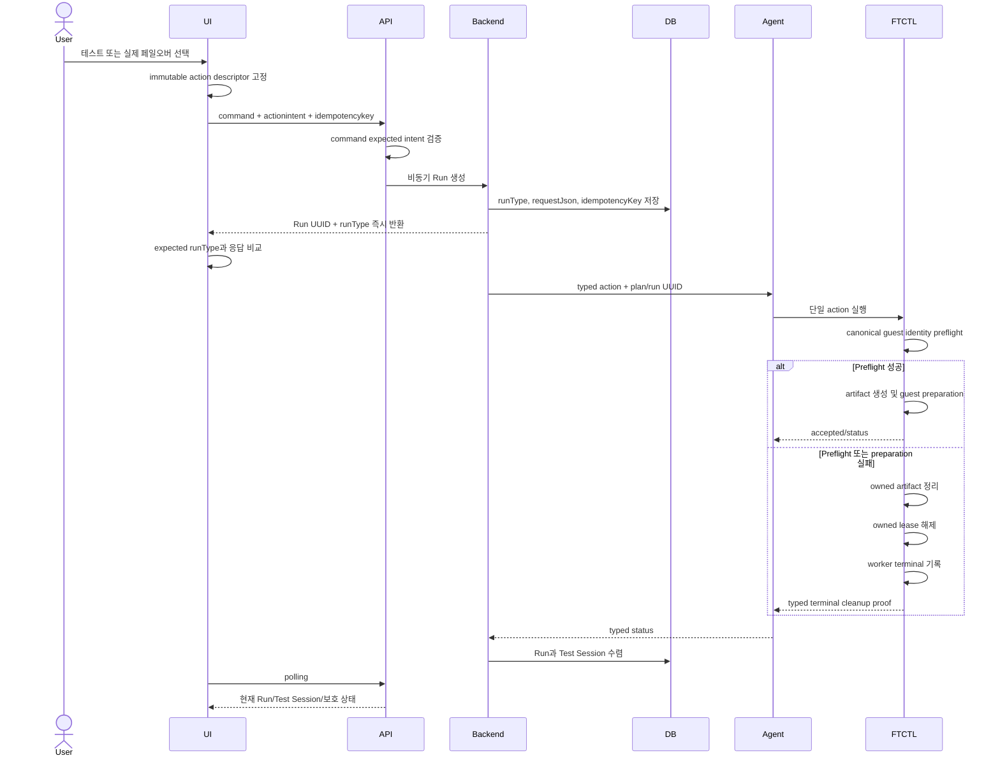

# 579. Cross Hypervisor DR Action Intent, Guest Identity, And Failed Test Terminal Convergence Design

- 작성일: 2026-07-28
- 상태: 상세 설계 완료, 구현 대기
- 검증 대상: VMware -> ABLESTACK Windows DR Plan
- Plan UUID: `2514a846-64a2-4bc7-ba88-38a874410782`
- 적용 계층: UI, API, Cloud backend, Mold Agent, FTCTL, Cloud DB
- FTCTL 부속 설계:
  `ablestack-qemu-exec-tools/docs/ftctl/218-dr-test-guest-identity-and-terminal-cleanup-contract-design-20260728.md`
- 관련 문서: 561, 562, 563, 567, 577, 578

## 1. 목적과 결정

이번 설계는 다음 세 문제를 하나의 실행 계약으로 해결한다.

1. UI에서 선택한 `TEST_FAILOVER`와 `FAILOVER` 의도를 API, Run, Agent, FTCTL까지
   변경 없이 전달하고 각 경계에서 검증한다.
2. 테스트 페일오버와 실제 페일오버가 동일한 canonical guest identity resolver를
   사용하게 한다.
3. 테스트 준비 실패 시 아티팩트 정리, checkpoint lease 해제, worker 종결,
   Cloud Test Session 갱신을 하나의 terminal convergence로 처리한다.

Cloud는 고객 VM과 Run/Test Session의 수명 주기 권한을 갖는다. FTCTL은
checkpoint, 테스트용 writable artifact, offline guest preparation, lease를
소유한다. UI는 Cloud API만 호출하며 Agent나 FTCTL을 직접 호출하지 않는다.

## 2. 실제 환경 Preflight 결과

검증은 VM 전원 및 DR 데이터를 변경하지 않는 읽기 전용 방식으로 수행했다.

| 검증 항목 | 실제 결과 | 판정 |
|---|---|---|
| Cloud Plan | `READY / SOURCE`, 오류 없음 | PASS |
| 최근 요청 Run | id `104`, `TEST_FAILOVER`, `FAILED` | 확인 |
| Async API command | `StartDrTestFailoverCmd`, job id `2582` | 확인 |
| 실패 코드 | `DR_GUEST_OS_UNSUPPORTED` | 재현 |
| Source VM identity | `vm-6429`, `windows2019srvNext_64Guest` | PASS |
| Source firmware | EFI, Secure Boot `true` | PASS |
| Target disk contract | RBD/raw 100 GiB + 50 GiB | PASS |
| Canonical manifest build/validate | Windows, EFI, Secure Boot, 2 disks | PASS |
| Target I/O contract | `ioPolicy=io_uring`, `ioThreads=true` | PASS |
| 현재 test 전용 추출식 | `guestId=""` | FAIL |
| FTCTL test artifact | 실제 clone 정리 완료, session `CLEANED` | PASS |
| FTCTL worker projection | PID 사망, `worker_state=RUNNING` | FAIL |
| Checkpoint lease | run `ffa398ba-...`의 sequence 713 lease 잔존 | FAIL |
| Cloud Test Session | `FAILED`, `cleanup_required=1`, target VM 없음 | 불일치 |
| 보호 scheduler | `RUNNING`, 최신 incremental cycle 716 완료 | PASS |

Canonical builder로 생성한 핵심 결과는 다음과 같다.

```json
{
  "source": {
    "guestFamily": "windows",
    "guestId": "windows2019srvNext_64Guest",
    "firmware": "efi",
    "secure_boot": true
  },
  "target": {
    "storage": {"type": "rbd"},
    "format": "raw",
    "rootDiskController": "scsi",
    "ioPolicy": "io_uring",
    "ioThreads": true
  },
  "diskCount": 2
}
```

따라서 VMware inventory, Cloud profile, ISO, 대상 RBD에는 원인 결함이 없다.
실패 원인은 테스트 전용 파서와 terminal cleanup 계약이다.

추가로 로컬 FTCTL source와 설치 파일의 SHA256이 일치하지 않았다. 구현 후
배포 검증에서는 커밋, Actions artifact, 설치 파일 SHA256을 하나의 provenance로
검증해야 한다.

## 3. 오류 원인

### 3.1 실제 페일오버 요청이 테스트 Run으로 바뀐 것은 아니다

Cloud DB와 `async_job`은 요청 자체가 `StartDrTestFailoverCmd`였음을 증명한다.
백엔드가 `FAILOVER`를 `TEST_FAILOVER`로 변환한 경로는 없다.

다만 UI는 두 액션 정의를 `resourceActions.js`와 `DrActionToolbar.vue`에 중복
보유하고, 요청 payload에 명시적인 action intent를 넣지 않는다. 사용자가 실제
페일오버를 선택했다고 인식한 경우 이를 서버가 검증하거나 감사할 수 없다.

### 3.2 테스트와 실제 페일오버의 guest identity parser가 다르다

`lib/ftctl/guestprep.sh::ftctl_guestprep_write_manifest()`는 다음 경로만 읽는다.

```text
mapping.source.workload.guestId
mapping.source.guestId
```

실제 profile은 다음 경로에 값을 저장한다.

```text
mapping.source.vm.guestId
mapping.source.hardware.guestId
```

반면 실제 페일오버의 `guestprep_manifest.py::source_vm()`은 두 경로를 모두
읽는다. 이 중복 구현 때문에 같은 profile이 테스트에서는 unknown, 실제
페일오버에서는 Windows로 판정된다.

### 3.3 실패 경로가 cleanup 결과를 폐기한다

`dr_runtime.sh`의 테스트 분기는 guest preparation의 반환값이 실패여도 동일
`if` 블록 안에서 checkpoint lease를 생성한다. 이후 cleanup 호출의 출력과
반환값을 모두 버리고 Run을 `ERROR`로 덮어쓴다.

결과적으로 다음 모순이 만들어진다.

```text
test_session_state=CLEANED
test_artifacts_state=CLEANED
worker_state=RUNNING
checkpoint_lease_state=LEASED
state=ERROR
```

### 3.4 Cloud가 실패 세션의 cleanup 필요 여부를 무조건 true로 만든다

`FtctlDrRuntimeProjectionAdapter.reconcileCloudManagedTestTarget()`는
engine state가 실패이면 FTCTL cleanup proof와 무관하게
`session.setCleanupRequired(true)`를 호출한다. 이미 FTCTL artifact가 모두
정리된 실패도 UI에서 정리가 필요한 세션으로 보일 수 있다.

## 4. 불변 조건

1. API command의 expected run type과 `actionintent`는 반드시 같아야 한다.
2. 같은 `idempotencykey`는 같은 Plan, 같은 run type, 같은 action intent에서만
   재사용할 수 있다.
3. Test Failover와 Failover는 동일한 source VM resolver를 사용한다.
4. guest identity preflight는 RBD clone 생성보다 먼저 실행한다.
5. 실패 후 `worker_state=RUNNING`인 terminal Run은 허용하지 않는다.
6. Run이 소유한 checkpoint lease는 성공한 active test가 아니면 해제한다.
7. `DrTestSession.state=FAILED`는 감사 이력이고,
   `cleanup_required`는 실제 잔존 리소스 여부다.
8. 실패한 Test Failover는 Plan의 보호 authority와 scheduler를 오염시키지 않는다.
9. UI는 응답 `runtype`이 요청 intent와 다르면 accepted Run으로 표시하지 않는다.

## 5. 목표 흐름



## 6. UI 상세 설계

### 6.1 액션 정의 단일화

대상 파일:

- `ui/src/utils/dr/resourceActions.js`
- `ui/src/components/dr/DrActionToolbar.vue`
- `ui/src/views/infra/dr/DrPlanList.vue`

`resourceActions.js`를 유일한 action descriptor source로 만든다.
`DrActionToolbar.vue`의 독립 action 배열은 제거하고 공통 builder를 사용한다.

```javascript
{
  command: 'startDrTestFailover',
  api: 'startDrTestFailover',
  intent: 'TEST_FAILOVER',
  expectedRunType: 'TEST_FAILOVER',
  confirmationMode: 'TEST_ISOLATED',
  danger: false
}

{
  command: 'startDrFailover',
  api: 'startDrFailover',
  intent: 'FAILOVER',
  expectedRunType: 'FAILOVER',
  confirmationMode: 'SERVICE_CUTOVER',
  danger: true
}
```

`openActionModal()`은 descriptor를 복제해 `Object.freeze()`하고 modal이 열린 뒤
현재 메뉴 재계산이 `selectedAction`을 바꾸지 못하게 한다.

### 6.2 사용자가 의도를 오인하지 않는 대화상자

- 테스트: 제목 `테스트 페일오버`, 보조 배지 `격리된 임시 VM 검증`
- 실제: 제목 `실제 페일오버`, 보조 배지 `운영 권한을 대상 사이트로 전환`
- 실제 페일오버는 source/target, planned/disaster, final sync, source fencing 영향을
  요약하고 확인 문구를 요구한다.
- 테스트 대화상자에는 `운영 권한은 전환되지 않음`을 표시한다.
- 두 대화상자는 색상만으로 구분하지 않고 제목, 설명, 아이콘을 함께 사용한다.

### 6.3 요청 상관관계와 응답 검증

`submitActionModal()` 시 한 번만 UUID를 만들고 재시도 동안 유지한다.

```javascript
payload.actionintent = selectedAction.intent
payload.idempotencykey = actionRequestId
```

`executePlanAction()`은 응답의 `runtype`을 검증한다.

```javascript
if (normalizeRunType(run) !== action.expectedRunType) {
  throw new DrActionIntentMismatchError(...)
}
```

불일치이면 낙관적 상태를 적용하지 않고 상세 데이터를 재조회한다. UI에는
`요청한 작업과 서버가 접수한 작업이 일치하지 않습니다`를 표시하고 Plan 상태를
임의로 변경하지 않는다.

### 6.4 UI 테스트

- 각 메뉴의 label, command, intent, expectedRunType 조합 snapshot
- 테스트 대화상자에서 failover 전용 필드가 payload에 들어가지 않는지 검증
- 실제 대화상자에서 test network 필드가 들어가지 않는지 검증
- 응답 `runtype` 불일치 시 `applyAcceptedRun()` 미호출 검증
- 같은 modal submit 재시도에서 idempotency key 유지 검증

## 7. API 상세 설계

대상 파일:

- `AbstractDrPlanActionCmd.java`
- `StartDrTestFailoverCmd.java`
- `StartDrFailoverCmd.java`
- `DrRunResponse.java`

`AbstractDrPlanActionCmd`에 선택 입력 `actionintent`를 추가한다. 서버 권위 값은
항상 `getRunType()`이며, 입력이 있으면 대소문자를 정규화해 일치 여부를
검증한다.

```java
protected void validateActionIntent() {
    if (StringUtils.isNotBlank(actionIntent)
            && !StringUtils.equalsIgnoreCase(actionIntent, getRunType())) {
        throw new ServerApiException(ApiErrorCode.PARAM_ERROR,
                DrConstants.ERROR_ACTION_INTENT_MISMATCH);
    }
}
```

`execute()` 순서:

1. `validateActionIntent()`
2. `validateActionAllowed()`
3. `buildRequestJson()`에 `actionIntent`, `apiCommand` 저장
4. `startRun()`
5. 응답에 기존 `runtype`과 `idempotencykey` 반환

기존 client가 `actionintent`를 보내지 않아도 호환된다. 신규 UI는 반드시 보낸다.

## 8. Cloud backend 상세 설계

### 8.1 Idempotency 충돌 검증

대상:

- `DrOrchestratorImpl.createRun()`
- `DrRunServiceImpl`

기존 Run이 같은 key로 조회되면 바로 반환하기 전에 다음을 검증한다.

```java
same planId
same runType
same normalized request.actionIntent
```

다르면 `DR_ACTION_IDEMPOTENCY_CONFLICT`로 거부한다. 이를 통해 테스트 요청의
재시도가 실제 페일오버 Run을 재사용하거나 그 반대가 되는 일을 막는다.

### 8.2 실패 Test Session 수렴

대상:

- `FtctlDrRuntimeProjectionAdapter.reconcileCloudManagedTestTarget()`
- `DrTestSessionState`
- `DrTargetMaterializationServiceImpl`

typed status에서 다음 proof를 읽는다.

```text
workerState=FAILED
testSessionState=CLEANED
testArtifactsState=CLEANED
checkpointLeaseState=RELEASED
testArtifactCount=0 또는 모든 artifact state=CLEANED
```

수렴 규칙:

| Engine/Cloud 증거 | session.state | cleanup_required |
|---|---|---|
| failure + cleanup complete | `FAILED` | `false` |
| failure + artifact/VM 잔존 | `FAILED` | `true` |
| cleanup 명령 진행 중 | `CLOUD_CLEANUP_RUNNING` | `true` |
| cleanup 성공 | `CLEANED` | `false` |
| cleanup 일부 실패 | `CLEANUP_FAILED` | `true` |

`FAILED`를 `CLEANED`로 바꾸지 않는다. 실패 원인은 Run/Test Session 이력에
유지하고, 리소스 잔존 여부만 `cleanup_required`로 표현한다.

### 8.3 보호 projection 격리

실패한 Test Failover Run은 다음 값을 변경하지 않는다.

```text
dr_plan.state
dr_plan.active_side
dr_replica.active_side
continuous sync scheduler authority
latest successful protection checkpoint
```

Plan 목록은 `READY`를 유지하고 작업 이력 탭에서 Test Failover 실패를 표시한다.

## 9. Agent 상세 설계

대상:

- `FtctlDrStatusAnswer.java`
- `LibvirtFtctlDrStatusCommandWrapper.java`
- `FtctlDrActionCommand.java`

기존 `statusJson` fallback에만 의존하지 않고 다음 필드를 typed DTO로 승격한다.

```java
String testSessionState;
String testArtifactsState;
Integer testArtifactCount;
String testCleanupState;
String guestFamily;
String checkpointLeaseState; // 기존 필드 유지
String workerState;          // 기존 필드 유지
Integer workerExitCode;      // 기존 필드 유지
```

Action Answer에는 요청 action과 엔진이 echo한 action이 같은지 검증한다.
불일치이면 Agent가 성공 Answer를 만들지 않고
`DR_ENGINE_ACTION_INTENT_MISMATCH`를 반환한다.

Agent는 Cloud DB 상태를 계산하거나 Test Session을 소유하지 않는다. FTCTL의
구조화 상태를 손실 없이 전달하는 역할만 한다.

## 10. FTCTL 상세 설계

구체 구현 계약은 부속 문서 218을 따른다. 핵심은 다음과 같다.

1. `guestprep_manifest.py`에 `inspect`와 `build-test` subcommand를 추가한다.
2. `source_vm()`을 test/cutover 공통 resolver로 사용한다.
3. identity 및 Windows ISO preflight를 artifact 생성 전에 실행한다.
4. guest preparation 성공을 재검증한 뒤에만 checkpoint lease를 획득한다.
5. 실패 finalizer는 owned artifact cleanup, owned lease release, worker terminal
   기록을 수행한 후 하나의 status snapshot을 원자적으로 publish한다.

## 11. DB 상세 설계

이번 변경은 schema 추가 없이 기존 컬럼을 사용한다.

| 데이터 | 저장 위치 |
|---|---|
| 요청 상관관계 | `dr_run.idempotency_key` |
| action intent/API command | `dr_run.request_json` |
| 실제 Run 종류 | `dr_run.run_type` |
| 실패 감사 이력 | `dr_run.state/error_*`, `dr_test_session.state/error_*` |
| 실제 정리 필요 여부 | `dr_test_session.cleanup_required` |
| engine cleanup proof | `dr_test_session.details_json` |
| 경계별 감사 이벤트 | `dr_event.details_json` |

기존 실패 session id 7은 배포 후 reconciler가 FTCTL proof를 다시 읽어
`cleanup_required=0`으로 보정한다. 검증 없이 직접 SQL로 상태를 바꾸지 않는다.
Run 104는 실패 이력이므로 그대로 보존한다.

## 12. 오류 코드

| 코드 | 발생 계층 | 의미 |
|---|---|---|
| `DR_ACTION_INTENT_MISMATCH` | API | command와 client intent 불일치 |
| `DR_ACTION_IDEMPOTENCY_CONFLICT` | backend | 같은 key가 다른 action을 가리킴 |
| `DR_ENGINE_ACTION_INTENT_MISMATCH` | Agent | 요청 action과 FTCTL echo 불일치 |
| `DR_GUEST_OS_UNRESOLVED` | FTCTL | 모든 canonical 경로에서 guest identity 해석 실패 |
| `DR_GUEST_PREP_RUNTIME_UNAVAILABLE` | FTCTL | v2k/ISO/tool 사전 조건 불충족 |
| `DR_TEST_CLEANUP_PARTIAL` | FTCTL | artifact, domain, lease 중 일부 정리 실패 |

Windows가 지원되지만 identity가 비어 있는 현재 상황에는
`DR_GUEST_OS_UNSUPPORTED` 대신 `DR_GUEST_OS_UNRESOLVED`를 사용한다.

## 13. 구현 순서

1. FTCTL canonical resolver와 `inspect/build-test` self-test 추가
2. FTCTL preflight-before-artifact 및 failure finalizer 구현
3. Agent typed terminal proof와 action echo 검증
4. Cloud Test Session cleanup proof projection
5. API action intent와 idempotency conflict 검증
6. UI action descriptor 단일화와 응답 run type 검증
7. Cloud changed-module Maven test
8. FTCTL GitHub Actions package build
9. Cloud changed classes/UI와 FTCTL 동시 배포
10. 설치 SHA256/marker 확인 후 기존 실패 session reconcile
11. Windows Test Failover 재테스트
12. Test Cleanup 후 실제 Failover 별도 재테스트

## 14. 검증 계획

### 14.1 단위 테스트

- profile의 guest ID가 `mapping.source.vm`에만 있는 Windows fixture
- guest ID가 `mapping.source.hardware`에만 있는 fixture
- Linux/Windows/unknown guest family
- guest preflight 실패 시 artifact 생성 함수 미호출
- guest preparation 실패 시 lease 미생성
- lease 생성 후 후속 실패 시 owner 일치 lease만 해제
- cleanup 성공/부분 실패 projection
- API action intent mismatch
- idempotency key의 다른 run type 재사용 차단
- UI expected/actual run type mismatch

### 14.2 통합 및 배포 smoke

```text
active UI bundle marker 확인
Cloud changed classes/JAR provenance 확인
Agent DTO 배포 확인
FTCTL installed script SHA256 확인
guestprep_manifest.py inspect/build-test marker 확인
WEB-INF 보존 및 /client/ HTTP 200 확인
```

### 14.3 실환경 PASS 기준

1. 테스트 페일오버 요청은 DB/API/Agent/FTCTL 모두 `TEST_FAILOVER`.
2. Windows profile preflight는 artifact 생성 전에 Windows/EFI/Secure Boot를
   확인한다.
3. 테스트 VM이 Cloud 관리 리소스로 생성되고 정상 부팅한다.
4. 테스트 정리 후 artifact/VM/lease가 모두 사라지고 scheduler가 재개한다.
5. 오류 주입 테스트에서는 Run은 `FAILED`지만 `cleanup_required=false`이고
   worker와 lease가 terminal이다.
6. 실제 페일오버 요청은 모든 계층에서 `FAILOVER`이며 테스트 Run을 만들지 않는다.

## 15. Implementation Result (2026-07-28)

The UI-to-engine action contract and failed-test terminal projection are
implemented across the applicable layers.

| Layer | Implemented result |
|---|---|
| UI | Immutable action descriptors carry `intent` and `expectedRunType`; request keys survive modal retries; mismatched responses fail closed and refresh |
| API | `actionintent` is accepted and validated against the command run type; every backend request receives canonical intent/API command metadata |
| Backend | Idempotency reuse requires the same run type and action intent; conflicts return a typed error |
| Agent DTO/wrapper | Action intent is validated before FTCTL execution; typed test cleanup fields are parsed from FTCTL status |
| Projection | A failed test requires cleanup only when terminal cleanup proof is incomplete; failure history is preserved independently |
| DB | Existing `dr_run`, `dr_test_session`, and JSON detail columns are reused; no schema migration is required |

Implemented files include:

```text
core/src/main/java/com/cloud/agent/api/FtctlDrActionCommand.java
core/src/main/java/com/cloud/agent/api/FtctlDrStatusAnswer.java
plugins/hypervisors/kvm/.../LibvirtFtctlDrActionCommandWrapper.java
plugins/hypervisors/kvm/.../LibvirtFtctlDrStatusCommandWrapper.java
plugins/integrations/disaster-recovery/.../AbstractDrPlanActionCmd.java
plugins/integrations/disaster-recovery/.../DrOrchestratorImpl.java
plugins/integrations/disaster-recovery/.../FtctlDrUnifiedActionAdapter.java
plugins/integrations/disaster-recovery/.../FtctlDrRuntimeProjectionAdapter.java
ui/src/utils/dr/resourceActions.js
ui/src/views/infra/dr/DrPlanList.vue
```

Build and test evidence:

```text
Cloud changed-module Maven reactor: BUILD SUCCESS (39 modules)
KVM wrapper tests: 16 passed
DR backend/projection tests: 29 passed
UI action-contract tests: 6 passed
Checkstyle: 0 violations
git diff --check: PASS
```

The implementation does not add or alter a DB table. Deployment therefore
updates changed Cloud classes, agent classes, UI static assets, and the FTCTL
RPM together, followed by runtime reconciliation of the previously failed test
session from engine cleanup proof.

## 16. AS-IS / TO-BE

| 구분 | AS-IS | TO-BE |
|---|---|---|
| UI action 정의 | 두 컴포넌트에 중복 | 공통 immutable descriptor |
| 사용자 의도 | label/command로만 추정 | `actionintent`와 명확한 확인 UI |
| API 검증 | command가 run type 결정, client intent 미검증 | command expected intent와 입력 intent 대조 |
| 재시도 | idempotency key 충돌 시 기존 Run 즉시 반환 | run type와 intent까지 일치할 때만 재사용 |
| guest parser | test와 cutover가 서로 다른 parser | `source_vm()` 단일 resolver |
| guest preflight | artifact 생성 후 guest family 판정 | artifact 생성 전 identity/tool/ISO 검증 |
| lease | guest prep 실패 후에도 생성 가능 | guest prep 성공 후에만 생성 |
| cleanup | 결과와 오류를 폐기 | 구조화된 cleanup proof 유지 |
| worker | terminal Run에 `RUNNING` 잔존 | `FAILED/SUCCEEDED`와 exit code 원자 기록 |
| Cloud session | 실패이면 무조건 cleanup 필요 | 실제 잔존 리소스 proof로 판정 |
| DB | 실패 이력과 정리 필요 상태 혼합 | `state=FAILED`, `cleanup_required` 분리 |
| 배포 검증 | source와 installed hash 불일치 가능 | commit/artifact/installed SHA256 체인 검증 |

## 17. 2026-07-30 Historical Guest Failure Display Clarification

과거 `DR_GUEST_OS_UNSUPPORTED` Run은 실패 감사 이력으로 보존한다. 이후 guest
identity resolver가 정상화되고 protection authority가 `READY`로 수렴하면
해당 과거 오류를 현재 Plan runtime 오류로 표시하지 않는다. 현재 guest
판별 실패가 다시 발생한 경우에만 active Run과 current runtime에서 오류를
표시한다.

Cloud current/history projection과 다크모드 경고의 구체 계약은
[580-cross-hypervisor-dr-current-runtime-history-and-darkmode-warning-design-20260730.md](580-cross-hypervisor-dr-current-runtime-history-and-darkmode-warning-design-20260730.md)를
따른다.

## 18. 2026-07-31 Failed Session Blocking Correction

이 문서의 `state=FAILED`, `cleanup_required` 분리 원칙에 다음 종결 규칙을
추가한다. `FAILED + cleanup_required=false`이고 Cloud test VM/disk와 FTCTL
artifact/session/lease가 terminal 또는 absent이면 session을 soft-close한다.
Run과 Test Session의 실패 원인 자체는 이력으로 유지한다.

`findActiveByPlanId()`의 `removed IS NULL` 결과를 곧바로 blocking session으로
사용하지 않는다. open/history DAO와 domain blocking policy를 분리하고,
UI availability와 orchestrator 실행 검증은 동일한 resolution을 사용한다.
실환경 session 7과 async job 2670/2672에서 확인한 원인 및 상세 설계는
[586-cross-hypervisor-dr-test-session-blocker-and-async-acceptance-design-20260731.md](586-cross-hypervisor-dr-test-session-blocker-and-async-acceptance-design-20260731.md)를
따른다.
