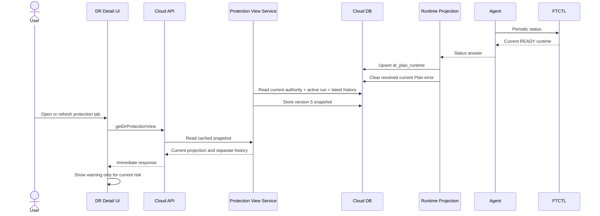

# Cross-Hypervisor DR Current Runtime, History, And Dark-Mode Warning Design

- 작성일: 2026-07-30
- 대상: Cloud UI/API/Backend/DB projection
- 비대상: Agent/FTCTL 실행 계약 변경
- 기준 Plan: `2514a846-64a2-4bc7-ba88-38a874410782`

## 1. 목적

DR 상세 화면은 현재 보호 상태와 과거 작업 이력을 서로 다른 의미로
표시해야 한다. 과거에 실패한 테스트 페일오버가 있더라도 현재 보호 권한이
`READY`로 수렴했고 스케줄러가 정상이라면 현재 상태 경고로 승격하지 않는다.

이 설계의 목표는 다음과 같다.

1. 현재 보호 상태는 `dr_plan_runtime`과 current authority를 기준으로 표시한다.
2. 과거 작업 결과는 `dr_run`과 `dr_test_session` 이력에만 보존한다.
3. Plan API와 Protection View cache가 동일한 current/history 의미를 제공한다.
4. 실제 현재 오류만 상세 상단 경고로 표시한다.
5. 경고는 밝은 모드와 다크모드 모두에서 읽을 수 있어야 한다.
6. UI는 Cloud API만 비동기로 조회하며 Agent/FTCTL을 직접 호출하지 않는다.

## 2. 실환경 Preflight 결과

설계 전 운영 상태를 읽기 전용으로 교차 검증했다.

| 계층 | 확인 결과 |
| --- | --- |
| Plan API | `state=READY`, `effectiveState=READY`, `protectionState=READY` |
| Plan API 오류 필드 | `runtimeErrorCode=DR_GUEST_OS_UNSUPPORTED`, `lastErrorMessage=DR_GUEST_OS_UNSUPPORTED` |
| 최근 작업 | `TEST_FAILOVER`, `FAILED`, `DR_GUEST_OS_UNSUPPORTED` |
| DB Plan | `READY/ENABLED/SOURCE`, `last_error_code/message` 비어 있음 |
| DB Runtime | 보호 `READY`, scheduler `RUNNING/HEALTHY` |
| DB Test Session | 과거 세션 `FAILED`, `cleanup_required=0` |
| DB View Cache | version 4, refresh 오류 없음 |
| FTCTL | `READY`, `target-checkpoint-ready`, 현재 error code/message 없음 |
| 대상 VM 계약 | `UEFI/SECURE`, 대상 체크포인트 준비 완료 |

현재 보호 상태와 엔진은 정상이다. `DR_GUEST_OS_UNSUPPORTED`는 과거
`TEST_FAILOVER` Run의 실패 이력이며 현재 보호 오류가 아니다.

과거 실패 당시 VMware guest ID `windows2019srvNext_64Guest`가 정규화되지
않았으나 현재 FTCTL guest identity resolver는 Windows 계열로 판정한다.
따라서 이 설계는 FTCTL 판별기를 다시 변경하지 않고 Cloud projection의
current/history 혼합만 교정한다.

## 3. 오류 원인

### 3.1 Backend current/history 혼합

`DrResponseGenerator.createPlanResponse()`는
`drRunDao.findLatestByPlanId()`로 최근 종료 Run을 조회하고, 해당 Run의
`last_status_json`, state, error code를 다음 current 필드에 복사한다.

- `runtimeState`
- `runtimeStep`
- `runtimeErrorCode`
- `runtimeProjectionMessage`
- `lastErrorMessage`

그 뒤 `DrProtectionAuthoritySnapshot`의 `READY` 상태가 `effectiveState`를
정상으로 덮어쓴다. 그 결과 하나의 API 응답 안에 다음 모순이 생긴다.

```text
effectiveState=READY
protectionState=READY
runtimeState=ERROR
runtimeErrorCode=DR_GUEST_OS_UNSUPPORTED
lastRun.state=FAILED
```

`lastRun`은 과거 이력으로서 올바르지만 `runtime*`는 현재 상태이므로 과거
Run에서 채우면 안 된다.

### 3.2 UI 경고 판정 오류

`DrPlanOverview.vue`의 `visibleErrorCode`와 `visibleErrorMessage`는 Plan의
`runtimeerrorcode` 또는 `lasterrormessage`가 존재하면 보호 상태와 관계없이
경고를 표시한다. Backend가 섞어 보낸 과거 실패가 곧 현재 경고가 된다.

### 3.3 다크모드 경고 스타일 누락

`.cross-dr-risk`는 border radius만 정의하고, 다크모드에서는
`.cross-dr-risk__body` 글자색만 밝게 변경한다. Ant Design warning alert의
밝은 노란 배경은 그대로이므로 밝은 글자가 밝은 배경 위에 놓인다.

전역 `cross-dr.less`에는 이미 다음 토큰과 정상 구현이 존재한다.

- `--cross-dr-warning-bg`
- `--cross-dr-warning-border`
- `--cross-dr-warning-text`
- `.cross-dr-detail-warning`

신규 색상 체계를 만들 필요 없이 기존 토큰을 적용해야 한다.

### 3.4 i18n 누락

`translatedError()`는 `DR_GUEST_OS_UNSUPPORTED`를
`message.dr.error.dr.guest.os.unsupported`로 변환하지만 한국어와 영어
locale에 해당 key가 없다. 이 때문에 오류 코드가 제목과 설명에 중복된다.

## 4. 상태 소유권

| 데이터 | 소유자 | 의미 | UI 위치 |
| --- | --- | --- | --- |
| `dr_plan.state/admin_state/active_side` | Cloud Backend | Plan lifecycle과 serving side | 상세 요약 |
| `dr_plan_runtime.*` | Runtime projection | 현재 보호/스케줄러/복제 상태 | 보호 정보 |
| `DrCurrentAuthorityProjection` | Authority resolver | 현재 권한과 현재 cutover | 상태 및 action gating |
| active `dr_run` | Orchestrator | 지금 실행 중인 사용자 작업 | 진행 카드 |
| latest `dr_run` | Run history | 가장 최근 종료 작업 | 이력 |
| `dr_test_session` | Test lifecycle | 테스트 자원과 정리 감사 정보 | 이력/세션 상세 |
| `dr_plan_view_cache` | Read projection | 위 정보를 원자적으로 담은 읽기 캐시 | 상세 화면 |
| FTCTL status | FTCTL | 엔진의 현재 실행 증거 | Agent를 거쳐 runtime projection |

핵심 규칙은 다음과 같다.

```text
current protection != latest historical operation
```

## 5. API 상세 설계

### 5.1 `DrPlanResponse` 필드 의미

기존 JSON 필드를 유지해 API 호환성을 보존하되 의미를 바로잡는다.

| 필드 | TO-BE 의미 |
| --- | --- |
| `runtimeState` | 현재 authority runtime 또는 active Run의 상태 |
| `runtimeStep` | 현재 authority runtime 또는 active Run의 단계 |
| `runtimeErrorCode` | 현재 보호 실패 또는 active Run 실패의 오류 |
| `runtimeProjectionMessage` | 현재 오류의 사용자용 요약 |
| `lastErrorCode/Message` | 현재 Plan을 차단하는 지속 오류 |
| `lastRun` | 최근 종료 작업. 성공/실패 이력이며 현재 상태가 아님 |
| `effectiveState` | current authority와 readiness를 결합한 현재 표시 상태 |

종료된 최근 Run의 실패는 `lastRun.errorCode/errorMessage`에만 남긴다.

### 5.2 응답 생성 순서

`DrResponseGenerator.createPlanResponse()`의 조립 순서를 다음처럼 변경한다.

```java
DrRunVO activeRun = drRunDao.findActiveByPlanId(plan.getId());
DrRunVO latestOperationRun = drRunDao.findLatestByPlanId(plan.getId());
DrProtectionAuthoritySnapshot authority =
        drProtectionAuthorityService.getAuthority(plan.getId());

JsonObject currentRuntime = resolveCurrentRuntime(authority, activeRun);
CurrentFailure currentFailure =
        resolveCurrentFailure(plan, authority, activeRun, currentRuntime);

populateCurrentRuntime(response, currentRuntime, currentFailure);
response.setLastRun(createRunResponse(latestOperationRun, null, false));
populateCurrentPlanError(response, plan, currentFailure);
```

새 helper의 책임은 다음과 같다.

```java
private JsonObject resolveCurrentRuntime(
        DrProtectionAuthoritySnapshot authority, DrRunVO activeRun)

private CurrentFailure resolveCurrentFailure(
        DrPlanVO plan,
        DrProtectionAuthoritySnapshot authority,
        DrRunVO activeRun,
        JsonObject currentRuntime)

private boolean isCurrentProtectionFailure(
        DrProtectionAuthoritySnapshot authority, JsonObject runtime)

private void populateCurrentRuntime(
        DrPlanResponse response,
        JsonObject runtime,
        CurrentFailure failure)
```

`resolveCurrentRuntime()` 우선순위:

1. `authority.getRuntime().getStatusJson()`
2. active Run의 `lastStatusJson`
3. 빈 JSON

latest operation Run은 이 함수의 입력이 아니다.

### 5.3 현재 오류 판정

현재 경고 오류는 다음 중 하나일 때만 노출한다.

1. protection state가 `ERROR` 또는 `DEGRADED`
2. projection integrity가 `INCONSISTENT`
3. scheduler health가 `FAILED`이고 보호 지속성에 영향을 줌
4. active Run이 terminal 실패로 수렴하는 짧은 경계 구간
5. Plan의 `last_error_code`가 아직 current authority에서 해소되지 않음

Plan이 `READY`이고 authority runtime의 error code가 비어 있으면 과거 Run의
오류를 current 오류로 사용하지 않는다.

### 5.4 현재 오류 해소 규칙

`FtctlDrRuntimeProjectionAdapter`와 lifecycle service가 정상 authority를
확정하면 기존 규칙대로 `dr_plan.last_error_code/message`를 지운다.
Response Generator는 DB 오류를 새로 복제하거나 과거 Run으로 되살리지 않는다.

## 6. Backend 및 캐시 설계

### 6.1 Protection View snapshot version 5

`DrProtectionViewServiceImpl.SNAPSHOT_VERSION`을 4에서 5로 올린다.

version 5는 다음 의미를 보장한다.

```json
{
  "version": 5,
  "planProjection": "current-only DrPlanResponse",
  "currentProtectionRuntime": "current authority runtime",
  "activeRun": "currently active operation or null",
  "latestOperationRun": "historical latest operation",
  "latestCompletedSyncCycle": "historical completed cycle"
}
```

`latestRun` compatibility alias는 한 릴리스 동안 유지할 수 있지만 current
activity 판정에는 사용하지 않는다.

### 6.2 캐시 무효화

`getProtectionView()`는 `snapshot_version < 5`이면 즉시 rebuild한다. 별도
DB migration이나 수동 row 삭제는 필요하지 않다.

성공한 refresh:

- version 5 snapshot 저장
- `cache_state=READY`
- refresh error 제거

실패한 refresh:

- 마지막 정상 snapshot 유지
- `cache_state=STALE`
- cache refresh 오류만 `last_error_*`에 기록

캐시 refresh 오류와 Plan 실행 오류를 같은 필드로 합치지 않는다.

### 6.3 트랜잭션 경계

이번 변경은 lifecycle write transaction을 바꾸지 않는다. 읽기 projection은
기존 정규화된 테이블을 조회해 snapshot 하나로 저장한다. 같은 snapshot 안의
`planProjection`, `activeRun`, `latestOperationRun`, authority sequence는 한 번의
rebuild에서 조립한다.

## 7. UI 상세 설계

### 7.1 현재 경고 gate

`DrPlanOverview.vue`에 current 위험 판정을 추가한다.

```javascript
currentProtectionFailed () {
  const state = String(
    this.plan.protectionstate ||
    this.plan.effectivestate ||
    this.plan.state ||
    ''
  ).toUpperCase()
  return ['ERROR', 'DEGRADED'].includes(state)
},
projectionInconsistent () {
  return String(this.plan.projectionintegritystate || '').toUpperCase() === 'INCONSISTENT'
},
hasCurrentRisk () {
  return this.currentProtectionFailed ||
    this.projectionInconsistent ||
    this.currentRunFailed
},
visibleErrorCode () {
  if (!this.hasCurrentRisk) return ''
  return this.plan.runtimeerrorcode ||
    this.currentRun.runtimeerrorcode ||
    this.plan.lasterrorcode ||
    this.currentRun.errorcode ||
    ''
}
```

`latestOperationRun`은 위 computed에 넣지 않는다. 과거 실패는 이력 탭의
Run row와 세부 정보에서만 표시한다.

### 7.2 Alert 구조

경고 제목은 번역 문장, 오류 코드는 보조 정보로 표시한다.

```vue
<a-alert
  v-if="showProtectionSummary && hasCurrentRisk"
  type="warning"
  show-icon
  class="cross-dr-risk cross-dr-detail-warning">
  <template #message>{{ translatedError(visibleErrorCode) }}</template>
  <template #description>
    <span v-if="visibleErrorCode" class="cross-dr-error-code">
      {{ visibleErrorCode }}
    </span>
    <span>{{ visibleErrorMessage }}</span>
  </template>
</a-alert>
```

같은 코드와 문장이 중복되면 description에는 코드만 남긴다.

### 7.3 다크모드

`cross-dr.less`의 기존 warning token을 `.cross-dr-risk`에 적용한다.

```less
body.dark-mode .cross-dr-standard-page .cross-dr-risk.ant-alert-warning {
  color: var(--cross-dr-warning-text);
  background: var(--cross-dr-warning-bg);
  border-color: var(--cross-dr-warning-border);
}

body.dark-mode .cross-dr-standard-page .cross-dr-risk .ant-alert-message,
body.dark-mode .cross-dr-standard-page .cross-dr-risk .ant-alert-description,
body.dark-mode .cross-dr-standard-page .cross-dr-risk .ant-alert-icon {
  color: var(--cross-dr-warning-text);
}

.cross-dr-risk__body {
  color: inherit;
}
```

고정된 흰색/검은색을 컴포넌트 로컬 style에 추가하지 않는다.

### 7.4 i18n

다음 key를 한국어와 영어 locale에 추가한다.

```json
"message.dr.error.dr.guest.os.unsupported":
  "원본 가상머신의 게스트 운영체제를 판별할 수 없습니다. 원본 인벤토리와 운영체제 정보를 확인한 후 다시 시도하십시오."
```

```json
"message.dr.error.dr.guest.os.unsupported":
  "The source VM guest operating system could not be identified. Refresh the source inventory and verify the guest OS before retrying."
```

이 번역은 실제 현재 오류가 재발했을 때 사용한다. 과거 이력에서는 코드와
함께 Run 상세에 표시한다.

## 8. Agent 및 FTCTL 설계

이번 변경에서 Agent와 FTCTL command/status schema는 변경하지 않는다.

- Agent는 FTCTL status를 Cloud backend에 전달한다.
- FTCTL은 현재 protection/runtime error를 status JSON에 제공한다.
- 과거 Run의 표시 위치와 UI 색상은 Cloud의 projection 책임이다.
- 현재 설치된 guest resolver가 `windows2019srvNext_64Guest`를 Windows로
  판정하므로 엔진에 중복 예외 규칙을 추가하지 않는다.

FTCTL 변경이 필요한 조건은 실제 current status가 다시
`DR_GUEST_OS_UNSUPPORTED`를 반환하는 경우뿐이다. 그 경우 별도 엔진 결함으로
분리하고 source inventory와 canonical guest resolver를 재검증한다.

## 9. DB 설계

스키마 변경은 없다.

| 테이블 | 변경 여부 | TO-BE 역할 |
| --- | --- | --- |
| `dr_plan` | 없음 | 현재 Plan lifecycle과 미해소 지속 오류 |
| `dr_plan_runtime` | 없음 | 현재 보호/스케줄러/복제 authority |
| `dr_run` | 없음 | 불변 작업 이력 |
| `dr_test_session` | 없음 | 테스트 자원 및 cleanup 감사 |
| `dr_plan_view_cache` | row 자동 갱신 | snapshot version 5 projection |

과거 Run 104와 실패 세션은 삭제하거나 성공으로 바꾸지 않는다. 감사 이력을
보존하면서 current projection에서만 분리한다.

## 10. 비동기 흐름



UI 요청은 FTCTL 작업 완료를 기다리지 않는다. 상태 갱신은 기존 backend
projection과 cache polling 경로를 유지한다.

## 11. 테스트 설계

### 11.1 Backend unit test

`DrResponseGeneratorTest`에 다음을 추가한다.

1. Plan READY + authority READY + latest Run FAILED:
   - `runtimeErrorCode == null`
   - `lastErrorMessage == null`
   - `effectiveState == READY`
   - `lastRun.state == FAILED`
2. authority ERROR + current runtime error:
   - current runtime/error 필드 유지
3. authority 없음 + active Run:
   - active Run status를 current runtime fallback으로 사용
4. latest Run FAILED만 존재:
   - current runtime fallback으로 사용하지 않음

### 11.2 Protection View test

`DrProtectionViewServiceImplTest`에 다음을 추가한다.

1. version 4 cache를 version 5로 rebuild
2. `activeRun=null`, `latestOperationRun=FAILED`를 분리해 저장
3. `planProjection`에 과거 runtime error가 없음
4. refresh 실패 시 마지막 version 5 snapshot 유지 및 cache만 STALE

### 11.3 UI unit test

`DrPlanOverview` 테스트를 추가한다.

1. READY Plan + historical failed lastRun: 경고 없음
2. protection ERROR + runtime error: 경고 표시
3. projection INCONSISTENT: 경고 표시
4. `DR_GUEST_OS_UNSUPPORTED`: 번역 문장 표시

### 11.4 시각 검증

Playwright로 밝은 모드와 다크모드에서 다음을 검증한다.

- warning 배경/테두리/제목/설명/icon이 token 색상을 사용
- 제목과 설명이 겹치지 않음
- 긴 오류 코드가 컨테이너 밖으로 넘치지 않음
- 다크모드 텍스트 대비가 WCAG AA 4.5:1 이상

### 11.5 실환경 회귀

1. version 5 cache 재생성
2. 기준 Plan은 `READY`이고 상단 경고가 없어야 함
3. 이력 탭에는 과거 `DR_GUEST_OS_UNSUPPORTED` 실패가 남아야 함
4. active sync와 scheduler 상태가 정상 갱신되어야 함
5. Failover/Test Failover action eligibility가 current authority와 일치해야 함

## 12. 권장 구현 순서

1. `DrResponseGenerator` current/history 조회와 helper 분리
2. Backend unit test로 READY + historical FAILED 계약 고정
3. Protection View snapshot version 5와 cache test 적용
4. `DrPlanOverview.vue` current-risk gate 구현
5. warning dark-mode token과 i18n 적용
6. UI unit/시각 test 수행
7. Cloud 변경 Maven module 빌드
8. 변경 class/resource와 UI static asset만 배포
9. version 5 cache 자동 rebuild 확인
10. 기준 Plan에서 현재 상태/이력/작업 메뉴 회귀 검증

## 13. AS-IS / TO-BE

| 레이어 | AS-IS | TO-BE |
| --- | --- | --- |
| UI 경고 | 오류 문자열이 있으면 현재 경고 | current protection risk일 때만 경고 |
| UI 이력 | 과거 실패가 상단 상태로 승격 | 과거 실패는 이력 탭에만 표시 |
| UI 다크모드 | 밝은 warning 배경 + 밝은 본문 | 공통 warning token으로 전체 alert 스타일 |
| UI i18n | 원시 오류 코드 반복 | 번역 문장 + 보조 오류 코드 |
| API runtime | latest 종료 Run에서 생성 | authority runtime 또는 active Run에서 생성 |
| API lastRun | current와 history 역할 혼합 | history 전용 |
| Backend | 최신 Run 실패를 Plan 오류로 재합성 | current failure resolver를 단일 사용 |
| Cache | version 4에 혼합 projection 저장 | version 5 current/history 분리 |
| DB | 데이터는 정상이지만 읽기 의미 혼합 | 스키마 유지, projection 의미만 교정 |
| Agent | 현재 상태 전달 | 변경 없음 |
| FTCTL | 현재 상태 정상 제공 | 변경 없음 |

## 14. 완료 기준

1. 기준 Plan의 현재 상태가 `READY`이고 상단 오류 경고가 없다.
2. 과거 `TEST_FAILOVER/FAILED/DR_GUEST_OS_UNSUPPORTED` 이력은 유지된다.
3. 실제 current runtime 오류를 주입하면 경고가 즉시 표시된다.
4. Plan API와 Protection View의 current 상태가 일치한다.
5. version 4 cache가 별도 DB 조작 없이 version 5로 갱신된다.
6. 다크모드 warning의 모든 텍스트와 icon을 명확히 읽을 수 있다.
7. Agent/FTCTL의 기존 성공 경로와 guest resolver에는 회귀가 없다.
## 15. 구현 및 배포 결과 (2026-07-30)

### 15.1 구현 범위

| 구성요소 | 변경 전 | 변경 후 |
| --- | --- | --- |
| UI | 과거 실패 Run의 오류가 현재 보호 경고처럼 표시됨 | 현재 protection/projection/scheduler/active Run 위험일 때만 경고 표시 |
| UI 다크모드 | 경고 컨테이너와 본문 색상이 서로 다른 theme 규칙을 사용 | 공통 warning token으로 배경, 테두리, 제목, 설명, 아이콘을 일괄 적용 |
| UI i18n | `DR_GUEST_OS_UNSUPPORTED` 코드가 사용자 문장 없이 노출 | 한글/영문 설명과 보조 오류 코드를 분리 표시 |
| API | `latestRun`을 current runtime과 `lastRun` 양쪽에 사용 | current runtime은 authority 또는 active Run, `lastRun`은 감사 이력 전용 |
| Backend | 종료된 과거 실패가 READY protection projection을 오염 | current failure resolver가 현재 authority에 의해 오류 노출 여부를 결정 |
| Cache | snapshot version 4에 current/history 혼합 projection 저장 | snapshot version 5로 자동 재생성 |
| Agent | 현재 상태를 Cloud로 전달 | 변경 없음, 기존 전달 계약 유지 |
| FTCTL | 현재 protection/runtime authority 제공 | 변경 없음, 기존 성공 경로 유지 |
| DB | 정상 데이터이나 cache projection이 과거 실패를 현재 오류로 해석 | 스키마 변경 없이 version 5 cache row만 자동 갱신 |

### 15.2 빌드 및 테스트

- WSL ext4 빌드 트리:
  `/home/ablecloud/work/builds/ablestack-cloud-current-runtime-20260730`
- Maven:
  `mvn -pl plugins/integrations/disaster-recovery -am -Dtest=DrResponseGeneratorTest,DrProtectionViewServiceImplTest -Dsurefire.failIfNoSpecifiedTests=false test`
  - 결과: `BUILD SUCCESS`
  - 테스트: 5건 통과, 실패 0, 오류 0
- Maven 변경 모듈 패키징:
  `mvn -pl plugins/integrations/disaster-recovery -am -DskipTests package`
  - 결과: `BUILD SUCCESS`
- UI 단위 테스트:
  `jest tests/unit/views/infra/dr/DrPlanOverview.spec.js --runInBand --collectCoverage=false`
  - 결과: 3건 통과
- UI 운영 빌드:
  `NODE_OPTIONS=--openssl-legacy-provider npm run build`
  - 결과: 성공

### 15.3 배포

- 관리 서버: `10.10.32.10`
- Cloud 배포 원칙:
  전체 패키지 교체 없이 Maven 산출물의 다음 클래스만 monolithic Cloud JAR에 갱신했다.
  - `com/cloud/dr/response/DrResponseGenerator.class`
  - `com/cloud/dr/DrProtectionViewServiceImpl.class`
- UI:
  `/usr/share/cloudstack-management/webapp`에 `dist` 정적 항목만 병합했다.
  `WEB-INF`는 배포 전후 모두 보존했다.
- 롤백 백업:
  `/root/dr-current-runtime-deploy-20260730-105734`
- 배포 후:
  - `mold.service=active`
  - `/client/=HTTP 200`
  - `WEB-INF=present`
  - Java class SHA256가 빌드 산출물과 일치
  - 운영 `index.html` SHA256가 UI 빌드 산출물과 일치
  - i18n 및 `cross-dr-risk` UI marker 확인

### 15.4 운영 검증

대상 Plan `2514a846-64a2-4bc7-ba88-38a874410782`에서 다음을 확인했다.

| 검증 항목 | 결과 |
| --- | --- |
| DB Plan | `READY / ENABLED / SOURCE`, current error 없음 |
| DB runtime | `READY / RUNNING / HEALTHY / IDLE / COMPLETED` |
| Cache | version `5`, projection `READY`, refresh error 없음 |
| API current runtime | `READY`, `runtimeErrorCode=null`, `lastErrorCode=null` |
| API history | `lastRun=FAILED`, `DR_GUEST_OS_UNSUPPORTED` 이력 보존 |
| Action eligibility | `testFailover=true` |
| UI | 현재 위험 경고 0건, 과거 guest OS 오류 미표시, console error 0건 |
| Agent | `mold-agent.service=active` |
| FTCTL | timer 및 Plan scheduler service `active/running`, FTCTL `0.9.1` |

### 15.5 재테스트 준비 판정

`PASS`.

현재 protection authority와 복제 scheduler는 정상이며, 과거 실패 감사 이력은 보존되면서
현재 보호 상태에서 분리되었다. 테스트 페일오버 메뉴도 활성 상태이므로 동일 Plan으로
재테스트를 진행할 수 있다.

## 16. 2026-07-30 실제 Failover 후속 계약

이 문서의 `DEGRADED` 경고 규칙은 SOURCE authority의 현재 원인 코드가 있는
상태에만 적용한다. TARGET authority의 `FAILED_OVER_UNPROTECTED`는 일반 오류가
아니며 재보호 안내로 표시한다. RPO는 Failover 시점 값으로 고정하고, UI/API/
Backend/FTCTL/DB의 후속 구현 기준은
[581-cross-hypervisor-dr-post-failover-runtime-ui-convergence-design-20260730.md](581-cross-hypervisor-dr-post-failover-runtime-ui-convergence-design-20260730.md)가
우선한다.
