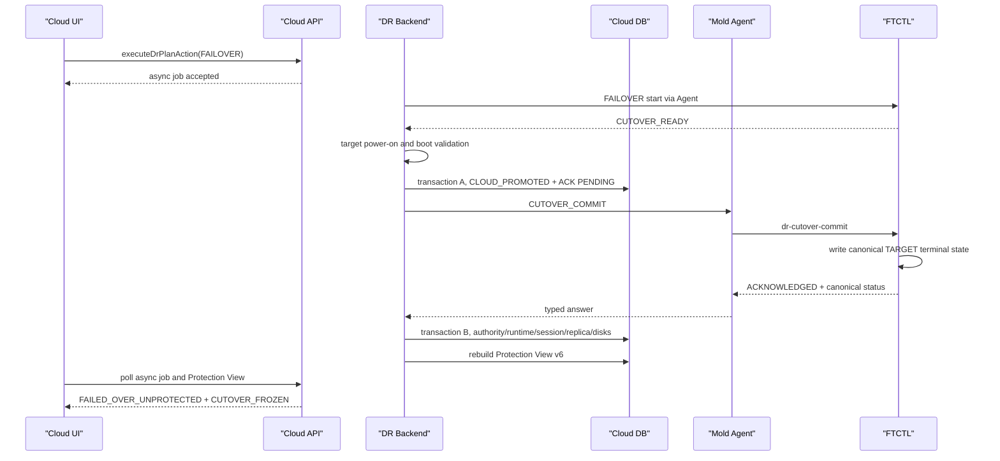

# Cross Hypervisor DR Post-Failover Runtime And UI Convergence Design

## 1. 문서 목적

이 문서는 실제 Failover가 성공했는데도 DR Plan 상세 화면에 일반 `오류`가
표시되는 문제를 해결하기 위한 구현 기준이다.

대상 범위는 다음과 같다.

- UI: 현재 권한, RPO, 경고 표시
- API: 현재 상태와 이력의 분리, Protection View snapshot
- Backend: Cloud 소유 Failover 성공 커밋과 projection 순서
- Agent: Cloud와 FTCTL 사이의 typed status 전달
- FTCTL: TARGET 권한 종단 상태의 완전한 기록
- DB: Plan, Runtime, Cutover Session, Replica, Cutover Disk 정합성

이 문서는 구현 설계이며 코드 변경, 빌드, 배포를 수행한 결과 문서가 아니다.

관련 FTCTL 계약은
[218-dr-post-failover-scheduler-terminal-authority-contract-design-20260730.md](../../../ablestack-qemu-exec-tools/docs/ftctl/218-dr-post-failover-scheduler-terminal-authority-contract-design-20260730.md)를 따른다.

## 2. 읽기 전용 Preflight 결과

검증 시각은 2026-07-30이며 대상 Plan은 다음과 같다.

```text
Plan UUID: 2514a846-64a2-4bc7-ba88-38a874410782
Plan ID: 38
Run ID: 105
Run UUID: 939e4417-207f-48a1-a3c5-8747497e61d4
Cutover Session ID: 5
Cutover Session UUID: 4ddf7d35-a265-4c2b-9dbe-f8599087ca4d
Coordinator Host: 10.10.32.2
```

### 2.1 정상 증거

| 항목 | 확인 값 | 판정 |
| --- | --- | --- |
| `dr_plan` | `FAILED_OVER / TARGET` | 정상 |
| `dr_run` | `FAILOVER / SUCCEEDED` | 정상 |
| Cutover Session | `FAILED_OVER` | 정상 |
| Cloud promotion | `PROMOTED` | 정상 |
| 대상 전원 | `POWERED_ON` | 정상 |
| Boot 검증 | `POWER_STATE_VALIDATED` | 정상 |
| Engine ACK | `ACKNOWLEDGED` | 정상 |
| Checkpoint | sequence `1192` | 정상 |
| 대상 디스크 수 | `2` | 정상 |
| FTCTL authority | `FAILED_OVER / TARGET` | 정상 |

### 2.2 불일치 증거

| 항목 | 실제 값 | 기대 값 |
| --- | --- | --- |
| Runtime protection | `DEGRADED` | `FAILED_OVER_UNPROTECTED` |
| Runtime scheduler state | `STOPPED` | `STOPPED` |
| Runtime desired state | `RUNNING` | `STOPPED` |
| Runtime scheduler health | `STOPPED` | `SUPPRESSED` |
| Runtime replication activity | `STOPPED` | `STOPPED` |
| FTCTL `scheduler_desired_state` | 필드 없음 | `STOPPED` |
| Cutover Disk 행 | `0` | `2` |
| UI warning | 일반 `오류` | 재보호 필요 상태 또는 오류 없음 |
| UI RPO | 현재 시각까지 계속 증가 | Failover 시점 RPO 고정 |

따라서 Failover 기능 결과는 성공이지만, 성공 후 상태 투영은 실패다.

## 3. 오류 원인

### 3.1 FTCTL 종단 상태 필드 누락

`lib/ftctl/dr_runtime.sh`의 Failover worker 완료 경로는
`scheduler_state=STOPPED`만 기록한다.

```text
ftctl_dr_runtime_failover_worker()
  -> scheduler_state=STOPPED
  -> scheduler_desired_state 누락
```

`ftctl_dr_runtime_cutover_commit()`도 Cloud ACK 정보를 기록할 때 scheduler의
desired, health, worker identity를 다시 정규화하지 않는다. 기존
`scheduler_desired_state=RUNNING`이 파일에 남거나 필드가 사라질 수 있다.

### 3.2 Cloud projection과 성공 커밋 순서 불일치

`FtctlDrRuntimeProjectionAdapter.refreshPlanProjection()`은 다음 순서로 동작한다.

```text
PLAN_AUTHORITY status 조회
  -> projectProtectionAuthority()
  -> OPERATION status 조회
  -> updatePlanFromStatus()
  -> commitCloudOwnedCutover()
```

즉, Runtime projection은 Cloud가 Plan을 `FAILED_OVER/TARGET`으로 커밋하기
전에 계산된다. 이후 `commitCloudOwnedCutover()`는 Plan과 Cutover Session을
갱신하지만 `dr_plan_runtime`을 성공 상태로 다시 커밋하지 않는다.

### 3.3 외부 ACK와 DB 갱신의 경계가 불명확

현재 `commitCloudOwnedCutover()`는 다음 작업을 한 메서드에서 섞는다.

- Run Step 저장
- Cutover Session 변경
- Plan 권한 변경
- Replica projection 변경
- Agent `CUTOVER_COMMIT` 호출
- ACK 저장

Agent 호출은 외부 I/O이므로 DB 트랜잭션에 포함하면 안 된다. 반대로 현재처럼
각 행을 따로 저장하면 Agent ACK 전후에 서로 다른 상태가 노출된다.

### 3.4 실제 Failover 디스크 감사 경로 부재

`upsertCutoverDisks()`는 `test_session.testArtifacts.records`만 읽는다.
따라서 실제 `FAILOVER`의 manifest와 `dr_replica_disk`는
`dr_cutover_disk`로 기록되지 않는다.

### 3.5 UI가 `DEGRADED`를 무조건 현재 오류로 처리

`DrPlanOverview.vue`의 `currentProtectionFailed`는 `ERROR`와 `DEGRADED`를
동일한 실패로 처리한다. 오류 코드와 메시지가 비어 있으면
`label.error`를 표시한다.

`FAILED_OVER_UNPROTECTED`는 실제 장애가 아니라 TARGET이 서비스 중이고
역방향 보호가 아직 구성되지 않은 상태다. 이 상태는 현재 오류 경고와 분리해야 한다.

### 3.6 Failover 후 RPO 의미가 바뀌지 않음

SOURCE authority에서는 RPO가 마지막 durable checkpoint의 현재 age다.
TARGET authority에서는 forward replication이 의도적으로 정지하므로 같은 계산을
계속하면 시간이 지날수록 잘못된 RPO 위반으로 표시된다.

## 4. 정합성 불변식

### 4.1 성공한 실제 Failover

Engine ACK 이후 다음 조건은 하나의 논리적 커밋으로 성립해야 한다.

```text
plan.state = FAILED_OVER
plan.active_side = TARGET

cutover.state = FAILED_OVER
cutover.cloud_promotion_state = PROMOTED
cutover.target_power_state = POWERED_ON
cutover.engine_ack_state = ACKNOWLEDGED

runtime.protection_state = FAILED_OVER_UNPROTECTED
runtime.scheduler_state = STOPPED
runtime.scheduler_desired_state = STOPPED
runtime.scheduler_health_state = SUPPRESSED
runtime.replication_activity_state = STOPPED
runtime.scheduler_pid_alive = false
runtime.active_worker_* = null
runtime.error_code = null
runtime.error_message = null

replica.active_side = TARGET
replica.power_state = POWERED_ON

count(active cutover disks) = cutover.target_disk_count
```

### 4.2 보호 상태와 오류 상태 분리

| 상태 | 오류 여부 | UI 표현 |
| --- | --- | --- |
| `READY` | 아니오 | 사용 가능 |
| `FAILED_OVER_UNPROTECTED` | 아니오 | 재보호 필요 |
| `TARGET_PROMOTED_ENGINE_PENDING` | 전환 중 | 커밋 확인 중 |
| `DEGRADED` + 원인 코드 | 경고 | 원인 코드 기반 경고 |
| `ERROR` + 원인 코드 | 오류 | 원인 코드 기반 오류 |
| projection `INCONSISTENT` | 오류 | 상태 정합성 오류 |

`DEGRADED`라는 문자열만으로 일반 `오류`를 만들지 않는다.

### 4.3 RPO 표시 모드

| Authority | RPO mode | 표시 값 |
| --- | --- | --- |
| SOURCE | `LIVE` | 현재 시각 - 마지막 durable checkpoint |
| TARGET, commit pending | `CUTOVER_PENDING` | 선택 checkpoint의 RPO |
| TARGET, ACK 완료 | `CUTOVER_FROZEN` | Failover 당시 `target_ready_rpo_seconds` |
| TARGET, Reprotect 완료 | `REVERSE_LIVE` | 역방향 최신 durable checkpoint age |

## 5. 목표 처리 흐름



## 6. Backend 상세 설계

### 6.1 `FtctlDrRuntimeProjectionAdapter`

파일:

```text
plugins/integrations/disaster-recovery/src/main/java/com/cloud/dr/adapter/ftctl/
  FtctlDrRuntimeProjectionAdapter.java
```

#### 변경 1: 성공 커밋 서비스를 분리

다음 메서드를 새 서비스로 이동한다.

```java
DrCutoverCommitResult prepareCloudPromotion(
    DrPlanVO plan,
    DrRunVO run,
    DrCutoverSessionVO session,
    FtctlDrStatusAnswer status,
    JsonObject runtime,
    DrTargetPowerOnResult powerOnResult);

DrCutoverCommitResult commitAcknowledgedTargetAuthority(
    long planId,
    long runId,
    long cutoverSessionId,
    long authorityGeneration,
    FtctlDrStatusAnswer acknowledgedStatus);
```

권장 클래스:

```text
com.cloud.dr.DrCutoverCommitService
com.cloud.dr.DrCutoverCommitServiceImpl
```

`prepareCloudPromotion()`은 transaction A에서 다음만 저장한다.

- Session: `CLOUD_PROMOTED`, `engine_ack_state=PENDING`
- Plan: `COMMIT_VERIFYING`, `active_side=TARGET`
- Replica: TARGET power evidence
- Run Step: `cloud-promotion=SUCCEEDED`
- Cutover Disk: `PREPARED`

Agent 호출은 transaction A 종료 후 수행한다.

`commitAcknowledgedTargetAuthority()`는 transaction B에서 다음을 저장한다.

- Plan: `FAILED_OVER/TARGET`, 오류 제거
- Session: `FAILED_OVER/ACKNOWLEDGED`, 완료 시각
- Runtime: canonical TARGET terminal state
- Replica: `TARGET/POWERED_ON`
- Cutover Disk: `PROMOTED`
- Run Step: engine reconciliation 성공

#### 변경 2: 성공 ACK 이후 Runtime 강제 수렴

공통 helper:

```java
private void applyFailedOverRuntime(
    DrPlanRuntimeVO runtime,
    FtctlDrStatusAnswer status,
    long authorityGeneration,
    Date committedAt) {
    runtime.setProtectionState("FAILED_OVER_UNPROTECTED");
    runtime.setFreshnessState("WITHIN_RPO");
    runtime.setSchedulerState("STOPPED");
    runtime.setSchedulerDesiredState("STOPPED");
    runtime.setSchedulerHealthState("SUPPRESSED");
    runtime.setSchedulerRecoveryState("SUPPRESSED");
    runtime.setReplicationActivityState("STOPPED");
    runtime.setSchedulerPidAlive(false);
    runtime.setOwnerMatched(false);
    runtime.setActiveWorkerRunUuid(null);
    runtime.setActiveWorkerPid(null);
    runtime.setActiveWorkerStartTicks(null);
    runtime.setWorkerHeartbeatAt(null);
    runtime.setErrorCode(null);
    runtime.setErrorMessage(null);
    runtime.setAuthoritySequence(authorityGeneration);
    runtime.setLastStatusAt(committedAt);
    runtime.markUpdated();
}
```

`freshness_state=WITHIN_RPO`는 저장 호환성을 위한 값이다. API는 TARGET
authority에서 이를 `CUTOVER_FROZEN` 표시 모드로 변환한다.

#### 변경 3: projection 순서 방어

`projectProtectionAuthority()`에서 다음 조건을 먼저 판정한다.

```java
boolean committedTargetAuthority =
    isTargetAuthority(plan, runtime)
    && hasAcknowledgedCurrentCutover(plan.getId());
```

이 조건이면 scheduler health와 현재 heartbeat를 사용해 `DEGRADED`를 계산하지
않고 canonical TARGET 상태를 적용한다.

이는 transaction B가 이미 완료된 뒤 오래된 status가 도착해도
Runtime을 다시 `DEGRADED/RUNNING desired`로 되돌리지 않기 위한 방어다.

#### 변경 4: finite operation 조기 반환 제한

현재 `isFiniteOperationRun()` 조기 반환은 Test Run에만 해당하지만, 조기 반환 전에
current authority projection과 session reconciliation은 항상 수행해야 한다.

권장 순서:

```text
reconcile authority
reconcile current session
reconcile active operation
if finite operation:
    do not mutate Plan authority from operation history
    return
```

### 6.2 Cutover Disk 감사

새 helper:

```java
private List<DrCutoverDiskVO> upsertRealCutoverDisks(
    DrPlanVO plan,
    DrCutoverSessionVO session,
    JsonObject failoverManifest);
```

입력 우선순위:

1. `dr_replica_disk`의 source disk index와 target volume ID
2. Plan `mapping_json`의 canonical source/target ref
3. FTCTL `failover_manifest_path`에서 전달한 artifact records

각 행에 다음을 저장한다.

```text
session_id
disk_index
provider
checkpoint_ref
writable_ref
rollback_ref
state
target_volume_id
target_volume_uuid
manifest_sha256
details_json
```

Cloud가 소유한 target volume ID/UUID는 Agent나 FTCTL이 추측하지 않는다.

`target_disk_count`와 행 수가 다르면 권한 커밋은 유지하되 다음 integrity 상태를
저장하고 비동기 backfill을 예약한다.

```text
projection_integrity_state=INCONSISTENT
projection_integrity_code=DR_CUTOVER_DISK_AUDIT_INCOMPLETE
```

이미 실행 중인 TARGET VM을 감사 데이터 문제 때문에 중지하지 않는다.

### 6.3 Cache 수렴

`DrProtectionViewServiceImpl.SNAPSHOT_VERSION`을 `6`으로 올린다.

version 6은 다음을 보장한다.

- `planProjection`은 current authority resolver 결과를 우선한다.
- `currentProtectionRuntime`과 latest Run history를 분리한다.
- RPO display mode와 reference time을 제공한다.
- 성공 커밋 직후 stale version 5 cache를 반환하지 않는다.

transaction B 성공 후 cache는 직접 데이터를 조립하지 않고
`rebuildProtectionView(planId)`를 호출한다. 이 호출은 transaction 밖에서 한다.
재생성 실패 시 DB 권한 커밋은 롤백하지 않고 기존 cache를 `STALE`로 표시한다.

## 7. API 상세 설계

### 7.1 `DrPlanResponse`

추가 필드:

```java
@SerializedName("rpoevaluationmode")
private String rpoEvaluationMode;

@SerializedName("displayrposeconds")
private Long displayRpoSeconds;

@SerializedName("rpoasof")
private Date rpoAsOf;

@SerializedName("rpostatus")
private String rpoStatus;

@SerializedName("currentseverity")
private String currentSeverity;
```

계산 규칙:

```text
SOURCE + scheduler running -> LIVE
TARGET + engine ACK pending -> CUTOVER_PENDING
TARGET + engine ACK acknowledged -> CUTOVER_FROZEN
TARGET + reverse protection ready -> REVERSE_LIVE
```

`currentSeverity`:

```text
ERROR: current error code or projection inconsistency exists
WARNING: actionable degraded reason exists
INFO: FAILED_OVER_UNPROTECTED
NONE: current risk 없음
```

API는 `FAILED_OVER_UNPROTECTED`를 `ERROR`로 반환하지 않는다.

### 7.2 Protection View version 6

```json
{
  "version": 6,
  "planProjection": {
    "state": "FAILED_OVER",
    "activeside": "TARGET",
    "effectivestate": "FAILED_OVER_UNPROTECTED",
    "protectionphase": "FAILED_OVER_UNPROTECTED",
    "currentseverity": "INFO",
    "rpoevaluationmode": "CUTOVER_FROZEN",
    "displayrposeconds": 204,
    "rpostatus": "MET"
  },
  "currentProtectionRuntime": {
    "schedulerDesiredState": "STOPPED",
    "schedulerHealthState": "SUPPRESSED",
    "replicationActivityState": "STOPPED"
  }
}
```

### 7.3 Action eligibility

`DrPlanServiceImpl.getActionEligibility()`는 raw Plan/Runtime 조합 대신
`DrCurrentAuthorityProjection`을 기준으로 한다.

`FAILED_OVER_UNPROTECTED/TARGET`의 기준:

| Action | 값 |
| --- | --- |
| Sync | false |
| Test Failover | false |
| Failover | false |
| Failback | true |
| Reprotect | true |
| Recover Sync | false |
| Release | 정책에 따라 false |

stale `scheduler_desired_state=RUNNING`은 TARGET authority에서 eligibility를
변경하지 못한다.

## 8. UI 상세 설계

### 8.1 `DrPlanOverview.vue`

`currentProtectionFailed`를 다음 세 computed로 분리한다.

```javascript
currentError () {
  return this.plan.currentseverity === 'ERROR' ||
    this.projectionInconsistent ||
    this.currentRunFailed
},
currentWarning () {
  return this.plan.currentseverity === 'WARNING'
},
reprotectRequired () {
  return this.plan.protectionphase === 'FAILED_OVER_UNPROTECTED'
}
```

표시 우선순위:

1. current error code/message
2. projection integrity error
3. active Run failure
4. actionable warning
5. 재보호 안내

메시지와 코드가 없는 상태에서 `$t('label.error')`를 fallback으로 사용하지 않는다.

`FAILED_OVER_UNPROTECTED`는 다음 안내로 표시한다.

```text
대상 사이트에서 서비스 중입니다. 지속적인 보호를 위해 재보호를 실행하십시오.
```

경고 색상은 다크모드 토큰을 사용하며 오류용 노란 박스와 구분한다.

### 8.2 `DrRpoKpi.vue`

props:

```javascript
evaluationMode: String,
asOf: [String, Date],
status: String
```

`breached`는 `evaluationMode === 'LIVE' || evaluationMode === 'REVERSE_LIVE'`
일 때만 현재 시각 기준으로 계산한다. `CUTOVER_FROZEN`은 API가 계산한
`rpostatus`를 그대로 사용한다.

표시:

```text
RPO at Failover: 3m 24s
Target: 5m
As of: 2026-07-30 11:10:02
```

### 8.3 목록과 상세의 동일 판정

목록과 상세 화면은 각각 상태를 재해석하지 않는다.
공통 helper를 둔다.

```text
ui/src/utils/dr/planState.js

resolveDrPlanState(plan, activeRun)
resolveDrPlanSeverity(plan, activeRun)
resolveDrRpoPresentation(plan)
```

목록과 상세 모두 Protection View/API의 typed 필드를 우선 사용한다.

### 8.4 i18n

한글/영문에 최소 다음 키를 추가한다.

```text
label.dr.failed.over.unprotected
label.dr.reprotect.required
label.dr.rpo.at.failover
label.dr.rpo.as.of
label.dr.cutover.commit.pending
label.dr.cutover.disk.audit.incomplete
```

## 9. Agent 상세 설계

새 command는 필요하지 않다.

- 기존 `FtctlDrActionCommand.Action.CUTOVER_COMMIT` 사용
- 기존 `FtctlDrStatusAnswer.schedulerDesiredState` 사용
- Agent는 Cloud 권한 상태를 만들거나 추론하지 않음
- FTCTL JSON을 typed field로 손실 없이 전달

보강할 테스트:

```text
LibvirtFtctlDrActionCommandWrapperTest
FtctlDrStatusCommandWrapperTest
```

검증 필드:

```text
state=FAILED_OVER
active_side=TARGET
scheduler_state=STOPPED
scheduler_desired_state=STOPPED
scheduler_health=SUPPRESSED
replication_activity=STOPPED
engine_ack_state=ACKNOWLEDGED
```

## 10. FTCTL 상세 설계

구현 기준은 qemu 문서 218을 따른다.

핵심 변경:

```text
ftctl_dr_runtime_apply_target_authority_terminal_state()
```

호출 위치:

1. Failover worker가 `CUTOVER_READY`를 만들 때
2. `dr-cutover-commit`이 ACK를 기록할 때
3. TARGET authority status를 출력하기 전 defensive validation

FTCTL은 target volume의 Cloud DB ID를 소유하지 않는다. FTCTL은 manifest의
provider/checkpoint/writable locator만 제공한다.

## 11. DB 상세 설계

### 11.1 Runtime

`dr_plan_runtime`의 기존 컬럼으로 canonical 상태를 저장할 수 있다.
신규 Runtime 컬럼은 필요하지 않다.

기존 TARGET authority 행에 대해 idempotent backfill을 수행한다.

```sql
UPDATE cloud.dr_plan_runtime runtime
JOIN cloud.dr_plan plan ON plan.id = runtime.plan_id
JOIN cloud.dr_cutover_session cutover
  ON cutover.plan_id = plan.id
 AND cutover.authority_ended_at IS NULL
 AND cutover.removed IS NULL
SET runtime.protection_state = 'FAILED_OVER_UNPROTECTED',
    runtime.scheduler_state = 'STOPPED',
    runtime.scheduler_desired_state = 'STOPPED',
    runtime.scheduler_health_state = 'SUPPRESSED',
    runtime.scheduler_recovery_state = 'SUPPRESSED',
    runtime.replication_activity_state = 'STOPPED',
    runtime.scheduler_pid_alive = 0,
    runtime.owner_matched = 0,
    runtime.active_worker_run_uuid = NULL,
    runtime.active_worker_pid = NULL,
    runtime.active_worker_start_ticks = NULL,
    runtime.worker_heartbeat_at = NULL,
    runtime.error_code = NULL,
    runtime.error_message = NULL,
    runtime.updated = NOW()
WHERE plan.active_side = 'TARGET'
  AND plan.state = 'FAILED_OVER'
  AND cutover.cloud_promotion_state = 'PROMOTED'
  AND cutover.engine_ack_state = 'ACKNOWLEDGED';
```

이 SQL은 실제 schema upgrade 파일에서는 프로젝트의 조건부 DDL/DML 형식에
맞춰 넣고, 동일 Plan에 여러 current session이 생기지 않도록 DAO 검증을 선행한다.

### 11.2 Cutover Disk

`dr_cutover_disk`에 다음 typed 컬럼을 추가한다.

```sql
ALTER TABLE cloud.dr_cutover_disk
  ADD COLUMN target_volume_id BIGINT UNSIGNED NULL AFTER state,
  ADD COLUMN target_volume_uuid VARCHAR(40) NULL AFTER target_volume_id,
  ADD COLUMN checkpoint_sequence BIGINT UNSIGNED NULL AFTER target_volume_uuid,
  ADD COLUMN manifest_sha256 VARCHAR(64) NULL AFTER checkpoint_sequence,
  ADD KEY idx_dr_cutover_disk_target_volume (target_volume_id);
```

기존 unique key `(session_id, disk_index)`는 유지한다.

동일 DDL은 다음 파일에 반영한다.

```text
setup/db/create-schema.sql
engine/schema/src/main/resources/META-INF/db/schema-Europa-After.sql
현재 업그레이드 대상 schema-*.sql
```

기존 Session의 누락 행은 Backend projection이 `dr_replica_disk`에서
idempotent하게 backfill한다. SQL에서 JSON을 직접 파싱해 생성하지 않는다.

### 11.3 Cache

`dr_plan_view_cache` DDL 변경은 없다. snapshot version 5는 version 6 조회 시
자동 rebuild된다.

## 12. 테스트 설계

### 12.1 FTCTL

추가 파일:

```text
tests/ftctl/dr_cutover_terminal_state_smoke.sh
```

케이스:

1. 기존 desired state가 RUNNING인 status로 시작
2. `dr-cutover-commit` 실행
3. run/status 파일 모두 desired STOPPED 확인
4. scheduler worker identity 제거 확인
5. 동일 generation 재호출 성공 확인
6. 낮은 generation은 stale 오류 확인

### 12.2 Backend 단위 테스트

`FtctlDrRuntimeProjectionAdapterTest`:

- successful ACK writes all canonical Runtime fields
- acknowledged TARGET status cannot become `DEGRADED`
- stale desired RUNNING is normalized to STOPPED
- Agent ACK failure leaves `COMMIT_VERIFYING`
- ACK retry completes the same Session idempotently
- disk rows equal target disk count
- disk audit failure preserves TARGET serving authority

`DrPlanServiceImplTest`:

- TARGET authority enables only Failback/Reprotect
- stale desired RUNNING does not enable Recover Sync

`DrProtectionViewServiceImplTest`:

- snapshot version is 6
- TARGET response uses `CUTOVER_FROZEN`
- latest failed historical Run does not create current error

### 12.3 UI 단위 테스트

`DrPlanOverview.spec.js`:

- `FAILED_OVER_UNPROTECTED` shows reprotect guidance
- `DEGRADED` without current reason does not show generic error
- current error code shows translated warning
- historical failed Run is shown only in history

`DrRpoKpi.spec.js`:

- LIVE RPO breach calculation
- CUTOVER_FROZEN does not age
- Failover RPO and as-of display

### 12.4 통합 테스트

PASS 조건:

```text
Run = SUCCEEDED
Plan = FAILED_OVER/TARGET
Cutover Session = FAILED_OVER/ACKNOWLEDGED
Runtime = FAILED_OVER_UNPROTECTED
Scheduler = STOPPED/desired STOPPED/SUPPRESSED
Replica = TARGET/POWERED_ON
Cutover Disk rows = target disk count
Protection View = version 6
UI = 재보호 필요, generic 오류 없음
RPO = CUTOVER_FROZEN
Failback/Reprotect = enabled
```

## 13. 권장 구현 순서

1. FTCTL canonical terminal helper와 shell smoke test
2. Agent status round-trip test
3. DB Cutover Disk typed columns와 Runtime backfill
4. Backend two-phase cutover commit service
5. Backend current authority 방어 projection
6. Real Failover disk audit upsert/backfill
7. API response와 Protection View version 6
8. UI severity/RPO 공통 resolver
9. UI 상세·목록·다크모드·i18n
10. Maven 변경 모듈 빌드와 UI unit/build
11. qemu GitHub Actions RPM 빌드
12. Cloud 변경 클래스/UI 및 FTCTL 동시 배포
13. 기존 Plan read-only projection backfill 검증
14. Windows Failover 재테스트

Cloud와 FTCTL은 동일 유지보수 창에 배포한다. Cloud가 version 6 계약을 기대하는데
구형 FTCTL이 desired state를 누락하는 혼합 상태를 허용하지 않는다.

## 14. 배포 후 검증

```text
1. FTCTL installed script contains target terminal helper
2. mold-agent active on coordinator
3. Cloud management service active
4. WEB-INF preserved and /client/ HTTP 200
5. active UI bundle contains version 6/RPO mode markers
6. DB backfill query returns no TARGET + desired RUNNING row
7. current cutover disk count equals target_disk_count
8. Protection View cache version is 6
9. UI has no generic error for FAILED_OVER_UNPROTECTED
```

## 15. AS-IS / TO-BE

| 레이어 | AS-IS | TO-BE |
| --- | --- | --- |
| UI | `DEGRADED`를 일반 오류로 표시 | current severity와 재보호 안내 분리 |
| UI RPO | Failover 후에도 age 증가 | Failover 시점 RPO 고정 |
| API | Runtime과 current authority가 충돌 | version 6 typed current projection |
| Backend | Plan/Session만 성공 커밋 | Plan/Runtime/Session/Replica/Disk 원자 수렴 |
| Backend | 외부 ACK와 DB 갱신 혼합 | transaction A, Agent I/O, transaction B |
| Agent | 계약 필드는 있으나 검증 부족 | terminal fields round-trip 검증 |
| FTCTL | desired state와 worker 종단 필드 누락 | TARGET terminal helper로 완전 기록 |
| DB Runtime | `STOPPED/RUNNING/DEGRADED` 혼합 | `STOPPED/STOPPED/FAILED_OVER_UNPROTECTED` |
| DB Disk | 실제 Failover 행 0건 | target disk 수와 동일한 typed audit 행 |
| Cache | version 5 stale warning | version 6 authority/RPO projection |

## 16. 최종 설계 판정

기능 실패가 아니라 성공 후 상태 커밋 경계의 불완전성이 원인이다.

패치는 다음 원칙을 만족해야 한다.

1. TARGET VM을 다시 만들거나 중지하지 않는다.
2. 성공한 Failover Run과 Cutover Session을 실패로 바꾸지 않는다.
3. FTCTL과 Cloud의 TARGET authority를 같은 generation으로 수렴시킨다.
4. UI는 현재 장애, 보호 공백, 과거 이력을 서로 다른 의미로 표시한다.
5. Failback/Reprotect eligibility는 current authority만으로 판정한다.
## 17. 2026-07-30 Failback Convergence Follow-up

본 문서의 `currentseverity` 규칙은 Failback의 인식된 권한 전환에도 적용한다.
active Failback Session과 generation이 일치하는
`COMMIT_VERIFYING/PROTECTION_RESUMING`은 INFO이며, Plan SOURCE와 종료 전
Cutover TARGET 기록의 공존만으로 ERROR를 만들지 않는다. Failback action
response와 post-commit sequence handoff의 상세 계약은 문서 583을 따른다.
