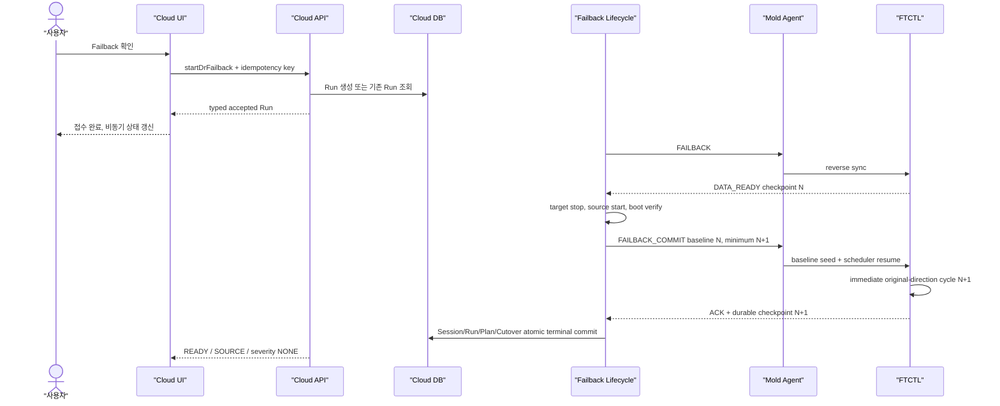

# 583. Cross Hypervisor DR Failback Action Response And Terminal Convergence Design

## 1. 목적

이 문서는 VMware 운영 사이트에서 ABLESTACK DR 사이트로 Failover한 Windows
가상머신을 원본 사이트로 Failback할 때 확인된 다음 세 문제를 하나의 계약으로
해결한다.

1. `startDrFailback`은 백엔드에서 수락됐지만 UI가 `runtype`을 찾지 못해
   `expected FAILBACK, received EMPTY` 예외를 발생시키는 문제
2. 정상적인 `TARGET -> SOURCE` 권한 전환 중 Plan과 과거 Cutover Session이
   잠시 다르다는 이유로 현재 상태를 `ERROR`로 표시하는 문제
3. Failback 기준 checkpoint와 재개된 정방향 scheduler의 첫 cycle sequence가
   중복되어 다음 RPO 주기까지 terminal 완료가 지연되는 문제

본 문서는 다음 기존 설계를 보강하며, 충돌하는 경우 본 문서가 우선한다.

- `506-cross-hypervisor-dr-cloud-ui-design-20260630.md`
- `507-cross-hypervisor-dr-cloud-api-command-design-20260630.md`
- `508-cross-hypervisor-dr-cloud-backend-wiring-design-20260630.md`
- `509-cross-hypervisor-dr-db-upgrade-and-entity-design-20260630.md`
- `510-cross-hypervisor-dr-ftctl-runtime-contract-design-20260630.md`
- `522-cross-hypervisor-dr-protection-failover-failback-sequence-design-20260701.md`
- `574-cross-hypervisor-dr-cloud-owned-failback-lifecycle-commit-design-20260726.md`
- `576-cross-hypervisor-dr-failback-late-ack-and-projection-convergence-design-20260727.md`
- `578-cross-hypervisor-dr-current-authority-and-ui-eligibility-projection-design-20260728.md`
- qemu 문서
  `219-dr-failback-post-commit-sequence-handoff-contract-design-20260730.md`

## 2. 읽기 전용 Preflight 결과

대상 Plan:

```text
plan_uuid=2514a846-64a2-4bc7-ba88-38a874410782
plan_id=38
failback_run_id=106
failback_run_uuid=15a8964c-47d0-42ca-8564-1f90f26fd732
failback_session_uuid=8694e1ce-00df-49e8-915e-30a26d8ba533
```

최종 데이터 및 제어 상태:

| 증거 | 확인 값 | 판정 |
| --- | --- | --- |
| Failback Run | `SUCCEEDED / succeeded / completed` | 정상 |
| Failback Session | `COMPLETED` | 정상 |
| Engine ACK / Commit | `ACKNOWLEDGED / ACKNOWLEDGED` | 정상 |
| Plan | `READY / SOURCE` | 정상 |
| Cutover Session | `FAILED_BACK`, authority 종료 Run `106` | 정상 |
| Target VM | `w22-01-dr`, `Stopped` | 정상 |
| Scheduler | `RUNNING` | 정상 |
| Failback 기준 checkpoint | `1193` | 기준 |
| post-failback checkpoint | `1194` | 정상 완료 |
| 후속 cycle | `1195`, `1196`, `CBT_INCREMENTAL` | 정상 |

시간 및 sequence 증거:

```text
04:23:45  Failback Run 시작
04:23:51  재개된 정방향 cycle sequence 1193 시작
04:24:09  재개된 정방향 cycle sequence 1193 완료
04:29:40  cycle sequence 1194 시작
04:29:57  cycle sequence 1194 완료
04:30:09  Failback Session/Run/Plan terminal commit
```

Failback Session의 기준 sequence도 `1193`이므로 첫 재개 cycle `1193`은
`postCheckpoint > failbackCheckpoint` 조건을 만족하지 못한다. 결과적으로 기능은
성공했지만 terminal 완료까지 약 6분 24초가 걸렸고, 그 사이 RPO가 일시적으로
목표 300초를 넘었다.

UI 콘솔 예외:

```text
DR action contract mismatch: expected FAILBACK, received EMPTY
```

이 예외 발생 후에도 DB Run이 생성되고 Failback이 완료됐으므로 엔진 실패가 아니라
액션 수락 응답을 UI가 해석하는 계약의 실패다.

## 3. 오류 원인

### 3.1 UI/API 수락 응답 계약이 포장 형식에 의존

`ui/src/api/dr.js`의 `extractDrObject()`는 명령별 response key와 item key를
휴리스틱으로 해석한다. `DrPlanList.vue`의 `executePlanAction()`은 그 결과에서
`runtype` 또는 `runType`을 즉시 읽고, 값이 없으면 이미 수락된 작업까지 실패로
판정해 Promise를 reject한다.

백엔드 `DrResponseGenerator.createRunResponse()`는 `runType`을 채우지만 현재
계약은 다음 응답 형태를 구분하지 않는다.

- 명령 response가 곧 `DrRunResponse`인 직접 응답
- response 내부에 `drrun`이 있는 중첩 응답
- 비동기 job 수락 응답
- 네트워크 재시도 시 동일 `idempotencykey`로 이미 생성된 Run

따라서 `EMPTY`는 실행 타입 불일치가 아니라 "수락 객체를 아직 복원하지 못함"으로
처리해야 한다.

### 3.2 정상적인 권한 전환을 오류로 분류

`DrFailbackLifecycleServiceImpl.projectCommittedAuthority()`는 엔진 ACK 후 Plan을
먼저 `SOURCE/SYNCING`으로 전환한다. 과거 Cutover Session은 post-failback
checkpoint 검증 후 `FAILED_BACK`으로 종료된다.

이 짧은 구간에 `DrCurrentAuthorityResolverImpl`은 SOURCE Plan과 PROMOTED
Cutover Session을 불일치로 반환하고, `DrResponseGenerator`는 모든
`!currentAuthority.isConsistent()`를 `ERROR`로 표시한다. 그러나 active
Failback Session이 `COMMIT_VERIFYING` 또는 `PROTECTION_RESUMING`인 경우 이 상태는
오류가 아니라 추적 가능한 정상 전환이다.

### 3.3 `PLAN_AUTHORITY`와 operation status의 증거를 혼용

`DrFailbackLifecycleServiceImpl.protectionResumed()`는 하나의 runtime JSON에
다음 필드가 모두 존재한다고 가정한다.

```text
active_side=SOURCE
scheduler_state=RUNNING
engine_ack_state=ACKNOWLEDGED
latest_completed_checkpoint_sequence > failback checkpoint
```

그러나 `PLAN_AUTHORITY` scope는 현재 scheduler와 checkpoint 권위를 제공하고,
`engine_ack_state`는 Failback operation/session의 durable 증거다. scope 소유권이
다른 필드를 한 JSON에서 요구하면 lifecycle worker의 완료가 projection 호출
순서에 의존한다.

### 3.4 Failback checkpoint와 scheduler sequence 인계 부재

FTCTL `dr-failback-commit`은 scheduler를 재개하지만 Failback checkpoint
sequence를 Plan의 `plan_cycle_sequence` 하한으로 원자 반영하지 않는다.
따라서 worker가 보유한 이전 cycle counter가 Failback 기준과 같거나 낮으면 첫
재개 cycle이 기준 sequence를 다시 사용할 수 있다.

## 4. 필수 불변식

### 4.1 액션 수락

1. UI는 API 수락 후 엔진 종단 완료를 기다리지 않는다.
2. 같은 `planid + idempotencykey`는 항상 같은 Run을 반환한다.
3. 수락 응답에는 `id`, `planid`, `runtype`, `state`, `accepted`,
   `idempotencykey`가 반드시 존재한다.
4. 응답 포장이 불완전해도 UI는 `idempotencykey`로 생성된 Run을 bounded
   lookup하여 복원한다.
5. 복원된 non-empty `runtype`이 요청과 다를 때만 hard contract error다.

### 4.2 권한 전환

```text
TARGET_STABLE
  -> FAILBACK_ACCEPTED
  -> REVERSE_SYNCING
  -> DATA_READY
  -> COMMIT_VERIFYING
  -> PROTECTION_RESUMING
  -> SOURCE_STABLE
```

`COMMIT_VERIFYING`과 `PROTECTION_RESUMING` 중 Plan SOURCE와 Cutover TARGET
기록이 공존하는 것은 active Failback Session과 generation이 일치할 때 정상
전환이다.

### 4.3 sequence

```text
resumeBaseline = max(
  failbackSession.checkpointSequence,
  FTCTL plan_cycle_sequence,
  FTCTL latest_completed_checkpoint_sequence
)
requiredPostFailbackSequence = resumeBaseline + 1
firstResumedCycle.sequence >= requiredPostFailbackSequence
```

동일 Plan에서 reverse-final checkpoint와 original-direction resumed cycle은 같은
sequence를 사용할 수 없다.

### 4.4 terminal 완료

다음 durable 증거를 모두 만족해야 `COMPLETED / SUCCEEDED / READY-SOURCE`로
원자 커밋한다.

```text
Cloud Plan active side == SOURCE
Failback Session engine ACK == ACKNOWLEDGED
Failback Session commit outcome == ACKNOWLEDGED
Source VM == POWERED_ON
Target VM == POWERED_OFF
PLAN_AUTHORITY scheduler == RUNNING or ACTIVE
PLAN_AUTHORITY scheduler health == HEALTHY
latest completed checkpoint >= requiredPostFailbackSequence
latest checkpoint target durability == READY
```

## 5. UI 상세 설계

### 5.1 `ui/src/api/dr.js`

다음 함수를 추가한다.

```javascript
export function normalizeAcceptedDrRun (response, command) {
  const [responseKey, itemKey] = objectKeys[command]
  const commandPayload = response?.[responseKey] || response?.data?.[responseKey] || response || {}
  const candidates = [
    commandPayload?.[itemKey],
    commandPayload?.drrun,
    commandPayload?.jobresult?.[itemKey],
    commandPayload?.jobresult,
    commandPayload
  ]
  return candidates.find(value => value && (value.id || value.runtype || value.runType)) || {}
}
```

`startDrAction()`은 단순 객체가 아니라 typed acceptance를 반환한다.

```javascript
{
  accepted: true,
  run: normalizedRun,
  jobId: '',
  idempotencyKey: params.idempotencykey,
  responseShape: 'DIRECT' | 'NESTED' | 'ASYNC_JOB' | 'RECOVERED'
}
```

응답에 Run이 없으면 `listDrRuns(planid, idempotencykey)`를 최대 10초 동안
1초 간격으로 조회한다. 이것은 작업 완료 대기가 아니라 수락 레코드 확인이다.

### 5.2 `DrPlanList.vue`

`executePlanAction()`을 다음 순서로 변경한다.

```text
request key 생성
startDrAction 호출
accepted Run 정규화 또는 idempotency lookup
non-empty runtype 검증
applyAcceptedRun
modal 종료 및 loading 해제
background polling 시작
```

`EMPTY`에는 예외를 throw하지 않는다. bounded lookup 실패 시 다음 typed 오류만
표시한다.

```text
DR_ACTION_ACCEPTANCE_NOT_VISIBLE
요청은 전송됐지만 작업 접수 상태를 확인하지 못했습니다. 이력에서 다시 확인하십시오.
```

잘못된 non-empty 타입에는 `DR_ACTION_RESPONSE_TYPE_MISMATCH`를 사용한다.
Promise rejection은 modal submit boundary에서 한 번만 catch하여 콘솔
`Uncaught (in promise)`를 만들지 않는다.

### 5.3 전환 상태 표시

`currentseverity=INFO`와 `authoritytransitionstate`가 있으면 오류 alert 대신 다음을
표시한다.

```text
원본 사이트로 서비스 권한을 전환하고 보호를 재개하고 있습니다.
```

UI는 Run terminal 상태를 자체 추론하지 않고 API의 typed transition과 severity를
사용한다.

### 5.4 UI 테스트

- direct `DrRunResponse` 정규화
- nested `drrun` 정규화
- async job result 정규화
- empty response 뒤 idempotency lookup 성공
- lookup timeout 안내
- wrong non-empty run type만 hard error
- Failback `PROTECTION_RESUMING`은 INFO
- terminal 완료 후 READY/SOURCE로 자동 전환

## 6. API 상세 설계

### 6.1 수락 응답

`AbstractDrPlanActionCmd`의 모든 start action은 동일한
`DrActionAcceptedResponse` 계약을 사용한다.

```json
{
  "id": "run-uuid",
  "planid": "plan-uuid",
  "runtype": "FAILBACK",
  "state": "QUEUED",
  "accepted": true,
  "idempotencykey": "request-uuid",
  "actioncontractversion": 1
}
```

기존 `DrRunResponse`를 유지하는 경우에도 위 필드는 direct payload에 반드시
직렬화한다. `responseName`과 `objectName` 조합은 command serialization test로
고정한다.

### 6.2 수락 복구 조회

`ListDrRunsCmd`에 선택 파라미터를 추가한다.

```java
@Parameter(name = "idempotencykey", type = CommandType.STRING)
private String idempotencyKey;
```

`DrRunService`:

```java
DrRunVO findRun(long planId, String idempotencyKey);
```

DAO에 이미 존재하는 `findByPlanIdAndIdempotencyKey()`를 service/API 경계로
노출한다. 조회는 해당 Plan 접근 권한을 검증하고 active/terminal Run 모두 반환한다.

### 6.3 Plan 전환 필드

`DrPlanResponse`와 Protection View에 다음을 추가한다.

```text
authoritytransitionstate
authoritytransitionruntype
authoritytransitionrunid
authoritytransitionstarted
authoritytransitionmessage
requiredpostfailbackcheckpointsequence
```

필드는 추가형이며 기존 클라이언트 호환성을 깨지 않는다.

## 7. Backend 상세 설계

### 7.1 수락과 실행 분리

`DrRunService.startRun()`은 DB Run 생성과 executor enqueue까지만 수행하고 bounded
시간 안에 반환한다. 실제 Agent/FTCTL 실행은 worker가 담당한다.

```java
DrRunVO run = drOrchestrator.createRun(...);
drRunExecutor.enqueue(run.getId());
return drRunDao.findById(run.getId());
```

기존 `executeRun()`이 내부 enqueue 후 즉시 반환하는 계약이라면 이를 unit test로
고정하고, Agent 완료를 기다리는 호출이 들어오지 않도록 한다.

### 7.2 `DrCurrentAuthorityResolver`

resolver는 현재 non-terminal Failback Session과 active Run을 함께 조회한다.

```java
@Inject private DrFailbackSessionDao drFailbackSessionDao;
@Inject private DrRunDao drRunDao;
```

DAO에는 Plan 기준 최신 non-terminal session 조회를 추가한다.

```java
DrFailbackSessionVO findLatestNonTerminalByPlanId(long planId);
```

```java
boolean recognizedFailbackTransition =
    plan.activeSide == SOURCE
    && cutover.cloudPromotionState == PROMOTED
    && failbackSession.state in (COMMIT_VERIFYING, PROTECTION_RESUMING)
    && failbackSession.runId == activeFailbackRun.id;
```

recognized transition이면:

```text
consistent=true
transitionState=COMMIT_VERIFYING or PROTECTION_RESUMING
authoritySide=SOURCE
currentCutoverSession=existing session
inconsistencyCode=null
```

active session 없이 stale PROMOTED cutover가 남아 있으면 기존
`AUTHORITY_INCONSISTENT_STALE_CUTOVER` 오류를 유지한다.

### 7.3 severity

우선순위를 다음과 같이 변경한다.

```text
ERROR:
  explicit runtime error
  active Run FAILED
  active Failback Session FAILED/ABORTED unexpectedly
  unrecognized authority inconsistency
  transition timeout

WARNING:
  RPO missed
  scheduler degraded but still progressing

INFO:
  recognized authority transition
  FAILED_OVER_UNPROTECTED

NONE:
  stable healthy state
```

### 7.4 scope별 증거 합성

`protectionResumed()`는 runtime 단일 객체가 아니라 typed evidence를 받는다.

```java
final class DrFailbackResumeEvidence {
    String planActiveSide;
    String engineAckState;
    String commitOutcome;
    String schedulerState;
    String schedulerHealth;
    Long latestCheckpointSequence;
    String latestCheckpointState;
    String sourcePowerState;
    String targetPowerState;
}
```

소유권:

| 필드 | 권위 소스 |
| --- | --- |
| Plan active side | `dr_plan` |
| engine ACK / commit | `dr_failback_session` |
| scheduler/checkpoint | FTCTL `PLAN_AUTHORITY` |
| source/target power | Cloud provider 및 session |

이 합성 객체를 `completeLifecycle()`의 유일한 predicate로 사용한다.

### 7.5 즉시 post-failback cycle

Failback commit command에 baseline과 최소 완료 sequence를 전달한다.

```text
resumeBaselineCheckpointSequence
minimumCompletedCheckpointSequence
forceImmediateCycle=true
```

commit ACK 후 lifecycle worker는 정규 RPO timer를 기다리지 않고 즉시 검증 cycle
하나를 요청한다. 동일 generation 재시도는 같은 요청으로 처리한다.

## 8. Agent 상세 설계

### 8.1 Command DTO

`FtctlDrActionCommand`에 nullable typed 필드를 추가한다.

```java
private Long resumeBaselineCheckpointSequence;
private Long minimumCompletedCheckpointSequence;
private Boolean forceImmediateCycle;
```

일반 action에는 null이며 `FAILBACK_COMMIT`에만 사용한다. 기존
`contextParams` 문자열 전달은 한 버전 동안 fallback으로 유지한다.

### 8.2 Wrapper

`LibvirtFtctlDrCommandHelper`는 다음 옵션을 생성한다.

```text
--resume-baseline-checkpoint-sequence N
--minimum-completed-checkpoint-sequence N+1
--force-immediate-cycle
```

숫자 검증 실패는 Agent에서 `DR_FAILBACK_SEQUENCE_HANDOFF_INVALID`로 거부한다.
secret 또는 사이트 credential은 전달하지 않는다.

### 8.3 Answer DTO

ACK에 다음을 반영한다.

```text
acceptedBaselineCheckpointSequence
nextCycleSequence
immediateCycleRequested
controlGeneration
controlAckGeneration
```

Agent는 FTCTL stdout JSON을 그대로 로그에 남기지 않고 허용된 필드만 answer에
투영한다.

## 9. FTCTL 상세 설계

상세 엔진 계약은 qemu 문서 219를 따른다.

### 9.1 신규 함수

```bash
ftctl_dr_scheduler_seed_resume_baseline PLAN BASELINE MINIMUM RUN
ftctl_dr_scheduler_request_immediate_cycle PLAN RUN REASON MINIMUM
```

baseline seed는 transition lock 안에서 sequence state를 원자 갱신한다.

```text
plan_cycle_sequence=max(current, baseline)
minimum_next_cycle_sequence=minimum
resume_owner_run=failback run
resume_generation=control generation
```

worker는 cycle 할당 시 다음을 사용한다.

```text
sequence=max(local_sequence, plan_cycle_sequence,
             minimum_next_cycle_sequence - 1) + 1
```

### 9.2 commit 순서

```text
Failback commit validation
sequence baseline seed
SOURCE authority state publish
scheduler RUN command
immediate cycle request
ACK publish
regular RPO schedule
```

baseline seed 실패 시 scheduler를 시작하지 않고 typed retryable error를 반환한다.

### 9.3 idempotency

동일 `plan + failback session + authority generation` 재호출은 기존 baseline과
minimum을 반환한다. 더 낮은 baseline은 무시하고, 같은 generation의 더 높은
minimum은 단조 증가 갱신한다.

### 9.4 capability

```text
dr-failback-sequence-handoff-v1
dr-post-failback-immediate-cycle-v1
```

Cloud preflight는 두 capability가 없으면 기존 RPO 주기 대기 방식으로 fallback하지
않고 배포 불일치 오류를 반환한다.

## 10. DB 상세 설계

`dr_failback_session`에 typed lifecycle 증거를 추가한다.

```sql
ALTER TABLE cloud.dr_failback_session
  ADD COLUMN resume_baseline_checkpoint_sequence BIGINT UNSIGNED NULL
    AFTER post_failback_checkpoint_sequence,
  ADD COLUMN required_post_failback_checkpoint_sequence BIGINT UNSIGNED NULL
    AFTER resume_baseline_checkpoint_sequence,
  ADD COLUMN protection_resume_requested_at DATETIME NULL
    AFTER required_post_failback_checkpoint_sequence,
  ADD COLUMN protection_resume_verified_at DATETIME NULL
    AFTER protection_resume_requested_at;

CREATE INDEX idx_dr_failback_session_plan_state
  ON cloud.dr_failback_session(plan_id, state, removed);
```

기존 row는 backfill하지 않는다. 신규 Failback Session부터 다음 규칙을 적용한다.

```text
resume_baseline = checkpoint_sequence
required_post_failback = checkpoint_sequence + 1
post_failback_checkpoint_sequence >= required_post_failback
```

`details_json`은 진단 보조 정보이며 위 typed 컬럼의 권위를 대체하지 않는다.

스키마는 프로젝트 규칙에 따라 다음 파일에 동일하게 반영한다.

- `schema-42200to42210.sql`
- `schema-42210to42300.sql`
- `schema-Europa-After.sql`
- `setup/db/create-schema.sql`

재실행 가능한 `INFORMATION_SCHEMA` guard를 유지한다.

## 11. 목표 시퀀스



## 12. 테스트 설계

### 12.1 UI/API

- 모든 DR start command의 direct/nested serialization contract test
- empty envelope 뒤 idempotency lookup test
- same key 재전송 시 동일 Run UUID
- wrong action intent와 wrong response run type 분리
- submit Promise rejection이 전역 콘솔로 유출되지 않음

### 12.2 Backend

- recognized `PROTECTION_RESUMING`은 `INFO`
- active session 없는 stale cutover는 `ERROR`
- `PLAN_AUTHORITY`에 `engine_ack_state`가 없어도 session ACK로 완료
- source/target power가 맞지 않으면 완료 거부
- required sequence 미만이면 완료 거부
- terminal transaction 재실행 idempotency

### 12.3 Agent/FTCTL

- baseline N에서 첫 resumed cycle이 N+1
- local counter가 N보다 낮아도 N+1
- local counter가 N보다 높으면 단조 증가
- 동일 commit 재시도에서 sequence 중복 없음
- immediate cycle 이후 regular RPO schedule 유지
- capability/CLI/Answer round-trip

### 12.4 실환경 PASS

```text
UI console contract error 없음
start API는 Run 수락 후 즉시 반환
Run type == FAILBACK
transition severity == INFO
reverse checkpoint == N
first resumed checkpoint >= N+1
post-failback checkpoint 생성이 다음 5분 timer를 기다리지 않음
source ON / target OFF
Plan READY / SOURCE
Run SUCCEEDED
Session COMPLETED
Scheduler RUNNING / HEALTHY
후속 CBT_INCREMENTAL cycle 지속
```

## 13. 권장 구현 순서

1. DB typed lifecycle 컬럼과 VO/DAO
2. FTCTL baseline seed와 immediate cycle
3. Agent Command/Answer 및 wrapper round-trip
4. Backend typed resume evidence와 terminal predicate
5. authority transition resolver와 severity
6. API accepted response serialization과 idempotency 조회
7. UI response normalizer와 bounded recovery
8. 단위/모듈/self-test
9. FTCTL GitHub Actions 빌드 및 3개 호스트 동시 배포
10. Cloud 변경 Maven 모듈 및 UI 빌드/배포
11. 라이브 Failover -> Failback 재테스트

Cloud/Agent/FTCTL 혼합 버전에서는 신규 Failback을 허용하지 않는다. capability
preflight가 먼저 통과해야 한다.

## 14. AS-IS / TO-BE

| 레이어 | AS-IS | TO-BE |
| --- | --- | --- |
| UI | `runtype`이 비면 이미 수락된 작업을 throw | 응답 정규화 후 idempotency lookup, 실제 타입 불일치만 오류 |
| API | start action 포장 형태와 필수 수락 필드가 테스트로 고정되지 않음 | 공통 accepted Run 계약과 contract version 제공 |
| Backend | 정상 권한 전환을 inconsistency ERROR로 표시 | active Failback generation과 일치하면 INFO transition |
| Lifecycle | 한 runtime JSON에 Plan/operation 증거를 모두 요구 | DB session, Cloud VM, PLAN_AUTHORITY를 typed evidence로 합성 |
| Agent | Failback 기준 sequence를 문자열 context로만 전달 | baseline/minimum/immediate cycle typed DTO |
| FTCTL | scheduler 재개 전에 Plan cycle baseline을 seed하지 않음 | baseline 원자 seed 후 첫 cycle N+1 즉시 실행 |
| DB | 기준 checkpoint와 post checkpoint만 기록 | baseline, required sequence, 요청/검증 시각을 typed 저장 |
| 운영 | terminal 완료가 다음 RPO 주기까지 지연 | commit 직후 검증 cycle로 빠르게 수렴 |

## 15. 설계 완료 판정

현재 Failback 기능 자체와 데이터 정합성은 PASS다. 그러나 UI action contract와
terminal convergence는 패치 전까지 운영 UX 및 RTO 측면에서 FAIL이다.

본 설계를 구현하면 Failback 수락, 권한 전환, 원본 방향 보호 재개가 각각의
소유권을 유지하면서도 하나의 추적 가능한 비동기 흐름으로 수렴한다.

## 16. 구현 및 검증 결과

본 설계는 Cloud UI, API, 백엔드 lifecycle, KVM agent wrapper, FTCTL 명령
계약 및 DB session model에 구현하였다.

구현된 수렴 규칙은 다음과 같다.

- 즉시 API 응답 envelope가 비어 있으면 UI가 idempotency key로 수락된 Run을 복구한다.
- API는 DR Run에 대한 idempotency key 조회를 제공한다.
- 백엔드는 원본 권한, 원본 ON, 대상 OFF, scheduler 정상, engine ACK,
  checkpoint `N+1` 증거가 모두 일치할 때만 Failback을 완료한다.
- 진행 중인 Failback 권한 전환은 오류가 아닌 정보 상태로 투영한다.
- baseline, post-failback 필수 sequence, 보호 재개 요청/검증 시각을 DB에 보존한다.

| 레이어 | 검증 항목 | 결과 |
| --- | --- | --- |
| UI | accepted Run 정규화 및 bounded recovery Jest | PASS |
| Core/KVM Agent | typed command/status wrapper 16건 | PASS |
| Backend | lifecycle terminal predicate 3건 | PASS |
| Backend | current authority resolver 3건 | PASS |
| Cloud | 변경 Maven 모듈 package build | PASS |
| UI | production bundle build | PASS |

런타임 배포 완료 판정은 다음 조건을 추가로 요구한다.

1. `dr_failback_session`에 신규 컬럼 4개가 존재한다.
2. Management 및 KVM Agent가 변경 클래스를 로딩한다.
3. 모든 Compute Host의 FTCTL이 sequence handoff 필드를 포함한다.
4. 활성 UI bundle이 accepted Run recovery 경로를 포함한다.
5. 실제 Failover 후 Failback에서 checkpoint `N+1`이 보존된 뒤에만
   `READY / SOURCE`로 수렴한다.
