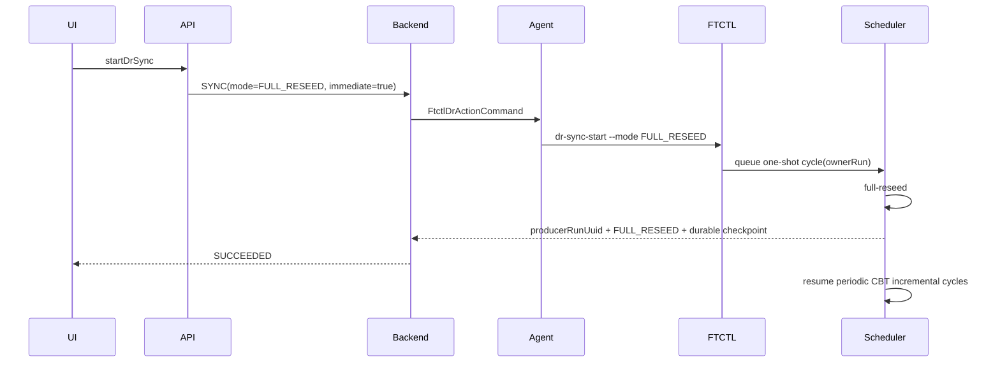

# Cross Hypervisor DR Manual Full Resynchronization Contract

## 목적

DR 계획 메뉴의 `지금 동기화`는 즉시 증분 동기화인지 전체 복제인지 의미가 불명확했다.
운영자 명령은 `전체 재동기화`로 정의하고, 정기 RPO 동기화와 별도 계약으로 처리한다.

## 동작 계약

1. UI는 메뉴에 `전체 재동기화`를 표시하고 전체 가상 디스크를 다시 복제한다는 확인 정보를 제공한다.
2. `startDrSync` API는 `SYNC` Run을 생성하되 요청 JSON에 `mode=FULL_RESEED`와
   `forceImmediateCycle=true`를 기록한다.
3. Backend는 이 값을 `FtctlDrActionCommand.mode`와 `forceImmediateCycle`로 Agent에 전달한다.
4. Agent는 `dr-sync-start --mode FULL_RESEED --force-immediate-cycle`을 실행한다.
5. FTCTL은 Plan 스케줄러에 요청 Run UUID를 소유자로 하는 1회성 `FULL_RESEED` 주기를 예약한다.
6. 해당 주기가 완료되면 새 `changeId`, `baselineGeneration`, `baselineState=LOCAL_DURABLE`을
   원자적으로 커밋하고 다음 RPO 주기부터 CBT 증분 동기화를 재개한다.
7. Cloud는 최신 완료 주기의 `producerRunUuid`가 요청 Run UUID와 같고
   `requestedMode=FULL_RESEED`일 때만 수동 전체 재동기화 Run을 완료한다.
8. FTCTL은 공용 Plan 상태와 별도로 요청 Run 상태에도 같은 완료 체크포인트 증거를 투영한다.
   따라서 Cloud의 작업별 상태 조회가 영구 스케줄러 Run이나 과거 체크포인트를 현재 요청 결과로 오인하지 않는다.

## 상태 흐름

## 오류 방지 규칙

- Cloud 프로필 재적용은 기존 디스크의 `changeId`, `cbtChangeId`,
  `baselineGeneration`, `lastSyncSequence`, `baselineState`를 보존한다.
- 전체 재동기화 요청은 스케줄러 제어 세대 변경으로 대기 중인 주기를 즉시 깨운다.
- 요청은 `PENDING -> RUNNING -> COMPLETED|FAILED`로 한 번만 소비한다.
- 과거 체크포인트가 READY라는 이유만으로 새 수동 Run을 성공 처리하지 않는다.

## AS-IS / TO-BE

| 구분 | AS-IS | TO-BE |
|---|---|---|
| 메뉴 | 지금 동기화 | 전체 재동기화 |
| 실행 의미 | 증분/전체 여부가 불명확 | 명시적 1회 FULL_RESEED |
| 스케줄러 | 기존 작업자 Run에 귀속 | 요청 Run UUID에 주기 결과 귀속 |
| 작업별 상태 | 공용 스케줄러 상태와 수동 Run이 분리될 수 있음 | 공용 상태의 완료 증거를 요청 Run에 투영 |
| CBT 기준선 | 프로필 정규화 시 유실 가능 | 커밋된 기준선 보존 |
| 완료 판정 | 과거 durable checkpoint로 조기 완료 가능 | 요청 Run 및 FULL_RESEED 결과 일치 필요 |
| 후속 주기 | 전체 재복제가 반복될 수 있음 | 새 기준선 이후 증분 동기화 |
