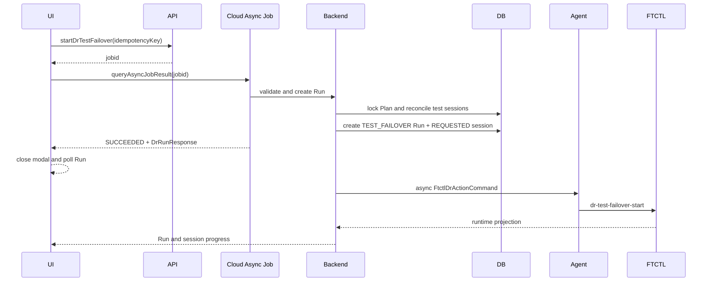
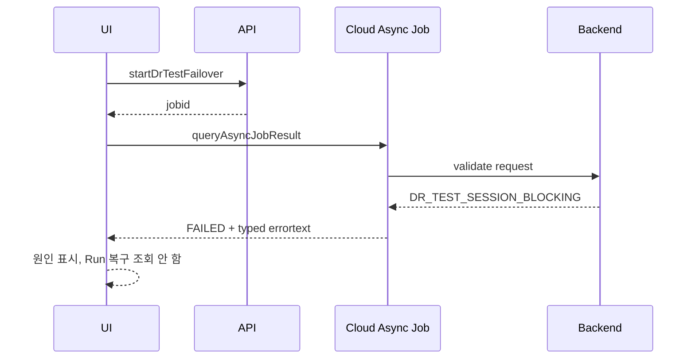
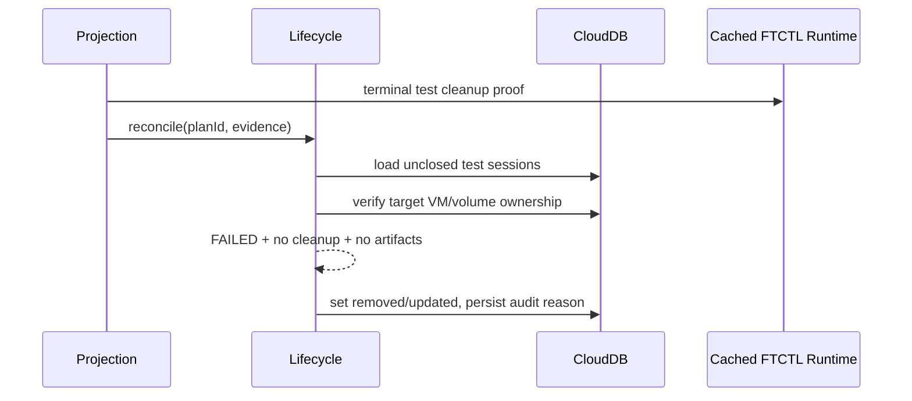

# Cross Hypervisor DR Test Session Blocker And Async Acceptance Design

## 1. 목적

이 문서는 테스트 페일오버 요청이 UI에서는 실행 가능한 것으로 표시됐지만
Cloud async job에서 다음 오류로 거부된 결함을 해결하기 위한 기준 설계다.

```text
DR_TEST_SESSION_ACTIVE: another Cloud-managed test session is active
```

UI는 실제 async job 오류 대신 다음 추정 오류를 표시했다.

```text
DR action was submitted, but its accepted run could not be confirmed
```

개선 목표는 다음과 같다.

1. 과거 실패 이력과 현재 작업을 차단하는 테스트 세션을 분리한다.
2. 메뉴 활성화 판정과 실제 실행 검증이 같은 상태 정책을 사용한다.
3. UI는 Cloud async job의 접수 결과를 먼저 확인한다.
4. Agent/FTCTL에 전달되지 않은 요청을 엔진 실패로 오인하지 않는다.
5. 종료 증거가 충분한 고아 세션은 backend reconcile로 안전하게 종결한다.
6. 실패 Run과 Test Session의 감사 이력은 종결 이후에도 조회할 수 있어야 한다.

## 2. 실환경 Preflight 결과

검증 대상은 Windows VMware to ABLESTACK DR 계획이다.

```text
plan UUID: 2514a846-64a2-4bc7-ba88-38a874410782
plan internal id: 38
```

### 2.1 정상 완료 작업

| 순서 | Run | 결과 |
|---|---|---|
| 1 | `FAILOVER` | `SUCCEEDED` |
| 2 | `FAILBACK` | `SUCCEEDED` |
| 3 | `PAUSE_SYNC` | `SUCCEEDED` |
| 4 | `RESUME_SYNC` | `SUCCEEDED` |

검증 시점의 현재 보호 상태는 다음과 같았다.

```text
plan state                 = READY
active side                = SOURCE
scheduler state            = RUNNING
scheduler health           = HEALTHY
replication activity       = IDLE
current cycle state        = COMPLETED
current cycle mode         = incremental
freshness                  = WITHIN_RPO
projection integrity       = CONSISTENT
FTCTL active test session  = none
```

따라서 보호 복제 경로 자체는 정상이며 테스트 페일오버 접수 이전 단계에서
Agent 또는 FTCTL 장애는 발견되지 않았다.

### 2.2 차단 세션

`dr_test_session`에는 다음 과거 실패 세션이 남아 있었다.

```text
id                  = 7
uuid                = 2dc32dd9-e48e-4c9e-8b22-ae401f720953
run_id              = 104
state               = FAILED
cleanup_required    = 0
target_vm_id        = NULL
error_code          = DR_GUEST_OS_UNSUPPORTED
removed             = NULL
created             = 2026-07-28 05:06:54
```

Cloud 관리 테스트 VM과 FTCTL 테스트 세션은 없고 `cleanup_required=0`이므로
이 행은 실패 감사 이력일 뿐 새 테스트를 막는 활성 세션이 아니다. 그러나
현재 DAO는 `removed IS NULL`만으로 active를 판정한다.

### 2.3 async job 증거

테스트 페일오버 요청 두 건은 모두 Cloud async job에서 즉시 실패했다.

```text
job id 2670 / status FAILED / result code 530
job id 2672 / status FAILED / result code 530
error: DR_TEST_SESSION_ACTIVE
new TEST_FAILOVER dr_run: none
Agent dispatch: none
FTCTL action execution: none
```

이 결과는 문제 경계가 UI, Cloud API acceptance, backend session policy,
DB lifecycle에 있으며 Agent/FTCTL 실행 경로에는 도달하지 않았음을 증명한다.

## 3. 오류 원인

### 3.1 활성 세션 정의 불일치

현재 구현의 판정은 서로 다르다.

| 위치 | 현재 판정 |
|---|---|
| `DrTestSessionDaoImpl.findActiveByPlanId()` | `plan_id` 일치, `removed IS NULL` |
| `DrPlanServiceImpl.getActionEligibility()` | Plan TESTING 또는 `cleanup_required`, `ACTIVE`, `CLEANUP_FAILED` |
| `DrOrchestratorImpl.createRequestedTestSession()` | `CLEANED`, `CLEANUP_FAILED`를 제외한 모든 미삭제 세션 차단 |

그 결과 `FAILED + cleanup_required=0 + removed=NULL` 세션은 UI에서
`testFailover=true`지만 backend 실행 시에는 `DR_TEST_SESSION_ACTIVE`가 된다.

`CLEANUP_FAILED`도 반대 방향의 결함이 있다. UI는 새 테스트를 비활성화하지만
orchestrator 조건은 해당 상태를 차단 대상에서 제외한다. 상태별 의미를
한 곳에 정의하지 않으면 같은 종류의 불일치가 반복된다.

### 3.2 async acceptance 처리 순서 오류

`StartDrTestFailoverCmd`는 `BaseAsyncCmd`다. 최초 응답은 DR Run이 아니라
`jobid`일 수 있다. 현재 `startDrAction()`은 `jobid`를 확인하지 않고 곧바로
응답에서 Run을 추출한 뒤 약 2초 동안 `listDrRuns`를 조회한다.

async job이 실패하면 Run은 생성되지 않으므로 조회는 항상 비어 있고,
UI는 실제 `DR_TEST_SESSION_ACTIVE` 대신
`DR_ACTION_ACCEPTANCE_UNCONFIRMED`를 생성한다.

### 3.3 실패 세션 종결 누락

`FtctlDrRuntimeProjectionAdapter.reconcileCloudManagedTestTarget()`은
엔진 실패 시 다음 값까지 계산한다.

```text
session.state = FAILED
session.cleanup_required = !hasTerminalTestCleanupProof(...)
```

하지만 `FAILED + cleanup_required=false`를 종결 처리하지 않아 `removed`가
계속 NULL로 남는다. 이력 보존과 활성 차단 상태를 같은 DAO 조회에 의존한 것이
직접 원인이다.

## 4. 설계 원칙

1. `state`는 작업 결과이고 `cleanup_required`는 잔존 리소스 정리 필요 여부다.
2. `removed`는 이력 삭제가 아니라 현재 lifecycle에서 종결됐음을 뜻한다.
3. 실패했다는 이유만으로 새 테스트를 무조건 차단하지 않는다.
4. 잔존 VM, 볼륨, artifact, lease가 있거나 정리 증거가 불충분하면 차단한다.
5. 메뉴 판정과 command 실행 검증은 동일한 lifecycle policy를 사용한다.
6. async job 완료는 DR 동작 완료가 아니라 Run 접수 성공 여부만 확정한다.
7. Run 접수 후 실제 DR 동작은 계속 backend worker와 Agent/FTCTL에서 비동기로
   수행한다.
8. UI는 backend가 반환한 typed availability와 async job 오류를 표현할 뿐
   자체 상태 추론으로 작업을 열지 않는다.

## 5. 테스트 세션 상태 모델

### 5.1 상태 분류

| 분류 | 상태 |
|---|---|
| 생성/준비 중 | `REQUESTED`, `PREPARING`, `ARTIFACTS_READY` |
| Cloud materialization 중 | `CLOUD_VOLUMES_IMPORTING`, `CLOUD_VM_CREATING`, `CLOUD_VM_STARTING` |
| 테스트 실행 중 | `ACTIVE` |
| 정리 중 | `CLOUD_CLEANUP_RUNNING`, `CLOUD_RESOURCES_REMOVED` |
| 정상 종결 | `CLEANED` |
| 실패 종결 후보 | `FAILED` |
| 정리 실패 | `CLEANUP_FAILED` |

### 5.2 blocking 판정표

| state | cleanup_required | removed | 새 테스트 차단 | 노출 작업 |
|---|---:|---|---|---|
| 비종결 상태 | 무관 | NULL | 예 | 진행 상태 또는 실행 취소 |
| `ACTIVE` | 무관 | NULL | 예 | 테스트 정리 |
| `FAILED` | 1 | NULL | 예 | 테스트 정리 |
| `FAILED` | 0 | NULL | reconcile 후 아니오 | 과거 이력 |
| `CLEANUP_FAILED` | 1 | NULL | 예 | 테스트 정리 재시도 |
| `CLEANED` | 0 | timestamp | 아니오 | 과거 이력 |
| `FAILED` | 0 | timestamp | 아니오 | 과거 이력 |

### 5.3 공통 정책 클래스

신규 클래스를 추가한다.

```java
public final class DrTestSessionLifecyclePolicy {
    boolean isTerminal(String state);
    boolean isWorkInProgress(String state);
    boolean hasCleanupObligation(DrTestSessionVO session);
    boolean blocksNewTest(DrTestSessionVO session);
    boolean canClose(DrTestSessionVO session, DrTestSessionEvidence evidence);
}
```

`blocksNewTest()`는 UI/API/backend가 모두 사용하는 단일 정의다.

```java
return session.getRemoved() == null
        && (isWorkInProgress(session.getState())
            || session.isCleanupRequired()
            || CLEANUP_FAILED.equals(session.getState()));
```

`FAILED + cleanup_required=false`는 차단하지 않지만 DB 행을 즉시 무시하지 않고
`canClose()` 증거 검증을 거쳐 `removed`를 기록한다.

## 6. 전체 흐름

### 6.1 정상 요청



UI가 기다리는 범위는 `Run accepted`까지다. Agent/FTCTL 작업 완료까지 HTTP
요청이나 화면을 차단하지 않는다.

### 6.2 async job 거부



### 6.3 고아 실패 세션 자동 종결



## 7. UI 상세 코드 설계

### 7.1 대상 파일

```text
ui/src/api/dr.js
ui/src/views/infra/dr/DrPlanList.vue
ui/src/utils/dr/actionAvailability.js
ui/public/locales/ko_KR.json
ui/public/locales/en.json
ui/tests/unit/api/dr.spec.js
ui/tests/unit/views/infra/dr/DrPlanList.spec.js
```

### 7.2 `startDrAction()` 처리 순서

현재 `postAPI -> extract run -> recoverAcceptedDrRun` 순서를 다음과 같이 바꾼다.

```javascript
export async function startDrAction (command, params, options = {}) {
  const response = await postAPI(command, params)
  const jobId = extractJobId(response, command)
  const acceptedObject = jobId
    ? await waitForDrJobObject(jobId, command, {
      intervalMs: options.acceptanceIntervalMs || 500,
      timeoutMs: options.acceptanceTimeoutMs || 30000
    })
    : extractDrObject(response, command)

  const run = normalizeAcceptedDrRun(acceptedObject)
  const expectedRunType = options.expectedRunType || params?.actionintent || ''
  if (hasAcceptedRunIdentity(run, expectedRunType)) {
    return run
  }
  return recoverAcceptedDrRun(
    params.planid,
    params.idempotencykey,
    expectedRunType,
    options
  )
}
```

규칙은 다음과 같다.

- `jobstatus=2`이면 `buildDrJobError()`가 실제 `errortext`를 throw한다.
- 실패한 async job에는 `recoverAcceptedDrRun()`을 실행하지 않는다.
- `recoverAcceptedDrRun()`은 async job 성공 후 response serialization 또는
  read-after-write 지연으로 Run 객체가 비어 있을 때만 사용한다.
- acceptance timeout과 DR operation timeout을 분리한다.
- modal은 acceptance 성공 후 닫히며 실제 작업은 Run polling으로 표시한다.

### 7.3 오류 정규화

`buildDrJobError()`는 다음 필드를 보존한다.

```javascript
error.code
error.message
error.jobid
error.command
error.response.data.errorresponse
```

`errortext`의 첫 토큰이 `DR_*` 형식이면 `error.code`로 승격한다.

```text
DR_TEST_SESSION_BLOCKING
DR_TEST_SESSION_RECONCILE_REQUIRED
DR_ACTION_ACCEPTANCE_UNCONFIRMED
```

한국어 UI는 다음 의미로 표시한다.

| 코드 | 사용자 메시지 |
|---|---|
| `DR_TEST_SESSION_BLOCKING` | 이전 테스트 환경이 남아 있어 새 테스트를 시작할 수 없습니다. 테스트 정리를 실행하십시오. |
| `DR_TEST_SESSION_RECONCILE_REQUIRED` | 이전 테스트 상태를 확인 중입니다. 잠시 후 다시 시도하십시오. |
| `DR_ACTION_ACCEPTANCE_UNCONFIRMED` | 요청 접수 상태를 확인하지 못했습니다. 실행 이력을 새로고침하십시오. |

### 7.4 메뉴 활성화

UI는 `actionavailability.testFailover`의 `enabled`만 사용한다.
`plan.state`, 과거 Run, test session label을 조합해 다시 활성화하지 않는다.

차단 상태에는 backend가 제공한 다음 안전한 정보만 tooltip에 사용한다.

```json
{
  "reasoncode": "DR_ACTION_TEST_SESSION_BLOCKING",
  "reasonargs": {
    "state": "CLEANUP_FAILED",
    "cleanupRequired": true
  }
}
```

내부 DB id, target host 경로, artifact locator는 UI에 노출하지 않는다.

## 8. API 상세 코드 설계

### 8.1 Action command 계약

`StartDrTestFailoverCmd`와 다른 DR action command는 `BaseAsyncCmd`를 유지한다.
API command의 async job은 장시간 DR 작업을 수행하는 job이 아니라 backend가
Run을 검증하고 접수하는 job이다.

성공 job result는 반드시 typed `DrRunResponse`를 포함한다.

```json
{
  "queryasyncjobresultresponse": {
    "jobstatus": 1,
    "jobresult": {
      "startdrtestfailoverresponse": {
        "drrun": {
          "id": "...",
          "runtype": "TEST_FAILOVER",
          "state": "QUEUED"
        }
      }
    }
  }
}
```

실패는 Run을 만들지 않고 typed reason code를 유지한다.

```json
{
  "jobstatus": 2,
  "jobresult": {
    "errorcode": 530,
    "errortext": "DR_TEST_SESSION_BLOCKING: previous test session requires cleanup"
  }
}
```

### 8.2 Plan action availability

`DrPlanResponse.actionavailability`와 Protection View의
`planProjection.actionavailability`는 같은 evaluator 결과를 사용한다.

고아 세션 reconcile 전에는 안전하게 disabled로 반환하고, reconcile 완료 후
새 snapshot에서는 enabled로 바뀐다. boolean 호환 필드인
`actioneligibility.testFailover`도 같은 `enabled` 값에서 파생한다.

Protection View cache에 blocking session summary와 새로운 reason을 포함하므로
snapshot version은 `7 -> 8`로 올린다. version 7 cache는 조회 시 재생성한다.

## 9. Backend 상세 코드 설계

### 9.1 신규 구성요소

```text
DrTestSessionLifecyclePolicy
DrTestSessionLifecycleService
DrTestSessionLifecycleServiceImpl
DrTestSessionEvidence
DrTestSessionResolution
```

주요 인터페이스는 다음과 같다.

```java
public interface DrTestSessionLifecycleService {
    DrTestSessionResolution resolveForAction(long planId);
    DrTestSessionResolution reconcile(long planId, DrTestSessionEvidence evidence);
    DrTestSessionVO createRequestedSession(
            DrPlanVO plan, DrRunVO run, String requestJson);
}
```

`DrTestSessionResolution`은 다음을 반환한다.

```java
DrTestSessionVO blockingSession;
boolean reconciled;
String reasonCode;
Map<String, String> safeReasonArgs;
```

### 9.2 orchestrator 변경

`DrOrchestratorImpl.createRequestedTestSession()`의 개별 상태 비교를 제거하고
lifecycle service에 위임한다.

```java
DrTestSessionResolution resolution =
        drTestSessionLifecycleService.resolveForAction(plan.getId());
if (resolution.hasBlocker()) {
    throw new InvalidParameterValueException(
            resolution.getReasonCode() + ": previous test session blocks execution");
}
drTestSessionLifecycleService.createRequestedSession(plan, run, requestJson);
```

Plan 단위 동시 요청을 막기 위해 Run 및 Test Session 생성 구간에서
`drPlanDao.acquireInLockTable(planId, timeout)`을 사용한다. 잠금 안에서
idempotency Run 재조회, blocking session 재조회, Run/Session 생성을
하나의 transaction으로 수행한다.

### 9.3 action availability 변경

`DrPlanServiceImpl`의 독립 `testRunning` 계산을 제거한다.

```java
DrTestSessionResolution testSession =
        drTestSessionLifecycleService.resolveForAction(planId);
context.testSessionBlocking = testSession.hasBlocker();
context.testCleanupRequired = testSession.requiresCleanup();
context.testSessionState = testSession.getState();
```

`DrPlanActionAvailabilityEvaluator`는 다음 규칙을 사용한다.

```text
testFailover enabled = base readiness && !testSessionBlocking
stopTestFailover applicable = ACTIVE or cleanup obligation
stopTestFailover enabled = cleanup obligation && !activeRun
```

`FAILED + cleanup_required=false` 이력은 testRunning으로 계산하지 않는다.
`CLEANUP_FAILED`는 반드시 새 테스트를 차단한다.

### 9.4 runtime projection 종결 처리

`FtctlDrRuntimeProjectionAdapter`가 `FAILED`를 투영한 뒤 terminal cleanup proof가
있으면 lifecycle service를 호출한다.

종결 조건은 모두 만족해야 한다.

1. session state가 `FAILED` 또는 `CLEANED`
2. `cleanup_required=false`
3. Cloud target test VM이 없거나 removed/expunging
4. 활성 test disk ownership 행 없음
5. FTCTL test session/artifact/lease가 terminal 또는 absent
6. 현재 active Run이 해당 test session을 실행 중이지 않음

조건을 만족하면 다음을 원자적으로 기록한다.

```text
dr_test_session.removed = now
dr_test_session.updated = now
details_json.lifecycleCloseReason = TERMINAL_NO_CLEANUP
details_json.lifecycleEvidence = safe summarized proof
```

원본 Run의 `FAILED`, `error_code`, `error_message`는 변경하지 않는다.

### 9.5 정기 reconcile

다음 경로에서 동일한 멱등 reconcile을 호출한다.

- FTCTL status projection
- `refreshDrProtectionView`
- test failover action pre-validation
- management startup 또는 scheduled stale-session reconciler

host RPC를 목록 조회마다 동기 호출하지 않는다. 일반 조회는 DB와 cached runtime
증거를 사용하고, 강제 refresh 또는 scheduled reconciler가 최신 엔진 증거를
갱신한다.

## 10. DAO 및 DB 상세 설계

### 10.1 DAO 의미 분리

기존 메서드 이름의 `active` 의미를 제거한다.

```java
DrTestSessionVO findOpenByRunId(long runId);
List<DrTestSessionVO> listOpenByPlanId(long planId);
DrTestSessionVO findHistoricalByRunId(long runId);
List<DrTestSessionVO> listHistoricalByPlanId(long planId, Filter filter);
```

`findBlockingByPlanId()`를 DAO에 직접 구현하지 않는다. blocking은
`state + cleanup_required + evidence`를 사용하는 domain policy이므로
lifecycle service에서 계산한다.

### 10.2 이력 조회

soft-removed 세션도 Run 이력에서 조회돼야 한다. `DrResponseGenerator`는
과거 Run 응답 생성 시 `findHistoricalByRunId()`를 사용한다. 현재 진행 상태만
조회하는 projection은 `findOpenByRunId()`를 사용한다.

### 10.3 schema

필수 신규 컬럼은 없다. 기존 컬럼 의미를 다음과 같이 고정한다.

| 컬럼 | 의미 |
|---|---|
| `state` | 세션 실행 결과/진행 상태 |
| `cleanup_required` | Cloud/FTCTL 소유 리소스 정리 의무 |
| `removed` | 현재 lifecycle 종결 시각 |
| `details_json` | 종결 사유와 안전한 terminal proof 요약 |

조회 성능을 위해 기존 `(plan_id, removed)` 인덱스를 유지한다. 실제 운영
통계에서 open session 수가 커질 때만 다음 보조 인덱스를 검토한다.

```sql
KEY idx_dr_test_session_plan_state
    (plan_id, removed, cleanup_required, state)
```

### 10.4 기존 데이터 보정

DB upgrade SQL에서 모든 `FAILED` 행을 일괄 종결하지 않는다. 잔존 artifact와
VM 여부는 정적 SQL만으로 증명할 수 없기 때문이다.

배포 후 lifecycle reconciler가 다음 순서로 보정한다.

1. `removed IS NULL` 세션 조회
2. Run/Test Session/Cloud VM/Test Disk/cached FTCTL proof 결합
3. 종결 가능한 세션만 soft close
4. 불충분한 세션은 차단 유지 및 typed reason 기록
5. 보정 event를 `dr_event`에 남김

현재 plan 38의 session 7은 실환경 Preflight에서 target VM 없음,
cleanup 의무 없음, FTCTL 테스트 세션 없음이 확인됐으므로 reconcile 대상이다.
직접 SQL 수정은 사용하지 않는다.

## 11. Agent 상세 설계

이번 요청은 Cloud backend에서 거부돼 Agent까지 도달하지 않았으므로 신규
Agent action은 추가하지 않는다.

Agent의 책임은 기존과 같다.

- Cloud가 접수한 Run의 action intent 검증
- FTCTL action 비동기 전달
- typed test session/artifact/cleanup/lease 상태 전달
- Cloud DB 또는 메뉴 상태 계산 금지

회귀 테스트는 `DR_TEST_SESSION_BLOCKING` 요청에서 Agent command가 전혀
생성되지 않는지 확인하고, reconcile 후 새 요청에서는 정확히 한 번
`TEST_FAILOVER` command가 전달되는지 확인한다.

## 12. FTCTL 상세 설계

FTCTL은 이미 현재 테스트 세션 부재와 cleanup proof를 status로 제공한다.
따라서 신규 CLI 또는 engine state는 필요하지 않다.

유지할 typed status 계약은 다음과 같다.

```text
test_session_state
test_artifacts_state
test_cleanup_state
test_artifact_count
checkpoint_lease_state
worker_state
worker_exit_code
```

Cloud는 이 값을 세션 종결 증거로 사용하되 FTCTL의 과거 failure event를
현재 활성 테스트 세션으로 해석하지 않는다. FTCTL은 Cloud Test Session
행을 생성하거나 `removed`를 결정하지 않는다.

## 13. 오류 코드

| 코드 | 계층 | 의미 |
|---|---|---|
| `DR_ACTION_TEST_SESSION_BLOCKING` | availability | 현재 세션 또는 정리 의무 때문에 작업 비활성 |
| `DR_TEST_SESSION_BLOCKING` | backend action | transaction 재검증에서 blocking session 발견 |
| `DR_TEST_SESSION_RECONCILE_REQUIRED` | backend | 증거 부족으로 자동 종결 불가 |
| `DR_ACTION_ACCEPTANCE_UNCONFIRMED` | UI | async job 성공 후에도 Run identity 복구 실패 |
| `DR_ACTION_ASYNC_JOB_FAILED` | UI/API | Cloud async job 자체 실패, 원본 errortext 포함 |

`DR_TEST_SESSION_ACTIVE`는 하위 호환 입력으로 인식하되 신규 backend 응답은
상태 의미가 더 정확한 `DR_TEST_SESSION_BLOCKING`을 사용한다.

## 14. 테스트 설계

### 14.1 Backend 단위 테스트

| 입력 | 기대 |
|---|---|
| `FAILED/cleanup=false/removed=NULL`, terminal proof | soft close, 새 테스트 허용 |
| `FAILED/cleanup=true` | 새 테스트 차단, cleanup 활성 |
| `CLEANUP_FAILED` | 새 테스트 차단, cleanup 재시도 활성 |
| `ACTIVE` | 새 테스트 차단 |
| `CLEANED/removed!=NULL` | 새 테스트 허용 |
| target VM 존재 + runtime session absent | 자동 종결 금지 |
| 같은 idempotency key 재요청 | 같은 Run 반환 |
| 동시 신규 요청 2건 | Run/Test Session 한 건만 생성 |

대상 테스트 클래스:

```text
DrTestSessionLifecyclePolicyTest
DrTestSessionLifecycleServiceImplTest
DrPlanServiceImplTest
DrPlanActionAvailabilityEvaluatorTest
DrOrchestratorImplTest
FtctlDrRuntimeProjectionAdapterTest
DrResponseGeneratorTest
```

### 14.2 UI 단위 테스트

1. action POST가 `jobid`를 반환하면 `queryAsyncJobResult`를 먼저 호출한다.
2. job 실패 시 `listDrRuns`를 호출하지 않는다.
3. job 실패의 `DR_TEST_SESSION_BLOCKING`을 그대로 표시한다.
4. job 성공 후 Run 객체가 있으면 즉시 Run polling으로 전환한다.
5. job 성공 후 Run 객체가 없을 때만 idempotency recovery를 수행한다.
6. recovery timeout은 중복 action을 자동 재전송하지 않는다.

### 14.3 통합 Preflight

패치 후 재테스트 전에 다음을 확인한다.

```text
Plan READY / SOURCE
scheduler RUNNING / HEALTHY
no active DR Run
no Cloud test VM or test disk
FTCTL test session/artifact/lease absent
old FAILED session soft-closed
testFailover availability enabled
stopTestFailover unavailable
```

테스트 실행 후에는 다음을 확인한다.

```text
async job SUCCEEDED
new TEST_FAILOVER Run exactly one
new REQUESTED Test Session exactly one
Agent command actionIntent=TEST_FAILOVER
FTCTL test artifact lifecycle starts
UI shows accepted Run, not acceptance-unconfirmed
```

## 15. 권장 구현 순서

1. `DrTestSessionLifecyclePolicy`와 상태 matrix 단위 테스트
2. DAO open/history 메서드 분리
3. lifecycle service 및 terminal soft-close transaction 구현
4. orchestrator의 세션 검증/생성을 lifecycle service로 이관
5. action availability evaluator를 같은 resolution으로 통합
6. runtime projection과 scheduled reconcile 연결
7. API typed reason 및 Protection View cache version 8 반영
8. UI `startDrAction()` async job 우선 처리
9. UI 오류 locale, tooltip, 재시도 동작 보강
10. changed-module Maven/UI unit test
11. Cloud 변경 클래스와 UI 정적 자산 배포
12. 기존 session 7 backend reconcile 및 재테스트

Agent/FTCTL 소스 변경은 status 계약 검증에서 결함이 발견될 때만 수행한다.
현재 Preflight 기준으로는 배포 provenance 확인과 회귀 테스트만 필요하다.

## 16. 완료 기준

1. 과거 실패 세션은 이력에 남지만 새 테스트를 막지 않는다.
2. 잔존 리소스가 있는 실패 세션은 새 테스트를 확실히 막는다.
3. 목록/상세/API/action command의 availability 판정이 동일하다.
4. async job 실패 원인이 UI에 그대로 표시된다.
5. async job 실패 시 신규 Run, Agent command, FTCTL 작업이 생성되지 않는다.
6. async job 성공 시 UI는 접수된 Run UUID를 확보하고 즉시 비동기 상태 조회로
   전환한다.
7. 기존 정상 복제와 Failover/Failback/Pause/Resume 상태는 변경되지 않는다.

## 17. AS-IS / TO-BE

| 계층 | AS-IS | TO-BE |
|---|---|---|
| UI | jobid를 무시하고 2초간 Run만 조회 | async job 접수 결과 확인 후 Run 조회 |
| UI 오류 | 실제 backend 오류를 acceptance 미확인으로 치환 | job errortext와 reason code 표시 |
| API | BaseAsyncCmd 성공/실패와 Run 복구 경계 불명확 | job success는 typed Run, failure는 typed error |
| 메뉴 판정 | 일부 상태만 testRunning으로 계산 | 공통 lifecycle resolution 사용 |
| Backend 실행 검증 | 별도 상태 문자열 비교 | 공통 `blocksNewTest()` 정책 사용 |
| `FAILED` 세션 | cleanup 불필요해도 미삭제이면 차단 | terminal proof 확인 후 soft close |
| `CLEANUP_FAILED` | UI와 orchestrator 판정 불일치 | 항상 새 테스트 차단, cleanup만 허용 |
| DAO | `removed IS NULL`을 active로 명명 | open/history 조회와 blocking 정책 분리 |
| DB 이력 | soft close 시 history 조회 경계 불명확 | removed 포함 historical DAO로 감사 이력 유지 |
| Reconcile | projection이 cleanup flag만 갱신 | Cloud/FTCTL 증거로 terminal session 종결 |
| Agent | 요청이 오지 않았지만 엔진 원인으로 오인 가능 | Cloud blocker 단계와 Agent dispatch를 명확히 분리 |
| FTCTL | 과거 failure와 현재 session 부재의 소비 경계 불명확 | typed terminal proof만 제공, Cloud가 lifecycle 종결 |

## 18. 구현 결과

2026-07-31 기준 다음 범위를 구현했다.

1. `DrTestSessionState.blocksNewTest()`에 세션 상태, 정리 필요 여부,
   대상 VM 존재 여부를 함께 평가하는 공통 차단 정책을 추가했다.
2. `FAILED`, `cleanup_required=0`, `target_vm_id IS NULL`이며 런타임 정리
   증거가 확인된 세션은 projection 과정에서 soft close한다.
3. soft close된 세션도 실행 이력에 남도록 removed 포함 run-id 조회 DAO를
   분리했다.
4. orchestrator 실행 검증과 action availability가 동일한
   `blocksNewTest()` 정책을 사용하도록 통합했다.
5. UI `startDrAction()`은 `jobid`가 있으면 먼저 `queryAsyncJobResult`로
   Cloud 접수 성공을 확인하고, 성공한 경우에만 Run을 추적한다.
6. async job 실패의 `errortext`와 `DR_*` reason code를 사용자 오류로
   보존하고, 실패 후 Run 복구 polling은 수행하지 않는다.

검증 결과:

- UI API 단위 테스트: 5건 PASS
- DR Maven 대상 테스트: 46건 PASS
- Checkstyle: 위반 0건
- Agent/FTCTL: 신규 명령 및 프로파일 변경 없음

배포 후에는 과거 세션 7을 terminal proof에 따라 soft close하고,
`testFailover=true`, 활성 Run 없음, Agent/FTCTL 테스트 artifact 없음까지
확인한 뒤 재테스트를 시작한다.

### 18.1 배포 및 재테스트 준비 결과

2026-07-31 실환경 반영 결과:

- Cloud 변경 클래스는 Maven으로 빌드한 클래스만 활성 Cloud JAR에 갱신했다.
- UI 정적 산출물은 `WEB-INF`, `META-INF`, 운영 `config.json`을 보존하고
  활성 webapp에 덮어썼다.
- 배포 백업: `/root/ftctl-dr-deploy-20260731-142534`
- `mold=active`, `/client/=HTTP 200`, `WEB-INF=present`
- 활성 클래스와 배포 payload SHA-256 일치
- UI bundle에서 `extractJobId`, `DR_ACTION_ASYNC_JOB_FAILED`,
  `blockingLoadingState`, `fetchSyncProgress` 확인
- Protection View snapshot version 8 재생성 확인
- 세션 7은 terminal cleanup proof와 활성 artifact 부재를 확인한 뒤
  `removed`를 기록했다.
- 세션 7은 removed 이후에도 과거 TEST_FAILOVER Run의
  `testsessionid`, `testsessionstate=FAILED`로 조회된다.
- Plan은 `READY`, `SOURCE`, scheduler `RUNNING/HEALTHY`,
  cycle `COMPLETED/incremental`, RPO `MET`이다.
- `testFailover` action availability는 enabled이며 활성 Test Session과
  활성 Run은 0건이다.

추가 검증에서 removed 포함 DAO가 `findOneBy()`를 사용해 자동
`removed IS NULL` 조건을 다시 적용하는 결함을 발견했다. 이를
`findOneIncludingRemovedBy()`로 교정하고 재배포했다.

## 19. 전체 디스크 체크포인트와 terminal 투영 보강 (2026-09-02)

Ubuntu 다중 디스크 테스트에서 각 qcow2 파일은 정상이었지만 루트 디스크만
검사한 `virt-inspector`가 다른 디스크의 LVM `/DATA`를 찾지 못해 테스트
페일오버가 실패했다. 실패 뒤 FTCTL 상태가 대용량 XML을 포함하면서 상태
경계를 넘었고, Cloud는 원본 오류 대신 `DR_STATUS_JSON_INVALID`를 받아 Run을
진행 중으로 남겼다.

| 계층 | AS-IS | TO-BE |
|---|---|---|
| 체크포인트 | 디스크별 seal 및 개별 guest 검사 | 계획에 매핑된 전체 디스크를 하나의 순서 보존 세트로 seal 및 공동 검사 |
| 공개 조건 | 개별 디스크 성공 시 즉시 사용 가능 | 전체 세트 성공 후에만 manifest와 모든 test overlay 공개 |
| 실패 원자성 | 앞 디스크 산출물이 남을 수 있음 | 한 디스크 실패 시 해당 요청에서 만든 세트 전체 폐기 |
| Linux 판정 | 루트 디스크만으로 모든 mount 판정 | 전체 디스크 연결 후 필수 로컬 fstab mount 판정 |
| 상태 오류 | 대용량 출력이 원본 오류를 덮음 | 4 KiB 요약과 별도 evidence, 최소 authoritative terminal 응답 |
| Cloud 세션 | Run이 stale 상태로 남고 cleanup blocker 유지 | 실제 오류로 FAILED 종결하고 CLEANED/RELEASED 증거로 soft close |
| 계획 상태 | 최근 테스트 실패가 보호 실패처럼 보일 수 있음 | 보호 상태는 유지하고 최근 유한 작업 실패를 별도로 표시 |

디스크 수에 대한 상수 제한은 두지 않는다. Cloud의 전체 `artifactSpec.disks`
배열, FTCTL checkpoint-set manifest, Cloud가 import하는 디스크 목록의 순서와
개수가 모두 일치해야 한다. 1, 2, 4, 8개 디스크 및 중간 디스크 실패를
회귀 테스트로 고정한다.

RBD 경로도 동일한 cross-disk 시점 위험을 점검했다. VMware to RBD는 기존
로컬 scheduler transition을 유지한다. 원격 RBD to RBD는 기존 RBD
snapshot/clone 구현을 변경하지 않고, 실행 전에 원격 source scheduler pause와
모든 target export drain을 완료한다. FILE, RBD 모두 동일 durable Cycle과 lease를
사용하며, provider별 artifact 구현은 분리한다.

### 19.1 실행 이력 API의 evidence 경계

과거 실패 Run의 `details_json`에 shell-escaped XML이 남아 있더라도 실행 이력
목록 전체가 파싱 불가능해져서는 안 된다. `errormessage`는 XML 시작 전의 사용자
요약만 반환하고, 파싱 불가능한 원시 `details_json`은 API에 재삽입하지 않는다.
대신 `rawDetailsRedacted=true`, `parseError=true`인 작은 JSON 표지만 반환한다.
전체 `virt-inspector` XML과 디스크별 검사 출력은 FTCTL evidence 파일에만 보관한다.

이 규칙은 신규 Run뿐 아니라 기존 DB 이력 조회에도 적용한다. 따라서 과거의
잘못된 상세 데이터가 남아 있어도 `listDrRuns` 응답은 유효한 JSON이어야 하며,
UI의 작업 이력은 최신 성공 Run과 과거 실패 Run을 함께 표시해야 한다.
