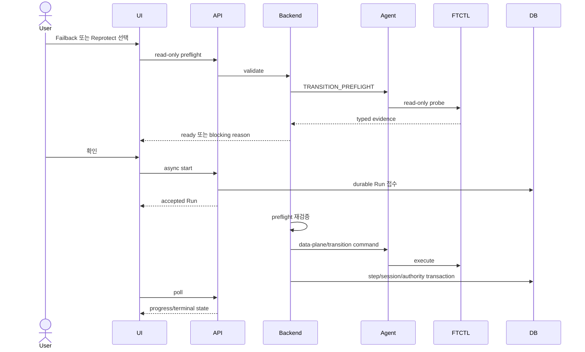

# 587. Cross-Hypervisor DR Source Isolation Internal Preflight Design

> 2026-08-03 최신 후속 규약:
> [589-cross-hypervisor-dr-reprotect-preflight-and-release-terminal-convergence-design-20260803.md](589-cross-hypervisor-dr-reprotect-preflight-and-release-terminal-convergence-design-20260803.md)
> 는 내부 preflight를 JSON 재파싱이 아닌 typed Agent Answer와 v2
> scope/version 계약으로 강화한다. 충돌 시 589를 우선한다.

## 1. 목적과 결정

Cross-Hypervisor `FTCTL_DR`의 일반 사용자 메뉴에서
`원본 사이트 격리 해제 확인`을 숨기고, 필요한 안전 검증을 `페일백`과
`현재 운영 사이트에서 재보호` 내부 preflight로 통합한다.

적용 범위는 ABLESTACK/VMware 사이의 네 방향 전체다. 레거시 `FTCTL`의 수동
fence clear API는 호환 목적으로 유지할 수 있지만 FTCTL_DR UI에는 노출하지
않는다.

핵심 결정은 다음과 같다.

- Failback: TARGET 정지 확인 전 SOURCE production fence를 해제하거나
  SOURCE VM을 시작하지 않는다.
- Reprotect: TARGET authority를 유지하고 SOURCE를 reverse replication
  target으로만 준비한다. SOURCE production fence를 유지한다.
- UI preflight는 안내용 snapshot이며 Backend worker가 실행 직전에 반드시
  재검증한다.

## 2. 오류 원인

### 2.1 사용자 작업 모델 오류

현재 UI의 `resourceActions.js`는 `confirmfenceclear`, `failback`,
`reprotect`를 같은 TRANSITION 그룹의 독립 작업으로 제공한다. 사용자는
Failback 전에 fence clear를 먼저 해야 하는 것으로 오해할 수 있고, 잘못된
순서는 SOURCE와 TARGET의 동시 서비스 위험을 만든다.

### 2.2 capability 단절

- `DrPlanServiceImpl.getActionEvaluation()`은 FTCTL_DR 계획이 FAILED_OVER이면
  `confirmFenceClear=true`를 만들 수 있다.
- `DrPlanActionAvailabilityEvaluator`도 FTCTL_DR/TARGET authority에 해당
  작업을 applicable로 반환한다.
- `DrRunExecutorImpl`은 FENCE_CONFIRM Run을 `DrFencingAdapter`로 실행한다.
- Spring의 `fencingAdapters`에는 레거시 `FtctlDrActionAdapter`만 등록돼 있다.
- `FtctlDrUnifiedActionAdapter`는 FTCTL_DR replication engine이지만
  `DrFencingAdapter`가 아니다.

따라서 FTCTL_DR에서는 메뉴/API가 작업을 열어도 executor가
`DR fencing adapter is unavailable`로 끝날 수 있다.

### 2.3 현재 DB 상태 확인

2026-07-31 읽기 전용 preflight 결과, 활성 계획 3개는 모두
`READY/SOURCE/FTCTL_DR`였다. Windows 계획의 과거 cutover/failback 세션에는
다음 durable evidence가 이미 저장돼 있었다.

- cutover: source fence/power, promotion, engine ACK, authority generation
- failback: source/target power, commit outcome, scheduler, rollback

따라서 신규 테이블보다 기존 session과 `dr_run_step.details_json`을
표준화하는 것이 적절하다.

## 3. 안전 불변조건

1. UI는 Agent/FTCTL을 직접 호출하지 않는다.
2. start API는 Run 접수 후 즉시 반환한다.
3. Backend -> Agent -> FTCTL 경로로 비동기 실행한다.
4. TARGET authority 동안 SOURCE VM을 production network에서 시작하지 않는다.
5. reverse data path 준비와 production authority fence 해제는 다른 상태다.
6. Failback은 TARGET stop을 확인한 뒤 SOURCE start/authority commit을 한다.
7. Reprotect는 TARGET service와 SOURCE isolation을 모두 유지한다.
8. preflight는 authority generation과 30초 유효기간을 가진다.
9. worker는 UI에서 조회한 preflight를 신뢰하지 않고 재검증한다.
10. credential secret은 API response, Run JSON, step JSON, Agent/FTCTL 로그에
    저장하지 않는다.

## 4. 사용자 흐름

| 사용자 목표 | 메뉴 | 최종 authority |
| --- | --- | --- |
| 원래 사이트로 서비스 복귀 | 페일백 | SOURCE |
| 현재 사이트에서 계속 운영 | 현재 운영 사이트에서 재보호 | TARGET |

`원본 사이트 격리 해제 확인`은 목록, 상세, 우클릭 메뉴에서 모두 숨긴다.

## 5. UI 설계

대상:

- `ui/src/utils/dr/resourceActions.js`
- `ui/src/utils/dr/actionAvailability.js`
- `ui/src/views/infra/dr/DrPlanList.vue`
- 관련 unit test

변경:

1. `runtimePlanActions`에서 `confirmfenceclear`를 제거한다.
2. 일반 UI `actionContracts`에서 `confirmDrFenceClear`를 제거한다.
3. fallback의 `confirmfenceclear` applicable 계산을 제거한다.
4. Backend가 과거 key를 반환해도 catalog에 없으므로 메뉴를 만들지 않는다.
5. Failback/Reprotect 모달은 site, checkpoint, source power/isolation,
   reverse path, split-brain guard를 읽기 전용으로 표시한다.
6. 모달을 30초 이상 열어둔 경우 확인 직전에 preflight를 다시 조회한다.

Failback/Reprotect 모달은 credential, host, fence clear 값을 입력받지 않는다.

## 6. API 설계

### 6.1 `getDrFailbackPreflight` 확장

```json
{
  "ready": true,
  "authorityside": "TARGET",
  "authoritygeneration": 1494,
  "sourceconnectivitystate": "CONNECTED",
  "sourcepowerstate": "POWERED_OFF",
  "sourceproductionisolationstate": "ENFORCED",
  "reversewritepathstate": "READY",
  "splitbrainguardstate": "SAFE",
  "checkedat": "2026-07-31T12:00:00+0900",
  "expiresat": "2026-07-31T12:00:30+0900"
}
```

### 6.2 `getDrReprotectPreflight` 추가

- read-only API
- Run을 생성하지 않음
- serving TARGET VM, SOURCE isolation, reverse path, checkpoint,
  authority generation, 유효시간 반환

### 6.3 `confirmDrFenceClear` 호환

- command class는 제거하지 않는다.
- FTCTL_DR이면 Run 생성 전 `DR_FENCE_CLEAR_INTERNAL_ONLY`로 거부한다.
- 레거시 FTCTL만 기존 eligibility/adapter를 유지한다.
- UI는 호출하지 않는다.

### 6.4 start request

Failback/Reprotect start request에는 secret 없이 다음 snapshot만 저장한다.

```json
{
  "preflightCheckedAt": "...",
  "preflightExpiresAt": "...",
  "expectedAuthoritySide": "TARGET",
  "expectedAuthorityGeneration": 1494
}
```

## 7. Backend 설계

### 7.1 action availability

`DrPlanServiceImpl`과 `DrPlanActionAvailabilityEvaluator`:

```text
confirmFenceClear = legacyFtctlPlan && targetAuthority
failback = FTCTL_DR && targetAuthority && ftctlDrControlReady
reprotect = FTCTL_DR && committedTargetAuthority && ftctlDrControlReady
```

FTCTL_DR에서 `confirmFenceClear.applicable=false`다.

### 7.2 공통 서비스

추가 타입:

```text
DrSourceIsolationPreflightService
DrSourceIsolationPreflightServiceImpl
DrSourceIsolationPreflightResult
DrSourceIsolationEvidence
```

계약:

```java
DrSourceIsolationPreflightResult validate(
        DrPlanVO plan,
        String operation,
        Long expectedAuthorityGeneration,
        DrRunVO run,
        boolean persistEvidence);
```

검증:

1. FAILED_OVER/TARGET와 committed cutover 확인
2. source/target site health와 credential readiness 확인
3. SOURCE VM identity/power 확인
4. SOURCE production isolation 확인
5. TARGET serving VM power 확인
6. durable checkpoint 확인
7. Agent/FTCTL transition preflight 확인
8. authority generation과 timestamp 일치 확인

### 7.3 Failback integration

`DrFailbackPreflightServiceImpl`은 기존 site/checkpoint 검사 뒤 공통 서비스를
호출한다. `DrFailbackLifecycleServiceImpl`은 TARGET stop 전에 다시 호출한다.

```text
source-isolation-preflight
reverse-final-sync
target-stop
target-stop-verify
source-authority-commit-barrier
source-start
source-boot-verify
authority-commit
protection-resume
post-failback-checkpoint
```

`source-authority-commit-barrier`는 미리 fence를 해제하는 단계가 아니다.
TARGET stop 확인 후 production authority를 넘길 수 있음을 확정하는 barrier다.

### 7.4 Reprotect integration

성공 조건:

- TARGET VM `POWERED_ON`
- active side `TARGET`
- SOURCE VM `POWERED_OFF`
- SOURCE isolation `ENFORCED`
- reverse path `READY`
- reverse scheduler `RUNNING`

### 7.5 executor guard

`DrRunExecutorImpl.executeAdapter()`는 FTCTL_DR FENCE_CONFIRM을 adapter 조회 전에
`DR_FENCE_CLEAR_INTERNAL_ONLY`로 거부한다. 레거시 FTCTL만
`DrFencingAdapter`를 사용한다. Failback/Reprotect는 계속
`FtctlDrUnifiedActionAdapter`를 사용한다.

## 8. Agent/FTCTL 설계

Agent `FtctlDrStatusCommand.StatusScope`에 `TRANSITION_PREFLIGHT`를 추가한다.

요청:

```text
operation=FAILBACK|REPROTECT
expected_authority_side=TARGET
expected_authority_generation=<generation>
```

응답:

```text
ready
authority_side
authority_generation
scheduler_state
active_operation
source_fence_state
reverse_write_path_state
split_brain_guard_state
reason_code
checked_at_epoch_ms
```

FTCTL은 mutation action 대신 읽기 전용 명령을 제공한다.

```bash
ftctl dr-transition-preflight \
  --plan-id <uuid> \
  --operation failback|reprotect \
  --expected-authority target \
  --expected-generation <n> \
  --json
```

검증 항목은 profile, authority journal, lock, scheduler, reverse locator,
read-only endpoint probe, split-brain guard다. VM power, fence, profile, state를
변경하지 않는다. 엔진 상세 계약은 qemu 문서 444를 따른다.

## 9. DB 설계

신규 table/column은 추가하지 않는다.

```text
step_name = source-isolation-preflight
step_order = 12
state = SUCCEEDED|FAILED
details_json = DrSourceIsolationEvidence
error_code = typed reason
```

표준 evidence:

```json
{
  "schemaVersion": "1",
  "operation": "FAILBACK",
  "authoritySide": "TARGET",
  "authorityGeneration": 1494,
  "sourceConnectivityState": "CONNECTED",
  "sourcePowerState": "POWERED_OFF",
  "sourceProductionIsolationState": "ENFORCED",
  "reverseWritePathState": "READY",
  "splitBrainGuardState": "SAFE",
  "checkedAtEpochMs": 1785466800000,
  "expiresAtEpochMs": 1785466830000
}
```

Protection View cache version은 9로 올린다. FTCTL_DR fence-clear availability를
제거하고 Failback/Reprotect preflight summary를 추가한다.

## 10. 비동기 시퀀스



## 11. 오류 코드

| 오류 | 의미 |
| --- | --- |
| `DR_FENCE_CLEAR_INTERNAL_ONLY` | FTCTL_DR 독립 fence clear 미지원 |
| `DR_SOURCE_ISOLATION_UNKNOWN` | SOURCE production isolation 미확인 |
| `DR_SOURCE_POWER_UNSAFE` | TARGET authority인데 SOURCE가 실행 중 |
| `DR_REVERSE_PATH_NOT_READY` | reverse write path 준비 실패 |
| `DR_AUTHORITY_GENERATION_MISMATCH` | preflight 이후 authority 변경 |
| `DR_TRANSITION_PREFLIGHT_EXPIRED` | preflight 유효시간 초과 |

안전 오류는 force 옵션으로 우회하지 않는다.

## 12. 테스트와 실제 preflight

1. 모든 FTCTL_DR UI에서 standalone fence clear가 보이지 않는다.
2. FTCTL_DR `confirmDrFenceClear` 직접 호출은 Run/step/event를 만들지 않는다.
3. legacy FTCTL API 호환은 유지된다.
4. Failback은 TARGET stop 확인 전 SOURCE start를 호출하지 않는다.
5. Reprotect는 TARGET power/authority와 SOURCE isolation을 유지한다.
6. stale generation과 expired preflight를 거부한다.
7. Agent/FTCTL preflight 전후 profile/state/VM power checksum이 같다.
8. secret이 response/request/step/log에 없다.
9. cache version 9 재생성과 action availability를 검증한다.
10. `/client/` HTTP 200, `WEB-INF` 보존, active bundle marker를 검증한다.

## 13. 권장 구현 순서

1. Backend evaluator 및 executor guard
2. UI action catalog 제거
3. 공통 source-isolation service/DTO
4. Failback/Reprotect와 Run step 통합
5. Agent `TRANSITION_PREFLIGHT`
6. FTCTL read-only preflight
7. API response와 Reprotect preflight API
8. cache version 9
9. unit/integration test
10. changed-module Cloud build, FTCTL GitHub Actions build, 배포, 실제 preflight

## 14. AS-IS / TO-BE

| 구분 | AS-IS | TO-BE |
| --- | --- | --- |
| UI | Fence clear/Failback/Reprotect가 독립 메뉴 | Fence clear 숨김, 사용자 목표는 두 작업 |
| API | FTCTL_DR fence clear Run 생성 가능 | Run 생성 전 typed rejection |
| Backend | eligibility와 adapter capability 불일치 | evaluator/executor 동일 capability |
| Failback | site/checkpoint 위주 검사 | isolation/power/reverse path/generation 검사 |
| Reprotect | TARGET runtime 위주 검사 | SOURCE isolation 유지까지 검증 |
| Agent | transition safety 전용 scope 없음 | `TRANSITION_PREFLIGHT` |
| FTCTL | fence mutation과 전환 경계 모호 | mutation 없는 read-only preflight |
| DB | evidence 형식 분산 | 표준 Run step evidence |
| 안전성 | 사용자가 순서를 우회 가능 | Backend가 순서와 split-brain guard 강제 |
