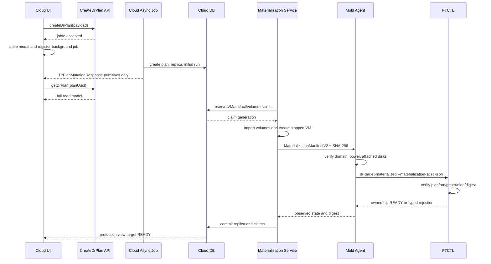

# 590. Cross-Hypervisor DR Plan Async Mutation And Target Resource Ownership Design

- 작성일: 2026-08-03
- 상태: 상세 코드 설계 완료, 구현 대기
- 검증 계획: `eb41d834-243f-4946-9e48-8d2bdf705f15`
- 관련 문서: 507, 508, 509, 510, 515, 521, 534, 547, 552, 558, 567, 589
- FTCTL 부속 설계:
  `ablestack-qemu-exec-tools/docs/ftctl/447-ftctl-dr-target-materialization-ownership-manifest-contract-design-20260803.md`

## 1. 목적과 최종 판단

이 문서는 DR 계획 생성 직후 대화상자가 닫히지 않은 문제와, 새 계획이 다른 계획의
운영 중 대상 VM 및 볼륨을 재사용한 문제를 하나의 일관된 설계로 해결한다.

두 문제는 별개처럼 보이지만 공통 원인은 다음과 같다.

1. 비동기 API의 `접수`, DB mutation의 `완료`, 장시간 DR 실행의 `완료`가 하나의
   응답 객체와 UI Promise에 묶여 있다.
2. 대상 VM/볼륨의 존재 여부는 검사하지만, 그 자원을 어느 계획이 소유하는지는
   트랜잭션과 DB 제약으로 보장하지 않는다.
3. Cloud가 기록한 대상 상태와 Agent가 관측한 실제 libvirt 상태가 분리되어 있다.
4. FTCTL은 Cloud가 전달한 느슨한 target reference를 신뢰하고 `READY`를 기록한다.

최종 설계 결정은 다음과 같다.

- create/update mutation 응답은 직렬화 안전한 최소 응답으로 분리한다.
- UI는 Cloud async job이 접수되면 대화상자를 닫고, 완료/실패는 백그라운드 job
  추적으로 반영한다.
- VM 이름이나 볼륨 path가 같다는 이유로 자원을 자동 재사용하지 않는다.
- 모든 대상 VM, 볼륨, 사전 생성 storage artifact는 DB의 원자적 resource claim을
  획득해야 한다.
- 보호 해제 후에도 운영 VM이 남아 있으면 claim은 `DETACHED_OPERATIONAL`로 유지한다.
- Cloud materialization 완료는 versioned manifest, Agent 실측, FTCTL digest 검증이
  모두 일치할 때만 `READY`로 확정한다.

## 2. 실환경 Preflight 증거

### 2.1 비동기 생성 응답

| 항목 | 확인 값 |
| --- | --- |
| 계획 | id `40`, UUID `eb41d834-243f-4946-9e48-8d2bdf705f15` |
| 생성 async job | id `2713`, UUID `76d5048c-6f69-4fd2-9766-2338cc6f96b3` |
| job 결과 | `job_status=1`, `job_result_code=0` |
| 생성 시각 | 2026-08-03 14:38:32 KST |
| UI 결과 | 계획은 생성되었지만 생성 대화상자가 닫히지 않음 |

Management 로그는 `queryAsyncJobResult`가 성공한 `DrPlanResponse`를 역직렬화하는
과정에서 다음 경로로 실패했음을 보여 준다.

```text
ApiSerializerHelper.fromSerializedString
  -> StringMapTypeAdapter.deserialize
  -> JsonElement.getAsString
  -> UnsupportedOperationException: JsonObject
```

`DrPlanResponse.actionAvailability`는 다음 중첩 객체 map이다.

```java
private Map<String, DrActionAvailabilityResponse> actionAvailability;
```

Cloud async result의 `StringMapTypeAdapter`는 map value를 문자열로 가정하므로
`reasonargs: {}` 같은 `JsonObject`를 복원하지 못한다. DB mutation과 job 자체는
성공했지만 UI의 `createDrPlan(...).then(...)`은 완료되지 않아
`closeCreateModal()`까지 도달하지 못했다.

### 2.2 대상 자원 소유권 충돌

새 계획 id `40`의 replica는 다음 자원을 가리킨다.

| 자원 | 값 |
| --- | --- |
| target VM | id `256`, UUID `a754f34f-2e8e-4e84-9740-6ce7d1832670` |
| instance | `i-2-256-VM`, `w22-01-dr` |
| root volume | id `485`, `w22-01-dr-disk-0` |
| data volume | id `486`, `w22-01-dr-disk-1` |
| replica 기록 | `READY / POWERED_OFF` |
| 실제 Cloud VM | `Running`, host id `2` |
| 실제 libvirt | `running` |

그러나 VM detail은 자원의 원래 소유자를 다음과 같이 기록한다.

```text
dr.plan.id=38
dr.plan.uuid=2514a846-64a2-4bc7-ba88-38a874410782
dr.replica.vm=true
dr.direction=VMWARE_TO_KVM
```

이전 계획 id `38`은 `UNPROTECTED / DISABLED / TARGET`이며, replica row는 보호 해제
과정에서 removed 처리되었지만 VM과 볼륨은 현재 운영 자원으로 남아 있다. 따라서
새 계획이 해당 VM과 볼륨을 재사용한 것은 정상 adoption이 아니라 소유권 충돌이다.

특히 대상 VM은 실제로 실행 중이고 libvirt XML의 `sda`, `sdb`가 volume 485, 486의
RBD를 사용한다. 이 상태에서 새 계획의 librbd 동기화가 같은 image에 쓰면 운영
게스트 I/O와 복제 writer가 충돌할 수 있다.

### 2.3 코드 원인

현재 `DrTargetMaterializationServiceImpl`은 다음 순서로 동작한다.

```text
ensureImportedVolume()
  findExistingVolume(pool, path, name)
  -> found: normalize and reuse

ensureTargetVm()
  findVMByHostNameInZone(vmName, zoneId)
  -> found UserVm: return without ownership validation

materializeTarget()
  -> replica.powerState = POWERED_OFF
```

즉, 이름/path 충돌, plan detail 불일치, 다른 계획의 TARGET authority, 실제 VM 전원
상태를 차단하지 않는다.

## 3. 안전 조치와 수용 기준

구현 전 현재 계획 id `40`에는 다음 운영 원칙을 적용한다.

- Test Failover, Failover, Reprotect, Failback action을 실행하지 않는다.
- plan 40의 scheduler는 대상 소유권이 확정될 때까지 중지 대상이다.
- VM 256과 volume 485/486은 이전 plan 38의 운영 자원으로 취급한다.
- 새 계획 cleanup이 VM 256 또는 volume 485/486을 stop/delete하면 안 된다.
- plan 40은 ownership conflict로 격리한 뒤 고유 target identity로 다시
  materialize해야 한다.

다음 조건이 모두 만족되어야 수정 완료로 판정한다.

1. async job 접수 후 생성 대화상자가 즉시 닫힌다.
2. terminal job 응답에는 중첩 map이 없다.
3. 동일 이름 VM 또는 동일 storage locator가 다른 claim에 속하면 typed conflict로
   실패한다.
4. 두 계획의 동시 materialization에서 DB unique claim은 한 계획만 허용한다.
5. SOURCE authority의 standby target은 Cloud와 libvirt에서 모두 stopped여야 한다.
6. Agent 관측값과 materialization manifest digest가 일치해야 FTCTL이 READY가 된다.
7. 충돌 cleanup은 외부/이전 계획 자원을 변경하지 않는다.

## 4. 전체 TO-BE 흐름



## 5. UI 상세 설계

### 5.1 API helper 분리

`ui/src/api/dr.js`의 범용 `postAndWaitForDrObject()`를 plan mutation에 사용하지 않는다.

```javascript
export function submitDrPlanMutation (command, params) {
  return postAPI(command, params).then(response => ({
    command,
    jobid: extractJobId(response, command),
    accepted: true
  }))
}

export function waitForDrPlanMutation (submission, options = {}) {
  return waitForDrJobObject(submission.jobid, submission.command, options)
}
```

`createDrPlan()`과 `updateDrPlan()`은 submission과 terminal result를 분리한다.

```javascript
export const submitCreateDrPlan = params =>
  submitDrPlanMutation('createDrPlan', params)

export const monitorCreateDrPlan = submission =>
  waitForDrPlanMutation(submission)
```

### 5.2 대화상자 lifecycle

`DrPlanList.vue#createPlan()`은 다음 순서로 변경한다.

1. client validation과 preview preflight를 수행한다.
2. `submitCreateDrPlan()`이 job id를 반환하면 대화상자를 닫는다.
3. Vuex async job tracker 또는 DR 전용 background watcher에 job을 등록한다.
4. 성공 시 mutation response의 plan UUID로 `getDrPlan()`을 호출한다.
5. full read response를 `upsertPlan()`하고 목록을 갱신한다.
6. 실패 시 목록에 ghost plan을 남기지 않고 typed notification을 표시한다.

대화상자를 유지하는 경우는 client validation 실패 또는 HTTP/API admission 실패뿐이다.
장시간 초기 sync 완료 여부는 대화상자 수명과 무관하다.

### 5.3 UI 상태와 메시지

Read API에 다음 필드를 추가한다.

```text
targetOwnershipState = UNCLAIMED | CLAIMING | VALID | CONFLICT | QUARANTINED
targetOwnershipReasonCode
targetPowerState
targetPowerObservedAt
materializationGeneration
materializationDigest
```

`CONFLICT` 또는 `QUARANTINED`에서는 다음 action을 disabled 처리한다.

```text
sync, recoverSync, testFailover, failover, failback, reprotect
```

UI는 일반적인 `오류` 대신 다음 typed 문구를 표시한다.

```text
대상 자원이 다른 DR 계획에 속해 있습니다.
대상 VM 이름 또는 스토리지 매핑을 변경한 뒤 다시 준비하십시오.
```

## 6. API 상세 설계

### 6.1 mutation 전용 응답

다음 클래스를 추가한다.

```text
org.apache.cloudstack.api.response.dr.DrPlanMutationResponse
```

```java
public class DrPlanMutationResponse extends BaseResponse {
    @SerializedName(ApiConstants.ID)
    private String id;
    @SerializedName(ApiConstants.NAME)
    private String name;
    @SerializedName("state")
    private String state;
    @SerializedName("initialrunid")
    private String initialRunId;
    @SerializedName("operation")
    private String operation;
}
```

허용 타입은 String, primitive, flat list뿐이다. 다음 필드는 넣지 않는다.

```text
actionAvailability, actionEligibility, lastRun, steps,
mappingJson object, policyJson object, readinessWarnings object
```

`CreateDrPlanCmd.execute()`와 `UpdateDrPlanCmd.execute()`는 full
`DrPlanResponse` 대신 mutation response를 반환한다. 전체 projection은
`getDrPlan`/`listDrPlans` read API만 반환한다.

### 6.2 typed error contract

다음 오류 코드를 표준화한다.

| 코드 | 의미 |
| --- | --- |
| `DR_TARGET_OWNERSHIP_CONFLICT` | VM/volume/artifact가 다른 claim 소유 |
| `DR_TARGET_CLAIM_RACE` | 동시 claim unique 충돌 |
| `DR_TARGET_VM_POWER_STATE_MISMATCH` | 기록 상태와 Agent 실측 불일치 |
| `DR_TARGET_DISK_MANIFEST_MISMATCH` | volume/locator/attachment digest 불일치 |
| `DR_TARGET_MATERIALIZATION_STALE` | 이전 generation 또는 run의 통지 |
| `DR_TARGET_ADOPTION_REQUIRED` | 이름은 같지만 명시적 ownership transfer 필요 |

## 7. Cloud Backend 상세 설계

### 7.1 신규 service

다음 구성요소를 추가한다.

```text
DrTargetResourceClaimService
DrTargetResourceClaimServiceImpl
DrTargetOwnershipValidator
DrTargetMaterializationManifestBuilder
DrTargetMaterializationManifestV2
```

핵심 메서드는 다음과 같다.

```java
ClaimSet reserveClaims(DrPlanVO plan, DrReplicaVO replica,
        DrResolvedTargetPlacement placement, DrRunVO run);

void bindCloudResource(Claim claim, long resourceId, String resourceUuid);

OwnershipValidation validateExistingVm(DrPlanVO plan, DrReplicaVO replica,
        VMInstanceVO vm);

OwnershipValidation validateExistingVolume(DrPlanVO plan,
        DrReplicaDiskVO disk, VolumeVO volume);

void commitClaims(ClaimSet claims, String manifestDigest);

void quarantineClaims(ClaimSet claims, String reasonCode, String message);
```

### 7.2 VM 재사용 규칙

`ensureTargetVm()`의 이름 기반 return을 제거한다.

```text
1. replica.target_vm_id가 있으면 claim과 VM detail을 검증한다.
2. 동일 plan/replica/generation claim이면 idempotent retry로 허용한다.
3. target_vm_id가 없는데 같은 이름 VM이 존재하면 자동 재사용하지 않는다.
4. 기존 VM detail 또는 active claim이 다른 plan이면 conflict로 실패한다.
5. ownership transfer는 별도 명시적 adoption API에서만 가능하다.
6. 신규 VM은 Cloud가 stopped 상태로 생성한 뒤 claim에 bind한다.
```

검증할 VM detail은 다음과 같다.

```text
dr.replica.vm=true
dr.plan.id=<current plan id>
dr.plan.uuid=<current plan uuid>
dr.replica.uuid=<current replica uuid>
dr.materialization.generation=<generation>
dr.source.external.ref=<source ref>
```

### 7.3 volume/artifact 재사용 규칙

대상 storage artifact 이름은 사용자 입력 이름만으로 만들지 않는다.

```text
display name: <target-vm-name>-disk-<index>
artifact key: dr/<plan-uuid>/<replica-uuid>/<disk-key>
```

RBD image와 qcow2 path 모두 artifact key를 기준으로 생성한다. 사용자에게 보이는
이름과 물리 locator를 분리한다.

`ensureImportedVolume()`은 다음 순서로 변경한다.

```text
1. ARTIFACT claim을 reserve한다.
2. FTCTL이 생성한 exact artifact locator와 SHA-256 locator hash를 확인한다.
3. 기존 Cloud volume이 있으면 같은 claim/generation인지 확인한다.
4. 다른 claim이거나 VM에 연결된 volume이면 conflict로 실패한다.
5. import 후 VOLUME claim에 volume id/uuid를 bind한다.
6. normalizeImportedVolume()은 동일 claim에만 수행한다.
```

### 7.4 materialization 트랜잭션

물질화는 다음 단계로 분리한다.

```text
RESERVE_CLAIMS
  -> IMPORT_VOLUMES
  -> CREATE_STOPPED_VM
  -> ATTACH_DISKS
  -> AGENT_OBSERVE
  -> FTCTL_COMMIT
  -> DB_COMMIT
```

각 단계는 `dr_run_step`에 기록한다. 실패 시 compensation은 해당 run이 새로 만든
`CLAIMING` 자원만 대상으로 한다. 다른 plan, `PROMOTED_ACTIVE`,
`DETACHED_OPERATIONAL` claim은 절대 stop/delete하지 않는다.

### 7.5 실제 전원 상태

다음 optimistic write를 제거한다.

```java
replica.setPowerState(DrConstants.REPLICA_POWER_STATE_POWERED_OFF);
```

대신 Agent 관측 결과를 사용한다.

```java
ObservedTargetRuntime observed = targetRuntimeInspector.inspect(...);
replica.setPowerState(observed.getPowerState());
replica.setPowerStateObservedAt(observed.getObservedAt());
```

초기 SOURCE authority materialization은 `POWERED_OFF`가 아니면 실패한다. 이미
TARGET authority인 명시적 adoption 경로는 별도 policy로 `POWERED_ON`을 허용한다.

## 8. Agent 상세 설계

`FtctlDrActionCommand.Action.TARGET_MATERIALIZED`에 다음 필드를 추가한다.

```text
materializationContractVersion=2
materializationManifestJson
materializationManifestSha256
```

`LibvirtFtctlDrActionCommandWrapper`는 loose context arg를 직접 전달하기 전에 다음을
검증한다.

1. manifest plan UUID와 command plan UUID가 같다.
2. manifest run UUID와 command run UUID가 같다.
3. target instance name의 libvirt domain이 존재한다.
4. `virsh domstate`가 manifest expected power state와 같다.
5. domain XML disk locator 집합이 manifest volume 집합과 같다.
6. librbd 복제 locator와 krbd VM 실행 locator의 정규화 결과가 같은 image를 가리킨다.
7. 계산한 observed digest가 Cloud manifest digest와 일치한다.

Agent answer에는 다음을 반환한다.

```json
{
  "ownershipValidated": true,
  "observedPowerState": "POWERED_OFF",
  "observedAt": "...",
  "observedDiskDigest": "sha256:...",
  "materializationGeneration": 1
}
```

검증 실패 시 FTCTL을 호출하지 않는다.

## 9. FTCTL 상세 설계

FTCTL은 Cloud 자원의 최종 소유자가 아니다. 다만 Cloud가 전달한 manifest와 Agent
실측 결과가 동일한지 확인하고, stale 또는 충돌 통지가 runtime READY를 덮어쓰지
못하게 해야 한다.

CLI는 다음 형태로 변경한다.

```text
ablestack_vm_ftctl dr-target-materialized \
  --plan <plan-uuid> \
  --run <run-uuid> \
  --materialization-spec-json <file> \
  --materialization-spec-sha256 <digest> \
  --json
```

기존 loose target 인자만 전달하는 contract v1 fallback은 허용하지 않는다.
Cloud는 capabilities에서 contract version 2를 확인하지 못하면 materialization을
시작하지 않는다.

FTCTL runtime은 다음을 원자적으로 기록한다.

```text
materialization_contract_version=2
materialization_generation=<n>
materialization_manifest_sha256=<digest>
target_claim_uuid=<vm claim uuid>
target_replica_uuid=<replica uuid>
target_vm_id=<cloud vm id>
target_external_ref=<vm uuid>
target_instance_name=<i-x-y-VM>
target_power_state=<observed state>
target_disk_digest=<observed digest>
target_ownership_state=VALID
```

현재 generation보다 작은 요청, 같은 generation의 다른 digest, plan/run 불일치는
typed error로 거절하며 기존 READY 상태를 보존한다. 상세 shell 계약은 부속 문서
447을 따른다.

## 10. DB 상세 설계

### 10.1 신규 claim table

```sql
CREATE TABLE cloud.dr_target_resource_claim (
    id bigint unsigned NOT NULL AUTO_INCREMENT,
    uuid varchar(40) NOT NULL,
    plan_id bigint unsigned NOT NULL,
    replica_id bigint unsigned NOT NULL,
    replica_disk_id bigint unsigned NULL,
    claim_run_id bigint unsigned NULL,
    resource_type varchar(32) NOT NULL,
    resource_id bigint unsigned NULL,
    resource_uuid varchar(64) NULL,
    resource_locator varchar(2048) NULL,
    resource_locator_hash varchar(80) NULL,
    ownership_generation bigint unsigned NOT NULL,
    claim_state varchar(32) NOT NULL,
    active_resource_key varchar(255) NULL,
    active_role_key varchar(255) NULL,
    manifest_sha256 varchar(80) NULL,
    created datetime NOT NULL,
    updated datetime NULL,
    released datetime NULL,
    removed datetime NULL,
    PRIMARY KEY (id),
    UNIQUE KEY uk_dr_target_claim_uuid (uuid),
    UNIQUE KEY uk_dr_target_claim_active_resource (active_resource_key),
    UNIQUE KEY uk_dr_target_claim_active_role (active_role_key),
    KEY i_dr_target_claim_plan (plan_id),
    KEY i_dr_target_claim_replica (replica_id)
);
```

`active_resource_key` 예시는 다음과 같다.

```text
VM:256
VOLUME:485
ARTIFACT:3:1:sha256:<normalized-locator>
```

claim이 실제 자원을 더 이상 보호하지 않을 때만 key를 NULL로 만든다. 단순 보호
해제는 운영 VM 소유권 해제가 아니므로 `DETACHED_OPERATIONAL` 상태와 active key를
유지한다.

### 10.2 기존 table 확장

`dr_replica`:

```text
ownership_generation bigint
ownership_state varchar(32)
materialization_digest varchar(80)
power_state_observed_at datetime
```

`dr_replica_disk`:

```text
target_claim_id bigint
target_artifact_uuid varchar(64)
target_locator_hash varchar(80)
```

### 10.3 migration/backfill

upgrade script는 기존 active 및 detached operational target을 읽어 claim을 생성한다.

판정 우선순위는 다음과 같다.

1. VM detail의 `dr.plan.uuid`가 명시된 plan을 원소유자로 본다.
2. promoted/released 후 운영 중인 VM은 `DETACHED_OPERATIONAL`로 claim을 유지한다.
3. 동일 VM/volume을 다른 active replica가 가리키면 원소유자 외 replica를
   `QUARANTINED`로 표시한다.
4. 모호한 자원은 자동 소유권 이전하지 않고 `DR_TARGET_ADOPTION_REQUIRED`로 남긴다.

현재 검증 데이터에서는 VM 256과 volume 485/486의 claim은 plan 38에 귀속되고,
plan 40은 quarantine 대상이다.

## 11. Read Projection과 action eligibility

`DrResponseGenerator`는 claim과 live power observation을 읽어 다음을 계산한다.

```text
ownershipValid = all VM/VOLUME/ARTIFACT claims belong to current plan/replica
powerValid = observed power satisfies current authority phase
materializationValid = Cloud digest == Agent digest == FTCTL digest
```

`targetMaterialized=true`는 세 조건이 모두 true일 때만 반환한다.

```java
executionReady = runtimeReady && ownershipValid;
testFailoverEnabled = executionReady && targetReady && powerValid;
failoverEnabled = testFailoverEnabled && materializationValid;
```

충돌은 일반 RPO 저하와 구분한다. RPO는 최신 checkpoint를 계속 표시할 수 있지만
target readiness와 cutover action은 차단한다.

## 12. 구현 우선순위

| 순위 | 구현 | 완료 기준 |
| --- | --- | --- |
| P0 | ownership reconciliation 및 current collision 차단 | plan 40 action 차단, plan 38 자원 보존 |
| P1 | DB claim table/DAO/service | 동시 claim race 단일 승자 |
| P2 | materialization VM/volume lookup 교체 | 이름/path 기반 foreign reuse 제거 |
| P3 | Agent live observation + manifest v2 | power/disk digest 실측 |
| P4 | FTCTL generation/digest contract | stale/mismatch READY 차단 |
| P5 | mutation response 분리 | async deserialization 오류 제거 |
| P6 | UI accepted/terminal lifecycle 분리 | 접수 후 modal close, background 결과 반영 |
| P7 | migration/backfill 및 cleanup guard | detached operational 자원 오삭제 방지 |
| P8 | 통합/회귀 테스트와 배포 | 고유 target으로 full/incremental sync PASS |

데이터 무결성 때문에 P0-P4를 UI 편의 개선보다 먼저 배포한다. 다만 P5-P6은 같은
Cloud 배포 단위에서 함께 반영한다.

## 13. 테스트 설계

### 13.1 Cloud unit/integration

```text
CreateDrPlanCmdTest
  - mutation response contains primitives only
  - actionAvailability is absent

DrTargetResourceClaimServiceImplTest
  - same plan retry is idempotent
  - foreign VM claim fails
  - foreign volume/path claim fails
  - concurrent claim has exactly one winner
  - DETACHED_OPERATIONAL claim remains active

DrTargetMaterializationServiceImplTest
  - name collision never returns foreign VM
  - normalize volume only for same claim
  - running VM under SOURCE authority fails
  - compensation never deletes foreign resources
```

### 13.2 UI test

```text
- job accepted: modal closes and job tracker starts
- job terminal success: getDrPlan and list upsert
- job terminal failure: error notification and no ghost row
- ownership conflict: typed warning and cutover actions disabled
```

### 13.3 Agent/FTCTL test

```text
- manifest v2 valid and stopped domain: READY
- plan/run mismatch: reject
- stale generation: reject
- same generation/different digest: reject
- domain running while expected stopped: reject
- RBD librbd locator and krbd XML locator mismatch: reject
- contract v1-only package: Cloud preflight blocks materialization
```

### 13.4 실환경 acceptance

1. 기존 plan 38의 VM 256/volume 485/486이 그대로 실행되는지 확인한다.
2. plan 40이 해당 자원을 다시 claim하지 못하는지 확인한다.
3. 고유 target name/artifact key로 새 plan을 생성한다.
4. modal이 job 접수 직후 닫히는지 확인한다.
5. full seed와 incremental sync가 새 RBD image에만 쓰는지 확인한다.
6. Cloud DB, VM details, claim table, Agent 관측, FTCTL digest가 일치하는지 확인한다.
7. target VM이 stopped이고 Test Failover 전까지 부팅되지 않는지 확인한다.

## 14. 오류 원인 및 AS-IS / TO-BE 요약

| 계층 | 오류 원인 / AS-IS | TO-BE |
| --- | --- | --- |
| UI | terminal async result가 full plan으로 역직렬화될 때까지 modal 유지 | job 접수 시 modal close, terminal 결과는 background 추적 |
| API | mutation 응답에 nested `actionAvailability`와 full projection 포함 | primitive-only `DrPlanMutationResponse`, full model은 read API 전용 |
| Backend | VM 이름이 같으면 plan 확인 없이 재사용 | explicit claim과 VM detail이 같은 plan/replica일 때만 idempotent reuse |
| Backend | volume name/path가 같으면 normalize 후 재사용 | plan별 artifact key와 claim 검증, foreign locator는 typed conflict |
| Backend | 실제 확인 없이 replica를 `POWERED_OFF`로 기록 | Agent가 관측한 power state와 시각만 기록 |
| Agent | loose target 인자를 FTCTL에 전달 | manifest v2 schema, domain state, disk locator digest 검증 |
| FTCTL | Cloud 통지 수신 즉시 target present/READY 기록 | generation/digest/plan/run 검증 후 원자적 READY commit |
| DB | FK만 있고 active target 소유권 unique 제약 없음 | `dr_target_resource_claim` unique active resource/role key |
| Release | protection row 제거를 자원 소유권 해제로 오인 가능 | 운영 자원은 `DETACHED_OPERATIONAL` claim 유지 |
| Cleanup | 새 plan 실패 cleanup이 기존 자원에 닿을 수 있음 | 현재 run이 만든 CLAIMING 자원만 보상 삭제 |
| 현재 plan 40 | plan 38의 running VM과 두 volume을 READY로 재사용 | QUARANTINED, action 차단, 고유 target으로 재물질화 |

## 15. 결론

현재 계획의 sync 엔진 자체는 checkpoint를 생성했지만 대상 자원 소유권이 깨져
있으므로 전체 PASS가 아니다. 먼저 소유권 claim과 materialization manifest를
구현해야 하며, UI modal 문제는 같은 배포에서 mutation/read 응답 분리로 해결한다.

이 설계 이후의 정상 모델은 다음 한 문장으로 정의한다.

> Cloud는 대상 자원의 유일한 소유권과 lifecycle을 DB claim으로 보장하고,
> Agent는 실제 host 상태를 관측하며, FTCTL은 versioned manifest의 세대와 digest가
> 일치할 때만 복제 대상을 READY로 인정한다.

## 16. 구현 및 배포 결과 (2026-08-03)

### 16.1 구현 완료 범위

| 레이어 | 구현 결과 |
| --- | --- |
| UI | 생성/수정 요청이 async job에 접수되면 대화상자를 즉시 닫고, terminal 결과는 background polling 후 read API로 다시 조회한다. 실패 시 대화상자를 되살리지 않고 알림과 목록 상태만 갱신한다. |
| API | `CreateDrPlanCmd`와 `UpdateDrPlanCmd`의 async 응답을 primitive-only `DrPlanMutationResponse`로 분리했다. 전체 `DrPlanResponse`는 조회 API에서만 사용한다. |
| Backend | VM/volume 재사용 전에 plan/replica 소유권, VM detail, volume attachment, locator를 검증한다. 이름 또는 경로 일치만으로 기존 자원을 채택하지 않는다. |
| Agent | materialization manifest JSON과 SHA-256을 FTCTL에 전달한다. Cloud가 관측한 VM 전원 상태와 disk mapping을 manifest에 포함한다. |
| FTCTL | manifest v2, plan/run/replica/generation, digest, VM reference, power state, disk mapping을 검증하고 불일치 시 typed exit code로 거부한다. |
| DB | `dr_target_resource_claim`과 replica/disk ownership 필드를 추가했다. active resource/role key에 unique 제약을 적용했다. |

### 16.2 빌드 및 자동 검증

| 항목 | 결과 |
| --- | --- |
| Cloud 변경 Maven 모듈 | PASS. WSL ext4 clone에서 KVM 및 disaster-recovery 변경 모듈을 빌드했다. |
| Cloud 단위 테스트 | PASS. ownership service 2건, materialization service 2건, 총 4건 통과. |
| UI 단위 테스트 | PASS. DR API mutation lifecycle 7건 통과. |
| UI production build | PASS. 기존 asset/entrypoint size warning 2건 외 오류 없음. |
| FTCTL selftest | PASS. valid manifest, stale generation 거부, disk mapping mismatch 거부 검증. |
| FTCTL GitHub Actions | PASS. run `30795525165`, commit `7fa7878d929ef17b032dd0365c0cc7a748ad802c`. |

### 16.3 운영 반영 결과

| 대상 | 반영 및 확인 결과 |
| --- | --- |
| Cloud DB | ownership schema 적용 완료. 기존 plan 38의 VM 256과 volume 485/486은 `DETACHED_OPERATIONAL` claim으로 보존했다. |
| 충돌 plan 40 | `DR_TARGET_OWNERSHIP_CONFLICT`, `QUARANTINED`로 차단 후 soft-remove했다. replica/disk의 target 참조만 분리했으며 실제 VM/volume은 삭제하거나 중지하지 않았다. |
| Cloud JAR | 변경 클래스와 Spring bean 정의만 active management JAR에 갱신했다. |
| Cloud UI | active webapp의 정적 자산만 갱신했다. `WEB-INF`를 보존했고 `/client/` HTTP 200과 build/deploy `index.html` SHA-256 일치를 확인했다. |
| KVM Agent JAR | `LibvirtFtctlDrActionCommandWrapper`와 내부 클래스만 세 호스트의 active KVM plugin JAR에 갱신하고 `mold-agent`를 재기동했다. 세 호스트가 Cloud DB에서 `Up/Enabled`로 복귀한 것을 확인했다. |
| FTCTL | GitHub Actions RPM `ablestack_vm_ftctl-0.9.1-1.noarch`를 10.10.32.1/2/3에 교체 설치했다. |
| Agent/Timer | 세 호스트의 `mold-agent`와 `ablestack-vm-ftctl.timer`가 active이다. |
| Scheduler | 유효한 plan `c952...`, `daf0...`만 running이고 제거한 plan `eb41...`은 inactive이며 runtime directory가 없다. |
| API | admin login 및 `listDrPlans`가 성공했고 제거한 plan은 active 목록에서 제외됐다. |

### 16.4 재테스트 조건

1. 새 계획은 기존 운영 VM `w22-01-dr`과 겹치지 않는 고유 대상 VM 이름을 사용한다.
2. 생성 요청 접수 직후 대화상자가 닫히고 목록 또는 상세 화면으로 전환되는지 확인한다.
3. 초기 동기화에서 ownership claim, `materialization_digest`, generation, power observation time이 함께 기록되는지 확인한다.
4. Cloud DB digest와 FTCTL의 manifest digest가 일치해야 `targetMaterialized=true`가 된다.
5. 기존 계약 도입 전에 생성된 계획은 materialization digest가 없으므로 안전상 자동 승격하지 않는다. 해당 계획의 cutover 검증은 새 계획 재생성 또는 별도 명시적 adoption 절차를 사용한다.

### 16.5 최종 AS-IS / TO-BE

| 구분 | AS-IS | TO-BE |
| --- | --- | --- |
| 생성 UI | terminal async 응답 전체를 역직렬화할 때까지 modal 유지 | 접수 응답으로 modal 즉시 종료, terminal 결과 background 반영 |
| API 응답 | nested map을 포함한 full projection 직렬화 | primitive-only mutation response와 read projection 분리 |
| 대상 VM/볼륨 | 동일 이름/경로이면 다른 plan 자원도 재사용 가능 | DB claim과 immutable detail이 일치할 때만 idempotent reuse |
| 상태 판정 | DB에 기록한 예상 전원 상태로 READY 가능 | Agent 관측 전원 상태와 manifest digest가 일치해야 READY |
| FTCTL 수신 | 느슨한 target parameter 집합 | versioned manifest v2와 SHA-256/generation 검증 |
| 정리 | 실패 계획 정리 중 운영 VM/볼륨 삭제 위험 | 실패 계획 참조와 runtime만 분리하고 운영 자원은 보존 |
