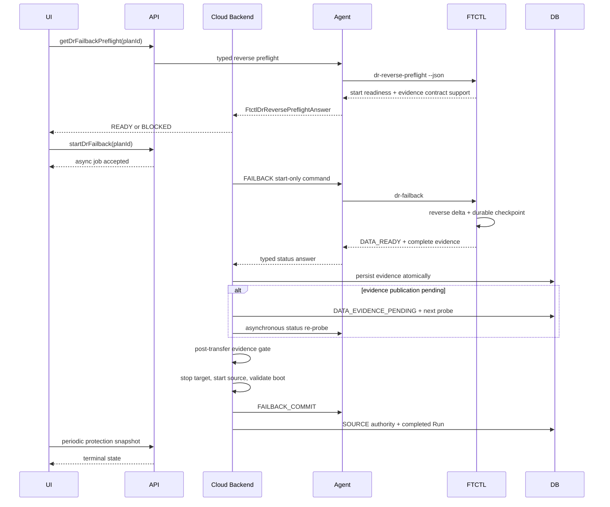

# Cross-Hypervisor DR Failback Durable Evidence Publication Contract

Date: 2026-08-06

Status: implementation design

Scope: VMware to ABLESTACK Failover followed by ABLESTACK to VMware Failback

Related documents: Cloud documents 510, 521, 588, 592, and 595, plus qemu
document 452.

## 1. Purpose

This design closes the durable-evidence publication gap observed during live
Failback Run `ce39926b-87fc-4dd1-a6e9-996e42bd571f` for Plan
`7889e625-371a-48f9-b553-54e311481170`.

FTCTL completed a valid `KVM_TO_VMWARE` final delta and created checkpoint
sequence 15. Cloud nevertheless rejected the lifecycle transition with
`DR_FAILBACK_BASELINE_NOT_DURABLE` because FTCTL status JSON did not publish the
complete durable evidence already present in the Run state and checkpoint.

This is a control-contract failure, not a reverse-copy failure. Cloud must
continue to block target shutdown and VMware source startup until one coherent
reverse checkpoint is durably verified.

## 2. Live Evidence And Root Cause

### 2.1 Engine evidence

| Field | Value |
|---|---|
| `checkpoint_sequence` | `15` |
| `baseline_generation` | `15` |
| `baseline_state` | `LOCAL_DURABLE` |
| `tracker_state` | `LOCAL_DURABLE` |
| `writer_state` | `DURABLE` |
| `target_written` | `true` |
| `write_verified` | `true` |
| `reverse_guest_compatibility_state` | `ORIGINAL_VMWARE_COMPATIBILITY_PRESERVED` |
| `replication_direction` | `KVM_TO_VMWARE` |
| `provider_pair` | `ABLESTACK_TO_VMWARE` |
| transferred bytes | `1,502,770,688` |

The checkpoint JSON independently confirms generation 15, durable tracker and
writer state, target write, and write verification.

### 2.2 Publication failure

`ftctl_dr_runtime_emit_state_json()` publishes `baseline_state`, route fields,
and checkpoint paths, but omits the current reverse-operation values for:

- `baseline_generation`;
- `tracker_state`;
- `writer_state`;
- `target_written`;
- `write_verified`;
- `reverse_guest_compatibility_state`.

The Agent wrapper and `FtctlDrStatusAnswer` already understand these fields.
Cloud `DrFailbackLifecycleServiceImpl.updateDataEvidence()` also maps them into
`dr_failback_session`. The missing boundary is the FTCTL status producer.

### 2.3 Inconsistent readiness predicates

The live `dr-reverse-preflight` returned `ready=true` using baseline-file,
source-disk, and target-writer probes. The post-transfer Cloud data gate then
received null durable-evidence fields and rejected the operation.

Pre-dispatch readiness and post-transfer commit readiness are different phases,
but they must share the same evidence contract version. Preflight must reject an
installed FTCTL that cannot publish the evidence required after transfer.

## 3. Required Invariants

1. The evidence tuple identifies one Plan, Run, checkpoint sequence, baseline
   generation, direction, and provider pair.
2. Cloud never combines fields from unrelated Plan-authority and operation
   snapshots.
3. `FAILBACK_DATA_READY` is provisional until the complete evidence tuple is
   published and persisted.
4. Missing evidence is not equivalent to explicitly non-durable evidence.
5. A short publication delay causes asynchronous re-probe, not blocking API
   wait and not immediate rollback.
6. Target shutdown and VMware source startup remain Cloud lifecycle actions.
7. A blocked gate preserves TARGET authority and the powered-on KVM serving VM.
8. Existing durable checkpoint 15 remains reusable; no full reverse reseed is
   introduced by this correction.

## 4. Canonical Reverse Evidence Contract

FTCTL `dr-status` publishes the following additive typed fields for operation
and Plan-authority scopes:

```json
{
  "reverse_evidence_contract_version": 1,
  "reverse_evidence_state": "COMPLETE",
  "reverse_evidence_run_uuid": "ce39926b-87fc-4dd1-a6e9-996e42bd571f",
  "checkpoint_sequence": 15,
  "baseline_generation": 15,
  "baseline_state": "LOCAL_DURABLE",
  "tracker_state": "LOCAL_DURABLE",
  "writer_state": "DURABLE",
  "target_written": true,
  "write_verified": true,
  "reverse_guest_compatibility_state": "ORIGINAL_VMWARE_COMPATIBILITY_PRESERVED",
  "replication_direction": "KVM_TO_VMWARE",
  "provider_pair": "ABLESTACK_TO_VMWARE",
  "reverse_evidence_missing_fields": []
}
```

Numbers and booleans must not be serialized as strings.

| Evidence state | Meaning |
|---|---|
| `PENDING` | Transfer or checkpoint commit has not completed |
| `COMPLETE` | Mandatory evidence forms one coherent tuple |
| `INCOMPLETE` | Data Ready was reported but fields are absent |
| `NOT_DURABLE` | Complete evidence explicitly reports a non-durable value |
| `INCONSISTENT` | Run, sequence, route, or generation values conflict |

## 5. End-To-End Sequence



## 6. FTCTL Design

### 6.1 Source changes

| File/function | Change |
|---|---|
| `lib/ftctl/dr_runtime.sh` / `ftctl_dr_runtime_emit_state_json()` | Emit the canonical reverse evidence fields |
| `lib/ftctl/dr_runtime.sh` / new `ftctl_dr_runtime_resolve_reverse_evidence()` | Load one coherent evidence tuple |
| reverse checkpoint writer | Persist guest compatibility and evidence contract version |
| FTCTL self-tests | Test operation and Plan-authority JSON contracts |

### 6.2 Resolution precedence

The resolver must not choose the newest value independently for every field. It
resolves one lineage in this order:

1. requested operation Run state;
2. Run state identified by `external_job_ref` or failback session Run UUID;
3. checkpoint JSON referenced by that Run state;
4. Plan-authority state only when it references the same Run and sequence.

The checkpoint is the durable source for baseline generation, tracker, writer,
target-written, and write-verified values. Run state supplies guest
compatibility when an older checkpoint lacks the additive field. A mixed tuple
is `INCONSISTENT`, never silently complete.

### 6.3 Checkpoint compatibility

The checkpoint extension is additive. Existing schema version 1 remains
readable. New checkpoints add:

```json
{
  "reverseEvidenceContractVersion": 1,
  "guestCompatibilityState": "ORIGINAL_VMWARE_COMPATIBILITY_PRESERVED"
}
```

For retained checkpoint 15, Run-state guest compatibility is usable only when
Plan UUID, Run UUID, and sequence match.

### 6.4 Completeness rule

`COMPLETE` requires supported route contract, positive matching sequence and
generation, durable baseline/tracker/writer, verified target write, and guest
compatibility `ORIGINAL_VMWARE_COMPATIBILITY_PRESERVED` or `READY`.

## 7. Agent Design

### 7.1 Status answer

`FtctlDrStatusAnswer` already carries the core reverse fields. Add:

- `reverseEvidenceContractVersion`;
- `reverseEvidenceState`;
- `reverseEvidenceRunUuid`;
- `reverseEvidenceMissingFields`.

`LibvirtFtctlDrStatusCommandWrapper` maps these fields and retains redacted raw
status JSON for audit.

### 7.2 Preflight answer

Extend `FtctlDrReversePreflightAnswer` with:

- `statusEvidenceContractVersion`;
- `statusEvidencePublicationReady`;
- `statusEvidenceErrorCode`.

`LibvirtFtctlDrReversePreflightCommandWrapper` returns `ready=false` when the
installed engine does not advertise contract version 1 or cannot render a
synthetic typed evidence envelope. This is a capability check, not a claim that
the future final delta is already written.

### 7.3 Tests

1. Observed broken Run 140 payload maps to `INCOMPLETE`.
2. Corrected checkpoint-15 payload maps every typed field.
3. String booleans and conflicting sequence/generation are rejected.
4. Preflight without publication capability is blocked.

## 8. Cloud Backend Design

### 8.1 Evidence value object

Add immutable `DrFailbackDataEvidence`, created from `FtctlDrStatusAnswer` or its
canonical JSON. It owns route identity, Run/checkpoint identity, durability,
guest compatibility, contract version, and completeness classification.

`DrFailbackDataGateService` evaluates this object. Multiple services must not
re-parse unrelated runtime fragments independently.

### 8.2 Error classification

| Condition | Error code |
|---|---|
| Required field absent | `DR_FAILBACK_DATA_EVIDENCE_INCOMPLETE` |
| Unsupported contract | `DR_FAILBACK_DATA_EVIDENCE_CONTRACT_UNSUPPORTED` |
| Run/sequence/route conflict | `DR_FAILBACK_DATA_EVIDENCE_INCONSISTENT` |
| Explicit non-durable baseline/tracker | `DR_FAILBACK_BASELINE_NOT_DURABLE` |
| Explicit unverified target write | `DR_FAILBACK_TARGET_WRITE_UNVERIFIED` |
| Guest compatibility not ready | `DR_FAILBACK_GUEST_COMPATIBILITY_NOT_READY` |

Null values never produce `DR_FAILBACK_BASELINE_NOT_DURABLE`.

### 8.3 Asynchronous publication grace

`DrFailbackLifecycleServiceImpl.reconcile()` performs no blocking sleep.

1. On first `FAILBACK_DATA_READY`, persist available evidence.
2. If incomplete, set `DATA_EVIDENCE_PENDING`, retain TARGET authority, and let
   the existing reconciler probe again.
3. Probe operation scope first and Plan-authority scope second.
4. Allow up to five probes or 15 seconds.
5. On complete evidence, atomically persist it, set `DATA_READY`, and submit the
   lifecycle executor.
6. On deadline, use `DR_FAILBACK_DATA_EVIDENCE_INCOMPLETE` through the existing
   fail-before-authority-transition path.

Target power-off cannot begin from `DATA_EVIDENCE_PENDING`.

### 8.4 Atomic persistence

`updateDataEvidence()` becomes a mapper returning `DrFailbackDataEvidence`. One
transaction updates session evidence, checkpoint sequence/details JSON, Run
last-status/current step, and replica runtime JSON. The gate executes only after
the transaction commits and the session is re-read.

## 9. API Design

`getDrFailbackPreflight` remains an action-start preflight and adds:

- `evidencecontractversion`;
- `evidencepublicationready`;
- `evidencepublicationstate`;
- one user-safe blocking reason when unsupported.

Top-level `ready` requires transition preflight, reverse-path preflight, and
evidence-publication capability. Internal field lists remain diagnostics.

`startDrFailback` remains asynchronous and returns acceptance without waiting
for transfer, evidence publication, or lifecycle commit.

## 10. UI Design

`DrPlanList.vue` loads preflight asynchronously. Confirmation uses top-level
`ready` and the required stage summary.

| State | UI behavior |
|---|---|
| Loading | Neutral message, confirm disabled |
| Ready | One green preparation-complete result |
| Unsupported publisher | Host runtime update message, confirm disabled |
| Evidence pending after start | Operation progress, no failure banner |
| Evidence deadline exceeded | Terminal failure with retry guidance |

The UI never asks operators to enter baseline generation, tracker state,
writer state, or checkpoint paths. The protection view shows the latest failed
Run error even when the safely preserved Plan remains `FAILED_OVER/TARGET`.

## 11. DB Design

No new table or schema migration is required. Existing
`dr_failback_session` columns already persist baseline generation/state,
tracker/writer state, target-written, write-verified, and guest compatibility.

Use existing session state, `last_probe_at`, `details_json`, Run status JSON, and
timestamps for `DATA_EVIDENCE_PENDING`. The evidence columns must be non-null
before `cloud-lifecycle-gate` succeeds. Historical failed rows are not backfilled.

## 12. Verification Plan

### 12.1 Build and unit verification

- FTCTL shell syntax and reverse evidence self-tests;
- qemu package tests for operation and Plan-authority status scopes;
- Agent tests using broken and corrected Run 140 payloads;
- data-gate tests for missing versus explicitly invalid evidence;
- lifecycle tests proving incomplete evidence schedules re-probe without target
  shutdown;
- preflight tests proving unsupported publication contract blocks confirmation;
- UI tests for Ready, capability-blocked, and pending states.

### 12.2 Live non-destructive preflight

The pre-change fixture is:

- `dr-reverse-preflight`: `ready=true`, contract v2;
- `dr-status`: checkpoint 15 and `LOCAL_DURABLE`, but reverse fields absent;
- Run state/checkpoint: complete durable evidence;
- DB session 13: evidence columns null and terminal
  `DR_FAILBACK_BASELINE_NOT_DURABLE`.

After deployment, before Failback:

1. `dr-status` publishes evidence contract 1 and `COMPLETE` for checkpoint 15.
2. Agent typed status contains every reverse evidence field.
3. `getDrFailbackPreflight` reports publication capability ready.
4. KVM target remains powered on and VMware source remains powered off.
5. No active reverse mover or stale operation lock exists.

### 12.3 Retest PASS criteria

One normal Failback is allowed only after those checks pass. PASS requires the
retained baseline to be used or advanced without forced full reseed, evidence to
be persisted before lifecycle transition, VMware source boot validation, FTCTL
commit acknowledgement, SOURCE authority convergence, and no stale worker,
lock, or rollback obligation.

## 13. Implementation Priority

1. P0: FTCTL evidence resolver, checkpoint extension, and status output.
2. P0: Agent typed mapping and compatibility preflight.
3. P0: Cloud evidence value object, error classification, and async grace.
4. P0: API contract and lifecycle transaction ordering.
5. P1: UI summary, gating, and latest Run failure visibility.
6. P1: builds and live non-destructive preflight.
7. P1: deployment and operator handoff for one Failback retest.

## 14. AS-IS / TO-BE Summary

| Area | AS-IS | TO-BE |
|---|---|---|
| FTCTL | Evidence exists in Run/checkpoint but is omitted from status | One coherent typed evidence tuple is published in both scopes |
| Preflight | Path probes pass with an incompatible publisher | Readiness also verifies evidence-publication support |
| Agent | Existing members receive nulls | Contract identity and typed evidence are mapped and tested |
| Backend | Null is immediately classified non-durable | Missing evidence gets bounded async re-probe and distinct errors |
| Lifecycle | Gate may run after partial Data Ready projection | Evidence commits before target shutdown can begin |
| API | Ready omits publisher compatibility | Ready includes publication capability |
| UI | Operator can retry the same deterministic failure | Confirmation remains disabled until the runtime contract is supported |
| DB | Evidence columns stay null | Existing columns are atomically populated; no schema change |
| Safety | Abort preserves TARGET authority | Same safety boundary with fewer false failures |
| Retest | Immediate retry reproduces failure | Verify retained checkpoint 15, then execute one normal Failback |

## 15. Implementation And Deployment Result - 2026-08-06

The contract was implemented across FTCTL, Agent relay, Cloud lifecycle, API,
and UI without a DB schema change. Cloud now distinguishes missing evidence
from explicitly non-durable evidence, re-probes incomplete publication for a
bounded grace period, validates Run identity, persists the complete tuple, and
only then allows target shutdown. The failback dialog consumes top-level
preflight readiness and no longer exposes the internal five-stage checklist as
operator input.

Verification results:

- changed Cloud Maven modules built successfully from the WSL ext4 clone;
- 18 focused KVM wrapper/failback gate/lifecycle/preflight tests passed;
- the production UI build completed with only the existing asset-size warnings;
- FTCTL GitHub Actions run `31062183699` built commit `33d1651` successfully;
- RPM `ablestack_vm_ftctl-0.9.1-1.noarch` was deployed to all three DR hosts;
- installed scripts on all hosts contain the evidence publisher and preflight
  capability markers, and all `mold-agent` services are active;
- Cloud and Agent received only the changed classes; the management webapp
  retained `WEB-INF` and `/client/` returned HTTP 200 after static UI update;
- live Plan-authority `dr-status` for Plan
  `7889e625-371a-48f9-b553-54e311481170` publishes contract 1, state
  `COMPLETE`, Run 140 identity, generation 15, both durable states, durable
  writer, both write booleans, and preserved VMware guest compatibility;
- live `getDrFailbackPreflight` returns `ready=true`, reverse mode
  `REVERSE_FINAL`, evidence contract 1, and publication readiness true.

The previous failed Run and session remain immutable history. The Plan remains
`FAILED_OVER/TARGET`, the KVM serving VM remains running, the VMware source
remains powered off, and no new failback was started during deployment. The
operator's next and only action is one normal Failback from the Plan action
menu; force mode is not required.

## 16. Commit Envelope Correction - 2026-08-06

Complete durable reverse evidence is necessary but not sufficient for a safe
authority transition. A subsequent Failback session was created before
terminal evidence publication and retained null `checkpoint_sequence` and
`authority_generation` values. Cloud then changed VM power states before
FTCTL rejected the incomplete commit command.

Document
`597-cross-hypervisor-dr-failback-commit-envelope-and-pre-power-gate-design-20260806.md`
is normative for this correction. Existing sessions must backfill a newly
published checkpoint without overwriting conflicts, authority generation must
come only from the active committed cutover session, and a complete persisted
commit envelope is a pre-power gate. Deterministic validation failure is not an
unknown outcome.

Document 597 supersedes wording that permits checkpoint sequence or Cloud Run
ID to be used as an authority-generation fallback.
