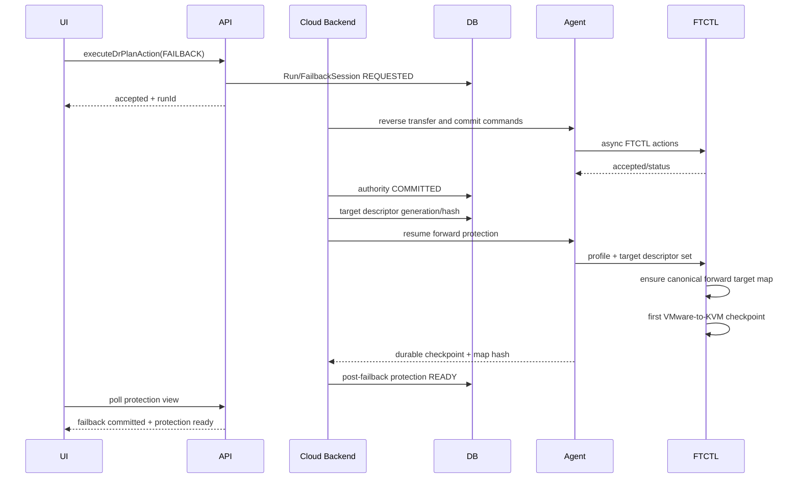

# 598. Cross-Hypervisor DR Forward Target Locator And Post-Failback Protection Resume Design

## 1. 목적과 범위

이 문서는 페일백 후 `VMware -> ABLESTACK` 보호를 재개할 때 최초 보호의 검증된
RBD 디스크 해석 계약을 그대로 재사용하도록 Cloud 전 계층을 정렬한다.

적용 계층:

- UI: 보호 재개 상태와 실패 원인을 사용자 의미로 표시
- API: 비동기 action과 post-failback protection 상태 제공
- Backend: Cloud 소유 자원에서 canonical disk descriptor 생성
- Agent: versioned descriptor를 FTCTL에 전달하고 typed status 반환
- FTCTL: 최초 보호와 재보호에 동일한 storage locator resolver 사용
- DB: locator identity와 post-failback checkpoint gate 영속화

장시간 데이터 전송은 UI/API 요청 스레드에서 수행하지 않는다.

## 2. 확인된 오류와 Preflight 증거

대상 Plan `7889e625-371a-48f9-b553-54e311481170`에서 다음을 확인했다.

| 계층 | 확인 결과 |
|---|---|
| DB/Cloud profile | target volume, storage pool, RBD type/path, volume UUID 존재 |
| FTCTL profile | 각 disk target에 `storagePath=rbd`, `storagePoolType=RBD` 존재 |
| FTCTL reverse map | `sourceUri=rbd:rbd/<image>` 정상 |
| FTCTL forward target map | 파일 없음 |
| VMware mover source map | target은 bare image name만 포함 |
| 실제 RBD | `qemu-img info rbd:rbd/<image>` 성공 |
| post-failback cycles | sequence 18~20이 `PREPARING`, dataCopied=false |
| lifecycle 판정 | `plan_cycle_sequence` fallback으로 완료 오판 가능 |

직접 오류는 `qemu-img`에 `w22-01-dr-disk-0` 같은 bare image name을 전달한 것이다.
구조적 오류는 재보호가 Cloud 자원 정보와 최초 보호 canonicalizer를 재사용하지 않고
optional map/fallback으로 목적지를 다시 추정한 것이다.

## 3. 계층별 소유권

| 정보/동작 | 소유 계층 |
|---|---|
| target VM/volume/storage pool identity | Cloud DB/Backend |
| RBD pool/image 구성요소 | Cloud Backend가 materialized resource에서 생성 |
| librbd sync URI와 krbd runtime path | FTCTL 공통 locator가 결정적으로 생성 |
| VM start/stop 및 krbd attach | Cloud Backend/Agent |
| 데이터 복제와 checkpoint | FTCTL |
| action 접수와 비동기 job | API/Backend |
| 상태/오류 표현 | Backend projection 후 UI |

UI와 API는 `rbd:` 문자열을 만들거나 수정하지 않는다. Agent도 별도 문자열 조합을
하지 않고 versioned descriptor를 전달한다.

## 4. Canonical Target Disk Descriptor V1

Backend는 `DrReplicaDiskVO`, `VolumeVO`, `StoragePoolVO`, target materialization
generation으로 다음 descriptor를 만든다.

```json
{
  "schemaVersion": 1,
  "diskKey": "2000",
  "replicaDiskUuid": "<uuid>",
  "targetVolumeId": 500,
  "targetVolumeUuid": "93338e0f-2095-4b8f-8010-a10e32366ce7",
  "storageType": "RBD",
  "pool": "rbd",
  "image": "w22-01-dr-disk-0",
  "format": "raw",
  "virtualBytes": 107374182400,
  "materializationGeneration": 4,
  "locatorHash": "<sha256>"
}
```

Cloud는 `syncUri`를 권위 값으로 저장하지 않는다. FTCTL이 위 구성요소로
`rbd:<pool>/<image>`와 `/dev/rbd/<pool>/<image>`를 생성한다. 응답 검증을 위해
FTCTL이 반환한 locator hash와 Cloud hash를 비교한다.

`targetDiskRef`는 표시/호환 필드일 뿐 transport locator가 아니다.

## 5. UI 상세 설계

페일백의 전체 진행률은 데이터 전송 완료와 작업 종결을 구분한다. 역방향
전송이 100%여도 원본 VM 복구 후 정방향 지속 보호의 첫 내구성 체크포인트가
확인되기 전에는 전체 작업을 95%로 유지한다. 이 구간의 내부 단계명
`remote-source-protection-resume-pending`은 그대로 노출하지 않고 다음 사용자
상태로 투영한다.

```text
원본 가상머신 복구 완료
지속 보호 재개와 첫 내구성 체크포인트 확인 중
```

다중 디스크 위치는 FTCTL progress v2의 zero-based `diskIndex`를 1부터 시작하는
사용자 표기로 변환한다. UI는 과거의 잘못된 샘플을 `1..diskCount` 범위로
제한하지만, 전송량과 완료 여부의 권위는 FTCTL의 주기 전체 집계 값이다.

### 5.1 파일

- `ui/src/views/infra/dr/DrProtectionInfoTab.vue`
- `ui/src/views/infra/dr/DrPlanList.vue`
- `ui/src/api/dr.js`
- `ui/public/locales/ko_KR.json`
- `ui/public/locales/en.json`

### 5.2 상태 표시

보호 정보 탭은 failback authority와 보호 재개를 구분한다.

| Backend 상태 | UI 상태 | 설명 |
|---|---|---|
| `PENDING` | 보호 재개 준비 중 | 정방향 target map 검증 전 |
| `VERIFYING` | 보호 재개 중 | 첫 정방향 checkpoint 진행 중 |
| `READY` | 보호 정상 | 첫 durable checkpoint 완료 |
| `DEGRADED` | 보호 재개 필요 | failback은 완료됐으나 복제가 재개되지 않음 |

사용자에게 pool/image 내부 경로를 기본 노출하지 않는다. `DEGRADED`일 때는 다음처럼
표시한다.

```text
페일백은 완료되었지만 보호 동기화를 재개하지 못했습니다.
대상 디스크 연결 정보를 확인한 뒤 다시 동기화하십시오.
```

상세 기술 코드는 이력/이벤트에서만 `DR_FORWARD_TARGET_LOCATOR_INVALID`로 제공한다.

### 5.3 Action gate

- `VERIFYING`: 중복 failback/reprotect 차단, 상태 조회와 취소 가능한 engine 작업만 허용
- `READY`: 정상 action policy 적용
- `DEGRADED`: 전체 재동기화/보호 해제만 허용, failover/test failover 차단
- UI는 자체 조건을 만들지 않고 API `actionavailability`를 사용한다.

### 5.4 Polling

- accepted action 이후 2초 간격으로 protection cache를 조회한다.
- 화면 전체 skeleton을 다시 표시하지 않고 변경된 상태 카드/operation만 갱신한다.
- `READY` 또는 `DEGRADED` terminal projection에서 polling을 정상 간격으로 되돌린다.

## 6. API 상세 설계

### 6.1 Read response

`DrPlanResponse` 및 protection view에 다음 필드를 추가한다.

```text
postfailbackprotectionstate
postfailbackrequiredcheckpointsequence
postfailbackcompletedcheckpointsequence
forwardtargetmapgeneration
forwardtargetmapstate
postfailbackerrorcode
postfailbackerrormessage
```

`plan_cycle_sequence`는 내부 scheduler 예약 값이며 완료 응답으로 사용하지 않는다.

### 6.2 Action response

Failback API는 기존처럼 비동기 접수만 수행한다.

```json
{
  "accepted": true,
  "runid": "<uuid>",
  "action": "FAILBACK"
}
```

authority commit과 보호 재개 결과는 read API polling으로 확인한다. HTTP 요청에서 첫
post-failback cycle을 기다리지 않는다.

### 6.3 호환성

FTCTL capability `dr-forward-target-map-v2`가 없으면 Backend는 기존 profile을 보내되
새 locator hash ACK를 요구하지 않는다. 새 Cloud 전용 필드는 nullable로 응답한다.

## 7. Backend 상세 설계

### 7.1 `DrTargetMaterializationServiceImpl`

다음 메서드를 추가한다.

```java
List<DrTargetDiskDescriptor> buildTargetDiskDescriptors(
        DrPlanVO plan, DrReplicaVO replica, long materializationGeneration);
```

각 descriptor는 DB의 active replica disk와 실제 target volume/storage pool을 join해
생성한다. 요청 JSON의 `targetDiskRef`만 신뢰하지 않는다.

검증 항목:

- replica disk와 target volume 연결
- volume removed/state/size
- storage pool type/path
- materialization ownership claim와 generation
- disk count와 source disk key의 1:1 대응

descriptor canonical JSON SHA-256을 `DrReplicaDiskVO.locatorHash`와 비교하고 변경 시
ownership generation을 확인한 후 갱신한다.

### 7.2 `FtctlDrUnifiedActionAdapter`

REGISTER, SYNC, FAILBACK commit handoff, post-failback resume에 동일한
`targetDiskDescriptorsJson`을 사용한다.

```java
command.setTargetDiskMapSchemaVersion(1);
command.setTargetDiskMapGeneration(materializationGeneration);
command.setTargetDiskMapSha256(descriptorSetSha256);
command.setTargetDiskDescriptorsJson(canonicalJson);
```

재보호 전용 path 조합을 추가하지 않는다. 최초 보호 command builder를 공통 메서드로
추출해 모든 정방향 dispatch가 호출한다.

### 7.3 `DrPlanReadinessValidator`

RBD descriptor에 대해 다음을 필수 검증한다.

```text
storageType == RBD
pool non-blank
image non-blank
targetVolumeUuid non-blank
virtualBytes > 0
locatorHash valid
```

bare `targetDiskRef` 존재만으로 readiness를 통과시키지 않는다.

### 7.4 `DrFailbackLifecycleServiceImpl`

현재 `protectionResumed()`의 다음 fallback을 제거한다.

```java
firstNonNull(latest_completed_checkpoint_sequence, plan_cycle_sequence)
```

완료 판정은 다음 조건을 모두 사용한다.

```java
latestCompletedCheckpointSequence >= requiredSequence
checkpointDirection == VMWARE_TO_KVM
checkpointTargetDurable == true
checkpointMapGeneration == session.forwardTargetMapGeneration
checkpointMapSha256 == session.forwardTargetMapSha256
schedulerHealth in (HEALTHY, RUNNING)
```

`plan_cycle_sequence`는 예약/관측 목적으로만 유지한다.

authority commit 성공 후 protection resume가 실패해도 source authority를 rollback하지
않는다. 다음을 별도로 기록한다.

```text
Failback authority outcome: COMMITTED
Post-failback protection: DEGRADED
Plan state: SOURCE_ACTIVE_UNPROTECTED
```

### 7.5 `DrProtectionViewServiceImpl`

projection 우선순위:

1. durable authority commit
2. durable completed forward checkpoint
3. active scheduler/worker observation
4. allocated sequence

낮은 단계가 높은 단계의 상태를 덮어쓰지 못한다.

## 8. Agent 상세 설계

### 8.1 DTO

`FtctlDrActionCommand`에 다음 optional/versioned 필드를 추가한다.

```java
Integer targetDiskMapSchemaVersion;
Long targetDiskMapGeneration;
String targetDiskMapSha256;
String targetDiskDescriptorsJson;
```

### 8.2 KVM wrapper

`LibvirtFtctlDrActionCommandWrapper`는 다음만 수행한다.

1. JSON 크기/schema/hash 검증
2. command payload를 FTCTL CLI의 versioned option으로 전달
3. FTCTL accepted/typed error를 Answer로 반환

Agent는 RBD URI를 조합하거나 `qemu-img`를 실행하지 않는다.

### 8.3 Status Answer

`FtctlDrStatusAnswer`에 다음 projection을 추가한다.

```text
forwardTargetMapState
forwardTargetMapGeneration
forwardTargetMapSha256
postFailbackRequiredCheckpointSequence
postFailbackCompletedCheckpointSequence
postFailbackProtectionState
```

## 9. FTCTL 상세 경계

FTCTL 구현은 qemu 문서
`454-ftctl-dr-forward-target-locator-reuse-and-post-failback-resume-design-20260806.md`
를 따른다.

핵심 요구사항:

- 기존 ABLESTACK canonicalizer/URI 변환을 공통 helper로 추출
- forward/reverse direction-scoped map
- missing/stale forward target map atomic regeneration
- mover의 source-side target fallback 제거
- bare RBD locator fail-fast
- first post-failback durable checkpoint gate

## 10. DB 상세 설계

### 10.1 기존 필드 재사용

- `dr_replica_disk.target_volume_id`
- `dr_replica_disk.artifact_uuid`
- `dr_replica_disk.locator_hash`
- `dr_replica_disk.details_json`
- `dr_failback_session.resume_baseline_checkpoint_sequence`
- `dr_failback_session.required_post_failback_checkpoint_sequence`
- `dr_failback_session.post_failback_checkpoint_sequence`

disk descriptor의 pool/image/format/size는 `details_json`에 versioned JSON으로 저장하고
identity는 `locator_hash`로 검색·비교한다. 중복 path column은 추가하지 않는다.

### 10.2 신규 명시 필드

`dr_failback_session`:

```sql
post_failback_protection_state varchar(32) null
post_failback_error_code varchar(128) null
post_failback_error_message varchar(4096) null
forward_target_map_generation bigint unsigned null
forward_target_map_sha256 char(64) null
```

`dr_plan_runtime`:

```sql
forward_target_map_state varchar(32) null
forward_target_map_generation bigint unsigned null
forward_target_map_sha256 char(64) null
forward_target_map_error_code varchar(128) null
```

schema 변경은 `schema-42200to42210.sql`, `schema-42210to42300.sql`,
`schema-Europa-After.sql`에 동일한 idempotent migration 규칙으로 반영한다.

### 10.3 CAS와 인덱스

- session update는 `id + commit_attempt_id + forward_target_map_generation` CAS를 사용한다.
- post-failback checkpoint는 동일 Plan과 required sequence 이상인 completed cycle만 연결한다.
- allocated/preparing cycle은 완료 sequence backfill 대상이 아니다.

## 11. 비동기 End-to-End 흐름



## 12. 테스트 설계

### 12.1 UI/API

- action response는 즉시 accepted를 반환한다.
- `VERIFYING`과 `DEGRADED` 상태/액션 gate를 검증한다.
- 내부 RBD 경로가 일반 UI에 노출되지 않는지 확인한다.
- polling이 전체 화면을 비우지 않는지 확인한다.

### 12.2 Backend

- 동일 target volume은 최초 보호와 재보호에서 동일 locator hash를 만든다.
- removed/foreign-owned volume은 descriptor 생성이 실패한다.
- bare target ref만으로 readiness가 통과하지 않는다.
- `plan_cycle_sequence`만 증가해도 protection resume가 완료되지 않는다.
- completed/durable/direction/hash가 일치할 때만 완료된다.

### 12.3 Agent

- typed descriptor 전달과 hash mismatch error를 검증한다.
- 구 FTCTL capability에서는 호환 fallback을 검증한다.
- Agent가 URI를 조합하지 않는지 wrapper test로 확인한다.

### 12.4 실환경

1. target descriptor와 profile을 read-only 비교한다.
2. FTCTL dry-run map의 모든 sync URI가 `rbd:`인지 확인한다.
3. 각 RBD URI의 qemu-img info가 성공하는지 확인한다.
4. failback 후 첫 정방향 cycle이 durable 완료되는지 확인한다.
5. 두 번째 cycle이 CBT incremental인지 확인한다.
6. DB session/runtime/cycle과 UI 상태가 모두 READY인지 확인한다.

## 13. 권장 구현 및 배포 우선순위

1. FTCTL 공통 locator와 map ensure/self-test
2. FTCTL mover fail-fast와 post-failback checkpoint gate
3. Agent typed command/status 호환 필드
4. Cloud target descriptor builder와 readiness validator
5. Cloud failback lifecycle 완료 판정 수정
6. DB migration과 projection
7. API/UI 상태 및 action gate
8. FTCTL GitHub Actions build와 선배포
9. Cloud 변경 Maven module build, Agent/JAR/UI 배포
10. 기존 실패 상태 cleanup 후 왕복 재테스트

FTCTL을 먼저 배포해 old/new Cloud payload를 모두 수용하게 한 뒤 Cloud를 배포한다.

## 14. 오류 원인과 AS-IS / TO-BE

| 영역 | 오류 원인 | AS-IS | TO-BE |
|---|---|---|---|
| UI | authority와 보호 재개 혼합 | failback 성공처럼 보인 뒤 ERROR | failback 완료와 보호 degraded 분리 |
| API | 완료 checkpoint 구분 부족 | 내부 sequence를 완료처럼 사용 | durable completed sequence만 응답 |
| Backend | target ref 중심 재구성 | bare image도 readiness 통과 | Cloud resource 기반 typed descriptor |
| Lifecycle | `plan_cycle_sequence` fallback | PREPARING 주기로 완료 오판 | direction/hash/durable checkpoint gate |
| Agent | 비정형 context 전달 | map 역할과 세대 불명확 | versioned descriptor/hash/generation |
| FTCTL | target map optional | source map bare ref fallback | 성공 canonicalizer 필수 재사용 |
| FTCTL mover | raw path 우선 | `<image>`를 파일로 open | `rbd:<pool>/<image>`만 허용 |
| DB | locator와 resume 결과가 JSON에 혼재 | 사후 정합성 판정 어려움 | locator hash와 post-protection 상태 명시 |
| 테스트 | commit까지만 PASS | 첫 정방향 실패를 놓침 | 왕복 후 첫/둘째 정방향 checkpoint 필수 |

## 15. 완료 기준

다음이 모두 충족돼야 이번 개선이 완료된다.

- 최초 보호와 재보호의 descriptor hash 및 FTCTL sync URI가 동일하다.
- bare RBD image가 mover까지 도달하지 않는다.
- failback 후 첫 정방향 checkpoint가 durable하게 완료된다.
- 다음 주기가 CBT incremental로 완료된다.
- DB의 required/completed sequence와 FTCTL checkpoint가 일치한다.
- UI가 `READY`를 표시하고 failover/test failover action을 정상 제공한다.
- 어떤 장시간 작업도 UI/API 요청 스레드에서 동기 실행되지 않는다.
