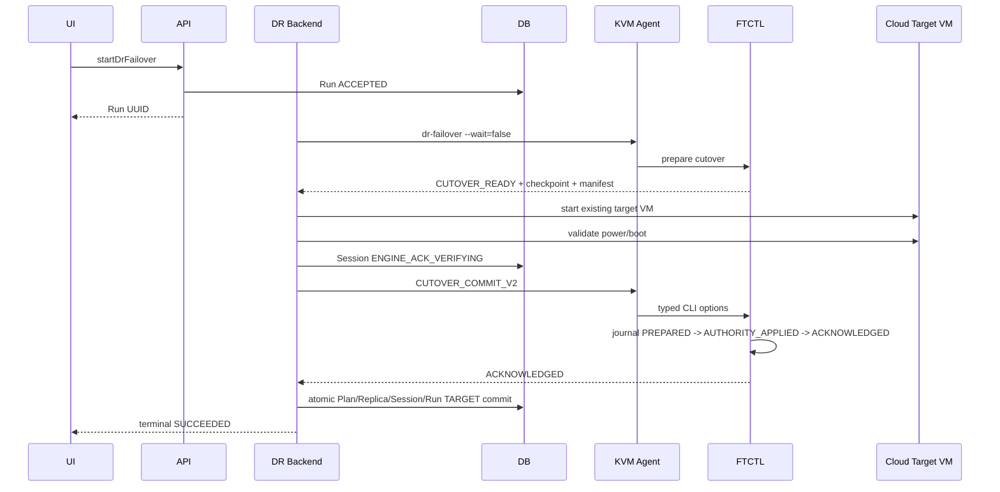

# 599. Cross Hypervisor DR Forward Cutover Commit Contract And Authority Convergence Design

> 2026-09-01 concurrency and late-failure addendum:
> `625-dr-cutover-authority-commit-serialization-and-failback-readiness-convergence-design-20260901.md`

- 작성일: 2026-08-06
- 상태: 상세 설계 완료, 실환경 read-only 및 격리 preflight 검증 완료, 구현 대기
- 적용 방향: VMware -> ABLESTACK 실제 Failover
- 적용 레이어: UI, API, DR Backend, KVM Agent, FTCTL, Cloud DB
- FTCTL 하위 설계:
  `ablestack-qemu-exec-tools/docs/ftctl/455-ftctl-dr-forward-cutover-commit-envelope-and-idempotent-ack-design-20260806.md`
- 관련 설계: 567, 577, 582, 597, 598

## 1. 목적

Cloud가 기존 DR 대상 VM을 시작하고 부팅 검증까지 성공했지만 최종
`dr-cutover-commit` 계약값이 Agent 경계에서 손실되어 Cloud와 FTCTL의 운영
권한이 분리되는 문제를 해결한다.

이번 변경은 FTCTL의 정상 동작을 다시 구현하지 않는다. 완전한 인자를 받은
FTCTL의 cutover commit과 멱등 재호출은 이미 동작한다. 따라서 다음 경계를
구조적으로 고정한다.

1. Cloud는 versioned typed commit envelope를 만든다.
2. Agent는 envelope를 검증하고 정확한 CLI option으로만 변환한다.
3. FTCTL은 write-ahead journal과 status 조회 계약으로 commit을 멱등 처리한다.
4. Cloud는 FTCTL ACK를 확인한 뒤에만 Plan과 Replica를 TARGET authority로
   원자적으로 승격한다.
5. 응답이 유실되어도 동일 attempt를 조회하거나 재전송하며 전체 Failover를
   다시 수행하지 않는다.

UI는 Agent나 FTCTL을 직접 호출하지 않는다. `startDrFailover`는 계속 비동기
Run으로 동작하며, 화면은 Cloud API의 현재 authority phase만 표시한다.

## 2. 실환경 검증 결과

### 2.1 대상

| 항목 | 값 |
| --- | --- |
| Plan UUID | `7889e625-371a-48f9-b553-54e311481170` |
| Cloud Plan ID | `41` |
| Failover Run | `e8e6d5fb-f036-40fc-9a66-badffd7c8177` / id `143` |
| Cutover Session | `69bbcaf8-d073-43cf-acdb-8216396fbb7d` / id `12` |
| Engine session | `<plan UUID>:<run UUID>` |
| Checkpoint | sequence `43`, `CBT_INCREMENTAL`, `LOCAL_DURABLE` |
| Target VM | `i-2-266-VM`, Cloud id `266`, `Running` |
| Source VM | VMware `vm-6429`, `poweredOff` |

### 2.2 레이어별 관측

| 레이어 | 관측 결과 |
| --- | --- |
| UI/API | Plan `FAILED_OVER`, protection `DEGRADED`, phase `TARGET_PROMOTED_ENGINE_PENDING` |
| API authority | `authorityconsistent=false`, `DR_AUTHORITY_TARGET_SESSION_MISSING` |
| DB Run | `RUNNING`, `engine-state-reconciliation`, progress `95` |
| DB Session | `CLOUD_PROMOTED`, engine ACK `FAILED` |
| DB Replica | `FAILED_OVER/TARGET/POWERED_ON` |
| Agent result | `DR_CUTOVER_COMMIT_INVALID` |
| FTCTL | `CUTOVER_READY`, `active_side=SOURCE`, `target_power_state=POWERED_OFF` |
| VM lifecycle | source OFF, target ON; 동시 실행 상태는 아님 |

오류 payload:

```text
DR_CUTOVER_COMMIT_INVALID
session id, checkpoint sequence, and authority generation are required
```

### 2.3 코드 원인

`FtctlDrRuntimeProjectionAdapter.sendCutoverCommit()`은 다음 값을 generic
`context` map에 넣는다.

```text
cutoverSessionId
checkpointSequence
authorityGeneration
targetPowerState
bootValidationState
```

`LibvirtFtctlDrActionCommandWrapper.executeFtctl()`은 그중
`cutoverSessionId -> --session-id`만 변환한다. 나머지 네 값은 CLI에 추가되지
않는다. 반면 `ftctl_dr_runtime_cutover_commit()`은 checkpoint와 authority를
필수값으로 검증하므로 요청을 정상적으로 거부했다.

또한 `commitCloudOwnedCutover()`는 FTCTL commit 전에 다음 DB 변경을 먼저 한다.

```text
Plan        -> FAILED_OVER / TARGET
Replica     -> FAILED_OVER / TARGET / POWERED_ON
Session     -> CLOUD_PROMOTED
```

이 순서 때문에 transport 계약 오류가 발생하면 Cloud는 TARGET, FTCTL은 SOURCE를
가리킨다. VM 전원 전환은 완료됐지만 control-plane authority가 확정되지 않은
상태이다.

### 2.4 비파괴 preflight

실제 Plan에는 commit을 재전송하지 않았다. 격리된 FTCTL self-test 환경에서 다음을
검증했다.

```text
selftest_case_dr_runtime_cloud_cutover_commit_is_idempotent: PASS
```

검증 항목:

1. 완전한 session/checkpoint/generation/power/boot 인자는
   `CUTOVER_READY -> FAILED_OVER/TARGET`으로 전환된다.
2. 동일 인자 재호출은 같은 ACK를 반환한다.
3. 낮은 authority generation은 `DR_CUTOVER_GENERATION_STALE`로 거부된다.

따라서 data plane과 FTCTL transition 함수가 아니라 Cloud-Agent command
serialization과 terminal ordering이 직접 수정 대상이다.

## 3. 권한 및 식별자 모델

### 3.1 식별자를 분리한다

현재 `cutoverSessionId` 이름은 두 의미를 혼용할 수 있다. V2에서는 다음을
분리한다.

| 필드 | 소유자 | 예시 | 용도 |
| --- | --- | --- | --- |
| `engineSessionId` | FTCTL | `<plan>:<run>` | FTCTL failover runtime identity |
| `cloudCutoverSessionUuid` | Cloud DB | `69bb...` | Cloud lifecycle/audit identity |
| `commitAttemptId` | Cloud | UUID | 재시도와 응답 유실 복구 identity |
| `commitEnvelopeSha256` | Cloud/FTCTL | 64 hex | 동일 요청과 충돌 판별 |

Cloud DB UUID를 FTCTL runtime session 비교에 사용하거나, engine session을 Cloud
Session UUID 칼럼에 저장하는 것을 금지한다.

### 3.2 authority 불변 조건

1. durable checkpoint는 FTCTL data-plane authority이다.
2. 대상 VM 생성·전원·부팅 결과는 Cloud lifecycle authority이다.
3. FTCTL TARGET ACK와 Cloud DB terminal transaction이 모두 완료돼야 Failover가
   terminal success이다.
4. ACK 전에는 `dr_plan.active_side=TARGET`을 기록하지 않는다.
5. target가 켜진 이후 오류가 나면 source를 자동으로 켜거나 target을 자동으로
   끄지 않는다.
6. 같은 envelope의 재전송은 멱등이며, 다른 envelope의 같은 attempt는 conflict다.
7. UI 표시 상태는 Plan의 단일 문자열보다 Session commit phase를 우선한다.

## 4. Forward Cutover Commit V2 계약

### 4.1 `FtctlDrActionCommand` typed field

`core/src/main/java/com/cloud/agent/api/FtctlDrActionCommand.java`에 다음 필드를
추가한다.

```java
private String cutoverCommitContractVersion;
private String cutoverEngineSessionId;
private String cloudCutoverSessionUuid;
private Long cutoverCheckpointSequence;
private String cutoverManifestSha256;
private Long cutoverAuthorityGeneration;
private String cutoverCommitAttemptId;
private String cutoverCommitEnvelopeSha256;
private Long cutoverTargetVmId;
private String cutoverTargetExternalRef;
private String cutoverTargetPowerState;
private String cutoverBootValidationState;
private String cutoverSourceFenceState;
private String cutoverSourcePowerState;
```

필수 authority 필드를 `context` map으로 보내지 않는다. context는 rolling upgrade
기간의 비권한 부가정보에만 사용한다. `ACTION_CONTRACT_VERSION`을 올리고 신규
Cloud는 capability 확인 없이 구 Agent로 commit을 보내지 않는다.

### 4.2 canonical envelope

```json
{
  "contractVersion": "DR_CUTOVER_COMMIT_V2",
  "planUuid": "7889e625-371a-48f9-b553-54e311481170",
  "runUuid": "e8e6d5fb-f036-40fc-9a66-badffd7c8177",
  "engineSessionId": "<plan>:<run>",
  "cloudCutoverSessionUuid": "69bbcaf8-d073-43cf-acdb-8216396fbb7d",
  "checkpointSequence": 43,
  "manifestSha256": "<64 hex>",
  "authorityGeneration": 43,
  "commitAttemptId": "<uuid>",
  "targetVmId": 266,
  "targetExternalRef": "ce028129-98a7-4dba-b05c-7c74ca5df398",
  "targetPowerState": "POWERED_ON",
  "bootValidationState": "POWER_STATE_VALIDATED",
  "sourceFenceState": "ACKNOWLEDGED",
  "sourcePowerState": "POWERED_OFF"
}
```

`commitEnvelopeSha256`는 위 객체를 UTF-8, 정렬된 key, 공백 없는 JSON으로
canonicalize한 SHA-256이다. secret, credential, temporary NBD/krbd device는
포함하지 않는다.

### 4.3 Agent CLI mapping

`LibvirtFtctlDrActionCommandWrapper`는 `CUTOVER_COMMIT` 전용 validator와 argument
builder를 사용한다.

```text
dr-cutover-commit
  --contract-version DR_CUTOVER_COMMIT_V2
  --plan <plan>
  --run <run>
  --engine-session-id <engine session>
  --cloud-session-id <Cloud session UUID>
  --checkpoint-sequence 43
  --manifest-sha256 <hash>
  --authority-generation 43
  --commit-attempt-id <uuid>
  --commit-envelope-sha256 <hash>
  --target-vm-id 266
  --target-external-ref <uuid>
  --target-power-state POWERED_ON
  --boot-validation-state POWER_STATE_VALIDATED
  --source-fence-state ACKNOWLEDGED
  --source-power-state POWERED_OFF
  --json
```

필수값이 없으면 FTCTL 실행 전에
`DR_CUTOVER_COMMIT_COMMAND_CONTRACT_INVALID`를 반환한다. raw context fallback은
V2에서 허용하지 않는다.

## 5. 비동기 Backend 상태 전이

### 5.1 정상 순서



### 5.2 ACK 전 상태

target VM이 시작된 뒤 FTCTL ACK 전에는 다음만 저장한다.

```text
Plan.state               = FAILING_OVER
Plan.active_side         = SOURCE
Session.state            = ENGINE_ACK_VERIFYING
Session.cloud_promotion  = POWERED_ON_PENDING_COMMIT
Replica.state            = CUTOVER_PENDING
Run.state                = RUNNING
Run.current_step         = engine-state-reconciliation
```

`operatingSide=TARGET_PENDING`은 API 계산 필드로 제공할 수 있지만 durable
authority인 `active_side`를 TARGET으로 미리 바꾸지 않는다.

### 5.3 ACK 후 단일 transaction

`completeForwardCutoverTransaction()`을 transaction service로 분리하고 다음을 한
transaction에서 갱신한다.

```text
dr_plan              FAILED_OVER / TARGET
dr_replica           FAILED_OVER / TARGET / POWERED_ON
dr_cutover_session   FAILED_OVER / ACKNOWLEDGED / completed_at
dr_plan_runtime      FAILED_OVER_UNPROTECTED / STOPPED / SUPPRESSED
dr_run               SUCCEEDED / terminal_authoritative=1
dr_run_step           engine-state-reconciliation SUCCEEDED 100
```

transaction commit 후 protection cache를 무효화하고 최신 snapshot을 재생성한다.

### 5.4 timeout과 재시작 복구

1. commit 호출 timeout이면 같은 attempt를 즉시 재실행하지 않고
   `dr-cutover-commit-status`를 조회한다.
2. journal이 `ACKNOWLEDGED`이면 Cloud terminal transaction만 수행한다.
3. `PREPARED` 또는 `AUTHORITY_APPLIED`이면 FTCTL이 reconcile한 결과를 다시
   조회한다.
4. `NOT_SUBMITTED`이면 같은 envelope를 제한 재전송한다.
5. hash/identity conflict이면 자동 재시도하지 않고 `RECOVERY_REQUIRED`로
   전환한다.
6. management 재시작 후에도 `ENGINE_ACK_VERIFYING` Session을 scheduler가 다시
   수집한다.

## 6. 레이어별 코드 설계

### 6.1 UI

대상:

```text
ui/src/views/infra/dr/DrPlanList.vue
ui/src/views/infra/dr/DrProtectionInfoTab.vue
ui/src/api/dr.js
ui/public/locales/ko_KR.json
ui/public/locales/en.json
```

- `startDrFailover` 접수 후 modal을 닫고 Run을 poll한다.
- `TARGET_POWERED_ENGINE_PENDING`을 성공이나 일반 오류로 표시하지 않는다.
- 사용자 메시지는 `대상 가상머신이 시작되었으며 전환 확정을 확인 중입니다`로
  표시한다.
- pending 동안 Failback, Reprotect, Sync, Delete, Release, Cancel을 비활성화한다.
  target power-on 이후의 일반 cancel은 안전한 rollback이 아니다.
- `ACKNOWLEDGED`와 Cloud terminal transaction 완료 후에만
  `페일오버 완료 / 보호되지 않음`을 표시한다.
- raw `DR_CUTOVER_*` payload와 내부 retry 횟수는 이벤트 상세에서만 보인다.
- stable 상태는 30초, active cutover는 3초 poll을 사용하고 전체 skeleton을 다시
  만들지 않는다.

### 6.2 API

공개 mutation API는 추가하지 않는다. `startDrFailover`는 계속 async Run을
반환한다. `DrPlanResponse`, `DrRunResponse`, protection snapshot에 다음 typed
field를 추가한다.

```json
{
  "authorityphase": "TARGET_POWERED_ENGINE_PENDING",
  "authorityconsistent": false,
  "cutovercommitstate": "STATUS_VERIFYING",
  "cutovercommitretryable": true,
  "cutovercommitattemptid": "<uuid>",
  "cutovercommitlastcheckedat": "<time>",
  "cutoverrecoveryrequired": false
}
```

기존 Plan이 `FAILED_OVER/TARGET`인데 ACK가 없으면 response builder가 이를 정상
권한으로 포장하지 않고 `TARGET_PROMOTED_ENGINE_PENDING`으로 분류한다.

### 6.3 Backend

`FtctlDrRuntimeProjectionAdapter`에서 다음 책임을 분리한다.

```text
prepareCloudTargetLifecycle()
buildForwardCutoverCommitEnvelope()
dispatchOrRecoverForwardCutoverCommit()
completeForwardCutoverTransaction()
classifyForwardCutoverRecovery()
```

- `sendCutoverCommit()`은 generic context 대신 typed setter를 사용한다.
- dispatch 전에 session/checkpoint/manifest/generation/VM evidence를 검증한다.
- `Plan FAILED_OVER`와 `Replica TARGET` 갱신을 ACK 이후로 이동한다.
- commit failure를 `engineAckState=FAILED`로 즉시 고정하지 않는다.
- retryable transport/timeout은 `STATUS_VERIFYING`, deterministic contract reject는
  `RETRY_REQUIRED`, identity conflict는 `RECOVERY_REQUIRED`로 분류한다.
- 동일 Session의 기존 target power-on evidence를 재사용하며 VM 시작이나 데이터
  복제를 반복하지 않는다.

### 6.4 Agent

- `FtctlDrActionCommand` 직렬화 round-trip test를 추가한다.
- `CUTOVER_COMMIT` 전용 typed validator를 추가한다.
- 모든 V2 CLI option을 명시적으로 추가한다.
- timeout 시 `dr-cutover-commit-status`를 조회한다.
- command, answer, log에 credential을 기록하지 않는다.
- coordinator host가 V2 capability를 광고하지 않으면 target VM 시작 전에
  Failover preflight를 차단한다.

### 6.5 FTCTL

- 기존 정상 `ftctl_dr_runtime_cutover_commit()`의 authority 적용 규칙을 유지한다.
- V2 envelope, canonical hash, write-ahead journal을 추가한다.
- `dr-cutover-commit-status`와 capability를 추가한다.
- exact replay는 같은 ACK, 같은 attempt의 다른 hash는 conflict를 반환한다.
- commit은 VM start/stop, vCenter, Cloud API를 호출하지 않는다.
- `status.state`, `authority.json`, failover session publication은 temp + fsync +
  rename으로 수행한다.

### 6.6 DB

`dr_cutover_session`에 다음 typed column을 추가한다.

```text
commit_contract_version       varchar(64)
engine_session_id             varchar(255)
commit_attempt_id             varchar(40)
commit_envelope_sha256        varchar(64)
commit_dispatch_state         varchar(32)
commit_retry_count            int not null default 0
commit_next_retry_at          datetime null
commit_last_checked_at        datetime null
```

index:

```text
UNIQUE(plan_id, commit_attempt_id)
INDEX(commit_dispatch_state, commit_next_retry_at)
```

기존 `checkpoint_sequence`, `cloud_authority_generation`, `engine_ack_state`는
유지한다. migration은 현재 Europa upgrade 규칙에 맞춰 세 schema 파일에
동일한 guarded ALTER를 반영한다.

기존 실패 행은 삭제하지 않는다. 보정 후 동일 Session/Run/attempt로 commit을
수렴시키고 audit history를 보존한다.

## 7. 현재 실패 세션 복구 설계

현재 Run 143은 전체 Failover를 다시 실행하지 않는다.

복구 전 재검증:

```text
source VMware VM            poweredOff
target Cloud VM             Running
target VM UUID/id           DB와 실제 libvirt 일치
FTCTL state                 CUTOVER_READY
engine session              <plan>:<run>
checkpoint                  43
manifest SHA-256            Session과 runtime 일치
source fence                ACKNOWLEDGED
Cloud Session               CLOUD_PROMOTED
```

복구 순서:

1. 새 코드 배포 후 coordinator capability V2 확인
2. 기존 Session에서 V2 envelope 생성
3. status 조회로 기존 journal 부재 확인
4. 같은 Run 143에 commit 한 번 전송
5. FTCTL `TARGET/ACKNOWLEDGED` 확인
6. Cloud terminal transaction 수행
7. API `authorityconsistent=true`, Run `SUCCEEDED` 확인

데이터 재동기화, source 재기동, target 재기동, 새 checkpoint 생성은 수행하지
않는다. 어떤 identity라도 일치하지 않으면 자동 복구하지 않고 현 상태를 보존한다.

## 8. 테스트 설계

### 8.1 Cloud unit test

```text
cutoverCommandSerializesEveryV2Field()
agentWrapperBuildsCompleteCutoverCli()
missingTypedCutoverFieldFailsBeforeScriptExecution()
targetPowerOnDoesNotCommitPlanAuthorityBeforeEngineAck()
engineAckCommitsPlanReplicaSessionRunAtomically()
commitTimeoutQueriesStatusBeforeRetry()
ackLostThenRecoveredDoesNotRestartTargetOrReplication()
identityConflictLeavesTargetRunningAndRequiresRecovery()
legacyPrematureTargetProjectionIsClassifiedAsPending()
```

checkpoint와 authority generation이 다른 fixture를 반드시 포함한다. 두 값이
우연히 같으면 mapping 누락을 발견하지 못할 수 있다.

### 8.2 FTCTL self-test

```text
cutover_commit_v2_rejects_missing_fields
cutover_commit_v2_rejects_hash_mismatch
cutover_commit_v2_writes_journal_before_authority
cutover_commit_v2_replays_same_envelope
cutover_commit_v2_rejects_attempt_conflict
cutover_commit_status_reports_not_submitted
cutover_commit_status_recovers_authority_applied
cutover_commit_preserves_checkpoint_and_scheduler_stop
```

### 8.3 통합 acceptance

1. Failover 요청이 즉시 Run을 반환하고 UI를 차단하지 않는다.
2. source OFF와 target ON을 확인한다.
3. ACK 전 API가 `TARGET_POWERED_ENGINE_PENDING`을 표시한다.
4. FTCTL journal과 TARGET authority를 확인한다.
5. Cloud Plan/Replica/Session/Run이 한 번에 terminal 수렴한다.
6. Agent 응답 유실을 주입해 status 기반 복구를 확인한다.
7. 동일 commit 재전송 시 중복 event/VM lifecycle/data transfer가 없다.
8. Failover 완료 후 Reprotect만 활성화되고 forward scheduler는 정지한다.

## 9. 배포 및 구현 우선순위

1. FTCTL V2 parser, journal, status, capability, self-test
2. Core typed command와 serialization test
3. KVM Agent validator/CLI mapping/status probe test
4. Backend envelope builder와 ACK 후 transaction ordering
5. DB guarded migration 및 DAO/VO
6. API projection/action gating
7. UI pending-authority 표시
8. FTCTL GitHub Actions package build 및 세 호스트 동시 배포
9. Cloud 변경 Maven module build, management class 및 Agent JAR 배포
10. 현재 Run 143의 무복제 commit 복구와 신규 Failover 재테스트

rolling upgrade 순서는 FTCTL -> Agent -> Management/UI이다. Management는 모든
coordinator가 V2 capability를 제공하기 전 target VM power-on을 허용하지 않는다.

## 10. 완료 기준

- Agent가 V2 필드 중 하나라도 누락하지 않는다.
- Cloud DB는 ACK 전에 TARGET authority를 기록하지 않는다.
- FTCTL ACK 유실은 status 조회로 복구된다.
- 같은 envelope 재호출은 멱등이다.
- Cloud, FTCTL, VM 전원 상태가 하나의 TARGET authority로 수렴한다.
- 실패 Run이 95% `RUNNING`에 영구 고착되지 않는다.
- 기존 Run 복구는 데이터 복제와 VM lifecycle을 반복하지 않는다.
- UI는 pending authority와 terminal success를 구분한다.

## 11. 오류 원인 및 AS-IS / TO-BE

| 영역 | 오류 원인 / AS-IS | TO-BE |
| --- | --- | --- |
| UI | Plan `FAILED_OVER`와 active Run이 함께 보여 의미가 충돌 | `TARGET_POWERED_ENGINE_PENDING`을 별도 표시 |
| API | DB 선승격 값을 terminal authority처럼 노출 | Session ACK를 포함한 authority consistency 우선 |
| Backend | Plan/Replica TARGET 변경 후 FTCTL commit | FTCTL ACK 후 단일 terminal transaction |
| Command DTO | authority 값이 generic context에 존재 | versioned typed V2 field와 canonical hash |
| Agent | session ID만 CLI에 전달 | 모든 필수 option 검증·전달, timeout status probe |
| FTCTL | V1 함수는 정상이나 durable attempt/status가 부족 | V2 journal, exact replay, commit-status |
| DB | engine ACK identity와 retry cursor가 불완전 | typed attempt/hash/dispatch/retry column |
| Recovery | 95% Run 고착 또는 전체 Failover 재실행 위험 | 기존 VM·checkpoint를 재사용한 commit-only 복구 |
| Safety | Cloud TARGET, FTCTL SOURCE 권한 분리 | ACK 전 pending, ACK 후 양측 TARGET 원자 수렴 |

## 12. 구현 및 운영 검증 결과 (2026-08-06)

- FTCTL commit `618e0dc`와 GitHub Actions run `31108200440`으로 Rocky 9 RPM을 생성했다.
- Cloud Core, KVM Agent, DR plugin, DB schema 변경 모듈과 UI production bundle을 빌드했다.
- FTCTL 3개 호스트, Management 변경 클래스/UI, KVM Agent 변경 클래스를 배포했다.
- `dr_cutover_session`에 contract/session/attempt/hash/state 컬럼을 반영했다.
- Run `e8e6d5fb-f036-40fc-9a66-badffd7c8177`은 기존 target VM과 checkpoint를 재사용했다.
- 재해 모드의 원본 전원 상태 `UNKNOWN`은 fence가 `ACKNOWLEDGED|VERIFIED`인 경우에만 허용한다.
- 최종 FTCTL journal은 `phase=ACKNOWLEDGED`, Cloud Session/Plan/Run은 `FAILED_OVER/TARGET/SUCCEEDED`로 수렴했다.
- API는 `cutovercommitstate=ACKNOWLEDGED`를 반환하며 Failback action을 활성화한다.
