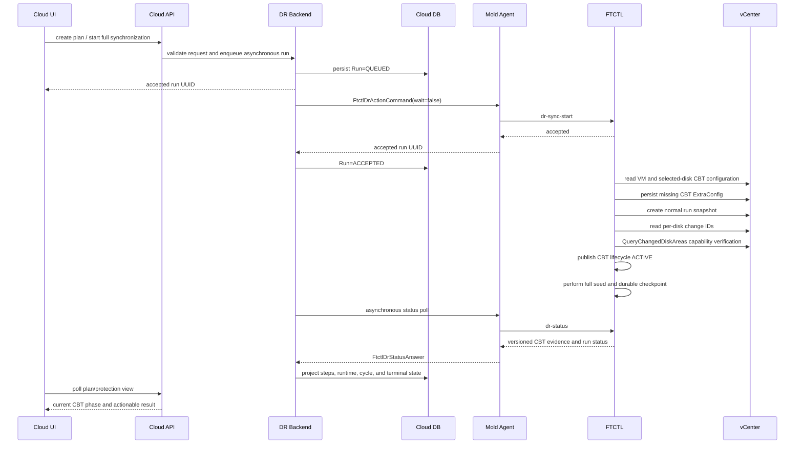

# Cross-Hypervisor DR VMware CBT Activation Convergence Design

## 1. Scope

This document defines the full-stack correction for a VMware to ABLESTACK DR
plan whose first synchronization must enable CBT on a powered-on source VM.

Affected plan and run used for diagnosis:

| Object | Value |
| --- | --- |
| plan | `d9ba2979-1f2f-4819-8784-ce26fc0aad00` |
| run | `df40cd82-ac55-473e-a4e0-4a1dc94592d7` |
| source VM | `w25-01` / `vm-18049` |
| failure | `DR_VMWARE_CBT_VERIFY_FAILED` |
| failed step | `vmware-cbt-preflight` |
| transferred bytes | `0` |

The engine-specific evidence contract is defined in the paired qemu document
`441-ftctl-dr-vmware-cbt-activation-evidence-design-20260810.md`.

Live progress after CBT readiness is defined in
`601-cross-hypervisor-dr-live-transfer-progress-projection-design-20260810.md`
and the paired qemu document
`442-ftctl-dr-live-transfer-progress-contract-design-20260810.md`. Those
documents are normative for in-flight bytes, percentage, throughput, ETA,
staleness, and UI presentation. This document remains normative for CBT
activation and evidence convergence.

## 2. Root Cause

The FTCTL preflight writes VM and disk CBT ExtraConfig through `govc vm.change`
and immediately requires the VM-level `config.changeTrackingEnabled` property
to be true. On the live source VM:

```text
config.changeTrackingEnabled=false
ctkEnabled=true
scsi0:0.ctkEnabled=true
```

A controlled temporary snapshot test then proved all of the following:

- the VM remained powered on;
- CTK files were created;
- the selected disk exposed a non-empty change ID;
- `QueryChangedDiskAreas` succeeded;
- temporary snapshots were removed;
- the VM-level Boolean still reported false.

The implementation therefore confused a non-authoritative VM summary signal
with disk-level operational CBT evidence. Previous successful tests did not
cover this branch because their source VM already reported the VM-level Boolean
as true.

## 3. Design Principles

1. UI and Cloud API stay asynchronous.
2. Cloud owns plan/run lifecycle and durable projection.
3. Mold Agent transports commands and status; it does not decide CBT policy.
4. FTCTL owns VMware CBT configuration, snapshot activation, and disk evidence.
5. A first full seed is not committed until every selected disk has valid CBT
   evidence and target durability is proven.
6. The source VM is never automatically powered off or rebooted.
7. Existing pre-enabled CBT behavior remains unchanged.

## 4. End-to-End Sequence



## 5. UI Design

### 5.1 Components

Affected components:

- `ui/src/views/infra/dr/DrPlanOverview.vue`
- `ui/src/views/infra/dr/DrProtectionInfoTab.vue`
- `ui/src/views/infra/dr/DrRunsTab.vue`
- `ui/public/locales/ko_KR.json`
- `ui/public/locales/en.json`

### 5.2 Presentation states

| API lifecycle | UI state | User-facing meaning |
| --- | --- | --- |
| `CONFIG_REQUIRED` | preparing | CBT settings must be applied. |
| `CONFIGURED_PENDING_ACTIVATION` | preparing | Settings are saved and the first snapshot will activate CBT. |
| `ACTIVATING_WITH_RUN_SNAPSHOT` | in progress | The normal replication snapshot is activating CBT. |
| `VERIFYING_DISK_EVIDENCE` | in progress | Disk change IDs and CBT query capability are being verified. |
| `ACTIVE` | ready | All selected disks are ready for incremental tracking. |
| `RETRYABLE_FAILED` | warning/retry | A transient activation or query failure occurred. |
| `FAILED` | error | Operator action or unsupported configuration blocks CBT. |

The UI must not expose `config.changeTrackingEnabled=false` as a standalone
failure when authoritative disk evidence is active.

### 5.3 Error mapping

Add localized messages for:

- `DR_VMWARE_CBT_CONFIG_FAILED`
- `DR_VMWARE_CBT_ACTIVATION_FAILED`
- `DR_VMWARE_CBT_CHANGE_ID_MISSING`
- `DR_VMWARE_CBT_QUERY_FAILED`
- `DR_VMWARE_CBT_UNSUPPORTED`

`DR_VMWARE_CBT_VERIFY_FAILED` remains mapped for historical Runs only.

The primary alert shows one concise action-oriented message. Diagnostic fields
remain in the detailed Run view and are not mixed into the main readiness card.

## 6. API Design

### 6.1 Response fields

Extend both `DrPlanResponse` and `DrRunResponse`:

```text
runtimeCbtSchemaVersion
runtimeCbtLifecycleState
runtimeCbtEnabled
runtimeCbtActivationMethod
runtimeCbtVmConfigSignal
runtimeCbtSelectedDiskCount
runtimeCbtVerifiedDiskCount
runtimeCbtRetryable
runtimeCbtMessage
```

No credential, raw vCenter session object, or plaintext change ID is exposed to
the UI. Disk-level IDs may be summarized by count; detailed redacted evidence
stays in the Run status JSON.

### 6.2 Response generator

In `DrResponseGenerator.populateCbtStatus(...)`:

- parse schema version and lifecycle state;
- prefer lifecycle state plus verified disk counts over the legacy Boolean;
- expose the nested CBT message;
- fall back to the legacy fields for old Runs;
- never derive `enabled=false` solely from the VM summary signal.

API commands remain non-blocking. No API request waits for snapshot creation,
CBT activation, or full seed completion.

## 7. Backend Design

### 7.1 Constants and projection

In `DrConstants` add the specific error codes and CBT lifecycle values.

In `FtctlDrRuntimeProjectionAdapter`:

1. Read the versioned `cbt_status` object.
2. Project non-terminal CBT lifecycle states without failing the Run.
3. Record each phase as a `dr_run_step` update.
4. Treat `RETRYABLE_FAILED` according to FTCTL retry metadata.
5. Mark a Run terminal only after FTCTL publishes a specific terminal error.
6. Promote nested `cbt_status.message` when top-level `error_message` is absent.
7. Do not set replica or replica-disk state to `ERROR` for an in-progress
   activation phase.

Suggested helper methods:

```java
private DrCbtProjection parseCbtProjection(JsonObject runtime)
private boolean isCbtActivationInProgress(DrCbtProjection cbt)
private String resolveCbtFailureMessage(JsonObject runtime, String errorCode)
private void projectCbtRunStep(DrRunVO run, DrCbtProjection cbt)
```

### 7.2 Retry behavior

- Configuration saved but not yet snapshot-activated is not a retry event.
- vCenter task/session timeout can be retried with the same Run owner contract.
- A retry must not dispatch a second worker while the first worker is alive.
- A stale activation snapshot is cleaned or safely reused only through FTCTL
  evidence; Cloud does not manipulate vCenter snapshots directly.

### 7.3 Plan state

During activation:

```text
plan.state=RECOVERING or SYNCING
runtime.protection_state=PREPARING
run.state=ACCEPTED/RUNNING
```

After durable first seed:

```text
plan.state=READY
runtime.protection_state=READY
runtime.baseline_state=VALID
```

Terminal CBT failure projects `ERROR`, but source and target data readiness stay
false and no restore point is published.

## 8. Agent Design

Affected wrappers:

- `LibvirtFtctlDrActionCommandWrapper`
- `LibvirtFtctlDrStatusCommandWrapper`
- `FtctlDrStatusAnswer`

The Agent remains transport-only:

- start command uses `wait=false`;
- accepted Run UUID is returned immediately;
- status polling carries CBT lifecycle and specific retry metadata;
- the wrapper preserves UTF-8 and does not truncate the actionable message;
- credentials remain in the existing protected runtime credential file and are
  never returned in an Answer.

No Agent-side snapshot or CBT decision logic is introduced.

## 9. FTCTL Design Boundary

FTCTL implements the paired qemu design:

- configure VM/disk ExtraConfig;
- mark activation pending rather than failing immediately;
- create the normal plan/run-scoped source snapshot;
- require per-disk change ID and successful CBT query;
- use the same snapshot for VDDK source-open and full seed;
- publish versioned evidence and deterministic cleanup state;
- persist the first baseline only after target durability.

The VM-level `config.changeTrackingEnabled` value is diagnostic only.

## 10. DB Design

No schema migration is required for the first implementation.

Existing tables are used as follows:

| Table | Use |
| --- | --- |
| `dr_run` | asynchronous owner, terminal error, retry metadata, compact status JSON |
| `dr_run_step` | configure, activate, verify, transfer, durable-commit phases |
| `dr_plan_runtime` | current protection state, activity, baseline, and error projection |
| `dr_sync_cycle` | cycle mode, transfer metrics, committed change baseline |
| `dr_restore_point` | created only after durable target commit |
| `dr_replica` / `dr_replica_disk` | target readiness; never ready from CBT config alone |

Recommended step names:

```text
vmware-cbt-configure
vmware-cbt-activate-snapshot
vmware-cbt-verify-disks
full-seed-transfer
target-durable-commit
```

`last_status_json` stores compact redacted evidence. Full raw vCenter responses
are not persisted.

## 11. Validation Plan

### 11.1 Unit tests

- FTCTL shell/Python tests for all CBT lifecycle transitions.
- Agent wrapper round-trip tests for lifecycle, message, and retry fields.
- Projection adapter tests proving pending activation is non-terminal.
- Response generator tests for schema v2 and legacy fallback.
- UI tests for state labels and specific errors.

### 11.2 Module/build tests

- qemu package tests through GitHub Actions.
- changed Cloud Maven modules from the WSL ext4 clone.
- UI lint/unit/build with dark-mode visual inspection.

### 11.3 Live smoke

1. Clean failed runtime evidence without deleting the plan configuration.
2. Start one asynchronous full synchronization.
3. Confirm configure -> snapshot activation -> disk verification.
4. Confirm full seed and target durability.
5. Modify source data and wait one RPO cycle.
6. Confirm CBT incremental mode and non-full transferred bytes.
7. Confirm no source snapshot leak and no credential exposure.

## 12. Implementation Priority

1. FTCTL disk-evidence authority and activation state machine.
2. FTCTL snapshot cleanup, retry, and top-level message publication.
3. Agent/answer field preservation.
4. Backend non-terminal projection and specific failure mapping.
5. API response fields and legacy compatibility.
6. UI states, localized messages, and tests.
7. Builds, package deployment, failed-run cleanup, and live full/incremental
   retest.

## 13. AS-IS / TO-BE

| Layer | AS-IS | TO-BE |
| --- | --- | --- |
| UI | Generic terminal CBT failure | Preparing/activating/verifying/ready states and actionable errors |
| API | Legacy Boolean and nested message | Versioned lifecycle, verified counts, retryability, concise message |
| Backend | Immediate exit 79 becomes non-retryable terminal Run | Pending activation stays asynchronous; specific failures project correctly |
| Agent | Carries aggregate status | Preserves lifecycle, evidence summary, and retry metadata without policy logic |
| FTCTL | ExtraConfig then immediate VM Boolean hard gate | Configure, activate with run snapshot, verify every disk by change ID/query |
| DB | Run ends before a cycle starts | Existing Run/Step/Runtime tables record all activation phases |
| VMware | Powered-on config may be saved but not proven | Normal run snapshot establishes operational disk CBT evidence |
| Safety | Generic failure with empty top-level message | No automatic power cycle, deterministic cleanup, no data commit before proof |

## 14. Implementation Result (2026-08-10)

- Plan and Run APIs expose `runtimecbtlifecyclestate` and
  `runtimecbtvmconfigsignal` while retaining `runtimecbtenabled` for
  compatibility.
- Runtime compaction preserves the lifecycle and VM signal and projects the
  first selected disk ID without persisting a second CBT truth in the DB.
- Nested CBT activation failures are promoted into the Plan runtime error when
  the mover reports an evidence-stage failure.
- The UI renders configured-but-pending separately from disabled and renders
  ACTIVE only for snapshot-query-backed evidence.
- No DB migration is required; the existing runtime status JSON remains the
  transport and cache boundary.
