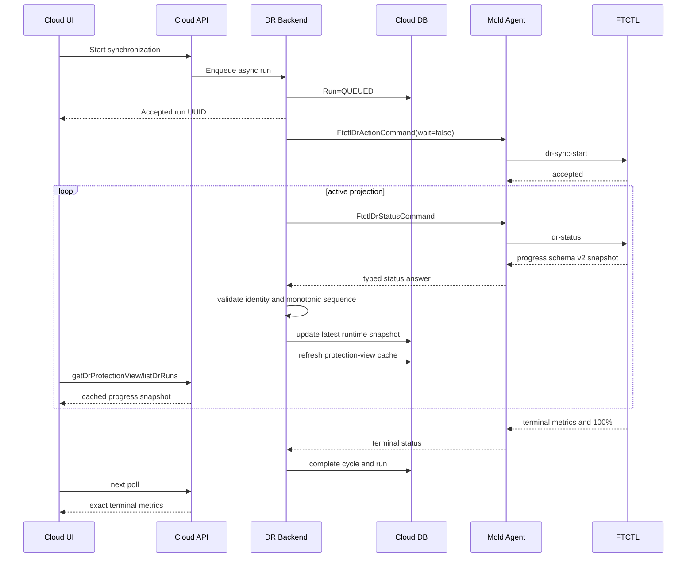

# Cross-Hypervisor DR Live Transfer Progress Projection Design

- Date: 2026-08-10
- Status: corrective build and deployment complete; live acceptance pending
- Scope: UI, Cloud API, DR backend, Mold Agent, FTCTL status transport, Cloud DB
- Engine contract: qemu document
  `442-ftctl-dr-live-transfer-progress-contract-design-20260810.md`

## 1. Purpose

The DR user must see whether data is moving, how much has moved, and whether the
transfer has stalled. A phase constant such as 40% is not an acceptable data
transfer progress indicator.

This design preserves the asynchronous architecture:

```text
UI -> Cloud API -> DR backend -> Mold Agent -> FTCTL
UI <- cached API projection <- Cloud DB <- periodic status answer <- FTCTL
```

The UI never opens a host connection, reads RBD, or waits synchronously for a
copy command. FTCTL publishes engine facts; Cloud validates and caches the
latest snapshot; the UI polls only Cloud APIs.

## 2. Confirmed Root Cause

The live plan `ef73f5f3-9740-4bbd-8c9a-74a972e5f19f` proved that a 100 GiB
full seed was actively copying while Cloud still exposed:

```text
current step = full-seed-transfer
operation progress = 40
transfer activity = UNKNOWN
transfer payload bytes = 0
```

Corrective run `8aa9d51f-3d29-4236-9c5b-c7427bee4675` later completed cycle
25 with `107374182400` payload bytes in about 269 seconds. Its journal had only
three samples and `bytesTotal=0`; the next scheduled CBT cycle was healthy.
The problem is therefore live telemetry and cache freshness, not completed
cycle accounting or the successful data path.

The full-stack causes are:

1. the FTCTL helper reads only child stderr, while the deployed qemu progress
   stream can arrive on stdout;
2. aggregate `virtualBytes` is emitted as a quoted JSON string and rejected by
   the shell integer guard, producing `bytesTotal=0`;
3. `DrRunProgress.vue` has no transfer-preparing state, so the workflow phase
   constant is the only visible number before a valid sample;
4. `DrProjectionScheduler` always takes the first configured batch, allowing
   plans beyond that batch to retain stale cache data indefinitely;
5. manual `refreshDrProtectionView` proves the DB/API projection can converge
   once a current engine snapshot is requested.

## 3. Design Rules

1. **One engine authority:** FTCTL owns transfer bytes, percentage, rate, and
   heartbeat.
2. **Two progress values:** workflow progress and data transfer progress are
   separate API fields and separate UI labels.
3. **Latest snapshot in DB:** live samples update one runtime row; they do not
   create an event or history row for every sample.
4. **Terminal history stays exact:** `dr_sync_cycle` remains the durable record
   of completed full/incremental/no-change metrics.
5. **Monotonicity:** Cloud rejects old cycle/sample sequences and byte
   regressions.
6. **No synchronous UI:** refresh and actions return immediately and continue
   through the existing polling/cache path.
7. **No false failure:** delayed progress is rendered as stale before it can be
   promoted to an operation failure.

## 4. End-To-End Sequence



## 5. Agent Contract

### 5.1 `core/.../FtctlDrStatusAnswer.java`

Add nullable fields and ordinary accessors:

```text
transferProgressSchemaVersion : Integer
transferCycleSequence         : Long
transferSampleSequence        : Long
transferPhase                 : String
transferMode                  : String
transferBytesTotal            : Long
transferBytesProcessed        : Long
transferSourceReadBytes       : Long
transferTargetWrittenBytes    : Long
transferVerifiedBytes         : Long
transferPercent               : Double
transferThroughputBps         : Long
transferEtaSeconds            : Long
transferCurrentDiskIndex      : Integer
transferDiskCount             : Integer
transferProgressEstimated     : Boolean
transferProgressSampledAtEpochMs : Long
transferProgressStale         : Boolean
```

Keep `transferActivityState` and `transferPayloadBytes` for compatibility.
`transferPayloadBytes` maps to the schema-v2 `payloadBytes` value.
The Agent transports epoch milliseconds exactly; the backend converts that
value to `Date` only when writing the DB/API projection.

### 5.2 `LibvirtFtctlDrStatusCommandWrapper.java`

Parse the new snake-case FTCTL fields with strict numeric bounds:

- bytes and sequences must be non-negative;
- percentage must be finite and between 0 and 100;
- disk index must be lower than disk count;
- the wrapper must not calculate progress from process age or output text;
- unsupported schema versions leave the new fields null and retain the legacy
  fields.

The Agent remains a transport. It must not persist history or decide whether a
full seed should be retried.

## 6. Backend Projection

### 6.1 `FtctlDrRuntimeProjectionAdapter.java`

Introduce a value object `DrLiveTransferProgress` created from the typed answer
with status-JSON fallback. Validate it before mutating DB state.

Acceptance order:

```text
new cycle sequence > stored cycle sequence
OR
same cycle sequence AND new sample sequence > stored sample sequence
```

Reject and log, without overwriting the cache:

- a lower cycle sequence;
- a non-increasing sample sequence from the same authority generation;
- decreasing bytes in one cycle;
- plan/run identity mismatch;
- percent inconsistent with bytes by more than one percentage point;
- a sample timestamp unreasonably in the future.

Projection writes are throttled to avoid excessive DB updates. Persist when any
of these is true:

- state or phase changed;
- percentage advanced by at least 1 point;
- processed bytes advanced by at least 16 MiB;
- five seconds elapsed since the previous persisted sample;
- the sample became stale or terminal.

The adapter maps raw transfer progress into workflow progress only for the run
step. The mapping follows the existing Cloud orchestration milestones and must
not reuse the engine's phase-local percentage directly:

```text
prepare                 = 0..20
dispatch and acceptance = 20..70
data transfer           = 70 + round(transferPercent * 0.25)  # 70..95
target materialization  = 97
terminal state          = 100
```

The runtime-projection step stores the maximum of its previous value and the
newly mapped value. API whole-operation progress is the maximum progress among
all run steps, with the same transfer mapping applied while a schema-v2 SYNC
sample is active. This prevents the accepted 70% milestone from regressing to
an engine-local value such as 1% or 40%. The UI treats the API value as
authoritative and applies the same 70..95 transfer floor only as a defensive
compatibility fallback for a stale or mixed-version response. This mapping must
never replace the raw transfer fields.

### 6.2 Runtime compaction

`compactRuntimeStatusJson` preserves the complete transfer schema-v2 subset.
Unknown fields and all credential/provider connection details are discarded.
The compact JSON is diagnostic fallback; typed columns are the normal query
path.

### 6.3 Reconciliation and terminal state

- Active + fresh sample: `reconciliation_state=LIVE`.
- Active + stale sample + matching live worker: `STALE_PROGRESS`, warning only.
- Stale sample + dead/mismatched worker: `STALLED`, mutation gating applies.
- Terminal success: exact cycle metrics overwrite the live counters and set
  transfer percent 100.
- Terminal failure: retain the last processed byte count and expose the typed
  error; do not reset to zero.

## 7. Database Design

`dr_plan_runtime` stores only the latest live snapshot. Add columns through the
existing idempotent migration convention in
`engine/schema/src/main/resources/META-INF/db/schema-42210to42300.sql` and keep
`setup/db/create-schema.sql` synchronized.

| Column | Type | Purpose |
| --- | --- | --- |
| `transfer_progress_schema_version` | `int unsigned NULL` | FTCTL progress schema |
| `transfer_cycle_sequence` | `bigint unsigned NULL` | cycle ordering key |
| `transfer_sample_sequence` | `bigint unsigned NULL` | sample ordering key |
| `transfer_phase` | `varchar(32) NULL` | transfer/verify/commit phase |
| `transfer_mode` | `varchar(32) NULL` | full seed/reseed/incremental/no-change |
| `transfer_bytes_total` | `bigint unsigned NULL` | logical cycle total |
| `transfer_bytes_processed` | `bigint unsigned NULL` | current logical progress |
| `transfer_source_read_bytes` | `bigint unsigned NULL` | live source bytes |
| `transfer_target_written_bytes` | `bigint unsigned NULL` | live durable writer bytes |
| `transfer_verified_bytes` | `bigint unsigned NULL` | verification progress |
| `transfer_percent` | `decimal(5,2) NULL` | raw data transfer percentage |
| `transfer_throughput_bps` | `bigint unsigned NULL` | moving-window rate |
| `transfer_eta_seconds` | `bigint unsigned NULL` | bounded ETA |
| `transfer_current_disk_index` | `int unsigned NULL` | current zero-based disk |
| `transfer_disk_count` | `int unsigned NULL` | selected disk count |
| `transfer_progress_estimated` | `tinyint(1) NOT NULL DEFAULT 0` | in-flight estimate marker |
| `transfer_progress_sampled_at` | `datetime NULL` | engine sample time |
| `transfer_progress_stale` | `tinyint(1) NOT NULL DEFAULT 0` | stale snapshot marker |

No new per-sample table is created. `dr_sync_cycle` already contains the
terminal metrics required for history. The existing
`dr_plan_view_cache.payload_json` receives the latest normalized fields during
cache refresh.

The current test cluster requires the same idempotent column additions to be
applied once during deployment because its version migration has already run.

## 8. API Design

Expose the same serialized names from `DrPlanResponse` and `DrRunResponse`:

```text
transferprogressschemaversion
transfercyclesequence
transfersamplesequence
transferphase
transferactivitystate
transfermode
transferbytestotal
transferbytesprocessed
transfersourcereadbytes
transfertargetwrittenbytes
transferpayloadbytes
transferverifiedbytes
transferpercent
transferthroughputbps
transferetaseconds
transfercurrentdiskindex
transferdiskcount
transferprogressestimated
transferprogresssampledat
transferprogressstale
```

`progresspercent` remains whole-operation progress for compatibility. API
documentation must explicitly state that it is not transfer percentage.

`getDrProtectionView` returns one `liveTransfer` object containing these
fields. API reads return the cached DB projection and never synchronously call
the Agent. `refreshDrProtectionView` remains an asynchronous refresh request,
not a host wait.

## 9. UI Design

### 9.1 `DrRunProgress.vue`

Render two levels only while a transfer is active:

1. the existing whole-operation phase/status;
2. a clearly labelled **Data transfer** progress block.

The data block displays:

```text
Data transfer 23.31%
23.31 GiB / 100.00 GiB | 399 MiB/s | about 3m 17s remaining | Disk 1/1
```

Rules:

- use `transferpercent`, never `progresspercent`, for the data bar;
- retain the last valid sample when one API response lacks progress fields;
- reset only when `transfercyclesequence` increases;
- never allow a lower `transfersamplesequence` to move the bar backward;
- show `Estimated` for active full-seed values and remove it at terminal exact
  metrics;
- for no-change cycles display `No changed data` rather than `0%`;
- use IEC byte units consistently;
- expose `aria-valuemin`, `aria-valuemax`, and `aria-valuenow`.

### 9.2 Stale and stalled states

| Condition | UI |
| --- | --- |
| fresh active sample | animated active bar |
| stale sample, worker alive | amber `Progress update delayed`; keep last bytes |
| stale sample, worker dead | red `Transfer stopped`; show last bytes and recovery action |
| failed terminal | failure state plus last processed/total bytes |
| completed | 100%, exact terminal bytes and duration |

Do not show an infinite spinner as the only indicator during a transfer.

### 9.3 Polling and rendering

`DrPlanList.vue` already prevents overlapping requests. Adjust the intervals to:

- visible detail with active transfer: 2 seconds;
- active non-transfer operation: 5 seconds;
- enabled steady protection: 10 seconds;
- hidden tab or unmounted view: no polling.

The Cloud projection scheduler default remains 10 seconds for idle plans, but
active plans need a fast lane at 2 seconds. That fast lane processes only plans
whose runtime has an active worker/transfer and preserves the existing global
lock and batch bound.

Add `dr.projection.scheduler.active.interval=2`. Run the scheduler at the
smaller of active and idle intervals, then select due plans from DB state:

- active transfer/worker rows are due after the active interval;
- other enabled plans are due after `dr.projection.scheduler.interval`;
- the existing batch size applies with active rows first;
- one plan cannot be projected concurrently by two management servers because
  the existing global lock remains authoritative.

Silent refresh updates the progress fields in place. It must not clear cards,
replace the page with a skeleton, or discard the last valid sample.

### 9.4 Dark mode

Use the existing DR token variables for surface, border, text, warning, error,
and success states. The transfer bar, stale ribbon, byte labels, and ETA must
meet the same contrast rules as the standard volume detail view. No literal
light alert background is permitted in dark mode.

## 10. Tests And Preflight

### 10.1 Agent/backend

- schema-v2 JSON to typed answer round trip;
- legacy status fallback;
- old/out-of-order sample rejection;
- byte regression rejection;
- DB write throttling;
- stale-to-stalled transition;
- exact terminal overwrite;
- Plan, Run, and protection-view response serialization;
- no secret values in compact JSON.

### 10.2 UI

- workflow and transfer percentages render independently;
- 0%, intermediate, no-change, stale, failed, and completed states;
- multi-disk text and IEC byte formatting;
- out-of-order response does not move backward;
- background polling stops on hidden/unmount;
- dark-mode screenshot at desktop and narrow viewports;
- long labels and byte values do not overflow.

### 10.3 Live acceptance

1. Start a new full seed from a clean plan.
2. Observe at least three increasing FTCTL journal samples.
3. Confirm Agent, DB, API, and UI show the same cycle/sample identity and bytes.
4. Confirm UI transfer percent advances before the copy ends.
5. Confirm completed bytes equal `dr_sync_cycle.transfer_payload_bytes`.
6. Modify source data and observe an incremental cycle with a smaller total.
7. Pause updates for longer than the stale threshold and confirm warning, then
   resume without losing progress.

## 11. Implementation Priority

1. **P0 FTCTL:** publish forward full-seed and CBT live progress schema v2.
2. **P0 Agent:** transport every schema-v2 field without interpretation.
3. **P0 Backend/DB:** monotonic validation, latest-snapshot persistence, stale
   classification, and terminal reconciliation.
4. **P0 API/UI:** separate workflow progress from transfer progress and show
   bytes/rate/ETA.
5. **P1 Scheduler:** active-run-first 2-second projection fast lane, fair
   round-robin idle batches, and DB write throttling.
6. **P1 Validation:** full-seed, incremental, stale/recovery, and dark-mode
   acceptance.
7. **P2 Analytics:** historical throughput trends only after correctness is
   proven; no per-sample history in phase 1.

## 12. AS-IS / TO-BE

| Layer | AS-IS | TO-BE |
| --- | --- | --- |
| UI | Fixed workflow 40/60 appears to be transfer progress | Separate live data bar with bytes, rate, ETA, disk, and stale state |
| API | Activity plus one byte field | Versioned complete transfer snapshot; workflow progress remains separate |
| Backend | Copies legacy fields and fixed engine phase progress | Validates identity/order, throttles writes, maps workflow range, preserves raw progress |
| Agent | Parses activity and payload only | Typed lossless schema-v2 transport with legacy fallback |
| FTCTL | Forward transfer produces no live journal | Atomic monotonic journal for full, incremental, reverse, verify, and terminal states |
| DB | Latest activity/payload only | Queryable latest transfer snapshot; terminal history remains in `dr_sync_cycle` |
| Polling | UI polls but values do not advance; a fixed first batch can starve later plans | 2s active-run-first projection, fair idle rotation, 2s active UI polling, no overlapping requests |
| Failure semantics | Slow and stalled look identical | Fresh, stale, stalled, failed, and completed are distinct |
| Accuracy | RBD growth or elapsed time may be tempting proxies | Logical engine bytes are authoritative; RBD allocation is diagnostic only |

## 13. Next Action

Do not proceed to failover testing solely on build and deployment acceptance.
The corrective FTCTL parser/byte-total patch and Cloud scheduler/UI patch are
deployed. Rerun one full-reseed and one incremental cycle while comparing all
six layers before declaring functional PASS.

## 14. Implementation Result

The P0 projection path is implemented end to end:

- the KVM Agent wrapper transports the schema-version 2 snapshot as typed
  `FtctlDrStatusAnswer` fields and retains legacy fallback parsing;
- `FtctlDrRuntimeProjectionAdapter` persists the latest sample in
  `dr_plan_runtime`, while its compact JSON cache retains every field required
  for UI rendering;
- Plan, Run, and protection-view APIs expose raw transfer percent, bytes,
  throughput, ETA, disk identity, heartbeat time, estimated state, and stale
  state independently of whole-operation progress;
- the active projection interval is two seconds and the detail view polls at
  two seconds without replacing the current page with a loading skeleton;
- `DrRunProgress.vue` renders a dedicated transfer block using existing DR
  light/dark tokens and preserves the last valid sample when a heartbeat is
  stale;
- schema creation and both applicable Europa upgrade scripts add only a latest
  snapshot to `dr_plan_runtime`; per-sample history is intentionally omitted.

Build acceptance requires the changed Maven modules and UI production bundle
to succeed. Deployment acceptance additionally requires all new DB columns,
Agent/management services, active webapp markers, and installed FTCTL scripts
to be verified. Functional acceptance still requires a user-started full seed
and subsequent CBT cycle so monotonic samples and exact terminal bytes can be
compared across FTCTL, Agent, DB, API, and UI.

### 14.1 Build And Deployment Evidence

The corrective implementation build and deployment completed with the
following evidence:

- `core` was installed and the disaster-recovery plugin was packaged from the
  WSL ext4 checkout; the complete DR plugin suite passed 123 tests with zero
  failures or errors;
- focused UI API/view tests passed 11 tests and the production UI bundle built
  successfully;
- FTCTL GitHub Actions run `31362359087` built and uploaded the RPM for commit
  `2a9f778`; its optional GitHub Release publication step alone was rate-limited;
- the uploaded Actions artifact with SHA-256
  `d5da081c05e81dab5327c288a353feb7c9c79572991fdd958f617702efe9e4bd`
  was installed on all three DR compute hosts;
- every `mold-agent` returned active and the installed progress helper passed
  a schema-version 2 non-zero-total smoke test on all three hosts;
- the management JAR was updated with only the three
  `DrProjectionScheduler` class files required by the fair projection change;
- the UI deployment updated only static assets, preserved `WEB-INF`, retained
  the required asynchronous FTCTL markers, and added the transfer-preparing
  marker;
- `mold` returned active and `/client/` returned HTTP 200 after deployment;
- no Agent DTO or DB schema change is required by this corrective patch because
  the existing schema-version 2 transport and latest-snapshot columns remain
  the authoritative contract;
- plan `ef73f5f3-9740-4bbd-8c9a-74a972e5f19f` is `READY/ENABLED/SOURCE`, has
  no active API run, and its host scheduler remains active for periodic CBT.

The first periodic cycle after the final FTCTL deployment completed as cycle
36 with 1,638,400 bytes in `CBT_INCREMENTAL` mode. FTCTL emitted a valid
schema-version 2 terminal sample without a snapshot-tree traceback, and Cloud
converged to `latest_completed_cycle_sequence=36`, `READY`, `WITHIN_RPO`, and
`CONSISTENT`.

The environment is therefore build- and deployment-ready. Runtime acceptance
is intentionally pending the operator action: run **Full resynchronization** on
the ready `w25-01 DR Plan`, observe multiple increasing live samples, then
allow the following scheduled CBT cycle to complete and compare its exact
payload across FTCTL, DB, API, and UI.

### 14.2 Corrective implementation after live 40% freeze

- FTCTL consumes qemu progress from a merged stdout/stderr pipe and keeps
  wrapper stdout machine-readable;
- FTCTL normalizes string or numeric disk sizes before aggregate byte math;
- the Cloud projection scheduler prioritizes active runs and rotates idle plan
  batches so a plan cannot be permanently excluded by batch ordering;
- the UI labels the fixed phase value as overall operation progress and shows
  a transfer-preparing state until a schema-v2 sample with a non-zero total is
  available;
- the next acceptance run must show at least three increasing samples, a
  non-zero total, current cache age, and terminal byte equality before PASS.

### 14.3 Protection-view transfer authority convergence

The live acceptance run exposed a projection split: operation history received
the schema-version 2 sample, but `dr_plan_runtime` was refreshed first from a
plan-authority response containing schema 0 and zero bytes. The protection tab
then merged runtime data over run data and hid a valid 11 GiB / 100 GiB sample.

The corrected contract is:

1. FTCTL plan authority projects the correlated active journal.
2. Cloud persists the plan-authority sample, then may apply a correlated
   operation sample as a monotonic defensive overlay.
3. The overlay is accepted only for schema version 2+, non-zero total bytes,
   matching run ownership, and a cycle/sample pair that is not older than the
   persisted pair.
4. A schema-0 or zero-total response never clears a valid live sample. Clearing
   occurs only after a correlated terminal/idle transition.
5. The UI selects a valid run/runtime candidate by cycle and sample sequence;
   it never performs an unordered object merge in which an empty cache wins.
6. A retryable status-poll lock is suppressed as a warning when a newer valid
   transfer sample proves that the data path is progressing.

No DB migration is required. Existing `dr_plan_runtime.transfer_*` columns and
the compact status cache hold the latest snapshot; history remains terminal
cycle/run data rather than per-sample rows.

| Layer | AS-IS | TO-BE |
| --- | --- | --- |
| FTCTL | Operation scope has live progress; plan scope emits zeroes | Both scopes expose the same correlated journal telemetry |
| Cloud | Plan projection can overwrite live telemetry before operation refresh | Correlated monotonic operation overlay preserves the newest valid sample |
| DB | Valid schema-v2 row can regress to schema 0/0 B | Cycle/sample ordering prevents regression; terminal convergence clears deliberately |
| API | Run can contain progress while protection runtime does not | Run and protection view expose one coherent live sample |
| UI | `Object.assign(run, runtime)` lets empty runtime fields win | Candidate selection prefers valid schema-v2 data and the newest cycle/sample |
| Retry notice | A short status lock is shown as a transfer problem | Progressing data suppresses the transient busy warning |

Acceptance requires a full resynchronization with at least three increasing
samples visible simultaneously in operation history and protection information,
followed by exact terminal byte equality and one successful CBT incremental
cycle. UI polling must remain asynchronous and must not clear the current view.

### 14.4 Whole-operation progress convergence

The live full-reseed acceptance run completed successfully but exposed a second
projection split: the schema-v2 transfer block advanced to 22% while the whole
operation bar showed 1%. The operation was not stalled. FTCTL's accepted
response and the `runtime-projection` row carried a phase-local value, while
`DrResponseGenerator` selected only the last step instead of preserving the
already completed Agent acceptance milestone.

The corrective contract is:

1. FTCTL continues to publish raw transfer percentage and engine phase facts.
2. Cloud alone maps those facts to whole-operation progress using the milestone
   ranges above.
3. Runtime-projection writes and API responses are monotonic within one run.
4. `progresspercent` remains whole-operation progress; `transferpercent`
   remains byte-transfer progress.
5. UI never labels raw transfer percentage as whole-operation progress and
   defensively rejects a mixed-version regression.
6. No Agent, FTCTL, or DB schema change is required.

| Layer | AS-IS | TO-BE |
| --- | --- | --- |
| UI | Whole operation can show 1% while data transfer is 22% | Backend value is primary; schema-v2 transfer supplies a defensive 70..95 floor |
| API | `progresspercent` is the last ordered step value | Maximum run milestone plus active transfer mapping |
| Backend | Engine-local progress overwrites runtime-projection progress | One shared monotonic Cloud workflow calculator |
| Agent/FTCTL | Correctly reports phase-local and raw transfer facts | Contract unchanged; no Cloud workflow calculation |
| DB | Runtime-projection row can decrease from accepted 70 to 1 | Existing step row retains its maximum progress |

Build acceptance requires the DR plugin tests, focused UI component tests, and
the production UI bundle to pass. Deployment acceptance requires changed Cloud
classes only, static UI deployment that preserves `WEB-INF`, `/client/` HTTP
200, and active bundle markers for both operation and transfer progress.

### 14.5 Whole-operation corrective deployment evidence

The whole-operation convergence patch was built and deployed on 2026-08-10
with the following evidence:

- the complete disaster-recovery plugin suite passed 129 tests with zero
  failures or errors;
- the focused `DrRunProgress` UI suite passed four tests, including the mixed
  version `1% / 22% -> 76%` correction and a no-regression `90%` case;
- the production UI build completed successfully;
- only `DrSyncWorkflowProgress`, `FtctlDrRuntimeProjectionAdapter`, and
  `DrResponseGenerator` classes were updated in the active Cloud JAR;
- the UI build updated static assets only and preserved the active
  `/usr/share/cloudstack-management/webapp/WEB-INF` directory;
- `mold` returned active, `/client/` returned HTTP 200, and the active page
  referenced `js/app.0c98e98e.js`;
- the active non-source-map bundle contains `transferWorkflowFloor` together
  with the existing `blockingLoadingState`, `fetchSyncProgress`, and
  `extractJobId` asynchronous UI markers;
- the signed Cloud API returns plan
  `ef73f5f3-9740-4bbd-8c9a-74a972e5f19f` as
  `READY/ENABLED/SOURCE` with a `RUNNING/HEALTHY` scheduler;
- its latest run is terminal `SUCCEEDED`, the API reports
  `progresspercent=100`, and DB runtime telemetry reports schema version 2,
  `COMPLETE`, and `107374182400 / 107374182400` bytes;
- there is no active manual run or recorded plan error, so no cleanup or DB
  correction is required before the acceptance rerun.

The remaining acceptance action is operator-driven: start one **Full
resynchronization** for that plan. During active transfer, the operation bar
must remain monotonic in the 70..95 range while the independent transfer bar
advances from 0..100. Terminal convergence must show 100% in both views. A
single screenshot or sample is insufficient; capture at least three increasing
samples before declaring PASS.
